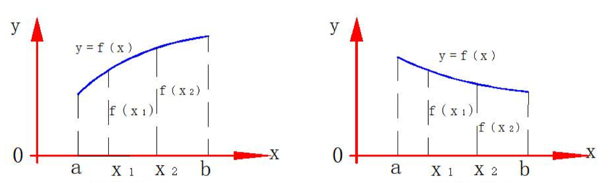
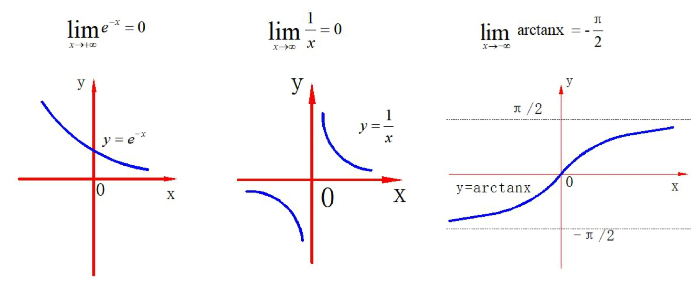
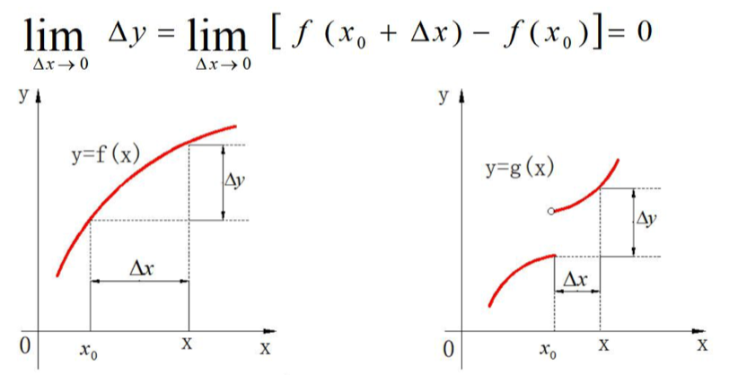
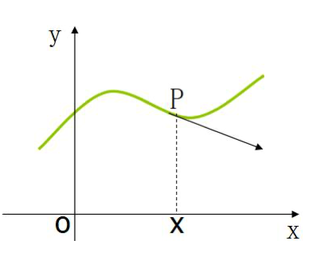
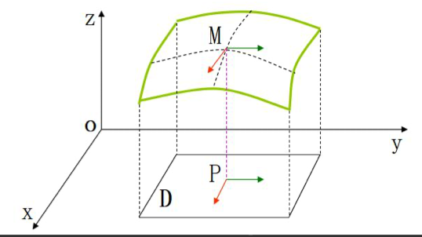
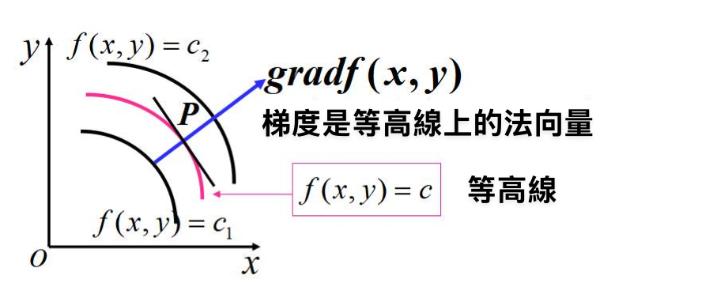

[TOC]

# 數學基礎

## 函數

* 函數的定義：變量和變量之間的關係，如$A = \pi r^2$、$y = f(x)$
    * $x$是自變量，$y$是應變量
    * 符號只是一種表示，也可以：$y = g(x), y = \varphi(x), y = \psi(x)$
* 函數的類型：
    * 分段函數：$f(x)= \begin{cases} \sqrt{x}, & x \geq 0 \\ -x, & x < 0 \end{cases}$
    * 反函數：$h = \frac{1}{2}gt^2 \rightarrow h = h(t) \quad t = \sqrt{\frac{2h}{g}} \rightarrow t = t(h)$
* 函數的特性
    * 奇函數：y軸對稱，$f(-x) = f(x)$，如$f(x) = x^2$
    * 偶函數：原點對稱，$f(-x) = -f(x)$，如**$f(x) = x^3$**
    * 週期性：$f(x+T) = f(x)$
    * 單調性：

## 極限

對於數列$a_n$如果當n接近無限大時，其通項無限接近於一個常數C，則稱該數列以C為極限或稱數列收斂於C，否則稱數列為發散
$$
\lim_{n \to \infty} a_n = C, \text{ 或 } a_n \to C \text{ } (n \to \infty)
$$

* 舉例：

```math
\lim_{n \to \infty} \frac{1}{3^n} = 0, \quad \lim_{n \to \infty} \frac{n}{n+1} = 1, \quad \lim_{n \to \infty} 2^n \text{ 不存在}
```

* 符號表示：

    * **x → ∞**：表示當 |x| 無限增大時
    * **x → +∞**：表示當 x 無限增大時
    * **x → -∞**：表示當 x 無限減少時
    * **x → x₀**：表示當 x 從 x₀ 的左右兩側無限接近於 x₀ 時
    * **x → x₀⁺**：表示當 x 從 x₀ 的右側無限接近於 x₀ 時
    * **x → x₀⁻**：表示當 x 從 x₀ 的左側無限接近於 x₀ 時

    

* 函數在$X_0$有定義，$\lim_{x \to x_0} f(x) = C, \text{或} f(x) \to C(x \to x_0) $
    * 例：$\lim_{x \to 1} \frac{x^2-1}{x-1} = \lim_{x \to 1} \frac{(x-1)(x+1)}{x-1} = 2$
* 左右極限，$\lim_{x \to x_0^+} f(x) = C$，$\lim_{x \to x_0^-} f(x) = C$，當要判斷$\lim_{x \to x_0} f(x) = C$的充分條件是左極限等於右極限，$\lim_{x \to x_0^-} f(x) = \lim_{x \to x_0^+} f(x) = C$
    * 例：當**x → 0時的極限**， $f(x) = \begin{cases} x-1 & x < 0 \\ 0 & x = 0 \\ x+1 & x > 0 \end{cases}$，
        解$\begin{cases} \lim_{x \to 0^+} f(x) = \lim_{x \to 0^+} (x+1) = 1 \\ \lim_{x \to 0^-} f(x) = \lim_{x \to 0^-} (x-1) = -1 \end{cases}$，左右極限存在但是不相等，因此$\lim_{x \to 0}$不存在
* 無窮小：以0為極限
    * $\lim_{x \to \infty} \frac{1}{x} = 0$, 則$\frac{1}{x}$ 是 $x \to \infty$ 時的無窮小
    * $\lim_{x \to 2} (3x-6) = 0$, 則 $3x-6$ 是 $x \to 2$的無窮小
* 無窮大：指的是函數發散
    * $\lim_{x \to x_0} f(x) = \infty \text{ 或 } f(x) \to \infty (x \to x_0)$
    * 如果$f(x)$是無窮大，則$\frac{1}{f(x)}$是無窮小

## 函數連續性

假設函數 $y = f(x)$ 在點 $x_0$ 的某個範圍內有定義，如果當自變數的變化量$Δx$趨近於零時，相對應的函數變化量$Δy$也趨近於零，則稱$y = f(x) $在點$ x₀ $處是連續的



函數$ f(x) $在點$ x₀ $處連續，需要滿足以下三個條件：

1. 函數在該點處有定義
2. 函數在該點處的極限$\lim_{x \to x_0} f(x)$存在
3. 極限值等於函數值$ f(x₀)$

## 微分

---

- 常用微分函數

    * $(C)' = 0$
    * $(x^{\mu})' = \mu \cdot x^{\mu-1}$
    * $(\sin x)' = \cos x$
    * $(\cos x)' = -\sin x$
    * $(\tan x)' = \sec^2 x$
    * $(\cot x)' = -\csc^2 x$
    * $(\sec x)' = \sec x \tan x$
    * $(\csc x)' = -\csc x \cot x$
    * $(a^x)' = a^x \ln a$
    * $(e^x)' = e^x$
    * $(\log_a x)' = \frac{1}{x \ln a}$
    * $(\ln x)' = \frac{1}{x}$
    * $(\arcsin x)' = \frac{1}{\sqrt{1-x^2}}$
    * $(\arccos x)' = -\frac{1}{\sqrt{1-x^2}}$
    * $(\arctan x)' = \frac{1}{1+x^2}$
    * $(\text{arc}\,\cot x)' = -\frac{1}{1+x^2}$

- 方程式微分

    * $(u \pm v)' = u' \pm v'$
    * $(u v)' = u'v + uv'$
    * $\left(\frac{u}{v}\right)' = \frac{u'v - uv'}{v^2} \quad (v \neq 0)$
    * $(Cu)' = Cu'$
    * $\left(\frac{C}{v}\right)' = -\frac{Cv'}{v^2} \quad (C\text{為常數})$

    

## 偏微分

---

- 一元方程式

    對於一元函數$y=f(x)$，只存在y隨x的變化

- 二元方程式

    二元函數$z=f(x,y)$，存在z隨x變化的變化率，隨y變化的變化率，隨x﹑y同時變化的變化率。$$


* 幾何意義
    * 對X求偏微分$\left. \frac{\partial f}{\partial x} \right|_{x=x_0 \atop y=y_0} = \left. \frac{\mathrm{d}}{\mathrm{d}x} f(x,y_0) \right|_{x=x_0} $
        固定y，是曲線 $\begin{cases} z=f(x,y) \\ y=y_0 \end{cases}$ 在點M0處的切線$M_0T_x $對x軸的斜率
    * 對Y求偏微分$\left. \frac{\partial f}{\partial y} \right|_{x=x_0 \atop y=y_0} = \left. \frac{\mathrm{d}}{\mathrm{d}y} f(x0,y_) \right|_{x=x_0} $
        固定x，是曲線 $\begin{cases} z=f(x,y) \\ x=x_0 \end{cases}$ 在點M0處的切線$M_0T_y$對y軸的斜率
    
* 方向導數：偏微分 $\frac{\partial f}{\partial x}$ 和 $\frac{\partial f}{\partial y}$ 只描述函數在座標軸方向（x軸或y軸方向）的變化率，在實際問題中，函數可能需要沿任意方向變化的信息，而不僅僅是座標軸方向。方向導數與梯度向量密切相關，方向導數是梯度在該方向上的投影。

    * 定義：從點 P 沿著方向 L 移動一小段距離到點 P'，兩點之間的距離$\rho = \sqrt{(\Delta x)^2 + (\Delta y)^2}$，函數值的變化是 $\Delta z = f(x+\Delta x, y+\Delta y) - f(x,y)$，方向導數就是當這個距離趨近於零時，函數值變化與距離的比值：$\frac{\partial f}{\partial l} = \lim_{\rho \to 0} \frac{f(x+\Delta x, y+\Delta y) - f(x,y)}{\rho}$
    * 如果函數$f(x,y)$在點 P 是可微分的，那麼在該點沿任意方向的方向導數都存在，可以用下面的公式計算$\frac{\partial f}{\partial l} = \frac{\partial f}{\partial x}\cos\phi + \frac{\partial f}{\partial y}\sin\phi$
    * 

    > [!NOTE]
    >
    > 例：求函數$z = xe^{2y}$從點P(1,0)到Q(2,-1)的方向導數
    >
    > 解：這裡方向$\vec{l}$即為$\vec{PQ} = \{1,-1\}$，所以X軸到方向$\vec{l}$夾角$\varphi = -\frac{\pi}{4}.$
    >
    > $\therefore \left.\frac{\partial z}{\partial x}\right|_{(1,0)} = \left.e^{2y}\right|_{(1,0)} = 1; \quad \left.\frac{\partial z}{\partial y}\right|_{(1,0)} = \left.2xe^{2y}\right|_{(1,0)} = 2,$
    >
    > $\frac{\partial z}{\partial l} = \cos\left(-\frac{\pi}{4}\right) + 2\sin\left(-\frac{\pi}{4}\right) = -\frac{\sqrt{2}}{2}.$

## 梯度

- 梯度 $∇f$ 指向函數值**增加**最快的方向
- 梯度的大小表示在該方向上函數值變化的速率

=&對於函數$z = f(x,y) $在平面域內具有連續的一階偏導數，對於其中每一個點 P(x,y)都有向量$\frac{\partial f}{\partial x} \vec{i} + \frac{\partial f}{\partial y} \vec{j}$，稱為函數在P點的梯度

*==梯度==*
$$
若\vec{e}=\cos \varphi \vec{i} + \sin \varphi \vec{j}是方向L上的單位向量\\
\begin{align*}
grandf(x,y)=\frac{\partial f}{\partial l} &=\frac{\partial f}{\partial x} \vec{i} + \frac{\partial f}{\partial y} \vec{j}\\
&= \frac{\partial f}{\partial x}\cos\varphi + \frac{\partial f}{\partial y}\sin\varphi \\
&= \left\{\frac{\partial f}{\partial x}, \frac{\partial f}{\partial y}\right\} \cdot \{\cos\varphi, \sin\varphi\}\\
&= \operatorname{grad}f(x,y) \cdot \vec{e} \\
&=|\operatorname{grad}f(x,y)|\cos\theta \quad \theta = (\operatorname{grad}f(x,y), \vec{e})
\end{align*}
$$
由上表公式得知，只有當$\cos(\operatorname{grad}f(x,y), \vec{e}) = 1, \frac{\partial f}{\partial l}$才有最大值



> [!NOTE]
>
> 例：設 $u = xyz + z^2 + 5$，求 $\operatorname{grad} u$，並求在點 $M(0,1,-1)$ 處方向導數的最大(小)值。
>
> 解：$\begin{align}
> \because \quad \frac{\partial u}{\partial x} &= yz, \quad \frac{\partial u}{\partial y} = xz, \quad \frac{\partial u}{\partial z} = xy + 2z, \\
> \therefore \quad \left.\operatorname{grad} u\right|_{(0,1,-1)} &= \left.(yz, xz, xy+2z)\right|_{(0,1,-1)} \\
> &= (-1, 0, -2)
> \end{align}$
>
> 梯度的模，是指梯度向量的長度。在數學上，它是梯度向量各分量平方和的平方根
>
> $|\nabla f| = \sqrt{\left(\frac{\partial f}{\partial x}\right)^2 + \left(\frac{\partial f}{\partial y}\right)^2 + \left(\frac{\partial f}{\partial z}\right)^2 + \cdots}$
>
> $\max\left\{\frac{\partial u}{\partial l}\bigg|_M\right\} = \|\operatorname{grad} u\| = \sqrt{5}$
>
> $\min\left\{\frac{\partial u}{\partial l}\bigg|_M\right\} = -\|\operatorname{grad} u\| = -\sqrt{5}$

# 貝式分析

貝式理論克服了經典概率論在==小樣本事件評估的難點==。貝式分析並不需要大量實驗，而是==從原有經驗中得到先驗信息並與後驗分布進行整合==，再隨著新增信息對概率值進行修正與調整，得到一個更加正確的樣本後驗分布。貝式模型用參數來描述，並且用機率表達對該參數的不確定性。

