###### ~VLOOK™~ *[<kbd> VLOOK </kbd>](https://github.com/MadMaxChow/VLOOK)*<br>MySQL學習筆記-基礎篇<br>──<br><u>簡介</u><br>*本篇筆記是使用[<kbd> Typora</kbd>](https://typora.io/)及[<kbd> Markdown</kbd>](https://markdown.tw/)<br>結合GitHub開源模版撰寫而成並導出成HTML*<br>**JamesZhan**<br>*不允許複製下載`僅供閱覽`* *版本日期`2025年5月30日`*

[TOC]

# 數學基礎

## 函數

* 函數的定義：變量和變量之間的關係，如$A = \pi r^2$、$y = f(x)$
    * $x$是自變量，$y$是應變量
    * 符號只是一種表示，也可以：$y = g(x), y = \varphi(x), y = \psi(x)$
* 函數的類型：
    * 分段函數：$f(x)= \begin{cases} \sqrt{x}, & x \geq 0 \\ -x, & x < 0 \end{cases}$
    * 反函數：
        * $h = \frac{1}{2}gt^2 \rightarrow h = h(t) \quad $
        * $t = \sqrt{\frac{2h}{g}} \rightarrow t = t(h)$
* 函數的特性
    * 奇函數：y軸對稱，$f(-x) = f(x)$，如$f(x) = x^2$
    * 偶函數：原點對稱，$f(-x) = -f(x)$，如**$f(x) = x^3$**
    * 週期性：$f(x+T) = f(x)$
    * 單調性：

## 極限

對於數列$a_n$如果當n接近無限大時，其通項無限接近於一個常數C，則稱該數列以C為極限或稱數列收斂於C，否則稱數列為發散
$$
\lim_{n \to \infty} a_n = C, \text{ 或 } a_n \to C \text{ } (n \to \infty)
$$

* 舉例：

```math
\lim_{n \to \infty} \frac{1}{3^n} = 0, \quad \lim_{n \to \infty} \frac{n}{n+1} = 1, \quad \lim_{n \to \infty} 2^n \text{ 不存在}
```

* 符號表示：

    * **x → ∞**：表示當 |x| 無限增大時
    * **x → +∞**：表示當 x 無限增大時
    * **x → -∞**：表示當 x 無限減少時
    * **x → x₀**：表示當 x 從 x₀ 的左右兩側無限接近於 x₀ 時
    * **x → x₀⁺**：表示當 x 從 x₀ 的右側無限接近於 x₀ 時
    * **x → x₀⁻**：表示當 x 從 x₀ 的左側無限接近於 x₀ 時

    

* 函數在$X_0$有定義，$\lim_{x \to x_0} f(x) = C, \text{或} f(x) \to C(x \to x_0) $
    * 例：$\lim_{x \to 1} \frac{x^2-1}{x-1} = \lim_{x \to 1} \frac{(x-1)(x+1)}{x-1} = 2$
* 左右極限，$\lim_{x \to x_0^+} f(x) = C$，$\lim_{x \to x_0^-} f(x) = C$，當要判斷$\lim_{x \to x_0} f(x) = C$的充分條件是左極限等於右極限，$\lim_{x \to x_0^-} f(x) = \lim_{x \to x_0^+} f(x) = C$
    * 例：當**x → 0時的極限**， $f(x) = \begin{cases} x-1 & x < 0 \\ 0 & x = 0 \\ x+1 & x > 0 \end{cases}$，
        解$\begin{cases} \lim_{x \to 0^+} f(x) = \lim_{x \to 0^+} (x+1) = 1 \\ \lim_{x \to 0^-} f(x) = \lim_{x \to 0^-} (x-1) = -1 \end{cases}$，左右極限存在但是不相等，因此$\lim_{x \to 0}$不存在
* 無窮小：以0為極限
    * $\lim_{x \to \infty} \frac{1}{x} = 0$, 則$\frac{1}{x}$ 是 $x \to \infty$ 時的無窮小
    * $\lim_{x \to 2} (3x-6) = 0$, 則 $3x-6$ 是 $x \to 2$的無窮小
* 無窮大：指的是函數發散
    * $\lim_{x \to x_0} f(x) = \infty \text{ 或 } f(x) \to \infty (x \to x_0)$
    * 如果$f(x)$是無窮大，則$\frac{1}{f(x)}$是無窮小

## 函數連續性

假設函數 $y = f(x)$ 在點 $x_0$ 的某個範圍內有定義，如果當自變數的變化量$Δx$趨近於零時，相對應的函數變化量$Δy$也趨近於零，則稱$y = f(x) $在點$ x₀ $處是連續的


函數$ f(x) $在點$ x₀ $處連續，需要滿足以下三個條件：

1. 函數在該點處有定義
2. 函數在該點處的極限$\lim_{x \to x_0} f(x)$存在
3. 極限值等於函數值$ f(x₀)$

## 微分

---

- 常用微分函數

    * $(C)' = 0$
    * $(x^{\mu})' = \mu \cdot x^{\mu-1}$
    * $(\sin x)' = \cos x$
    * $(\cos x)' = -\sin x$
    * $(\tan x)' = \sec^2 x$
    * $(\cot x)' = -\csc^2 x$
    * $(\sec x)' = \sec x \tan x$
    * $(\csc x)' = -\csc x \cot x$
    * $(a^x)' = a^x \ln a$
    * $(e^x)' = e^x$
    * $(\log_a x)' = \frac{1}{x \ln a}$
    * $(\ln x)' = \frac{1}{x}$
    * $(\arcsin x)' = \frac{1}{\sqrt{1-x^2}}$
    * $(\arccos x)' = -\frac{1}{\sqrt{1-x^2}}$
    * $(\arctan x)' = \frac{1}{1+x^2}$
    * $(\text{arc}\,\cot x)' = -\frac{1}{1+x^2}$

- 方程式微分

    * $(u \pm v)' = u' \pm v'$
    * $(u v)' = u'v + uv'$
    * $\left(\frac{u}{v}\right)' = \frac{u'v - uv'}{v^2} \quad (v \neq 0)$
    * $(Cu)' = Cu'$
    * $\left(\frac{C}{v}\right)' = -\frac{Cv'}{v^2} \quad (C\text{為常數})$

    

## 偏微分

---

- 一元方程式

    對於一元函數$y=f(x)$，只存在y隨x的變化

- 二元方程式

    二元函數$z=f(x,y)$，存在z隨x變化的變化率，隨y變化的變化率，隨x﹑y同時變化的變化率。$$


* 幾何意義
    * 對X求偏微分$\left. \frac{\partial f}{\partial x} \right|_{x=x_0 \atop y=y_0} = \left. \frac{\mathrm{d}}{\mathrm{d}x} f(x,y_0) \right|_{x=x_0} $
        固定y，是曲線 $\begin{cases} z=f(x,y) \\ y=y_0 \end{cases}$ 在點M0處的切線$M_0T_x $對x軸的斜率
    * 對Y求偏微分$\left. \frac{\partial f}{\partial y} \right|_{x=x_0 \atop y=y_0} = \left. \frac{\mathrm{d}}{\mathrm{d}y} f(x0,y_) \right|_{x=x_0} $
        固定x，是曲線 $\begin{cases} z=f(x,y) \\ x=x_0 \end{cases}$ 在點M0處的切線$M_0T_y$對y軸的斜率
    
* 方向導數：偏微分 $\frac{\partial f}{\partial x}$ 和 $\frac{\partial f}{\partial y}$ 只描述函數在座標軸方向（x軸或y軸方向）的變化率，在實際問題中，函數可能需要沿任意方向變化的信息，而不僅僅是座標軸方向。方向導數與梯度向量密切相關，方向導數是梯度在該方向上的投影。

    * 定義：從點 P 沿著方向 L 移動一小段距離到點 P'，兩點之間的距離$\rho = \sqrt{(\Delta x)^2 + (\Delta y)^2}$，函數值的變化是 $\Delta z = f(x+\Delta x, y+\Delta y) - f(x,y)$，方向導數就是當這個距離趨近於零時，函數值變化與距離的比值：$\frac{\partial f}{\partial l} = \lim_{\rho \to 0} \frac{f(x+\Delta x, y+\Delta y) - f(x,y)}{\rho}$
    * 如果函數$f(x,y)$在點 P 是可微分的，那麼在該點沿任意方向的方向導數都存在，可以用下面的公式計算$\frac{\partial f}{\partial l} = \frac{\partial f}{\partial x}\cos\phi + \frac{\partial f}{\partial y}\sin\phi$
    * 

    > [!NOTE]
    >
    > 例：求函數$z = xe^{2y}$從點P(1,0)到Q(2,-1)的方向導數
    >
    > 解：這裡方向$\vec{l}$即為$\vec{PQ} = \{1,-1\}$，所以X軸到方向$\vec{l}$夾角$\varphi = -\frac{\pi}{4}.$
    >
    > $\therefore \left.\frac{\partial z}{\partial x}\right|_{(1,0)} = \left.e^{2y}\right|_{(1,0)} = 1; $
    >
    > $\quad \left.\frac{\partial z}{\partial y}\right|_{(1,0)} = \left.2xe^{2y}\right|_{(1,0)} = 2,$
    >
    > $\frac{\partial z}{\partial l} = \cos\left(-\frac{\pi}{4}\right) + 2\sin\left(-\frac{\pi}{4}\right) = -\frac{\sqrt{2}}{2}.$

## 梯度

- 梯度 $∇f$ 指向函數值**增加**最快的方向
- 梯度的大小表示在該方向上函數值變化的速率

=&對於函數$z = f(x,y) $在平面域內具有連續的一階偏導數，對於其中每一個點 P(x,y)都有向量$\frac{\partial f}{\partial x} \vec{i} + \frac{\partial f}{\partial y} \vec{j}$，稱為函數在P點的梯度

*==梯度==*
$$
若\vec{e}=\cos \varphi \vec{i} + \sin \varphi \vec{j}是方向L上的單位向量\\
\begin{align*}
grandf(x,y)=\frac{\partial f}{\partial l} &=\frac{\partial f}{\partial x} \vec{i} + \frac{\partial f}{\partial y} \vec{j}\\
&= \frac{\partial f}{\partial x}\cos\varphi + \frac{\partial f}{\partial y}\sin\varphi \\
&= \left\{\frac{\partial f}{\partial x}, \frac{\partial f}{\partial y}\right\} \cdot \{\cos\varphi, \sin\varphi\}\\
&= \operatorname{grad}f(x,y) \cdot \vec{e} \\
&=|\operatorname{grad}f(x,y)|\cos\theta \quad \theta = (\operatorname{grad}f(x,y), \vec{e})
\end{align*}
$$
由上表公式得知，只有當$\cos(\operatorname{grad}f(x,y), \vec{e}) = 1, \frac{\partial f}{\partial l}$才有最大值


> [!NOTE]
>
> 例：設 $u = xyz + z^2 + 5$，求 $\operatorname{grad} u$，並求在點 $M(0,1,-1)$ 處方向導數的最大(小)值。
>
> 解：
>
> 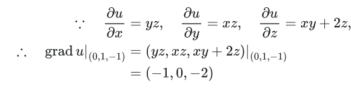
>
> 梯度的模，是指梯度向量的長度。在數學上，它是梯度向量各分量平方和的平方根
>
> $|\nabla f| = \sqrt{\left(\frac{\partial f}{\partial x}\right)^2 + \left(\frac{\partial f}{\partial y}\right)^2 + \left(\frac{\partial f}{\partial z}\right)^2 + \cdots}$
>
> $\max\left\{\frac{\partial u}{\partial l}\bigg|_M\right\} = \|\operatorname{grad} u\| = \sqrt{5}$
>
> $\min\left\{\frac{\partial u}{\partial l}\bigg|_M\right\} = -\|\operatorname{grad} u\| = -\sqrt{5}$

## 積分

可以看作是求函數在某個區間上的總量的一種數學運算，從幾何角度來看，對於一個非負函數，定積分表示的是函數曲線與*x*軸以及積分區間兩端點所圍成的曲邊梯形的面積

* 例：

    * 對於函數$y = f(x)$，在區間$[a,b]$上的定積分$\int_{a}^{b}f(x)dx$，就是求由曲線$y = f(x)$、直線$x = a$、$x = b$和x軸所圍成的圖形的面積。

    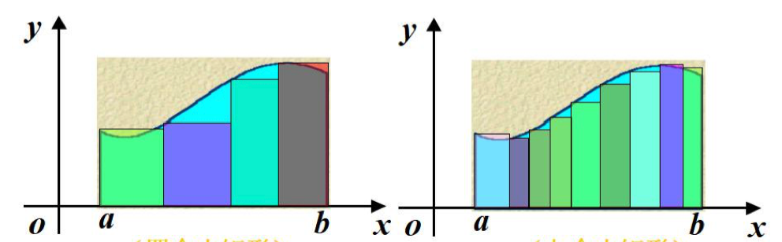
    
* 面積的正負值

    * $f(x)>0, \quad \int_{a}^{b}f(x)dx = A$
    * $f(x)<0, \quad \int_{a}^{b}f(x)dx = -A$
    
    
    
* 定積分的性質

    * $\int_{a}^{b}[f(x)\pm g(x)]dx=$
        * $\int_{a}^{b}f(x)dx \pm \int_{a}^{b}g(x)dx$
    * $\int_{a}^{b}kf(x)dx = k\int_{a}^{b}f(x)dx \quad (k \text{為常數}).$
    * $\text{假設}a < c < b$
        * $ \quad \int_{a}^{b}f(x)dx=\int_{a}^{c}f(x)dx+\int_{c}^{b}f(x)dx$
    * $\text{如果區間}[a,b]\text{上} $
        * $ \quad \int_{a}^{b}f(x)dx=\int_{a}^{c}f(x)dx+\int_{c}^{b}f(x)dx. $
    
* 積分中值定理：如果函數$f(x)$在閉區間$[a,b]$上連續，則存在一點$ξ∈[a,b]$，使得：$\int_{a}^{b} f(x)dx = f(\xi)(b - a)$，換句話說，連續函數在一個區間上的積分等於該函數在區間內某一點的函數值乘以區間長度

* 牛頓-萊布尼茨公式：一個連續函數在區間$[a,b]$上的定積分等於它的任意一個原函數在該區間上的增量，$\int_{a}^{b} f(x)dx = F(b) - F(a)$

    * **不需要** 分割成小矩形然後一個個加起來
    * **只需要** 找出 f(x) 的原函數 F(x)，然後計算 F(b) - F(a)

    ---

    - $f(b) - f(a) = \sum \Delta y$

        將區間$ [a,b] $均分成是4份，整體等於部分之和

        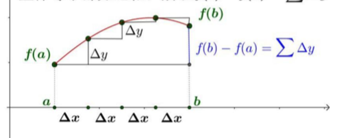

    - $f(b) - f(a) = \sum dy$

        將區間 [a,b] 細分到極限，間隔為$dx$，對應的$\Delta y$也變成$dy$

        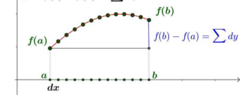

# 泰勒公式

這是一個**定理**，它表明一個在某點可微分多次的函數，可以用一個多項式來逼近。這個公式通常會包含一個**餘項 (remainder term)**，用來表示多項式逼近與原函數之間的誤差。泰勒公式的重點在於逼近和誤差的估計。
$$
\begin{align*}
若f'(x_0)存在，在x_0附近有&f(x_0 + \Delta x) - f(x_0) \approx f'(x_0)\Delta x \\
可以得到&f(x) = f(x_0) + f'(x_0)(x-x_0) + o(x-x_0) \\
近似可得&f(x) \approx f(x_0) + f'(x_0)(x-x_0)
\end{align*}
$$

* 以直線代替曲線

    * 方便計算可以先取$x_0=0$帶入微分後的函數，算出斜率
    * 再使用算出來得斜率，計算出切線方程式

    ---

    - $y=e^x$

        微分得$y'=e^x$，$x_0=0$帶入，算出切線斜率等於1，可以得到$y=x+b$，帶入點$(0,1)$，得到：

        $y=1+x$

        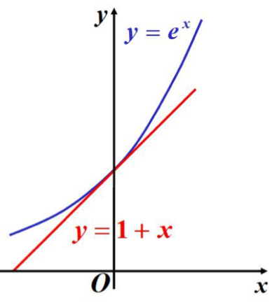

    - $y=ln(1+x)$

        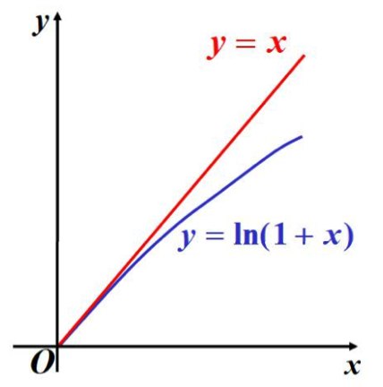

* 只用一次微分並不準確

    * 經過這條切線的方程式可能有很多種，一次微分只能確定函數圖像的**坡度**（斜率）以及函數是**上升還是下降**

    * 如果 $f'(x)>0$，則切線向上傾斜，表示函數在該點附近是增加的。

    * 如果 $f'(x)<0$，則切線向下傾斜，表示函數在該點附近是減少的。

    * 如果 $f'(x)=0$，則切線是水平的。這通常發生在函數的局部極大值點、局部極小值點或水平拐點處

        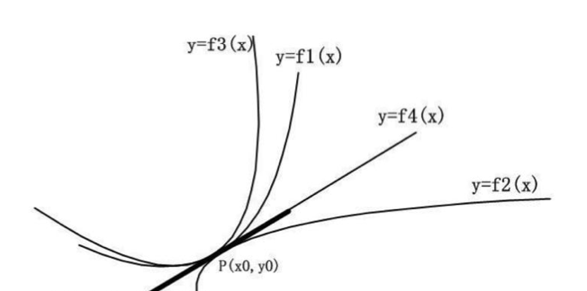

* 使用二次微分

    * **凹性** ：如果在某個區間內， $f''(x)>0$，則函數的圖像在該區間內是凹的（或稱為向上凹，像一個碗口朝上的形狀）。這意味著切線的斜率 $f'(x)$ 在該區間內是遞增的
    * **凸性** ：如果在某個區間內， $f''(x)<0$，則函數的圖像在該區間內是凸的（或稱為向下凹，像一個碗口朝下的形狀）。這意味著切線的斜率 $f'(x)$ 在該區間內是遞減的。

* 泰勒多項式：想像有一個彎彎曲曲的函數圖形，你想在某一個點 $x_0$ 附近，用一個比較簡單的多項式函數（像是直線、拋物線等等）來盡可能地貼近它。泰勒多項式就是做這件事的工具。

    * 次方的含意：次方越高，當底數大於1時，其數值增長越快，且在多項式中，高次方項通常在變數值較大時對函數的整體趨勢影響更大
    * 階乘的含意：用來調整和控制高次方項的增長速度，使得級數能夠更好地逼近原函數

    $$
    P_n(x) = f(x_0) + f'(x_0)(x-x_0) + \frac{f''(x_0)}{2!}(x-x_0)^2 + \dots \\
    + \frac{f^{(n)}(x_0)}{n!}(x-x_0)^n
    $$

* 麥克勞林公式：泰勒多項式的一個**特別情況**。它就是把泰勒多項式裡面的那個點 $x_0$ **固定設成 0**。
    $$
    f(x) = f(0) + f'(0)x + \frac{f''(0)}{2!}x^2 + \dots + \frac{f^{(n)}(0)}{n!}x^n\\
    + \frac{f^{(n+1)}(\theta x)}{(n+1)!}x^{n+1} \quad (0 < \theta < 1)
    $$

    * 近似可得
        $f(x) \approx f(0) + f'(0)x  + \dots + \frac{f^{(n)}(0)}{n!}x^n$
    
* 多項式逼近

    * **階數越高，逼近效果越好：** 觀察四個圖可以發現，隨著多項式階數的增加，藍色的多項式曲線在越來越貼合綠色曲線
    * **在展開點附近最準確：** 由於這是麥克勞林級數（在 $x=0$ 展開），所以逼近在 $x=0$點附近最準確

    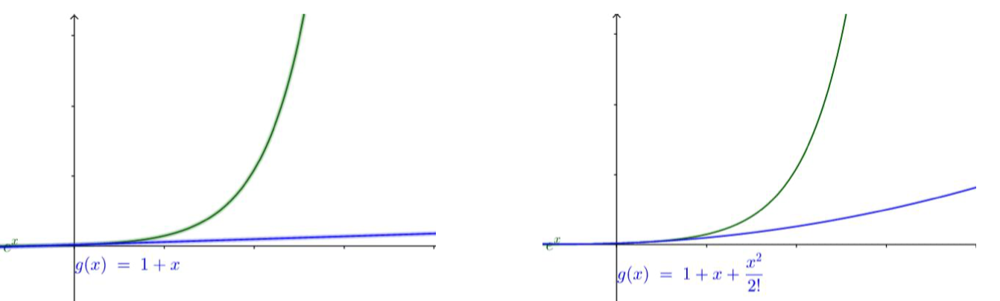

    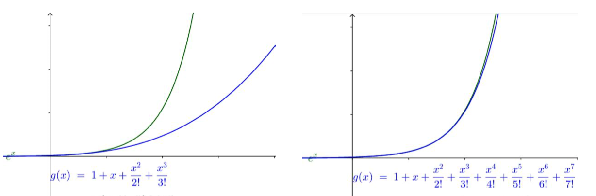

    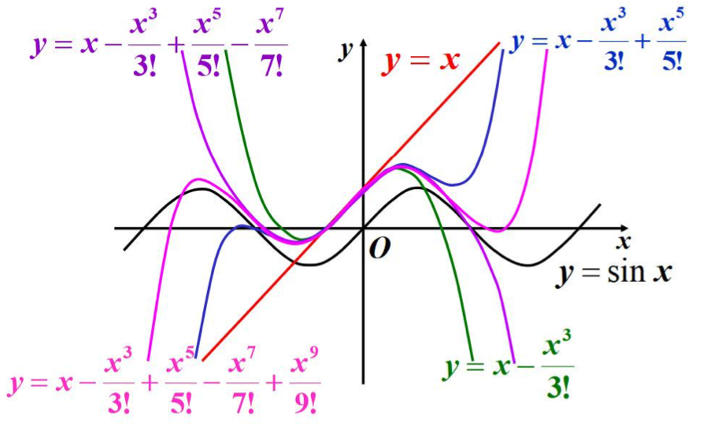

# 拉格朗日乘子法

在數學中尋找多元函數在其變數受到一個或多個等式約束條件限制時的極值方法。

想像一下，想要在一座山丘$f(x,y)$（這就是你的「函數」，可以理解成等高線地圖）上找到最高點或最低點，但你不能隨便亂走，你必須沿著一條特定的函數$g(x,y)=C$（這就是「約束條件」）走。

**拉格朗日乘子法** 就是一個聰明的方法，它告訴你：當你在特定的函數上走到可能的最高點或最低點時，你面向山丘最陡峭方向（函數梯度）的箭頭，會剛好跟你維持在柵欄上前進方向（約束條件梯度）的箭頭平行。

* 法向量平行：$\nabla f(x,y) = -\lambda \nabla g(x,y)$
    * **如果 $∇f$ (爬坡最陡方向) 和 $∇g $ (路的法向量) 不平行：** 這意味著 $∇f$ 在「路的方向上」還有分量。也就是說，你還可以沿著路稍微往前或往後走一點點，就能讓 $f$ 的值變得更大（或更小）。如果這樣，那顯然你現在的位置就不是極值點
    * **只有當 $∇f$ 和 $∇g $ 平行時：** 這意味著「爬坡最陡的方向」($∇f$) **剛好也垂直於路的方向** (因為 $∇g $ 垂直於路的方向，而 $∇f$ 與 $∇g $ 平行)。 換句話說，在這一點，如果你想沿著路走（也就是沿著路的切線方向），你往任何一個方向移動，$f$ 的值都不會立刻增加或減少（或者說，變化率為零）。這正是達到極值的條件
    * **結論：**$\nabla (f(x,y)+\lambda g(x,y)) = 0$ 
* 求解$z=f(x,y)$在條件下$\varphi(x,y) = 0$的極值：
    * $\begin{cases} f_x(x,y) + \lambda \varphi_x(x,y) = 0, \\ f_y(x,y) + \lambda \varphi_y(x,y) = 0, \\ \varphi(x,y) = 0. \end{cases}$，其中$(x,y)$就是極值

> **實例**
>
> 求解 $u=x^3y^2z$ 在條件下 $x+y+z = 12$ 的極值：
>
> 1. 構造函數：$F(x,y,z) = x^3 y^2 z + \lambda (x + y + z - 12)$
> 2. 分別求偏導數：$\begin{cases}
>     F_x' = 3x^2 y^2 z + \lambda = 0, \\
>     F_y' = 2x^3 y z + \lambda = 0, \\
>     F_z' = x^3 y^2 + \lambda = 0, \\
>     x + y + z = 12.
>     \end{cases}$，得到駐點$(6,4,2)$
> 3. 帶入$u$，$6^3 \cdot 4^2 \cdot 2 = 6912$

# 行列式和矩陣

## 行列式

* 二元方程式求解：$\begin{cases}
    a_{11}x_1 + a_{12}x_2 = b_1 \\
    a_{21}x_1 + a_{22}x_2 = b_2
    \end{cases}$

    * 移項得$(a_{11}a_{22} - a_{12}a_{21})x_1 = b_1a_{22} - a_{12}b_2$
    * 移項得$(a_{11}a_{22} - a_{12}a_{21})x_2 = a_{11}b_2 - b_1a_{21}$
    * 解： $x_1 = \frac{b_1a_{22} - a_{12}b_2}{a_{11}a_{22} - a_{12}a_{21}}$，$x_2 = \frac{a_{11}b_2 - b_1a_{21}}{a_{11}a_{22} - a_{12}a_{21}}$，$a_{11}a_{22}-a_{12}a_{21}≠0$

* 轉換成行列式

    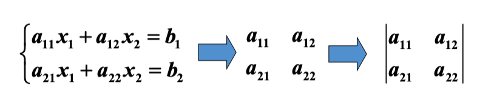

* 三階行列式

    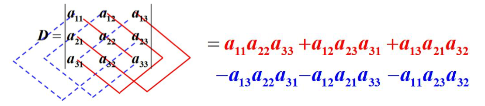

## 矩陣

* 輸入的資料就是矩陣，對資料做任何的操作都是矩陣的操作

    

* 矩陣的組成

    

* 矩陣的種類

    ---
    
    ---
    
    - 方陣
    
        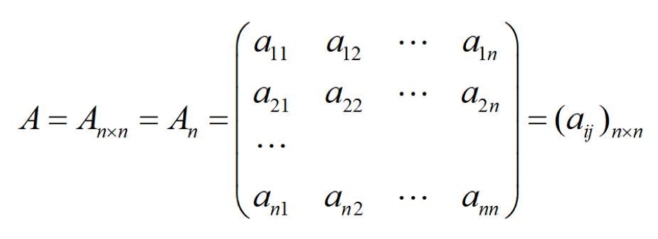
    
    - 單位矩陣
    
        
    
    - 對角線矩陣
    
        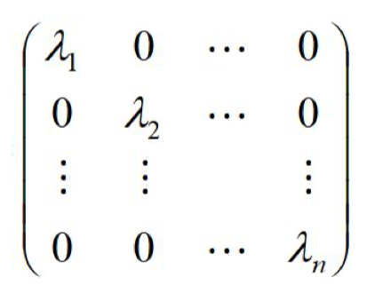
    
    - 上三角矩陣
    
        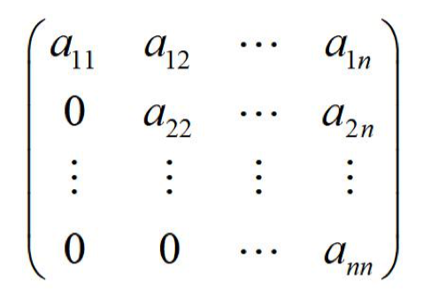
    
    - 下三角矩陣
    
        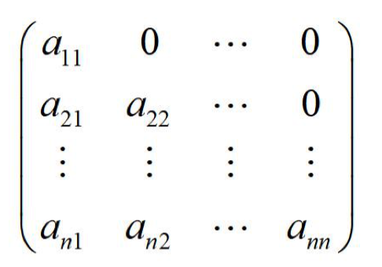

* 矩陣基本運算

    * 加減法

        

    * 乘法

        

        

        > [!CAUTION]
        >
        > 矩陣乘法沒有交換律
        >
        > 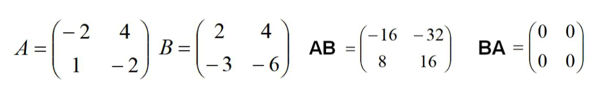

* 方程式轉換成矩陣

    

* 矩陣轉置

    * $(A^T)^T = A$
    * $(A + B)^T = A^T + B^T$
    * $(\lambda A)^T = \lambda A^T$
    * $(AB)^T = B^T A^T$
    * $(A_1 A_2 \cdots A_n)^T = A_n^T \cdots A_2^T A_1^T$

    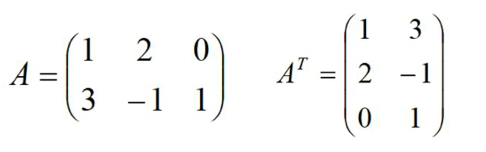

* 對稱矩陣：如果滿足$A^T=A$，那A就是對稱矩陣

    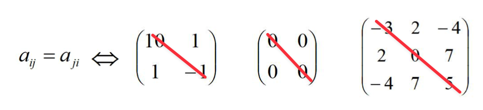

* 逆矩陣：對於一個$n×n$的方陣 A，如果存在另一個$n×n$的矩陣$A^{-1}$，使得：$A \cdot A^{-1} = A^{-1} \cdot A = I$，其中$I$是單位矩陣，則稱 $A^{-1}$為A的**逆矩陣**

    * $(A^T)^{-1} = (A^{-1})^T$
    * $(A^{-1})^{-1} = A$
    * $(\lambda A)^{-1} = \frac{1}{\lambda} A^{-1}$
    * $(AB)^{-1} = B^{-1} A^{-1}$


> **矩陣的秩(rank)**
>
> 矩陣的**秩**是指矩陣中**線性無關的列向量（或行向量）的最大個數**，也告訴我們這個矩陣包含多少「獨立的資訊」。
> 想像一家三口拍照時，每個人的姿勢、站位可以用一個向量來表示，但是不論再怎麼變換還是一樣是三個人
>
> - **秩 = 1**：所有向量都在同一條直線上
> - **秩 = 2**：向量張成一個平面
> - **秩 = 3**：向量張成三維空間
> - **秩 = n**：向量張成 n 維空間
>
> ###### 例1：簡單矩陣
>
> 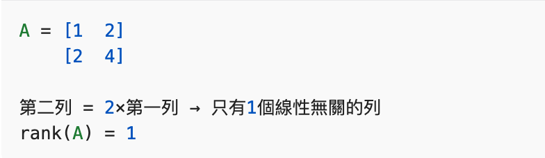
>
> ###### 例2：單位矩陣
>
> 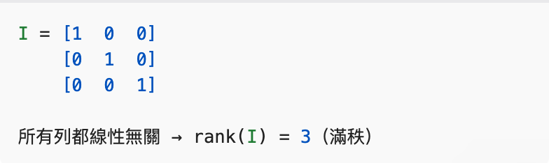
>
> ###### 例3：零矩陣
>
> 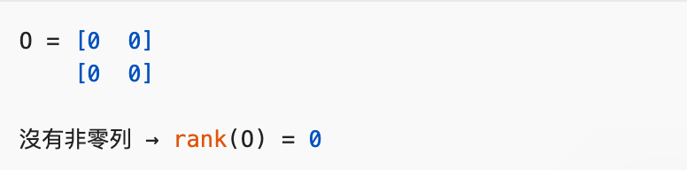

> **內積和正交**
>
> ###### 內積
>
> 對於兩個 n 維向量$\mathbf{u} = [u_1, u_2, \dots, u_n]$和$\mathbf{v} = [v_1, v_2, \dots, v_n]$：
>
> $\mathbf{u} \cdot \mathbf{v} = u_1v_1 + u_2v_2 + \dots + u_nv_n = \sum_{i=1}^n u_i v_i$
>
> 想像兩個人一起推一個箱子：
>
> - **人A** 用力方向：$$x=[3,4]（向右3單位，向上4單位）
> - **人B** 用力方向：y=[1,2]（向右1單位，向上2單位）
>
> > $\mathbf{u} \cdot \mathbf{v} = 3 \times 1 + 4 \times 2 = 3 + 8 = 11$
> >
> > 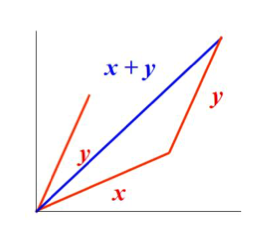
>
> 
>
> ###### 正交
>
> 若是兩個向量正交(垂直90度)，代表他們的內積等於0
>
> ---
>
> > - 東西方向：u = [1, 0, 0]
> > - 南北方向：v = [0, 1, 0]
> > - 上下方向：w = [0, 0, 1]
>
> > * **u**⋅**v**=1×0+0×1+0×0=0✓
> > * **u**⋅**w**=1×0+0×0+0×1=0✓
> > * **v**⋅**w**=0×0+1×0+0×1=0✓


|                            行列式                            |                           ==矩陣==                           |
| :----------------------------------------------------------: | :----------------------------------------------------------: |
|  | 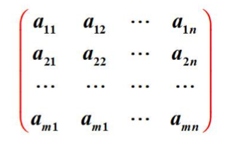 |
|              行數等於列數<br />共有$n^2$個元素               |           ==行數不等於列數<br />共有$m*n$ 個元素==           |

## SVD矩陣分解

SVD 是一種矩陣分解技術，**找出資料最重要的方向和程度**，用來降維與資料壓縮、推薦系統，SVD可以將任意 m×n 矩陣A分解為三個矩陣的乘積：

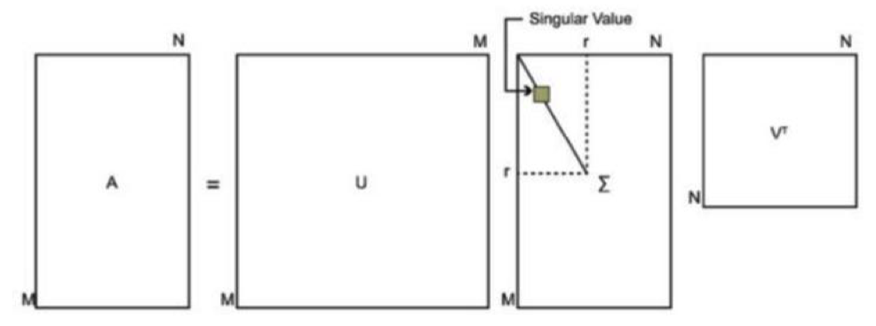
$$
A = U\Sigma V^T
$$

- U是m×m的正交矩陣
- Σ是m×n的對角矩陣
- $V^T$是n×n的正交矩陣的轉置

> **圖片壓縮**
>
> 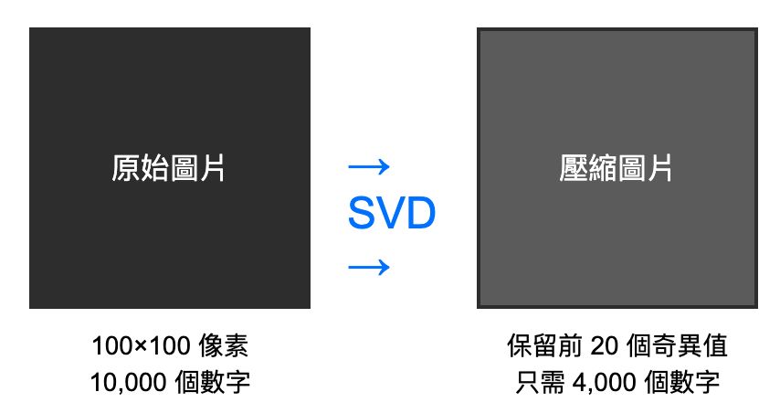
>
> **原始：** A = 100×100 矩陣 (10,000 個數字)，可能前 20 個奇異值包含了圖片的主要特徵（輪廓、明暗），後面的小奇異值多是雜訊和細節。
>
> 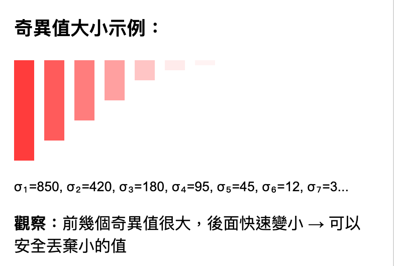
>
> * **SVD：** A = U×Σ×VT
>
>     * **壓縮：** A ≈ U₂₀×Σ₂₀×V₂₀T (4,000 個數字)
>
>     * **壓縮率：** 60% 節省空間，保持 95% 品質

> **推薦系統**
>
> 假設我們有 4 個用戶對 5 部電影的評分矩陣：
>
> |      | ==動作片== | 愛情片 | ==科幻片== | 恐怖片 | 喜劇片 |
> | :--: | :--------: | :----: | :--------: | :----: | :----: |
> | 小明 |   ==5==    |   0    |   ==4==    |   0    |   2    |
> | 小華 |   ==0==    |   5    |   ==0==    |   5    |   4    |
> | 小李 |   ==4==    |   2    |   ==5==    |   1    |   3    |
> | 小美 |   ==0==    |   4    |   ==1==    |   4    |   5    |
>
> 如果這個電影的分類擴大成好幾十種，未必每一個人都有看過該類型的電影，這個矩陣很稀疏（用戶沒看過所有電影），怎麼推薦？
>
> 
>
> 經過 SVD 分解，可能可以察覺隱藏的偏好，我們發現兩個主要「偏好模式」：
>
> * **模式 1**：動作/科幻愛好者
>
>     - 喜歡：動作片、科幻片
>
>     - 不喜歡：愛情片、恐怖片
>
> * **模式 2**：文藝/恐怖愛好者
>
>     - 喜歡：愛情片、恐怖片、喜劇片
>
>     - 不喜歡：動作片、科幻片
>
> 
>
> ---
>
> ---
>
> - **U 矩陣的含義**
>
>     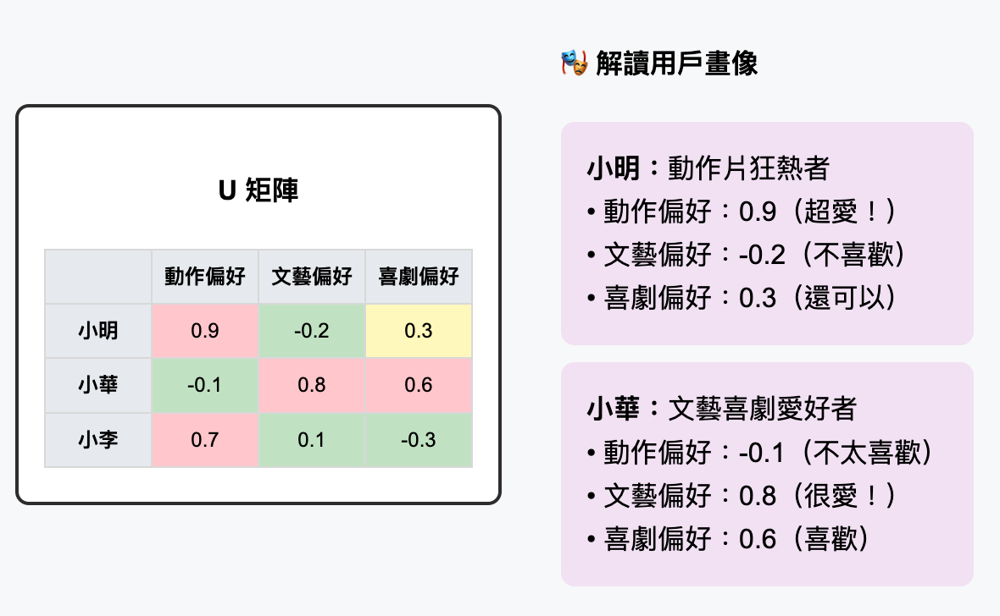
>
>     - 每個用戶在各種「偏好維度」上的傾向程度
>     - 正值 = 喜歡這類型，負值 = 不喜歡這類型
>     - 數值越大 = 偏好越強烈
>     - ==這些偏好是「隱藏的」，不是電影的明確分類！==
>
> - **Σ 矩陣的含義**
>
>     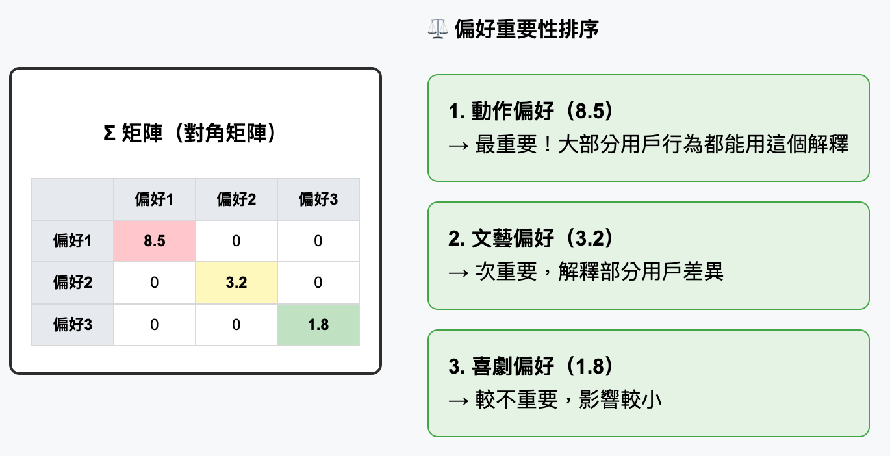
>
>     * 哪些偏好模式最能解釋用戶行為
>     * 數值大 = 這個偏好很重要，影響很多用戶
>     * 數值小 = 這個偏好影響較少，可能是雜訊
>     * ==就像「權重」，決定每個偏好的影響力！==
>
> - **$V^T$矩陣的含義**
>
>     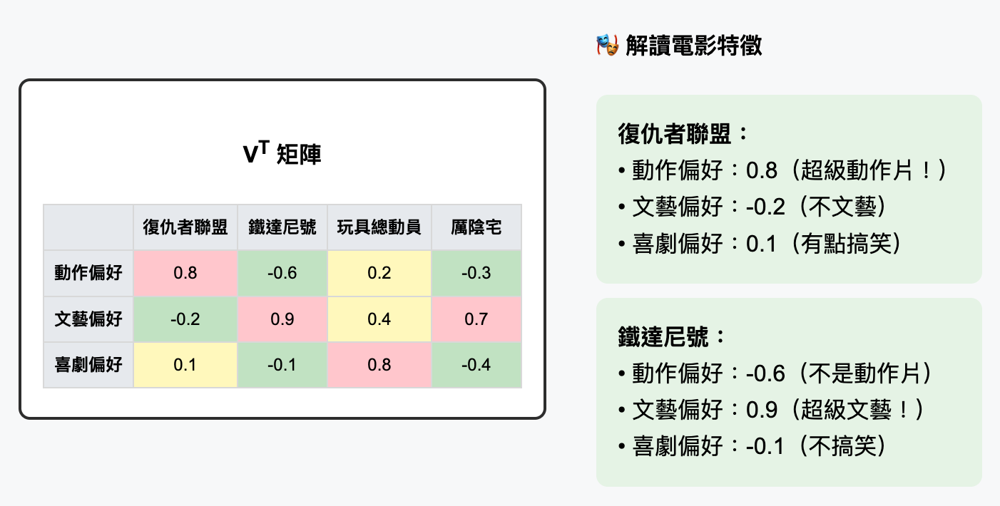
>
>     - 每部電影在各種「偏好維度」上的特徵
>     - 正值 = 這部電影符合這種偏好
>     - 負值 = 這部電影不符合這種偏好
>     - ==這些特徵是自動發現的，不需要人工標註！==


# 隨機變量

---

- 離散型隨機變量

    取值是**可數的**、**分離的**數值

    可以列舉所有可能值，值之間有「跳躍」，P(X = x) > 0

    * **擲骰子：**X ∈ {1, 2, 3, 4, 5, 6}
    * **學生人數：**X ∈ {0, 1, 2, 3, ...}
    * **考試成績：**X ∈ {A, B, C, D, F}
    * **網站點擊次數：**X ∈ {0, 1, 2, 3, ...}

    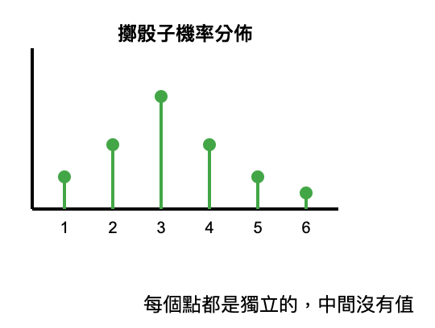

    累積機率：Σ P(X = xi)

- 連續型隨機變量

    取值是**不可數的**、**連續的**數值

    可以取任意實數值，值之間沒有「跳躍」，P(X = x) = 0，積分區間長度為 0 → 機率為 0

    * **身高：**X ∈ [0, ∞)
    * **溫度：**X ∈ (-∞, ∞)
    * **股價：**X ∈ [0, ∞)
    * **等待時間：**X ∈ [0, ∞)

    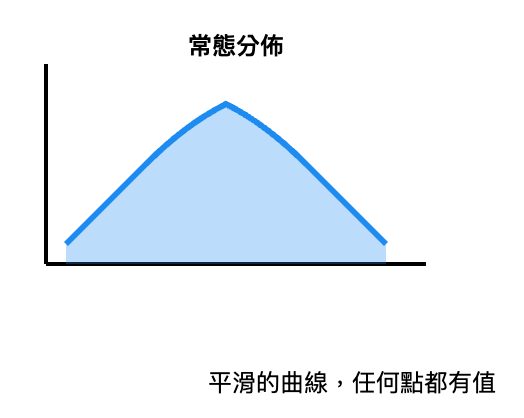

    累積機率：$∫f(x)dx$

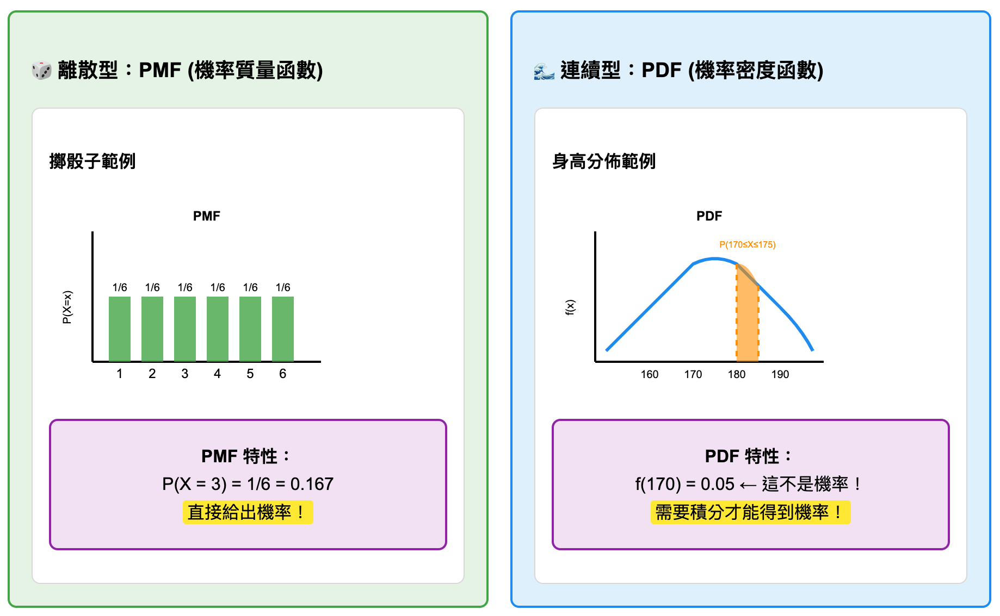

> **似然函數**
>
> 給定觀察數據下，不同參數值的「合理程度」，似然函數就像偵探的推理工具 - 根據證據（數據）判斷哪個假設（參數）最合理
>
> ###### 機率v.s.似然
>
> 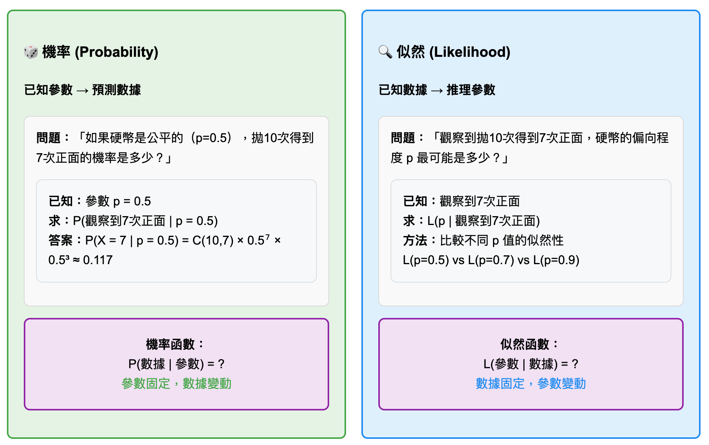
>
> 
>
> ###### 最大似然估計
>
> 找到使觀察數據出現機率最大的參數值，也就是說選擇最能「解釋」觀察數據的參數值
>
> 1. 建立似然函數 $L(\theta) = L(\theta | x_1, x_2, \ldots, x_n) = \prod_{i=1}^{n} f(x_i | \theta)$
>
> 2. 取對數似然 $\ell(\theta) = \log L(\theta) = \sum_{i=1}^{n} \log f(x_i | \theta)$
>
>     > [!NOTE]
>     >
>     > 為什麼取對數
>     >
>     > * 乘積變成加法：∏ → ∑
>     > * 避免數值下溢：很小的數相乘
>     > * 不改變最大值位置：log 是單調函數
>
> 3. 求最大值 $\theta$
>
> 
>
> ###### 具體例子：投硬幣
>
> **情境：**拋硬幣10次，觀察到7次正面，3次反面
>
> **目標：**估計硬幣正面朝上的機率 p
>
> 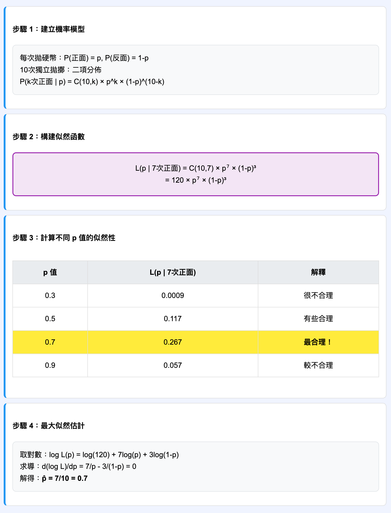
>
> 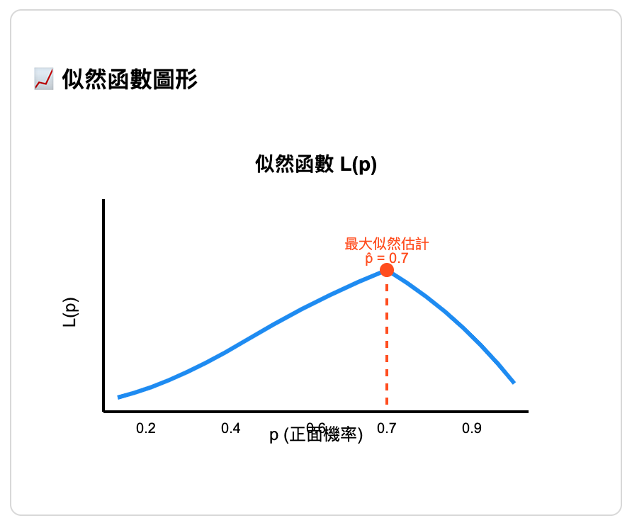

# 機率論

機率論是數學的一個分支，專門研究隨機現象和不確定性的數學理論。它為我們提供了量化和分析隨機事件發生可能性的工具

機率是衡量某個事件發生可能性大小的數值，通常用 P(A) 表示事件 A 發生的機率，其值介於 0 到 1 之間：

* P(A)=0：事件絕對不會發生
* P(A)=1：事件必然發生
* 0<P(A)<1：事件有可能發生

隨機試驗E的所有結果構成的集合稱為E的樣本空間$S=\{e\}$

* 拋硬幣 S = {正面，反面}
* 擲骰子 S = {1, 2, 3, 4, 5, 6}

## 古典機率

古典機率是指在一個有限樣本空間中，當所有基本事件（elementary events）都等可能發生時，某事件發生的機率
$$
P(A) = \frac{n(A)}{n(S)} = \frac{\text{事件A包含的有利結果數}}{\text{樣本空間中所有可能結果的總數}}
$$

> **舉例**
>
> 一袋中有8個球，編號為1－8，其中1－3號為紅球，4－8號為黃球，假設摸到每一球的可能性相等，從中隨機摸一球，記A={ 摸到紅球}，求P(A)
>
> * S = {1, 2, 3, 4, 5, 6, 7, 8}
> * A = {1, 2, 3} 
> * P(A) = $\frac{3}{8}$

## 條件機率

條件機率是指在已知某個事件發生的條件下，另一個事件發生的機率，P(A|B)表示在事件B已經發生的條件下，事件A發生的機率
$$
P(A|B) = \frac{P(A \cap B)}{P(B)}
$$

* $P(A|B)$：在B發生的條件下A發生的機率
* $P(A \cap B)$：事件A和B同時發生的機率
* $P(B)$：事件B發生的機率，$P(B)>0$

條件機率的本質是**縮小樣本空間**：

- 原本的樣本空間是整個S

- 在已知B發生後，新的樣本空間變成B

- 在這個縮小的空間中計算A發生的機率

    

>**舉例**
>
>甲乙兩地一年中雨天所佔的比例分別為20％和18％，兩地同時下雨的比例為12％
>
>1. 乙地為雨天時甲地也為雨天的機率是多少？
>2. 甲地為雨天時乙地也為雨天的機率是多少？
>
>設A={甲為雨天}， B={乙為雨天}則P(A)=20%，P(B)=18%，$P(A \cap B)$=12%
>
>1. 乙地為雨天時甲地也為雨天的機率是$P(A|B) = \frac{P(A \cap B)}{P(B)} = \frac{12\%}{18\%} = \frac{2}{3}$
>2. 甲地為雨天時乙地也為雨天的機率是$P(B|A) = \frac{P(A \cap B)}{P(A)} = \frac{12\%}{20\%} = \frac{3}{5}$

## 獨立性

**獨立性**是指兩個或多個事件之間沒有相互影響的關係。事件A的發生不會影響事件B發生的機率，反之亦然，則稱A和B是獨立的
$$
P(A \cap B) = P(A) \times P(B)
$$

* P(A∣B)=P(A)
* P(B∣A)=P(B)

> **多個事件獨立性**
>
> * 兩兩獨立：三個事件A、B、C中，任意兩個事件都是獨立的
>     * $P(A \cap B) = P(A) \times P(B)$
>     * $P(A \cap C) = P(A) \times P(C)$
>     * $P(B \cap C) = P(B) \times P(C)$
> * 相互獨立：不僅任意兩個事件獨立，三個事件同時發生的機率也等於各自機率的乘積
>     * $P(A \cap B \cap C) = P(A) \times P(B) \times P(C)$
>
> > [!CAUTION]
> >
> > - **兩兩獨立** ≠ **相互獨立**
> > - 相互獨立一定包含兩兩獨立
> > - 兩兩獨立不一定是相互獨立

> **舉例**
>
> 甲、乙兩人同時向一目標射擊，甲擊中率為0.8，乙擊中率為0.7，求目標被擊中的機率
>
> * 設A={甲擊中}
> * 設B={乙擊中}
> * 設C={目標被擊中}=$C = A \cup B$
>
> 因為甲乙同時射擊，其結果不影響，所以A、B獨立
>
> * $P(C) = P(A \cup B) = P(A) + P(B) - P(A \cap B) $
> * $=P(A) + P(B) - P(A) \times P(B)= 0.8 + 0.7 - 0.8 \times 0.7 = 0.94$

## 二維隨機變量


二維隨機變量是指在同一個隨機試驗中，同時定義的兩個隨機變量的組合

- **氣象觀測：** X = 溫度，Y = 濕度
- **學生成績：** X = 數學成績，Y = 英文成績
- **股票投資：** X = 股票A報酬率，Y = 股票B報酬率
- **製造品質：** X = 產品長度，Y = 產品重量

$$
F(x, y) = P(X \leq x, Y \leq y) = P(\{X \leq x\} \cap \{Y \leq y\})
$$

F(x,y)表示隨機點（X,Y）在以（x,y）為頂點且位於該點左下方無窮矩形內的機率

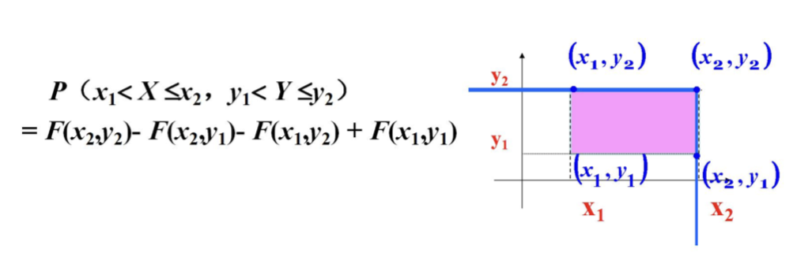

邊緣分布：是指在多維隨機變量中，單獨考慮其中一個或幾個變量的分布，而不考慮其他變量的影響。對於二維隨機變量(X, Y)

* X的邊緣分布：只關注 X 的分布，不管 Y 的值
* Y的邊緣分布：只關注 Y 的分布，不管 X 的值

> **離散型二維隨機變量**
>
> 可數的值（1,2,3...），求和 ∑
> $$
> P(X = x_i, Y = y_j) = p_{ij}
> $$
>
> $$
> \begin{align}
> \quad & p_{ij} \geq 0 \\
> \quad & \sum_{i=1}^{\infty} \sum_{j=1}^{\infty} p_{ij} = 1
> \end{align}
> $$
>
> ###### 邊緣分布
>
> * X的邊緣分布：$P(X = x_i) = \sum_{j} P(X = x_i, Y = y_j) $
> * Y的邊緣分布：$P(Y = y_j) = \sum_{i} P(X = x_i, Y = y_j)$
>
> ###### 舉例
>
> 設隨機變數X在1、2、3、4四個整數中等可能地取 一個值，另一個隨機變數Y只能在1~X中取一整數值，試求(X,Y)的聯合機率分佈
>
> 

> **連續形隨機變量**
>
> 無限多個值（任何實數），積分 ∫
> $$
> F(x, y) = \int_{-\infty}^{x} \int_{-\infty}^{y} f(u, v) \, du \, dv
> $$
>
> ###### 邊緣分布
>
> * X的邊緣分布：$f_X(x) = \int_{-\infty}^{\infty} f(x,y) \, dy $
> * Y的邊緣分布：$f_Y(y) = \int_{-\infty}^{\infty} f(x,y) \, dx$
>
> ###### 舉例
>
> 測量身高，只能算**區間機率**
>
> * X = 身高 = [150cm, 200cm] 之間任何值 
> * Y = 體重 = [40kg, 120kg] 之間任何值
>
> $$
> P(170 \leq X \leq 175, 60 \leq Y \leq 70) =\\ \int_{170}^{175} \int_{60}^{70} f(x,y) \, dx \, dy
> $$
>
> 總機率：$\int_{-\infty}^{\infty} \int_{-\infty}^{\infty} f(x,y) \, dx \, dy = 1$

# 貝式分析

貝式理論克服了經典概率論在==小樣本事件評估的難點==。貝式分析並不需要大量實驗，而是==從原有經驗中得到先驗信息並與後驗分布進行整合==，再隨著新增信息對概率值進行修正與調整，得到一個更加正確的樣本後驗分布。貝式模型用參數來描述，並且用機率表達對該參數的不確定性。

# The End<br>*Written by JamesZhan*<br><sub>若是內容有錯誤歡迎糾正 *[<kbd> Email</kbd>](mailto:henry16801@gmail.com?subject="內容錯誤糾正(非錯誤糾正可自行更改標題)")*</sub>