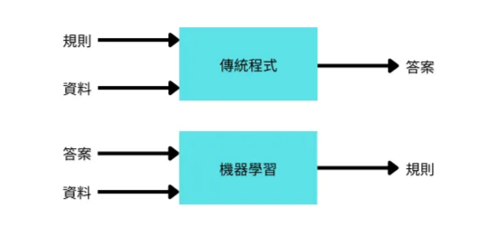

[TOC]

# 人工智慧、機器學習和深度學習

## 什麼是 人工智慧、機器學習和深度學習？


---

> **什麼是人工智慧？**
>
> 人工智慧是一個廣泛的概念，指的是讓機器模擬人類智能行為的科學和技術。
>
> - **符號式AI(Symbolic AI)**：1950年代~1980年代，程式設計師編寫規模龐大的判斷規則來操縱知識，並存放在可見的資料庫中，但是對於複雜的或是更模糊的問題，要找出明確的規則是相當困難

> **什麼是機器學習？(也被稱為淺層學習)**
>
> 機器學習是人工智慧的一個子領域，專注於讓系統從數據中訓練學習並改進，不需要明確編程。
>
> 
>
> - **監督式學習**：使用已標記的數據進行訓練
> - **非監督式學習**：從未標記的數據中尋找模式

> **什麼是深度學習？**
>
> 深度學習是機器學習的一個子集，基於人工神經網絡的結構和功能，使用連續、多層神經網絡從大量數據中學習表示和特徵。
>
> 層會對輸入資料做怎樣的轉換，取決於儲存在該層的權重參數，而學習指的就是幫神經網路的每一層找出適當的權重參數，進而推導出正確的答案
>
> 
>
> - 特點：
>     - 自動特徵提取
>     - 多層次的抽象理解
>     - 需要大量數據和計算資源
> - 常見架構：
>     - 卷積神經網絡(CNN)：適用於圖像處理
>     - 循環神經網絡(RNN)：適用於序列數據
>     - 長短期記憶網絡(LSTM)：改進的RNN，更好處理長期依賴
>     - 變換器(Transformer)：用於自然語言處理的新型架構

## 資料中學習轉換表示法

機器學習與深度學習的核心問題就是要如何有意義的轉換資料，也就是說電腦要如何學習將手上的資料找出適當的表示法，讓我們輸入的資料轉換成更接近預期的輸出結果，我們需要3個要素：

- **輸入資料點：**用於訓練和測試機器學習模型的原始數據
- **標準答案：**模型預測的目標值，也稱為「真實值」或「標籤」
- **評估演算法好壞的標準：**衡量產出結果與預期之間的差距，測量的結果再做後續的調整，這就是所謂的學習

## 什麼是損失函數(目標函數、成本函數)？

損失函數就是用來衡量模型預測結果還相差多少的一個計分表。然後再來微調各層的權重參數以降低每次的損失分數，經歷數十、百次的迭代，最後得出的權重參數可以最小化損失函數，這就是完成訓練的神經網路


# 建立第一個神經網路

## 先前準備

使用MNIST資料集，辨識手寫數字的灰階圖片，機器學習領域的經典資料集

- 大小：28像素*28像素*1通道
- 60000張訓練圖片
- 10000張測試圖片

> [!NOTE]
>
> 分類問題就是讓機器把輸入資料加以分類到不同的類別，把數字歸類到0~9的10個類別
>
> - 樣本(sample)：輸入資料
> - 標籤(label)：輸入資料的答案 

## 整體操作流程

*^tab^*

> **Step1：載入訓練、測試資料集 ❯**
>
> 將訓練集`train_images`和`train_labels`丟給神經網路
>
> *==載入訓練、測試集==*
>
> ```python
> from tensorflow.keras.datasets import mnist #從keras導入mnist數據集
> 
> (train_data, train_labels), (test_data, test_labels) = mnist.load_data()
> ```
>
> 在訓練之前，需要先對資料進行預處理，主要是將圖片轉換為神經網路預期的形式，使所有相素值都介於[0,1]之間
>
> *==資料欲處理==*
>
> ```python
> train_data = train_data.reshape((60000, 28 * 28))
> train_data = train_data.astype("float32") / 255
> 
> test_data = test_data.reshape((10000, 28 * 28))
> test_data = test_data.astype("float32") / 255
> ```
>
> 

> **Step2：建構網路模型 ❯**
>
> 神經網路學習分類圖片，並且和每張圖片的標籤作對比
>
> 組成神經元的基本元件就是層(layers)，一個層就是一個資料處理的模組，每一層都會從讀去進來的資料取出特定的轉換或表示法，最後輸出一個含有10機率的串列，每個機率就是目前數字屬於哪個數字類別
>
> *==建立神經網路==*
>
> ```python
> from tensorflow import keras
> from tensorflow.keras import layers
> 
> model = keras.Sequential([  # 兩個全連接層
>  layers.Dense(512, activation='relu'),
>  layers.Dense(10, activation='softmax'),
> ])
> ```

> **Step3：進行編譯 ❯**
>
> 進行不斷的學習，及修正權重參數
>
> 進行編譯前，我們還需要三個參數
>
> - 損失函數(loss function)：衡量神經網路在訓練集上的表現，以及引導網路朝正確的方向修正
> - 優化器(optimizer)：根據訓練資料及損失函數來自行修正權重參數的機制
> - 評量指標(metrics)：準確度
>
> *==設定編譯參數==*
>
> ```python
> model.compile(optimizer='rmsprop',
>               loss='sparse_categorical_crossentropy',
>               metrics=['accuracy'])
> ```
> 呼叫fit() 來訓練網路 
>
> *==fit訓練網路==*
>
> ```python
> model.fit(train_data, train_labels, epochs=5, batch_size=128)
> ```
>
> ```python
> # 輸出結果
> 
> Epoch 1/5
> 469/469 [======================] - 1s 1ms/step - loss: 0.2528 - accuracy: 0.9270
> Epoch 2/5
> 469/469 [======================] - 1s 1ms/step - loss: 0.1021 - accuracy: 0.9694
> Epoch 3/5
> 469/469 [======================] - 1s 1ms/step - loss: 0.0676 - accuracy: 0.9797
> Epoch 4/5
> 469/469 [======================] - 1s 1ms/step - loss: 0.0493 - accuracy: 0.9853
> Epoch 5/5
> 469/469 [======================] - 1s 1ms/step - loss: 0.0368 - accuracy: 0.9886
> ```
>
> 

> **Step4：進行預測**
>
> 要求神經網路對`test_images`中的圖片進行預測，並驗證標籤是否符合
>
> 至此，我們已經訓練好了一個模型，可以用來預測新數字圖片的類別機率，`predictions[0]` 中有10個機率值，個別代表0~9的機率，可以看見數字 7 的機率值最接近 1
>
> *==使用predict模型預測==*
>
> ```python
> predictions = model.predict(test_data)
> print(predictions[0])
> print(predictions[0].argmax())  # 找出機率最大值的索引
> ```
>
> ```python
> # 輸出結果
> 
> [6.83335832e-10 6.79366952e-10 6.15570343e-07 1.41721675e-05
> 2.45231976e-13 2.96407507e-07 2.68527130e-14 **9.99984503e-01**
> 4.02573264e-09 4.63081534e-07]
> ```
>
> 單看一張圖片可能不太準，可以透過`evaluate()` 測試整個測試集
>
> *==使用evaluate模型評估==*
>
> ```python
> test_loss, test_acc = model.evaluate(test_data, test_labels)
> print('test_acc:', test_acc)
> print('test_loss:', test_loss)
> ```
>
> ```python
> # 輸出結果
> 
> 313/313 [=====================] - 0s 334us/step - loss: 0.0624 - accuracy: 0.9813
> test_acc: 0.9812999963760376
> test_loss: 0.06244443356990814
> ```
> [<kbd>01.mnist.py </kbd>](DeepLearning.assets/code/01.mnist.py)


# 張量

張量是一種多階或多軸的數學結構

> [!NOTE]
>
> 在Python程式中要使用`numpy`，需先導入`import numpy as np`
>
> 


## 張量的關鍵屬性

- 軸的數量：也就是階數
- 形狀：用來描述一個張量上的每個軸有多少維度，是由整數組成的`turple`
- 資料型別：是指張量中資料的型別

*^tab^*

> **純量(0D張量)**
>
> 純量就是只包含一個數值的張量，在Numpy中，`float32`或`float64`型別的數字就是一個純量的張量，透過`ndim`方法查看階數
>
> ```python
> x = np.array(12) # 建立純量
> print(x, x.ndim) # ndim查看階數
> ```
>
> ```python
> # 輸出結果
> 
> 12 0
> ```
>
> 

> **向量(1D張量)**
>
> 向量是由一組數值排列而成的串列，例如`[x, y]`, `[x, y, z]`
>
> ```python
> x = np.array([1, 2, 3]) # 建立向量，這是一個三維的1D張量
> print(x, x.ndim) # ndim查看階數
> ```
>
> ```python
> # 輸出結果
> 
> [1 2 3] 1
> ```
>
> 

> **矩陣(2D張量)**
>
> 由向量組成的串列就是一個矩陣，也叫做2D張量
>
> ```python
> x = np.array([[1, 2, 3], [4, 5, 6]]) # 建立矩陣
> print(x, x.ndim) # ndim查看階數
> ```
>
> ```python
> # 輸出結果(2列*3行)
> 
> [[1 2 3]
>  [4 5 6]] 2
> ```
>
> 

> **3D張量和高階張量**
>
> 將多個矩陣包裝在一個新的陣列中，可以把它看成是一個立方體
>
> 
>
> ```python
> x = np.array([[[1, 2], [3, 4]], [[5, 6], [7, 8]]]) # 建立三維張量
> print(x, x.ndim) # ndim查看階數
> # 輸出結果
> 
> [[[1 2]
>   [3 4]]
> 
>  [[5 6]
>   [7 8]]] 3
> ```
>
> [<kbd>02.tensor.py </kbd>](DeepLearning.assets/code/02.tensor.py)

## 張量切片

從較大的張量中提取特定部分的數據。張量可以視為多維數組，而切片則是從這些多維數組中選取子集的方法

- 選擇從10~100個數字的影像

    ```python
    from tensorflow.keras.datasets import mnist
    
    (train_data, train_labels), (test_data, test_labels) = mnist.load_data()
    
    # 以下三種寫法都一樣
    slice1 = train_data[10:100] # 切片
    slice2 = train_data[10:100, :, :]
    slice3 = train_data[10:100, 0:28, 0:28]
    
    print(slice1.shape) # 查看形狀
    print(slice2.shape) 
    print(slice3.shape)
    ```

    ```python
    # 輸出結果
    
    (90, 28, 28)
    (90, 28, 28)
    (90, 28, 28)
    ```

- 選擇每個張量軸上的任意兩個索引之間進行切片

    ```python
    slice4 = train_data[:, 14:, 14:]
    slice5 = train_data[:, 14:28, 14:28]
    print(slice4.shape) # 查看形狀
    print(slice5.shape)
    ```

    ```python
    # 輸出結果
    
    (60000, 14, 14)
    (60000, 14, 14)
    ```

## 引進批次(batch)的概念

深度學習模型不會一次學習整個資料集，而是將資料分成一小批來學習

> [!NOTE]
>
> 為什麼需要批次處理？
>
> 1. 記憶體限制
>
>     當資料集非常大時（如包含數百萬張圖片），無法一次將所有資料載入到GPU或CPU的記憶體中進行處理。
>
> 2. 運算效率
>
>     批次處理允許並行計算，現代的GPU可以同時處理多個樣本，大幅提高訓練速度。

可以一次先取128張圖片

```python
batch = train_data[:128]
```

接著下一批

```python
batch = train_data[128:256]
```

## 張量運算

神經網路的所有運算都可以化為張量運算，一個層可以看成一個函數，該函數會將輸入的矩陣加以運算，在之前的程式中：

```python
layers.Dense(512, activation='relu')
```

上面方法的調用其實做了三個張量的運算輸入張量`input`和`W`張量之間的點積(dot)運算，得到的2D張量在與向量`b`相加，最後再做`relu`運算

```python
output = relu(dot(w, input) + b)
```