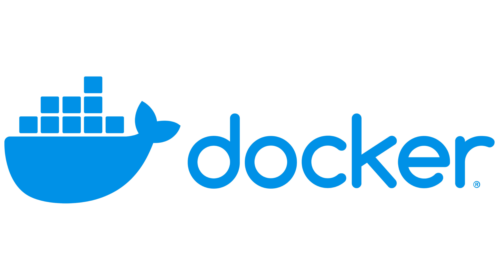
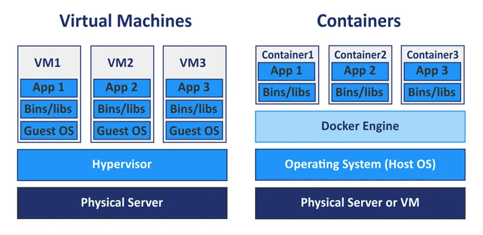
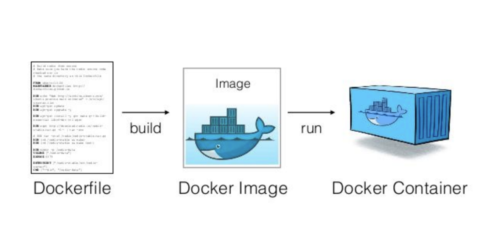
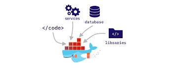
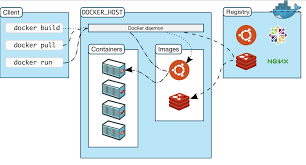
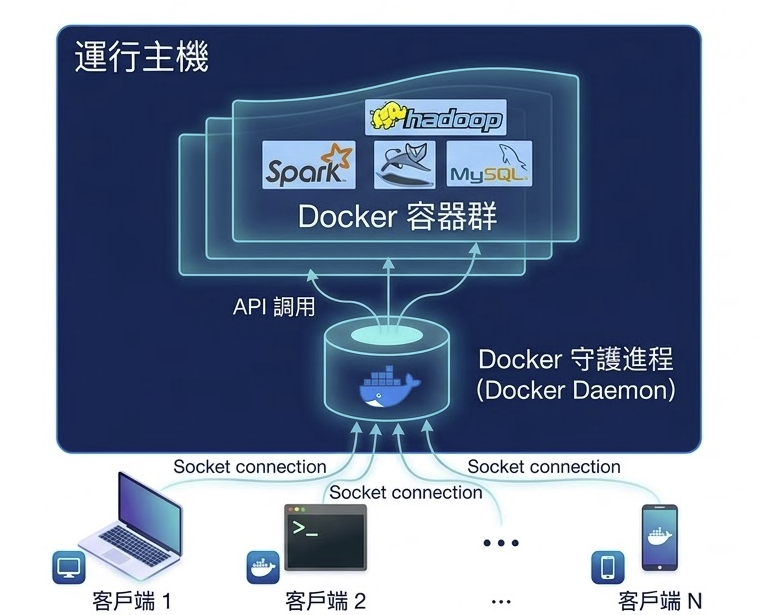
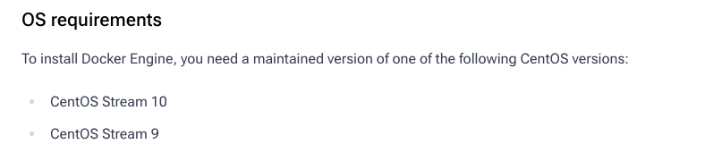
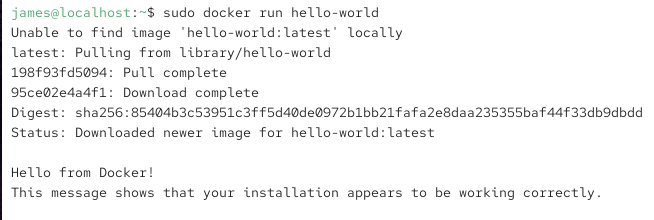
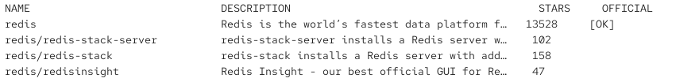

[TOC]

# 什麼是Docker



Docker 是一個開源的平台，主要用於開發、部署與執行應用程式。你可以把它想像成一種「軟體工業的貨櫃技術」。在現實世界中，貨櫃（Container）標準化了貨物的運輸，不論裡面裝的是鋼鐵還是水果，只要裝進貨櫃，就能放在任何一種貨船或卡車上運送。

Docker 的核心概念就是將應用程式及其所需的所有環境（例如程式碼、函式庫、設定檔）打包成一個獨立的「容器」。這樣一來，開發者在自己電腦上寫好的程式，只要在 Docker 容器裡能跑，搬到測試伺服器或雲端環境時，也絕對能以一模一樣的方式執行，徹底解決了「在我的電腦上明明可以跑，為什麼換到你的就不行」這種工程師常見的噩夢。

Docker 是基於 Golang 實現的雲開放原始碼專案，它的主要目標是「Build, Ship and Run Any App, Anywhere」，也就是通過對應用元件的封裝、分發、部署、運行等生命週期的管理，使使用者的應用程式及其運行環境能夠做到「一次鏡像，處處運行」。

## Docker 與 VM 差異

VM 是在**硬體層**上進行虛擬化，因此需要在 VM 裡安裝作業系統，需佔用的硬體空間較大。此外，每一次安裝、開啟新的作業系統都要花費一些時間，也需要重新建立開發環境 (安裝需要的函式庫、應用程式等)，執行效率也較慢。

Docker 則是在**作業系統層**上進行虛擬化，共享 host machine 的作業系統，能夠減少硬體的使用空間。在每一次建立、啟動一個 container 只需要幾秒，並且執行效率接近原生系統，比起 VM 的效率更快速。每個 container 由 Docker Engine 所管理。



| **特性**     | **Docker 容器 (Containers)**    | **虛擬機器 (VMs)**                  |
| ------------ | ------------------------------- | ----------------------------------- |
| **啟動速度** | 秒級，像開啟一般軟體一樣快      | 分鐘級，需要等待作業系統開機        |
| **資源消耗** | 極低，共用核心，記憶體佔用少    | 高，每個 VM 都需預分配固定資源      |
| **隔離性**   | 程序層級的隔離，安全性稍遜於 VM | 硬體層級的隔離，安全性極高          |
| **可移植性** | 極高，只要有 Docker 就能跑      | 較低，受限於虛擬機格式與 Hypervisor |
| **檔案大小** | 通常為數 MB 到幾百 MB           | 通常為數 GB 起跳                    |

## 解決的問題



從開發到部署的流程中，看看 Docker 解決了哪些麻煩：

- **環境配置的「地獄」**：以前每換一台新電腦，工程師就要花半天重新安裝資料庫、調整編譯環境。現在只要執行一行 `docker-compose up`，整套開發環境就能在幾分鐘內自動建立完成

- **微服務架構的複雜性**：現代應用程式通常由許多小服務組成（例如：前端、後端、緩存、資料庫）。Docker 讓這些服務能獨立運行在各自的容器中，彼此互不干擾，且能輕鬆地進行橫向擴展

  

- **資源浪費與成本**：如同我們之前提到的，VM 為了跑一個小程式得啟動整個作業系統，非常浪費資源。Docker 讓你在同一台伺服器上能跑更多的服務，大幅降低了雲端主機的租借成本

- **部署風險與回滾**：當新版本程式出問題時，Docker 的映像檔機制讓你能在幾秒鐘內「切換」回舊版本的容器，實現零停機時間的快速復原

## 基本組成

Docker 的基本概念分為三部分：



- 鏡像(Image)：用來建立 Container 所需的應用程式環境，是一個唯獨的檔案，概念類似 VM 的 ISO 檔

- 容器 (Container)：Container 是由 Image 所建立執行的實例，可以被啟動、開始、停止、刪除。一個 Image 可以創建多個 Container，每個 Container 都是獨立運作、不互相影響

- 倉庫 (Registry)：用來管理 Repository 的場所，概念類似 Github。Repository 是指各種版本或標籤的 Images 集合，這些 Images 利用 tag 來區分

Docker 是一個 Client-Server 結構的系統，Docker 守護處理程序運行在主機上，然後通過 Socket 連接從客戶端訪問，守護處理程序從客戶端接收命令並管理運行在主機上的容器。



## 下載安裝

> *[<kbd> 官網  </kbd>](https://www.docker.com/)* *[<kbd> 鏡像  </kbd>](https://hub.docker.com/)* *[<kbd> docker安裝指引  </kbd>](https://docs.docker.com/engine/install/centos/)*

> [!caution]
>
> Docker 的核心技術（如 Namespaces 和 Cgroups）是 Linux 核心內建的功能。這意味著 Docker 容器內運行的程式，實際上是直接跑在宿主機的 CPU 上，並直接調用宿主機的核心資源，中間沒有經過虛擬層。這就是為什麼他說「執行效率幾乎等同於 Linux 主機」，因為它幾乎沒有額外的效能損耗
>
> **在 Windows 或 macOS 上跑 Docker 是怎麼回事**
>
> 既然 Docker 必須部署在 Linux 核心上，那為什麼我們可以在 Windows 或 Mac 下載 Docker Desktop 並執行呢？
>
> - **在 Windows 上**：Docker Desktop 其實是利用了 **WSL 2** (Windows Subsystem for Linux) 或 Hyper-V 虛擬化技術，在背景偷偷跑了一個極小型的 Linux 虛擬機，Docker 容器實際上是跑在這個虛擬 Linux 裡面
> - **在 macOS 上**：由於 macOS 的核心是 Unix 系而非 Linux，Docker Desktop 會透過一個輕量級的虛擬化框架（如 HyperKit）啟動一個 Linux 核心，再讓容器運行於其上


*^tab^*

>**確認 CentOS 版本**
>
>```bash
>cat /etc/redhat-release
>```
>
>需要符合官網操作手冊上的版本
>
>

> **移除舊版本軟體**
>
> 在安裝 Docker 之前，需要解除安裝任何相互衝突的軟體包。
>
> 使用的 Linux 發行版可能會提供非正式的 Docker 軟體包，這可能與 Docker 提供的官方軟體包相衝突。在安裝Docker 的官方版本之前，必須解除安裝這些軟體包。
>
> ```bash
> sudo dnf remove docker \
>                 docker-client \
>                 docker-client-latest \
>                 docker-common \
>                 docker-latest \
>                 docker-latest-logrotate \
>                 docker-logrotate \
>                 docker-engine
> ```
>
> 上述命令執行期間可能提示dnf沒有安裝這些軟體包。
>
> 解除安裝 Docker 時，儲存在 /var/lib/docker/ 中的鏡像（images）、容器（containers）、資料卷（volumes）和網路（networks）不會被自動刪除。

> **設定 Docker 倉庫並安裝**
>
> 安裝該`dnf-plugins-core`軟體包（提供管理 DNF 儲存庫的命令）並設定儲存庫。
>
> ```bash
> sudo dnf -y install dnf-plugins-core
> sudo dnf config-manager --add-repo https://download.docker.com/linux/centos/docker-ce.repo
> 
> sudo dnf install docker-ce docker-ce-cli containerd.io docker-buildx-plugin docker-compose-plugin
> ```

> **啟動測試**
>
> Docker 是一個系統服務，使用啟動系統服務方式進行啟動：
>
> ```bash
> sudo systemctl enable --now docker
> ```
>
> 成功執行上述命令後，終端不會顯示任何資訊。可以查看當前系統中的 Docker 服務：
>
> ```bash
> ps -ef | grep docker
> ```
>
> 測試啟動docker鏡像
>
> ```bash
> docker version
> docker run hello-world
> ```
>
> 


# 常用命令

* 啟動類命令：

  * 啟動：`systemctl start docker`
  * 停止：`systemctl stop docker`
  * 重起：`systemctl restart docker`
  * 查看docker狀態：`system status docker`
  * 開機啟動：`systemctl enable docker`
  * 查看docker摘要：`docker info`
  * 查看docker 手冊：`docker [command] --help`

* 鏡像命令：

  * 列出本地主機上的鏡像：`docker images`

    

    * REPOSITORY 表示鏡像的倉庫源
    * TAG 表示鏡像的標籤
    * IMAGE ID 表示鏡像 ID
    * CREATED 表示鏡像建立時間
    * SIZE 表示鏡像大小

    > [!tip]
    >
    > 同一倉庫源可以有多個 TAG 版本，代表這個倉庫源的不同個版本，使用 REPOSITORY:TAG 來定義不同的鏡像。
    >
    > 如果不指定一個鏡像的版本標籤，例如只使用 ubuntu，Docker 將默認使用 ubuntu:latest 鏡像。
    >
    > * -a 列出本地所有的鏡像（含歷史鏡像）
    > * -q 只顯示鏡像 ID

  * 搜尋遠端倉庫中的鏡像：`docker search 鏡像名稱`

    

    > [!tip]
    >
    > `--limit n` 只列出前 n 個鏡像，默認 25 個。比如 ` docker search --limit 5 redis`

  * 下載鏡像：`docker pull 鏡像名稱[:TAG]`

  * 查看鏡像、容器、資料卷所佔的空間：`docker system df`

  * 刪除鏡像：`docker rmi 鏡像名稱/ID`

    >[!tip]
    >
    >`-f` 選項表示強制刪除指定鏡像
    >
    >* 強制刪除：`docker rmi -f 鏡像名稱/ID`
    >* 刪除多個：`docker rmi -f 鏡像名稱1:TAG 鏡像名稱2:TAG`
    >* 全部刪除：`docker rmi -f $(docker images -qa)`
