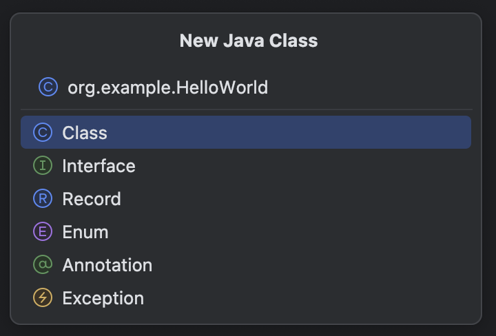

###### ~VLOOK™~ *[<kbd> VLOOK </kbd>](https://github.com/MadMaxChow/VLOOK)* 後端開發學習筆記-Maven ── <u>簡介</u> *本篇筆記是使用[<kbd> Typora</kbd>](https://typora.io/)及[<kbd> Markdown</kbd>](https://markdown.tw/) 結合GitHub開源模版撰寫而成並導出成HTML* **JamesZhan** *不允許複製下載`僅供閱覽`* *版本日期`2025年6月1日`*

[TOC]

# 什麼是Maven

==Maven 是一款用於管理和建構Java項目的工具，是Apache旗下的一個開源項目==

> Apache 軟體基金會，成立於1999年7月，是目前世界上最大的最受歡迎的開放原始碼軟體基金會，也是一個專門為支援開放原始碼專案而生的非盈利性組織
>
> *[<kbd> APACHE  </kbd>](https://www.apache.org/)*

## Maven作用

*^tab^*

>**依賴管理**
>
>方便快捷的管理項目依賴的資源(jar包)，避免版本衝突問題
>
>---
>
>- 使用Maven前
>
>    項目中要想使用某一個jar包，就需要把這個jar包從官方網站下載下來，然後再匯入到項目中。
>
>    
>
>- 使用Maven後
>
>    當使用maven進行項目依賴(jar包)管理， 我們只需要在maven項目的pom.xml檔案中，新增一段如下圖所示的組態即可實現
>
>    

> **項目構建**
>
> Maven還提供了標準化的跨平台的自動化建構方式
>
> ---
>
> - 使用Maven前
>
>     我們開發系統，程式碼需要進行編譯、測試、打包、發佈等過程，這些操作是所有項目中都需要做的，如果需要反覆進行就顯得特別麻煩
>
>     
>
> - 使用Maven後
>
>     通過Maven中的命令，就可以很方便的完成項目的編譯(compile)、測試(test)、打包(package)、發布(deploy) 等操作
>     這些操作都是跨平台的，無論是Windows系統、Linux系統，還是Mac系統都支持
>
>     

> **統一項目結構**
>
> Maven 還提供了標準、統一的項目結構
>
> ---
>
> - 使用Maven前
>
>     Java開發工具有很多，像是Eclipse、IDEA，不同的開發工具，建立出來的Java項目的目錄結構是存在差異的
>
>     
>
> - 使用Maven後
>
>     如果我們使用了Maven這一款項目建構工具，它給我們提供了一套標準的Java項目目錄
>
>     
>
> 
>
> 上面的maven項目的目錄結構中：
>
> * main目錄：存放項目的原始碼
> * test目錄：存放項目的測試程式碼
> * 而無論是在main還是在test下，都有兩個目錄
>     * java：用來存放原始碼檔案
>     * resources：用來存放組態檔案

## Maven介紹

Apache Maven是一個項目管理和建構工具，它基於項目對象模型(Project Object Model , 簡稱: POM)的概念，通過一小段描述資訊來管理項目的建構、報告和文件

*[<kbd> Maven  </kbd>](https://maven.apache.org/)*

*^tab^*

> **建構生命週期/階段**
>
> 紫色框起來的部分，就是用來完成標準化建構流程 。當我們需要編譯，Maven提供了一個編譯指令供我們使用；當我們需要打包，Maven就提供了一個打包指令我們使用等
>
> 

> **項目對象模型(POM)**
>
> 它是一個 XML 文件，通常命名為 **pom.xml**，包含了專案的所有配置資訊，POM 文件就像是專案的「身份證」和「說明書」，它告訴 Maven：
>
> - 這個專案是什麼
> - 如何建構這個專案
> - 專案需要哪些依賴
> - 專案的基本資訊
>
> 

> **依賴管理模型(Dependency)**
>
> 使用坐標來描述當前項目依賴哪些第三方jar包，「座標」是一種標準化的方式，用來唯一標識一個第三方的 JAR 包（即 Java 的庫或模組）。坐標的結構通常包含以下幾個部分：
>
> * **Group ID**：組 ID，表示庫的組織或分組（通常是域名的反向格式，比如 `org.apache.commons`）
> * **Artifact ID**：工件 ID，表示具體的庫名稱（比如 `commons-lang3`）
> * **Version**：版本號，表示該庫的具體版本（比如 `3.12.0`）
>
> 

## Maven倉庫

用於儲存資源，管理各種jar包，Maven倉庫分為：

* 本地倉庫：自己電腦上的一個目錄(用來儲存jar包)
* 中央倉庫：由Maven團隊維護的全球唯一的 *[<kbd> Maven倉庫  </kbd>](https://repo1.maven.org/maven2/)*
* 遠端倉庫(私服)：一般由公司團隊搭建的私有倉庫

當項目中使用坐標引入對應依賴jar包後：

1. 首先會尋找本地倉庫中是否有對應的jar包
    * 如果有，則在項目直接引用
2. 如果有建立遠端倉庫(私服)，則去遠端倉庫中下載對應的jar包到本地倉庫
3. 如果沒有遠端倉庫或是沒有對應的jar包，則去中央倉庫中下載對應的jar包到本地倉庫

## Maven安裝

*^tab^*

> **透過Homebrew安裝Maven(Mac)**
>
> 1. 直接使用`brew install maven`安裝
>
> 2. 驗證安裝結果`mvn -v`
>
>     

> **配置本地倉庫**
>
> 1. 在電腦上新增一個資料夾(用來儲存jar包)
> 2. 找到安裝位置(*==/opt/homebrew/Cellar/maven/3.9.9/libexec/conf==*)進入到conf目錄下修改settings.xml組態檔案
> 3. 使用編輯器開啟settings.xml，增加本地倉庫路徑`<localRepository>/Users/james/Documents/mvn_repo</localRepository>`
>
>     
>
> > [!caution]
> >
> > 注意配置訊息的位置和標籤，如果有錯誤之後在使用時就會報錯

# 編輯器(IDEA)上使用Maven

## 編輯器配置

*^tab^*

> **下載並安裝IDEA**
>
> *[<kbd> IntelliJ IDEA  </kbd>](https://www.jetbrains.com/idea/)*

> **參數配置**
>
> 1. 開啟安裝好的IDEA，右側點擊Customize並點選All settings
>
>     
>
> 2. 選擇 *==Build,Execution,Deployment  =>  Build Tools  =>  Maven==*，配置安裝目錄、settings.xml位置及Maven本地倉庫
>
>     
>
> 3. 左側選擇Runner，配置Maven JDK環境
>
>     
>
> 4. 全部配置完畢按OK，結束配置

> **建立專案**
>
> 1. 左側選擇Projects，建立一個新專案New projects
>
>     
>
> 2. 選擇Empty project空專案即可，並填寫專案名稱及專案位置
>
>     
>
> 3. 配置專案的JDK環境，點擊右上角齒輪，選擇Project Structure
>
>     
>
>     

> **創建模塊**
>
> 建立模組，選擇Java語言，選擇Maven。 填寫模組的基本資訊
>
> 
>
> 
>
> > [!note]
> >
> > Add sample code 可加可不加

## 建立HelloWorld類

在Maven項目中，建立HelloWorld類，並執行

> [!note]
>
> **Maven目錄結構**
>
> |---  src  (原程式碼目錄和測試程式碼目錄)
>
> ​	|---  main (原程式碼目錄)
>
> ​		|--- java (原程式碼java檔案目錄)
>
> ​                |--- resources (原程式碼配置檔案目錄)
>
> ​	|---  test (測試程式碼目錄)
>
> ​		|--- java (測試程式碼java目錄)
>
> ​		|--- resources (測試程式碼配置檔案目錄)
>
> ​	|--- target (編譯、打包生成檔案存放目錄)

## Maven座標

什麼是坐標？
- Maven中的坐標是**資源的唯一標識** , 通過該坐標可以唯一定位資源位置
- 使用坐標來定義項目或引入項目中需要的依賴

座標的組成：

- **groupId**：定義當前Maven項目隸屬組織名稱（通常是域名反寫，例如：com.itheima）
- **artifactId**：定義當前Maven項目名稱（通常是模組名稱，例如 order-service、goods-service）
- **version**：定義當前項目版本號
  - **SNAPSHOT**: 功能不穩定、尚處於開發中的版本，即快照版本
  - **RELEASE**: 功能趨於穩定、當前更新停止，可以用於發行的版本

> [!note]
>
> 專案如果被其他的專案依賴時，也是需要坐標來引入的

## 匯入Maven檔案

*^tab^*

> **方法1**
>
> 選擇左上角*==File -> Project Structure -> Modules -> Import Module==*
>
> 
>
> > [!note]
> >
> > 盡量maven項目的pom.xml

> **方法2**
>
> 選擇右側的*==Maven面板 -> +（Add Maven Projects）==*
>
> 
>
> > [!note]
> >
> > 盡量maven項目的pom.xml

#  The End *Written by JamesZhan* 若是內容有錯誤歡迎糾正 *[<kbd> Email</kbd>](mailto:henry16801@gmail.com?subject="內容錯誤糾正(非錯誤糾正可自行更改標題)")*