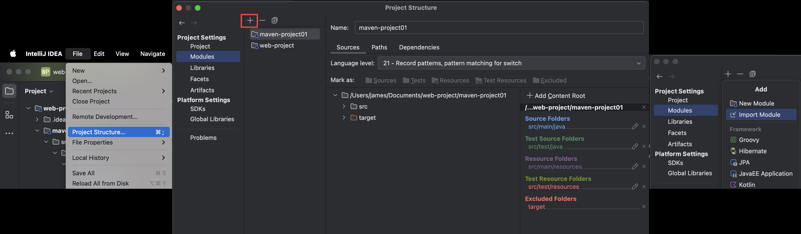

###### ~VLOOK™~ *[<kbd> VLOOK </kbd>](https://github.com/MadMaxChow/VLOOK)*<br>後端開發學習筆記-Maven<br>──<br><u>簡介</u><br>*本篇筆記是使用[<kbd> Typora</kbd>](https://typora.io/)及[<kbd> Markdown</kbd>](https://markdown.tw/)<br>結合GitHub開源模版撰寫而成並導出成HTML*<br>**JamesZhan**<br>*不允許複製下載`僅供閱覽`* *版本日期`2025年6月6日`*

[TOC]

# 什麼是Maven

==Maven 是一款用於管理和建構Java項目的工具，是Apache旗下的一個開源項目==


> Apache 軟體基金會，成立於1999年7月，是目前世界上最大的最受歡迎的開放原始碼軟體基金會，也是一個專門為支援開放原始碼專案而生的非盈利性組織
>
> *[<kbd> APACHE  </kbd>](https://www.apache.org/)*

## Maven作用


*^tab^*

>**依賴管理**
>
>方便快捷的管理項目依賴的資源(jar包)，避免版本衝突問題
>
>---
>
>- 使用Maven前
>
>    項目中要想使用某一個jar包，就需要把這個jar包從官方網站下載下來，然後再匯入到項目中。
>
>    
>
>- 使用Maven後
>
>    當使用maven進行項目依賴(jar包)管理， 我們只需要在maven項目的pom.xml檔案中，新增一段如下圖所示的組態即可實現
>
>    

> **項目構建**
>
> Maven還提供了標準化的跨平台的自動化建構方式
>
> ---
>
> - 使用Maven前
>
>     我們開發系統，程式碼需要進行編譯、測試、打包、發佈等過程，這些操作是所有項目中都需要做的，如果需要反覆進行就顯得特別麻煩
>
>     
>
> - 使用Maven後
>
>     通過Maven中的命令，就可以很方便的完成項目的編譯(compile)、測試(test)、打包(package)、發布(deploy) 等操作
>     這些操作都是跨平台的，無論是Windows系統、Linux系統，還是Mac系統都支持
>
>     

> **統一項目結構**
>
> Maven 還提供了標準、統一的項目結構
>
> ---
>
> - 使用Maven前
>
>     Java開發工具有很多，像是Eclipse、IDEA，不同的開發工具，建立出來的Java項目的目錄結構是存在差異的
>
>     
>
> - 使用Maven後
>
>     如果我們使用了Maven這一款項目建構工具，它給我們提供了一套標準的Java項目目錄
>
>     
>
> 
>
> 上面的maven項目的目錄結構中：
>
> * main目錄：存放項目的原始碼
> * test目錄：存放項目的測試程式碼
> * 而無論是在main還是在test下，都有兩個目錄
>     * java：用來存放原始碼檔案
>     * resources：用來存放組態檔案

## Maven介紹

Apache Maven是一個項目管理和建構工具，它基於項目對象模型(Project Object Model , 簡稱: POM)的概念，通過一小段描述資訊來管理項目的建構、報告和文件

*[<kbd> Maven  </kbd>](https://maven.apache.org/)*

*^tab^*

> **建構生命週期/階段**
>
> 紫色框起來的部分，就是用來完成標準化建構流程 。當我們需要編譯，Maven提供了一個編譯指令供我們使用；當我們需要打包，Maven就提供了一個打包指令我們使用等
>
> 

> **項目對象模型(POM)**
>
> 它是一個 XML 文件，通常命名為 **pom.xml**，包含了專案的所有配置資訊，POM 文件就像是專案的「身份證」和「說明書」，它告訴 Maven：
>
> - 這個專案是什麼
> - 如何建構這個專案
> - 專案需要哪些依賴
> - 專案的基本資訊
>
> 

> **依賴管理模型(Dependency)**
>
> 使用坐標來描述當前項目依賴哪些第三方jar包，「座標」是一種標準化的方式，用來唯一標識一個第三方的 JAR 包（即 Java 的庫或模組）。坐標的結構通常包含以下幾個部分：
>
> * **Group ID**：組 ID，表示庫的組織或分組（通常是域名的反向格式，比如 `org.apache.commons`）
> * **Artifact ID**：工件 ID，表示具體的庫名稱（比如 `commons-lang3`）
> * **Version**：版本號，表示該庫的具體版本（比如 `3.12.0`）
>
> 

## Maven倉庫

用於儲存資源，管理各種jar包，Maven倉庫分為：

* 本地倉庫：自己電腦上的一個目錄(用來儲存jar包)
* 中央倉庫：由Maven團隊維護的全球唯一的 *[<kbd> Maven倉庫  </kbd>](https://repo1.maven.org/maven2/)*
* 遠端倉庫(私服)：一般由公司團隊搭建的私有倉庫


當項目中使用坐標引入對應依賴jar包後：

1. 首先會尋找本地倉庫中是否有對應的jar包
    * 如果有，則在項目直接引用
2. 如果有建立遠端倉庫(私服)，則去遠端倉庫中下載對應的jar包到本地倉庫
3. 如果沒有遠端倉庫或是沒有對應的jar包，則去中央倉庫中下載對應的jar包到本地倉庫

## Maven安裝

*^tab^*

> **透過Homebrew安裝Maven(Mac)**
>
> 1. 直接使用`brew install maven`安裝
>
> 2. 驗證安裝結果`mvn -v`
>
>     

> **配置本地倉庫**
>
> 1. 在電腦上新增一個資料夾(用來儲存jar包)
> 2. 找到安裝位置(*==/opt/homebrew/Cellar/maven/3.9.9/libexec/conf==*)進入到conf目錄下修改settings.xml組態檔案
> 3. 使用編輯器開啟settings.xml，增加本地倉庫路徑`<localRepository>/Users/james/Documents/mvn_repo</localRepository>`
>
>     
>
> > [!caution]
> >
> > 注意配置訊息的位置和標籤，如果有錯誤之後在使用時就會報錯


# 編輯器(IDEA)上使用Maven

## 編輯器配置

*^tab^*

> **下載並安裝IDEA**
>
> *[<kbd> IntelliJ IDEA  </kbd>](https://www.jetbrains.com/idea/)*

> **參數配置**
>
> 1. 開啟安裝好的IDEA，右側點擊Customize並點選All settings
>
>     
>
> 2. 選擇 *==Build,Execution,Deployment  =>  Build Tools  =>  Maven==*，配置安裝目錄、settings.xml位置及Maven本地倉庫
>
>     
>
> 3. 左側選擇Runner，配置Maven JDK環境
>
>     
>
> 4. 全部配置完畢按OK，結束配置

> **建立專案**
>
> 1. 左側選擇Projects，建立一個新專案New projects
>
>     
>
> 2. 選擇Empty project空專案即可，並填寫專案名稱及專案位置
>
>     
>
> 3. 配置專案的JDK環境，點擊右上角齒輪，選擇Project Structure
>
>     
>
>     

> **創建模塊**
>
> 建立模組，選擇Java語言，選擇Maven。 填寫模組的基本資訊
>
> 
>
> 
>
> > [!note]
> >
> > Add sample code 可加可不加

## 建立HelloWorld類

在Maven項目中，建立HelloWorld類，並執行


> [!note]
>
> **Maven目錄結構**
>
> |---  src  (原程式碼目錄和測試程式碼目錄)
>
> ​	|---  main (原程式碼目錄)
>
> ​		|--- java (原程式碼java檔案目錄)
>
> ​                |--- resources (原程式碼配置檔案目錄)
>
> ​	|---  test (測試程式碼目錄)
>
> ​		|--- java (測試程式碼java目錄)
>
> ​		|--- resources (測試程式碼配置檔案目錄)
>
> ​	|--- target (編譯、打包生成檔案存放目錄)

## Maven座標

什麼是坐標？
- Maven中的坐標是**資源的唯一標識** , 通過該坐標可以唯一定位資源位置
- 使用坐標來定義項目或引入項目中需要的依賴


座標的組成：

- **groupId**：定義當前Maven項目隸屬組織名稱（通常是域名反寫，例如：com.itheima）
- **artifactId**：定義當前Maven項目名稱（通常是模組名稱，例如 order-service、goods-service）
- **version**：定義當前項目版本號
  - **SNAPSHOT**: 功能不穩定、尚處於開發中的版本，即快照版本
  - **RELEASE**: 功能趨於穩定、當前更新停止，可以用於發行的版本

> [!note]
>
> 專案如果被其他的專案依賴時，也是需要坐標來引入的

## 匯入Maven檔案

*^tab^*

> **方法1**
>
> 選擇左上角*==File -> Project Structure -> Modules -> Import Module==*
>
> 
>
> > [!note]
> >
> > 盡量maven項目的pom.xml

> **方法2**
>
> 選擇右側的*==Maven面板 -> +（Add Maven Projects）==*
>
> 
>
> > [!note]
> >
> > 盡量maven項目的pom.xml

# 依賴管理

## 依賴配置

指當前專案執行所需要的jar包，一個專案中可以引入多個依賴

配置：

1. 在pom.xml中編寫`<dependencies>`標籤

2. 在`<dependencies>`標籤中使用`<dependency>`引入坐標

3. 定義坐標的 `groupId`、`artifactId`、`version`

    ```xml
    <dependencies>
        <!-- 依賴 : spring-context -->
        <dependency>
            <groupId>org.springframework</groupId>
            <artifactId>spring-context</artifactId>
            <version>6.1.4</version>
        </dependency>
    </dependencies>
    ```

    > [!caution]
    >
    > 如果引入的依賴，在本地倉庫中不存在，將會連接遠端倉庫 / 中央倉庫下載依賴（這個過程會比較耗時，耐心等待）

    > [!note]
    >
    > 如果不知道依賴的座標資訊，可以到mvn的中央倉庫 *[<kbd> mvn倉庫  </kbd>](https://mvnrepository.com/)*
    >
    > 

4. 點擊刷新按鈕，引入最新的座標

    

> [!note]
>
> **依賴傳遞**
>
> 當我們在配置pom.xml時引入spring-context，我們通過右側的maven面板可以看到，其實引入進來的依賴，並不只有這一項
>
> 
>
> 如果A 依賴了B，B依賴了C，C依賴了D，那麼在A項目中，也會有C、D依賴，因為依賴會傳遞，這就是依賴傳遞。
>
> 如果傳遞下來的依賴在項目開發中我們確實不需要，此時，我們可以通過Maven中的**排除依賴**功能排除掉

## 依賴排除

==主動斷開依賴的資源，被排除的資源**無需指定版本**==


```xml
<dependency>
    <groupId>org.springframework</groupId>
    <artifactId>spring-context</artifactId>
    <version>6.1.4</version>

    <!--排除依賴, 主動斷開依賴的資源-->
    <exclusions>
        <exclusion>
            <groupId>io.micrometer</groupId>
            <artifactId>micrometer-observation</artifactId>
        </exclusion>
    </exclusions>
</dependency>
```


## 依賴範圍

依賴的jar包，默認情況下可以在任何地方使用，在main目錄下，可以使用；在test目錄下，也可以使用

在maven中，如果希望限制依賴的使用範圍，可以通過 `<scope>…</scope>` 設定其作用範圍

|        scope值         | 主程序 | 測試程序 | 打包(運行) |    範例     |
| :--------------------: | :----: | :------: | :--------: | :---------: |
| ==**compile** (默認)== | ==✅==  |  ==✅==   |   ==✅==    |  ==log4j==  |
|      ==**test**==      | ==❌==  |  ==✅==   |   ==❌==    |  ==junit==  |
|      **provided**      |   ✅    |    ✅     |     ❌      | servlet-api |
|      **runtime**       |   ❌    |    ✅     |     ✅      |  jdbc驅動   |


如果對Junit單元測試的依賴，設定了scope為 test，就代表該依賴只能在測試(test)程式中使用，在主程序(main)中是無法使用的

## 生命週期

==生命週期是為了對所有的建構過程進行統一。 描述了一次項目建構經歷哪些階段==


- **clean**：負責**清理專案**，移除之前建置產生的檔案
- **default**：這是最常用的生命週期，主要負責專案的**建置和部署**過程
- **site**：負責**產生專案文件和報告**

每套生命週期包含一些階段，都是有順序的，後面的階段依賴於前面的階段。
我們看到這三套生命週期，裡面有很多很多的階段，這麼多生命週期階段，其實我們常用的並不多，主要關注以下幾個：

- clean：移除上一次建構生成的檔案
- compile：編譯項目原始碼
- test：使用合適的單元測試框架運行測試(junit)
- package：將編譯後的檔案打包，如：jar、war等
- install：安裝項目到本地倉庫

> [!caution]
>
> 在同一套生命週期中，我們在執行後面的生命週期時，前面的生命週期都會執行，常用的clean跟別人屬於不同生命週期的

Maven的生命週期是抽象的，換句話說生命週期本身不做任何實際工作。實際任務都交由插件來完成，有兩種執行方式：

1. 在idea工具右側的maven工具列中，選擇對應的生命週期，連按兩下執行
2. 在D OS命令列中，通過maven命令執行
    * `mvn compile`
    * `mvn test`
    * `mvn package`
    * `mvn install `


# 單元測試

==測試是為了確保程式碼正確運作，並在修改時能快速發現問題，避免錯誤進入生產環境造成更大損失==


1. 單元測試

    - 介紹：對軟體的基本組成單位進行測試，最小測試單位。

    - 目的：檢驗軟體基本組成單位的正確性。==

    - 測試人員：開發人員

2. 集成測試

    - 介紹：將已分別通過測試的單元，按設計要求組合成系統或子系統，再進行的測試。

    - 目的：檢查單元之間的協作是否正確。

    - 測試人員：開發人員

3. 系統測試

    - 介紹：對已經整合好的軟體系統進行徹底的測試。

    - 目的：驗證軟體系統的正確性、性能是否滿足指定的要求。

    - 測試人員：測試人員

4. 驗收測試

    - 介紹：交付測試，是針對使用者需求、業務流程進行的正式的測試。

    - 目的：驗證軟體系統是否滿足驗收標準。

    - 測試人員：客戶/需求方


測試的方式：白盒測試、黑盒測試 及 灰盒測試

* 白盒測試
    清楚軟體內部結構、程式碼邏輯，用於驗證程式碼、邏輯正確性

* 黑盒測試
    不清楚軟體內部結構、程式碼邏輯，用於驗證軟體的功能、相容性、驗收測試等方面

* 灰盒測試
    結合了白盒測試和黑盒測試的特點，既關注軟體的內部結構又考慮外部表現

## Junit測試

==JUnit 是 Java 最流行的單元測試框架，用來編寫和執行自動化測試程式碼==

---

> **傳統main方法**
>
> 
>
> 通過main方法是可以進行測試的，但是main方法進行測試時，會存在如下問題：
> 1. 測試程式碼與原始碼未分開，難維護
> 2. 一個方法測試失敗，影響後面方法進行
> 3. 無法自動化測試，得到測試報告
>
> _~Rd!~_

> **使用Junit**
>
> 
>
> 使用了JUnit單元測試框架進行測試，將會有以下優勢：
>
> 1. 測試程式碼與原始碼分開，便於維護
> 2. 可根據需要進行自動化測試
> 3. 可自動分析測試結果，產出測試報告
>
> _~Gn!~_

###### 在Java中使用Junit

*^tab^*

> **pom.xml引入依賴**
>
> ```xml
> <dependency>
>     <groupId>org.junit.jupiter</groupId>
>     <artifactId>junit-jupiter</artifactId>
>     <version>5.9.1</version>
> </dependency>
> ```

> **test/java目錄下，建立測試類**
>
> 在*==test/java==*目錄下，建立測試類，並編寫對應的測試方法，並在方法上聲明`@Test`
>
> ```java
> import org.junit.jupiter.api.Test;
> 
> @Test
> public void testGetGender(){
>     String gender = new UserService().getGender("C123456789");
>     System.out.println(gender);
> }
> ```
>
> > [!caution]
> >
> > - 測試類的命名**規範**為：XxxxTest
> > - 測試方法的命名**規定**為：public void xxx(){...} **必須是public void**_~Rd~_

> **單元測試**
>
> * 測試通過：綠色_~Gn~_
>
>     
>
> * 測試不通過：紅色_~Rd~_
>
>     
>
> > [!note]
> >
> > 單元測試不報錯(**綠色通過_~Gn~_**)，並不代表程式沒有問題，可能只是這個寫法剛好測試通過

> **檔案下載**
>
> *[<kbd> maven junit  </kbd>](Maven.assets/code/maven-project01.zip)*


> [!note]
>
> 在maven項目中，test目錄存放單元測試的程式碼，是否可以在main目錄中編寫單元測試呢？ 
>
> 可以，但是不規範_~Rd~_
>
> 

## 斷言

==確定被測試的方法是否按照預期的效果正常工作==

|                           斷言方法                           |                             描述                             |
| :----------------------------------------------------------: | :----------------------------------------------------------: |
|       assertEquals(Object exp, Object act, String msg)       |               檢查兩個值是否相等，不相等就報錯               |
|    assertNotEquals(Object unexp, Object act, String msg)     |               檢查兩個值是否不相等，相等就報錯               |
|              assertNull(Object act, String msg)              |             檢查物件是否為null，不為null，就報錯             |
|            assertNotNull(Object act, String msg)             |             檢查物件是否不為null，為null，就報錯             |
|          assertTrue(boolean condition, String msg)           |             檢查條件是否為true，不為true，就報錯             |
|          assertFalse(boolean condition, String msg)          |            檢查條件是否為false，不為false，就報錯            |
|        assertSame(Object exp, Object act, String msg)        |           檢查兩個物件參照是否相等，不相等，就報錯           |
| assertThrows(Class expectedType, Executable executable, String message) | 檢查程式碼是否拋出預期的異常類型，如果沒有拋出或拋出不同類型的異常，就報錯 |

> **示範 `assertEquals`**
>
> 在剛剛的測試類中導入`Assertions`，並輸入預期結果做測試
>
> ```java
> package org.example;
> 
> import org.junit.jupiter.api.Assertions;
> import org.junit.jupiter.api.Test;
> 
> public class UserServiceTest  {
> 
>     @Test //通過表示結果符合預期
>     public void testGenderWithAssert(){
>         UserService userService = new UserService();
>         String gender = userService.getGender("C123456789");
>         Assertions.assertEquals("男", gender, "性別不正確");
>     }
>     
> }
> ```
>
> 

> **示範`assertThrows`**
>
> 測試拋出的異常是不是與本身預期一致
>
> ```java
> package org.example;
> 
> import org.junit.jupiter.api.Assertions;
> import org.junit.jupiter.api.Test;
> 
> public class UserServiceTest  {
> 
>     @Test
>     public void testGenderWithAssert2(){
>         UserService userService = new UserService();
>         Assertions.assertThrows(IllegalArgumentException.class, () -> {
>             userService.getGender(null);
>         });
>     }
>     
>     @Test
>     public void testGenderWithAssert3(){
>         UserService userService = new UserService();
>         Assertions.assertThrows(NullPointerException.class, () -> {
>             userService.getGender(null);
>         });
>     }
> }
> ```
>
> > [!note]
> >
> > assertThrows 的第二個參數是 Executable 函數式介面，我們使用 Lambda 表達式 () -> {} 來實現這個介面。
> >
> > - `Executable` 是函數式介面（只有一個抽象方法 `execute()`）
> >
> > - `() -> {}` 是 Lambda 表達式，用來實現 Executable 介面
>
> 

## 常見註解

|         註解         |                             說明                             |              備註               |
| :------------------: | :----------------------------------------------------------: | :-----------------------------: |
|       `@Test`        |     測試類中的方法用它修飾才能成為測試方法，才能啟動執行     |            單元測試             |
|    `@BeforeEach`     | 用來修飾一個實例方法，該方法會在每一個測試方法執行之前執行一次 |      初始化資源(準備工作)       |
|     `@AfterEach`     | 用來修飾一個實例方法，該方法會在每一個測試方法執行之後執行一次 |       釋放資源(清理工作)        |
|     `@BeforeAll`     |  用來修飾一個靜態方法，該方法會在所有測試方法之前只執行一次  |      初始化資源(準備工作)       |
|     `@AfterAll`      |  用來修飾一個靜態方法，該方法會在所有測試方法之後只執行一次  |       釋放資源(清理工作)        |
| `@ParameterizedTest` | 參數化測試的註解(可以讓單個測試運行多次，每次運行時僅參數不同) | 用了該註解，就不需要@Test註解了 |
|    `@ValueSource`    |            參數化測試的參數來源，賦予測試方法參數            |    與參數化測試註解配合使用     |
|    `@DisplayName`    |      指定測試類、測試方法顯示的名稱(默認為類名、方法名)      |                                 |

執行順序：

1. @BeforeAll (靜態方法，只執行一次)
2. @BeforeEach (每個測試方法前執行)
3. @Test (測試方法)
4. @AfterEach (每個測試方法後執行)
5. @AfterAll (靜態方法，只執行一次)

>**示範 `@BeforeEach`、`@AfterEach`、`@BeforeAll`、`@AfterAll` **
>
>```java
>package org.example;
>
>import org.junit.jupiter.api.*;
>
>public class UserServiceTest  {
>
>    @BeforeEach
>    public void testBefore(){
>        System.out.println("before each...");
>    }
>
>    @AfterEach
>    public void testAfter(){
>        System.out.println("after each...");
>    }
>
>    @BeforeAll //該方法必須被static修飾
>    public static void testBeforeAll(){
>        System.out.println("before all ...");
>    }
>
>    @AfterAll //該方法必須被static修飾
>    public static void testAfterAll(){
>        System.out.println("after all...");
>    }
>
>    @Test
>    public void testGetGender(){
>        String gender = new UserService().getGender("C123456789");
>        System.out.println(gender);
>    }
>}
>
>```
>
>

> **示範 `@ParameterizedTest`、`@ValueSource` 、`@DisplayName` **
>
> ```java
> package org.example;
> 
> import org.junit.jupiter.api.*;
> import org.junit.jupiter.params.ParameterizedTest;
> import org.junit.jupiter.params.provider.ValueSource;
> 
> public class UserServiceTest  {
> 
>     @DisplayName("gender test")
>     @ParameterizedTest
>     @ValueSource(strings = {"C123456789", "C223456789", "C323456789"})
>     public void testGetGender(String ID){
>         String gender = new UserService().getGender(ID);
>         System.out.println(gender);
>     }
> }
> ```
>
> > [!note]
> >
> >  `@ParameterizedTest`、`@ValueSource` 這兩個註解通常會搭配使用
> >
> > * `@ParameterizedTest`：標記方法為參數化測試，允許同一個測試方法使用不同參數多次執行
> > * `@ValueSource`：提供參數化測試的參數來源
>
> > [!caution]
> >
> > 使用 `@ParameterizedTest` 註解後就不需要 `@Test` 註解
>
> 

#  The End<br>*Written by JamesZhan*<br><sub>若是內容有錯誤歡迎糾正 *[<kbd> Email</kbd>](mailto:henry16801@gmail.com?subject="內容錯誤糾正(非錯誤糾正可自行更改標題)")*</sub>