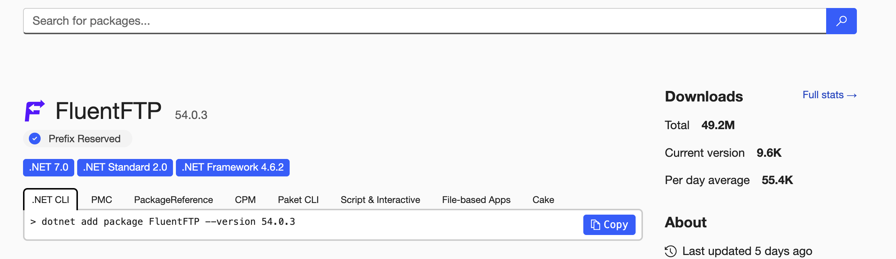
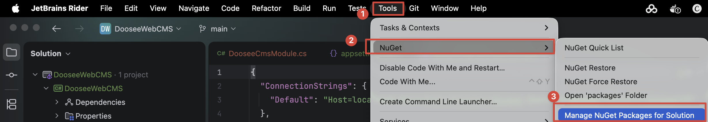
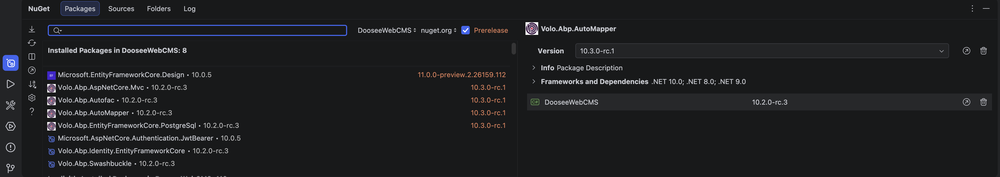
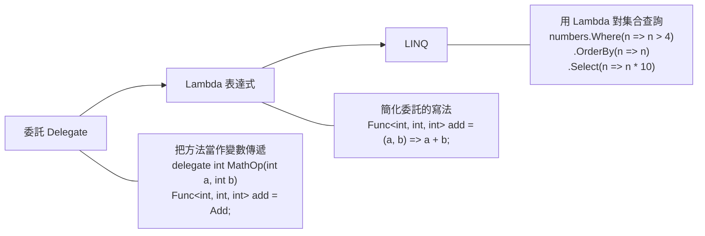

[TOC]

# 什麼是C#

如果 .NET 是一座工廠（提供機器、工具、基礎設施），那 C# 就是你在這座工廠裡使用的語言，用來指揮機器做事

**C# 能做什麼？**

它的應用範圍非常廣，涵蓋 Web 後端（ASP.NET Core，也就是 ABP 框架的基礎）、桌面應用（WPF、WinForms、MAUI）、手機 App（.NET MAUI 可同時開發 iOS 和 Android）、遊戲開發（Unity 引擎用的就是 C#）、雲端與微服務（Azure 原生支援），以及物聯網和 AI/ML 等領域。

# C#基礎語法

```c#
using Microsoft.AspNetCore;
using Microsoft.AspNetCore.Hosting;

namespace WebApplication1
{
    public class Program
    {
        public static void Main(string[] args)
        {

        }
    }
}
```

這是一個 C# 程式最基本的骨架結構

* `using` — 引用命名空間（第 1-2 行）

  就像要煮飯之前先把工具從櫃子裡拿出來。`using Microsoft.AspNetCore` 告訴程式「我要用到 ASP.NET Core 提供的功能」。如果不寫 `using`，每次用到這些功能就得寫完整路徑，非常囉嗦

* `namespace` — 命名空間（第 4 行）

  這是你的專案的「門牌號碼」。`namespace WebApplication1` 表示這個檔案裡的所有程式碼都屬於 `WebApplication1` 這個空間。這樣可以避免不同專案之間的類別名稱衝突，就像兩條不同街道上可以各有一間「7-11」而不會搞混

* `class Program` — 類別名稱（第 6 行）

  C# 是物件導向語言，所有程式碼都必須放在某個 `class`（類別）裡面。`Program` 是這個類別的名字，也是程式的主要入口類別。可以把 `class` 想成一個「容器」，裡面裝著相關的功能（方法）

* `Main` 方法 — 程式進入點（第 8 行）

  這是整個程式開始執行的地方。當你按下「執行」，電腦會來找 `Main` 這個方法，從這裡開始跑。拆解每個關鍵字的意思如下：`public` — 公開的，表示外部可以存取這個方法

  - `static` — 靜態的，不需要建立物件就能直接呼叫

  - `void` — 這個方法不回傳任何值

  - `string[] args` — 接收從命令列傳進來的參數，是一個字串陣列

> [!caution]
>
> C# 是大小寫敏感，`Name`、`name`、`NAME` 是三個完全不同的東西。寫錯大小寫程式直接報錯。比方說 `Console.WriteLine()` 你如果寫成 `console.writeline()` 就會編譯失敗

## 註解

單行註解用 `//`，多行註解用 `/* */`，文件註解用 `///`，電腦在執行時會完全忽略它

**單行註解**

```c#
// 這是單行註解
int age = 25; // 使用者的年齡
// 下面這行會印出歡迎訊息
Console.WriteLine("歡迎");

```

**多行註解**

```c#
/* 這是
   多行註解 */
/*
  這整段是計算折扣的邏輯
  目前還在開發中
  先不執行
*/
// decimal discount = price * 0.8m;
```

**文件註解**

```C#
/// <summary>這是給文件產生器看的註解</summary>

/// <summary>
/// 根據 ID 取得使用者資料
/// </summary>
/// <param name="id">使用者的唯一識別碼</param>
/// <returns>使用者的詳細資料</returns>
public async Task<UserDto> GetUserAsync(int id)
{
    // 實際邏輯寫在這裡
}
```

## 資料型態

同類型的資料在記憶體中佔的空間不同，能做的運算也不同。數字可以做加減乘除，字串可以串接，布林值只能是 true 或 false。**C# 是強型別語言**，宣告了型別之後就不能亂塞其他東西進去

> ###### 整數類型
>
> | 關鍵字  | 中文名稱       | 大小            | 範例               |
> | ------- | -------------- | --------------- | ------------------ |
> | `byte`  | 位元組         | 1 byte (0~255)  | `byte b = 255;`    |
> | `short` | 短整數         | 2 bytes (±3萬)  | `short s = 100;`   |
> | `int`   | 整數（最常用） | 4 bytes (±21億) | `int age = 25;`    |
> | `long`  | 長整數         | 8 bytes (超大)  | `long big = 999L;` |

> ###### 浮點數類型
>
> | 關鍵字    | 中文名稱             | 大小             | 範例                 |
> | --------- | -------------------- | ---------------- | -------------------- |
> | `float`   | 單精度浮點數         | 4 bytes (~7位)   | `float f = 3.14f;`   |
> | `double`  | 雙精度浮點數（預設） | 8 bytes (~15位)  | `double d = 3.14;`   |
> | `decimal` | 高精度小數（金額用） | 16 bytes (~28位) | `decimal p = 9.99m;` |
>
> > [!tip]
> >
> > * 如果賦值給一個變量是小數，默認為double類型
> >   * 若要聲明float要在數字後面加上`F`
> >   * 若要聲明decimal要在數字後面加上`M`

> ###### 文字類型
>
> | 關鍵字   | 中文名稱       | 大小    | 範例               |
> | -------- | -------------- | ------- | ------------------ |
> | `char`   | 字元（單引號） | 2 bytes | `char c = 'A';`    |
> | `string` | 字串（雙引號） | 不定    | `string s = "Hi";` |

> ###### 布林與其他
>
> | 關鍵字     | 中文名稱       | 大小    | 範例               |
> | ---------- | -------------- | ------- | ------------------ |
> | `bool`     | 布林值         | 1 byte  | `bool ok = true;`  |
> | `DateTime` | 日期與時間     | 8 bytes | `DateTime.Now;`    |
> | `object`   | 所有型別的根基 | 不定    | `object o = 123;`  |
> | `var`      | 自動推斷型別   | 自動    | `var x = "hello";` |

**隱含轉換（Implicit）— 小的放進大的，自動完成**

當資料從「小容量」型別轉到「大容量」型別時，不會遺失任何資料，所以 C# 允許自動轉換，你不用寫任何額外的語法：

csharp

```csharp
int a = 100;
long b = a;       // int → long，自動轉換，沒問題
float c = a;      // int → float，自動轉換
double d = c;     // float → double，自動轉換
```

可以想成把小杯子的水倒進大杯子，一定裝得下，不會溢出。

**明確轉換（Explicit）— 大的塞進小的，需要手動強制**

反過來從「大容量」轉到「小容量」，可能會遺失資料，C# 不會自動幫你做，你必須用 `(型別)` 的語法明確告訴編譯器「我知道風險，我要轉」：

csharp

```csharp
double x = 9.78;
int y = (int)x;       // 強制轉換，小數被截斷，y = 9

long big = 999999999999;
int small = (int)big;  // 危險！超出 int 範圍，值會出錯
```

這就像把大杯子的水倒進小杯子，可能會溢出來（資料遺失）。

# C#進階語法

## 委託（Delegate）

一般情況下呼叫方法是直接寫死的：

```csharp
int result = Add(1, 2);  // 直接呼叫 Add
```

但有時候你想「我先不決定要呼叫哪個方法，等到執行的時候再決定」，這就需要委託。

**基本用法：**

```csharp
// 定義一個委託型別：接受兩個 int，回傳一個 int
delegate int MathOperation(int a, int b);

// 兩個普通方法
int Add(int a, int b) => a + b;
int Multiply(int a, int b) => a * b;

// 把方法裝進委託變數
MathOperation operation = Add;
Console.WriteLine(operation(3, 4));  // 7

// 換成另一個方法
operation = Multiply;
Console.WriteLine(operation(3, 4));  // 12
```

`operation` 這個變數裡面裝的不是數值，而是一個方法。可以隨時換掉它指向的方法。

有了 `Func` 和 `Action`，幾乎不需要自己定義 `delegate` 了，一般直接用這兩個就夠。

*  `Func` ：有回傳值

  ```csharp
  // 最後一個泛型參數是回傳型別
  Func<int, int, int> add = (a, b) => a + b;
  Console.WriteLine(add(3, 4));  // 7
  ```

* `Action`：沒有回傳值

  ```csharp
  Action<string> greet = name => Console.WriteLine($"Hello {name}");
  greet("James");  // Hello James
  ```

## Lambda 表達式

Lambda 表達式就是一種**用 `=>` 符號來簡潔表達邏輯的語法**。`=>` 唸作「goes to」，左邊是參數，右邊是要做的事。

```csharp
// 完整寫法
(參數型別 參數名) => 
{ 
  方法主體; 
  return 結果; 
}

// 範例
(int n) => { return n * 2; }
```

C# 允許你一步步簡化，讓程式碼越來越短。

* 省略參數型別（編譯器自動推斷）
* 只有一個參數，省略小括號
* 只有一行，省略大括號和 return

```csharp
// 1. 完整寫法
(int n) => { return n * 2; }

// 2. 省略參數型別（編譯器自動推斷）
(n) => { return n * 2; }

// 3. 只有一個參數，省略小括號
n => { return n * 2; }

// 4. 只有一行，省略大括號和 return
n => n * 2
```

**Lambda 跟委託的關係**

Lambda 本身只是語法，它需要一個委託型別來承接。Lambda 的核心就是：**用最少的語法表達一段邏輯**。它不是一個新概念，而是把委託和匿名方法的寫法簡化到極致的語法糖。

```csharp
// C# 1.0：具名方法
bool IsEven(int n) { return n % 2 == 0; }
numbers.Where(IsEven);

// C# 2.0：delegate 匿名方法
numbers.Where(delegate(int n) { return n % 2 == 0; });

// C# 3.0：Lambda 表達式
numbers.Where(n => n % 2 == 0);
```


```csharp
// Func：有回傳值
Func<int, int> doubled = n => n * 2;
Func<int, int, int> add = (a, b) => a + b;
Func<int, bool> isEven = n => n % 2 == 0;

// Action：沒有回傳值
Action greet = () => Console.WriteLine("Hello");
Action<string> sayHi = name => Console.WriteLine($"Hi {name}");
```


# 什麼是.Net Core

.NET Core 是微軟開發的一個開源、跨平台的軟體開發框架，是傳統 .NET Framework 的現代化重新設計版本。

*[<kbd> .NET文檔  </kbd>](https://learn.microsoft.com/zh-tw/dotnet/?WT.mc_id=dotnet-35129-website)*

* **跨平台**：可以在 Windows、macOS 和 Linux 上運行，打破了傳統 .NET Framework 只能在 Windows 上運行的限制。
* **開源**：原始碼託管在 GitHub 上，由微軟和社群共同維護。
* **高效能**：在 Web 框架效能基準測試中表現優異，特別是搭配 ASP.NET Core 用於建構 Web 應用和 API 時。
* **模組化設計**：透過 NuGet 套件管理，應用程式只需引入實際用到的功能，體積更輕量。

主要用途包括 Web 應用（ASP.NET Core）、微服務、雲端應用、控制台工具，以及透過 MAUI 開發跨平台桌面與行動應用。從 .NET 5（2020年）開始，微軟將名稱簡化為「.NET」，統一了 .NET Core 和 .NET Framework 的品牌。

|  比較項目   | .NET Framework |        .NET Core / .NET 5+        |
| :---------: | :------------: | :-------------------------------: |
|  平台支援   |   僅 Windows   | 跨平台（Windows / macOS / Linux） |
|    開源     |    部分開源    |          完全開源（MIT）          |
|    效能     | 較低，改進有限 |        大幅提升，業界領先         |
| 容器 / 雲端 | 不支援 Docker  |       原生支援 Docker、K8s        |
|  部署方式   |  依賴系統安裝  |           可自包含部署            |
|  更新狀態   | 已停止功能更新 |          持續發佈新版本           |
|   微服務    |     不適合     |             天然支援              |

## .Net Standard


* **最底層：Common Infrastructure（共同基礎設施）**

  這是所有 .NET 平台共享的底層，包含 Compilers（編譯器，如 Roslyn）、Languages（語言，如 C#、F#、VB.NET）、Runtime components（執行時期元件）。不管你用哪個平台，這些基礎工具都是一樣的。

* **中間那條紅色大橫幅：.NET Standard Library**

  「One library to rule them all」（一個程式庫統治它們全部），這句話精準地說明了 .NET Standard 的使命——它橫跨了上方的三大平台，作為統一的 API 契約。.NET Standard 本身**只是一份規格（specification）**，它定義了「有哪些 API 必須存在」，但完全不包含實作

* **三大 .NET 平台與各自的 App Models**

  這三個直行就是當年 .NET 生態「分裂」的樣貌：

  * **綠色 — .NET Framework**：傳統的 Windows 專屬平台，上面跑的應用模型有 WPF、Windows Forms（桌面應用）和 ASP.NET（Web 應用）。
  * **藍色 — .NET Core**：微軟推出的跨平台版本，支援 UWP（Windows 通用應用）和 ASP.NET Core（新一代 Web 應用）。
  * **橘色 — Xamarin**：用來開發行動裝置 App 的平台，支援 iOS、Android、OS X。

> [!tip]
>
> 在 .NET Standard 出現之前，開發者面臨一個問題：.NET Framework、.NET Core、Xamarin 等平台各自有不同的 API 集合，導致撰寫跨平台共用的程式庫非常困難。.NET Standard 透過定義一個「共同契約」來解決這個問題——只要你的類別庫（class library）以某個版本的 .NET Standard 為目標，它就能在所有支援該版本的平台上執行。
>
> **版本與相容性**方面，.NET Standard 有多個版本（1.0 到 2.1）。版本號越低，支援的平台越多，但可用的 API 越少；版本號越高，API 越豐富，但支援的平台越少。例如 .NET Standard 2.0 是最廣泛使用的版本，同時被 .NET Framework 4.6.1+、.NET Core 2.0+ 和 Xamarin 支援。

## NuGet

NuGet 是 .NET 生態系的**套件管理工具**（package manager），角色就像 JavaScript 的 npm、Python 的 pip、Java 的 Maven。

*[<kbd> NuGet 官網  </kbd>](https://www.nuget.org/)*

解決的核心問題很簡單：當專案需要用到別人寫好的程式庫時，不用自己去下載 DLL、手動加參考、還要煩惱版本相容性。NuGet 會自動處理這一切。

**運作方式**大致是這樣：套件作者把編譯好的程式庫打包成一個 `.nupkg` 檔案（本質上就是一個 zip），上傳到 nuget.org 這個公開的套件倉庫。當你在專案裡執行類似 `dotnet add package Newtonsoft.Json` 的指令時，NuGet 就會自動去倉庫下載對應版本的套件，解壓縮，加入專案參考，並且一併處理該套件所依賴的其他套件（transitive dependencies）。

> [!tip]
>
> NuGet套件參差不齊，可以透過以下來判斷：
>
> * 下載量
> * 作者和來源
> * 最後更新時間
> * GitHub 星星數和 Issue 狀態

**NuGet使用方式**

*^tab^*

> **Nuget CLI(推薦)**
>
> 1. 上NuGet官網查詢需要的套件名稱
>
>    
>
> 2. 開啟終端機（Rider 內建的 Terminal 或外部的都可以）
>
> 3. 用 `cd` 切換到你要安裝套件的那個專案資料夾（是 `.csproj` 所在的目錄，不是 Solution 的根目錄）
>
> 4. 執行 `dotnet add package 套件名稱`，例如 `dotnet add package Newtonsoft.Json`
>
> 5. 等它跑完就裝好了，可以打開 `.csproj` 確認裡面多了一行 `<PackageReference>`
>
> > [!tip]
> >
> > * 如果要移除：`dotnet remove package Newtonsoft.Json`，也可以從.csproj檔案裡手動刪除
> >
> >   ```xml
> >   <Project Sdk="Microsoft.NET.Sdk">
> >     <PropertyGroup>
> >       <TargetFramework>net8.0</TargetFramework>
> >     </PropertyGroup>
> >     <ItemGroup>
> >       <PackageReference Include="Newtonsoft.Json" Version="13.0.3" />
> >       <PackageReference Include="Serilog" Version="3.1.1" />
> >     </ItemGroup>
> >   </Project>
> >   ```
> >
> >   想移除 Newtonsoft.Json，就直接把那一行 `<PackageReference>` 刪掉，存檔。然後回到終端機執行 `dotnet restore`，讓 NuGet 根據更新後的 `.csproj` 重新解析依賴關係，這樣就完成移除了。
> >
> > * 如果要還原（比如你剛 clone 別人的專案，需要把所有套件下載回來）：在 Solution 根目錄執行 `dotnet restore`

> **圖形化介面(Rider)**
>
> 
>
> 

# 異步

異步（Asynchronous）最核心的概念就是：**遇到需要等待的事情時，不要傻等，先去做別的事**。

* **同步（Synchronous）**：點完餐之後就站在櫃台前面發呆，什麼都不做，一直等到餐點做好才離開去做下一件事。
* **異步（Asynchronous）**：點完餐，拿到一個號碼牌（這就是 `Task`），然後就去滑手機、找座位、跟朋友聊天。等到叫號了（任務完成），你再回去取餐。

回到程式的世界，需要等待的事情通常是 I/O 操作，像是讀寫檔案、查詢資料庫、呼叫外部 API、網路請求等。這些操作的共同特點是 CPU 根本沒事做，只是在等外部回應。

## async await基本使用

**同步寫法**

```csharp
string content = File.ReadAllText("data.txt");
Console.WriteLine(content);
```

程式會停在第一行，直到整個檔案讀完才往下走。

**異步寫法**

```csharp
string content = await File.ReadAllTextAsync("data.txt");
Console.WriteLine(content);
```

加了 `await` 並且在方法名最後面加上 `Async` 結尾，程式發出讀檔請求後不會傻等，等檔案讀完再回來繼續執行下一行。異步方法的回傳值是 `Task<T>`，所以 `File.ReadAllTextAsync()` 回傳的其實是 `Task<string>`，不是直接給你 `string`。之後會把 `Task<string>` 解包成 `string`，讓你直接拿到裡面的值。

> [!caution]
>
> 如果沒有使用 `await` ：
>
> * 這時候程式不會等I/O操作就直接往下執行了，寫入還沒完成，下一行就去讀了。結果可能是讀到空的內容，甚至直接報錯說檔案被佔用中。
>
>   ```csharp
>   File.WriteAllTextAsync(fileName, "hello async");  // 沒有 await
>   string s = await File.ReadAllTextAsync(fileName);  // 馬上去讀
>   Console.WriteLine(s);
>   ```
>
> * 拿到的就是 `Task<T>` 本身，而不是裡面的值
>
>   ```csharp
>   // 沒有 await，拿到的是 Task<string>，不是 string
>   Task<string> task = File.ReadAllTextAsync("data.txt");
>   ```

**方法必須標記 `async`**

> [!important]
>
> 只要方法裡面用了 `await`，這個方法就必須加上 `async` 修飾詞，而且回傳型別要改成 `Task` 或 `Task<T>`，避免使用`void` (即使無回傳值)

```csharp
// 有回傳值：Task<T>
async Task<string> GetContentAsync()
{
    string content = await File.ReadAllTextAsync("data.txt");
    return content;  // 直接 return string，不用包成 Task
}

// 沒有回傳值：Task
async Task SaveContentAsync()
{
    await File.WriteAllTextAsync("data.txt", "hello");
    // 不需要 return
}
```

## 編寫異步方法

實務上最常見的情況是，你把多個異步操作組合起來變成自己的方法：

```csharp
async Task<string> ReadAndProcessAsync(string fileName)
{
    string content = await File.ReadAllTextAsync(fileName);
    string result = content.ToUpper(); // 做一些處理
    return result;
}
```

> [!caution]
>
> `Wait()` 和 `.Result` 是用**同步的方式**去強制等待異步任務完成。
>
> ```csharp
> // .Result：強制取得結果，會阻塞執行緒直到完成
> Task<string> task = File.ReadAllTextAsync("data.txt");
> string content = task.Result;  // 卡在這裡等
> 
> // .Wait()：強制等待完成，但不取值（用於沒有回傳值的 Task）
> Task task2 = File.WriteAllTextAsync("data.txt", "hello");
> task2.Wait();  // 卡在這裡等
> ```
>
> 看起來好像也能用，但**非常不建議用這兩個**，原因有兩個。
>
> 1. **失去異步的意義**：你用 async/await 就是為了不要阻塞執行緒。結果用 `.Result` 或 `.Wait()` 又把執行緒卡住了，等於白做。
> 2. **可能造成死鎖（deadlock）**：這是最危險的問題。在某些環境下（像 ASP.NET、WPF），異步任務完成後需要回到原本的執行緒繼續執行，但那個執行緒正被 `.Result` 或 `.Wait()` 卡住。結果就是：任務在等執行緒釋放，執行緒在等任務完成，兩邊互等，程式直接凍住。

## 異步原理解析

`async/await` 在編譯後看似在等待上一步執行完後才接著下一步，其實編譯過程中編譯器改寫成了一個**狀態機（state machine）**。

**原先的程式碼**

```csharp
async Task DoWorkAsync()
{
    Console.WriteLine("步驟1");
    string data = await File.ReadAllTextAsync("data.txt");
    Console.WriteLine("步驟2: " + data);
    await File.WriteAllTextAsync("output.txt", data);
    Console.WriteLine("步驟3");
}
```

**編譯器看到的**

編譯器會以每個 `await` 為切割點，把方法拆成好幾段。概念上大致像這樣（簡化版）：

```csharp
class DoWorkAsync_StateMachine
{
    int state = 0;
    string data;

    void MoveNext()
    {
        switch (state)
        {
            case 0:
                Console.WriteLine("步驟1");
                // 發起讀檔，註冊回呼
                var task1 = File.ReadAllTextAsync("data.txt");
                state = 1;
                // 如果還沒完成，就 return，讓出執行緒
                // 完成後會再次呼叫 MoveNext()
                task1.OnCompleted(() => MoveNext());
                return;

            case 1:
                // 回來了，取得結果
                data = task1.Result;
                Console.WriteLine("步驟2: " + data);
                var task2 = File.WriteAllTextAsync("output.txt", data);
                state = 2;
                task2.OnCompleted(() => MoveNext());
                return;

            case 2:
                Console.WriteLine("步驟3");
                // 全部完成
                return;
        }
    }
}
```

所以整個流程是這樣的：

執行到第一個 `await`，發現讀檔還沒完成，就把 `state` 設為 1，然後**直接 return**，把執行緒還回去。執行緒可以去處理別的工作。等到讀檔完成後，系統會回來呼叫 `MoveNext()`，這時候 `state` 是 1，就跳到 case 1 繼續執行。碰到第二個 `await` 又是同樣的流程，設 state 為 2，return，等完成後再回來。

**關鍵點是：沒有任何執行緒在那邊空等。** `await` 期間執行緒是被釋放的，等到異步操作完成後，系統才會安排一個執行緒回來繼續跑狀態機的下一段。這就是 async/await 高效率的根本原因。

**省略 async/await 直接返回 Task：原理與使用時機**

先看兩種寫法的對比：

```csharp
// 寫法一：用 async/await
async Task<string> GetDataAsync()
{
    return await File.ReadAllTextAsync("data.txt");
}

// 寫法二：直接返回 Task
Task<string> GetDataAsync()
{
    return File.ReadAllTextAsync("data.txt");
}
```

兩者的功能完全一樣，但背後的機制不同。

---

> **寫法一：使用async/await**
>
> 編譯器看到 `async` 就會生成一個狀態機。即使你的方法裡只有一行 `await`，它還是會建立狀態機物件、分配記憶體、管理狀態切換。整個流程是：呼叫 `ReadAllTextAsync` → 拿到 `Task<string>` → `await` 解包 → 拿到 `string` → 再包回一個**新的** `Task<string>` 返回給呼叫端。等於多做了一次解包再包裝的動作。
>
> > [!tip]
> >
> > 當方法只是單純地轉發，中間不做任何其他事情的時候才可以使用
> >
> > ```csharp
> > // 單純轉發，可以省略
> > Task<string> GetDataAsync()
> > {
> >     return repository.GetDataAsync();
> > }
> > 
> > // 單純轉發帶參數，可以省略
> > Task<User> GetUserAsync(int id)
> > {
> >     return database.QueryAsync<User>(id);
> > }
> > ```

> **寫法二：直接返回 Task**
>
> 沒有 `async`，編譯器不會生成狀態機。`ReadAllTextAsync` 回傳的 `Task<string>` 直接原封不動地傳給呼叫端。沒有額外的物件分配，沒有狀態機，沒有多餘的包裝。
>
> > [!tip]
> >
> > 只要方法裡有任何額外邏輯，就必須保留 `async/await`
> >
> > ```csharp
> > // 有多個 await，不能省
> > async Task<string> GetAndProcessAsync()
> > {
> >     string raw = await File.ReadAllTextAsync("data.txt");
> >     await Task.Delay(1000);
> >     return raw.ToUpper();
> > }
> > 
> > // 有 try-catch，不能省
> > async Task<string> GetDataSafeAsync()
> > {
> >     try
> >     {
> >         return await httpClient.GetStringAsync("https://example.com");
> >     }
> >     catch (HttpRequestException)
> >     {
> >         return "fallback";
> >     }
> > }
> > ```

## Task.Delay

`Task.Delay`：設一個計時器，執行緒直接被釋放，時間到了再回來。

```csharp
Console.WriteLine("開始");
await Task.Delay(3000);  // 執行緒被釋放，3 秒後回來
Console.WriteLine("結束");
```

這 3 秒內沒有任何執行緒被佔用，就跟我們前面聊的狀態機一樣，碰到 `await` 就 return 了，時間到了再呼叫 `MoveNext()` 回來繼續。等待的時間可以執行其他任務。

> [!warning]
>
> 異步程式碼裡面一律用 `Task.Delay`，永遠不要用 `Thread.Sleep`，否則就把異步的優勢全部抵銷了。
>
> **`Thread.Sleep`**：直接把當前執行緒凍住，什麼都不能做。
>
> ```csharp
> Console.WriteLine("開始");
> Thread.Sleep(3000);  // 執行緒卡死 3 秒
> Console.WriteLine("結束");
> ```
>
> 這 3 秒內這個執行緒完全被佔住，無法去處理其他工作。

## CancellationToken 參數

`CancellationToken` 是 .NET 提供的一個**取消機制**，可以通知正在執行的異步操作「不用做了，取消吧」。

想像一個場景：使用者在搜尋框輸入關鍵字，每打一個字就發出一次 API 請求。使用者打了「app」，就發了三次請求：「a」、「ap」、「app」。前兩次的結果其實已經不需要了，但它們還在跑，浪費資源。有了 `CancellationToken`，你就可以在發出新請求時取消舊的。

.NET 內建的異步方法基本上都有提供 `CancellationToken` 的參數重載，這個參數通常放在最後一個位置，而且是**可選的（optional）**，預設值是 `CancellationToken.None`，也就是不取消。

```csharp
// 不需要取消，直接用
await File.ReadAllTextAsync("data.txt");

// 需要取消，傳入 token
await File.ReadAllTextAsync("data.txt", token);
```


1. 先建立一個 `CancellationTokenSource`，它是發號施令的人；從它身上拿到 `CancellationToken`

   ```csharp
   var cts = new CancellationTokenSource();
   CancellationToken token = cts.Token;
   ```

2. 把 token 傳給異步方法

   ```csharp
   try
   {
       // 把 token 傳進去
       string html = await httpClient.GetStringAsync("https://example.com", token);
       Console.WriteLine(html);
   }
   catch (OperationCanceledException)
   {
       Console.WriteLine("請求被取消了");
   }
   
   // 在某個時機呼叫 Cancel()，比如使用者按了取消按鈕
   cts.Cancel();
   ```

> [!tip]
>
> 自己寫的異步方法也可以支援取消：
>
> ```csharp
> var cts = new CancellationTokenSource();
> cts.CancelAfter(1000);
> var token = cts.Token;
> 
> await DownloadAsync("https://www.google.com", 100, token);
> return;
> 
> async Task DownloadAsync(string url, int times, CancellationToken cancellationToken)
> {
>     using var client = new HttpClient();
>     for (var i = 0; i < times; i++)
>     {
>         var result = await client.GetStringAsync(url,  cancellationToken);
>         Console.WriteLine($"Download {i + 1}: {result.Length} characters");
>         // if (cancellationToken.IsCancellationRequested)
>         // {
>         //     Console.WriteLine("Cancelled");
>         //     break;
>         // }
>         cancellationToken.ThrowIfCancellationRequested();
>     }
> }
> ```

## WhenAll 和 WhenAny

這兩個是**同時處理多個異步任務**的方法。

* `Task.WhenAll`：等全部完成

  假設你要同時下載三個網頁，一個一個等太慢了：

  ```csharp
  // 一個一個等，假設每個要 2 秒，總共 6 秒
  string a = await httpClient.GetStringAsync("https://a.com");
  string b = await httpClient.GetStringAsync("https://b.com");
  string c = await httpClient.GetStringAsync("https://c.com");
  ```

  用 `WhenAll` 讓三個同時跑：

  ```csharp
  // 三個同時發出去
  Task<string> taskA = httpClient.GetStringAsync("https://a.com");
  Task<string> taskB = httpClient.GetStringAsync("https://b.com");
  Task<string> taskC = httpClient.GetStringAsync("https://c.com");
  
  // 等全部完成，總共只要約 2 秒
  string[] results = await Task.WhenAll(taskA, taskB, taskC);
  
  Console.WriteLine(results[0]); // a.com 的結果
  Console.WriteLine(results[1]); // b.com 的結果
  Console.WriteLine(results[2]); // c.com 的結果
  ```

  關鍵在於先不加 `await`，讓三個任務都發出去，最後再用 `WhenAll` 一次等全部完成。回傳的是一個陣列，順序跟你傳入的順序一致。

* `Task.WhenAny`：等任何一個完成就好

  ```csharp
  Task<string> taskA = httpClient.GetStringAsync("https://a.com");
  Task<string> taskB = httpClient.GetStringAsync("https://b.com");
  Task<string> taskC = httpClient.GetStringAsync("https://c.com");
  
  // 誰先完成就拿誰的結果
  Task<string> fastest = await Task.WhenAny(taskA, taskB, taskC);
  string result = await fastest;
  Console.WriteLine($"最快的回傳了：{result}");
  ```

  > [!caution]
  >
  > `WhenAny` 回傳的是**最先完成的那個 Task**，不是直接給你值，所以要再 `await` 一次拿結果。

> [!important]
>
> * 使用 `await` 不是也會一個人服務多個嗎，有什麼差別？
>
>   * 用 `await` 逐個呼叫：
>
>     ```csharp
>     // 逐個 await：對「這段邏輯」來說是串行的
>     await GetA();  // 這段邏輯等 A 完成
>     await GetB();  // 才輪到 B
>     await GetC();  // 才輪到 C
>     // 總共 6 秒
>     ```
>
>     執行緒沒有傻等，等 A 的時候，執行緒**回到執行緒池**隨時可以被派去做事，不會阻塞，但**對這段程式碼本身來說**，三個任務是排隊的。A 完成才發 B，B 完成才發 C。每個要 2 秒，總共 6 秒。
>
>   * 用 `WhenAll`：
>
>     ```csharp
>     // WhenAll：對「這段邏輯」來說是並行的
>     var taskA = GetA();  // 發出 A
>     var taskB = GetB();  // 馬上發出 B
>     var taskC = GetC();  // 馬上發出 C
>     await Task.WhenAll(taskA, taskB, taskC);  // 三個同時跑
>     // 總共 2 秒
>     ```
>
>     三個請求**同時發出去**，同時在跑。每個要 2 秒，但因為是並行的，總共只要約 2 秒。

# LINQ

LINQ（Language Integrated Query）是 C# 內建的**查詢語法**，讓你可以用統一的方式對各種資料集合進行查詢、過濾、排序、轉換。



## LINQ原理

```csharp
// 取得陣列裡>10的值，並打印出來
var nums = new int[] {2,5,15,8434,3432,134};
var result = nums.Where(a => a > 10);
foreach (var item in result)
{
    Console.WriteLine(item);
}
```

`Where` 是 LINQ 提供的其中一個簡易方法，會遍歷每一個陣列的值判斷是否為 `true` ，這裡串起了好幾個概念：

1. 它的參數需要一個委託 `Func<int, bool>` 的匿名函數傳入。
2. 透過Lambda 表達式 `a => a > 10` 傳參數進去。
3. 回傳型別是 `IEnumerable<int>` 的介面，代表一個可遍歷的集合。
4. `foreach` 遍歷的時候，才會真正逐一檢查每個元素。這就是 `yield return` 帶來的延遲執行，也代表如果你中途 `break`，剩下的元素根本不會被處理。

```csharp
// 實做接近LINQ裡面的where 
static IEnumerable<int> MyWhere(IEnumerable<int> items, Func<int, bool> f)
{
    foreach (int i in items)
    {
        if (f(i))
        {
            yield return i;
        }
    }
}
```

接受兩個參數

* `items` 是要被過濾的集合
* `f` 是判斷條件，一個委託，接受 `int` 回傳 `bool`

 `foreach` 遍歷每個元素，對每個元素呼叫 `f(i)`(後面會以實參lambda表達式傳入)，如果回傳 `true` 就 `yield return` 結果。
