[TOC]

# 基本觀念

==Python是一種直譯式、物件導向的動態語言==

---

> **直譯式語言(Python)**
>
> 在執行前把原始碼整體（或大部分）轉成目標平台的機器碼，之後直接由 CPU 執行
>
> ```mermaid
> flowchart LR
>   D[原始碼]--> F[直譯式語言]
>   
>   classDef green fill:#90EE90,stroke:#333,stroke-width:2px
>   class D,F green
> ```

> **編譯式語言(C, Java)**
>
> 在執行時逐步讀取、分析、執行，不一定產生最終機器碼檔
>
> ```mermaid
> flowchart LR
>   A[原始碼] --> B[編譯<br/>Compile]
>   B --> C[機器碼]
>   
>   classDef green fill:#90EE90,stroke:#333,stroke-width:2px
>   classDef yellow fill:#FFFF99,stroke:#333,stroke-width:2px
>   class A,C green
>   class B yellow
> ```

* 動態語言：變數名稱只是「標籤」，隨時可以指向任何資料類型的「物件」

    ```python
    x = 10        # x 指向一個 int 物件
    x = "hello"   # 現在 x 改指向一個 str 物件（合法）
    ```

* 靜態語言：變數可以當作是一個固定資料類型的儲存空間，放進去的值型別必須符合宣告，否則在「編譯」就被擋下來

    ```java
    int x = 10;
    x = "hello";   // 編譯期直接報錯：型別不相容
    ```

## 應用範圍

* 網站與後端開發 (Web Backend & APIs)
    * 輕量：Flask、FastAPI（型別提示友好，速度較佳，適合高併發 API）
    * 全功能：Django（內建 ORM、Admin、Auth、模板）
    * 異步：Starlette、Sanic
* 自動化腳本與作業系統工具
    * DevOps 輔助：部署腳本、CI/CD 小工具
    * 常用模組：os、pathlib、shutil、subprocess、argparse、click（更好 CLI）、rich（彩色輸出）、typer
    * 案例：每日匯整伺服器 log，篩出錯誤寄送 Email（可結合 Crontab + Flask context + SES）
* 資料科學、資料分析 (Data Analysis)
    * 視覺化：Matplotlib、Seaborn、Plotly、Bokeh
    * 資料清理：Pandas + pyjanitor、Polars（高效列式框架）
* 機器學習 / 深度學習 (ML / DL / AI)
    * 傳統 ML：scikit-learn、XGBoost、LightGBM, CatBoost
    * 深度學習：TensorFlow / Keras、PyTorch
    * NLP：spaCy、NLTK、Transformers (Hugging Face)
    * 向量資料庫 / 檢索：FAISS、Chroma、Weaviate 客戶端
* Web 爬蟲 / 資料蒐集 (Scraping & Crawling)
    * 解析：requests、httpx（異步）、BeautifulSoup、lxml、selectolax
    * 爬蟲框架：Scrapy（大規模）、Playwright / Selenium（動態）

## 環境安裝與虛擬環境(todo:env)

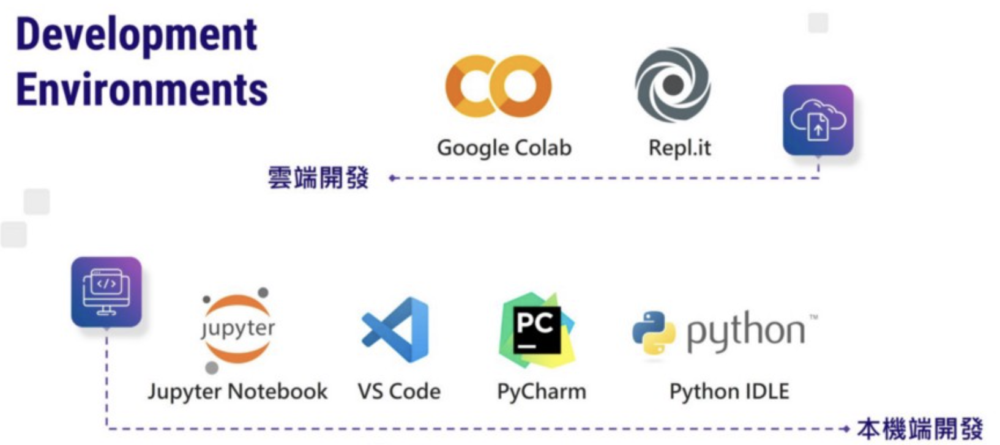

如果選擇本機端開發，就要安裝編譯環境，讓電腦知道並且解析Python語言

*==**Python vs Anaconda vs Miniconda**==*

|    安裝方式     |               優點                |               缺點               |      適用場景      |                           下載連結                           |
| :-------------: | :-------------------------------: | :------------------------------: | :----------------: | :----------------------------------------------------------: |
| **官方 Python** |       純淨、輕量、最新版本        |    需手動管理包、環境管理複雜    |   學習、輕量開發   | *[<kbd> Python官網  </kbd>](https://www.python.org/downloads/)* |
|  **Anaconda**   | 預裝科學計算包、GUI工具、環境管理 | 體積大(3GB+)、包版本可能不是最新 | 數據科學、機器學習 | *[<kbd> Anaconda  </kbd>](https://www.anaconda.com/download/success)* |
|  **Miniconda**  |    輕量、靈活、強大的環境管理     |        需手動安裝需要的包        | 專業開發、生產環境 | *[<kbd> Miniconda  </kbd>](https://www.anaconda.com/download/success)* |

> [!important]
>
> 如果Python環境已經安裝好，安裝時沒有勾選設置環境變數的話可能會造成終端機無法識別指令，此時需手動將Python安裝路徑加入環境變數
>
> 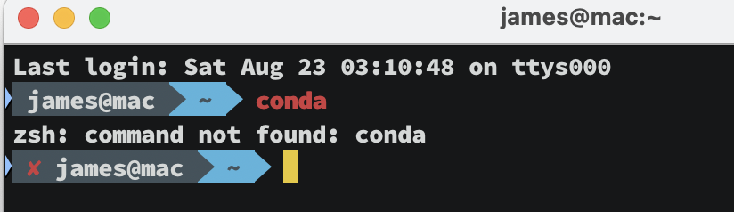

> **什麼是虛擬環境**
>
> 使用者開發 Python 專案時，最常遇見的問題就是不同專案可能會有不同的Python 版本以及不同的 Packages 需要安裝，那麼在管理上就會是一個問題了
>
> 如果你只需要使用特定的套件，或是想要嘗試各種不同的環境應用，但又不想彼此的開發環境受到影響，就可以使用虛擬環境
>
> 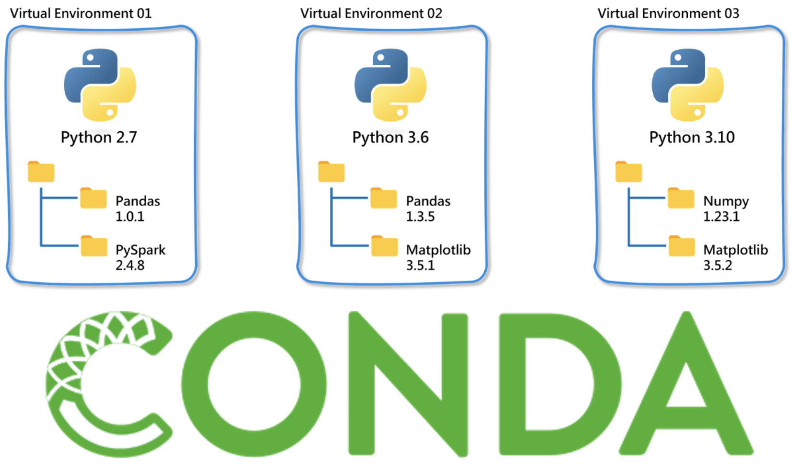

> **什麼是conda**
>
> Conda 是一個開源套件管理系統和環境管理系統，可以在 Windows、macOS 和 Linux 等作業系統上運行
>
> Conda 作為套件管理器可幫助您尋找及安裝套件。如果你需要不同版本 Python 來執行一些專案，只需幾個命令就可以設置一個完全獨立的環境來執行不同版本的 Python，同時繼續在正常環境中直行常用版本的 Python
>
> 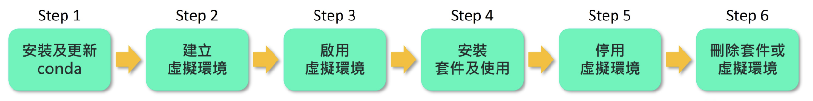

## Python 內建函數

**Python 內建函數**（Built-in Functions）是 Python 解釋器預先定義好的函數，無需匯入任何模組就可以直接使用。這些函數是 Python 語言核心的一部分，提供了最基本和最常用的功能

|      函數       |      ==       |       ==       |       ==       |        ==        |
| :-------------: | :-----------: | :------------: | :------------: | :--------------: |
|     `abs()`     |  `delattr()`  |    `hash()`    | `memoryview()` |     `set()`      |
|     `all()`     |   `dict()`    |    `help()`    |    `min()`     |   `setattr()`    |
|     `any()`     |    `dir()`    |    `hex()`     |    `next()`    |    `slice()`     |
|    `ascii()`    |  `divmod()`   |     `id()`     |   `object()`   |    `sorted()`    |
|     `bin()`     | `enumerate()` |   `input()`    |    `oct()`     | `staticmethod()` |
|    `bool()`     |   `eval()`    |    `int()`     |    `open()`    |     `str()`      |
| `breakpoint()`  |   `exec()`    | `isinstance()` |    `ord()`     |     `sum()`      |
|  `bytearray()`  |  `filter()`   | `issubclass()` |    `pow()`     |    `super()`     |
|    `bytes()`    |   `float()`   |    `iter()`    |   `print()`    |    `tuple()`     |
|  `callable()`   |  `format()`   |    `len()`     |  `property()`  |     `type()`     |
|     `chr()`     | `frozenset()` |    `list()`    |   `range()`    |     `vars()`     |
| `classmethod()` |  `getattr()`  |   `locals()`   |    `repr()`    |     `zip()`      |
|   `compile()`   |  `globals()`  |    `map()`     |  `reversed()`  |  `__import__()`  |
|   `complex()`   |  `hasattr()`  |    `max()`     |   `round()`    |                  |

> [!warning]
>
> 避免重新定義內建函數，這樣會導致原本內建的函數無法使用
>
> ```python
> # ❌ 錯誤示範 - 重新定義內建函數
> list = [1, 2, 3]  # 覆蓋了內建的 list() 函數
> print = "hello"   # 覆蓋了內建的 print() 函數
> 
> # 現在無法使用原本的函數了
> # list([1, 2, 3])  # TypeError: 'list' object is not callable
> # print("hello")   # TypeError: 'str' object is not callable
> 
> # ✅ 正確做法
> my_list = [1, 2, 3]
> message = "hello"
> print(my_list)
> ```
>


## PEP8

==**PEP 8** 是 Python 官方的程式碼風格指南==

它定義了 Python 程式碼的撰寫標準，目的是提高程式碼的可讀性和一致性 *[<kbd> PEP8  </kbd>](https://peps.python.org/pep-0008/)*

* 命名慣例：變數名稱建議使用**小寫字母**，並用**底線**連接

    * user_name = "alice" 
    * total_count = 0 
    * max_retry_attempts = 3 

* 縮排

    * 使用 4 個空格縮排

        ```python
        def calculate_total(items):
            total = 0
            for item in items:
                if item.is_valid():
                    total += item.price
            return total
        ```

* 表達式和語句

    * 運算子前後有空格

        ```python
        x = y + z
        result = (a + b) * (c - d)
        ```

    * 逗號後的空格

        ```python
        my_list = [1, 2, 3, 4]
        my_dict = {'key1': 'value1', 'key2': 'value2'}
        ```

> [!note]
>
> 上面的只是舉例，實際上還有很多的規範，設計程式的時候不使用PEP8程式一樣還是可以執行

# 變數與基本數學運算

Python在設計變數的時候，不用先宣告。當我們在設定變數的內容的時候，變數本身會由所設定的內容自行決定

變數只是一個暫時存放資料的地方，程式中用來「命名並參照一個值（資料物件）」的符號識別名稱，如果今天想要計算自己的BMI，我們可能就要有兩個變數分別存放身高還有體重，再來做計算

範例：

```python
height = 1.8  # height 綁定到一個 float 物件
weight = 70   # weight 綁定到一個 int 物件

BMI = weight/(height)**2
```

## 變數地址

Python作為**動態語言**，變數處理和一般的靜態語言不同

對於Python而言，變數使用的是參照地址的概念，變數名稱像是「標籤」，指向記憶體中的物件，可以使用 `id()` 這個內置函數來取得變數的地址

> [!important]
>
> 換句話說，變數存放的就是這個物件的地址，而非物件的值

---

> **靜態語言**
>
> x 和 y 各自佔用不同記憶體空間
>
> ```mermaid
> graph TB
>   subgraph "靜態語言 (C/C++)"
>       A1[變數 x] --> M1[記憶體位址 0x1001<br/>值: 10]
>       A2[變數 y] --> M2[記憶體位址 0x1002<br/>值: 10]
>       
>       style M1 fill:#ffcccc
>       style M2 fill:#ffcccc
>       style A1 fill:#e6f3ff
>       style A2 fill:#e6f3ff
>   end
> ```

>**動態語言**
>
>x 和 y 共同指向同一個物件
>
>```mermaid
>graph TB
>  subgraph "Python (動態語言)"
>        B1[變數名稱 x] --> O1[int 物件<br/>記憶體位址 0x2001<br/>值: 10]
>        B2[變數名稱 y] --> O1
>
>        style O1 fill:#ccffcc
>        style B1 fill:#fff2cc
>        style B2 fill:#fff2cc
>  end
>```

```python
x = 10
y = 10

print("x的記憶體位址", id(x))
print("y的記憶體位址", id(y)) 

"""
x的記憶體位址 4364118904
y的記憶體位址 4364118904
"""
```

>[!note]
>
>要確認兩個變數的地址是否相同可以使用 `x is y` 來判斷記憶體地址

## 註解

註解的根本價值：補足「原始碼本身無法（或不適合）直接承載的意圖與背景資訊」，讓未來在維護程式的時候能更快速、準確理解系統

* 單行註解：

    ```python
    height = 1.8  # height 綁定到一個 float 物件
    weight = 70   # weight 綁定到一個 int 物件
    ```

* 多行註解：

    ```python
    def get_user(user_id: int) -> "User | None":
        """
        依主鍵擷取 User。
        若資料被軟刪除（is_deleted=True）仍回傳，後續流程自行過濾。
        避免在此層加入業務邏輯以保持 Repository 純度。
        """
        return User.query.get(user_id)
    ```

## 命名規則

- **字符集限制**：字母（a-z, A-Z）、數字（0-9）、底線（_）
- **開頭字符**：不可以數字開頭
- **大小寫敏感**：`userName` 與 `username` 為不同識別符

> [!caution]
>
> 不可使用Python關鍵字作為變數名
>
> ```python
> # 錯誤範例
> class = "student"    # class 是 Python 關鍵字
> def = 42            # def 是 Python 關鍵字
> ```

## 基本數學運算

==賦值是一個等號(=)的運算，將右邊的值或是變數設定給左邊的變數==

> **實例：將5設定給變數x，設定y是(x-3)**
>
> ```python
> x = 5
> y = x-3
> print(f"{y=}")
> 
> """
> y=2
> """
> ```

四則運算：

* 加：`x = 5 + 6`
* 減：`x = 5 - 6`
* 乘：`x = 5 * 6`
* 除：`x = 5 / 6`
* 取餘數：`x = 5 % 6`
* 取整數：`x = 5 // 6`
* 次方：`x = 5 ** 6`

>[!important]
>
>計算式的優先順序
>
>1. 括號()
>2. 次方**
>3. 乘法、除法、求餘數、求整數
>4. 加法、減法

下面都這些都是常見的運算子：

| 運算子 |   語法    |     說明     | 實例 (假設 x=10) |  結果  |
| :----: | :-------: | :----------: | :--------------: | :----: |
|  `=`   |  `a = b`  |   基本指派   |     `x = 10`     |   10   |
|  `+=`  | `a += b`  | `a = a + b`  |     `x += 5`     |   15   |
|  `-=`  | `a -= b`  | `a = a - b`  |     `x -= 5`     |   5    |
|  `*=`  | `a *= b`  | `a = a * b`  |     `x *= 5`     |   50   |
|  `/=`  | `a /= b`  | `a = a / b`  |     `x /= 5`     |  2.0   |
|  `%=`  | `a %= b`  | `a = a % b`  |     `x %= 5`     |   0    |
| `//=`  | `a //= b` | `a = a // b` |    `x //= 5`     |   2    |
| `**=`  | `a **= b` | `a = a ** b` |    `x **= 5`     | 100000 |

## 進位數轉換

電腦的儲存單位：Bit 與 Byte

* **Bit (位元)**：電腦中最小的資料單位，只能儲存 0 或 1
    * 表示電腦中的開關狀態（開=1，關=0）
* **Byte (位元組)**：由 8 個 bit 組成的單位
    * 可以表示 2⁸ = 256 種不同的值（0-255），通常都會保留左邊最大的一位當作正負號
    * 通常用來表示一個字元（如英文字母、數字、符號）

> [!note]
>
> * 1 Byte = 8 bits
> * 1 KB = 1,024 bytes
> * 1 MB = 1,024 KB
> * 1 GB = 1,024 MB

進位數系統是一種表示數字的方法，不同的系統使用不同的基數（底數）。我們日常使用的是十進制（基數10），但電腦內部使用二進制（基數2），也就是用1、0來表示

---

---

---

> **二進制 (Binary)**
>
> 數字: 0, 1
>
> 範例: 1010₂

> **八進制 (Octal)**
>
> 數字: 0-7
>
> 範例: 12₈

> **十進制 (Decimal)**
>
> 數字: 0-9
>
> 範例: 10₁₀

> **十六進制 (Hexadecimal)**
>
> 數字: 0-9, A-F
>
> 範例: A₁₆

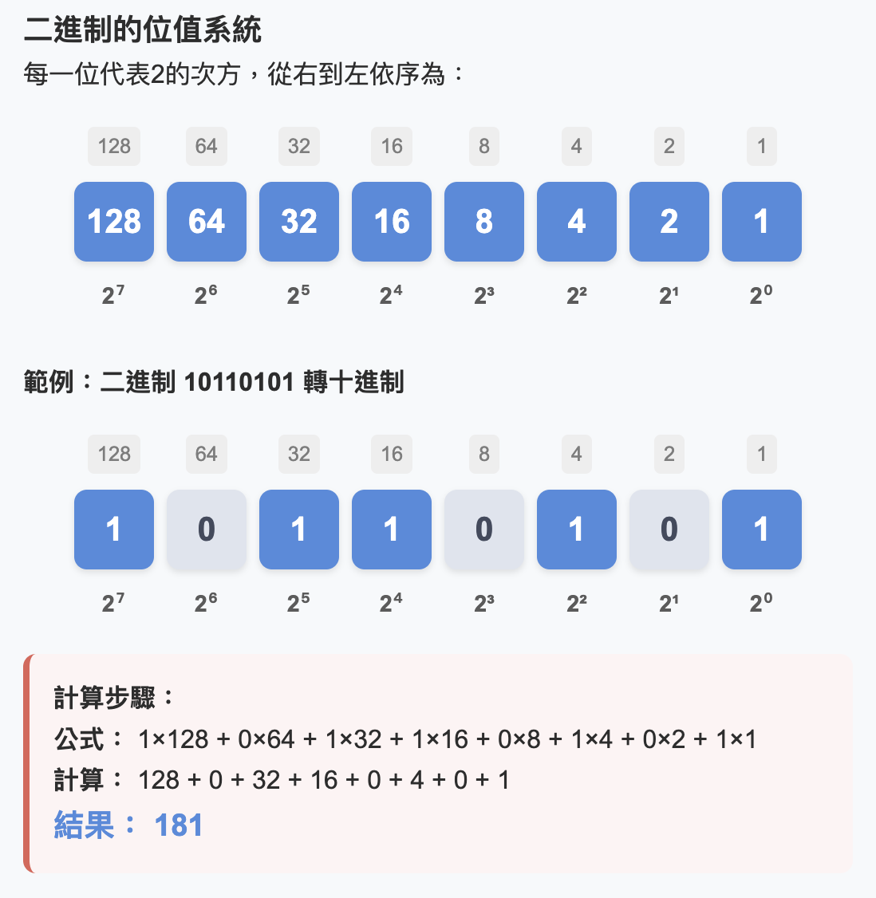

```python
#十進位
print("10的十進位", 10)

# 二進位 0 1 
# b表示二進位
print("10的二進位", bin(10))

# 八進位 0 1 2 3 4 5 6 7
# o表示八進位
print("10的八進位", oct(10))

# 十六進位 0 1 2 3 4 5 6 7 8 9 a b c d e f
# x表示十六進位
print("10的十六進位", hex(10))

"""
10的十進位 10
10的二進位 0b1010
10的八進位 0o12
10的十六進位 0xa
"""
```

---

> **正數十進位轉換二進位**
>
> 以25舉例：
>
> 25 = 16+8+1
>
> 

> **負數十進位轉換二進位**
>
> 以-25舉例：
>
> 1. 先將+25轉成二進制並加上符號位
>
>     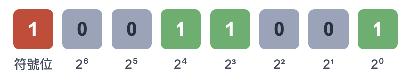
>
> 2. 取反數(符號位不取反)
>
>     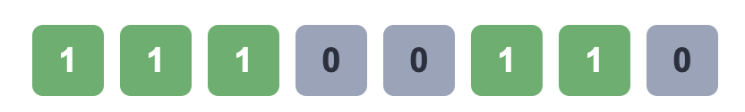
>
> 3. 補數(反數+1)
>
>     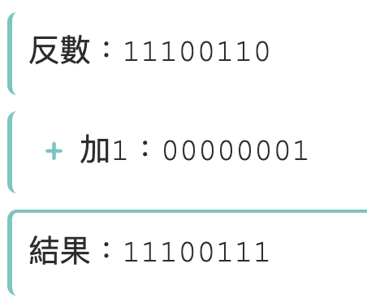

所有二進位運算（加、減、乘、除）都是基於同一套加法系統實現的

*^tab^*

> **加**
>
> 範例：5 + 3 = 8
>
> 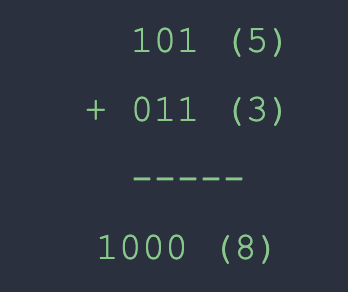

>**減**
>
>範例：5 - 3 = 2
>
>---
>
>> 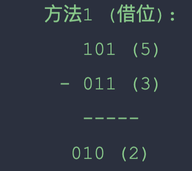
>
>> 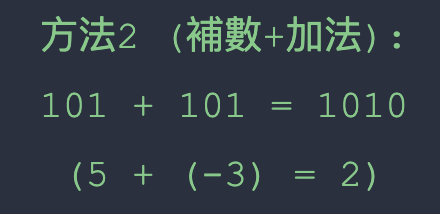

> **乘**
>
> 左移並相加
>
> 範例：5 × 3 = 15
>
> 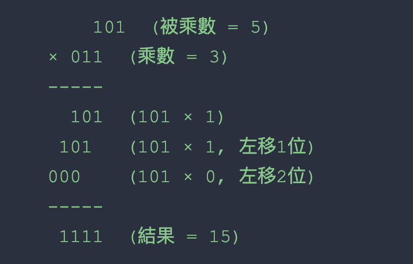

> **除**
>
> 範例：15 ÷ 3 = 5
>
> 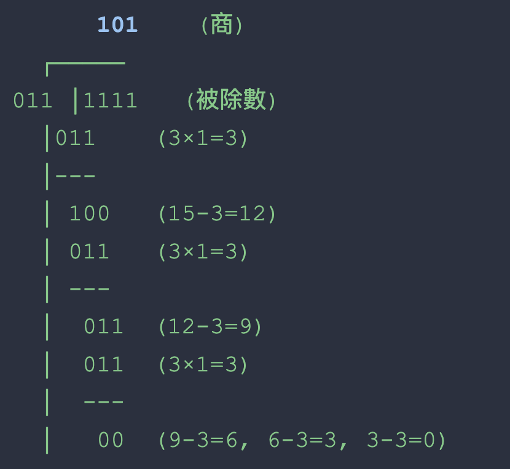

## 位運算

**位運算（Bitwise Operations）**是直接對二進位位元進行操作的運算方式

* CPU直接支援，執行速度極快
* 記憶體使用效率高
* 適合底層程式設計和系統優化

*^tab^*

> **& 位元 AND**
>
> **規則：**兩個位元都是 1 時結果才是 1
>
> |   A   |   B   | A & B |
> | :---: | :---: | :---: |
> |   0   |   0   |   0   |
> |   0   | ==1== |   0   |
> | ==1== |   0   |   0   |
> | ==1== | ==1== | ==1== |
>
> 判斷奇數或是偶數：
>
> ```python
> n = 18 # 10010
> 
> if n & 0b1: # &運算符號，如果n的二進位最後一位是1，則n是奇數
>     print(f"{n}是奇數")
> else:
>     print(f"{n}是偶數")
> ```

> **| 位元 OR**
>
> **規則：**任一位元是 1 時結果就是 1
>
> |   A   |   B   | A \| B |
> | :---: | :---: | :----: |
> |   0   |   0   |   0    |
> |   0   | ==1== | ==1==  |
> | ==1== |   0   | ==1==  |
> | ==1== | ==1== | ==1==  |

>**^ 位元 XOR**
>
>**規則：**兩個位元不同時結果是 1
>
>|   A   |   B   | A ^ B |
>| :---: | :---: | :---: |
>|   0   |   0   |   0   |
>|   0   | ==1== | ==1== |
>|   1   |   0   | ==1== |
>| ==1== | ==1== |   0   |
>
>加密解密：
>
>```python
># xor 加密解密(兩次運算會抵銷)
>password = 123456
>key = 34950234321234
>
>encrypted_password = password ^ key
>print(f"加密後的密碼: {encrypted_password}")
>
>decrypted_password = encrypted_password ^ key
>print(f"解密後的密碼: {decrypted_password}")
>
>"""
>加密後的密碼: 34950234297106
>解密後的密碼: 123456
>"""
>```

> **<< 左移運算**
>
>  **規則：**所有位元向左移動，右邊補0
>
> > [!important]
> >
> > 左移 n 位 = 乘以 2^n
>
> ```python 
> num = 5 << 2
> print(f"5左移2位: {num}")
> 
> """
> 5     ：00101
> 左移兩位：10100
> """
> ```

> **>> 右移運算**
>
> **規則：**所有位元向右移動，左邊補符號位
>
> > [!important]
> >
> > 右移 n 位 = 除以 2^n（向下取整
>
> ```python
> num = 10 >> 2
> print(f"10右移2位: {num}")
> 
> """
> 10     ：01010
> 右移兩位 ：00010  
> """
> ```

# 數據類型

數據類型是程式語言中用來分類不同種類數據的系統。Python 中的每個值都有一個特定的數據類型

可以透過Python的內置函數 `type()` 來檢查變數的數據類型

*==查看變數的數據類型==*

```python
print(type(42))        # <class 'int'>
print(type(3.14))      # <class 'float'>
print(type("Hello"))   # <class 'str'>
print(type(True))      # <class 'bool'>
```

## 基本數據類型

### 整數(int)

- 表示沒有小數點的數字
- Python 3 中整數大小沒有限制

*==整數範例==*

```python
age = 25
year = 2024
negative_num = -100

# 大整數
big_number = 123456789012345678901234567890
print(big_number)  # Python 可以處理任意大的整數

# 不同進制表示
binary = 0b1010      # 二進制 (10)
octal = 0o12         # 八進制 (10)
hexadecimal = 0xa    # 十六進制 (10)

print(f"二進制 {binary}, 八進制 {octal}, 十六進制 {hexadecimal}")
```


### 浮點數(float)

- 表示有小數點的數字

*==浮點數範例==*

```python
pi = 3.14159
temperature = -5.5
scientific = 1.23e4  # 科學記號 (12300.0)
```


### 複數

- 表示複數，包含實部和虛部
- 虛部用 `j` 或 `J` 表示

*==複數範例==*

```python
c1 = 3 + 4j
c2 = complex(2, 5)  # 2 + 5j

print(f"複數: {c1}")
print(f"實部: {c1.real}")    # 3.0
print(f"虛部: {c1.imag}")    # 4.0

# 複數運算
result = c1 + c2
print(f"複數相加: {result}")  # (5+9j)
```


### 字符串

==字符串是用來表示文本數據的數據類型==

*==字符串創建方式==*

```python
single_quote = 'Hello'
double_quote = "World"
triple_quote = """多行
字符串
內容"""
```

>[!caution]
>
>字符串是不可變的
>
>*==字符串錯誤示範==*
>
>```python
>text = "Python"
>text[0] = 'J'  # 這會報錯！
>```

字符串格式化的方式：

*^tab^*

>**f-string (推薦) ⭐**
>
>```python
>name = "Bob"
>age = 30
>height = 175.5
>
># f-string 格式化
>message = f"我是 {name}，今年 {age} 歲，身高 {height:.1f} 公分"
>print(message)
>```
>
>> [!caution]
>>
>> **Python3.6以後**才開放的新方法，如果不能使用要先檢查版本
>
>* 表達式計算
>
>    ```python
>    # 表達式計算
>    print(f"明年我 {age + 1} 歲")
>    ```
>
>* 格式化選項
>
>    ```python
>    number = 1234.5678
>    print(f"數字: {number:,.2f}")     # 數字: 1,234.57（千分位+兩位小數）
>    print(f"百分比: {0.85:.1%}")      # 百分比: 85.0%
>    print(f"科學記號: {number:.2e}")   # 科學記號: 1.23e+03
>    ```
>
>* 對齊和填充
>
>    ```python
>    text = "Python"
>    print(f"|{text:>10}|")   # |    Python|（右對齊，寬度10）
>    print(f"|{text:<10}|")   # |Python    |（左對齊）
>    print(f"|{text:^10}|")   # |  Python  |（置中）
>    print(f"|{text:*^10}|")  # |**Python**|（用*填充並置中）
>    ```

> **format() 方法**
>
> ```python
> template = "我是 {}，今年 {} 歲"
> message = template.format("Charlie", 28)
> ```
>
> > [!caution]
> >
> > **Python 2.7+ 和 3.x 通用**
>
> * 指定位子
>
>     ```python
>     template2 = "我是 {0}，今年 {1} 歲，{0} 很開心"
>     message2 = template2.format("David", 32)
>     ```
>
> * 關鍵字參數
>
>     ```python
>     template3 = "我是 {name}，今年 {age} 歲"
>     message3 = template3.format(name="Eve", age=26)
>     ```
>
> > [!note]
> >
> > 上面f-string提到的方法也可以透過format()實現

>**%格式化**
>
>```python
>name = "Frank"
>age = 35
>message = "我是 %s，今年 %d 歲" % (name, age)
>```
>
>> [!note]
>>
>> 這個方法比較舊，不建議使用

常用字符串的方法：

```python
text = "  Hello World  "

# 大小寫轉換
print(text.upper())      # "  HELLO WORLD  "
print(text.lower())      # "  hello world  "
print(text.title())      # "  Hello World  "
print(text.capitalize()) # "  hello world  "

# 去除空白
print(text.strip())      # "Hello World"
print(text.lstrip())     # "Hello World  "
print(text.rstrip())     # "  Hello World"

# 查找和替換
print(text.find("World"))     # 8 (找到的位置)
print(text.replace("World", "Python"))  # "  Hello Python  "

# 分割和連接
words = "apple,banana,cherry".split(",")  # ['apple', 'banana', 'cherry']
joined = "-".join(words)  # "apple-banana-cherry"

# 檢查字符串
print("hello".isalpha())    # True (都是字母)
print("123".isdigit())      # True (都是數字)
print("hello123".isalnum()) # True (字母和數字)
```


### 布林

==布林值只有兩個值：`True` 和 `False`==

*==布林值範例==*

```python
is_student = True
is_working = False

print(type(is_student))  # <class 'bool'>
```


## 容器數據類型

容器數據類型是可以存儲多個值的數據結構。Python 提供了四種主要的容器類型：

|   類型   |   特性   |     有序性      |  可變性  | 重複元素 |    語法     |
| :------: | :------: | :-------------: | :------: | :------: | :---------: |
| **列表** | 有序集合 |        ✅        |  ✅ 可變  |  ✅ 允許  | `[1, 2, 3]` |
| **元組** | 有序集合 |        ✅        | ❌ 不可變 |  ✅ 允許  | `(1, 2, 3)` |
| **字典** |  鍵值對  | ✅ (Python 3.7+) |  ✅ 可變  | ❌ 鍵唯一 | `{'a': 1}`  |
| **集合** | 唯一元素 |     ❌ 無序      |  ✅ 可變  | ❌ 不允許 | `{1, 2, 3}` |

### 列表

列表是 Python 中最常用的數據結構，可以存儲任意類型的有序元素集合

---

> **❌ 沒有列表的痛苦做法**
>
> 想像一下，如果我們要存儲一個班級學生的成績：
>
> ```python
> student1_score = 85
> student2_score = 92
> student3_score = 78
> student4_score = 88
> student5_score = 95
> # ... 如果有 50 個學生呢？
> 
> # 計算平均分？
> average = (student1_score + student2_score + student3_score + student4_score + student5_score) / 5
> ```
>
> - 變量名爆炸，難以管理
> - 代碼重複，難以維護
> - 無法用循環處理
>
> _~Rd!~_

> **✅ 使用列表的優雅做法**
>
> 可以創建一個列表的物件，將所有的學生成績都放入列表中
>
> ```python
> scores = [85, 92, 78, 88, 95]
> 
> # 輕鬆計算平均分
> average = sum(scores) / len(scores)
> 
> # 輕鬆處理所有成績
> for i, score in enumerate(scores):
>     print(f"學生 {i+1}: {score} 分")
> ```
>
> * 統一管理相關數據
> * 可以批量處理數據
>
> _~Gn!~_

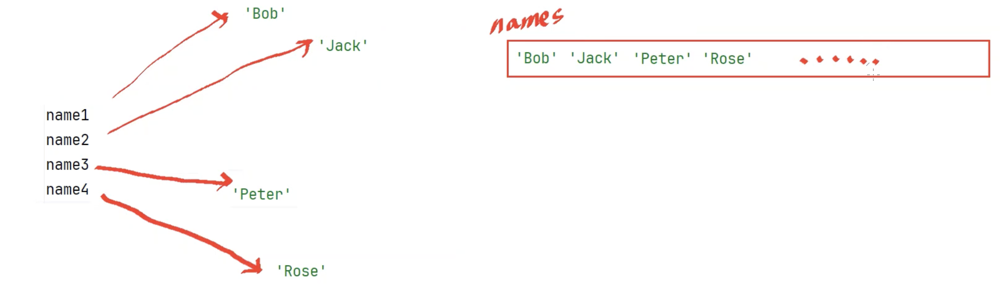

列表的創建方式：

*^tab^*

> **直接創建**
>
> 使用 `[]` 創建列表
>
> ```python
> empty = []
> numbers = [1, 2, 3, 4, 5]
> ```

> **list() 構造函數**
>
> 使用 `list()` 方法創建列表
>
> ```python
> from_string = list("hello")      # ['h', 'e', 'l', 'l', 'o']
> from_range = list(range(5))      # [0, 1, 2, 3, 4]
> from_tuple = list((1, 2, 3))     # [1, 2, 3]
> ```
>
> 

列表的特色：

1. 有序

    ```python
    # 列表保持元素的插入順序
    fruits = ["蘋果", "香蕉", "橘子"]
    print(fruits[0])  # "蘋果"
    print(fruits[1])  # "香蕉"
    ```

    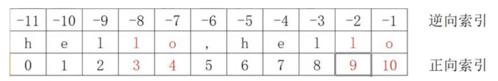

2. 可變

    ```python
    # 可以修改列表內容
    numbers = [1, 2, 3]
    print(f"原始: {numbers}")
    
    numbers[1] = 10        # 修改元素
    print(f"修改後: {numbers}")
    
    numbers.append(4)      # 添加元素
    print(f"添加後: {numbers}")
    
    numbers.remove(1)      # 刪除元素
    print(f"刪除後: {numbers}")
    ```

列表的增刪改查方法：

---

> **增**
>
> ```python
> fruits = ["蘋果", "香蕉"]
> 
> # 1. append() - 末尾添加單個元素
> fruits.append("橘子")
> print(fruits)  # ['蘋果', '香蕉', '橘子']
> 
> # 2. extend() - 末尾添加多個元素
> list1 = [1, 2, 3]
> list2 = [4, 5, 6]
> list1.extend(list2)
> print(list1)  # [1, 2, 3, 4, 5, 6]
> 
> # 3. insert() - 指定位置插入
> colors = ["紅色", "綠色", "藍色"]
> colors.insert(1, "黃色")  # 在索引1處插入
> print(colors)  # ['紅色', '黃色', '綠色', '藍色']
> ```
>
> > [!note]
> >
> > 使用 `insert()` 插入的時候，會將指定位子的元素向後推，插入該位子

> **刪**
>
> ```python
> tasks = ["任務A", "任務B", "任務C", "任務B", "任務D"]
> 
> # 1. remove() - 刪除第一個匹配的值
> tasks_copy1 = tasks.copy()
> tasks_copy1.remove("任務B")  # 只刪除第一個 "任務B"
> print(f"remove結果: {tasks_copy1}")
> 
> # 2. pop() - 刪除指定位置並返回值
> tasks_copy2 = tasks.copy()
> removed_task = tasks_copy2.pop(1)  # 刪除索引1的元素
> print(f"pop結果: {tasks_copy2}, 刪除了: {removed_task}")
> 
> # 3. del - 刪除切片或單個元素
> tasks_copy3 = tasks.copy()
> del tasks_copy3[1:3]  # 刪除索引1到2的元素
> print(f"del結果: {tasks_copy3}")
> ```

---

> **改**
>
> ```python
> fruits = ["蘋果", "香蕉", "橘子"]
> fruits[1] = "草莓"  # 修改索引1的元素
> print(fruits)  # ['蘋果', '草莓', '橘子']
> 
> # 替換部分元素
> letters = ["a", "b", "c", "d", "e"]
> letters[1:3] = ["B", "C"]  # 替換索引1和2
> print(letters)  # ['a', 'B', 'C', 'd', 'e']
> ```
>
> 

> **查**
>
> 基本切片語法：[start​ : end : ​step]
>
> ```python
>   print(f"前5個: {numbers[:5]}")        # [0, 1, 2, 3, 4]
> print(f"後5個: {numbers[-5:]}")       # [5, 6, 7, 8, 9]
> print(f"中間部分: {numbers[3:7]}")    # [3, 4, 5, 6]
> 
> # 步長應用
> print(f"偶數索引: {numbers[::2]}")     # [0, 2, 4, 6, 8]
> print(f"奇數索引: {numbers[1::2]}")    # [1, 3, 5, 7, 9]
> print(f"反轉: {numbers[::-1]}")       # [9, 8, 7, 6, 5, 4, 3, 2, 1, 0]
> ```
>
> 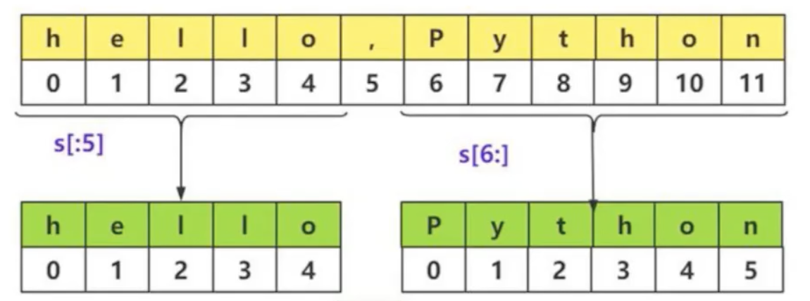

### 元組

### 字典

### 集合

# ~~編碼與解碼~~


## ASCII碼

## UTF-8編碼規則

# 邏輯運算與分支結構

## 比較運算符

在Python中，**比較運算符號**（Comparison Operators）用於比較兩個值，並返回布林值（`True` 或 `False`）。以下是Python中所有的比較運算符號：

| 運算符 |   名稱   |              說明              |       範例        |
| :----: | :------: | :----------------------------: | :---------------: |
|  `==`  |   等於   |       檢查兩個值是否相等       | `5 == 5` → `True` |
|  `!=`  |  不等於  |      檢查兩個值是否不相等      | `5 != 3` → `True` |
|  `<`   |   小於   |    檢查左邊值是否小於右邊值    | `3 < 5` → `True`  |
|  `>`   |   大於   |    檢查左邊值是否大於右邊值    | `5 > 3` → `True`  |
|  `<=`  | 小於等於 | 檢查左邊值是否小於或等於右邊值 | `3 <= 5` → `True` |
|  `>=`  | 大於等於 | 檢查左邊值是否大於或等於右邊值 | `5 >= 5` → `True` |

> [!note]
>
> * 一個等號 `=` ：賦值運算
> * 兩個等號 `==` ：比較運算

```python
a = 10
b = 20

print(a == b)   # False
print(a != b)   # True
print(a < b)    # True
print(a > b)    # False
print(a <= b)   # True
print(a >= b)   # False
```


## 邏輯運算符

在Python中，**邏輯運算符**（Logical Operators）用於組合或修改布林表達式，返回布林值（`True` 或 `False`）。Python有三個主要的邏輯運算符：

| 運算符 |  名稱  |              說明               |           範例           |
| :----: | :----: | :-----------------------------: | :----------------------: |
| `and`  | 邏輯且 |  當兩個條件都為真時返回 `True`  | `True and True` → `True` |
|  `or`  | 邏輯或 | 當至少一個條件為真時返回 `True` | `True or False` → `True` |
| `not`  | 邏輯非 |           反轉布林值            |   `not True` → `False`   |

*==and運算符==*

```python
print(True and True)    # True
print(True and False)   # False
print(False and True)   # False
print(False and False)  # False
```

*==or運算符==*

```python
print(True or True)     # True
print(True or False)    # True
print(False or True)    # True
print(False or False)   # False
```

*==not運算符==*

```python
print(not True)         # False
print(not False)        # True
```

## 程式邏輯圖

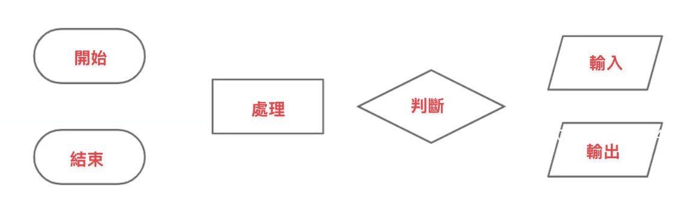

* 開始、結束框：
    * **形狀**：橢圓形或圓角矩形
    * **用途**：表示程序的開始或結束點
* 處理框：
    * **形狀**：矩形
    * **用途**：表示執行某個動作或運算
* 判斷框：
    * **形狀**：菱形
    * **用途**：表示條件判斷或決策點
    * **分支**：通常有兩個出口（是/否 或 真/假）
* 輸入輸出框：
    * **形狀**：平行四邊形
    * **用途**：表示從外部獲取數據或是向外輸出結果

## if語句

---

> **流程圖**
>
> 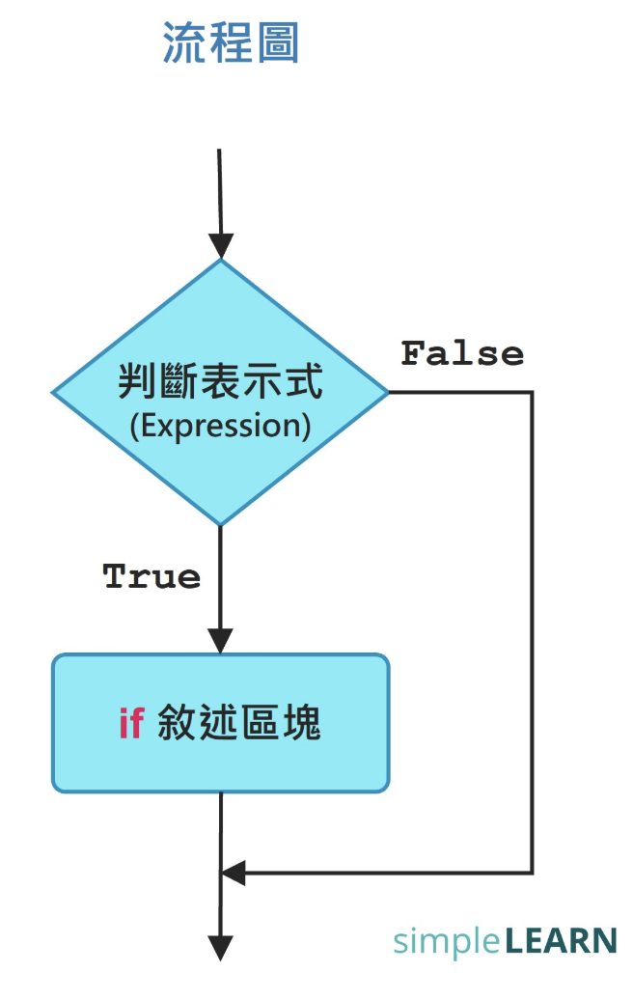

>**程式碼**
>
>```python
>if 條件:
>    步驟A
>步驟B
>```
>
>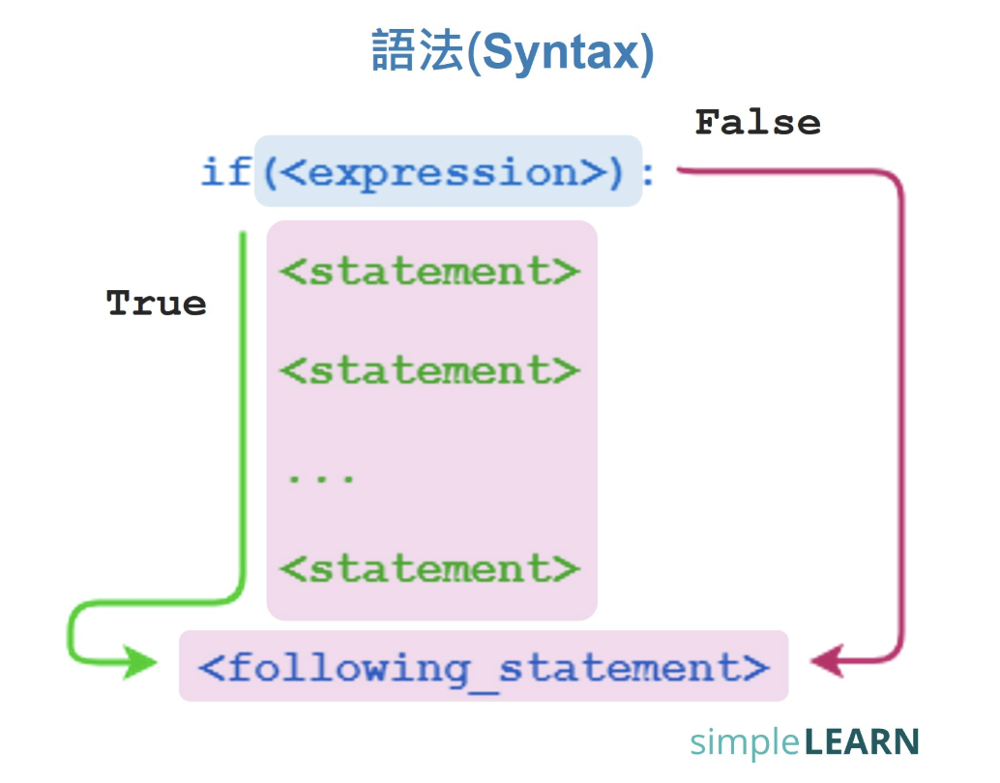

```python
x = int(input("請輸入數字: "))

if x > 0:
    print("x 是正數")
    
print("程式執行結束")
```

>[!note]
>
>三位運算符(if簡化語法)：
>
>```python
># 傳統寫法
>if condition:
>    result = value1
>else:
>    result = value2
>
># 簡化寫法
>result = value1 if condition else value2
>```
>
>

## if…else語句

---

> **流程圖**
>
> 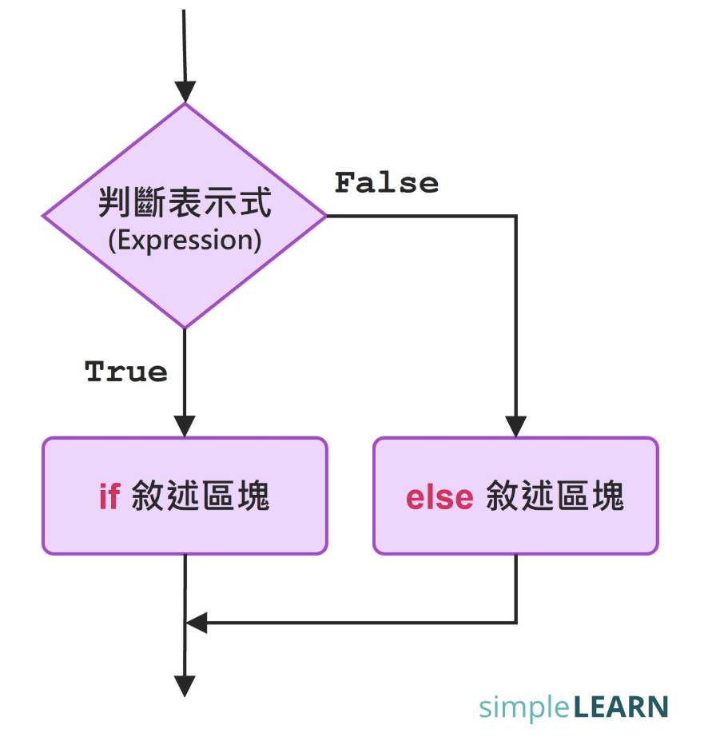

>**程式碼**
>
>```python
>if 條件:
>    步驟A
>else:    
>    步驟B
>步驟C
>```
>
>
>
>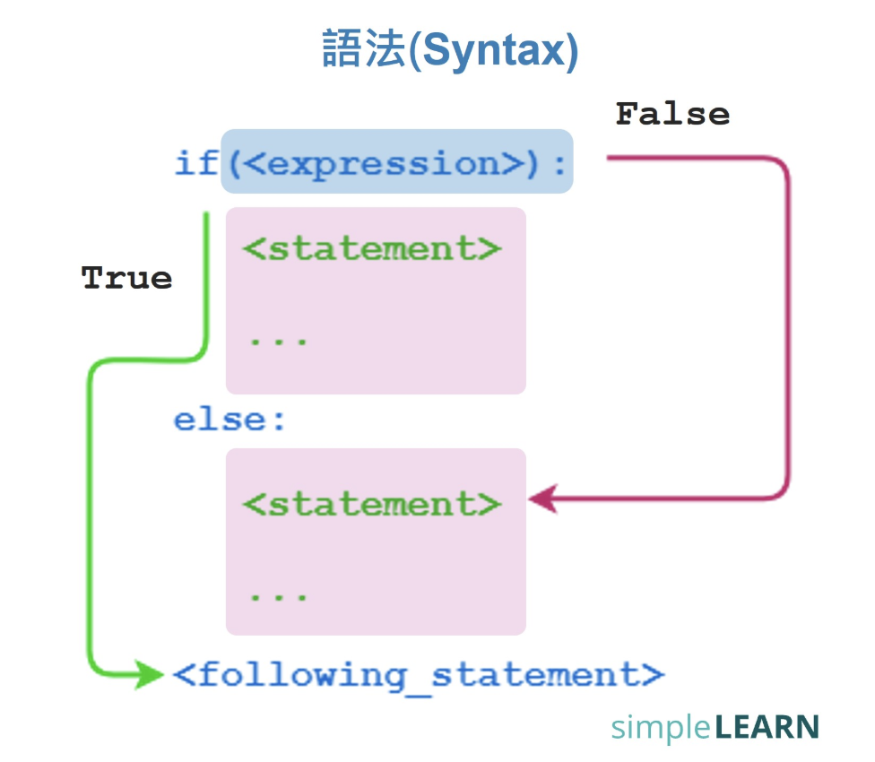

```python
x = int(input("請輸入數字: "))
if x > 0:
    print("x 是正數")
else:
    print("x 不是正數")
```

## 多分支結構

---

>  **流程圖**
>
> 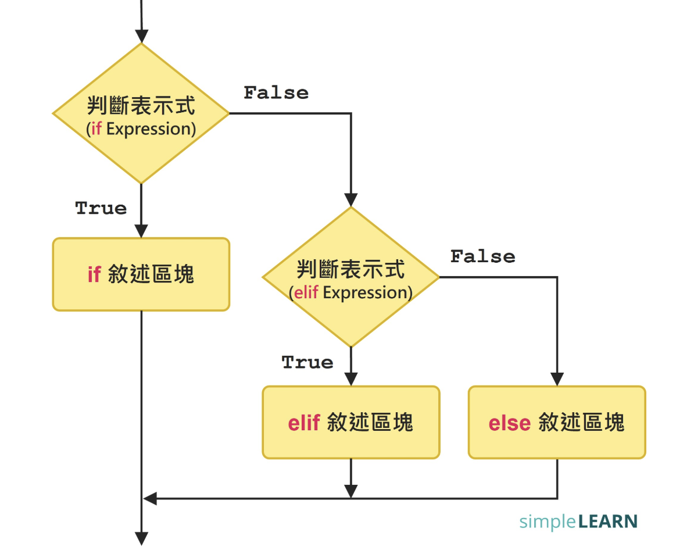

> **程式碼**
>
> ```python
> if 條件:
>     步驟A
> elif:    
>     步驟B
> else:
>     步驟C
> 步驟D
> ```
>
> 
>
> 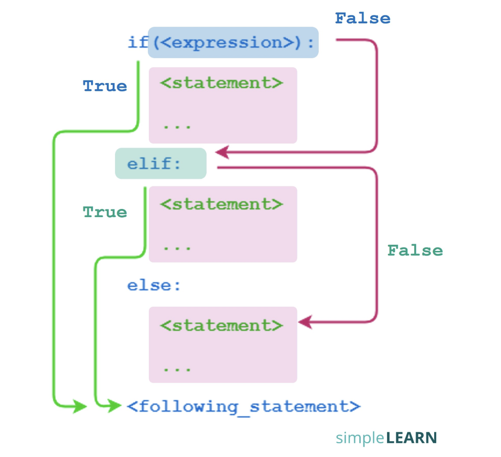

```python
score = int(input("請輸入成績: "))
if score >= 90:
    grade = "A"
    print("優秀")
elif score >= 80:
    grade = "B"
    print("良好")
elif score >= 70:
    grade = "C"
    print("中等")
elif score >= 60:
    grade = "D"
    print("及格")
else:
    grade = "F"
    print("不及格")
```

# 循環

# 函數

==函數是一段可重複使用的程式碼，用來執行特定的任務==

## 什麼是函數

- 函數是一段可重複使用的程式碼區塊
- 用來執行特定任務
- 可以接收輸入（參數）並返回輸出（回傳值）

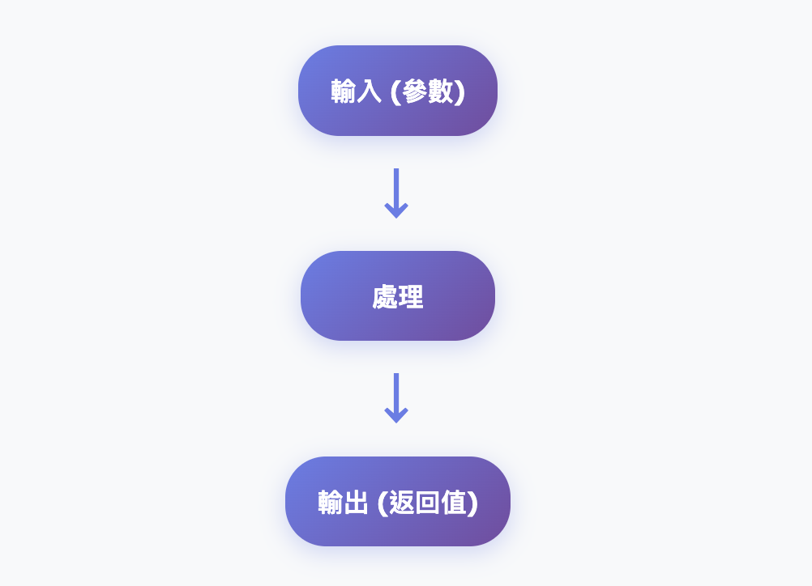

*==函數基本語法==*

```python
def 函數名稱(參數) -> 回傳類型:
    """文檔字串（可選）"""
    函數體
    return 回傳值（可選）
```

> [!important]
>
> 函數的優點
>
> - **程式碼重用**：避免重複寫相同的程式碼
> - **模組化**：將複雜問題分解成小問題
> - **易於維護**：修改功能只需要改一個地方

*==簡單函數範例==*

```python
def greet(name:str) ->str:
    """問候函數"""
    return f"Hello, {name}!"

# 呼叫函數
message = greet("Alice")
print(message)  # 輸出: Hello, Alice!
```

> [!note]
>
> 函數的返回值 `def greet(name) ->str:` 裡面的 `->str` 可寫可不寫，是 Python 的**類型註解**（Type Hints），用來標示函數的返回值類型
>
> - **語法上**：`->str` 完全可選，不寫不會報錯
> - **實際上**：建議寫，特別是在大型專案或團隊開發中
>
> |  類型註解  |    說明    |             範例             |
> | :--------: | :--------: | :--------------------------: |
> |  `-> int`  |  返回整數  |   `def add(a, b) -> int:`    |
> |  `-> str`  |  返回字串  |  `def greet(name) -> str:`   |
> | `-> float` | 返回浮點數 | `def divide(a, b) -> float:` |
> | `-> bool`  | 返回布林值 |  `def is_even(n) -> bool:`   |
> | `-> None`  |  無返回值  |  `def print_msg() -> None:`  |

## 函數的類型

*^tab^*

> **無返回值函數**
>
> 執行動作，不返回值
>
> *==無返回值函數範例==*
>
> ```python
> def greet(name:str) -> None: 
>   	print(f"Hello, {name}!") 
> 
> greet("Alice")
> ```
>
> > [!note]
> >
> > 當沒有 `return` 值的時候，回傳的是 `None` ，無返回值函數注重的是函數執行的過程

> **有返回值函數**
>
> 執行計算後返回結果
>
> *==有返回值函數範例==*
>
> ```python
> def square(x:int) -> int: 
>   	return x * x 
>   
> result = square(5) # result = 25
> ```

## 函數的參數設計

---

> **形式參數(Parameter)/形參**
>
> **定義函數時**，括號內的變數名稱，就像是**佔位符**，等待接收實際的值

> **實際參數 (Argument)/實參**
>
> **呼叫函數時**，實際傳入的值，是**真正的資料**，會賦值給形式參數

|           函數定義           |      ==形式參數==       |         函數呼叫          |       ==實際參數==        |
| :--------------------------: | :---------------------: | :-----------------------: | :-----------------------: |
|       `def add(a, b):`       |      ==**a, b**==       |        `add(3, 5)`        |       ==**3, 5**==        |
|   `def power(base, exp):`    |    ==**base, exp**==    |       `power(2, 3)`       |       ==**2, 3**==        |
| `def info(name, age, city):` | ==**name, age, city**== | `info("Bob", 30, "台北")` | ==**"Bob", 30, "台北"**== |

```python
def make_coffee(coffee_type, size, sugar_level):  # 這些是形式參數
    return f"製作 {size} 杯 {coffee_type}，甜度 {sugar_level}"

# 當你使用咖啡機時：
my_coffee = make_coffee("拿鐵", "大杯", "半糖")  # 這些是實際參數
```

- **形式參數**就像咖啡機上的**按鈕標籤**：`coffee_type`、`size`、`sugar_level`
- **實際參數**就像你**實際選擇的選項**：`"拿鐵"`、`"大杯"`、`"半糖"`

**函數參數的設計**

*^tab^*

> **關鍵字參數**

> **位置參數**

> **可變長度參數**

# 物件導向概念
