[TOC]

# 什麼是爬蟲 

**網路爬蟲（Web Crawler/Spider）** 是一種自動化程式，模擬人類瀏覽網頁的行為，系統性地訪問網站並提取所需資料

原則上，**只要是瀏覽器(客戶端)能做的事情，爬蟲都能夠做**

* **通用爬蟲**：設計用來爬取整個網際網路或大範圍網站的爬蟲，不針對特定網站或特定資料結構，像是搜尋引擎
* **自訂爬蟲**：針對特定網站、特定資料或特定需求而客製化開發的爬蟲

> **開發語言**
>
> 只要能夠傳送HTTP(S)請求的任何程式語言都是可以完成爬蟲程序的，例如：C++、java、php、JavaScript等等，但是論爬蟲開發效率一般都指的是python語言

> **爬蟲程式碼執行流程**
>
> ---
>
> > ```mermaid
> > flowchart TD
> >     A[url list]
> >     B[響應內容]
> >     C[提取數據]
> >     D[提取url]
> >     E[入庫]
> >     
> >     A --> B
> >     B --> C
> >     B --> D
> >     D --> A
> >     C --> E
> >     
> >     style A fill:#e1f5fe,stroke:#01579b,stroke-width:2px
> >     style B fill:#f3e5f5,stroke:#4a148c,stroke-width:2px
> >     style C fill:#e8f5e8,stroke:#1b5e20,stroke-width:2px
> >     style D fill:#fff3e0,stroke:#e65100,stroke-width:2px
> >     style E fill:#ffebee,stroke:#b71c1c,stroke-width:2px
> > ```
>
> > **流程說明**
> >
> > 1. 向起始地址傳送請求，並獲取響應，請求地址可能有多個，可以使用列表的資料格式
> > 2. 對響應結果進行資料提取
> > 3. 如果獲取的資料是新的網站地址則繼續傳送請求並獲取響應
> > 4. 如果獲取的資料為頁面需要的資料則完成資料保存

## HTTP與HTTPS協議

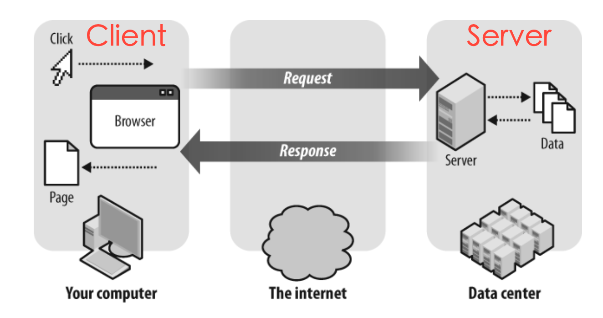

---

> **HTTP**
>
> HTTP 是一種用於在網路上傳輸超文本的應用層協定，是網際網路通訊的基礎協定
>
> - 🔓 **明文傳輸**：資料以明文形式傳送
> - 📱 **無狀態協定**：每個請求都是獨立的
> - 🚪 **預設埠號**：80
> - ⚡ **簡單快速**：協定結構簡單

> **HTTPS**
>
> HTTPS 是 HTTP 的安全版本，透過 SSL/TLS 加密協定保護資料傳輸的安全性
>
> - 🔐 **加密傳輸**：所有資料都經過加密
> - 🛡️ **身份驗證**：確認伺服器身份
> - ✅ **資料完整性**：防止資料被篡改
> - 🚪 **預設埠號**：443

我們想要給瀏覽器傳送資訊並顯示，就必須要帶上HTTP協議。HTTP協議中有一部分資料對爬蟲程序來說非常重要。分別是要求標頭與響應頭

* 請求頭：

    | 參數                 | 作用               | 範例                                            |
    | -------------------- | ------------------ | ----------------------------------------------- |
    | ==**User-Agent**==   | ==識別瀏覽器類型== | ==`Mozilla/5.0 (Windows NT 10.0; Win64; x64)`== |
    | ==**Referer**==      | ==來源頁面==       | ==`https://www.google.com/search?q=python`==    |
    | ==**Cookie**==       | ==會話狀態==       | ==`sessionid=abc123; login=true`==              |
    | **Accept**           | 接受的內容類型     | `text/html,application/json`                    |
    | **Accept-Language**  | 語言偏好           | `zh-TW,zh;q=0.9,en;q=0.8`                       |
    | **Accept-Encoding**  | 壓縮格式           | `gzip, deflate, br`                             |
    | **Authorization**    | 認證資訊           | `Bearer token123`                               |
    | **X-Requested-With** | AJAX 識別          | `XMLHttpRequest`                                |

* 響應頭：

    | 參數               | 作用            | 範例                               |
    | ------------------ | --------------- | ---------------------------------- |
    | ==**Set-Cookie**== | ==設定 Cookie== | ==`sessionid=abc123; HttpOnly`==   |
    | **Location**       | 重定向位置      | `https://www.example.com/new-page` |
    | **Content-Type**   | 內容類型        | `text/html; charset=UTF-8`         |
    | **X-RateLimit-***  | 速率限制        | `X-RateLimit-Remaining: 99`        |
    | **Cache-Control**  | 快取控制        | `max-age=3600, no-cache`           |
    | **Server**         | 伺服器資訊      | `nginx/1.18.0`                     |

> [!note]
>
> **響應狀態碼**是伺服器對客戶端請求的回應，用三位數字表示請求的處理結果。每個狀態碼都有特定的含義
>
> | 狀態碼 | 名稱                  | 含義           | 爬蟲處理建議         |
> | ------ | --------------------- | -------------- | -------------------- |
> | 200    | OK                    | 請求成功       | 正常處理資料         |
> | 301    | Moved Permanently     | 永久重定向     | 更新 URL，跟隨重定向 |
> | 302    | Found                 | 臨時重定向     | 跟隨重定向           |
> | 400    | Bad Request           | 請求格式錯誤   | 檢查請求參數         |
> | 403    | Forbidden             | 權限不足       | 檢查權限或更換帳號   |
> | 404    | Not Found             | 資源不存在     | 確認 URL 正確性      |
> | 500    | Internal Server Error | 伺服器內部錯誤 | 稍後重試             |
> | 503    | Service Unavailable   | 服務不可用     | 等待服務恢復         |

## Robots協議

**Robots 協議**（robots.txt）是網站用來告訴搜尋引擎爬 蟲哪些頁面可以抓取、哪些不能抓取的標準協議。它是一個純文字檔案

通常放在網站根目錄下：

* https://tixcraft.com/**robots.txt**
* https://www.facebook.com/**robots.txt**

*[<kbd> 拓元售票tixcraft  </kbd>](https://tixcraft.com/robots.txt)* *[<kbd> Facebook  </kbd>](https://www.facebook.com/robots.txt)*

> [!note]
>
> 在後期的Scrapy框架學習中，需要手動關閉Robots協議，因為**Scrapy 預設會遵循 Robots 協議**

# requests套件

**Requests** 是 Python 中最受歡迎的 HTTP 庫，讓發送 HTTP 請求變得簡單優雅。它被稱為「為人類設計的 HTTP 庫」

```bash
# 在終端機使用 pip 安裝
pip install requests
```


> *[<kbd> requests 官網  </kbd>](https://requests.readthedocs.io/en/latest/)*

## 發送網路請求及常用屬性


網路請求大致上分為兩大類：

* 請求：這些屬性是你**發送給伺服器**的資訊，在發送請求時設定

    ```python
    # 導入requests
    import requests
    
    # 設定url
    url = "https://google.com"
    
    # 發出請求，會回傳一個對象，所以使用一個變量接收
    response = requests.get(url)
    ```

* 響應：這些屬性是**伺服器回傳**的資訊，在收到響應後可以存取

    ```python
    print("---回應---")
    print(response)
    
    print("---回應網址---")
    print(response.url)
    print("---請求網址---")
    print(response.request.url)
    
    print("---響應頭---")
    print(response.headers)
    print("---請求頭---")
    print(response.request.headers)
    
    print("---文字內容---")
    print(response.text)
    print("---二進位內容---")
    print(response.content)
    
    print("---響應cookie---")
    print(response.cookies)
    print("---請求cookie---")
    print(response.request.header.get("cookie"))
    
    print("---狀態碼---")
    print(response.status_code)
    
    print("---使用utf8解碼內容---")
    print(response.content.decode("utf-8"))
    ```

> [!note]
>
> `response.text` 和 `response.content` 差別
>
> * response.text：
>     * **類型**：`str` (字串)
>     * **內容**：已解碼的文字
>     * **用途**：處理文字資料（HTML、JSON、XML 等）
>     * **編碼**：自動根據響應標頭解碼
> * response.content：
>     * **類型**：`bytes` (位元組)
>     * **內容**：原始二進制資料
>     * **用途**：處理任何類型資料（圖片、檔案、文字等）
>     * **編碼**：未經處理的原始資料
>
> > Encode = 編碼(轉成機器看得懂的文字) = 文字變成碼 = str → bytes 
> >
> > Decode = 解碼(轉成人看得懂的文字) = 碼變成文字 = bytes → str
> > 
> >
> > 📖 讀取檔案時：需要 decode (碼→文字)
> >
> >  💾 儲存檔案時：需要 encode (文字→碼)

> ###### 練習-下載網路圖片
>
> **需求**：將網頁圖片下載到電腦
>
> 1. 找到圖片的url地址
> 2. 利用requests模組傳送請求並獲取響應
> 3. 使用二進制寫入的方式打開檔案並將response響應內容寫入檔案內
>
> ```python
> import requests
> 
> url = "https://static.tixcraft.com/images/banner/mobile_d3122815aefc512242b911008b8f157c.png"
> 
> response = requests.get(url)
> 
> with open("download.png", "wb") as f:
>     f.write(response.content)
> ```
>
> |  模式   |   全名    | 中文說明 |            用途            |
> | :-----: | :-------: | :------: | :------------------------: |
> | **`r`** |   Read    |   讀取   |        讀取文字檔案        |
> | **`w`** |   Write   |   寫入   |    寫入文字檔案（覆蓋）    |
> | **`a`** |  Append   |   附加   |     在檔案末尾添加內容     |
> | **`x`** | Exclusive |   獨占   | 創建新檔案（檔案不存在時） |

## iter_content()方法

==把大檔案切成小塊，一塊一塊地處理==

requests 庫中的一個方法，用於**分塊讀取響應內容**，而不是一次性載入全部資料到記憶體中

|         參數         | 類型 | 預設值 |        說明        |
| :------------------: | :--: | :----: | :----------------: |
|   **`chunk_size`**   | int  |   1    | 每次讀取的位元組數 |
| **`decode_unicode`** | bool | False  |  是否解碼 Unicode  |

1. 在獲取資料時，設定屬性`stream=True`，告訴 requests **不要立即下載完整的響應內容**，而是建立一個**串流連接**，讓你可以**按需讀取**資料

    ```python
    r = requests.get(url, stream=True)
    ```

    > [!note]
    >
    > `stream=True` 會讓響應變成**類似生成器的行為**，但更準確地說是變成一個**可迭代的串流物件**

2. 使用iter_content()方法

    ```python
    with open('test.html', 'wb') as f:
        for chunk in r.iter_content(chunk_size=100):
            f.write(chunk)
    ```

> [!note]
>
> 若是想要知道資源下載的進度可以導入 `tqdm` 套件 `pip install tqdm`
>
> | 參數             | 類型     | 預設值 | 說明         |
> | ---------------- | -------- | ------ | ------------ |
> | **`total`**      | int      | None   | 總項目數量   |
> | **`unit`**       | str      | 'it'   | 單位名稱     |
> | **`unit_scale`** | bool/int | False  | 自動縮放單位 |

```python
import requests
from tqdm import tqdm


url = "https://static.tixcraft.com/images/banner/mobile_d3122815aefc512242b911008b8f157c.png"

response = requests.get(url, stream=True)

# 獲得檔案大小
total_size = int(response.headers.get("Content-Length", 0))

# 下載檔案
with open("download.png", "wb") as f, tqdm(total=total_size, unit="B", unit_scale=True, unit_divisor=1024) as bar:
    for chunk in response.iter_content(chunk_size=1024):
        if chunk: # 要判斷chunk是否為空
            f.write(chunk)
            bar.update(len(chunk))  
```

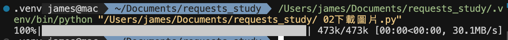

## 攜帶請求頭

**請求頭 (Request Headers)** 是 HTTP 請求中的**元資料**，在請求某些網址時根據不同的瀏覽器會返回不同的響應內容

### 查看瀏覽器的請求頭

*^tab^*

> **打開開發人員工具**
>
> 建議使用**google chrome**瀏覽器
>
> * **Windows**：鍵盤按F12或是Cmd + Shift + I
> * **Mac**：Cmd + Option + I
>
> 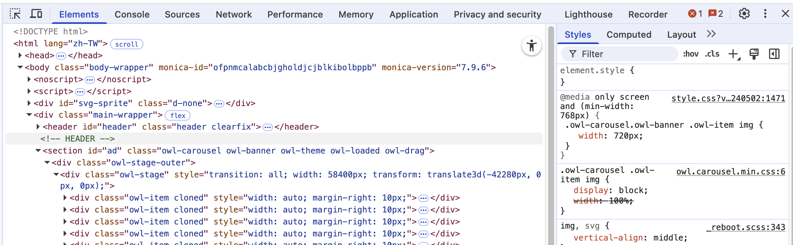

> **查看請求頭資訊**
>
> 1. 選擇Network(網路)
>
>     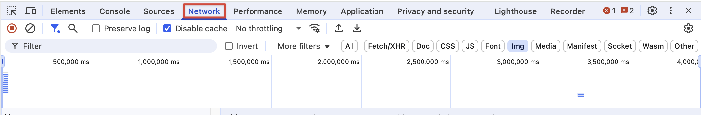
>
> 2. 任意點擊一個請求資訊，就可以看到當前的請求頭資訊
>
>     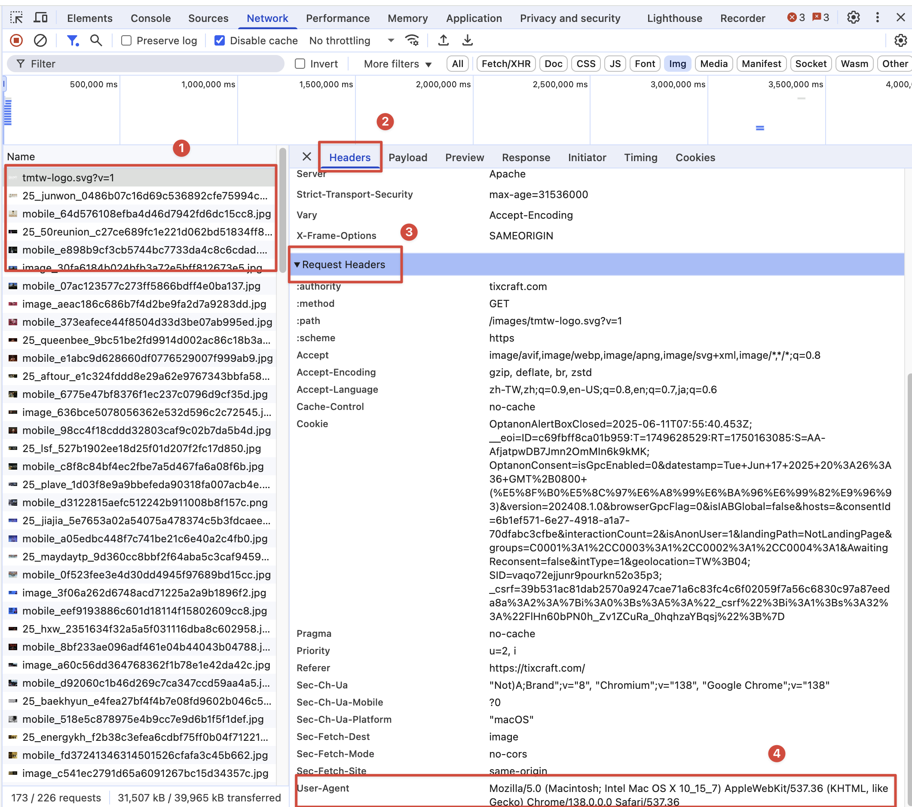

### 自定義User-Agent

==為了讓伺服器認為你是真實的瀏覽器用戶，而不是爬蟲機器人，避免被封鎖或拒絕訪問==

 有些網站請求的時候會驗證請求頭，如果請求頭不符合預期或缺少關鍵資訊，伺服器會拒絕請求並返回 403 Forbidden、401 Unauthorized 或其他錯誤狀態碼，這是網站防止爬蟲和惡意請求的重要安全機制

```python
import requests

url = "https://google.com"

headers = {
    "User-Agent": "Mozilla/5.0 (Windows NT 10.0; Win64; x64) AppleWebKit/537.36 (KHTML, like Gecko) Chrome/120.0.0.0 Safari/537.36"
}

# 一定要指定參數headers 不可以只些headers
response = requests.get(url, headers=headers)

# 請求頭資訊
print(response.request.headers)

# 響應內容
print(response.text)
```

> [!caution]
>
> 一定要寫 `headers=headers`，因為他是關鍵字參數

## 攜帶參數請求

發送 HTTP 請求時，除了基本的 URL 之外，還需要傳遞額外的數據參數給伺服器，這些參數可以通過不同的方式攜帶，如 URL 查詢參數

在使用google查詢的時候會看到url地址中會有一個?，問號後邊的就是請求參數，又叫做**查詢字符串**

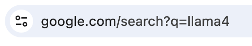

```python
import requests

url = "https://google.com/search"

headers = {
    "User-Agent": "Mozilla/5.0 (Windows NT 10.0; Win64; x64) AppleWebKit/537.36 (KHTML, like Gecko) Chrome/120.0.0.0 Safari/537.36"
}

# 1. 設定需要攜帶的查詢字串參數
params = {
    "q": "llama4"
}

# 2. 傳送請求
response = requests.get(url, headers=headers, params=params)

print(response.url)

"""
https://www.google.com/search?q=llama4
"""
```

>[!note]
>
>使用requests庫攜帶參數請求不需再加上?，他會自己處理url

## 傳送post請求

現在很多網站大量使用 POST 請求來獲取資訊，在獲得資訊前會先驗證請求頭是否正確攜帶相對應的資料，這是一種重要的安全防禦策略，主要目的是防止爬蟲、CSRF 攻擊

|       特徵       |      GET 請求      |       POST 請求       |
| :--------------: | :----------------: | :-------------------: |
|   **主要用途**   | 獲取資源、查詢數據 |  提交數據、修改資源   |
| **數據傳送位置** |   URL 查詢字符串   | 請求體 (Request Body) |
|    **可見性**    | 參數在 URL 中可見  |  參數隱藏在請求體中   |
|    **安全性**    |  較低（參數暴露）  |   較高（參數隱藏）    |

> [!caution]
>
> 如果使用post請求沒有正確攜帶參數，伺服器就不會響應資料

練習網址：*[<kbd> 股票資訊網站  </kbd>](http://www.cninfo.com.cn/new/commonUrl?url=disclosure/list/notice#szse)*

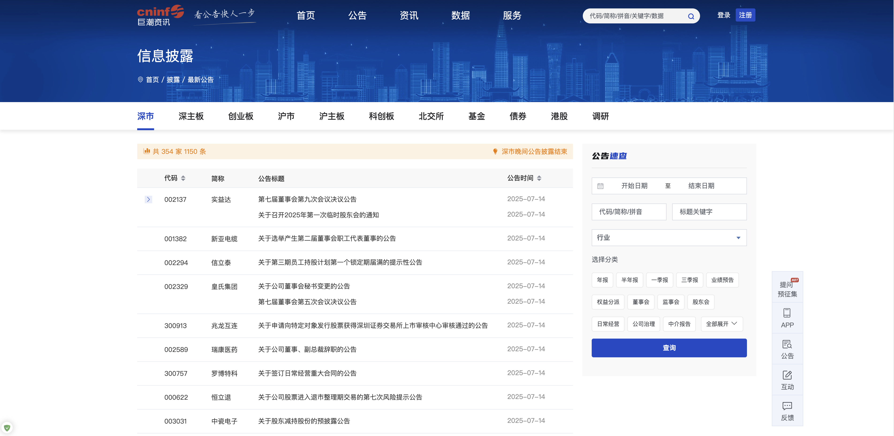

獲取表格中的所有資料分析過程：

1. 先判斷網站是靜態網站還是動態網站，並通過瀏覽器開發者工具獲取當前網站資料API

    | 特徵         | 靜態網站             | 動態網站                   |
    | ------------ | -------------------- | -------------------------- |
    | **內容更新** | 需要手動修改檔案     | 自動更新（如新聞、商品）   |
    | **用戶互動** | 有限（僅基本表單）   | 豐富（登入、評論、購物車） |
    | **個人化**   | 所有用戶看到相同內容 | 根據用戶顯示不同內容       |
    | **資料庫**   | 通常不需要           | 需要資料庫支援             |

    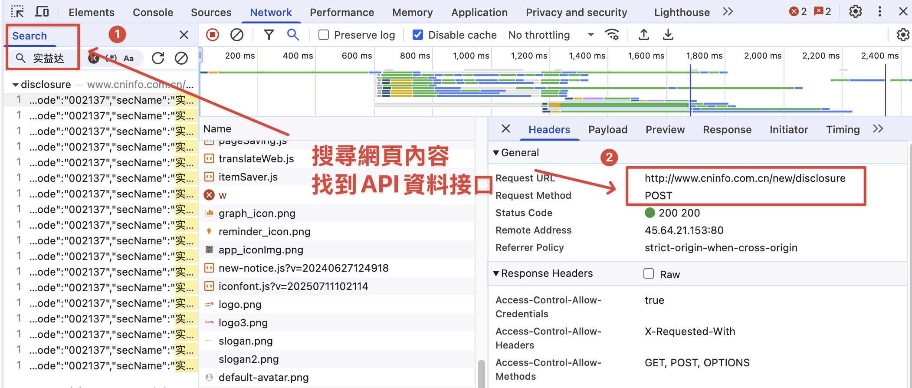

2. 查詢payload選項中的表單資料

    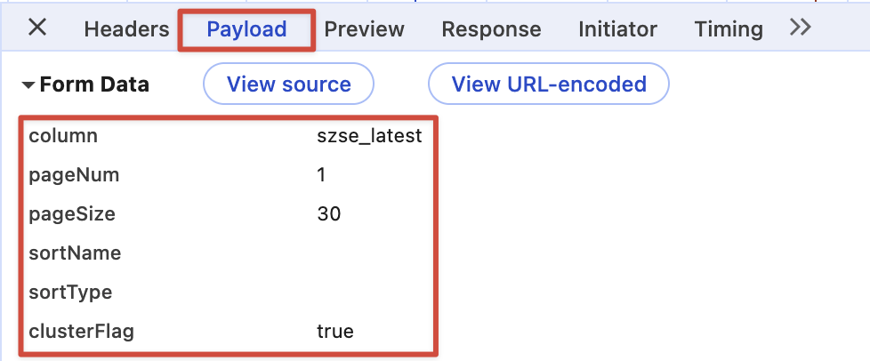

3. 建構表單資料，並傳送post請求取的資料

    ```python
    import requests
    
    url = 'http://www.cninfo.com.cn/new/disclosure'
    headers = {
        'User-Agent': 'Mozilla/5.0 (Windows NT 10.0; Win64; x64) AppleWebKit/537.36 (KHTML, like Gecko) Chrome/104.0.0.0 Safari/537.36'
    }
    data = {
        'column':'szse_latest',
        'pageNum':'2',
        'pageSize':'30',
        'sortName':'',
        'sortType':'',
        'clusterFlag':'true',
    }
    
    response = requests.post(url, headers=headers, data=data)
    print(response.json())
    ```

> [!note]
>
> API返回的資料基本上都是 資料(JSON、XML)

## cookie處理

為了能夠通過爬蟲獲取到登錄後的頁面，或者是解決通過cookie的反爬，需要使用request來處理cookie相關的請求

有兩種方式添加cookie：

*^tab^*

> **1. 放在headers中**
>
> 1. 打開開發人員工具找到google，點選網路Netowrk
>
>     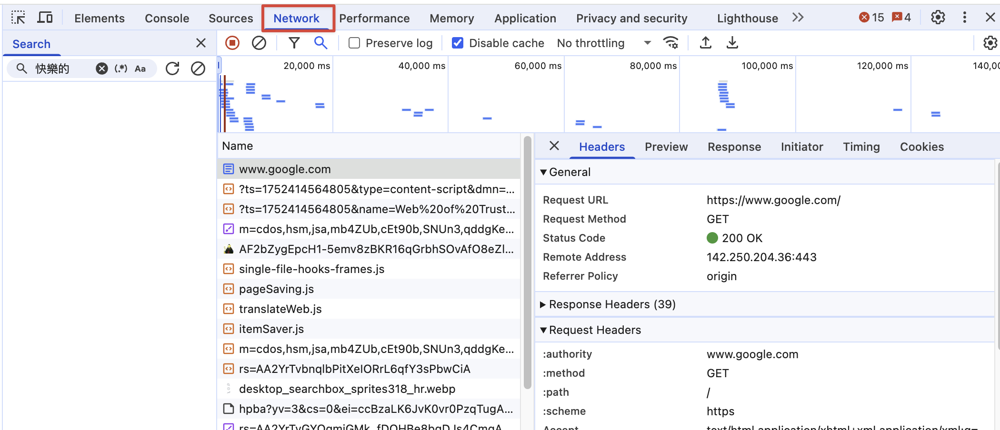
>
> 2. 找到網頁的請求頭，就可以看到cookie值
>
>     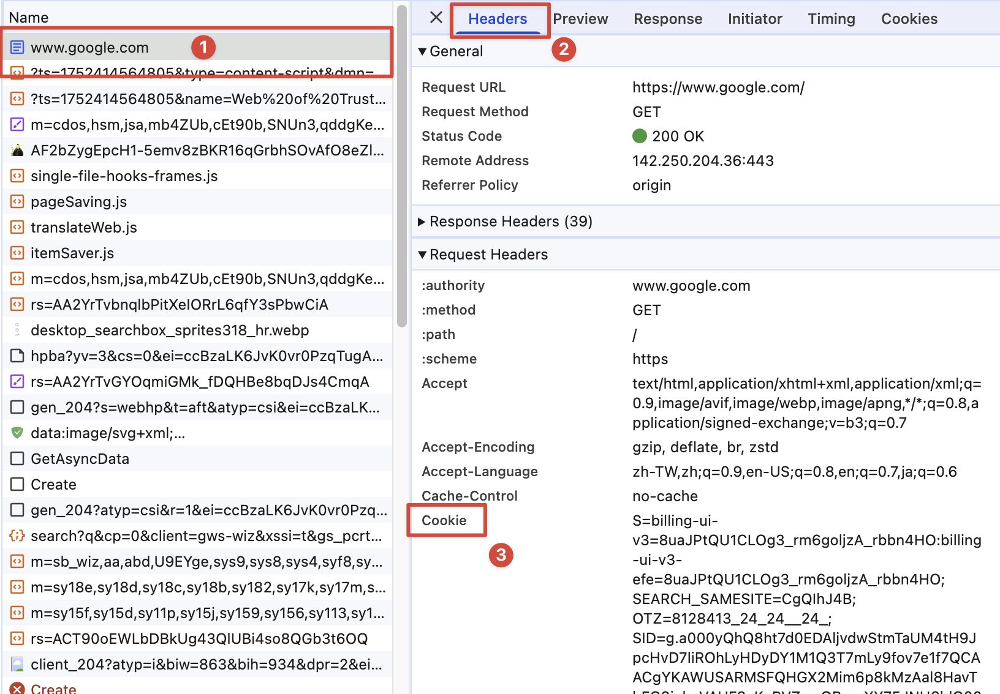
>
> 3. 將cookie值複製到python程式中
>
> ```python
> import requests
> 
> url = "http://www.google.com"
> 
> headers = {
>     'User-Agent': 'Mozilla/5.0 (Windows NT 10.0; Win64; x64) AppleWebKit/537.36 (KHTML, like Gecko) Chrome/104.0.0.0 Safari/537.36',
>     'cookie': "S=billing-ui-v3=8uaJPtQU1CLOg3_rm6goljzA_rbbn4HO:billing-ui-v3-efe=8uaJPtQU1CLOg3_rm6goljzA_rbbn4HO; SEARCH_SAMESITE=CgQIhJ4B; OTZ=8128413_24_24__24_; SID=g.a000yQhQ8ht7d0EDAljvdwStmTaUM4tH9JpcHvD7liROhLyHDyDY1M1Q3T7mLy9fov7e1f7QCAACgYKAWUSARMSFQHGX2Mim6p8kMzAal8HavTbFG9iuhoVAUF8yKoPVZwoQBpsrXY75JNU6ldG0076; __Secure-1PSID=g.a000yQhQ8ht7d0EDAljvdwStmTaUM4tH9JpcHvD7liROhLyHDyDYx8QHvEtX2CMTGLpOflwPiwACgYKAbMSARMSFQHGX2Mi5MkimsLbIrWMI3p0SPzWkhoVAUF8yKoJpaKzKMqM6KSxvWuTOCeK0076; __Secure-3PSID=g.a000yQhQ8ht7d0EDAljvdwStmTaUM4tH9JpcHvD7liROhLyHDyDYBrVh3FFq1KP5X_BEtu8uEAACgYKARgSARMSFQHGX2MiUgH7jxuvx7EFShTc0fuKxBoVAUF8yKp4iwWZDHLyGE_8kytq3XgE0076; HSID=AekkORrSmj5AfVnjq; SSID=AvwpzoU7MsOEdeQDb; APISID=Q3GJaPYzTN6X8sai/A8imJ47ZzSVNF4Mtv; SAPISID=HIVaOdoQ2ipPYl0e/A_-gUkcxMUCGjNv7k; __Secure-1PAPISID=HIVaOdoQ2ipPYl0e/A_-gUkcxMUCGjNv7k; __Secure-3PAPISID=HIVaOdoQ2ipPYl0e/A_-gUkcxMUCGjNv7k; AEC=AVh_V2hO53wgEkM_ZdLE7H7g2XFavuC2Ct2ZZ-nuXcvyT9bZd5I10bKY0Q; 
> }
> 
> response = requests.get(url)
> print(response.status_code)
> print(response.text)
> ```

> **2. 建立cookie字典(推薦)**
>
> 1. 打開開發人員工具找到google的這個請求，滑鼠右鍵
>
>     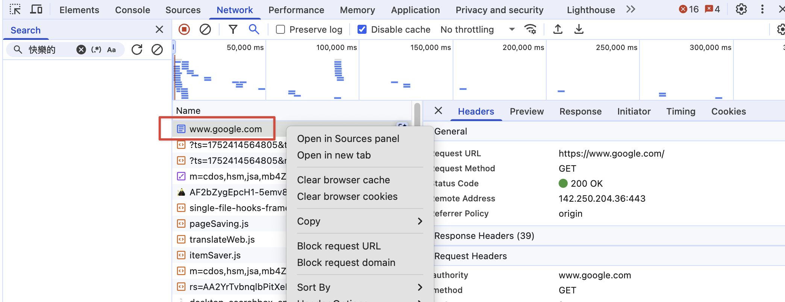
>
> 2. 選擇Copy -> Copy as cURL
>
>     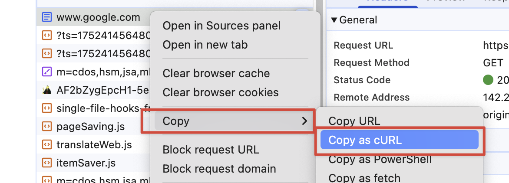
>
> 3. 找一個爬蟲工具將複製下來的cURL轉換成字典格式，例如*[<kbd> 爬蟲工具  </kbd>](https://spidertools.cn/#/)*
>
>     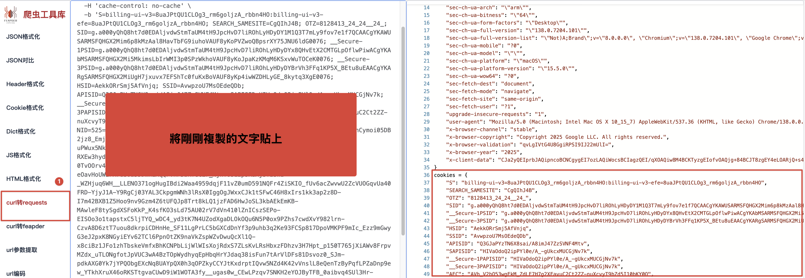
>
> 4. 將cookie值複製到python程式中
>
> ```python
> import requests
> 
> url = "http://www.google.com"
> 
> 
> headers = {
>     'User-Agent': 'Mozilla/5.0 (Windows NT 10.0; Win64; x64) AppleWebKit/537.36 (KHTML, like Gecko) Chrome/104.0.0.0 Safari/537.36'
> }
> 
> # 建立cookie字典
> cookies = {
>     "S": "billing-ui-v3=8uaJPtQU1CLOg3_rm6goljzA_rbbn4HO:billing-ui-v3-efe=8uaJPtQU1CLOg3_rm6goljzA_rbbn4HO",
>     "SEARCH_SAMESITE": "CgQIhJ4B",
>     "OTZ": "8128413_24_24__24_",
>     "SID": "g.a000yQhQ8ht7d0EDAljvdwStmTaUM4tH9JpcHvD7liROhLyHDyDY1M1Q3T7mLy9fov7e1f7QCAACgYKAWUSARMSFQHGX2Mim6p8kMzAal8HavTbFG9iuhoVAUF8yKoPVZwoQBpsrXY75JNU6ldG0076",
>     "__Secure-1PSID": "g.a000yQhQ8ht7d0EDAljvdwStmTaUM4tH9JpcHvD7liROhLyHDyDYx8QHvEtX2CMTGLpOflwPiwACgYKAbMSARMSFQHGX2Mi5MkimsLbIrWMI3p0SPzWkhoVAUF8yKoJpaKzKMqM6KSxvWuTOCeK0076",
>     "__Secure-3PSID": "g.a000yQhQ8ht7d0EDAljvdwStmTaUM4tH9JpcHvD7liROhLyHDyDYBrVh3FFq1KP5X_BEtu8uEAACgYKARgSARMSFQHGX2MiUgH7jxuvx7EFShTc0fuKxBoVAUF8yKp4iwWZDHLyGE_8kytq3XgE0076",
>     "HSID": "AekkORrSmj5AfVnjq",
>     "SSID": "AvwpzoU7MsOEdeQDb",
>     "APISID": "Q3GJaPYzTN6X8sai/A8imJ47ZzSVNF4Mtv",
>     "SAPISID": "HIVaOdoQ2ipPYl0e/A_-gUkcxMUCGjNv7k",
>     "__Secure-1PAPISID": "HIVaOdoQ2ipPYl0e/A_-gUkcxMUCGjNv7k",
>     "__Secure-3PAPISID": "HIVaOdoQ2ipPYl0e/A_-gUkcxMUCGjNv7k",
>     "AEC": "AVh_V2hO53wgEkM_ZdLE7H7g2XFavuC2Ct2ZZ-nuXcvyT9bZd5I10bKY0Q",
> }
> 
> response = requests.get(url, headers=headers, cookies=cookies)
> 
> print(response.status_code)
> print(response.text)
> ```

## 重定向與歷史請求

當我們訪問一個網站的時候伺服器告訴瀏覽器「這個頁面已經搬到別的地方了，請到新地址去找」，此時網頁就會重定向到新的網站，requests庫默認也是如此，可以設置`requests.get(url, allow_redirects=False)` 取消網頁自動重定向

可以通過 `response.history` 可以獲取到請求的歷史記錄

```python
import requests

headers = {
    "User-Agent": "Mozilla/5.0 (iPhone; CPU iPhone OS 13_2_3 like Mac OS X) AppleWebKit/605.1.15 (KHTML, like Gecko) Version/13.0.3 Mobile/15E148 Safari/604.1"
}

response = requests.get("http://www.360buy.com", headers=headers)

print("歷史請求過程資訊：")
print(response.history)
for one_info in response.history:
    print(one_info.status_code, one_info.url, one_info.headers)

print("\n\n最後一次的請求資訊：")
print(response.status_code, response.url, response.headers)
```

## SSL證書問題

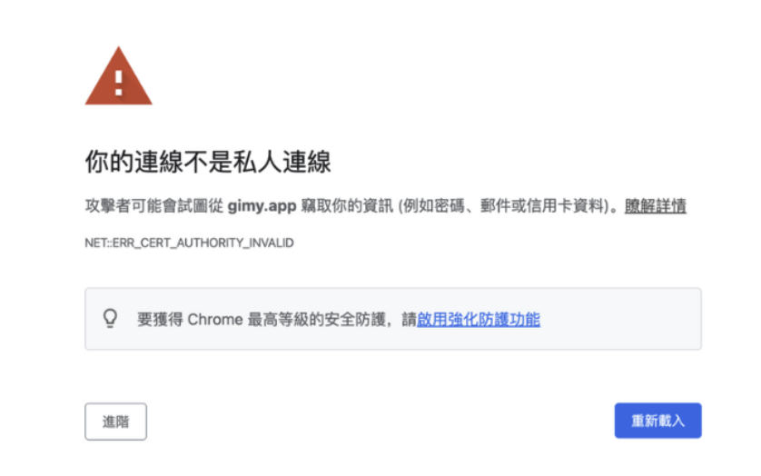

在瀏覽網頁時，可能會遇到這種狀況，出現這個問題的原因是：SSL證書不安全導致的，若是在爬蟲遇到這個狀況他就會直接報錯

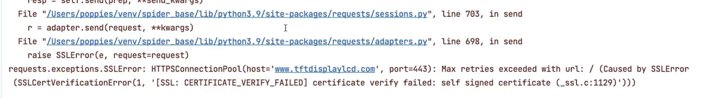

必須要在程式碼當中設置 `verify=False` 參數：

```python
import requests

url = "https://google.com"
response = requests.get(url, verify=False)
print(response.text)
```

## 請求超時重試

在爬蟲中，一個請求很久沒有結果，就會讓整個項目的效率變得非常低。這個時候我們就需要對請求進行強制要求，讓他必須在特定的時間內返回結果，否則就報錯，當然後續也可以捕獲這個錯誤

可以設定 `timeout` 參數：

```python
import requests
from requests.exceptions import ConnectTimeout

url = "https://www.google.com"

try:
    response = requests.get(url=url, timeout=1)
except ConnectTimeout:
    print("請求超時")
```

> [!note]
>
> 這個方法還能夠拿來檢測代理ip品質，如果一個代理ip在很長時間沒有響應，那麼新增超時之後也會報錯，對應的這個ip就可以從代理ip池中刪除

我們可以在請求超時的時候使用**retying庫**設置最大嘗試次數，即使失敗或是連線超時一次也不會造成程式中斷或是無法連接的狀況

安裝retrying庫：

```bash
pip install retrying
```

使用方法：

1. 使用`retrying` 包提供的 `retry` 模組
2. 通過裝飾器的方式使用，讓被裝飾的函數反覆執行
3. `retry` 中可以傳入參數 `stop_max_attempt_number` 讓函數報錯後繼續重新執行，達到最大執行次數的上限，如果每次都報錯，整個函數報錯，如果中間有一個成功，程序繼續往後執行

```python
from retrying import retry
import requests

num = 1

# 定義一個函數，如果請求超時，則重試
@retry(stop_max_attempt_number=3)
def get_url():
    global num
    
    print(f"第{num}次請求")
    num += 1
    
    url = "https://www.google.com"
    response = requests.get(url=url, timeout=3)
    return response.status_code

print(get_url())
```

> [!note]
>
> `retry` 搭配 `try-except` 使用的時候，要用 `raise`  主動重新拋出異常，觸發重試，不然可能會沒有效果

## 攜帶JSON資料

在發送post請求的時候，需要向伺服器提交資料，提交的資料大致上分為兩種：

* **表單 (Form Data)**：本質上是**字典**，使用 `requests.post` 中的 `data` 參數進行提交

* **請求負載Payload** ：本質上是**字符串**，使用 `requests.post` 中的 `json` 參數進行提交

    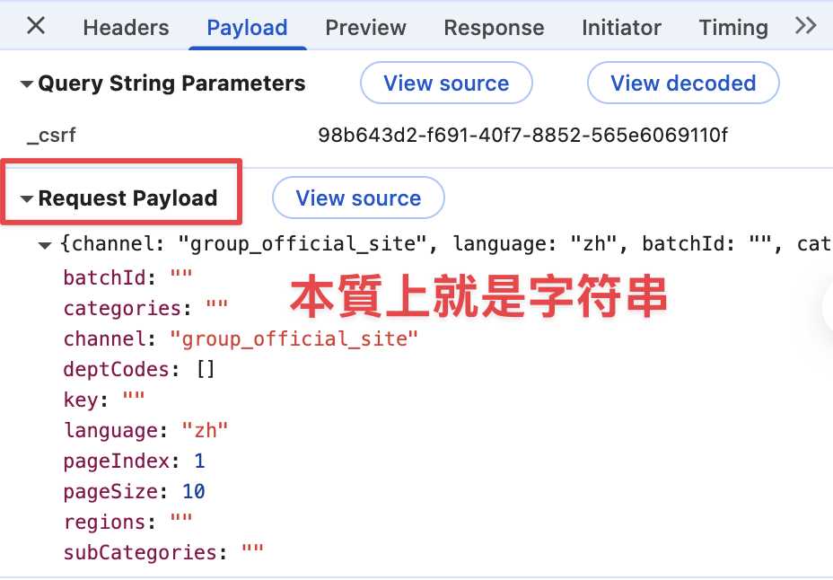

```python
import requests

url = 'https://careers.aliyun.com/position/search'

headers = {
    "User-Agent": "Mozilla/5.0 (Macintosh; Intel Mac OS X 10_15_7) AppleWebKit/537.36 (KHTML, like Gecko) Chrome/138.0.0.0 Safari/537.36",
    "Cookie": "aliyun_choice=intl; aliyun_country=TW; cna=7LvVIJlDSlcCASTmYlHS2x5V; notice_behavior=none; isg=BNraNjXeZrekieo32S9HA2rtK4b8C17lL4PJIeRUUG1hV3GR-5h99HTkIitL49Z9; tfstk=g7jK572R6RHLXgSpI9ziZnSF0W2GYPXU56WjqQAnP1COnT7HEWyFyL1cELTC-Tv7eCCJq90HKaQON18HOz73e8Chs6AQ9H6W29fO-UAkA8ERFt1JzJRkNQClFw2gmoXFL385eSq0mdu_dL1KdDgQFd9vdRvBARAtW3-7i5vqX5Zp46wPcLXI5dOweLGIR_i61Kd6F2t5NCT6hKcBV_1Wfl9yeXiWNpO_BLR6N3t5NOw9ECOS1qmwazOm2Zq1eNbEybcIOGppJQiH-0LVqmYkG9Otr4vMpbOfdC3SrIQUdy65N7nkcZ5O2E102c-hHNt6pNeS5BTAR6vNwonBOGBCABjQsDACYO_cq1wSVQQ1lU_fd509BN6hXFjbM0LF5672ygVg0Hbcng8fAkh2sEJRMH_T1DCf4nscDetniIpoRRetz4-BQ0A3ihVeBCRXBI2GO4uyWqJ9iRUEz48BQdd0Ih0rzF3V.; aliyun_site=INTL; aliyun_lang=zh-TW; _rb_id=641dd743243a4db19fa065de6f8d9c53; XSRF-TOKEN=98b643d2-f691-40f7-8852-565e6069110f; prefered-lang=zh; SESSION=MUI4QTgxM0YyOTk2MEI0NTNCOEQ5MEVDMkQxRDlBOTQ="
}

data = {"channel":"group_official_site","language":"zh","batchId":"","categories":"","deptCodes":[],"key":"","pageIndex":1,"pageSize":10,"regions":"","subCategories":""}

params = {
    "_csrf": "98b643d2-f691-40f7-8852-565e6069110f"
}

response = requests.post(url, headers=headers, json=data, params=params).json()
print(response)
```

## Session會話

在網頁爬取過程中，我們經常遇到需要登錄驗證的情況：

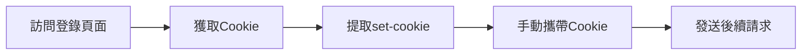
```mermaid
graph LR
    A[訪問登錄頁面] --> B[獲取Cookie]
    B --> C[提取set-cookie]
    C --> D[手動攜帶Cookie]
    D --> E[發送後續請求]

```

傳統方式的問題：

- 需要手動提取 `requests.utils.dict_from_cookiejar(r.cookies)`
- 每次請求都要手動攜帶 Cookie
- 代碼複雜，容易出錯

Session 提供了一個優雅的解決方案，能夠**跨請求保持參數**，在同一個 Session 實例的所有請求之間自動管理狀態

session對象在請求了一個網站後，對方伺服器設定在本地的cookie會保存在session對象中，下一次再使用session對象請求對方伺服器的時候，會自動帶上前一次的cookie

| 特性         | Cookie                    | Session              |
| ------------ | ------------------------- | -------------------- |
| **存儲位置** | 客戶端瀏覽器              | 伺服器端             |
| **安全性**   | ⚠️ 較低，可被用戶查看/修改 | ✅ 較高，存儲在伺服器 |
| **存儲容量** | 限制 4KB                  | 理論上無限制         |
| **生命週期** | 可設定過期時間            | 通常瀏覽器關閉後失效 |
| **網路傳輸** | 每次請求都會傳送          | 只傳送 Session ID    |

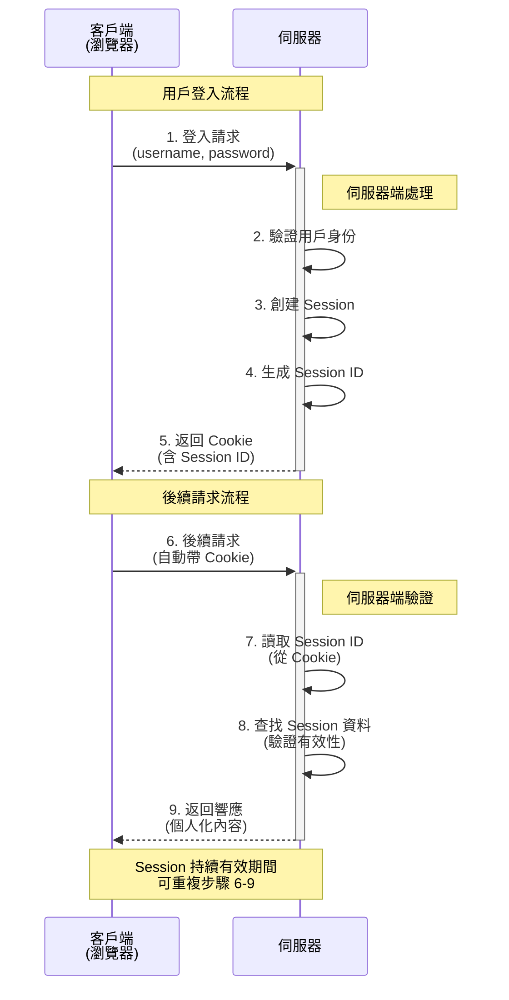
```mermaid
sequenceDiagram
    participant C as 客戶端<br/>(瀏覽器)
    participant S as 伺服器
    
    Note over C,S: 用戶登入流程
    
    C->>+S: 1. 登入請求<br/>(username, password)
    
    Note right of S: 伺服器端處理
    S->>S: 2. 驗證用戶身份
    S->>S: 3. 創建 Session
    S->>S: 4. 生成 Session ID
    
    S-->>-C: 5. 返回 Cookie<br/>(含 Session ID)
    
    Note over C,S: 後續請求流程
    
    C->>+S: 6. 後續請求<br/>(自動帶 Cookie)
    
    Note right of S: 伺服器端驗證
    S->>S: 7. 讀取 Session ID<br/>(從 Cookie)
    S->>S: 8. 查找 Session 資料<br/>(驗證有效性)
    
    S-->>-C: 9. 返回響應<br/>(個人化內容)
    
    Note over C,S: Session 持續有效期間<br/>可重複步驟 6-9
```

```python
import requests

url = "https://www.google.com"

headers = {
    "User-Agent": "Mozilla/5.0 (Macintosh; Intel Mac OS X 10_15_7) AppleWebKit/537.36 (KHTML, like Gecko) Chrome/138.0.0.0 Safari/537.36"
}

session = requests.Session()

response = session.get(url, headers=headers)
print("第一次請求成功的請求頭", response.request.headers)
print("第一次請求成功的回應頭", response.headers)
print("-"*50)

response = session.get(url, headers=headers)
print("第二次請求成功的請求頭", response.request.headers)
print("第二次請求成功的回應頭", response.headers)

"""
第一次請求成功的請求頭 {'User-Agent': 'Mozilla/5.0 (Macintosh; Intel Mac OS X 10_15_7) AppleWebKit/537.36 (KHTML, like Gecko) Chrome/138.0.0.0 Safari/537.36', 'Accept-Encoding': 'gzip, deflate', 'Accept': '*/*', 'Connection': 'keep-alive'}
第一次請求成功的回應頭 {'Date': 'Fri, 18 Jul 2025 11:32:42 GMT', 'Expires': '-1', 'Cache-Control': 'private, max-age=0', 'Content-Type': 'text/html; charset=UTF-8', 'Strict-Transport-Security': 'max-age=31536000', 'Content-Security-Policy-Report-Only': "object-src 'none';base-uri 'self';script-src 'nonce-mn1jEgCorvD-27X98QRIKA' 'strict-dynamic' 'report-sample' 'unsafe-eval' 'unsafe-inline' https: http:;report-uri https://csp.withgoogle.com/csp/gws/other-hp", 'Cross-Origin-Opener-Policy': 'same-origin-allow-popups; report-to="gws"', 'Report-To': '{"group":"gws","max_age":2592000,"endpoints":[{"url":"https://csp.withgoogle.com/csp/report-to/gws/other"}]}', 'Accept-CH': 'Sec-CH-Prefers-Color-Scheme, Downlink, RTT, Sec-CH-UA-Form-Factors, Sec-CH-UA-Platform, Sec-CH-UA-Platform-Version, Sec-CH-UA-Full-Version, Sec-CH-UA-Arch, Sec-CH-UA-Model, Sec-CH-UA-Bitness, Sec-CH-UA-Full-Version-List, Sec-CH-UA-WoW64', 'Permissions-Policy': 'unload=()', 'P3P': 'CP="This is not a P3P policy! See g.co/p3phelp for more info."', 'Content-Encoding': 'gzip', 'Server': 'gws', 'X-XSS-Protection': '0', 'X-Frame-Options': 'SAMEORIGIN', 'Set-Cookie': 'AEC=AVh_V2jWa7zdE-lQViaYUPUPk4sXi33-OmskGHAo_f6g5y4WDXuHRh78Z5c; expires=Wed, 14-Jan-2026 11:32:42 GMT; path=/; domain=.google.com; Secure; HttpOnly; SameSite=lax, NID=525=Zh6XJKXXXl6O4G3Q8qEyfdTRGtigqUeGHeDmKNP9IE7C2aXoFUozArhADYGtRLB6DlxHxy6Q-iiSFsn49EdZqKDRqrcm8TjNnWtw6OC3bpxMUhH6ajstZSdgTbVYNipQlFzEq8mkGhlRQbkh3kD3bnlUs9T1CbtzN_v95rmgtYo_UCqw1gHC_roajC9ZznxdrVe9KaIVdsGLrQ1Xjg; expires=Sat, 17-Jan-2026 11:32:42 GMT; path=/; domain=.google.com; Secure; HttpOnly; SameSite=none', 'Alt-Svc': 'h3=":443"; ma=2592000,h3-29=":443"; ma=2592000', 'Transfer-Encoding': 'chunked'}
--------------------------------------------------
第二次請求成功的請求頭 {'User-Agent': 'Mozilla/5.0 (Macintosh; Intel Mac OS X 10_15_7) AppleWebKit/537.36 (KHTML, like Gecko) Chrome/138.0.0.0 Safari/537.36', 'Accept-Encoding': 'gzip, deflate', 'Accept': '*/*', 'Connection': 'keep-alive', 'Cookie': 'AEC=AVh_V2jWa7zdE-lQViaYUPUPk4sXi33-OmskGHAo_f6g5y4WDXuHRh78Z5c; NID=525=Zh6XJKXXXl6O4G3Q8qEyfdTRGtigqUeGHeDmKNP9IE7C2aXoFUozArhADYGtRLB6DlxHxy6Q-iiSFsn49EdZqKDRqrcm8TjNnWtw6OC3bpxMUhH6ajstZSdgTbVYNipQlFzEq8mkGhlRQbkh3kD3bnlUs9T1CbtzN_v95rmgtYo_UCqw1gHC_roajC9ZznxdrVe9KaIVdsGLrQ1Xjg'}
第二次請求成功的回應頭 {'Date': 'Fri, 18 Jul 2025 11:32:43 GMT', 'Expires': '-1', 'Cache-Control': 'private, max-age=0', 'Content-Type': 'text/html; charset=UTF-8', 'Content-Security-Policy-Report-Only': "object-src 'none';base-uri 'self';script-src 'nonce-C4R1_a1F1Vr7o_E6fdg_0Q' 'strict-dynamic' 'report-sample' 'unsafe-eval' 'unsafe-inline' https: http:;report-uri https://csp.withgoogle.com/csp/gws/other-hp", 'Cross-Origin-Opener-Policy': 'same-origin-allow-popups; report-to="gws"', 'Report-To': '{"group":"gws","max_age":2592000,"endpoints":[{"url":"https://csp.withgoogle.com/csp/report-to/gws/other"}]}', 'Accept-CH': 'Sec-CH-Prefers-Color-Scheme, Downlink, RTT, Sec-CH-UA-Form-Factors, Sec-CH-UA-Platform, Sec-CH-UA-Platform-Version, Sec-CH-UA-Full-Version, Sec-CH-UA-Arch, Sec-CH-UA-Model, Sec-CH-UA-Bitness, Sec-CH-UA-Full-Version-List, Sec-CH-UA-WoW64', 'Permissions-Policy': 'unload=()', 'Content-Encoding': 'gzip', 'Server': 'gws', 'X-XSS-Protection': '0', 'X-Frame-Options': 'SAMEORIGIN', 'Alt-Svc': 'h3=":443"; ma=2592000,h3-29=":443"; ma=2592000', 'Transfer-Encoding': 'chunked'}
"""
```

# 資料提取

在爬蟲爬取的資料中有很多不同類型的資料，我們需要瞭解資料的不同類型來規律的提取和解析資料

- 結構化資料：`json`、`xml` 

    - 處理方式：直接轉化為 `python` 資料類型

    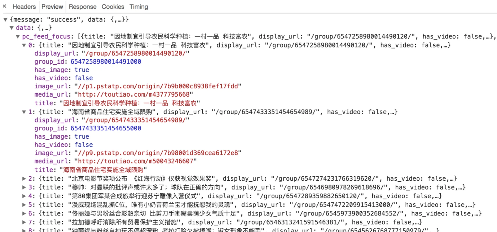

    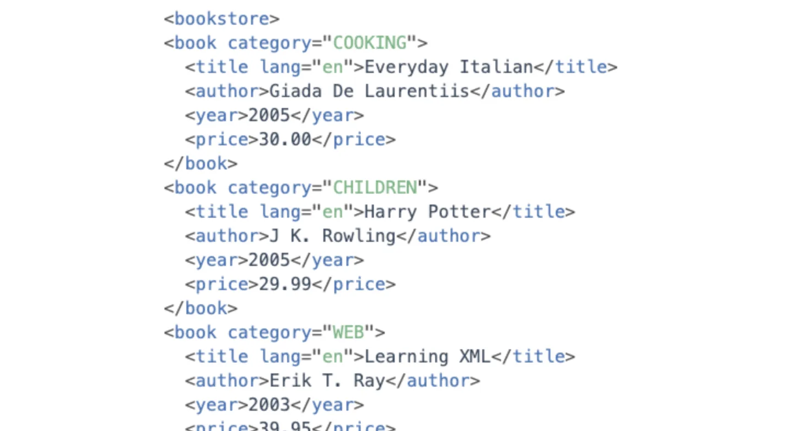

- 非結構化資料：`HTML` 

    - 處理方式：正規表示式、`xpath`、`bs4`

    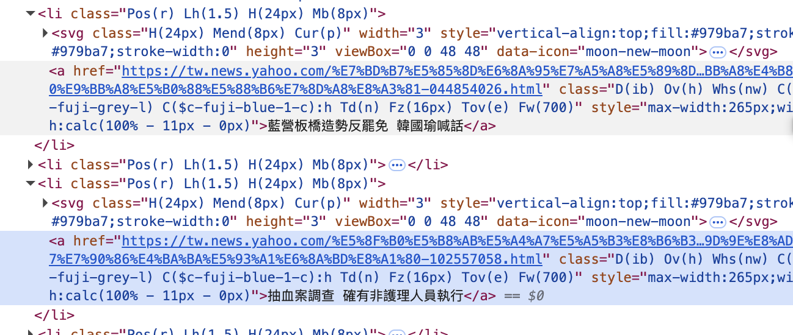

> [!note]
>
> **什麼是JSON**
>
> `JSON(JavaScript Object Notation)` 是一種輕量級的資料交換格式，讓我們很容易的進行閱讀和編寫，同時也方便了機器進行解析和生成，適用於進行資料互動的場景，比如網站前端與後端之間的資料互動
>
> ```mermaid
> graph LR
>     A["JSON字符串"] -->|"json.loads()"| B["Python數據類型"]
>     B -->|"json.dumps()"| A
>     
>     style A fill:#e1f5fe,stroke:#01579b,stroke-width:2px
>     style B fill:#f3e5f5,stroke:#4a148c,stroke-width:2px
> ```
>

## xpath語法

**XPath（XML Path Language）** 是一種用於在 XML 和 HTML 文檔中定位和選擇節點的查詢語言。它使用類似文件系統路徑的語法來導航文檔結構，所以在之後的靜態網站資料提取中會經常使用xpath語法完成

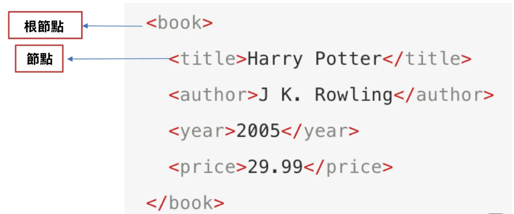

> [!note]
>
> 推薦好用的輔助工具，可以在Chrome商店下載
>
> *[<kbd> xpath測試器  </kbd>](https://chromewebstore.google.com/detail/xpath-%E6%B8%AC%E8%A9%A6%E5%99%A8/cneomjecgakdfoeehmmmoiklncdiodmh)*

---

> **語法規則**
>
> | 表達式   | 描述                                                     |
> | -------- | -------------------------------------------------------- |
> | nodename | 選中該元素                                               |
> | /        | 從根節點選取、或者是元素和元素間的過濾                   |
> | //       | 從匹配選擇的當前節點選擇文檔中的節點，而不考慮它們的位置 |
> | .        | 選取當前節點                                             |
> | ..       | 選取當前節點的父節點                                     |
> | @        | 選取屬性                                                 |
> | text()   | 選取文本                                                 |

> **路徑表達式**
>
> | 路徑表達式          | 結果                                                         |
> | ------------------- | ------------------------------------------------------------ |
> | /bookstore          | 選取根元素 bookstore。注釋：假如路徑起始於正斜槓(/)，則此路徑始終代表到某元素的絕對路徑 |
> | bookstore/book      | 選取屬於 bookstore 之下的所有 book 元素                      |
> | //book              | 選取所有 book 子元素，而不管它們在文檔中的位置               |
> | bookstore//book     | 選擇屬於 bookstore 元素的後代的所有 book 元素，而不管它們位於 bookstore 之下的什麼位置 |
> | //book/title/@lang  | 選擇所有的 book 下面的 title 中的 lang 屬性的值              |
> | //book/title/text() | 選擇所有的 book 下面的 title 的文本                          |

> **查詢特定節點**
>
> | 路徑表達式                                     | 結果                                                         |
> | ---------------------------------------------- | ------------------------------------------------------------ |
> | //title[@lang="eng"]                           | 選擇 lang 屬性值為 eng 的所有 title 元素                     |
> | /bookstore/book[1]                             | 選取屬於 bookstore 子元素的第 1 個 book 元素                 |
> | /bookstore/book[last()]                        | 選取屬於 bookstore 子元素的最後 1 個 book 元素               |
> | /bookstore/book[last()-1]                      | 選取屬於 bookstore 子元素的倒數第 2 個 book 元素             |
> | /bookstore/book[position()>1]                  | 選擇 bookstore 下面的 book 元素，從第 2 個開始選擇           |
> | /bookstore/book[position()>1 and position()<4] | 選擇 bookstore 下面的 book 元素，從第 2 個開始取到第 4 個元素 |
> | //book/title[text()='Harry Potter']            | 選擇所有 book 下的 title 元素，僅僅選擇文本為 Harry Potter 的 title 元素 |
>
> > [!caution]
> >
> > 在xpath中，第一個元素的位置是1，最後一個元素的位置是last()，倒數第二個是last()-1

## lxml模組中的xpath語法

**lxml** 是 Python 中一個功能強大的 XML 和 HTML 處理庫，主要用於解析、操作和生成 XML/HTML 文檔

需要先安裝套件：

```bash
pip install lxml
```

使用步驟：

1. 使用lxml轉化為Element對象
2. 使用lxml中的xpath語法提取資料
3. 處理數據結果

練習：爬取國賓影城現在熱映的電影名稱及圖片

```python
import requests
from lxml import etree

url = "https://www.ambassador.com.tw/home/MovieList?Type=1"

headers = {
    "User-Agent": "Mozilla/5.0 (Windows NT 10.0; Win64; x64) AppleWebKit/537.36 (KHTML, like Gecko) Chrome/125.0.0.0 Safari/537.36"
}

response = requests.get(url, headers=headers).text
tree = etree.HTML(response)

movie_name_list = tree.xpath('//div[@class="cell"]//a/text()')
movie_pic_list = tree.xpath('//div[@class="cell"]//img/@src')

for movie_name, movie_pic in zip(movie_name_list, movie_pic_list):
    movie = {}
    movie['movie_name'] = movie_name
    movie['movie_pic'] = movie_pic
    print(movie)
    
"""
{'movie_name': '全知讀者視角', 'movie_pic': 'https://www.ambassador.com.tw/assets/img/movies/OmniscientReader_180x270_Poster.jpg'}
{'movie_name': '驚奇4超人：第一步', 'movie_pic': 'https://www.ambassador.com.tw/assets/img/movies/TheFantasticFourFirstSteps_180x270_Poster.jpg'}
{'movie_name': '電影哆啦A夢：大雄的繪畫世界物語', 'movie_pic': 'https://www.ambassador.com.tw/assets/img/movies/DORAEMONTHEMOVIENOBITASARTWORLDTALE_180x270_Poster.jpg'}
{'movie_name': '地球特派員', 'movie_pic': 'https://www.ambassador.com.tw/assets/img/movies/ELIO_180x270_Poster.jpg'}
{'movie_name': '超人', 'movie_pic': 'https://www.ambassador.com.tw/assets/img/movies/SUPERMAN_180x270_Poster.jpg'}
{'movie_name': '侏羅紀世界：重生', 'movie_pic': 'https://www.ambassador.com.tw/assets/img/movies/JURASSICWORLDREBIRTH_180x270_Poster.jpg'}
{'movie_name': 'F1電影', 'movie_pic': 'https://www.ambassador.com.tw/assets/img/movies/F1_180x270_Poster.jpg'}
"""
```

## jsonpath語法

**JSONPath** 是一種用於查詢和提取 JSON 數據的表達式語言，類似於 XPath 之於 XML。它提供了一種簡潔的方式來從複雜的 JSON 結構中選擇和提取特定的數據

需要先安裝套件：

```python
pip install jsonpath
```

* `jsonpath.jsonpath(obj, expr)`
    * **`obj`** (dict/list): 要查詢的 JSON 對象或 Python 字典/列表
    * **`expr`** (str): JSONPath 表達式字符串

| XPath | JSONPath | 描述                                                         |
| :---: | :------: | ------------------------------------------------------------ |
|  `/`  |   `$`    | 根節點，所有JSONPath都必須從 `$` 開始                        |
|  `.`  |   `@`    | 現行節點                                                     |
|  `/`  |   `.`    | 取子節點                                                     |
| `..`  |   n/a    | 取父節點，JSONPath 未支援                                    |
| `//`  |   `..`   | 不管位置，選擇所有符合條件的條件                             |
|  `*`  |   `*`    | 匹配所有元素節點                                             |
|  `@`  |   n/a    | 根據屬性訪問，JSON 不支援，因為 JSON 是個 Key-value 遞迴結構，不需要屬性訪問 |
| `[]`  |   `[]`   | 迭代器標示（可以在裡邊做簡單的迭代操作，如陣列下標，根據內容選值等） |
|  `|`  |  `[,]`   | 支援迭代器中做多選                                           |
| `[]`  |  `?()`   | 支援過濾操作                                                 |
|  n/a  |   `()`   | 支援表達式計算                                               |
| `()`  |   n/a    | 分組，JSONPath 不支援                                        |

*==練習JSON範例==*

```python
"error_code": 0,
    "stu_info": [
        {
            "id": 2059,
            "name": "小白",
            "sex": "男",
            "age": 28,
            "addr": "103臺北市大同區",
            "grade": "天蠍座",
            "phone": "1837830",
            "gold": 10896, 
            "info": {
                "card": 12345678,
                "bank_name": '中國銀行'
            }
        },
        {
            "id": 2067,
            "name": "小黑",
            "sex": "男",
            "age": 28,
            "addr": "110臺北市信義區",
            "grade": "天蠍座",
            "phone": "87654321",
            "gold": 100
        }
    ]
```

---

> **不使用jsonpath**
>
> ```python
> # 取學生的名字
> 
> stu1 = info["stu_info"][0]['name']
> stu2 = info["stu_info"][1]['name']
> 
> print(stu1)
> print(stu2)
> ```
>
> _~Rd!~_

> **使用jsonpath**
>
> ```python
> # 取學生的名字
> 
> students = jsonpath.jsonpath(info, '$..name')
> 
> print(studetns)
> ```
>
> _~Gn!~_

> [!note]
>
> 相同數據下使用不同方法取值雖然結果一樣，但是JSONPath 大幅減少代碼行數，表達式更直觀易懂

> **練習：使用jsonpath提取資料**
>
> ```json
> "store": {
>         "book": [
>             {"category": "reference",
>              "author": "Nigel Rees",
>              "title": "Sayings of the Century",
>              "price": 8.95
>              },
>             {"category": "fiction",
>              "author": "Evelyn Waugh",
>              "title": "Sword of Honour",
>              "price": 12.99
>              },
>             {"category": "fiction",
>              "author": "Herman Melville",
>              "title": "Moby Dick",
>              "isbn": "0-553-21311-3",
>              "price": 8.99
>              },
>             {"category": "fiction",
>              "author": "J. R. R. Tolkien",
>              "title": "The Lord of the Rings",
>              "isbn": "0-395-19395-8",
>              "price": 22.99
>              }
>         ],
>         "bicycle": {
>             "color": "red",
>             "price": 19.95
>         }
>     }
> ```

> ###### 1. 提取第1本書的title
>
> ```python
> q1 = jsonpath(info, "$.store.book[0].title")
> # q1 = jsonpath(info, "$..title")[0]
> print(f"{q1=}")
> ```
>

> ###### 2. 提取2、3、4本書的標題
>
> ```python
> q2 = jsonpath(info, "$..book[1,2,3].title")
> # q2 = jsonpath(info, "$..book[1:4].title")
> print(f"{q2=}")
> ```

>###### 3. 提取1、3本書的標題
>
>```python
>q3 = jsonpath(info, "$..book[0,2].title")
># q3 = jsonpath(info, "$..book[::2].title")
>print(f"{q3=}")
>```

> ###### 4. 提取最後一本書的標題
>
> ```python
> q4 = jsonpath(info, "$..book[-1:].title")
> # q4 = jsonpath(info, "$..book[(@.length-1)].title") # 計算式要加括號()
> print(f"{q4=}")
> ```

> ###### 5. 提取價格小於10的書的標題
>
> ```python
> q5 = jsonpath(info, "$..book[?(@.price<10)].title")
> print(f"{q5=}")
> ```

> ###### 6. 提取價格小於或者等於20的所有商品的價格
>
> ```python
> q6 = jsonpath(info, "$..*[?(@.price<=20)].price")
> print(f"{q6=}")
> ```

> ###### 7. 獲取所有書的作者
>
> ```python
> q7 = jsonpath(info, "$..author")
> # q7 = jsonpath(info, "$..book..author")
> print(f"{q7=}")
> ```

> ###### 8. 獲取在store中的所有商品(包括書、自行車)
>
> ```python
> q8 = jsonpath(info, "$..store")
> print(f"{q8=}")
> ```

> ###### 9. 獲取所有商品（包括書、自行車）的價格
>
> ```python
> q9 = jsonpath(info, "$..store..price")
> print(f"{q9=}")
> ```

> ###### 10. 獲取帶有isbn的書
>
> ```python
> q10 = jsonpath(info, "$..book[?(@.isbn)].title")
> print(f"{q10=}")
> ```

> ###### 11. 獲取不帶有isbn的書
>
> ```python
> q11 = jsonpath(info, "$..book[?(!@.isbn)].title")
> print(f"{q11=}")
> ```

> ###### 12. 獲取價格在5~10之間的書
>
> ```python
> q12 = jsonpath(info, "$..book[?(@.price>5 && @.price<10)].title")
> print(f"{q12=}")
> ```

> ###### 13. 獲取價格不在5~10之間的書
>
> ```python
> q13 = jsonpath(info, "$..book[?(@.price<5 || @.price>10)].title")
> print(f"{q13=}")
> ```

> ###### 14. 獲取所有的元素
>
> ```python
> q14 = jsonpath(info, "$..*")
> print(f"{q14=}")
> ```

## bs4語法

BeautifulSoup4簡稱BS4，和使用lxml模組一樣，Beautiful Soup 也是一個HTML/XML的解析器，主要的功能也是解析和提取HTML/XML資料
BeautifulSoup用來解析HTML比較簡單，API非常人性化，支援CSS選擇器、Python標準庫中的HTML解析器，也支援lxml模組的XML解析器

> [!NOTE]
>
> Beautiful Soup是基於HTML DOM的，會載入整個文件，解析整個DOM樹，因此時間和記憶體開銷都會大很多，所以性能要低於lxml模組

需要先安裝套件：

```bash
pip install bs4
```

| 抓取工具      | 速度 | 使用難度 | 安裝難度   |
| ------------- | ---- | -------- | ---------- |
| 正則          | 最快 | 困難     | 無（內建） |
| BeautifulSoup | 慢   | 最簡單   | 簡單       |
| lxml          | 快   | 簡單     | 一般       |

**find方法**

* find：只返回**第一個**匹配的元素
* find_all：返回**所有**匹配的元素

```python
from bs4 import BeautifulSoup

html = """
<html><head><title>The Dormouse's story</title></head>
<body>
<p class="title" name="dromouse"><b>The Dormouse's story</b></p>
<p class="story">Once upon a time there were three little sisters; and their names were
<a href="http://example.com/elsie" class="sister" id="link1">Elsie</a>,
<a href="http://example.com/lacie" class="sister" id="link2">Lacie</a> and
<a href="http://example.com/tillie" class="sister" id="link3">Tillie</a>;
and they lived at the bottom of a well.</p>
<p class="story">...</p>
"""

# 建立BeautifulSoup對象
soup = BeautifulSoup(html, "lxml")

# 查找所有a標籤
a = soup.find_all("a")
print(a)
print("-"*30)

# 查找第一個a標籤
b = soup.find("a")
print(b)
print("-"*30) 

# 根據標籤內部的屬性查找
c = soup.find_all("a", attrs={"id": "link1"})
d = soup.find_all("a", id="link1") # attrs 可以省略
print(c)
print(d)
print("-"*30) 

e = soup.find_all("a", attrs={"class": "sister"})
f = soup.find_all("a", class_="sister") # 
print(e)
print(f)
print("-"*30) 
```

> [!caution]
>
> `class` 是Python的關鍵字，不能直接使用，如果要獲取 `class` 屬性的話，要使用`class_`

**select方法**

 `select()` 方法是專門用來搭配 **CSS 選擇器** 使用的

* select_one：第一個匹配的元素
* select：所有匹配的元素

*^tab^*

> **標籤選擇器**
>
> ```python
> from bs4 import BeautifulSoup
> 
> html = """
> <html><head><title>The Dormouse's story</title></head>
> <body>
> <p class="title" name="dromouse"><b>The Dormouse's story</b></p>
> <p class="story">Once upon a time there were three little sisters; and their names were
> <a href="http://example.com/elsie" class="sister" id="link1">Elsie</a>,
> <a href="http://example.com/lacie" class="sister" id="link2">Lacie</a> and
> <a href="http://example.com/tillie" class="sister" id="link3">Tillie</a>;
> """
> 
> soup = BeautifulSoup(html, "lxml")
> 
> # 標籤選擇器
> print("標籤選擇器",soup.select('title'))
> print("標籤選擇器",soup.select('a'))
> print("標籤選擇器",soup.select_one('a'))
> print("-"*30)
> ```

> **類選擇器**
>
> 在css或是python中，都是使用 `.` 來選擇類屬性
>
> ```python
> from bs4 import BeautifulSoup
> 
> html = """
> <html><head><title>The Dormouse's story</title></head>
> <body>
> <p class="title" name="dromouse"><b>The Dormouse's story</b></p>
> <p class="story">Once upon a time there were three little sisters; and their names were
> <a href="http://example.com/elsie" class="sister" id="link1">Elsie</a>,
> <a href="http://example.com/lacie" class="sister" id="link2">Lacie</a> and
> <a href="http://example.com/tillie" class="sister" id="link3">Tillie</a>;
> """
> 
> soup = BeautifulSoup(html, "lxml")
> 
> # 類選擇器
> print("類選擇器", soup.select('.title'))
> print("類選擇器", soup.select('.story'))
> print("-"*30)
> ```

> **id選擇器**
>
> 在css或是python中，都是使用 `#` 來選擇id屬性
>
> ```python
> from bs4 import BeautifulSoup
> 
> html = """
> <html><head><title>The Dormouse's story</title></head>
> <body>
> <p class="title" name="dromouse"><b>The Dormouse's story</b></p>
> <p class="story">Once upon a time there were three little sisters; and their names were
> <a href="http://example.com/elsie" class="sister" id="link1">Elsie</a>,
> <a href="http://example.com/lacie" class="sister" id="link2">Lacie</a> and
> <a href="http://example.com/tillie" class="sister" id="link3">Tillie</a>;
> """
> 
> soup = BeautifulSoup(html, "lxml")
>  
> # id選擇器
> print("id選擇器", soup.select('#link1'))
> print("-"*30)
> ```

> **層級選擇器**
>
> ```python
> from bs4 import BeautifulSoup
> 
> html = """
> <html><head><title>The Dormouse's story</title></head>
> <body>
> <p class="title" name="dromouse"><b>The Dormouse's story</b></p>
> <p class="story">Once upon a time there were three little sisters; and their names were
> <a href="http://example.com/elsie" class="sister" id="link1">Elsie</a>,
> <a href="http://example.com/lacie" class="sister" id="link2">Lacie</a> and
> <a href="http://example.com/tillie" class="sister" id="link3">Tillie</a>;
> """
> 
> soup = BeautifulSoup(html, "lxml")
> 
> # 層級選擇器
> print("層級選擇器", soup.select_one(".title b"))
> print("-"*30)
> ```

> **屬性選擇器**
>
> ```python
> from bs4 import BeautifulSoup
> 
> html = """
> <html><head><title>The Dormouse's story</title></head>
> <body>
> <p class="title" name="dromouse"><b>The Dormouse's story</b></p>
> <p class="story">Once upon a time there were three little sisters; and their names were
> <a href="http://example.com/elsie" class="sister" id="link1">Elsie</a>,
> <a href="http://example.com/lacie" class="sister" id="link2">Lacie</a> and
> <a href="http://example.com/tillie" class="sister" id="link3">Tillie</a>;
> """
> 
> soup = BeautifulSoup(html, "lxml")
> 
> # 屬性選擇器
> print("屬性選擇器", soup.select('a[class="sister"]'))
> print("屬性選擇器", soup.select('a[href="http://example.com/elsie"]'))
> print("-"*30)
> ```

**提取資料**

* get()：獲取**屬性值**
* get_text()：獲取**文字內容**（方法）
* text()：獲取**文字內容**（屬性）

```python
from bs4 import BeautifulSoup

html = """
<html><head><title>The Dormouse's story</title></head>
<body>
<p class="title" name="dromouse"><b>The Dormouse's story</b></p>
<p class="story">Once upon a time there were three little sisters; and their names were
<a href="http://example.com/elsie" class="sister" id="link1">Elsie</a>,
<a href="http://example.com/lacie" class="sister" id="link2">Lacie</a> and
<a href="http://example.com/tillie" class="sister" id="link3">Tillie</a>;
"""

soup = BeautifulSoup(html, "lxml")

# 提取資料
print("提取文字", soup.find("title").get_text())
print("提取文字", soup.find('title').text)

print("提取屬性", soup.find("a", id="link1").get("href"))
```


# scrapy框架

==Scrapy 是一個為了爬取網站資料、提取結構性數據而編寫的「應用框架」==

如果只用 Python 最基礎的 `requests` 或 `BeautifulSoup` 寫爬蟲，只適合小量、簡單的任務；但 Scrapy 提供了一整套完善流程，包含引擎、調度器、下載器、自動化部署（CI/CD）等，讓你能夠大規模、高效且自動化的量產數據

* **資料量大**：需要抓取成千上萬，甚至百萬級別的網頁
* **結構複雜**：需要處理登入、Cookie、代理 IP 池（Proxy）或 Middleware
* **需要高效率**：利用異步處理來節省大量的等待時間
* **長期專案**：需要定期維護、監控和自動化部署

```bash
# 在終端機安裝(建議使用conda安裝)
conda install -c conda-forge scrapy

# 安裝完測試指令是否正常
scrapy
```

scrapy框架的執行流程：

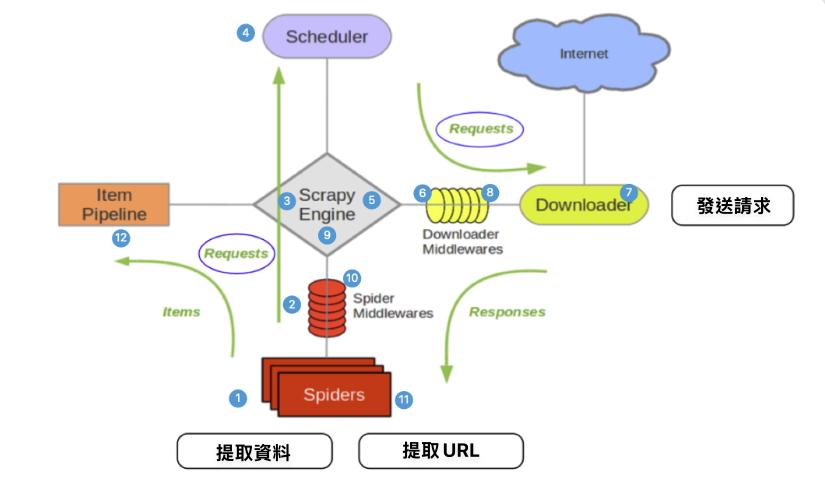

1. scrapy從spider子類中提取start_urls，然後構造為request請求對象
2. 將request請求對象傳遞給爬蟲中間件
3. 將request請求對象傳遞給scrapy引擎（就是核心程式碼）
4. 將request請求對象傳遞給調度器（它負責對多個request調度，好比交通管理員負責交通的指揮員）
5. 將request請求對象傳遞給scrapy引擎
6. scrapy引擎將request請求對象傳遞給下載中間件（可以更換代理IP，更換Cookies，更換User-Agent，自動重試。等）
7. request請求對象傳給到下載器（下載器通過非同步的方式傳送HTTP(S)請求），得到響應封裝為response對象
8. 將response對象傳遞給下載中間件
9. 下載中間件將response對象傳遞給scrapy引擎
10. scrapy引擎將response對象傳遞給爬蟲中間件（這裡可以處理異常等情況）
11. 爬蟲對象中的parse函數被呼叫（在這裡可以對得到的response對象進行處理，例如用status得到響應狀態碼，xpath可以進行提取資料等）
12. 將提取到的資料傳遞給scrapy引擎，它將資料再傳遞給管道（在管道中我們可以將資料儲存到csv、MongoDB等）

## 建立scrapy項目

> ###### 1. 建立scrapy資料夾
>
> ```bash
> # scrapy startproject 項目名稱
> scrapy startproject mySpider
> ```
>
> 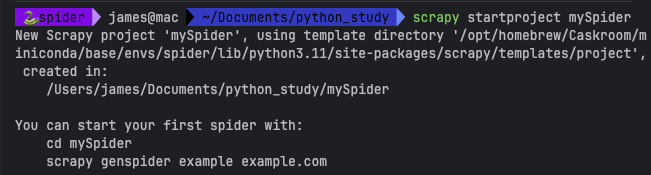
>
> 建立完成之後，會看到資料夾有剛剛設定的專案名稱及以下這些資料：
>
> 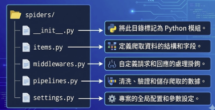

> ###### 2. 進入到專案資料夾，建立爬蟲檔案
>
> 先使用 `tree` 、 `dir` 、`ls` 等等的指令先查看專案結構，需要進入到專案的工作目錄中
>
> ```bash
> # 進入專案目錄
> cd mySpider
> 
> # 建立爬蟲檔案
> # scrapy genspider 爬蟲名 允許爬取的域名
> scrapy genspider google google.com
> ```
>
> 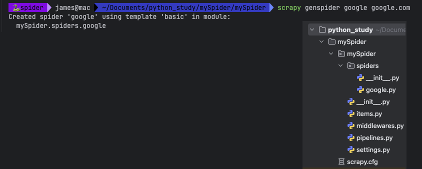
>
> 生成的爬蟲檔案：
>
> ```python
> import scrapy
> 
> 
> class GoogleSpider(scrapy.Spider):
>     name = "google"
>     allowed_domains = ["google.com"]
>     start_urls = ["https://google.com"]
> 
>     def parse(self, response):
>         pass
> ```

> ###### 3.  關閉Robots協議，執行爬蟲檔案
>
> > [!tip]
> >
> > Robots 協議，可以想像成是網站掛在大門口的一張「訪客須知」。是一個叫做 `robots.txt` 的純文字檔案，放在網站的根目錄下，用來告訴爬蟲程式，哪些資料可以擷取，因為它**不具備強制的技術阻擋功能**又稱「君子協議」
>
> 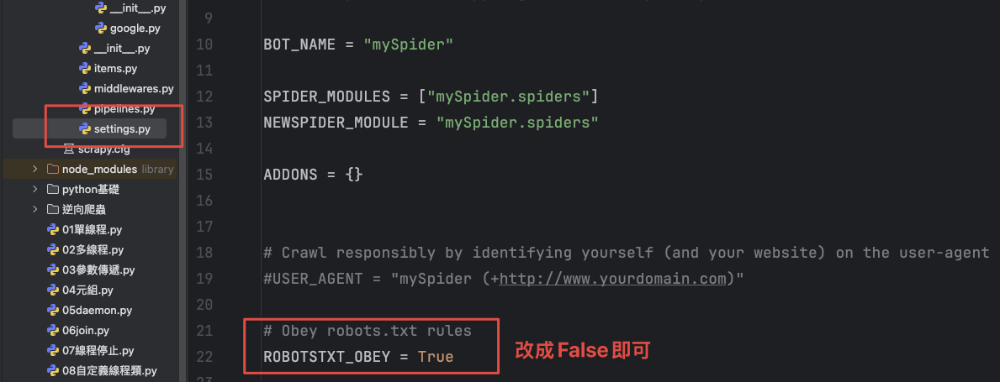
>
> 
>
> > [!important]
> >
> > 再執行爬蟲時要將終端機位置**調整到檔案的根目錄**
> >
> > 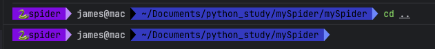
> >
> > ```bash
> > # 啟動命令中的爬蟲名稱需要和建立時設定的爬蟲名稱保持一致
> > scrapy crawl google
> > ```
>
> 

> [!caution]
>
> 用scrapy實現爬蟲，並不是建立一個.py然後在這個檔案中import匯入，而是通過scrapy命令來建構相關的目錄結構，最終通過命令來開啟scrapy

## parse方法中的response

當 Scrapy 的下載器（Downloader）成功從目標網址獲取到伺服器回傳的 HTML 原始碼及 HTTP 標頭後，它不會直接把原始數據丟給你，而是會先將這些網路數據封裝成一個 Python 的 `Response` 類別實例（Instance）。這個物件包含了該次請求回傳的所有內容並傳遞給 `parse` 方法

response物件的常用屬性：

- `response.url`：當前響應的url地址
- `response.request.url`：當前響應對應的請求的url地址
- `response.headers`：響應頭
- `response.request.headers`：當前響應的要求標頭
- `response.body`：響應體，資料返回類型為byte類型
- `response.status`：響應狀態碼
- `response.text`：文字資料

```python
import scrapy
from scrapy import cmdline
from scrapy.http import HtmlResponse
from scrapy.cmdline import execute


class YahooNewsSpider(scrapy.Spider):
    # 爬蟲名稱
    name = "YahooNews"

    # 允許抓取的域名(少使用)
    allowed_domains = ["tw.news.yahoo.com"]

    # 抓取地址
    start_urls = ["https://tw.news.yahoo.com/archive/"]

    def parse(self, response: HtmlResponse, **kwargs):
        # response常用屬性的使用
        print("---1--->", response.url)  # 響應的url地址
        print("---2--->", response.headers)  # 響應頭
        print("---3--->", response.status)  # 響應狀態碼
        print("---4--->", response.body)  # 響應體, 類型為位元組
        print("---5--->", response.request.url)  # 請求地址
        print("---6--->", response.request.headers)  # 要求標頭
        print("---7--->", response.text)  # 文字資料


if __name__ == '__main__':
    execute('scrapy crawl YahooNews'.split())
```

> [!tip]
>
> 在 `scrapy` 框架中可以使用 `cmdline.execute()` 方法來右鍵執行啟動命令，啟動命令有以下兩種
>
> ```python
> from scrapy import cmdline  # 匯入運行指令的工具
> 
> 
> # 默認啟動方式，列印日誌資訊 
> cmdline.execute('scrapy crawl YahooNews'.split())
> 
> # 忽略日誌資訊
> cmdline.execute('scrapy crawl YahooNews --nolog'.split())
> ```

**使用Xpath擷取資料**

```python
import scrapy
from scrapy.cmdline import execute
from scrapy.http import HtmlResponse

class YahooNewsSpider(scrapy.Spider):
    # 爬蟲名稱
    name = "YahooNews"

    # 允許抓取的域名
    allowed_domains = ["tw.news.yahoo.com"]

    # 抓取地址
    start_urls = ["https://tw.news.yahoo.com/archive/"]

      def parse(self, response: HtmlResponse):
        news_list = response.xpath('//div[contains(@class, "MostPopular")]//ul/li')
        for news in news_list:
            news_record = news.xpath('./span/text()').get()
            news_title = news.xpath('./a/text()').get()
            print(news_record, news_title)
            
if __name__ == '__main__':
    execute("scrapy crawl YahooNews".split())
```

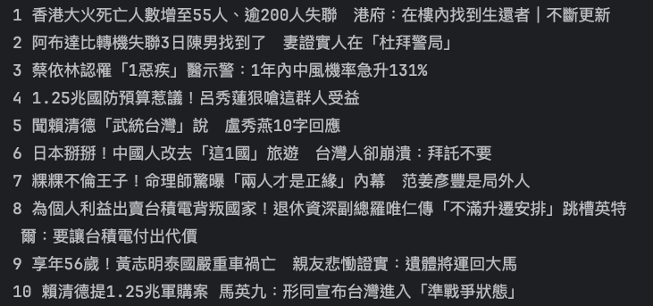

取得頁面中的資料或是標簽屬性有三種方式：

1. 使用get()方法：

   ```python
   for news in news_list:
       news_title = news.xpath('./h6[@class="pull-left"]/text()').get()
       print(news_title)
   ```

2. 使用extract()方法：

   ```python
   for news in news_list:
       news_title = news.xpath('./h6[@class="pull-left"]/text()').extract()[0]
       print(news_title)
   ```

   > [!note]
   >
   > 這個方法不推薦使用，因為還要再從列表中取值

3. 使用extract_first()方法：

   ```python
   for news in news_list:
       news_list = news.xpath('./h6[@class="pull-left"]/text()').extract_first()
       print(news_list)
   ```

## pipeline使用

當 Spider 透過 `yield item` 輸出資料後，這些資料並不會直接存檔，而是會依照順序進入你所定義的 Pipeline 類別中進行處理。這裡是你將爬取邏輯與資料處理邏輯分離的關鍵地方

> [!note]
>
> 為什麼使用 `yield` 返回資料？
>
> 1. 執行邏輯：結束 vs. 暫停
>
>    * `return` 的本質是「終止」。一旦函式執行到 `return`，它會立刻回傳數值並**銷毀**該函式的執行狀態，函式內的迴圈或後續程式碼將永遠不會被執行
>    * `yield` 的本質是「暫停與產出」。它會將資料拋出給 Scrapy 引擎，然後**保留**函式當下的狀態（包含變數值、迴圈進度）。等到引擎處理完這次產出後，會繼續執行下一行程式碼或下一次迴圈
>
> 2. 記憶體效率：批次 vs. 串流
>
>    假設不使用 `yield`，而是想用 `return` 回傳所有數據，必須先在函式內部建立一個巨大的 List，把爬到的 10,000 筆資料全部塞進去，最後再一次 `return` 這個 List
>
>    * **記憶體爆炸**：你的電腦必須同時將這 10,000 筆資料存在 RAM 裡面，這在爬取大量數據時非常消耗資源
>    * **延遲高**：Scrapy 引擎必須等你把這 10,000 筆資料全部跑完、整理好，才能拿到第一筆資料去進行後續處理（如下載下一頁或寫入資料庫）。這違背了 Scrapy 非同步、並發處理的設計初衷

> ###### 1. 修改parse()方法，使用yield回傳資料
>
> ```python
> import scrapy
> from scrapy.cmdline import execute
> from scrapy.http import HtmlResponse
> 
> class YahooNewsSpider(scrapy.Spider):
>     # 爬蟲名稱
>     name = "YahooNews"
> 
>     # 允許抓取的域名
>     allowed_domains = ["tw.news.yahoo.com"]
> 
>     # 抓取地址
>     start_urls = ["https://tw.news.yahoo.com/archive/"]
> 
>     def parse(self, response: HtmlResponse, **kwargs):
>         news_list = response.xpath('//div[contains(@class, "MostPopular")]//ul/li')
>         for news in news_list:
>             news_record = news.xpath('./span/text()').get()
>             news_title = news.xpath('./a/text()').get()
> 
>             # 需要將資料轉換成dict格式 yeild才能接收
>             dict_data = {
>                 "news_record": news_record,
>                 "news_title": news_title
>             }
> 
>             # 返回資料給pipeline
>             yield dict_data
> 
> 
> if __name__ == '__main__':
>     execute("scrapy crawl YahooNews".split())
> ```

> ###### 2. 設定settings.py，打開pipeline
>
> ```python
> ITEM_PIPELINES = {
>    "mySpider.pipelines.YahooNewsPipeline": 300,
> }
> ```
>
> >[!caution]
> >
> >設定檔中的管道名稱必須跟pipeline.py中的名稱一致
> >
> >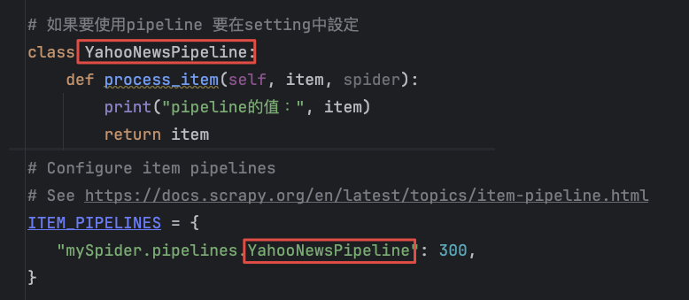

> ###### 3. 編寫pipeline.py
>
> ```python
> # 如果要使用pipeline 要在setting中設定
> class YahooNewsPipeline:
>     def process_item(self, item, spider):
>         # 可以連接資料庫...
>         print("pipeline的值：", item)
>         return item
> ```
>
> 

## 多資料保存

請求下來的資料可能裡面還會有圖片的路徑URL，需要二次請求才能獲得圖片

**混合內容的保存（文字 + 二次請求的媒體檔）**：

* **第一步（Primary Request）**：你爬了某個新聞頁面，拿到了標題、內文，還有一個 `` 的圖片連結。這時候圖片還沒被下載下來，你手上只有一串網址（字串）
* **第二步（Secondary Request）**：為了把這張圖片存到你的硬碟裡，程式必須針對這個圖片網址再次發送請求

> [!tip]
>
> **為什麼在 Scrapy 裡這叫「多資料保存」？** 因為這涉及到兩種完全不同性質的資料處理：
>
> 1. **結構化數據（文字）**：標題、日期、作者，這些通常會存進資料庫（MySQL, MongoDB）或是存成文件（CSV, JSON）
> 2. **非結構化數據（二進制檔案）**：圖片、影片、PDF，這些通常會下載後存成實體檔案放在硬碟或雲端儲存空間（如 AWS S3），然後再把**「檔案存放的路徑」**回寫到資料庫裡

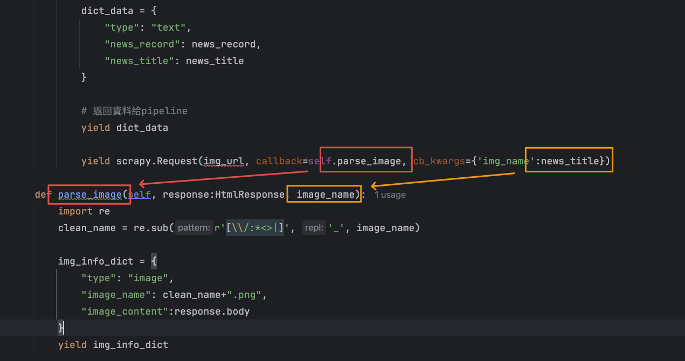

當處理圖片的操作邏輯定義好之後就可以去 pipeline.py 處理檔案的存放位置

## 翻頁請求

處理翻頁（Pagination）的邏輯主要就分為這兩大類。這取決於我們對目標網站的「網址結構」，以及我們是否知道「總頁數」

1. **方法一：根據「下一頁」按鈕遞迴抓取**

   它的運作邏輯非常直觀：程式在解析完第一頁的數據後，需要去尋找 HTML 裡有沒有「下一頁」或「Next >」這個超連結。提取該連結的網址，然後再發出一個請求（Request），並且把回調函數（callback）再次指向 `self.parse` 自己

   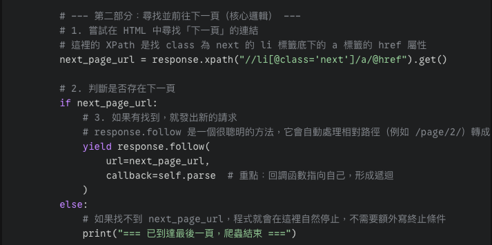

2. **方法二：利用 URL 規律構造請求(推薦、之後常用)**

   觀察到目標網站的網址非常有規律，例如 `page=1`, `page=2`, `page=3`，我們可以直接覆寫 `start_requests` 方法，並用一個簡單的迴圈，利用 Python 的 `range(1, 101)` 直接生成 100 個網址，然後一口氣把這 100 個請求全部丟給 Scrapy 

   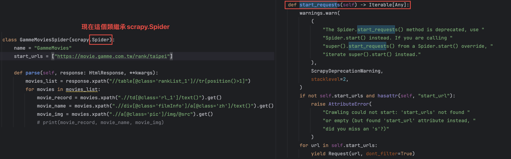

   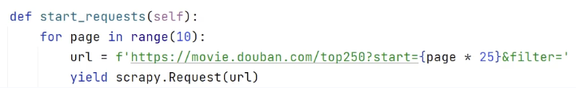

## middlewares使用

在 Scrapy 的架構中，中間件主要分為兩種(也可以自己定義)：

* **下載中間件（Downloader Middleware）常用**
* 爬蟲中間件(SpiderMiddleware)

它的位置卡在「Scrapy 引擎」和「網路下載器」之間。這意味著每一筆發出去的請求和每一筆收回來的資料都會經過它，因此可以預處理request和response對象

1. 如果響應狀態碼不是200則請求重試（重新構造Request對象返回給引擎）
2. 可以對header以及cookie進行更換和處理
3. 使用代理ip

需要知道下載中間件的三個内部方法：

* `process_request(request, spider)`
* `process_response(request, response, spider)`
* ``process_exception(request, exception, spider)``

> ###### 隨機UserAgent範例
>
> 1. 使用下載中間件定義UserAgent資訊
>
>    ```python
>    class MyspiderSetUADownloaderMiddleware:
>        USER_AGENTS_LIST = [
>            "Mozilla/5.0 (compatible; MSIE 9.0; Windows NT 6.1; Win64; x64; Trident/5.0; .NET CLR 3.5.30729; .NET CLR 3.0.30729; .NET CLR 2.0.50727; Media Center PC 6.0)",
>            "Mozilla/5.0 (compatible; MSIE 8.0; Windows NT 6.0; Trident/4.0; WOW64; Trident/4.0; SLCC2; .NET CLR 2.0.50727; .NET CLR 3.5.30729; .NET CLR 3.0.30729; .NET CLR 1.0.3705; .NET CLR 1.1.4322)",
>            "Mozilla/4.0 (compatible; MSIE 7.0b; Windows NT 5.2; .NET CLR 1.1.4322; .NET CLR 2.0.50727; InfoPath.2; .NET CLR 3.0.04506.30)",
>            "Mozilla/5.0 (Windows; U; Windows NT 5.1; zh-CN) AppleWebKit/523.15 (KHTML, like Gecko, Safari/419.3) Arora/0.3 (Change: 287 c9dfb30)",
>            "Mozilla/5.0 (X11; U; Linux; en-US) AppleWebKit/527+ (KHTML, like Gecko, Safari/419.3) Arora/0.6",
>            "Mozilla/5.0 (Windows; U; Windows NT 5.1; en-US; rv:1.8.1.2pre) Gecko/20070215 K-Ninja/2.1.1",
>            "Mozilla/5.0 (Windows; U; Windows NT 5.1; zh-CN; rv:1.9) Gecko/20080705 Firefox/3.0 Kapiko/3.0",
>            "Mozilla/5.0 (X11; Linux i686; U;) Gecko/20070322 Kazehakase/0.4.5"
>        ]
>        def process_request(self, request, spider):
>            print("這是我定義的下載中間件")
>    
>            # 隨機選擇一個User-Agent
>            import random
>            request.headers['User-Agent'] = random.choice(self.USER_AGENTS_LIST)
>            print("通過自定義中間件設置User-Agent:", request.headers['User-Agent'])
>    ```
>
> 2. 在settings.py設定下載中間件
>
>    ```python
>    # 權重數值越小，優先權越高
>    DOWNLOADER_MIDDLEWARES = {
>       "mySpider.middlewares.MyspiderDownloaderMiddleware": 543,
>       "mySpider.middlewares.MyspiderSetUADownloaderMiddleware": 544, # 添加自定義的中間件
>    }
>    ```

> ###### 配置Proxy(使用BrightData為例)
>
> 1. 建立proxy連線資訊
>
>    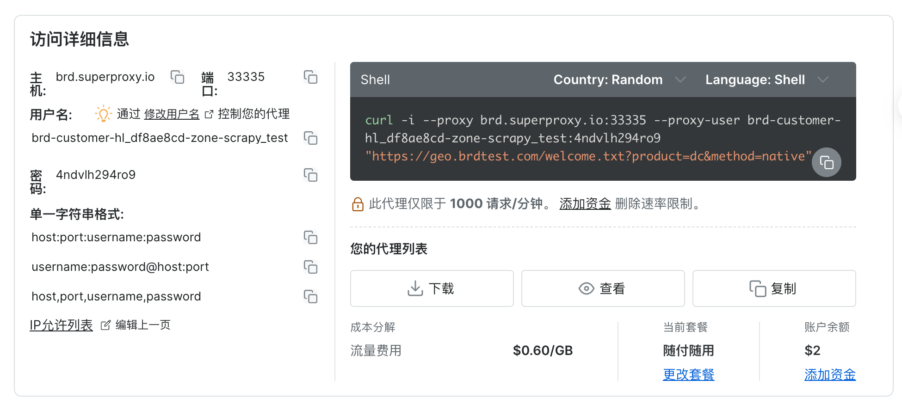
>
> 2. 修改 `middlewares.py`，建立一個proxy的下載中間件，將資訊填入下方的欄位：
>
>    ```python
>    class ProxyDownloaderMiddleware:
>        def process_request(self, request, spider):
>            username = 'brd-customer-hl_df8ae8cd-zone-scrapy_test'
>            password = '4ndvlh294ro9'
>            host_name = 'brd.superproxy.io'
>            port = 33335
>            proxy_url = f"http://{username}:{password}@{host_name}:{port}"
>            request.meta['proxy'] = proxy_url
>            # print("已設置代理伺服器:", proxy_url)
>    ```
>
> 3. 修改 `settings.py` 增加 `ProxyDownloaderMiddleware`
>
>    ```python
>    # 權重數值越小，優先權越高
>    DOWNLOADER_MIDDLEWARES = {
>       "mySpider.middlewares.MyspiderDownloaderMiddleware": 543,
>       "mySpider.middlewares.MyspiderSetUADownloaderMiddleware": 544, # 添加自定義的中間件
>        "mySpider.middlewares.ProxyDownloaderMiddleware": 545,
>    }
>    ```
>
> > [!tip]
> >
> > 如果想知道真實請求的IP位置，可以透過請求這個網站：
> >
> > ```python
> > import scrapy
> > 
> > class BrightDataExampleSpider(scrapy.Spider):
> >     name = "BrightDataExample"
> >     # 測試 IP 的網址
> >     start_urls = ['http://httpbin.org/ip'] 
> > 
> >     def parse(self, response):
> >         # 直接解析資料，完全不用管代理的事
> >         yield {
> >             'proxy_ip': response.text
> >     		}
> > ```

> ###### 動態資料使用selenium
>
> 某些網站中的資料是通過ajax動態渲染的，不能直接通過scrapy獲取到頁面渲染的資料。此時就可以通過selenium來獲取動態資料
>
> 1. 建立selenium下載中間件
>
>    ```python
>    import scrapy
>    import time
>    from scrapy import signals
>    from selenium import webdriver
>    from selenium.webdriver.support.wait import WebDriverWait
>    from selenium.webdriver.support import expected_conditions as EC
>    from selenium.webdriver.common.by import By
>    
>    class SeleniumDownloaderMiddleware:
>        def __init__(self):
>            self.browser = webdriver.Chrome()
>    
>        @classmethod
>        def from_crawler(cls, crawler):
>            # This method is used by Scrapy to create your spiders.
>            s = cls()
>            crawler.signals.connect(s.spider_closed, signal=signals.spider_closed)
>            return s
>    
>        def process_request(self, request, spider):
>            self.browser.get(request.url)
>            wait = WebDriverWait(self.browser, 10)
>            wait.until(EC.presence_of_all_elements_located((By.TAG_NAME, 'tr')))
>    
>            for i in range(1, 5):
>                # 使用 JS 滾動到頁面的 25%, 50%, 75%, 100% 處
>                position = i / 4
>                self.browser.execute_script(f"window.scrollTo(0, document.body.scrollHeight * {position});")
>    
>                # 【關鍵】每捲一次，要停下來等一下，讓網頁有時間去向伺服器要資料
>                time.sleep(1)
>    
>            # 返回渲染之後的html
>            body = self.browser.page_source
>            return scrapy.http.HtmlResponse(url=request.url, body=body, encoding='utf-8', request=request)
>    
>        def spider_closed(self, spider):
>            # 爬蟲結束時關閉瀏覽器
>            self.browser.quit()
>    ```
>
> 2. 編寫爬蟲邏輯
>
>    ```python
>    import scrapy
>    from scrapy.cmdline import execute
>    from scrapy.http import HtmlResponse
>    
>    
>    class CmcSpider(scrapy.Spider):
>        name = "cmc"
>    
>        def start_requests(self):
>            url = "https://coinmarketcap.com/zh-tw/?lang=zh-tw&page={}"
>            for page in range(1, 3):
>                yield scrapy.Request(url=url.format(page), callback=self.parse)
>        
>        def parse(self, response: HtmlResponse, **kwargs):
>            table_list = response.xpath("//table//tr[position()>1]")
>            for tr in table_list:
>                rank = tr.xpath("./td[2]//p/text()").get()
>                coin = tr.xpath("./td[3]//p/text()").get()
>                price = tr.xpath("./td[4]//text()").get()
>        
>                dict_tr = {
>                    "rank": rank,
>                    "coin": coin,
>                    "price": price,
>                }
>        
>                yield dict_tr
>    
>    if __name__ == '__main__':
>        execute("scrapy crawl cmc --nolog".split())
>    ```
>
> 3. 修改settings.py
>
>    ```python
>    DOWNLOADER_MIDDLEWARES = {
>       # "CoinMarketCap.middlewares.CoinmarketcapDownloaderMiddleware": 543,
>       "CoinMarketCap.middlewares.SeleniumDownloaderMiddleware": 543,
>    }
>    
>    ITEM_PIPELINES = {
>       "CoinMarketCap.pipelines.CoinMarketCapPipeline": 300,
>    }
>    ```

> ###### 回傳資料解密
>
> 當請求API時接受到的回傳資料有經過加密，沒有辦法直接讀取，有一下兩種方法：
>
> 1. 方法一：只要瀏覽器把網頁渲染出來了，不管它後台傳輸的數據是 AES 加密還是 RSA 加密，最終呈現在螢幕一定是**解密後的人類可讀文字**。這時候用 Selenium 絕對抓得到
>
> 2. 方法二：JS逆向，不需要下載圖片、不需要渲染介面，可以**讓消耗的資源減少並且更快速**，但是難度大
>
>    1. 編寫中間件：
>
>       ```python
>       import execjs
>       import os
>       from scrapy.http import TextResponse
>       
>       
>       
>       class EndataDownloaderMiddleware:
>           headers = {
>               'Accept': 'text/plain, */*; q=0.01',
>               'Accept-Language': 'zh-TW,zh;q=0.9,en-US;q=0.8,en;q=0.7,ja;q=0.6',
>               'Cache-Control': 'no-cache',
>               'Connection': 'keep-alive',
>               'Content-Type': 'application/x-www-form-urlencoded; charset=UTF-8',
>               'Origin': 'https://www.endata.com.cn',
>               'Pragma': 'no-cache',
>               'Sec-Fetch-Dest': 'empty',
>               'Sec-Fetch-Mode': 'cors',
>               'Sec-Fetch-Site': 'same-origin',
>               'User-Agent': 'Mozilla/5.0 (Macintosh; Intel Mac OS X 10_15_7) AppleWebKit/537.36 (KHTML, like Gecko) Chrome/142.0.0.0 Safari/537.36',
>               'X-Requested-With': 'XMLHttpRequest',
>               'sec-ch-ua': '"Chromium";v="142", "Google Chrome";v="142", "Not_A Brand";v="99"',
>               'sec-ch-ua-mobile': '?0',
>               'sec-ch-ua-platform': '"macOS"',
>           }
>       
>           def process_request(self, request, spider):
>               for key, value in self.headers.items():
>                   request.headers[key] = value
>               return None
>           def process_response(self, request, response, spider):
>               # 取得當前檔案所在目錄的絕對路徑
>               current_dir = os.path.dirname(os.path.abspath(__file__))
>               js_file_path = os.path.join(current_dir, 'utils', 'endata.js')
>       
>               with open(js_file_path, 'r', encoding='utf-8') as f:
>                   js_code = f.read()
>                   ctx = execjs.compile(js_code)
>                   decrypted_text = ctx.call('decrypt_data', response.text)
>       
>                   # 建立新的 Response 物件,因為 response.text 是唯讀的
>                   new_response = TextResponse(
>                       url=response.url,
>                       status=response.status,
>                       headers=response.headers,
>                       body=decrypted_text.encode('utf-8'),
>                       encoding='utf-8',
>                       request=request
>                   )
>                   return new_response
>       ```
>
>    2. 編寫爬蟲程式
>
>       ```python
>       import scrapy
>       from scrapy.cmdline import execute
>       from scrapy.http import HtmlResponse
>       
>       
>       class EndataSpiderSpider(scrapy.Spider):
>           name = "endata_spider"
>       
>           def start_requests(self):
>               url = 'https://www.endata.com.cn/API/GetData.ashx'
>               data = {
>                   'pageIndex': '2',
>                   'pageSize': '12',
>                   'SceneID': '2',
>                   'TagID': '',
>                   'MethodName': 'Data_ReportListNew',
>               }
>               yield scrapy.FormRequest(url=url, formdata=data)
>       
>           def parse(self, response: HtmlResponse, **kwargs):
>               yield {
>                   "decrypted_response": response.text
>               }
>       
>       if __name__ == '__main__':
>           execute("scrapy crawl endata_spider --nolog".split())
>       ```


## 實戰案例：電影排行榜

* 爬取網站：https://movie.gamme.com.tw/rank/taipei
* 需求：爬取排行榜中的名次、電影名稱、電影圖片
* 技術點：在 `parse` 方法中提取文字資料，同時發起圖片的「二次請求」，並將圖片以及文字資料分開儲存

> ###### 1. 建立爬蟲項目
>
> ```bash
> # 建立爬蟲項目
> scrapy startproject GammeMovies
> 
> # 建立爬蟲程式
> cd GammeMovies
> scrapy genspider GammeMovies https://movie.gamme.com.tw/rank/taipei
> ```
>
> 並且在settings.py檔案中關閉rebots.txt驗證
>
> ```python
> ROBOTSTXT_OBEY = False
> ```

> ###### 2. 建立爬蟲程式碼
>
> 進入到GammeMovies.py程式後，使用xpath跳過了無用的標題列，直接鎖定每一部電影的資料行，先將純文字的電影資訊 `yield` 出去，讓 Pipeline 可以先處理這些 metadata，再利用 `scrapy.Request` 發起了一個針對圖片連結的二次請求
>
> > [!caution]
> >
> > 如果圖片不能正常下載，有可能是有設定到 `allowed_domains` ，直接註解或是移除即可
> >
> > ```python
> > # 允許抓取的域名
> > allowed_domains = ["tw.news.yahoo.com"]
> > ```
>
> ```python
> import scrapy
> from scrapy.http import HtmlResponse
> from scrapy.cmdline import execute
> 
> 
> class GammeMoviesSpider(scrapy.Spider):
>     name = "GammeMovies"
>     start_urls = ["https://movie.gamme.com.tw/rank/taipei"]
> 
>     def parse(self, response: HtmlResponse, **kwargs):
>         movies_list = response.xpath("//table[@class='rankList_1']//tr[position()>1]")
>         for movies in movies_list:
>             movie_record = movies.xpath(".//td[@class='rl_1']/text()").get()
>             movie_name = movies.xpath(".//div[@class='filmInfo']/a[@class='zh']/text()").get()
>             movie_img = movies.xpath(".//a[@class='pic']/img/@src").get()
>             # print(movie_record, movie_name, movie_img)
> 
>             yield {
>                 "type": "info",
>                 "movie_record": movie_record,
>                 "movie_name": movie_name,
>                 "movie_img": movie_img,
>             }
> 
>             # 接收的response圖片為URL，需要二次請求才能得到圖片
>             yield scrapy.Request(movie_img, callback=self.parse_image, cb_kwargs={'img_name':movie_name})
> 
>     def parse_image(self, response: HtmlResponse, img_name):
>         yield {
>             "type": "image",
>             "img_name": img_name+ ".jpg",
>             "img_content": response.body
>         }
> 
> if __name__ == '__main__':
>     execute("scrapy crawl GammeMovies".split())
> ```
>
> > [!important]
> >
> > 若是網站不能訪問，可以嘗試加上請求頭相關資訊

> ###### 3. 處理資料儲存
>
> 主要承擔數據分流與持久化儲存的任務，依據資料字典中的 `type` 欄位來決定後續的處理邏輯，實現了文字與多媒體資源的自動化分離
>
> ```python
> # Define your item pipelines here
> #
> # Don't forget to add your pipeline to the ITEM_PIPELINES setting
> # See: https://docs.scrapy.org/en/latest/topics/item-pipeline.html
> 
> 
> # useful for handling different item types with a single interface
> from itemadapter import ItemAdapter
> 
> import os
> 
> # 如果要使用pipeline 要在setting中設定
> class YahooNewsPipeline:
>     def process_item(self, item, spider):
>         type_ = item.get('type')
>         if type_ == 'info':
>             # 模擬文字保存到資料庫
>             print("資料保存成功：", item)
> 
>         elif type_ == 'image':
>             # 模擬圖片保存在S3 server
>             download_path = os.getcwd()+ "/download_movie_images/"
>             if not os.path.exists(download_path):
>                 os.makedirs(download_path)
> 
>             img_name = item.get('img_name')
>             img_content = item.get('img_content')
>             with open(download_path + img_name, 'wb') as f:
>                 f.write(img_content)
>                 print("圖片保存成功：", img_name)
>         else:
>             print("操作不正常")
> 
> ```
>
> 
