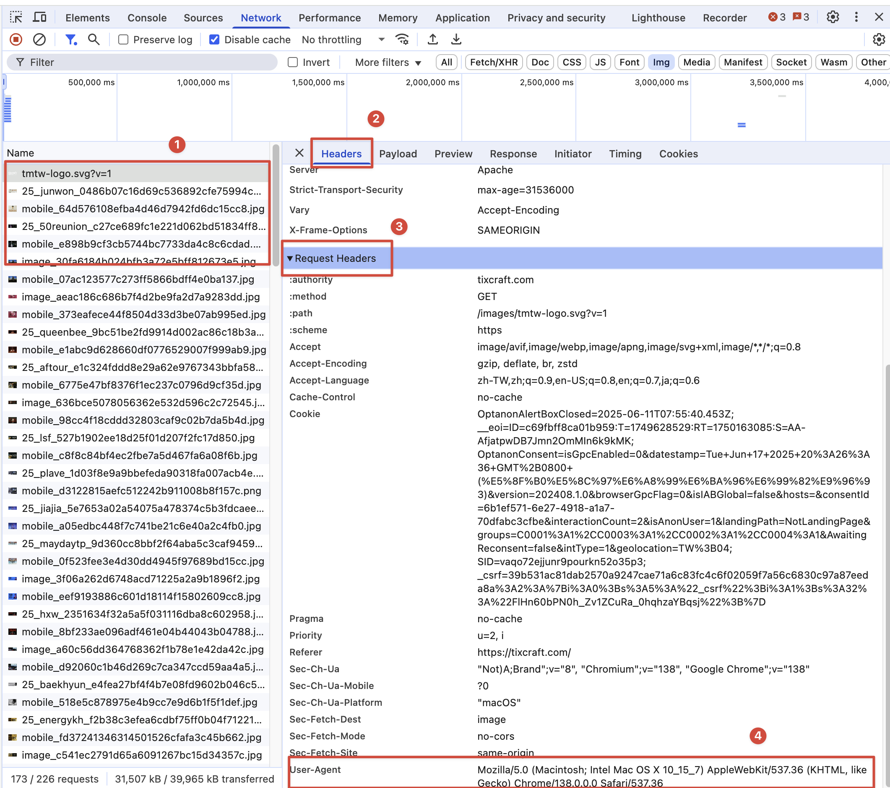

[TOC]

# 什麼是爬蟲 

**網路爬蟲（Web Crawler/Spider）** 是一種自動化程式，模擬人類瀏覽網頁的行為，系統性地訪問網站並提取所需資料

原則上，**只要是瀏覽器(客戶端)能做的事情，爬蟲都能夠做**

* **通用爬蟲**：設計用來爬取整個網際網路或大範圍網站的爬蟲，不針對特定網站或特定資料結構，像是搜尋引擎
* **自訂爬蟲**：針對特定網站、特定資料或特定需求而客製化開發的爬蟲

> **開發語言**
>
> 只要能夠傳送HTTP(S)請求的任何程式語言都是可以完成爬蟲程序的，例如：C++、java、php、JavaScript等等，但是論爬蟲開發效率一般都指的是python語言

> **爬蟲程式碼執行流程**
>
> ---
>
> > ```mermaid
> > flowchart TD
> >     A[url list]
> >     B[響應內容]
> >     C[提取數據]
> >     D[提取url]
> >     E[入庫]
> >     
> >     A --> B
> >     B --> C
> >     B --> D
> >     D --> A
> >     C --> E
> >     
> >     style A fill:#e1f5fe,stroke:#01579b,stroke-width:2px
> >     style B fill:#f3e5f5,stroke:#4a148c,stroke-width:2px
> >     style C fill:#e8f5e8,stroke:#1b5e20,stroke-width:2px
> >     style D fill:#fff3e0,stroke:#e65100,stroke-width:2px
> >     style E fill:#ffebee,stroke:#b71c1c,stroke-width:2px
> > ```
>
> > **流程說明**
> >
> > 1. 向起始地址傳送請求，並獲取響應，請求地址可能有多個，可以使用列表的資料格式
> > 2. 對響應結果進行資料提取
> > 3. 如果獲取的資料是新的網站地址則繼續傳送請求並獲取響應
> > 4. 如果獲取的資料為頁面需要的資料則完成資料保存

## HTTP與HTTPS協議


---

> **HTTP**
>
> HTTP 是一種用於在網路上傳輸超文本的應用層協定，是網際網路通訊的基礎協定
>
> - 🔓 **明文傳輸**：資料以明文形式傳送
> - 📱 **無狀態協定**：每個請求都是獨立的
> - 🚪 **預設埠號**：80
> - ⚡ **簡單快速**：協定結構簡單

> **HTTPS**
>
> HTTPS 是 HTTP 的安全版本，透過 SSL/TLS 加密協定保護資料傳輸的安全性
>
> - 🔐 **加密傳輸**：所有資料都經過加密
> - 🛡️ **身份驗證**：確認伺服器身份
> - ✅ **資料完整性**：防止資料被篡改
> - 🚪 **預設埠號**：443

我們想要給瀏覽器傳送資訊並顯示，就必須要帶上HTTP協議。HTTP協議中有一部分資料對爬蟲程序來說非常重要。分別是要求標頭與響應頭

* 請求頭：

    | 參數                 | 作用               | 範例                                            |
    | -------------------- | ------------------ | ----------------------------------------------- |
    | ==**User-Agent**==   | ==識別瀏覽器類型== | ==`Mozilla/5.0 (Windows NT 10.0; Win64; x64)`== |
    | ==**Referer**==      | ==來源頁面==       | ==`https://www.google.com/search?q=python`==    |
    | ==**Cookie**==       | ==會話狀態==       | ==`sessionid=abc123; login=true`==              |
    | **Accept**           | 接受的內容類型     | `text/html,application/json`                    |
    | **Accept-Language**  | 語言偏好           | `zh-TW,zh;q=0.9,en;q=0.8`                       |
    | **Accept-Encoding**  | 壓縮格式           | `gzip, deflate, br`                             |
    | **Authorization**    | 認證資訊           | `Bearer token123`                               |
    | **X-Requested-With** | AJAX 識別          | `XMLHttpRequest`                                |

* 響應頭：

    | 參數               | 作用            | 範例                               |
    | ------------------ | --------------- | ---------------------------------- |
    | ==**Set-Cookie**== | ==設定 Cookie== | ==`sessionid=abc123; HttpOnly`==   |
    | **Location**       | 重定向位置      | `https://www.example.com/new-page` |
    | **Content-Type**   | 內容類型        | `text/html; charset=UTF-8`         |
    | **X-RateLimit-***  | 速率限制        | `X-RateLimit-Remaining: 99`        |
    | **Cache-Control**  | 快取控制        | `max-age=3600, no-cache`           |
    | **Server**         | 伺服器資訊      | `nginx/1.18.0`                     |

> [!note]
>
> **響應狀態碼**是伺服器對客戶端請求的回應，用三位數字表示請求的處理結果。每個狀態碼都有特定的含義
>
> | 狀態碼 | 名稱                  | 含義           | 爬蟲處理建議         |
> | ------ | --------------------- | -------------- | -------------------- |
> | 200    | OK                    | 請求成功       | 正常處理資料         |
> | 301    | Moved Permanently     | 永久重定向     | 更新 URL，跟隨重定向 |
> | 302    | Found                 | 臨時重定向     | 跟隨重定向           |
> | 400    | Bad Request           | 請求格式錯誤   | 檢查請求參數         |
> | 403    | Forbidden             | 權限不足       | 檢查權限或更換帳號   |
> | 404    | Not Found             | 資源不存在     | 確認 URL 正確性      |
> | 500    | Internal Server Error | 伺服器內部錯誤 | 稍後重試             |
> | 503    | Service Unavailable   | 服務不可用     | 等待服務恢復         |

## Robots協議

**Robots 協議**（robots.txt）是網站用來告訴搜尋引擎爬 蟲哪些頁面可以抓取、哪些不能抓取的標準協議。它是一個純文字檔案

通常放在網站根目錄下：

* https://tixcraft.com/**robots.txt**
* https://www.facebook.com/**robots.txt**

*[<kbd> 拓元售票tixcraft  </kbd>](https://tixcraft.com/robots.txt)* *[<kbd> Facebook  </kbd>](https://www.facebook.com/robots.txt)*

> [!note]
>
> 在後期的Scrapy框架學習中，需要手動關閉Robots協議，因為**Scrapy 預設會遵循 Robots 協議**

# requests套件

**Requests** 是 Python 中最受歡迎的 HTTP 庫，讓發送 HTTP 請求變得簡單優雅。它被稱為「為人類設計的 HTTP 庫」

```bash
# 在終端機使用 pip 安裝
pip install requests
```


> *[<kbd> requests 官網  </kbd>](https://requests.readthedocs.io/en/latest/)*

## 發送網路請求及常用屬性


網路請求大致上分為兩大類：

* 請求：這些屬性是你**發送給伺服器**的資訊，在發送請求時設定

    ```python
    # 導入requests
    import requests
    
    # 設定url
    url = "https://google.com"
    
    # 發出請求，會回傳一個對象，所以使用一個變量接收
    response = requests.get(url)
    ```

* 響應：這些屬性是**伺服器回傳**的資訊，在收到響應後可以存取

    ```python
    print("---回應---")
    print(response)
    
    print("---回應網址---")
    print(response.url)
    print("---請求網址---")
    print(response.request.url)
    
    print("---響應頭---")
    print(response.headers)
    print("---請求頭---")
    print(response.request.headers)
    
    print("---文字內容---")
    print(response.text)
    print("---二進位內容---")
    print(response.content)
    
    print("---響應cookie---")
    print(response.cookies)
    print("---請求cookie---")
    print(response.request.header.get("cookie"))
    
    print("---狀態碼---")
    print(response.status_code)
    
    print("---使用utf8解碼內容---")
    print(response.content.decode("utf-8"))
    ```

> [!note]
>
> `response.text` 和 `response.content` 差別
>
> * response.text：
>     * **類型**：`str` (字串)
>     * **內容**：已解碼的文字
>     * **用途**：處理文字資料（HTML、JSON、XML 等）
>     * **編碼**：自動根據響應標頭解碼
> * response.content：
>     * **類型**：`bytes` (位元組)
>     * **內容**：原始二進制資料
>     * **用途**：處理任何類型資料（圖片、檔案、文字等）
>     * **編碼**：未經處理的原始資料
>
> > Encode = 編碼(轉成機器看得懂的文字) = 文字變成碼 = str → bytes 
> >
> > Decode = 解碼(轉成人看得懂的文字) = 碼變成文字 = bytes → str
> > 
> >
> > 📖 讀取檔案時：需要 decode (碼→文字)
> >
> >  💾 儲存檔案時：需要 encode (文字→碼)

> ###### 練習-下載網路圖片
>
> **需求**：將網頁圖片下載到電腦
>
> 1. 找到圖片的url地址
> 2. 利用requests模組傳送請求並獲取響應
> 3. 使用二進制寫入的方式打開檔案並將response響應內容寫入檔案內
>
> ```python
> import requests
> 
> url = "https://static.tixcraft.com/images/banner/mobile_d3122815aefc512242b911008b8f157c.png"
> 
> response = requests.get(url)
> 
> with open("download.png", "wb") as f:
>     f.write(response.content)
> ```
>
> |  模式   |   全名    | 中文說明 |            用途            |
> | :-----: | :-------: | :------: | :------------------------: |
> | **`r`** |   Read    |   讀取   |        讀取文字檔案        |
> | **`w`** |   Write   |   寫入   |    寫入文字檔案（覆蓋）    |
> | **`a`** |  Append   |   附加   |     在檔案末尾添加內容     |
> | **`x`** | Exclusive |   獨占   | 創建新檔案（檔案不存在時） |

## iter_content()方法

==把大檔案切成小塊，一塊一塊地處理==

requests 庫中的一個方法，用於**分塊讀取響應內容**，而不是一次性載入全部資料到記憶體中

|         參數         | 類型 | 預設值 |        說明        |
| :------------------: | :--: | :----: | :----------------: |
|   **`chunk_size`**   | int  |   1    | 每次讀取的位元組數 |
| **`decode_unicode`** | bool | False  |  是否解碼 Unicode  |

1. 在獲取資料時，設定屬性`stream=True`，告訴 requests **不要立即下載完整的響應內容**，而是建立一個**串流連接**，讓你可以**按需讀取**資料

    ```python
    r = requests.get(url, stream=True)
    ```

    > [!note]
    >
    > `stream=True` 會讓響應變成**類似生成器的行為**，但更準確地說是變成一個**可迭代的串流物件**

2. 使用iter_content()方法

    ```python
    with open('test.html', 'wb') as f:
        for chunk in r.iter_content(chunk_size=100):
            f.write(chunk)
    ```

> [!note]
>
> 若是想要知道資源下載的進度可以導入 `tqdm` 套件 `pip install tqdm`
>
> | 參數             | 類型     | 預設值 | 說明         |
> | ---------------- | -------- | ------ | ------------ |
> | **`total`**      | int      | None   | 總項目數量   |
> | **`unit`**       | str      | 'it'   | 單位名稱     |
> | **`unit_scale`** | bool/int | False  | 自動縮放單位 |

```python
import requests
from tqdm import tqdm


url = "https://static.tixcraft.com/images/banner/mobile_d3122815aefc512242b911008b8f157c.png"

response = requests.get(url, stream=True)

# 獲得檔案大小
total_size = int(response.headers.get("Content-Length", 0))

# 下載檔案
with open("download.png", "wb") as f, tqdm(total=total_size, unit="B", unit_scale=True, unit_divisor=1024) as bar:
    for chunk in response.iter_content(chunk_size=1024):
        if chunk: # 要判斷chunk是否為空
            f.write(chunk)
            bar.update(len(chunk))  
```


## 攜帶請求頭

**請求頭 (Request Headers)** 是 HTTP 請求中的**元資料**，在請求某些網址時根據不同的瀏覽器會返回不同的響應內容

### 查看瀏覽器的請求頭

*^tab^*

> **打開開發人員工具**
>
> 建議使用**google chrome**瀏覽器
>
> * **Windows**：鍵盤按F12或是Cmd + Shift + I
> * **Mac**：Cmd + Option + I
>
> 

> **查看請求頭資訊**
>
> 1. 選擇Network(網路)
>
>     
>
> 2. 任意點擊一個請求資訊，就可以看到當前的請求頭資訊
>
>     

### 自定義User-Agent

==為了讓伺服器認為你是真實的瀏覽器用戶，而不是爬蟲機器人，避免被封鎖或拒絕訪問==

 有些網站請求的時候會驗證請求頭，如果請求頭不符合預期或缺少關鍵資訊，伺服器會拒絕請求並返回 403 Forbidden、401 Unauthorized 或其他錯誤狀態碼，這是網站防止爬蟲和惡意請求的重要安全機制

```python
import requests

url = "https://google.com"

headers = {
    "User-Agent": "Mozilla/5.0 (Windows NT 10.0; Win64; x64) AppleWebKit/537.36 (KHTML, like Gecko) Chrome/120.0.0.0 Safari/537.36"
}

# 一定要指定參數headers 不可以只些headers
response = requests.get(url, headers=headers)

# 請求頭資訊
print(response.request.headers)

# 響應內容
print(response.text)
```

> [!caution]
>
> 一定要寫 `headers=headers`，因為他是關鍵字參數

## 攜帶參數請求

發送 HTTP 請求時，除了基本的 URL 之外，還需要傳遞額外的數據參數給伺服器，這些參數可以通過不同的方式攜帶，如 URL 查詢參數

在使用google查詢的時候會看到url地址中會有一個?，問號後邊的就是請求參數，又叫做**查詢字符串**


```python
import requests

url = "https://google.com/search"

headers = {
    "User-Agent": "Mozilla/5.0 (Windows NT 10.0; Win64; x64) AppleWebKit/537.36 (KHTML, like Gecko) Chrome/120.0.0.0 Safari/537.36"
}

# 1. 設定需要攜帶的查詢字串參數
params = {
    "q": "llama4"
}

# 2. 傳送請求
response = requests.get(url, headers=headers, params=params)

print(response.url)

"""
https://www.google.com/search?q=llama4
"""
```

>[!note]
>
>使用requests庫攜帶參數請求不需再加上?，他會自己處理url

## 傳送post請求

現在很多網站大量使用 POST 請求來獲取資訊，在獲得資訊前會先驗證請求頭是否正確攜帶相對應的資料，這是一種重要的安全防禦策略，主要目的是防止爬蟲、CSRF 攻擊

|       特徵       |      GET 請求      |       POST 請求       |
| :--------------: | :----------------: | :-------------------: |
|   **主要用途**   | 獲取資源、查詢數據 |  提交數據、修改資源   |
| **數據傳送位置** |   URL 查詢字符串   | 請求體 (Request Body) |
|    **可見性**    | 參數在 URL 中可見  |  參數隱藏在請求體中   |
|    **安全性**    |  較低（參數暴露）  |   較高（參數隱藏）    |

> [!caution]
>
> 如果使用post請求沒有正確攜帶參數，伺服器就不會響應資料

練習網址：*[<kbd> 股票資訊網站  </kbd>](http://www.cninfo.com.cn/new/commonUrl?url=disclosure/list/notice#szse)*


獲取表格中的所有資料分析過程：

1. 先判斷網站是靜態網站還是動態網站，並通過瀏覽器開發者工具獲取當前網站資料API

    | 特徵         | 靜態網站             | 動態網站                   |
    | ------------ | -------------------- | -------------------------- |
    | **內容更新** | 需要手動修改檔案     | 自動更新（如新聞、商品）   |
    | **用戶互動** | 有限（僅基本表單）   | 豐富（登入、評論、購物車） |
    | **個人化**   | 所有用戶看到相同內容 | 根據用戶顯示不同內容       |
    | **資料庫**   | 通常不需要           | 需要資料庫支援             |

    

2. 查詢payload選項中的表單資料

    

3. 建構表單資料，並傳送post請求取的資料

    ```python
    import requests
    
    url = 'http://www.cninfo.com.cn/new/disclosure'
    headers = {
        'User-Agent': 'Mozilla/5.0 (Windows NT 10.0; Win64; x64) AppleWebKit/537.36 (KHTML, like Gecko) Chrome/104.0.0.0 Safari/537.36'
    }
    data = {
        'column':'szse_latest',
        'pageNum':'2',
        'pageSize':'30',
        'sortName':'',
        'sortType':'',
        'clusterFlag':'true',
    }
    
    response = requests.post(url, headers=headers, data=data)
    print(response.json())
    ```

> [!note]
>
> API返回的資料基本上都是 資料(JSON、XML)

## cookie處理

為了能夠通過爬蟲獲取到登錄後的頁面，或者是解決通過cookie的反爬，需要使用request來處理cookie相關的請求

有兩種方式添加cookie：

*^tab^*

> **1. 放在headers中**
>
> 1. 打開開發人員工具找到google，點選網路Netowrk
>
>     
>
> 2. 找到網頁的請求頭，就可以看到cookie值
>
>     
>
> 3. 將cookie值複製到python程式中
>
> ```python
> import requests
> 
> url = "http://www.google.com"
> 
> headers = {
>     'User-Agent': 'Mozilla/5.0 (Windows NT 10.0; Win64; x64) AppleWebKit/537.36 (KHTML, like Gecko) Chrome/104.0.0.0 Safari/537.36',
>     'cookie': "S=billing-ui-v3=8uaJPtQU1CLOg3_rm6goljzA_rbbn4HO:billing-ui-v3-efe=8uaJPtQU1CLOg3_rm6goljzA_rbbn4HO; SEARCH_SAMESITE=CgQIhJ4B; OTZ=8128413_24_24__24_; SID=g.a000yQhQ8ht7d0EDAljvdwStmTaUM4tH9JpcHvD7liROhLyHDyDY1M1Q3T7mLy9fov7e1f7QCAACgYKAWUSARMSFQHGX2Mim6p8kMzAal8HavTbFG9iuhoVAUF8yKoPVZwoQBpsrXY75JNU6ldG0076; __Secure-1PSID=g.a000yQhQ8ht7d0EDAljvdwStmTaUM4tH9JpcHvD7liROhLyHDyDYx8QHvEtX2CMTGLpOflwPiwACgYKAbMSARMSFQHGX2Mi5MkimsLbIrWMI3p0SPzWkhoVAUF8yKoJpaKzKMqM6KSxvWuTOCeK0076; __Secure-3PSID=g.a000yQhQ8ht7d0EDAljvdwStmTaUM4tH9JpcHvD7liROhLyHDyDYBrVh3FFq1KP5X_BEtu8uEAACgYKARgSARMSFQHGX2MiUgH7jxuvx7EFShTc0fuKxBoVAUF8yKp4iwWZDHLyGE_8kytq3XgE0076; HSID=AekkORrSmj5AfVnjq; SSID=AvwpzoU7MsOEdeQDb; APISID=Q3GJaPYzTN6X8sai/A8imJ47ZzSVNF4Mtv; SAPISID=HIVaOdoQ2ipPYl0e/A_-gUkcxMUCGjNv7k; __Secure-1PAPISID=HIVaOdoQ2ipPYl0e/A_-gUkcxMUCGjNv7k; __Secure-3PAPISID=HIVaOdoQ2ipPYl0e/A_-gUkcxMUCGjNv7k; AEC=AVh_V2hO53wgEkM_ZdLE7H7g2XFavuC2Ct2ZZ-nuXcvyT9bZd5I10bKY0Q; 
> }
> 
> response = requests.get(url)
> print(response.status_code)
> print(response.text)
> ```

> **2. 建立cookie字典(推薦)**
>
> 1. 打開開發人員工具找到google的這個請求，滑鼠右鍵
>
>     
>
> 2. 選擇Copy -> Copy as cURL
>
>     
>
> 3. 找一個爬蟲工具將複製下來的cURL轉換成字典格式，例如*[<kbd> 爬蟲工具  </kbd>](https://spidertools.cn/#/)*
>
>     
>
> 4. 將cookie值複製到python程式中
>
> ```python
> import requests
> 
> url = "http://www.google.com"
> 
> 
> headers = {
>     'User-Agent': 'Mozilla/5.0 (Windows NT 10.0; Win64; x64) AppleWebKit/537.36 (KHTML, like Gecko) Chrome/104.0.0.0 Safari/537.36'
> }
> 
> # 建立cookie字典
> cookies = {
>     "S": "billing-ui-v3=8uaJPtQU1CLOg3_rm6goljzA_rbbn4HO:billing-ui-v3-efe=8uaJPtQU1CLOg3_rm6goljzA_rbbn4HO",
>     "SEARCH_SAMESITE": "CgQIhJ4B",
>     "OTZ": "8128413_24_24__24_",
>     "SID": "g.a000yQhQ8ht7d0EDAljvdwStmTaUM4tH9JpcHvD7liROhLyHDyDY1M1Q3T7mLy9fov7e1f7QCAACgYKAWUSARMSFQHGX2Mim6p8kMzAal8HavTbFG9iuhoVAUF8yKoPVZwoQBpsrXY75JNU6ldG0076",
>     "__Secure-1PSID": "g.a000yQhQ8ht7d0EDAljvdwStmTaUM4tH9JpcHvD7liROhLyHDyDYx8QHvEtX2CMTGLpOflwPiwACgYKAbMSARMSFQHGX2Mi5MkimsLbIrWMI3p0SPzWkhoVAUF8yKoJpaKzKMqM6KSxvWuTOCeK0076",
>     "__Secure-3PSID": "g.a000yQhQ8ht7d0EDAljvdwStmTaUM4tH9JpcHvD7liROhLyHDyDYBrVh3FFq1KP5X_BEtu8uEAACgYKARgSARMSFQHGX2MiUgH7jxuvx7EFShTc0fuKxBoVAUF8yKp4iwWZDHLyGE_8kytq3XgE0076",
>     "HSID": "AekkORrSmj5AfVnjq",
>     "SSID": "AvwpzoU7MsOEdeQDb",
>     "APISID": "Q3GJaPYzTN6X8sai/A8imJ47ZzSVNF4Mtv",
>     "SAPISID": "HIVaOdoQ2ipPYl0e/A_-gUkcxMUCGjNv7k",
>     "__Secure-1PAPISID": "HIVaOdoQ2ipPYl0e/A_-gUkcxMUCGjNv7k",
>     "__Secure-3PAPISID": "HIVaOdoQ2ipPYl0e/A_-gUkcxMUCGjNv7k",
>     "AEC": "AVh_V2hO53wgEkM_ZdLE7H7g2XFavuC2Ct2ZZ-nuXcvyT9bZd5I10bKY0Q",
> }
> 
> response = requests.get(url, headers=headers, cookies=cookies)
> 
> print(response.status_code)
> print(response.text)
> ```

## 重定向與歷史請求

當我們訪問一個網站的時候伺服器告訴瀏覽器「這個頁面已經搬到別的地方了，請到新地址去找」，此時網頁就會重定向到新的網站，requests庫默認也是如此，可以設置`requests.get(url, allow_redirects=False)` 取消網頁自動重定向

可以通過 `response.history` 可以獲取到請求的歷史記錄

```python
import requests

headers = {
    "User-Agent": "Mozilla/5.0 (iPhone; CPU iPhone OS 13_2_3 like Mac OS X) AppleWebKit/605.1.15 (KHTML, like Gecko) Version/13.0.3 Mobile/15E148 Safari/604.1"
}

response = requests.get("http://www.360buy.com", headers=headers)

print("歷史請求過程資訊：")
print(response.history)
for one_info in response.history:
    print(one_info.status_code, one_info.url, one_info.headers)

print("\n\n最後一次的請求資訊：")
print(response.status_code, response.url, response.headers)
```

## SSL證書問題


在瀏覽網頁時，可能會遇到這種狀況，出現這個問題的原因是：SSL證書不安全導致的，若是在爬蟲遇到這個狀況他就會直接報錯


必須要在程式碼當中設置 `verify=False` 參數：

```python
import requests

url = "https://google.com"
response = requests.get(url, verify=False)
print(response.text)
```

## 請求超時重試

在爬蟲中，一個請求很久沒有結果，就會讓整個項目的效率變得非常低。這個時候我們就需要對請求進行強制要求，讓他必須在特定的時間內返回結果，否則就報錯，當然後續也可以捕獲這個錯誤

可以設定 `timeout` 參數：

```python
import requests
from requests.exceptions import ConnectTimeout

url = "https://www.google.com"

try:
    response = requests.get(url=url, timeout=1)
except ConnectTimeout:
    print("請求超時")
```

> [!note]
>
> 這個方法還能夠拿來檢測代理ip品質，如果一個代理ip在很長時間沒有響應，那麼新增超時之後也會報錯，對應的這個ip就可以從代理ip池中刪除

我們可以在請求超時的時候使用**retying庫**設置最大嘗試次數，即使失敗或是連線超時一次也不會造成程式中斷或是無法連接的狀況

安裝retrying庫：

```bash
pip install retrying
```

使用方法：

1. 使用`retrying` 包提供的 `retry` 模組
2. 通過裝飾器的方式使用，讓被裝飾的函數反覆執行
3. `retry` 中可以傳入參數 `stop_max_attempt_number` 讓函數報錯後繼續重新執行，達到最大執行次數的上限，如果每次都報錯，整個函數報錯，如果中間有一個成功，程序繼續往後執行

```python
from retrying import retry
import requests

num = 1

# 定義一個函數，如果請求超時，則重試
@retry(stop_max_attempt_number=3)
def get_url():
    global num
    
    print(f"第{num}次請求")
    num += 1
    
    url = "https://www.google.com"
    response = requests.get(url=url, timeout=3)
    return response.status_code

print(get_url())
```

> [!note]
>
> `retry` 搭配 `try-except` 使用的時候，要用 `raise`  主動重新拋出異常，觸發重試，不然可能會沒有效果

## 攜帶JSON資料

在發送post請求的時候，需要向伺服器提交資料，提交的資料大致上分為兩種：

* **表單 (Form Data)**：本質上是**字典**，使用 `requests.post` 中的 `data` 參數進行提交

* **請求負載Payload** ：本質上是**字符串**，使用 `requests.post` 中的 `json` 參數進行提交

    

```python
import requests

url = 'https://careers.aliyun.com/position/search'

headers = {
    "User-Agent": "Mozilla/5.0 (Macintosh; Intel Mac OS X 10_15_7) AppleWebKit/537.36 (KHTML, like Gecko) Chrome/138.0.0.0 Safari/537.36",
    "Cookie": "aliyun_choice=intl; aliyun_country=TW; cna=7LvVIJlDSlcCASTmYlHS2x5V; notice_behavior=none; isg=BNraNjXeZrekieo32S9HA2rtK4b8C17lL4PJIeRUUG1hV3GR-5h99HTkIitL49Z9; tfstk=g7jK572R6RHLXgSpI9ziZnSF0W2GYPXU56WjqQAnP1COnT7HEWyFyL1cELTC-Tv7eCCJq90HKaQON18HOz73e8Chs6AQ9H6W29fO-UAkA8ERFt1JzJRkNQClFw2gmoXFL385eSq0mdu_dL1KdDgQFd9vdRvBARAtW3-7i5vqX5Zp46wPcLXI5dOweLGIR_i61Kd6F2t5NCT6hKcBV_1Wfl9yeXiWNpO_BLR6N3t5NOw9ECOS1qmwazOm2Zq1eNbEybcIOGppJQiH-0LVqmYkG9Otr4vMpbOfdC3SrIQUdy65N7nkcZ5O2E102c-hHNt6pNeS5BTAR6vNwonBOGBCABjQsDACYO_cq1wSVQQ1lU_fd509BN6hXFjbM0LF5672ygVg0Hbcng8fAkh2sEJRMH_T1DCf4nscDetniIpoRRetz4-BQ0A3ihVeBCRXBI2GO4uyWqJ9iRUEz48BQdd0Ih0rzF3V.; aliyun_site=INTL; aliyun_lang=zh-TW; _rb_id=641dd743243a4db19fa065de6f8d9c53; XSRF-TOKEN=98b643d2-f691-40f7-8852-565e6069110f; prefered-lang=zh; SESSION=MUI4QTgxM0YyOTk2MEI0NTNCOEQ5MEVDMkQxRDlBOTQ="
}

data = {"channel":"group_official_site","language":"zh","batchId":"","categories":"","deptCodes":[],"key":"","pageIndex":1,"pageSize":10,"regions":"","subCategories":""}

params = {
    "_csrf": "98b643d2-f691-40f7-8852-565e6069110f"
}

response = requests.post(url, headers=headers, json=data, params=params).json()
print(response)
```

## Session會話

在網頁爬取過程中，我們經常遇到需要登錄驗證的情況：


傳統方式的問題：

- 需要手動提取 `requests.utils.dict_from_cookiejar(r.cookies)`
- 每次請求都要手動攜帶 Cookie
- 代碼複雜，容易出錯

Session 提供了一個優雅的解決方案，能夠**跨請求保持參數**，在同一個 Session 實例的所有請求之間自動管理狀態

session對象在請求了一個網站後，對方伺服器設定在本地的cookie會保存在session對象中，下一次再使用session對象請求對方伺服器的時候，會自動帶上前一次的cookie

| 特性         | Cookie                    | Session              |
| ------------ | ------------------------- | -------------------- |
| **存儲位置** | 客戶端瀏覽器              | 伺服器端             |
| **安全性**   | ⚠️ 較低，可被用戶查看/修改 | ✅ 較高，存儲在伺服器 |
| **存儲容量** | 限制 4KB                  | 理論上無限制         |
| **生命週期** | 可設定過期時間            | 通常瀏覽器關閉後失效 |
| **網路傳輸** | 每次請求都會傳送          | 只傳送 Session ID    |


```python
import requests

url = "https://www.google.com"

headers = {
    "User-Agent": "Mozilla/5.0 (Macintosh; Intel Mac OS X 10_15_7) AppleWebKit/537.36 (KHTML, like Gecko) Chrome/138.0.0.0 Safari/537.36"
}

session = requests.Session()

response = session.get(url, headers=headers)
print("第一次請求成功的請求頭", response.request.headers)
print("第一次請求成功的回應頭", response.headers)
print("-"*50)

response = session.get(url, headers=headers)
print("第二次請求成功的請求頭", response.request.headers)
print("第二次請求成功的回應頭", response.headers)

"""
第一次請求成功的請求頭 {'User-Agent': 'Mozilla/5.0 (Macintosh; Intel Mac OS X 10_15_7) AppleWebKit/537.36 (KHTML, like Gecko) Chrome/138.0.0.0 Safari/537.36', 'Accept-Encoding': 'gzip, deflate', 'Accept': '*/*', 'Connection': 'keep-alive'}
第一次請求成功的回應頭 {'Date': 'Fri, 18 Jul 2025 11:32:42 GMT', 'Expires': '-1', 'Cache-Control': 'private, max-age=0', 'Content-Type': 'text/html; charset=UTF-8', 'Strict-Transport-Security': 'max-age=31536000', 'Content-Security-Policy-Report-Only': "object-src 'none';base-uri 'self';script-src 'nonce-mn1jEgCorvD-27X98QRIKA' 'strict-dynamic' 'report-sample' 'unsafe-eval' 'unsafe-inline' https: http:;report-uri https://csp.withgoogle.com/csp/gws/other-hp", 'Cross-Origin-Opener-Policy': 'same-origin-allow-popups; report-to="gws"', 'Report-To': '{"group":"gws","max_age":2592000,"endpoints":[{"url":"https://csp.withgoogle.com/csp/report-to/gws/other"}]}', 'Accept-CH': 'Sec-CH-Prefers-Color-Scheme, Downlink, RTT, Sec-CH-UA-Form-Factors, Sec-CH-UA-Platform, Sec-CH-UA-Platform-Version, Sec-CH-UA-Full-Version, Sec-CH-UA-Arch, Sec-CH-UA-Model, Sec-CH-UA-Bitness, Sec-CH-UA-Full-Version-List, Sec-CH-UA-WoW64', 'Permissions-Policy': 'unload=()', 'P3P': 'CP="This is not a P3P policy! See g.co/p3phelp for more info."', 'Content-Encoding': 'gzip', 'Server': 'gws', 'X-XSS-Protection': '0', 'X-Frame-Options': 'SAMEORIGIN', 'Set-Cookie': 'AEC=AVh_V2jWa7zdE-lQViaYUPUPk4sXi33-OmskGHAo_f6g5y4WDXuHRh78Z5c; expires=Wed, 14-Jan-2026 11:32:42 GMT; path=/; domain=.google.com; Secure; HttpOnly; SameSite=lax, NID=525=Zh6XJKXXXl6O4G3Q8qEyfdTRGtigqUeGHeDmKNP9IE7C2aXoFUozArhADYGtRLB6DlxHxy6Q-iiSFsn49EdZqKDRqrcm8TjNnWtw6OC3bpxMUhH6ajstZSdgTbVYNipQlFzEq8mkGhlRQbkh3kD3bnlUs9T1CbtzN_v95rmgtYo_UCqw1gHC_roajC9ZznxdrVe9KaIVdsGLrQ1Xjg; expires=Sat, 17-Jan-2026 11:32:42 GMT; path=/; domain=.google.com; Secure; HttpOnly; SameSite=none', 'Alt-Svc': 'h3=":443"; ma=2592000,h3-29=":443"; ma=2592000', 'Transfer-Encoding': 'chunked'}
--------------------------------------------------
第二次請求成功的請求頭 {'User-Agent': 'Mozilla/5.0 (Macintosh; Intel Mac OS X 10_15_7) AppleWebKit/537.36 (KHTML, like Gecko) Chrome/138.0.0.0 Safari/537.36', 'Accept-Encoding': 'gzip, deflate', 'Accept': '*/*', 'Connection': 'keep-alive', 'Cookie': 'AEC=AVh_V2jWa7zdE-lQViaYUPUPk4sXi33-OmskGHAo_f6g5y4WDXuHRh78Z5c; NID=525=Zh6XJKXXXl6O4G3Q8qEyfdTRGtigqUeGHeDmKNP9IE7C2aXoFUozArhADYGtRLB6DlxHxy6Q-iiSFsn49EdZqKDRqrcm8TjNnWtw6OC3bpxMUhH6ajstZSdgTbVYNipQlFzEq8mkGhlRQbkh3kD3bnlUs9T1CbtzN_v95rmgtYo_UCqw1gHC_roajC9ZznxdrVe9KaIVdsGLrQ1Xjg'}
第二次請求成功的回應頭 {'Date': 'Fri, 18 Jul 2025 11:32:43 GMT', 'Expires': '-1', 'Cache-Control': 'private, max-age=0', 'Content-Type': 'text/html; charset=UTF-8', 'Content-Security-Policy-Report-Only': "object-src 'none';base-uri 'self';script-src 'nonce-C4R1_a1F1Vr7o_E6fdg_0Q' 'strict-dynamic' 'report-sample' 'unsafe-eval' 'unsafe-inline' https: http:;report-uri https://csp.withgoogle.com/csp/gws/other-hp", 'Cross-Origin-Opener-Policy': 'same-origin-allow-popups; report-to="gws"', 'Report-To': '{"group":"gws","max_age":2592000,"endpoints":[{"url":"https://csp.withgoogle.com/csp/report-to/gws/other"}]}', 'Accept-CH': 'Sec-CH-Prefers-Color-Scheme, Downlink, RTT, Sec-CH-UA-Form-Factors, Sec-CH-UA-Platform, Sec-CH-UA-Platform-Version, Sec-CH-UA-Full-Version, Sec-CH-UA-Arch, Sec-CH-UA-Model, Sec-CH-UA-Bitness, Sec-CH-UA-Full-Version-List, Sec-CH-UA-WoW64', 'Permissions-Policy': 'unload=()', 'Content-Encoding': 'gzip', 'Server': 'gws', 'X-XSS-Protection': '0', 'X-Frame-Options': 'SAMEORIGIN', 'Alt-Svc': 'h3=":443"; ma=2592000,h3-29=":443"; ma=2592000', 'Transfer-Encoding': 'chunked'}
"""
```

# 資料提取

在爬蟲爬取的資料中有很多不同類型的資料，我們需要瞭解資料的不同類型來規律的提取和解析資料

- 結構化資料：`json`、`xml` 

    - 處理方式：直接轉化為 `python` 資料類型

    

    

- 非結構化資料：`HTML` 

    - 處理方式：正規表示式、`xpath`、`bs4`

    

> [!note]
>
> **什麼是JSON**
>
> `JSON(JavaScript Object Notation)` 是一種輕量級的資料交換格式，讓我們很容易的進行閱讀和編寫，同時也方便了機器進行解析和生成，適用於進行資料互動的場景，比如網站前端與後端之間的資料互動
>
> ```mermaid
> graph LR
>     A["JSON字符串"] -->|"json.loads()"| B["Python數據類型"]
>     B -->|"json.dumps()"| A
>     
>     style A fill:#e1f5fe,stroke:#01579b,stroke-width:2px
>     style B fill:#f3e5f5,stroke:#4a148c,stroke-width:2px
> ```
>

## xpath語法

**XPath（XML Path Language）** 是一種用於在 XML 和 HTML 文檔中定位和選擇節點的查詢語言。它使用類似文件系統路徑的語法來導航文檔結構，所以在之後的靜態網站資料提取中會經常使用xpath語法完成


> [!note]
>
> 推薦好用的輔助工具，可以在Chrome商店下載
>
> *[<kbd> xpath測試器  </kbd>](https://chromewebstore.google.com/detail/xpath-%E6%B8%AC%E8%A9%A6%E5%99%A8/cneomjecgakdfoeehmmmoiklncdiodmh)*

---

> **語法規則**
>
> | 表達式   | 描述                                                     |
> | -------- | -------------------------------------------------------- |
> | nodename | 選中該元素                                               |
> | /        | 從根節點選取、或者是元素和元素間的過濾                   |
> | //       | 從匹配選擇的當前節點選擇文檔中的節點，而不考慮它們的位置 |
> | .        | 選取當前節點                                             |
> | ..       | 選取當前節點的父節點                                     |
> | @        | 選取屬性                                                 |
> | text()   | 選取文本                                                 |

> **路徑表達式**
>
> | 路徑表達式          | 結果                                                         |
> | ------------------- | ------------------------------------------------------------ |
> | /bookstore          | 選取根元素 bookstore。注釋：假如路徑起始於正斜槓(/)，則此路徑始終代表到某元素的絕對路徑 |
> | bookstore/book      | 選取屬於 bookstore 之下的所有 book 元素                      |
> | //book              | 選取所有 book 子元素，而不管它們在文檔中的位置               |
> | bookstore//book     | 選擇屬於 bookstore 元素的後代的所有 book 元素，而不管它們位於 bookstore 之下的什麼位置 |
> | //book/title/@lang  | 選擇所有的 book 下面的 title 中的 lang 屬性的值              |
> | //book/title/text() | 選擇所有的 book 下面的 title 的文本                          |

> **查詢特定節點**
>
> | 路徑表達式                                     | 結果                                                         |
> | ---------------------------------------------- | ------------------------------------------------------------ |
> | //title[@lang="eng"]                           | 選擇 lang 屬性值為 eng 的所有 title 元素                     |
> | /bookstore/book[1]                             | 選取屬於 bookstore 子元素的第 1 個 book 元素                 |
> | /bookstore/book[last()]                        | 選取屬於 bookstore 子元素的最後 1 個 book 元素               |
> | /bookstore/book[last()-1]                      | 選取屬於 bookstore 子元素的倒數第 2 個 book 元素             |
> | /bookstore/book[position()>1]                  | 選擇 bookstore 下面的 book 元素，從第 2 個開始選擇           |
> | /bookstore/book[position()>1 and position()<4] | 選擇 bookstore 下面的 book 元素，從第 2 個開始取到第 4 個元素 |
> | //book/title[text()='Harry Potter']            | 選擇所有 book 下的 title 元素，僅僅選擇文本為 Harry Potter 的 title 元素 |
>
> > [!caution]
> >
> > 在xpath中，第一個元素的位置是1，最後一個元素的位置是last()，倒數第二個是last()-1

## lxml模組中的xpath語法

**lxml** 是 Python 中一個功能強大的 XML 和 HTML 處理庫，主要用於解析、操作和生成 XML/HTML 文檔

需要先安裝套件：

```bash
pip install lxml
```

使用步驟：

1. 使用lxml轉化為Element對象
2. 使用lxml中的xpath語法提取資料
3. 處理數據結果

練習：爬取國賓影城現在熱映的電影名稱及圖片

```python
import requests
from lxml import etree

url = "https://www.ambassador.com.tw/home/MovieList?Type=1"

headers = {
    "User-Agent": "Mozilla/5.0 (Windows NT 10.0; Win64; x64) AppleWebKit/537.36 (KHTML, like Gecko) Chrome/125.0.0.0 Safari/537.36"
}

response = requests.get(url, headers=headers).text
tree = etree.HTML(response)

movie_name_list = tree.xpath('//div[@class="cell"]//a/text()')
movie_pic_list = tree.xpath('//div[@class="cell"]//img/@src')

for movie_name, movie_pic in zip(movie_name_list, movie_pic_list):
    movie = {}
    movie['movie_name'] = movie_name
    movie['movie_pic'] = movie_pic
    print(movie)
    
"""
{'movie_name': '全知讀者視角', 'movie_pic': 'https://www.ambassador.com.tw/assets/img/movies/OmniscientReader_180x270_Poster.jpg'}
{'movie_name': '驚奇4超人：第一步', 'movie_pic': 'https://www.ambassador.com.tw/assets/img/movies/TheFantasticFourFirstSteps_180x270_Poster.jpg'}
{'movie_name': '電影哆啦A夢：大雄的繪畫世界物語', 'movie_pic': 'https://www.ambassador.com.tw/assets/img/movies/DORAEMONTHEMOVIENOBITASARTWORLDTALE_180x270_Poster.jpg'}
{'movie_name': '地球特派員', 'movie_pic': 'https://www.ambassador.com.tw/assets/img/movies/ELIO_180x270_Poster.jpg'}
{'movie_name': '超人', 'movie_pic': 'https://www.ambassador.com.tw/assets/img/movies/SUPERMAN_180x270_Poster.jpg'}
{'movie_name': '侏羅紀世界：重生', 'movie_pic': 'https://www.ambassador.com.tw/assets/img/movies/JURASSICWORLDREBIRTH_180x270_Poster.jpg'}
{'movie_name': 'F1電影', 'movie_pic': 'https://www.ambassador.com.tw/assets/img/movies/F1_180x270_Poster.jpg'}
"""
```

## jsonpath語法

**JSONPath** 是一種用於查詢和提取 JSON 數據的表達式語言，類似於 XPath 之於 XML。它提供了一種簡潔的方式來從複雜的 JSON 結構中選擇和提取特定的數據

需要先安裝套件：

```python
pip install jsonpath
```

* `jsonpath.jsonpath(obj, expr)`
    * **`obj`** (dict/list): 要查詢的 JSON 對象或 Python 字典/列表
    * **`expr`** (str): JSONPath 表達式字符串

| XPath | JSONPath | 描述                                                         |
| :---: | :------: | ------------------------------------------------------------ |
|  `/`  |   `$`    | 根節點，所有JSONPath都必須從 `$` 開始                        |
|  `.`  |   `@`    | 現行節點                                                     |
|  `/`  |   `.`    | 取子節點                                                     |
| `..`  |   n/a    | 取父節點，JSONPath 未支援                                    |
| `//`  |   `..`   | 不管位置，選擇所有符合條件的條件                             |
|  `*`  |   `*`    | 匹配所有元素節點                                             |
|  `@`  |   n/a    | 根據屬性訪問，JSON 不支援，因為 JSON 是個 Key-value 遞迴結構，不需要屬性訪問 |
| `[]`  |   `[]`   | 迭代器標示（可以在裡邊做簡單的迭代操作，如陣列下標，根據內容選值等） |
|  `|`  |  `[,]`   | 支援迭代器中做多選                                           |
| `[]`  |  `?()`   | 支援過濾操作                                                 |
|  n/a  |   `()`   | 支援表達式計算                                               |
| `()`  |   n/a    | 分組，JSONPath 不支援                                        |

*==練習JSON範例==*

```python
"error_code": 0,
    "stu_info": [
        {
            "id": 2059,
            "name": "小白",
            "sex": "男",
            "age": 28,
            "addr": "103臺北市大同區",
            "grade": "天蠍座",
            "phone": "1837830",
            "gold": 10896, 
            "info": {
                "card": 12345678,
                "bank_name": '中國銀行'
            }
        },
        {
            "id": 2067,
            "name": "小黑",
            "sex": "男",
            "age": 28,
            "addr": "110臺北市信義區",
            "grade": "天蠍座",
            "phone": "87654321",
            "gold": 100
        }
    ]
```

---

> **不使用jsonpath**
>
> ```python
> # 取學生的名字
> 
> stu1 = info["stu_info"][0]['name']
> stu2 = info["stu_info"][1]['name']
> 
> print(stu1)
> print(stu2)
> ```
>
> _~Rd!~_

> **使用jsonpath**
>
> ```python
> # 取學生的名字
> 
> students = jsonpath.jsonpath(info, '$..name')
> 
> print(studetns)
> ```
>
> _~Gn!~_

> [!note]
>
> 相同數據下使用不同方法取值雖然結果一樣，但是JSONPath 大幅減少代碼行數，表達式更直觀易懂

> **練習：使用jsonpath提取資料**
>
> ```json
> "store": {
>         "book": [
>             {"category": "reference",
>              "author": "Nigel Rees",
>              "title": "Sayings of the Century",
>              "price": 8.95
>              },
>             {"category": "fiction",
>              "author": "Evelyn Waugh",
>              "title": "Sword of Honour",
>              "price": 12.99
>              },
>             {"category": "fiction",
>              "author": "Herman Melville",
>              "title": "Moby Dick",
>              "isbn": "0-553-21311-3",
>              "price": 8.99
>              },
>             {"category": "fiction",
>              "author": "J. R. R. Tolkien",
>              "title": "The Lord of the Rings",
>              "isbn": "0-395-19395-8",
>              "price": 22.99
>              }
>         ],
>         "bicycle": {
>             "color": "red",
>             "price": 19.95
>         }
>     }
> ```

> ###### 1. 提取第1本書的title
>
> ```python
> q1 = jsonpath(info, "$.store.book[0].title")
> # q1 = jsonpath(info, "$..title")[0]
> print(f"{q1=}")
> ```
>

> ###### 2. 提取2、3、4本書的標題
>
> ```python
> q2 = jsonpath(info, "$..book[1,2,3].title")
> # q2 = jsonpath(info, "$..book[1:4].title")
> print(f"{q2=}")
> ```

>###### 3. 提取1、3本書的標題
>
>```python
>q3 = jsonpath(info, "$..book[0,2].title")
># q3 = jsonpath(info, "$..book[::2].title")
>print(f"{q3=}")
>```

> ###### 4. 提取最後一本書的標題
>
> ```python
> q4 = jsonpath(info, "$..book[-1:].title")
> # q4 = jsonpath(info, "$..book[(@.length-1)].title") # 計算式要加括號()
> print(f"{q4=}")
> ```

> ###### 5. 提取價格小於10的書的標題
>
> ```python
> q5 = jsonpath(info, "$..book[?(@.price<10)].title")
> print(f"{q5=}")
> ```

> ###### 6. 提取價格小於或者等於20的所有商品的價格
>
> ```python
> q6 = jsonpath(info, "$..*[?(@.price<=20)].price")
> print(f"{q6=}")
> ```

> ###### 7. 獲取所有書的作者
>
> ```python
> q7 = jsonpath(info, "$..author")
> # q7 = jsonpath(info, "$..book..author")
> print(f"{q7=}")
> ```

> ###### 8. 獲取在store中的所有商品(包括書、自行車)
>
> ```python
> q8 = jsonpath(info, "$..store")
> print(f"{q8=}")
> ```

> ###### 9. 獲取所有商品（包括書、自行車）的價格
>
> ```python
> q9 = jsonpath(info, "$..store..price")
> print(f"{q9=}")
> ```

> ###### 10. 獲取帶有isbn的書
>
> ```python
> q10 = jsonpath(info, "$..book[?(@.isbn)].title")
> print(f"{q10=}")
> ```

> ###### 11. 獲取不帶有isbn的書
>
> ```python
> q11 = jsonpath(info, "$..book[?(!@.isbn)].title")
> print(f"{q11=}")
> ```

> ###### 12. 獲取價格在5~10之間的書
>
> ```python
> q12 = jsonpath(info, "$..book[?(@.price>5 && @.price<10)].title")
> print(f"{q12=}")
> ```

> ###### 13. 獲取價格不在5~10之間的書
>
> ```python
> q13 = jsonpath(info, "$..book[?(@.price<5 || @.price>10)].title")
> print(f"{q13=}")
> ```

> ###### 14. 獲取所有的元素
>
> ```python
> q14 = jsonpath(info, "$..*")
> print(f"{q14=}")
> ```

## bs4語法

BeautifulSoup4簡稱BS4，和使用lxml模組一樣，Beautiful Soup 也是一個HTML/XML的解析器，主要的功能也是解析和提取HTML/XML資料
BeautifulSoup用來解析HTML比較簡單，API非常人性化，支援CSS選擇器、Python標準庫中的HTML解析器，也支援lxml模組的XML解析器

> [!NOTE]
>
> Beautiful Soup是基於HTML DOM的，會載入整個文件，解析整個DOM樹，因此時間和記憶體開銷都會大很多，所以性能要低於lxml模組

需要先安裝套件：

```bash
pip install bs4
```

| 抓取工具      | 速度 | 使用難度 | 安裝難度   |
| ------------- | ---- | -------- | ---------- |
| 正則          | 最快 | 困難     | 無（內建） |
| BeautifulSoup | 慢   | 最簡單   | 簡單       |
| lxml          | 快   | 簡單     | 一般       |

**find方法**

* find：只返回**第一個**匹配的元素
* find_all：返回**所有**匹配的元素

```python
from bs4 import BeautifulSoup

html = """
<html><head><title>The Dormouse's story</title></head>
<body>
<p class="title" name="dromouse"><b>The Dormouse's story</b></p>
<p class="story">Once upon a time there were three little sisters; and their names were
<a href="http://example.com/elsie" class="sister" id="link1">Elsie</a>,
<a href="http://example.com/lacie" class="sister" id="link2">Lacie</a> and
<a href="http://example.com/tillie" class="sister" id="link3">Tillie</a>;
and they lived at the bottom of a well.</p>
<p class="story">...</p>
"""

# 建立BeautifulSoup對象
soup = BeautifulSoup(html, "lxml")

# 查找所有a標籤
a = soup.find_all("a")
print(a)
print("-"*30)

# 查找第一個a標籤
b = soup.find("a")
print(b)
print("-"*30) 

# 根據標籤內部的屬性查找
c = soup.find_all("a", attrs={"id": "link1"})
d = soup.find_all("a", id="link1") # attrs 可以省略
print(c)
print(d)
print("-"*30) 

e = soup.find_all("a", attrs={"class": "sister"})
f = soup.find_all("a", class_="sister") # 
print(e)
print(f)
print("-"*30) 
```

> [!caution]
>
> `class` 是Python的關鍵字，不能直接使用，如果要獲取 `class` 屬性的話，要使用`class_`

**select方法**

 `select()` 方法是專門用來搭配 **CSS 選擇器** 使用的

* select_one：第一個匹配的元素
* select：所有匹配的元素

*^tab^*

> **標籤選擇器**
>
> ```python
> from bs4 import BeautifulSoup
> 
> html = """
> <html><head><title>The Dormouse's story</title></head>
> <body>
> <p class="title" name="dromouse"><b>The Dormouse's story</b></p>
> <p class="story">Once upon a time there were three little sisters; and their names were
> <a href="http://example.com/elsie" class="sister" id="link1">Elsie</a>,
> <a href="http://example.com/lacie" class="sister" id="link2">Lacie</a> and
> <a href="http://example.com/tillie" class="sister" id="link3">Tillie</a>;
> """
> 
> soup = BeautifulSoup(html, "lxml")
> 
> # 標籤選擇器
> print("標籤選擇器",soup.select('title'))
> print("標籤選擇器",soup.select('a'))
> print("標籤選擇器",soup.select_one('a'))
> print("-"*30)
> ```

> **類選擇器**
>
> 在css或是python中，都是使用 `.` 來選擇類屬性
>
> ```python
> from bs4 import BeautifulSoup
> 
> html = """
> <html><head><title>The Dormouse's story</title></head>
> <body>
> <p class="title" name="dromouse"><b>The Dormouse's story</b></p>
> <p class="story">Once upon a time there were three little sisters; and their names were
> <a href="http://example.com/elsie" class="sister" id="link1">Elsie</a>,
> <a href="http://example.com/lacie" class="sister" id="link2">Lacie</a> and
> <a href="http://example.com/tillie" class="sister" id="link3">Tillie</a>;
> """
> 
> soup = BeautifulSoup(html, "lxml")
> 
> # 類選擇器
> print("類選擇器", soup.select('.title'))
> print("類選擇器", soup.select('.story'))
> print("-"*30)
> ```

> **id選擇器**
>
> 在css或是python中，都是使用 `#` 來選擇id屬性
>
> ```python
> from bs4 import BeautifulSoup
> 
> html = """
> <html><head><title>The Dormouse's story</title></head>
> <body>
> <p class="title" name="dromouse"><b>The Dormouse's story</b></p>
> <p class="story">Once upon a time there were three little sisters; and their names were
> <a href="http://example.com/elsie" class="sister" id="link1">Elsie</a>,
> <a href="http://example.com/lacie" class="sister" id="link2">Lacie</a> and
> <a href="http://example.com/tillie" class="sister" id="link3">Tillie</a>;
> """
> 
> soup = BeautifulSoup(html, "lxml")
>  
> # id選擇器
> print("id選擇器", soup.select('#link1'))
> print("-"*30)
> ```

> **層級選擇器**
>
> ```python
> from bs4 import BeautifulSoup
> 
> html = """
> <html><head><title>The Dormouse's story</title></head>
> <body>
> <p class="title" name="dromouse"><b>The Dormouse's story</b></p>
> <p class="story">Once upon a time there were three little sisters; and their names were
> <a href="http://example.com/elsie" class="sister" id="link1">Elsie</a>,
> <a href="http://example.com/lacie" class="sister" id="link2">Lacie</a> and
> <a href="http://example.com/tillie" class="sister" id="link3">Tillie</a>;
> """
> 
> soup = BeautifulSoup(html, "lxml")
> 
> # 層級選擇器
> print("層級選擇器", soup.select_one(".title b"))
> print("-"*30)
> ```

> **屬性選擇器**
>
> ```python
> from bs4 import BeautifulSoup
> 
> html = """
> <html><head><title>The Dormouse's story</title></head>
> <body>
> <p class="title" name="dromouse"><b>The Dormouse's story</b></p>
> <p class="story">Once upon a time there were three little sisters; and their names were
> <a href="http://example.com/elsie" class="sister" id="link1">Elsie</a>,
> <a href="http://example.com/lacie" class="sister" id="link2">Lacie</a> and
> <a href="http://example.com/tillie" class="sister" id="link3">Tillie</a>;
> """
> 
> soup = BeautifulSoup(html, "lxml")
> 
> # 屬性選擇器
> print("屬性選擇器", soup.select('a[class="sister"]'))
> print("屬性選擇器", soup.select('a[href="http://example.com/elsie"]'))
> print("-"*30)
> ```

**提取資料**

* get()：獲取**屬性值**
* get_text()：獲取**文字內容**（方法）
* text()：獲取**文字內容**（屬性）

```python
from bs4 import BeautifulSoup

html = """
<html><head><title>The Dormouse's story</title></head>
<body>
<p class="title" name="dromouse"><b>The Dormouse's story</b></p>
<p class="story">Once upon a time there were three little sisters; and their names were
<a href="http://example.com/elsie" class="sister" id="link1">Elsie</a>,
<a href="http://example.com/lacie" class="sister" id="link2">Lacie</a> and
<a href="http://example.com/tillie" class="sister" id="link3">Tillie</a>;
"""

soup = BeautifulSoup(html, "lxml")

# 提取資料
print("提取文字", soup.find("title").get_text())
print("提取文字", soup.find('title').text)

print("提取屬性", soup.find("a", id="link1").get("href"))
```


