[TOC]

# HOOK技術

HOOK 就是在現有的程式流程中，強行插入自定義代碼的技術，鉤子函數既可以加工處理（改變）該函數的執行行為，也可以強制結束消息的傳遞

HOOK實現機制：

1. 客戶端（瀏覽器）擁有JavaScript的最高解釋權，可以決定在任何時候注入JavaScript，而伺服器無法阻止。伺服器端只能通過檢測和混淆的手段，使hook難度加大，但是無法直接阻止。
2. JavaScript是一種弱型別語言，同一個變數可以多次定義、根據需要進行不同的賦值，這種特性為我們hook程式碼提供了便利。

> [!caution]
>
> JavaScript變數是有範圍的，只有當被hook的函數和debugger斷點在同一個範圍的時候，才能hook成功

> [!tip]
>
> 當我們找到API之後，發現有些資料是加密的，我們需要想辦法去找到資料加密的位置。前面我們學習了dom斷點和xhr斷點，都是可以用來定位加密的位置，但是**定位的距離可能會有遠有近**，我們**需要跳過很多的stack**，相對是比較麻煩的。那麼hook技術可以更快的去找到加密位置

## HOOK 定位資料加密位置

通常會用在response資料是加密的時候，我們需定位到JavaScript指令碼解密位置並還原明文資料

1. 編輯hook腳本使網站解密腳本debugger暫停

   ```javascript
   // 在JavaScript中, parse通常指的是將字串解析為特定格式的資料結構或對象
   
   (function () {
       var _parse = JSON.parse;
     
     	// 覆蓋原函數 (這就是 Hook 的動作)
     	// 將全局的 JSON.parse 重新賦值
       JSON.parse = function (value) {
         	// debugger 是一個斷點語句
         	// 如果瀏覽器的開發者工具 (F12) 是打開的
           debugger;
           return _parse(value);
       }
   })()
   ```

2. 將以上程式碼放入瀏覽器控制台執行並向下翻頁完成資料載入

   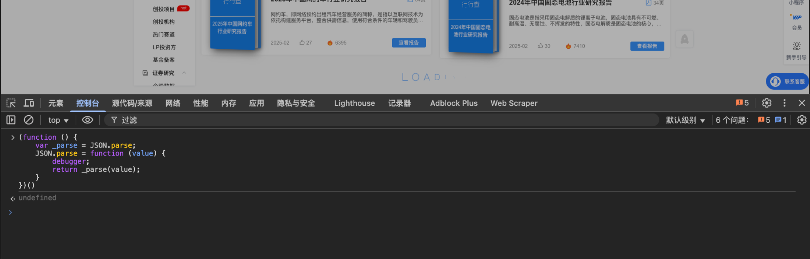

   > [!tip]
   >
   > 放入瀏覽器控制台，網頁不能刷新

3. 跟蹤stack資訊定位parse執行位置

   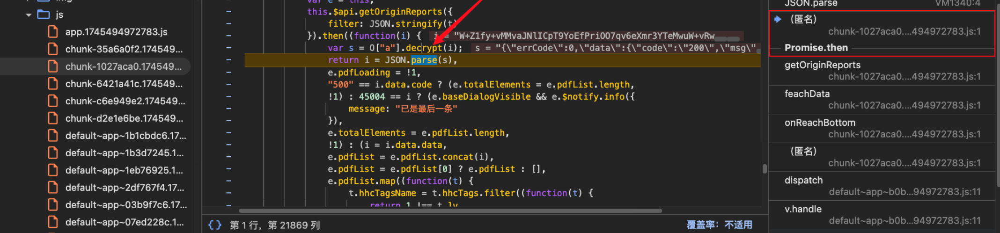

## HOOK Cookie

瀏覽器原本對於 `document.cookie` 的讀取（Get）與寫入（Set）有一套標準流程。Hook Cookie 則是透過 JavaScript 重新定義這套標準流程，讓我們能在 Cookie 被改變的「瞬間」插入自定義的程式碼

主要應用場景：

* **定位加密參數生成位置** 這是 Hook Cookie 最強大的用途。當你發現網站請求中包含複雜的 Cookie 參數（如簽名、Token），只要 Hook 住這個 Cookie 的名稱，瀏覽器就會在生成該參數時自動暫停，直接定位到加密函式
* **繞過反爬蟲驗證** 許多網站利用 Cookie 來標記「人類用戶」與「機器人」。透過 Hook，爬蟲可以精準模擬合法用戶的 Cookie 行為，包含時間戳記與特定的指紋資訊
* **自動化測試與數據分析** 在測試環境中，透過 Hook 可以強制注入特定的 Session ID 或狀態標記，模擬不同的使用者情境（如登入、未登入、VIP 用戶等），便於分析網站的資料流動

**Hook Cookie**

```javascript
(function () {
    cookieTemp = document.cookie;
    Object.defineProperty(document, 'cookie', {
        set: function (val) {
            if (val.indexOf('v') != -1) {
                debugger;
            }
            console.log('Hook捕獲到cookie設定->', val);
            cookieTemp = val;
        },
        get: function () {
            return cookieTemp;
        },
    });
})();
```

## HOOK XHR

Hook XHR 的原理是覆寫瀏覽器原生的 `XMLHttpRequest` 物件原型（Prototype）。瀏覽器在發送網路請求時，會經過 `open`（初始化連接）和 `send`（發送數據）這兩個關鍵步驟。通過 Hook 這兩個方法，我們可以在數據「發送前」與「回應後」進行攔截

主要應用場景：

* **定位加密參數的生成時機** 很多網站的 API 請求 URL 會包含一長串加密參數（如 `sign=...`）。直接搜尋這些字串通常找不到，因為它們是在發送請求的前一毫秒動態生成的。Hook `send` 方法可以在請求發出的瞬間讓程式暫停（Debugger），這時查看 Call Stack（呼叫堆疊）就能精準找到加密函式的位置
* **攔截並修改回應數據 (Response)** 有些網站會對伺服器回傳的數據進行加密（例如回傳一堆亂碼，然後在前端解密）。Hook XHR 允許我們在前端解密函式執行完畢後、渲染到頁面之前，直接攔截到解密後的 JSON 明文數據
* **強制修改請求參數** 在測試或特殊採集需求中，你可以透過 Hook 強制將請求中的頁碼參數從 `page=1` 改為 `page=1000`，或者修改 Header 中的資訊來繞過簡易的後端檢查

**XMLHttpRequest()**

```javascript
var xhr = new XMLHttpRequest()

// 初始化
xhr.open('post', 'http://www.cninfo.com.cn/new/disclosure', true)

// 請求頭設定
xhr.setRequestHeader('accept', 'application/json;charset=UTF-8'

// 傳送請求
xhr.send('column=szse_gem_latest&pageNum=1&pageSize=30&sortName=&sortType=&clusterFlag=true');

// 接收響應
xhr.onreadystatechange = function () {
    console.log(xhr.response);
}
```

**Axios**

```javascript
axios = require('axios')

// 設定請求攔截器
axios.interceptors.request.use(function (config) {
    console.log('請求攔截器被執行...');

    // 在傳送請求之前做些什麼, 比如：設定請求頭
    config.headers['User-Agent'] = 'Mozilla/5.0 (Windows NT 10.0; Win64; x64) AppleWebKit/537.36 (KHTML, like Gecko) Chrome/92.0.4515.131 Safari/537.36';
    return config;
}, function (error) {
    console.log('攔截失敗...')
    return Promise.reject(error);
});

// 設定響應攔截器
axios.interceptors.response.use(function (response) {
    console.log('響應攔截器被執行...');

    // 對響應資料做點什麼,  比如：對資料解密、格式化等
    console.log('模擬呼叫解密函數...');

    // 返回處理後的響應資料
    // return response;
    return response.data;
}, function (error) {
    console.log('處理響應資料失敗...');
    return Promise.reject(error);
});

// 傳送請求
axios.get('http://httpbin.org/get').then(response => console.log(response));
```


> [!note]
>
> **JavaScript語法補充**
>
> ```javascript
> function my_func() {
>     console.log(arguments)
> }
> ```
>
> 函數呼叫：
>
> > ###### 1. my_func()：普通調用 (Function Invocation)
> >
> > 這是最常見、最標準的函數調用方式。在這種模式下，`this` 的指向取決於代碼運行的環境：
> >
> > - **非嚴格模式**：`this` 會指向全域物件（瀏覽器中是 `window`）
> > - **嚴格模式 ('use strict')**：`this` 會是 `undefined`
> >
> > 這種方式最直觀，但缺點是你無法控制函數內部 `this` 的指向。如果這個函數原本是依賴某個物件運行的（例如 `obj.my_func()`），一旦你把它賦值給一個變數再這樣單獨調用，它就會失去原本的 `obj` 綁定，導致程式出錯
>
> > ###### 2. (0, my_func)()：逗號運算符調用 (Indirect Invocation)
> >
> > 這是一種比較高階且在源碼混淆（Obfuscation）中常見的技巧。它的核心作用是 **「切斷 `this` 的綁定，強制使用全域環境」**
> >
> > 逗號運算符 `(expr1, expr2)` 會從左到右計算，並回傳「最後一個」表達式的值。所以 `(0, my_func)` 的結果就是 `my_func` 這個函數本身。乍看之下這跟直接呼叫沒兩樣，但它改變了調用的性質：
> >
> > - 如果您寫 `obj.my_func()`，`this` 指向 `obj`
> > - 如果您寫 `(0, obj.my_func)()`，這被視為「間接調用」，`this` 會被強制重置為全域物件（或是 `undefined`）
>
> > ###### 3. my_func.call(this, 1, 2, 3)：指定上下文的調用
> >
> > 從這裡開始，我們進入了「顯式綁定」的領域。`call` 是 Function 原型上的方法，它允許您 **手動指定** 函數執行時的 `this` 是誰
> >
> > - **第一個參數**：您希望函數內部 `this` 指向的物件
> > - **後續參數**：必須 **一個一個** 地傳入（arg1, arg2, arg3...）
> >
> > 這種方式適合「參數數量固定且已知」的情況
>
> > ###### 4.  my_func.apply(this, [1, 2, 3])：數組形式的指定上下文調用
> >
> > `apply` 與 `call` 的功能幾乎完全一樣，唯一的差別在於傳參的格式：
> >
> > - **第一個參數**：同樣是指定 `this` 的物件
> > - **第二個參數**：必須是一個 **數組（Array）** 或 **類數組物件（Array-like Object）**
> >
> > 這是 Hook 技術中最常使用的方法。因為當我們攔截一個函數時，通常不確定原本的調用者傳了多少參數，這時我們可以利用 `arguments` 物件配合 `apply`，將所有接收到的參數「原封不動」地轉發給原函數，確保不破壞原有邏輯


# 摘要算法

在密碼學中，**摘要算法**（Digest Algorithm），通常被稱為**雜湊函數**（Hash Function）或**散列算法**，主要目的是驗證資料的完整性、生成數位簽名或儲存密碼等。雜湊值通常表現為固定長度的字串，例如32位元組的十六進制字串。

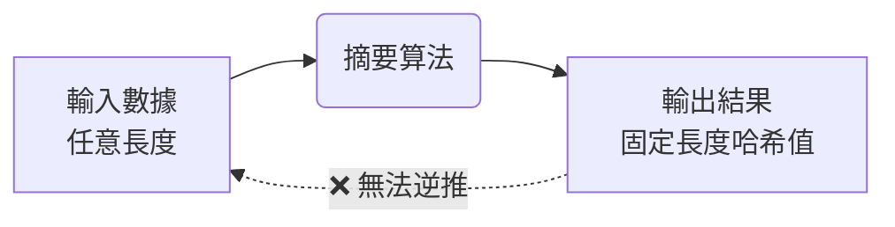
```mermaid
graph LR
    %% 定義節點
    A[輸入數據<br>任意長度] --> B(摘要算法)
    B --> C[輸出結果<br>固定長度哈希值]

    %% 標示單向性
    C -.->|❌ 無法逆推| A
```

摘要算法它具備以下特性：

* **不可逆性（One-way）：** 這是最重要的特性。你可以很容易地從「原文」算出「摘要」，但**無法**從「摘要」推導回「原文」
* **固定長度（Fixed Length）：** 無論輸入的資料多長（只有一個字或整本百科全書），輸出的摘要長度永遠是固定的（例如 SHA-256 永遠輸出 256 bits）
* **雪崩效應（Avalanche Effect）：** 只要輸入的資料有一丁點改變（例如把 `123` 改成 `124`），輸出的摘要就會產生天翻地覆的變化，完全看不出關聯

## MD5 摘要算法

**MD5(Message-Digest Algorithm 5)消息摘要演算法**：又稱雜湊演算法、散列算法，是密碼學歷史上最著名的摘要算法之一，在安全性上已經「跌落神壇」，但在很多舊系統或檔案下載頁面還是會經常看到

* 通常顯示為 **32 個十六進位字元**（0-9, a-f）組成的字串
  * 範例：`5d41402abc4b2a76b9719d911017c592` （這是 "hello" 的 MD5 值）
* **碰撞攻擊（Collision Attack）**： 密碼學家已經證實，可以人為製造出兩個「內容不同」的文件，但它們卻擁有「完全相同」的 MD5 值。這打破了摘要算法「獨一無二」的承諾。
* **彩虹表（Rainbow Table）**： 因為 MD5 運算太快且長度較短，駭客建立了龐大的資料庫（彩虹表），可以秒速反查出常見密碼（如 "123456"）對應的 MD5 值。

*^tab^*

> **JavaScript實現**
>
> 1. 安裝第三方套件 `npm install crypto-js --save`
>
> 2. 引用crypto-js加密模組
>
>    ```javascript
>    var CryptoJS = require('crypto-js') // 在Node.js導入套件
>                
>    function MD5test() {
>        return CryptoJS.MD5('1').toString()
>    }
>                
>    console.log(MD5test());
>                
>    // c4ca4238a0b923820dcc509a6f75849b
>    ```

>**Python實現**
>
>1. 導入第三方套件`import hashlib`
>
>2. 引用hashlib加密模組
>
>   ```python
>   import hashlib
>   
>   def md5_encode():
>       md5_hash = hashlib.md5() # 初始化md5
>       md5_hash.update('1'.encode()) 
>       print(md5_hash.hexdigest())
>   
>   md5_encode()
>   
>   # c4ca4238a0b923820dcc509a6f75849b
>   ```


## SHA摘要算法

**SHA (Secure Hash Algorithm)安全雜湊算法**，它是由 **美國國家安全局 (NSA)** 設計，並由美國國家標準與技術研究院 (NIST) 發佈的一系列密碼雜湊函數。

這不是「一個」算法，而是一個隨著時間不斷演進的**家族**，可以把它的發展史看作是為了對抗駭客日益增強的計算能力而不斷升級的過程

|  **代數**  |            **成員名稱**            |         **摘要輸出長度**         |                      **核心特點與應用**                      |                       **安全性與現狀**                       |
| :--------: | :--------------------------------: | :------------------------------: | :----------------------------------------------------------: | :----------------------------------------------------------: |
| **第一代** |             **SHA-1**              |   160 位元 (40 個十六進位字元)   |                     曾經的網路安全標準。                     | **🔴 已淘汰** 隨著電腦運算速度變快，2017 年 Google 成功演示碰撞攻擊（破解）。目前各大瀏覽器和作業系統已不再信任。 |
| **第二代** | **SHA-2** (含 SHA-256, SHA-512 等) | 多種長度版本 (最著名為 256 位元) | **🟢 當今霸主** 目前最廣泛使用的標準。 常聽到的網站加密、比特幣挖礦通常皆指 SHA-256。 |  **非常安全** 目前尚未發現有效的攻擊方式，是業界主流選擇。   |
| **第三代** |             **SHA-3**              |           多種長度版本           | **🔵 未雨綢繆的備案** NIST 選出的全新算法，內部數學結構與 SHA-1/SHA-2 完全不同，以防 SHA-2 未來有天被破解。 | **安全，但普及率較低** 雖然已發佈，但因為 SHA-2 目前依然「很能打」（足夠安全），所以 SHA-3 的普及率尚不如 SHA-2。 |

*^tab^*

> **JavaScript實現**
>
> ```javascript
> // 引用 crypto-js 加密模組
> var CryptoJS = require('crypto-js')
> 
> function SHA1Encrypt() {
>     var text = "hello"
>     return CryptoJS.SHA1(text).toString();
> }
> 
> console.log(SHA1Encrypt())
> 
> // aaf4c61ddcc5e8a2dabede0f3b482cd9aea9434d
> ```

> **Python實現**
>
> ```python
> import hashlib
> 
> def sha1_hash(s):
>     m = hashlib.sha1()
>     m.update(s.encode('utf-8'))
>     print(m.hexdigest())
> 
> sha1_hash('hello')
> 
> # aaf4c61ddcc5e8a2dabede0f3b482cd9aea9434d
> ```


## HMAC摘要算法

**HMAC (Keyed-Hashing for Message Authentication Code)基於雜湊的消息認證碼**，可以把它想像成是**「加了密碼鎖的 Hash」**，它不只是對消息進行 Hash 運算，而是把一個只有通訊雙方（A 和 B）才知道的**「秘密金鑰」（Secret Key）**混入消息中，然後再一起進行 Hash 運算

> [!important]
>
> 普通的 Hash 只能保證「完整性」（沒壞掉），不能保證「真實性」（是誰發的）。我們需要一種機制來證明發送者的身份

*^tab^*

> **JavaScript實現**
>
> ```javascript
> // 引用 crypto-js 加密模組
> var CryptoJS = require('crypto-js')
> 
> function HMACEncrypt() {
>     var text = "I love python!"
>     var key = "secret"   // 金鑰
>     return CryptoJS.HmacMD5(text, key).toString();
>     // return CryptoJS.HmacSHA1(text, key).toString();
>     // return CryptoJS.HmacSHA256(text, key).toString();
> }
> 
> console.log(HMACEncrypt())
> ```

> **Python實現**
>
> ```python
> import hmac
> 
> 
> def hmac_test_1():
>     message = 'I love python!'.encode()
>     key = b'secret'
>     md5 = hmac.new(key, message, digestmod='MD5')
>     print(md5.hexdigest())
> 
> 
> def hmac_test_2():
>     key = 'secret'.encode('utf8')
>     sha1 = hmac.new(key, digestmod='sha1')
>     sha1.update('I love '.encode('utf8'))
>     sha1.update('Python!'.encode('utf8'))
>     print(sha1.hexdigest())
> 
> 
> if __name__ == '__main__':
>     hmac_test_1()  # 9c503a1f852edcc3526ea56976c38edf
>     hmac_test_2()  # 2d8449a4292d4bbeed99ce9ea570880d6e19b61a
> ```

> [!caution]
>
> JavaScript和Python傳遞的形參位置順序是相反的

## 實戰案例-MD5

* 目標站點：https://www.mytokencap.com/
* 逆向參數：code: 857e4b956af06ee9023e37df608b0d53
* API地址：https://api.mytokenapi.com/ticker/currencyranklist?pages=1%2C1&sizes=100%2C100&subject=market_cap&language=en_US&legal_currency=USD&code=a929b5430d7e5ddbe67e12d4ce7baaf8&timestamp=1746625459867&platform=web_pc&v=0.1.0&mytoken=

> ###### 1. 抓取網路請求獲取資料API
>
> 可以先透過網頁上的文字搜尋網路請求中的response，看看有沒有相符合的內容，並檢視Preview或是Response，查看API資料是否為我們要找的
>
> 
>
> 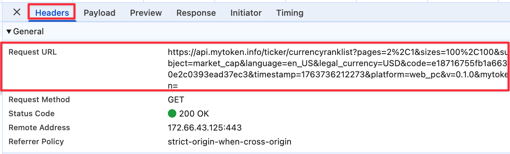

> ###### 2. 查看API中的Payload（發現存在動態參數code，以及時間戳記）
>
> 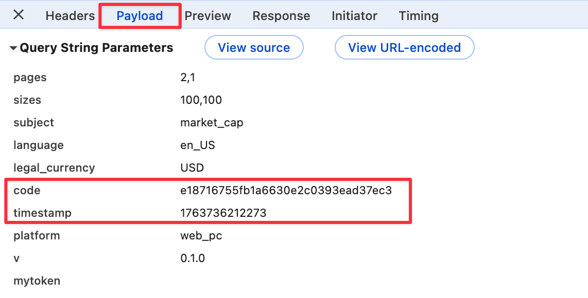
>
> 可以看到 `e18716755fb1a6630e2c0393ead37ec3` 它有 **99% 的機率是【MD5 摘要算法】**
>
> * 這串字元裡只有數字 `0-9` 和小寫字母 `a-f`，標準的 **十六進位 (Hexadecimal)** 表示法
> * 總共是 **32 個字元**

> ###### 3. xhr斷點定位證實猜想
>
> 1. 方法1：xhr斷點搜尋
>
>    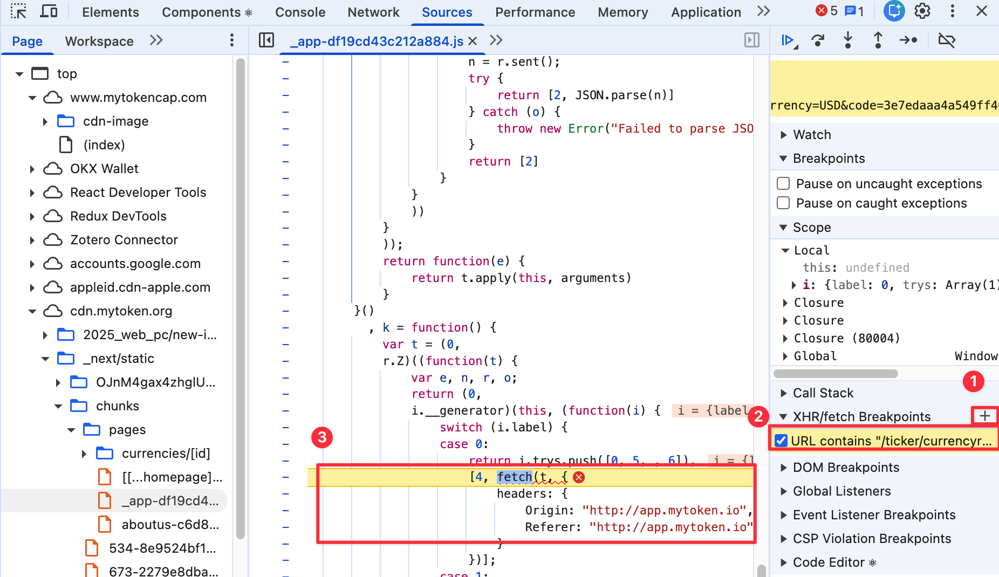
>
> 2. 方法2：搜尋關鍵字段
>
>    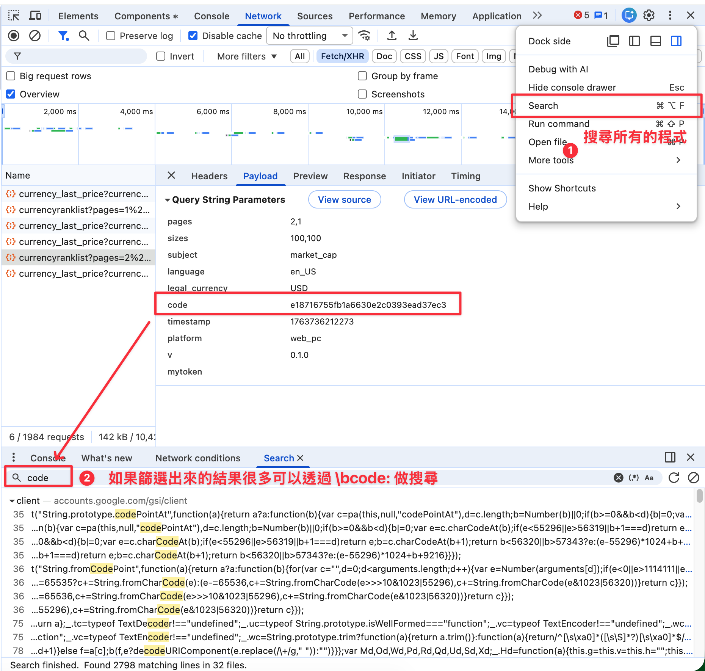
>
>    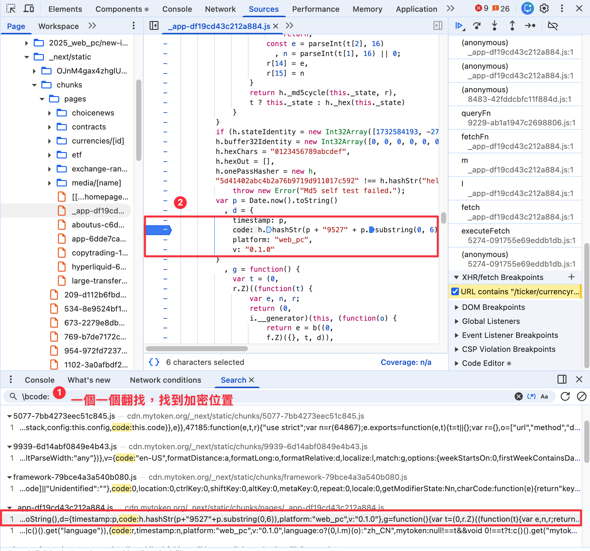

> ###### 4. Call Stack調用堆棧找尋關鍵字加密方式
>
> 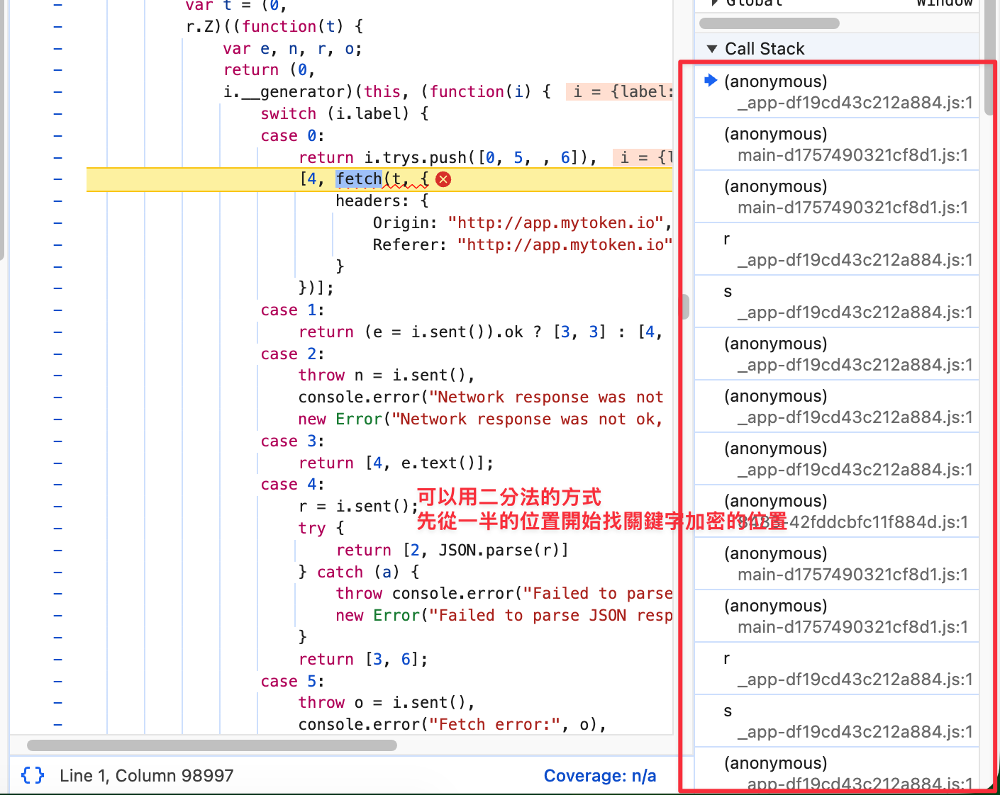
>
> 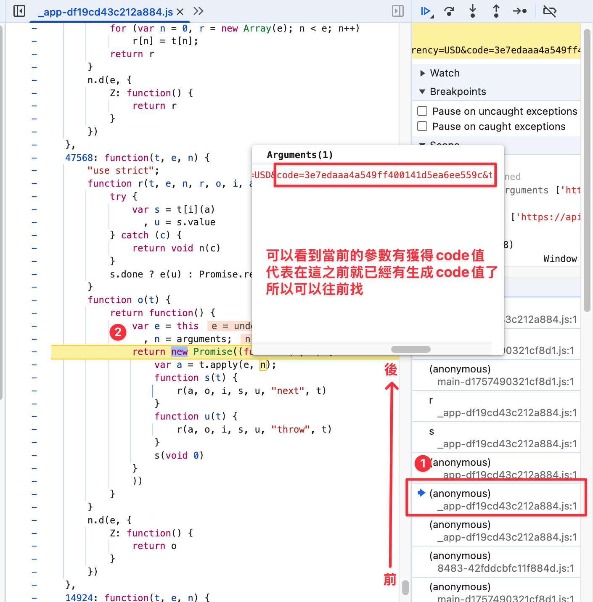
>
> 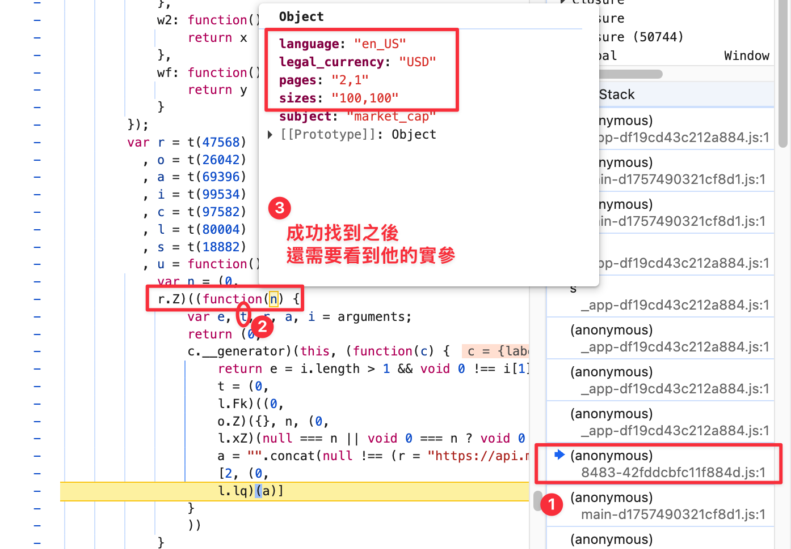

> ###### 5. 解析關鍵函數
>
> 將關鍵函數複製到console控制台，研究值是否是我們所需要的
>
> 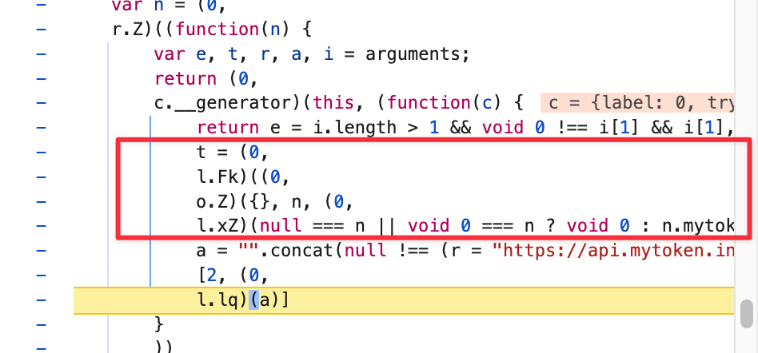
>
> 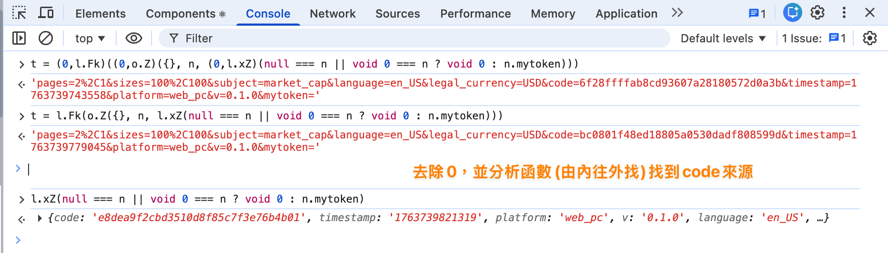
>
> 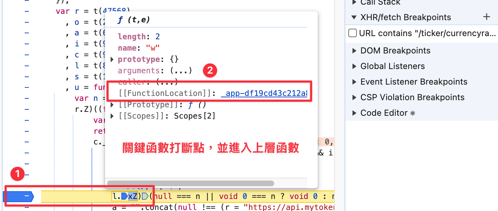
>
> 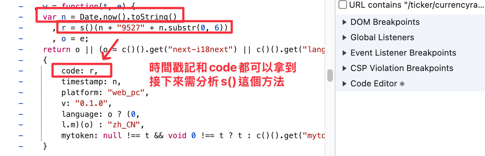
>
> 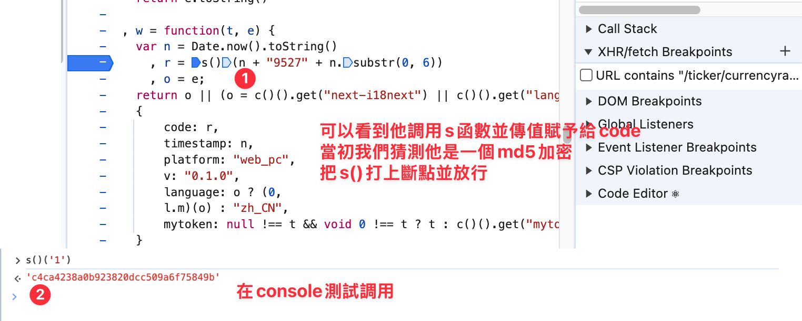
>
> 

> ###### 6. 編寫程式
>
> ```javascript
> // l.xZ()
> var crypto_js = require('crypto-js')
> 
> function md5_encode(text) {
>     return crypto_js.MD5(text).toString()
> }
> 
> function get_params() {
>     var n = Date.now().toString()
>     var code = md5_encode(n + "9527" + n.substr(0, 6))
>     return {
>         time: n,
>         code: code
>     }
> }
> 
> console.log(get_params())
> 
> // { time: '1763741044602', code: 'c54d74e20580b3c45ca321033dee14fe' }
> ```
>
> ```python
> import requests
> import execjs
> 
> class Code_MD5:
>     def __init__(self):
>         self.headers = {
>             'accept': '*/*',
>             'accept-language': 'zh-TW,zh;q=0.9,en-US;q=0.8,en;q=0.7,ja;q=0.6',
>             'cache-control': 'no-cache',
>             'origin': 'https://www.mytokencap.com',
>             'pragma': 'no-cache',
>             'priority': 'u=1, i',
>             'referer': 'https://www.mytokencap.com/',
>             'sec-ch-ua': '"Chromium";v="142", "Google Chrome";v="142", "Not_A Brand";v="99"',
>             'sec-ch-ua-mobile': '?0',
>             'sec-ch-ua-platform': '"macOS"',
>             'sec-fetch-dest': 'empty',
>             'sec-fetch-mode': 'cors',
>             'sec-fetch-site': 'cross-site',
>             'user-agent': 'Mozilla/5.0 (Macintosh; Intel Mac OS X 10_15_7) AppleWebKit/537.36 (KHTML, like Gecko) Chrome/142.0.0.0 Safari/537.36',
>         }
> 
>     def main(self):
>         # 讀取編寫好的js程式
>         with open('code.js', 'r', encoding='utf-8') as f:
>             js_code = f.read()
> 
>         # 載入參數
>         ctx = execjs.compile(js_code)
>         spider_params = ctx.call('get_params')
> 
>         params = {
>             'pages': '2,1',
>             'sizes': '100,100',
>             'subject': 'market_cap',
>             'language': 'en_US',
>             'legal_currency': 'USD',
>             'code': f'{spider_params["code"]}',
>             'timestamp': f'{spider_params["time"]}',
>             'platform': 'web_pc',
>             'v': '0.1.0',
>             'mytoken': '',
>         }
> 
>         response = requests.get('https://api.mytoken.info/ticker/currencyranklist', params=params, headers=self.headers)
>         print(response.json())
> 
> if __name__ == '__main__':
>     Code_MD5().main()
> ```
>
> 

## 實戰案例-HmacSHA1

* 目標站點：https://www.baosteel.com/media/news
* 逆向參數：x-signature
* 介面地址：v1/web/api/content/list

> ###### 1. 抓取網路請求獲取資料API
>
> 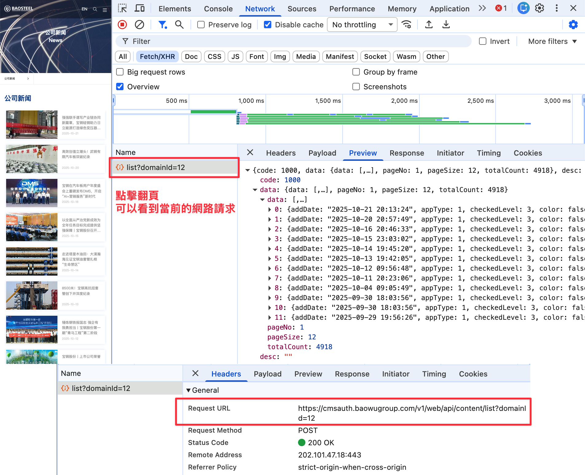

> ###### 2. 查看request請求頭，尋找動態參數
>
> 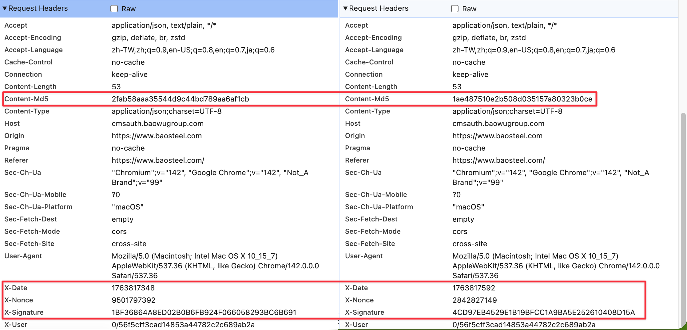
>
> 可以發現content-md5、x-date、x-nonce、x-signature都是動態生成的

> ###### 3. 關鍵字搜尋定位
>
> 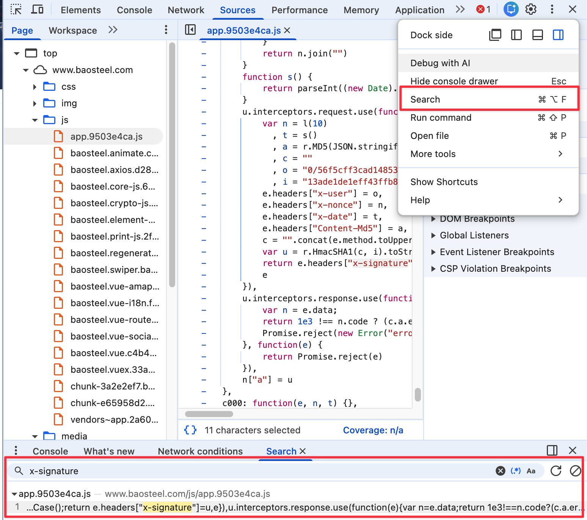

> ###### 4. 解析關鍵參數
>
> 根據第二步圖片對比，我們需要知道content-md5、x-date、x-nonce、x-signature在每一次請求的變化方式
>
> * 如果變量是固定值，可以直接copy下來到js程式中，像是o
>
>   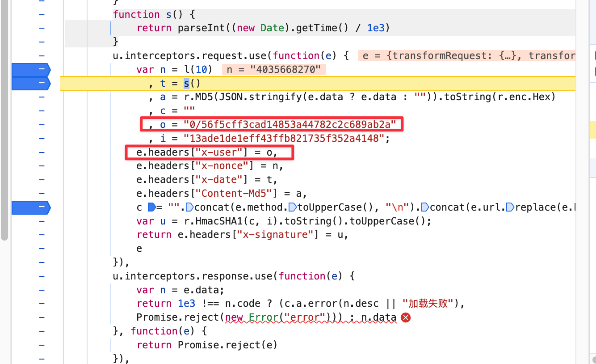
>
> * 如果變量是透過呼叫函數取得，需要打上斷點，解析並複製函數到js中
>
>   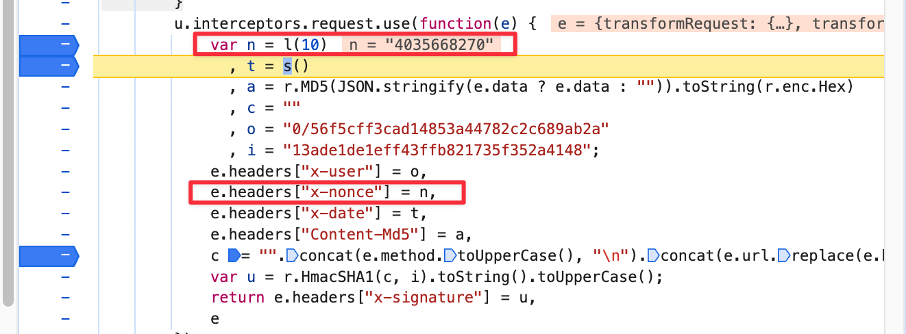
>
> * 如果是MD5或是hmac加密方式，可以先試試看是否為標準的加密方式，輸入”1”，查看加密結果
>
>   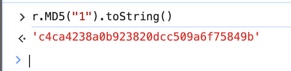

> ###### 5. 編寫程式
>
> ```javascript
> const crypto_js = require('crypto-js')
> 
> function md5_encode(text) {
>     return crypto_js.MD5(text).toString()
> }
> 
> function hmac_encode(text,key) {
>     return crypto_js.HmacSHA1(text,key).toString().toUpperCase()
> }
> 
> function l(e) {
>     for (var n = [], t = Array.of("0", "1", "2", "3", "4", "5", "6", "7", "8", "9"), a = 0; a < e; a++) {
>         var c = Math.floor(10 * Math.random());
>         n[a] = t[c]
>     }
>     return n.join("")
> }
> 
> function s() {
>     return parseInt((new Date).getTime() / 1e3)
> }
> 
> headers = {}
> 
> function return_headers_params(){
>     const data = {
>         "pageNo": 0,
>         "pageSize": 12,
>         "condition": {
>             "nodeId": 436
>         }
>     }
>     const n = l(10)
>     const t = s()
>     const a = md5_encode(JSON.stringify(data))
>     const o = "0/56f5cff3cad14853a44782c2c689ab2a"
>     const i = "13ade1de1eff43ffb821735f352a4148";
>     const c = "".concat("POST", "\n").concat("/v1/web/api/content/list?domainId=12", "\nx-user:").concat(o, "\nx-nonce:").concat(n, "\nx-date:").concat(t, "\nContent-Md5:").concat(a, "\n");
>     const u = hmac_encode(c,i)
> 
>     headers["x-nonce"] = n
>     headers["x-date"] = t
>     headers["Content-Md5"] = a
>     headers["x-signature"] = u
> 
>     return headers
> }
> 
> console.log(return_headers_params())
> ```
>
> ```python
> import json
> import requests
> from requests.adapters import HTTPAdapter
> from urllib3.util.ssl_ import create_urllib3_context
> import execjs
> 
> 
> class BaoSteelSpider:
>     """寶鋼網站爬蟲"""
> 
>     def __init__(self, js_file_path="寶鋼.js"):
>         self.js_file_path = js_file_path
>         self.js_code = self._load_js_code()
>         self.session = self._create_session()
>         self.base_url = "https://cmsauth.baowugroup.com/v1/web/api/content/list"
> 
>     def _load_js_code(self):
>         """載入 JS 檔案"""
>         with open(self.js_file_path, 'r', encoding='utf-8') as f:
>             return f.read()
> 
>     def _create_ssl_adapter(self):
>         """建立自訂 SSL Adapter 以繞過 DH_KEY_TOO_SMALL 錯誤"""
>         class SSLAdapter(HTTPAdapter):
>             def init_poolmanager(self, *args, **kwargs):
>                 ctx = create_urllib3_context()
>                 ctx.set_ciphers('DEFAULT:@SECLEVEL=1')
>                 kwargs['ssl_context'] = ctx
>                 return super().init_poolmanager(*args, **kwargs)
>         return SSLAdapter()
> 
>     def _create_session(self):
>         """建立帶有 SSL Adapter 的 Session"""
>         session = requests.Session()
>         session.mount('https://', self._create_ssl_adapter())
>         return session
> 
>     def _get_params_info(self, page):
>         """透過 JS 取得加密參數"""
>         ctx = execjs.compile(self.js_code)
>         return ctx.call('return_headers_params', page)
> 
>     def _build_headers(self, params_info):
>         """建立請求 headers"""
>         return {
>             'Accept': 'application/json, text/plain, */*',
>             'Accept-Language': 'zh-TW,zh;q=0.9,en-US;q=0.8,en;q=0.7,ja;q=0.6',
>             'Cache-Control': 'no-cache',
>             'Connection': 'keep-alive',
>             'Content-Md5': params_info['Content-Md5'],
>             'Content-Type': 'application/json;charset=UTF-8',
>             'Origin': 'https://www.baosteel.com',
>             'Pragma': 'no-cache',
>             'Referer': 'https://www.baosteel.com/',
>             'Sec-Fetch-Dest': 'empty',
>             'Sec-Fetch-Mode': 'cors',
>             'Sec-Fetch-Site': 'cross-site',
>             'User-Agent': 'Mozilla/5.0 (Macintosh; Intel Mac OS X 10_15_7) AppleWebKit/537.36 (KHTML, like Gecko) Chrome/142.0.0.0 Safari/537.36',
>             'sec-ch-ua': '"Chromium";v="142", "Google Chrome";v="142", "Not_A Brand";v="99"',
>             'sec-ch-ua-mobile': '?0',
>             'sec-ch-ua-platform': '"macOS"',
>             'x-date': str(params_info['x-date']),
>             'x-nonce': params_info['x-nonce'],
>             'x-signature': params_info['x-signature'],
>             'x-user': '0/56f5cff3cad14853a44782c2c689ab2a',
>         }
> 
>     def _build_payload(self, page, page_size=12, node_id=436):
>         """建立請求 payload"""
>         json_data = {
>             'pageNo': page,
>             'pageSize': page_size,
>             'condition': {
>                 'nodeId': node_id,
>             },
>         }
>         return json.dumps(json_data, separators=(',', ':'))
> 
>     def fetch_page(self, page, page_size=12, node_id=436):
>         """抓取單頁資料"""
>         params_info = self._get_params_info(page)
>         headers = self._build_headers(params_info)
>         params = {'domainId': '12'}
>         data = self._build_payload(page, page_size, node_id)
> 
>         response = self.session.post(
>             self.base_url,
>             params=params,
>             headers=headers,
>             data=data
>         )
>         return response.json()
> 
>     def fetch_pages(self, start_page=0, end_page=10):
>         """抓取多頁資料"""
>         results = []
>         for page in range(start_page, end_page):
>             result = self.fetch_page(page)
>             results.append(result)
>             print(f"第 {page} 頁: {result}")
>         return results
> 
> 
> if __name__ == "__main__":
>     spider = BaoSteelSpider()
>     spider.fetch_pages(start_page=0, end_page=10)
> ```


# 對稱加密

==加密和解密使用同一把金鑰 (Key)==

**對稱加密 (Symmetric Encryption)**，又稱為「私鑰加密」或「共享密鑰加密」，是一種加密方法

對稱加密的基本流程如下：

1. 加密：明文（原始資料）通過加密演算法和金鑰轉換為密文（加密後的資料）
2. 傳輸：密文通過不安全的通道（如網際網路）傳輸到接收方
3. 解密：接收方使用相同的金鑰和相應的解密演算法將密文還原為明文

常見的對稱加密演算法：

* **AES (Advanced Encryption Standard)：** **目前的絕對主流標準。** 安全、快速。現在幾乎所有的安全通訊（如 HTTPS 網頁、Wi-Fi 加密、檔案壓縮加密）底層都在用 AES。常見有 AES-128, AES-256（數字代表金鑰長度，越長越安全）。
* **DES / 3DES (Data Encryption Standard)：** 早期的標準，現在已經被認為不安全（因為電腦運算速度變快，可以暴力破解 DES），基本上已被淘汰，由 AES 取代。
* **ChaCha20：** 一種較新的演算法，在行動裝置上（手機、平板）的執行效率通常比 AES 更好，Google 等大公司經常使用。
* **RC4：** 曾經很流行（早期 SSL/TLS 和 WEP Wi-Fi 曾使用），但後來發現有嚴重安全漏洞，現在已經被棄用。

## 常見算法

### ECB

==各自分組，獨立加密==

**ECB (Electronic Codebook, 電子密碼本模式)** 就是其中最簡單、最原始，但也是**最危險**的一種模式

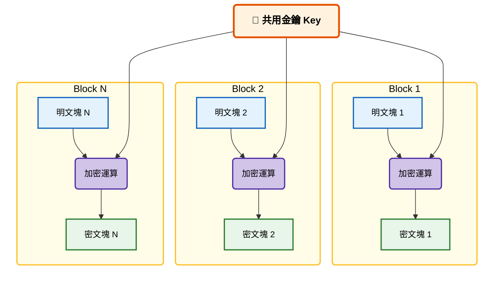
```mermaid
graph TD
    %% --- 定義樣式 ---
    classDef container fill:#fffde7,stroke:#fbc02d,stroke-width:2px,rx:5,ry:5,color:#000;
    classDef plaintext fill:#e3f2fd,stroke:#1565c0,stroke-width:2px,color:#000,font-size:14px;
    classDef process fill:#d1c4e9,stroke:#512da8,stroke-width:2px,color:#000,font-size:14px;
    classDef ciphertext fill:#e8f5e9,stroke:#2e7d32,stroke-width:2px,color:#000,font-size:14px;
    classDef keyStyle fill:#fff3e0,stroke:#e65100,stroke-width:3px,font-weight:bold,font-size:16px,rx:5,ry:5,color:#000;
    classDef dotsStyle fill:none,stroke:none,font-size:30px,color:#000,text-align:center;
    classDef parentContainerStyle fill:none,stroke:none;

    %% ====== 主要區域：包含所有水平排列的區塊 ======
    subgraph HorizontalLayout [ ]
        direction LR %% 關鍵指令：強制內部元素從左到右排列

        %% --- Block 1 ---
        subgraph B1 [Block 1]
            P1[明文塊 1]:::plaintext --> E1(加密運算):::process
            E1 --> C1[密文塊 1]:::ciphertext
        end

        %% --- Block 2 ---
        subgraph B2 [Block 2]
            P2[明文塊 2]:::plaintext --> E2(加密運算):::process
            E2 --> C2[密文塊 2]:::ciphertext
        end

        %% --- Block N ---
        subgraph BN [Block N]
            PN[明文塊 N]:::plaintext --> EN(加密運算):::process
            EN --> CN[密文塊 N]:::ciphertext
        end
    end

    %% ====== 金鑰區域：在主要區域的下方 ======
    SharedKey[🔑 共用金鑰 Key]:::keyStyle

    %% --- 連接金鑰 (向上連接到各加密運算) ---
    SharedKey ---> E1
    SharedKey ---> E2
    SharedKey ---> EN

    %% --- 應用樣式 ---
    class B1,B2,BN container;
    class HorizontalLayout parentContainerStyle;
```

### CBC

==讓前一個區塊的加密結果，影響下一個區塊的加密過程==

**CBC (Cipher Block Chaining, 密文分組鏈接模式)** 是目前最常見、應用最廣泛的加密模式之一，引入了一個關鍵的數學運算**異或(XOR)** 

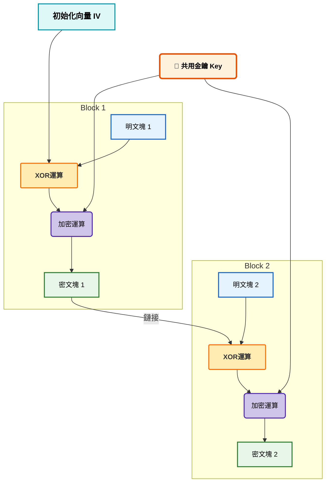
```mermaid
graph TD
    %% === 定義樣式 ===
    classDef plaintext fill:#e3f2fd,stroke:#1565c0,stroke-width:2px,color:#000,font-size:14px;
    classDef process fill:#d1c4e9,stroke:#512da8,stroke-width:2px,color:#000,font-size:14px;
    classDef ciphertext fill:#e8f5e9,stroke:#2e7d32,stroke-width:2px,color:#000,font-size:14px;
    classDef keyStyle fill:#fff3e0,stroke:#e65100,stroke-width:3px,font-weight:bold,font-size:14px,rx:5,ry:5,color:#000;
    %% XOR 樣式：文字矩形
    classDef xorStyle fill:#ffecb3,stroke:#ff6f00,stroke-width:2px,font-weight:bold,font-size:14px,rx:2,ry:2;
    classDef ivStyle fill:#e0f7fa,stroke:#0097a7,stroke-width:2px,font-weight:bold,color:#000;

    %% === 定義外部元素 (在上方) ===
    IV[初始化向量 IV]:::ivStyle
    SharedKey[🔑 共用金鑰 Key]:::keyStyle

    %% === 定義區塊 ===
    
    %% --- Block 1 ---
    subgraph B1 [Block 1]
        P1[明文塊 1]:::plaintext --> X1[XOR運算]:::xorStyle
        X1 --> E1(加密運算):::process
        E1 --> C1[密文塊 1]:::ciphertext
    end

    %% --- Block 2 ---
    subgraph B2 [Block 2]
        P2[明文塊 2]:::plaintext --> X2[XOR運算]:::xorStyle
        X2 --> E2(加密運算):::process
        E2 --> C2[密文塊 2]:::ciphertext
    end

    %% === 實體連線 ===
    %% IV 介入第一個區塊
    IV --> X1
    
    %% 金鑰連接到加密運算
    SharedKey --> E1
    SharedKey --> E2
    
    %% 關鍵的 CBC 鏈接：Block 1 密文 --> Block 2 XOR
    C1 --鏈接--> X2

    %% === ☢️ 佈局強制黑魔法 ☢️ ===
    
    %% 1. 強制 IV 和 Key 在最上方層級且水平對齊：
    IV ~~~ SharedKey
    
    %% 2. 強制它們位於區塊的上方：
    SharedKey ~~~ P1

    %% 3. 強制 Block 1 和 Block 2 水平排列：
    P1 ~~~ P2
```


## DES加密

**DES** 全名是 **Data Encryption Standard**（資料加密標準），它是一種**對稱式**的**區塊加密**演算法

- **對稱式 (Symmetric)：** 加密和解密使用同一把金鑰（就像我們前面介紹過的日記本鎖）
- **區塊加密 (Block Cipher)：** 它不是一個位元一個位元地加密，而是把資料切成固定大小的「塊」（Block），然後對這一整塊進行複雜的數學轉換。（這就是為什麼我們之前討論 ECB/CBC 模式時，都會提到「分塊」的原因）

|         **特徵**          |    **規格數值**    |                           **說明**                           |
| :-----------------------: | :----------------: | :----------------------------------------------------------: |
| **區塊大小 (Block Size)** | **64 位元 (bits)** | 它每次只能處理 64 位元的資料（例如 8 個英文字母）。如果資料更長，就要分塊；如果不夠長，就要填充 (Padding) |
|  **金鑰長度 (Key Size)**  | **56 位元 (bits)** | **這是 DES 最大的弱點。**  （*註：輸入的金鑰實際上是 64 位元，但其中有 8 位元是用來做奇偶校驗的，不參與加密運算，所以實際有效長度只有 56 位元） |
|   **加密輪數 (Rounds)**   |     **16 輪**      |             資料塊會經過 16 次重複的複雜攪拌過程             |

*^tab^*

> **JavaScript實現**
>
> ```javascript
> const crypto_js = require('crypto-js')
> 
> const text = "ABCD"
> const desKey = "12345678" // 金鑰
> const desIv = "12345678" // 初始向量
> 
> function des_encrypt() {
>     const src = crypto_js.enc.Utf8.parse(text)
>     const key = crypto_js.enc.Utf8.parse(desKey)
>     const iv = crypto_js.enc.Utf8.parse(desIv)
> 
>     const encrypted = crypto_js.DES.encrypt(src, key, {
>         iv: iv,
>         mode: crypto_js.mode.CBC,
>         padding: crypto_js.pad.Pkcs7 // 填充方式
>     })
> 
>     return encrypted.toString()
> }
> 
> function des_decrypt() {
>     const key = crypto_js.enc.Utf8.parse(desKey)
>     const iv = crypto_js.enc.Utf8.parse(desIv)
>     const encrypted_data = des_encrypt()
>     const decrypted = crypto_js.DES.decrypt(encrypted_data, key, {
>         iv: iv,
>         mode: crypto_js.mode.CBC,
>         padding: crypto_js.pad.Pkcs7
>     })
>     return decrypted.toString(crypto_js.enc.Utf8)
> }
> 
> console.log(des_encrypt())
> console.log(des_decrypt())
> ```

>**Python實現**
>
>> [!tip]
>>
>> 需要先安裝 `pip install pyDes` 套件
>
>```python
>import binascii
>
>from pyDes import des, CBC, PAD_PKCS5
>
>def des_encrypt(plain_text, key, iv):
>    """DES CBC 加密"""
>    cipher = des(key, CBC, iv, pad=None, padmode=PAD_PKCS5)
>    encrypted = cipher.encrypt(plain_text, padmode=PAD_PKCS5)
>    return binascii.b2a_hex(encrypted)
>
>
>def des_decrypt(encrypted_text, key, iv):
>    """DES CBC 解密"""
>    cipher = des(key, CBC, iv, pad=None, padmode=PAD_PKCS5)
>    decrypted = cipher.decrypt(binascii.a2b_hex(encrypted_text), padmode=PAD_PKCS5)
>    return decrypted
>
>
>if __name__ == "__main__":
>    text = "ABCD"
>    des_key = "12345678"
>    des_iv = "12345678"
>    
>    encrypted = des_encrypt(text, des_key, des_iv)
>    print(f"加密結果: {encrypted}")
>    decrypted = des_decrypt(encrypted, des_key, des_iv)
>    print(f"解密結果: {decrypted}")
>```

## AES加密

**AES（Advanced Encryption Standard，進階加密標準）** 是目前世界上最廣泛使用的加密演算法

* 金鑰長度：支援128位、192位和256位三種金鑰長度輪數
* 根據金鑰長度不同，加密輪數也不同（10/12/14輪）

|         **特徵**          |       **規格數值**       |                           **說明**                           |
| :-----------------------: | :----------------------: | :----------------------------------------------------------: |
| **區塊大小 (Block Size)** |   **128 位元 (bits)**    | 無論金鑰多長，AES 固定每次處理 128 位元（16 Bytes）的資料塊。這比 DES 的 64 位元更難被破解分析。同樣地，如果資料長度不足，也需要進行填充 (Padding) |
|  **金鑰長度 (Key Size)**  | **128 / 192 / 256 位元** | 這是 AES 最靈活的地方，它支援三種長度。金鑰越長越安全，但運算速度會稍微變慢。一般網頁加密（如 HTTPS）大多預設使用 128 位元，只有軍事或極高機密才會用到 256 位元 |
|   **加密輪數 (Rounds)**   |   **10 / 12 / 14 輪**    | 輪數是根據金鑰長度決定的：128 位元跑 10 輪、192 位元跑 12 輪、256 位元跑 14 輪。每一輪都是一次複雜的「混合與代換」過程，輪數越多，資料被攪拌得越徹底 |

*^tab^*

> **JavaScript實現**
>
> ```javascript
> // npm install crypto-js --save
> 
> const CryptoJS = require("crypto-js");
> 
> // AES加密函數
> function encryptAES(plainText, secretKey, iv) {
>     // 將金鑰和IV轉換為CryptoJS支援的格式
>     const key = CryptoJS.enc.Utf8.parse(secretKey);
>     const ivParam = CryptoJS.enc.Utf8.parse(iv);
> 
>     // 執行AES加密（CBC模式，PKCS7填充）
>     const encrypted = CryptoJS.AES.encrypt(plainText, key, {
>         iv: ivParam,
>         mode: CryptoJS.mode.CBC,
>         padding: CryptoJS.pad.Pkcs7
>     });
> 
>     // 返回Base64格式的加密結果
>     return encrypted.toString();
> }
> 
> // AES解密函数
> function decryptAES(cipherText, secretKey, iv) {
>     // 將金鑰和IV轉換為CryptoJS支援的格式
>     const key = CryptoJS.enc.Utf8.parse(secretKey);
>     const ivParam = CryptoJS.enc.Utf8.parse(iv);
> 
>     // 執行AES解密
>     const decrypted = CryptoJS.AES.decrypt(cipherText, key, {
>         iv: ivParam,
>         mode: CryptoJS.mode.CBC,
>         padding: CryptoJS.pad.Pkcs7
>     });
> 
>     // 返回UTF8格式的原始字串
>     return decrypted.toString(CryptoJS.enc.Utf8);
> }
> 
> // 示例使用
> const plainText = "這是暫未被加密的原始資料...";
> const secretKey = "1234567890123456";  // 16位元組金鑰
> const iv = "1234567890123456";         // 16位元組初始向量
> 
> // 加密
> const encrypted = encryptAES(plainText, secretKey, iv);
> console.log("加密結果:", encrypted);
> 
> // 解密
> const decrypted = decryptAES(encrypted, secretKey, iv);
> console.log("解密結果:", decrypted);
> ```
>
> 

> **Python實現**
>
> > [!tip]
> >
> > 需要先安裝 `pip install pycryptodome` 套件
>
> ```python
> from Crypto.Cipher import AES
> from Crypto.Util.Padding import pad, unpad
> import base64
> 
> 
> # AES加密函數（CBC模式，PKCS7填充）
> def encrypt_aes(plain_text, secret_key, iv):
>     cipher = AES.new(secret_key.encode('utf-8'), AES.MODE_CBC, iv.encode('utf-8'))
>     padded_data = pad(plain_text.encode('utf-8'), AES.block_size)
>     encrypted = cipher.encrypt(padded_data)
>     return base64.b64encode(encrypted).decode('utf-8')
> 
> 
> # AES解密函數
> def decrypt_aes(cipher_text, secret_key, iv):
>     cipher = AES.new(secret_key.encode('utf-8'), AES.MODE_CBC, iv.encode('utf-8'))
>     encrypted_data = base64.b64decode(cipher_text)
>     decrypted = cipher.decrypt(encrypted_data)
>     return unpad(decrypted, AES.block_size).decode('utf-8')
> 
> 
> # 示例使用
> if __name__ == "__main__":
>     plain_text = "這是暫未被加密的原始資料..."
>     secret_key = "1234567890123456"  # 16bytes金鑰
>     iv = "1234567890123456"  # 16bytes向量
> 
>     # 加密
>     encrypted = encrypt_aes(plain_text, secret_key, iv)
>     print("加密結果:", encrypted)
> 
>     # 解密
>     decrypted = decrypt_aes(encrypted, secret_key, iv)
>     print("解密結果:", decrypted)
> 
> ```
>
> > [!important]
> >
> > Base64 的作用就是把那些看不懂、無法打印的二進制數據，全部轉換成由 **64 個標準字符（A-Z, a-z, 0-9, +, /）** 組成的字串**負責「運輸」**
> >
> > * **原始 AES 輸出（危險）：** `\x8e\xa2\x1b\x0f\x99...` (這裡面可能有截斷符號)
> > * **Base64 編碼後（安全）：** `jqIbD5m...==`

## 實戰案例-DES

* 目標地址：`https://www.endata.com.cn/Market/report.html`
* 資料API：`https://www.endata.com.cn/API/GetData.ashx`
* 逆向要求：對伺服器返回的資料完成解密

> ###### 1. 查看返回的response資料
>
> 翻頁觸發API請求，回傳的response有經過加密，前端接收到response字符串後可能需要透過**js解密並轉換成JSON格式**
>
> 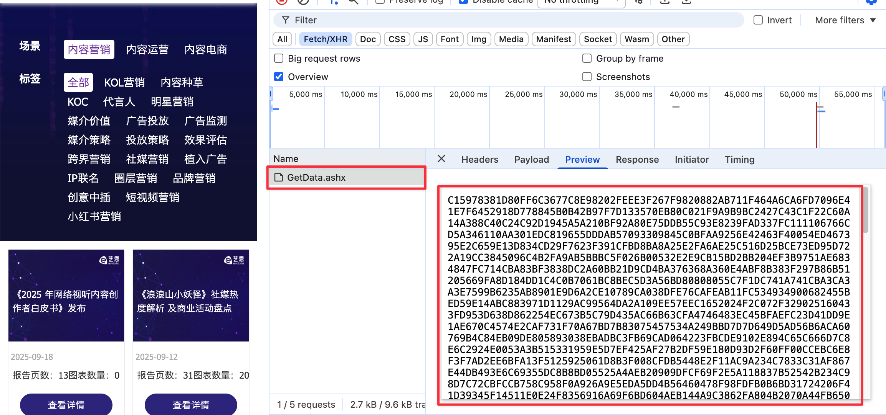

> ###### 2. 定位解密函數
>
> 1. 方法一：使用關鍵字(例如：`decrypt(` 或是 `json.parse(` )定位，字符串的資料格式不好渲染網頁，肯定會轉成Object，打上斷點，觀察程式是否會中斷，因為在過程中需要這寫函數去做轉換
>
>    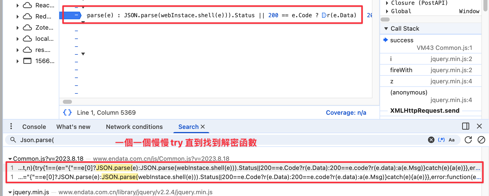
>
> 2. 方法二：xhr斷點
>
>    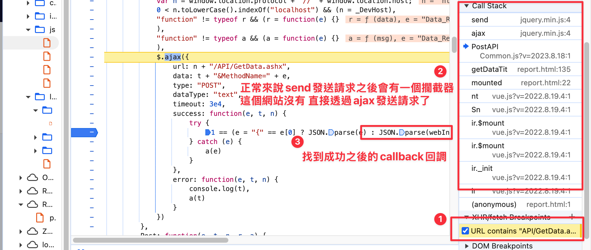
>
>    `xhr.send()` 攔截器可以查看瀏覽器的「Call Stack（呼叫堆疊）」，能夠往前追溯是誰發起的請求，或者往後尋找這個請求綁定了哪個 callback 函數來處理回應。一旦找到那個處理回應的函數，就能在其內部找到解密函式，直接拿到解密後的明文
>
> 3. 方法三：JSON.parse hook
>
>    ```javascript
>    var my_stringify = JSON.stringify;
>    JSON.stringify = function (params) {
>        debugger;
>        console.log("json_stringify params:",params);
>        return my_stringify(params);
>    };
>          
>    var my_parse = JSON.parse;
>    JSON.parse = function (params) {
>        debugger;
>        console.log("json_parse params:",params);
>        return my_parse(params);
>    };
>    ```
>
>    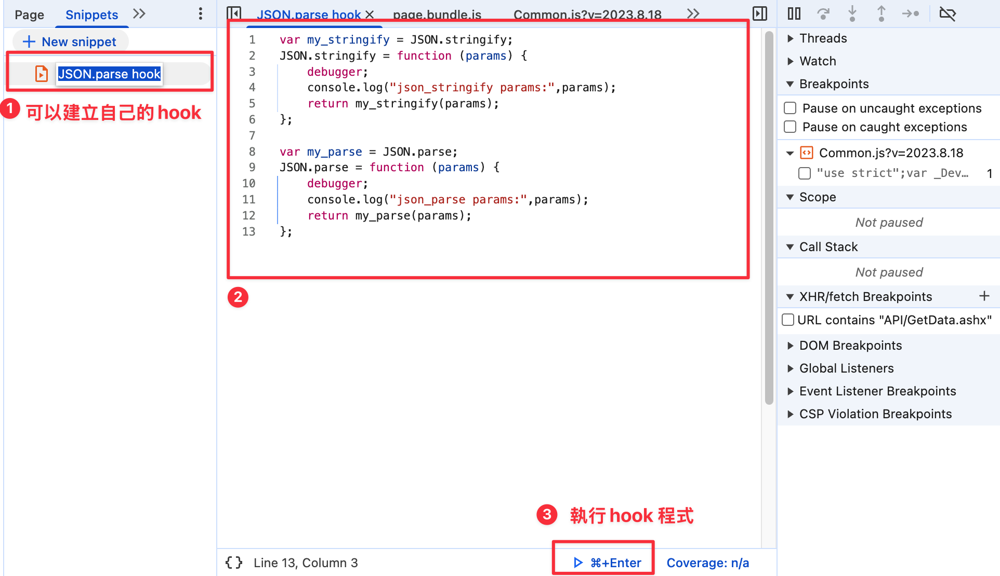
>
>    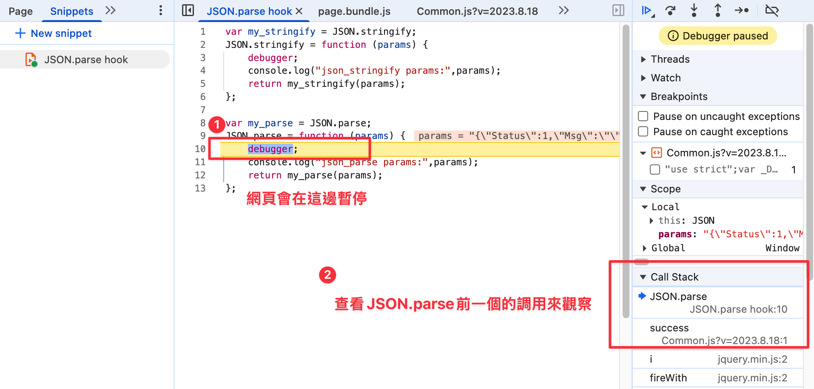
>
>    

> ###### 3. 編寫程式
>
> 進入到核心的解密程式中，將所有的程式複製下來
>
> > [!important]
> >
> > 因為裡面的this太多，不能只把那幾行解密函式複製出來，因為**它太依賴原本的環境了，你必須把整個相關的物件或模組全部搬過來**
>
> *[<kbd> endata.js  </kbd>](Python逆向爬蟲.assets/code/endata.js)* *[<kbd> endata.py  </kbd>](Python逆向爬蟲.assets/code/endata.py)*

## 實戰案例-AES

* 網站地址：https://www.swguancha.com/home/business-observe
* API地址：client/v1/article/client/page
* 該網站API返回的資料為密文，需要解密

> ###### 1. 查看返回的response資料
>
> 翻頁觸發API請求，回傳的response有經過加密，前端接收到response字符串後可能需要透過**js解密並轉換成JSON格式**
>
> 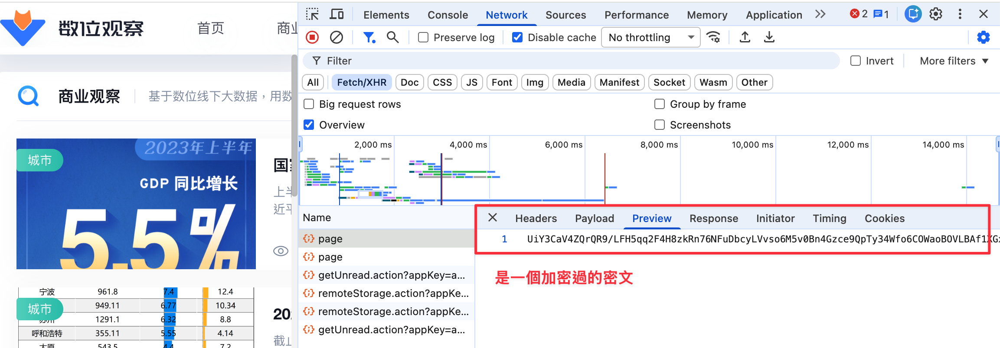

> ###### 2. 定位解密函數 
>
> 嘗試使用 `JSON.parse` 或是 `decrypt(` 來做關鍵字搜尋，並打上斷點查看是否為加密的response資料
>
> 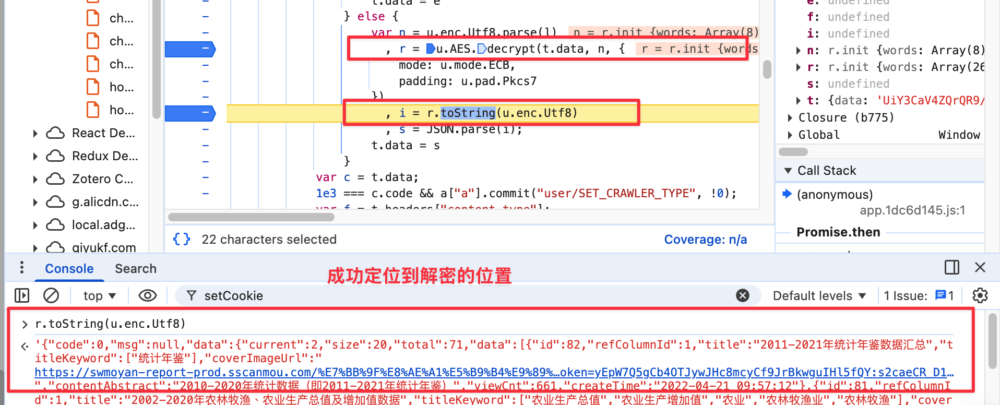

> ###### 3. 編寫程式
>
> 將網站原始程式碼複製貼上到js文件中，並導入crypto-js套件測試是否為標準AES加密
>
> 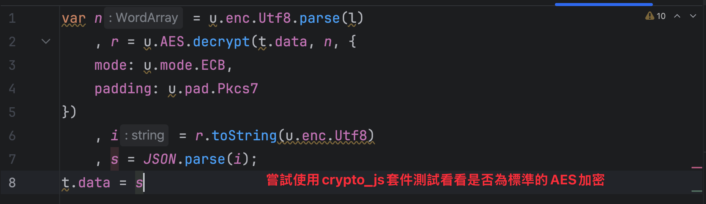
>
> 
>
> ```javascript
> const crypto_js = require('crypto-js')
> 
> const l = "QV1f3nHn2qm7i3xrj3Y9K9imDdGTjTu9"
> 
> function AES_decrypt(data) {
>     var n = crypto_js.enc.Utf8.parse(l)
>         , r = crypto_js.AES.decrypt(data, n, {
>         mode: crypto_js.mode.ECB,
>         padding: crypto_js.pad.Pkcs7
>     })
>     return r.toString(crypto_js.enc.Utf8)
> }
> ```
>
> ```python
> import requests
> import execjs
> import json
> 
> 
> 
> headers = {
>     "Accept": "application/json, text/plain, */*",
>     "Accept-Language": "zh-TW,zh;q=0.9,en-US;q=0.8,en;q=0.7,ja;q=0.6",
>     "Cache-Control": "no-cache",
>     "Connection": "keep-alive",
>     "Content-Type": "application/json;charset=UTF-8",
>     "Origin": "https://www.swguancha.com",
>     "Pragma": "no-cache",
>     "Referer": "https://www.swguancha.com/",
>     "Sec-Fetch-Dest": "empty",
>     "Sec-Fetch-Mode": "cors",
>     "Sec-Fetch-Site": "same-site",
>     "User-Agent": "Mozilla/5.0 (Macintosh; Intel Mac OS X 10_15_7) AppleWebKit/537.36 (KHTML, like Gecko) Chrome/142.0.0.0 Safari/537.36",
>     "deviceType": "1",
>     "sec-ch-ua": "\"Chromium\";v=\"142\", \"Google Chrome\";v=\"142\", \"Not_A Brand\";v=\"99\"",
>     "sec-ch-ua-mobile": "?0",
>     "sec-ch-ua-platform": "\"macOS\""
> }
> url = "https://app.swguancha.com/client/v1/article/client/page"
> data = {
>     "queryType": 3,
>     "current": 1,
>     "size": 20
> }
> data = json.dumps(data, separators=(',', ':'))
> response = requests.post(url, headers=headers, data=data)
> 
> with open('商業觀察.js', 'r', encoding='utf-8') as f:
>     js_code = f.read()
> ctx = execjs.compile(js_code)
> result = ctx.call("AES_decrypt", response.text)
> 
> print(result)
> ```
>
> 

# 非對稱加密

==公鑰鎖上的東西，只有私鑰打得開（反之亦然）==

* **公鑰（Public Key）：** 可以公開給任何人，用來「加密」或是「驗證簽章」
* **私鑰（Private Key）：** 必須由擁有者嚴格保管，絕不外洩，用來「解密」或是「製作簽章」

非對稱加密（Asymmetric Encryption），也被稱為公開金鑰加密（Public-Key Cryptography），是現代網路安全非常核心的一種技術，它解決了傳統加密方法中「如何安全傳遞鑰匙」的難題

常見的非對稱加密演算法：

* **建立安全通道：HTTPS/TLS 協定**：網站最基礎的安全防護，主要利用非對稱加密來完成「密鑰交換」，也就是解決了這兩端如何安全地協商出一把共同密鑰的問題
* **強化敏感資料：前端密碼/數據加密**：HTTPS 之上的一層額外保護（Defense in Depth），即使 HTTPS 流量被攔截或在某些環節被解密（例如公司內網的 Proxy），攻擊者拿到的密碼欄位仍然是無法閱讀的亂碼
* **確保資料真實性：數位簽章 (Signature)**：側重於「防篡改」與「身分認證」，常見於 API 串接或金融數據傳輸，確保收到的數據真的是由信任的發送方產生，且中途沒有被動手腳

> [!note]
>
> * 前兩者（HTTPS、密碼加密）是「**公鑰加密、私鑰解密**」，為了保密
> * 第三者（簽章驗證）是「**私鑰簽署、公鑰驗證**」，為了信任
>
> 公鑰、私鑰兩者都可以用來加密解密

*^tab^*

> **JavaScript實現**
>
> 非對稱加密不能使用之前的 `crypto-js` ，需要安裝 `npm install node-rsa --save` 套件
>
> 
>
> ```javascript
> const NodeRSA = require('node-rsa');
> 
> class RSAEncryption {
>     constructor(keySize = 1024) {
>         this.rsaKey = new NodeRSA({b: keySize});
>         this.publicKey = this.rsaKey.exportKey('pkcs8-public');
>         this.privateKey = this.rsaKey.exportKey('pkcs8-private');
>     }
> 
>     encrypt(data) {
>         const key = new NodeRSA(this.publicKey, 'pkcs8-public');
>         return key.encrypt(data, 'base64');
>     }
> 
>     decrypt(encryptedData) {
>         const key = new NodeRSA(this.privateKey, 'pkcs8-private');
>         return key.decrypt(encryptedData, 'utf8');
>     }
> 
> }
> 
> const my_rsa = new RSAEncryption(1024);
> const data = "Hello, RSA!";
> enc_data = my_rsa.encrypt(data)
> console.log("Encrypted Data:", enc_data);
> dec_data = my_rsa.decrypt(enc_data)
> console.log("Decrypted Data:", dec_data);
> ```
>
> 

>**Python實現**
>
>需要先安裝rsa套件： `pip install rsa`
>
>因為加密後的結果有反斜線 `\`，所以還需要透過base64編碼
>
>```python
>import rsa
>import base64
>
>
>def generate_keys():
>    """Generate a pair of RSA public and private keys."""
>    (public_key, private_key) = rsa.newkeys(1024)
>    # print("public_key:", public_key)
>    # print("private_key:", private_key)
>    return public_key, private_key
>
>def encrypt_data(public_key, data):
>    """Encrypt data using the provided RSA public key."""
>    encrypted_data = rsa.encrypt(data.encode('utf-8'), public_key)
>    # print("encrypted_data:", encrypted_data)
>    return base64.b64encode(encrypted_data)
>
>def decrypt_data(private_key, encrypted_data):
>    """Decrypt data using the provided RSA private key."""
>    encrypted_data = base64.b64decode(encrypted_data)
>    decrypted_data = rsa.decrypt(encrypted_data, private_key)
>    # print("decrypted_data:", decrypted_data)
>    return decrypted_data.decode('utf-8')
>
>pub_key, pri_key = generate_keys()
>sample_data = "Hello, RSA!"
>encrypted = encrypt_data(pub_key, sample_data)
>decrypted = decrypt_data(pri_key, encrypted)
>```

