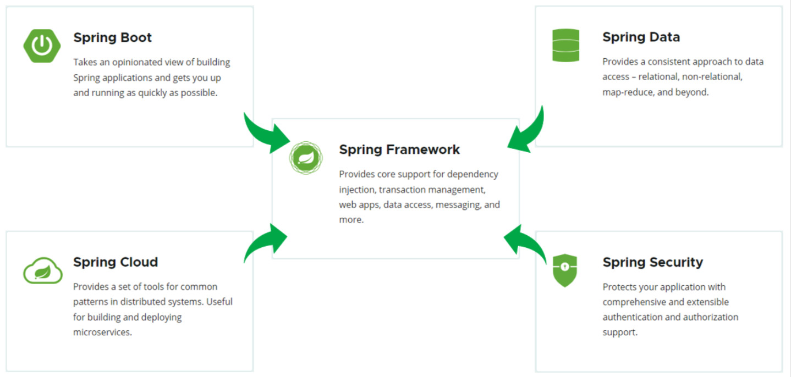
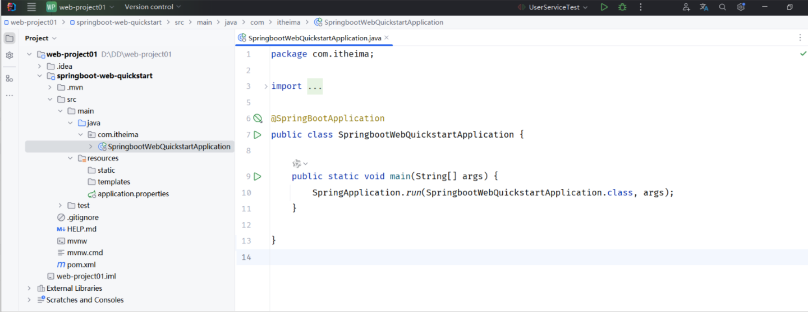

###### ~VLOOK™~ *[<kbd> VLOOK </kbd>](https://github.com/MadMaxChow/VLOOK)*<br>後端開發學習筆記-SpringBoot<br>──<br><u>簡介</u><br>*本篇筆記是使用[<kbd> Typora</kbd>](https://typora.io/)及[<kbd> Markdown</kbd>](https://markdown.tw/)<br>結合GitHub開源模版撰寫而成並導出成HTML*<br>**JamesZhan**<br>*不允許複製下載`僅供閱覽`* *版本日期`2025年6月6日`*

[TOC]

# 什麼是SpringBoot

==基於 Spring Framework 的快速開發框架，它簡化了 Spring 應用的配置和部署過程，讓Java開發更容易==

> *[<kbd> Spring  </kbd>](https://spring.io/)*

Spring全家桶這麼多的技術，最基礎、最核心的是 SpringFramework。其他的spring全家桶的技術，都是基於SpringFramework

而如果我們在項目中，直接基於**SpringFramework**進行開發，存在兩個問題：

- 配置繁瑣_~Rd~_
- 入門難度大_~Rd~_



spring發展到今天已經形成了一種開發生態圈，提供多個子項目，每個項目用於完成特定的功能。而我們在項目開發時，一般會偏向於選擇這一套spring家族的技術，來解決對應領域的問題，那我們稱這一套技術為**spring全家桶**

# 建立SpringBoot項目 

> 需求：基於SpringBoot的方式開發一個web應用，瀏覽器發起請求/hello後，給瀏覽器返回字串 "Hello xxx ~”
>
> 
>
> _~Rd!~_

*^tab^*

> **Step1:建立SpringBoot**
>
> 1. 基於Spring官方架構建立SpringBoot項目
>
>     
>
> 2. 填寫基本資訊，勾選web開發相關依賴
>
>     
>
>     > [!Warning]
>     >
>     > SpringBoot官方提供裡面只能夠選擇SpringBoot的幾個最新的版本，如果要選擇其他低一點的版本，可以在springboot項目建立完畢之後，修改項目的pom.xml檔案中的版本號
>
> 3. 點選Create之後，就會連網建立這個SpringBoot項目
>
>     

> [!note]
>
> SpringBoot配置好後，會產生一個pom.xml檔案
>
> *  父項目配置
>
>     
>
> * 項目座標
>
>     
>
> * JDK 版本
>
>     
>
> * 項目依賴：**沒有指定版本，因為已經在父項目配置指定**
>
>     
>
> * SpringBoot打包套件 
>
>     

> **Step2：定義類**
>
> 1. 在自定義的package下，新增一個類：`HelloController`
>
>     
>
> 2. HelloController中的內容，具體如下：
>
>     ```java
>     package com.devnote.demo;
>             
>     import org.springframework.web.bind.annotation.RequestMapping;
>     import org.springframework.web.bind.annotation.RestController;
>             
>     @RestController // 標注當前類是一個請求處理類
>     public class HelloController {
>             
>         @RequestMapping("/hello") // 標註請求路徑
>         public String hello(String name) {
>             System.out.println("HelloController name = " + name);
>             return "Hello, " + name;
>         }
>     }
>     ```

> **Step3：執行測試**
>
> 1. 執行SpringBoot自動生成的引導類 (標識有 `@SpringBootApplication` 註解的類)
>
>     
>
>     
>
> 2. 打開瀏覽器輸入輸入：`http://localhost:8080/hello?name=James`
>
>     


> [!note]
>
> **為什麼一個main方法就可以將Web應用啟動了？**
>
> 因為在建立springboot項目的時候，我們就選擇了web開發的起步依賴 
>
> * spring-boot-starter-web
> * spring-boot-starter-test
>
> 而spring-boot-starter-web又依賴了spring-boot-starter-tomcat，由於maven的依賴傳遞特性，在我們建立的springboot項目中也就已經有了tomcat的依賴，當我們執行main方法，其實就是啟動springboot依賴中的Tomcat伺服器
>
> 

# HTTP協議

HTTP：Hyper Text Transfer Protocol(超文字傳輸協議)，規定了瀏覽器與伺服器之間資料傳輸的規則

* 基於TCP協議: 建立連接之前是需要經過三次握手，比較安全
* 基於請求-響應模型:   一次請求對應一次響應（先請求後響應）
* HTTP協議是無狀態協議:  對於資料沒有記憶能力。每次請求-響應都是獨立的


## 請求協議

瀏覽器將資料以請求格式傳送到伺服器。包括：請求行、要求標頭 、請求體

> **GET請求**
>
> 
>
> > 請求行_~Rd~_：由：請求方式、資源路徑、協議/版本組成（之間使用空格分隔）
> >
> >   - 請求方式：GET  
> >   - 資源路徑：/brand/findAll?name=OPPO&status=1
> >     - 請求路徑：/brand/findAll
> >     - 請求參數：name=OPPO&status=1
> >       - 請求參數是以key=value形式出現
> >       - 多個請求參數之間使用&連接
> >     - 請求路徑和請求參數之間使用?連接                          
> >   - 協議/版本：HTTP/1.1  e
>
> > 請求頭_~Ye~_ ：第二行開始，格式為key: value形式
> >
> >   - http是個無狀態的協議，所以在請求頭設定瀏覽器的一些自身資訊和想要響應的形式。這樣伺服器在收到資訊後，就可以知道是誰，想幹什麼了
> >   - 常見的HTTP要求標頭有:
> >
> >     |       請求頭        |                             含義                             |
> >     | :-----------------: | :----------------------------------------------------------: |
> >     |      ==Host==       |                       表示請求的主機名                       |
> >     |   ==User-Agent==    | 瀏覽器版本。 例如：Chrome瀏覽器的標識類似Mozilla/5.0 ...Chrome/79 ，IE瀏覽器的標識類似Mozilla/5.0 (Windows NT ...)like Gecko |
> >     |     ==Accept==      |   表示瀏覽器能接收的資源類型，如text/，image/或者/表示所有   |
> >     | ==Accept-Language== |    表示瀏覽器偏好的語言，伺服器可以據此返回不同語言的網頁    |
> >     | ==Accept-Encoding== |      表示瀏覽器可以支援的壓縮類型，例如gzip, deflate等       |
> >     |  ==Content-Type==   |                      請求主體的資料類型                      |
> >     | ==Content-Length==  |                資料主體的大小（單位：位元組）                |

> **POST請求**
>
> 
>
> > 請求行_~Rd~_：由：請求方式、資源路徑、協議/版本組成（之間使用空格分隔）
> >
> >   - 請求方式：POST
> > - 資源路徑：/brand
> > - 協議/版本：HTTP/1.1
>
> > 請求頭_~Ye~_ ：第二行開始，格式為key: value形式
>
> > 請求體_~Gn~_：請求體和請求頭之間是有一個換行隔開

|   區別方式   |                           GET請求                            |       POST請求       |
| :----------: | :----------------------------------------------------------: | :------------------: |
|   請求參數   | 請求參數在請求行中。<br/>例：/brand/findAll?name=OPPO&status=1 |  請求參數在請求體中  |
| 請求參數長度 |           請求參數長度有限制(瀏覽器不同限制也不同)           | 請求參數長度沒有限制 |
|    安全性    |         安全性低。原因：請求參數暴露在瀏覽器網址列中         |     安全性相對高     |

### 獲得請求資料

Web伺服器（Tomcat）對HTTP協議的請求資料進行解析並封裝(HttpServletRequest)，在呼叫Controller方法的時候傳遞給了該方法。這樣，就使得程式設計師不必直接對協議進行操作，讓Web開發更加便捷


> **示範**
>
> 想取得以下資料：
>
> 
>
> 
>
> ```java
> package com.devnote.demo;
> 
> import jakarta.servlet.http.HttpServletRequest;
> import org.springframework.web.bind.annotation.RequestMapping;
> import org.springframework.web.bind.annotation.RestController;
> 
> @RestController
> public class RequestController {
> 
>     @RequestMapping("/request")
>     public String request(HttpServletRequest request){
>         // 1. 獲取請求方式
>         String method = request.getMethod();
>         System.out.println("method: " + method);
> 
>         // 2.獲取請求路徑
>         String pathURI = request.getRequestURI();
>         System.out.println("pathURI: " + pathURI);
> 
>         String path = request.getRequestURL().toString();
>         System.out.println("path: " + path);
> 
>         // 3.獲取請求協議
>         String protocol = request.getProtocol();
>         System.out.println("protocol: " + protocol);
> 
>         // 4.獲取請求參數
>         String name = request.getParameter("name");
>         String age = request.getParameter("age");
>         System.out.println("name: " + name + ", age: " + age);
> 
>         // 5.獲取請求頭
>         String header = request.getHeader("User-Agent");
>         System.out.println("header: " + header);
>         return "ok";
>     }
> }
> ```
>
> 輸出結果：
>
> 

## 響應協議

Web伺服器對HTTP協議的響應資料進行了封裝(HttpServletResponse)，並在呼叫Controller方法的時候傳遞給了該方法


| 狀態碼分類 | 說明                                                         |
| :--------: | :----------------------------------------------------------- |
|    1xx     | **響應中**：臨時狀態碼。表示請求已經接受，告訴客戶端應該繼續請求或者如果已經完成則忽略 |
|    2xx     | **成功**：表示請求已經被成功接收，處理已完成                 |
|    3xx     | **重新導向**：重新導向到其它地方，讓客戶端再發起一個請求以完成整個處理 |
|    4xx     | **客戶端錯誤**：處理髮生錯誤，責任在客戶端，如：客戶端的請求一個不存在的資源，客戶端未被授權，禁止訪問等 |
|    5xx     | **伺服器端錯誤**：處理髮生錯誤，責任在伺服器端，如：伺服器端拋出異常，路由出錯，HTTP版本不支援等 |

| HTTP 標頭            | 作用說明                                | 範例                                       | 用途                       |
| -------------------- | --------------------------------------- | ------------------------------------------ | -------------------------- |
| **Content-Type**     | 表示該響應內容的類型                    | `text/html` `application/json` `image/png` | 告訴瀏覽器如何解析內容     |
| **Content-Length**   | 表示該響應內容的長度（字節數）          | `Content-Length: 1024`                     | 幫助客戶端了解數據大小     |
| **Content-Encoding** | 表示該響應壓縮算法                      | `gzip` `deflate` `br`                      | 減少傳輸數據量，提升性能   |
| **Cache-Control**    | 指示客戶端應如何緩存                    | `max-age=300` `no-cache` `public`          | 控制緩存策略，優化載入速度 |
| **Set-Cookie**       | 告訴瀏覽器為當前頁面所在的域設置 cookie | `sessionId=abc123; Path=/`                 | 維持用戶狀態和會話管理     |

### 設置響應狀態

*^tab^*

> **方法1：基於HttpServletResponse輸出流**
>
> ```java
> package com.devnote.demo;
> 
> import jakarta.servlet.http.HttpServletResponse;
> import org.springframework.web.bind.annotation.RequestMapping;
> import org.springframework.web.bind.annotation.RestController;
> import java.io.IOException;
> 
> @RestController
> public class ResponseController {
> 
>     /**
>      * 方法1: 響應數據基於HttpServletResponse輸出流
>      * @param response
>      */
>     @RequestMapping("/response")
>     public void response(HttpServletResponse response) throws IOException {
>         // 1. 設置狀態碼
>         response.setStatus(401);
> 
>         // 2. 設置響應頭
>         response.setHeader("name", "James");
> 
>         // 3. 設置響應體
>         response.setContentType("text/html;charset=utf-8");
>         response.setCharacterEncoding("utf-8");
>         response.getWriter().write("<h1>Hello, World!</h1>");
>     }
> }
> 
> ```

> **方法2：於ResponseEntity輸出流**
>
> ```java
> package com.devnote.demo;
> 
> import jakarta.servlet.http.HttpServletResponse;
> import org.springframework.web.bind.annotation.RequestMapping;
> import org.springframework.web.bind.annotation.RestController;
> import java.io.IOException;
> import org.springframework.http.ResponseEntity;
> 
> @RestController
> public class ResponseController {
>     /**
>      * 方法2: 響應數據基於ResponseEntity輸出流
>      * @param response
>      * @return
>      * @throws IOException
>      */
>     @RequestMapping("/response2")
>     public ResponseEntity<String> response2(HttpServletResponse response) throws IOException {
>         return ResponseEntity
>             .status(401)
>             .header("name", "James")
>             .body("<h1>Hello, World!</h1>");
>     }
> }
> 
> ```

> [!caution]
>
> **響應狀態碼**和**響應頭**如果沒有特殊要求的話，通常不手動設定。伺服器會根據請求處理的邏輯，自動設定響應狀態碼和響應頭

# SpringBoot實戰

## 需求說明

基於SpringBoot開發web網頁，完成使用者列表的渲染展示

當在瀏覽器網址列訪問前端靜態頁面（http://localhost:8080/user.html）後，在前端頁面上會傳送ajax請求，請求伺服器端（http://localhost:8080/list），伺服器端程序載入 user.txt 檔案中的資料，讀取出來後最終給前端頁面響應json格式的資料，前端頁面再將資料渲染展示在表格中


*[<kbd> user.txt  </kbd>](SpringBoot.assets/code/user.txt)* *[<kbd> static  </kbd>](SpringBoot.assets/code/static.zip)*

## 實現程式碼(IDE：Cursor)

### 建立SpringBoot項目

1. 建立一個SpringBoot項目，選擇版本、編譯語言，並勾選web依賴、lombok依賴

    

    > [!note]
    >
    > Lombok 是一個強大的 Java 開發工具庫，透過註解（Annotation）的方式，在編譯時期自動生成常見的重複性程式碼，如 `getter`、`setter`、`toString`、`equals`、`hashCode` 等方法，大幅減少開發者需要手動撰寫的樣板程式碼，提升開發效率並讓程式碼更加簡潔易讀

2. 引入資料中準備好的資料檔案user.txt，以及static下的前端靜態頁面

    

### 建立用戶資訊類

在` com.james` 下再定義一個包 `pojo`，專門用來存放實體類。 在該包下定義一個實體類`User`

```java
package com.james.pojo;

import java.time.LocalDateTime;

import lombok.AllArgsConstructor;
import lombok.NoArgsConstructor;
import lombok.Data;
import com.fasterxml.jackson.annotation.JsonFormat;

@Data
@AllArgsConstructor
@NoArgsConstructor
public class User {
    private Integer id;
    private String username;
    private String password;
    private String name;
    private Integer age;
    
    @JsonFormat(pattern = "yyyy-MM-dd HH:mm:ss")
    private LocalDateTime updateTime;

}
```

> [!note]
>
> * `@Data` - 全套基本功能
>
>     * ✅ **所有欄位的 getter 方法**
>
>     * ✅ **所有欄位的 setter 方法**
>
>     * ✅ **toString() 方法**
>
>     * ✅ **equals() 方法**
>
>     * ✅ **hashCode() 方法**
>
>     * ✅ **無參數建構子**（但如果有其他建構子就不會生成）
>
> * `@AllArgsConstructor` - 全參數建構子
>
>     ```java
>     // 自動生成這個建構子
>     public User(String name, int age, String email) {
>         this.name = name;
>         this.age = age;
>         this.email = email;
>     }
>     ```
>
> * `@NoArgsConstructor` - 無參數建構子
>
>     ```java
>     // 自動生成這個建構子
>     public User() {
>     }
>     ```

### 後端程式

由於在案例中，需要讀取文字中的資料，並且還需要將對象轉為json格式，所以在項目中再引入一個常用的工具包hutool

- `pom.xml` 中引入依賴

    ```xml
    <dependency>
        <groupId>cn.hutool</groupId>
        <artifactId>hutool-all</artifactId>
        <version>5.8.27</version>
    </dependency>
    ```

- 在 `com.james` 包下新建一個子包 `controller`，在其中建立一個 `UserController`

    ```java
    package com.james.controller;
    
    import java.io.InputStream;
    import java.util.ArrayList;
    import java.util.List;
    import java.nio.charset.StandardCharsets;
    import java.time.LocalDateTime;
    import java.time.format.DateTimeFormatter;
    
    import cn.hutool.core.io.IoUtil;
    import com.james.pojo.User;
    
    import org.springframework.web.bind.annotation.RequestMapping;
    import org.springframework.web.bind.annotation.RestController;
    
    @RestController
    public class UserController {
    
        @RequestMapping("/list")
        public List<User> list() throws Exception{
            // 1. 加載.txt資料
            InputStream in = this.getClass().getClassLoader().getResourceAsStream("user.txt");
            ArrayList<String> lines = IoUtil.readLines(in, StandardCharsets.UTF_8, new ArrayList<>());
    
            // 2. 解析資料，轉換成對象
            List<User> userList = lines.stream().map(line -> {
                String[] split = line.split(",");
                Integer id = Integer.parseInt(split[0]);
                String username = split[1];
                String password = split[2];
                String name = split[3];
                Integer age = Integer.parseInt(split[4]);
                LocalDateTime updateTime = LocalDateTime.parse(split[5], DateTimeFormatter.ofPattern("yyyy-MM-dd HH:mm:ss"));
                return new User(id, username, password, name, age, updateTime);
            }).toList();
    
            // 3. 自動返回json格式資料
            return userList;
        }
    }
    ```

    > [!note]
    >
    > 1. 取得檔案輸入串流，**檔案通常會放在resources**_~Rd~_
    >
    >     | 部分                                | 功能說明                                         |
    >     | ----------------------------------- | ------------------------------------------------ |
    >     | `this.getClass()`                   | 取得當前類別的 Class 物件                        |
    >     | `.getClassLoader()`                 | 取得類別載入器                                   |
    >     | `.getResourceAsStream("users.txt")` | 從 classpath 中找到 users.txt 並轉為 InputStream |
    >
    > 2. `lines.stream()` - 建立串流，`.map(line -> { ... })` - 轉換每一行
    >
    > 3. **從文字檔案 → Java 物件列表 → JSON 回應**

### 執行階段


可以在開發人員模式中看到，響應的資料都是以JSON格式呈現，這是是伺服器端自動將List資料型態轉換成JSON格式


> [!note]
>
> **為什麼會自動轉換成JSON格式的資料？**
>
> `@RestController` = `@ResponseBody` + `@Controller`
>
> 因為在程式中使用了`@RestController`，而他的底層邏輯使用了`@ResponseBody`
> `@ResponseBody`：將方法返回值直接響應給瀏覽器，如果返回值類型是實體對象/集合，將會轉換為JSON格式後在響應給瀏覽器
>
> 

> *[<kbd> 實戰完整程式碼  </kbd>](SpringBoot.assets/code/web1.zip)*

### 問題分析

雖然已經完成整個程式，但是會發現案例中：解析文字檔中的資料，處理資料的邏輯程式碼，給頁面響應的程式碼全部都堆積在一起了，全部都寫在controller方法中


當前程式的整個業務邏輯還是比較簡單的，如果業務邏輯再稍微複雜一點，我們會看到Controller方法的程式碼量就很大了

- 當我們要修改操作資料部分的程式碼，需要改動Controller
- 當我們要完善邏輯處理部分的程式碼，需要改動Controller
- 當我們需要修改資料響應的程式碼，還是需要改動Controller

就會造成我們整個程式碼的結構比較差，而且程式碼難以維護，可以考慮分層開發

# 分層解耦

==程式設計時儘可能讓每一個介面、類、方法的職責更簡單達成**高內聚、低耦合**_~Rd~_==

在我們進行程式設計時，儘可能讓每一個介面、類、方法的職責更簡單

* 什麼是耦合 (Coupling)：耦合是指軟體模組之間相互依賴的程度。高耦合意味著模組之間緊密相關，一個模組的改變會影響其他模組
* 什麼是內聚 (Cohesion)：內聚是指一個模組內部元素之間相關性和協作程度的度量。高內聚意味著模組內的所有元素都緊密相關，共同完成一個明確的功能


> [!note]
>
> 單一職責原則：一個類或一個方法，就只做一件事情，只管一塊功能。
> 這樣就可以讓類、介面、方法的複雜度更低，可讀性更強，擴展性更好，也更利於後期的維護


- Controller：**控制層**。接收前端傳送的請求，對請求進行處理，並響應資料
- Service：**業務邏輯層**。處理具體的業務邏輯
- Dao：**資料訪問層**(Data Access Object)，也稱為持久層。負責資料訪問操作，包括資料的增、刪、改、查

## 執行流程


1. 前端發起的請求，由Controller層接收（Controller響應資料給前端）
2. Controller層呼叫Service層來進行邏輯處理（Service層處理完後，把處理結果返回給Controller層）
3. Serivce層呼叫Dao層（邏輯處理過程中需要用到的一些資料要從Dao層獲取）
4. Dao層操作檔案中的資料（Dao拿到的資料會返回給Service層）

## 實戰程式拆分

使用三層架構思想，來改造下之前的程序：
- 控制層包名：`com.james.controller`
- 業務邏輯層包名：`com.james.service`
- 資料訪問層包名：`com.james.dao`

> [!note]
>
> 定義好package後，在各自的package下分別建立interface介面，以及他的實現類
>
> 


*^tab^*

> **Dao層**
>
> 1. 在dao包裡面建立一個介面interface：UserDao.java
>
>     ```java
>     package com.james.dao;
>     
>     import java.util.List;
>     
>     public interface UserDao {
>     
>         /**
>          * 查詢所有用戶
>          */
>         public List<String> findAll();
>     }
>       
>     ```
>
> 2. 在dao包裡面建立一個連包帶類的實現類：UserDaoImpl.java
>
>     ```java
>     package com.james.dao.impl;
>         
>     import com.james.dao.UserDao;
>     import java.util.List;
>     import java.io.InputStream;
>     import java.nio.charset.StandardCharsets;
>     import java.util.ArrayList;
>     import cn.hutool.core.io.IoUtil;
>     
>     
>     public class UserDaoImpl implements UserDao {
>         @Override
>         public List<String> findAll() {
>             // 1. 加載.txt資料
>             InputStream in = this.getClass().getClassLoader().getResourceAsStream("user.txt");
>             ArrayList<String> lines = IoUtil.readLines(in, StandardCharsets.UTF_8, new ArrayList<>());
>             return lines; 
>         }
>     }
>     ```

> **service層**
>
> 1. 在service包裡面建立一個介面interface：UserService.java
>
>     ```java
>     package com.james.service;
>     
>     import java.util.List;
>     
>     import com.james.pojo.User;
>     
>     public interface UserService {
>         /**
>          * 查詢所有用戶
>          */
>         public List<User> findAll();
>     
>     }
>     ```
>
> 2. 在service包裡面建立一個連包帶類的實現類：UserServiceImpl.java
>
>     > [!caution]
>     >
>     > service層要現獲得dao層的資料才要辦法繼續執行業務邏輯，所以使用多態的方式`private UserDao userDao=new UserDaoImpl();`
>
>     ```java
>     package com.james.service.impl;
>         
>     import com.james.dao.UserDao;
>     import com.james.dao.impl.UserDaoImpl;
>     import com.james.service.UserService;
>     import com.james.pojo.User;
>     import java.util.List;
>     import java.time.LocalDateTime;
>     import java.time.format.DateTimeFormatter;
>         
>     public class UserServiceImpl implements UserService {
>         
>         private UserDao userDao=new UserDaoImpl();
>         
>         @Override
>         public List<User> findAll() {
>             // 1. 加載.txt資料
>             List<String> lines = userDao.findAll();
>         
>             // 2. 解析資料，轉換成對象
>             List<User> userList = lines.stream().map(line -> {
>                 String[] split = line.split(",");
>                 Integer id = Integer.parseInt(split[0]);
>                 String username = split[1];
>                 String password = split[2];
>                 String name = split[3];
>                 Integer age = Integer.parseInt(split[4]);
>                 LocalDateTime updateTime = LocalDateTime.parse(split[5],
>                         DateTimeFormatter.ofPattern("yyyy-MM-dd HH:mm:ss"));
>                 return new User(id, username, password, name, age, updateTime);
>             }).toList();
>             return userList;
>         }
>         
>     }
>     ```

> **controller層**
>
> 1. 在controller包裡面建立一個類：UserController.java
>
>     ```java
>     package com.james.controller;
>         
>     import java.util.List;
>     import com.james.pojo.User;
>     import com.james.service.UserService;
>     import com.james.service.impl.UserServiceImpl;
>     import org.springframework.web.bind.annotation.RequestMapping;
>     import org.springframework.web.bind.annotation.RestController;
>         
>     @RestController
>     public class UserController {
>         
>         private UserService userService = new UserServiceImpl();
>         
>         @RequestMapping("/list")
>         public List<User> list() throws Exception{
>             // 1. 調用UserService 查詢所有用戶
>             List<User> userList = userService.findAll();
>         
>             // 2. 返回json
>             return userList;
>         }
>     }
>     ```

> *[<kbd> web1 拆分  </kbd>](SpringBoot.assets/code/web1拆分.zip)*

## 問題分析

現在程式中，需要什麼物件還是需要直接new一個對象，例如： `new UserServiceImpl()`、`new UserDaoImpl()`

可能由於業務改變，如果說需要更換實現類，`UserServiceImpl ` 不能滿足現有的業務需求，我們需要切換為 `UserServiceImpl2` 實現，就需要修改Contorller的程式碼，需要在建立 UserServiceImpl2物件時更改名稱`new UserServiceImpl2()`

兩個類之間還是有耦合關係存在!_~Rd~_


> **解耦方法**
>
> 1. 首先不能在UserController中使用new物件
>     但是這樣存在一個問題，如果不能建立物件，就表示這物件不存在，執行時就會報錯
>
>     
>
>     > [!note]
>     >
>     > **如果這時候有一個容器……**
>     >
>     > **Spring 容器** 就像一個超級智能的倉庫管理員，它會
>     >
>     > 1.  提前準備好所有物件
>     > 2. 自動配送物件到需要的地方
>     > 3.  解決物件不存在的問題
>
> 2. 將要用到的對象交給一個容器管理，應用程式中用到這個物件，就直接從容器中獲取
>
>     

## IOC&DI入門

- **控制反轉**： Inversion Of Control，簡稱IOC。物件的建立控制權由程式自身轉移到外部（容器），這種思想稱為控制反轉
  - 容器稱為：IOC容器或Spring容器
  
- **依賴注入**： Dependency Injection，簡稱DI。容器為應用程式提供執行階段所依賴的資源，稱之為依賴注入
    - 程式執行時需要某個資源，此時容器就為其提供這個資源

      - 例：UserController程式執行時需要UserService物件，Spring容器就為其提供並注入UserService物件

- **Bean對象**：IOC容器中建立、管理的物件

如何實現：

1. 在實現類加上 `@Component` 註解，就代表把當前類產生的對象交給IOC容器管理
2. `@Autowired` 進行依賴注入

*^tab^*

> **實現類加上 @Component 註解**
>
> *==UserDaoImpl==*
>
> ```java
> package com.james.dao.impl;
> 
> import org.springframework.stereotype.Component;
> import com.james.dao.UserDao;
> import java.util.List;
> import java.io.InputStream;
> import java.nio.charset.StandardCharsets;
> import java.util.ArrayList;
> import cn.hutool.core.io.IoUtil;
> 
> @Component // 將類注入到Spring容器中
> public class UserDaoImpl implements UserDao {
>     @Override
>     public List<String> findAll() {
>         // 1. 加載.txt資料
>         InputStream in = this.getClass().getClassLoader().getResourceAsStream("user.txt");
>         ArrayList<String> lines = IoUtil.readLines(in, StandardCharsets.UTF_8, new ArrayList<>());
>         return lines; 
>     }
> }
> ```
>
> *==UserServiceImpl==*
>
> ```java
> package com.james.service.impl;
> 
> import com.james.dao.UserDao; 
> import com.james.service.UserService;
> import com.james.pojo.User;
> import java.util.List;
> import java.time.LocalDateTime;
> import java.time.format.DateTimeFormatter;
> import org.springframework.beans.factory.annotation.Autowired;
> import org.springframework.stereotype.Component;
> 
> @Component // 將類注入到Spring容器中
> public class UserServiceImpl implements UserService {
> 
>     @Autowired // 執行時會自動查找該類型的Bean物件，並賦予值給userDao 
>     private UserDao userDao;
> 
>     @Override   
>     public List<User> findAll() {
>         // 1. 加載.txt資料
>         List<String> lines = userDao.findAll();
> 
>         // 2. 解析資料，轉換成對象
>         List<User> userList = lines.stream().map(line -> {
>             String[] split = line.split(",");
>             Integer id = Integer.parseInt(split[0]);
>             String username = split[1];
>             String password = split[2];
>             String name = split[3];
>             Integer age = Integer.parseInt(split[4]);
>             LocalDateTime updateTime = LocalDateTime.parse(split[5],
>                     DateTimeFormatter.ofPattern("yyyy-MM-dd HH:mm:ss"));
>             return new User(id, username, password, name, age, updateTime);
>         }).toList();
>         return userList;
>     }
> 
> }
> ```

> **@Autowired 進行依賴注入**
>
> *==UserServiceImpl==*
>
> ```java
> package com.james.service.impl;
> 
> import com.james.dao.UserDao; 
> import com.james.service.UserService;
> import com.james.pojo.User;
> import java.util.List;
> import java.time.LocalDateTime;
> import java.time.format.DateTimeFormatter;
> import org.springframework.beans.factory.annotation.Autowired;
> import org.springframework.stereotype.Component;
> 
> @Component // 將類注入到Spring容器中
> public class UserServiceImpl implements UserService {
> 
>     @Autowired // 執行時會自動查找該類型的Bean物件，並賦予值給userDao 
>     private UserDao userDao;
> 
>     @Override   
>     public List<User> findAll() {
>         // 1. 加載.txt資料
>         List<String> lines = userDao.findAll();
> 
>         // 2. 解析資料，轉換成對象
>         List<User> userList = lines.stream().map(line -> {
>             String[] split = line.split(",");
>             Integer id = Integer.parseInt(split[0]);
>             String username = split[1];
>             String password = split[2];
>             String name = split[3];
>             Integer age = Integer.parseInt(split[4]);
>             LocalDateTime updateTime = LocalDateTime.parse(split[5],
>                     DateTimeFormatter.ofPattern("yyyy-MM-dd HH:mm:ss"));
>             return new User(id, username, password, name, age, updateTime);
>         }).toList();
>         return userList;
>     }
> 
> }
> ```
>
> *==UserController==*
>
> ```java
> package com.james.controller;
> 
> import java.util.List;
> import com.james.pojo.User;
> import com.james.service.UserService;
> import org.springframework.beans.factory.annotation.Autowired;
> import org.springframework.web.bind.annotation.RequestMapping;
> import org.springframework.web.bind.annotation.RestController;
> 
> @RestController
> public class UserController {
> 
>     @Autowired
>     private UserService userService;
> 
>     @RequestMapping("/list")
>     public List<User> list() throws Exception{
>         // 1. 調用UserService 查詢所有用戶
>         List<User> userList = userService.findAll(); 
> 
>         // 2. 返回json
>         return userList;
>     }
> }
>    
> ```

> *[<kbd> web1 解耦  </kbd>](SpringBoot.assets/code/web1解耦.zip)*

## IOC詳解

IOC就是將對象的控制權交給Spring的IOC容器，由IOC容器建立及管理對象。IOC容器建立的對象稱為bean對象

在之前案例中，要把某個對象交給IOC容器管理，需要在類上新增一個 `@Component` 註解，而**Spring框架為了更好的標識bean對象到底歸屬於哪一層**_~Rd~_，又提供了`@Component`的衍生註解，這些衍生註解底層都是依賴`@Component`


|      註解       | 說明                                                     | 位置                                              |
| :-------------: | -------------------------------------------------------- | ------------------------------------------------- |
| ==@Component==  | 聲明bean的基礎註解                                       | 不屬於以下三類時，用此註解                        |
| ==@Controller== | @Component的衍生註解，@RestController底層就是@Controller | 標註在控制層類上                                  |
|  ==@Service==   | @Component的衍生註解                                     | 標註在業務層類上                                  |
| ==@Repository== | @Component的衍生註解                                     | 標註在資料訪問層類上（由於與mybatis整合，用的少） |

* 使用 `@Service` 註解聲明Service層的bean

    

* 使用 `@Repository` 註解聲明Dao層的bean

    

> [!caution]
>
> * 聲明bean的時候，可以通過註解的value屬性指定bean的名字，如果沒有指定，默認為類名首字母小寫
>
>     
>
> * 使用以上四個註解都可以聲明bean，但是在springboot整合web開發中，聲明控制器bean只能用`@Controller`

> [!note]
>
> 在程式中使用前面的四個註解聲明bean，一定會生效嗎？
>
> **不一定，bean想要生效，還需要被元件掃描**
>
> * 前面聲明bean的四大註解，要想生效需要被 `@ComponentScan` 掃描
>
> * 該註解雖然沒有顯式配置，但是實際上已經包含在了啟動類聲明註解 `@SpringBootApplication` 中，**默認掃描的範圍是啟動類所在包及其子包**
>
>     
>
> 
>
> 所以，我們在項目開發中，只需要按照如上項目結構，將項目中的所有的業務類，都放在啟動類所在包的子包中，就無需考慮元件掃描問題


## DI詳解

依賴注入，是指IOC容器要為應用程式去提供執行階段所依賴的資源，而資源指的就是物件，`@Autowired` 進行依賴注入，常見的方式，有以下三種：

1. **屬性注入(==推薦==)**

    ```java
    @RestController
    public class UserController {
    
        //方式一: 属性注入
        @Autowired
        private UserService userService;
        
    }
    ```

    > [!note]
    >
    > - 優點：程式碼簡潔、方便快速開發_~Gn~_
    > - 缺點：隱藏了類之間的依賴關係、可能會破壞類的封裝性_~Rd~_

2. **建構子注入(==推薦==)**

    ```java
    @RestController
    public class UserController {
    
        //方式二: 建構子注入
        private final UserService userService;
        
        @Autowired //如果當前類中只存在一個建構子, @Autowired可以省略
        public UserController(UserService userService) {
            this.userService = userService;
        }
        
     }   
    ```

    > [!note]
    >
    > - 優點：能清晰地看到類的依賴關係、提高了程式碼的安全性_~Gn~_
    > - 缺點：程式碼繁瑣、如果構造參數過多，可能會導致建構函式臃腫_~Rd~_

    > [!caution]
    >
    > * 通常會加入 `final`
    >
    > * 如果只有一個建構函式，`@Autowired` 註解可以省略
    >     （通常來說，也只有一個建構函式）

3. Setter 注入

    ```java
    /**
     * 使用者資訊Controller
     */
    @RestController
    public class UserController {
        
        //方式三: setter注入
        private UserService userService;
        
        @Autowired
        public void setUserService(UserService userService) {
            this.userService = userService;
        }
        
    }    
    ```

    > [!note]
    >
    > - 優點：保持了類的封裝性，依賴關係更清晰_~Gn~_
    > - 缺點：需要額外編寫setter方法，增加了程式碼量_~Rd~_

如果在IOC容器中，存在多個相同類型的bean對象，會出現什麼情況呢？在下面的例子中，準備了兩個UserService的實現類，並且都交給了IOC容器管理


Spring提供三種解決方案：

- `@Primary`：確定默認的實現**類**，提高類的優先級

    ```java
    @Primary
    @Service
    public class UserServiceImpl implements UserService {
        
    }
    ```

- `@Autowired` + `@Qualifier`：指定當前要注入的bean對象，在`@Qualifier`的`value`屬性中，指定注入的bean的名稱

    ```java
    @RestController
    public class UserController {
    
        @Qualifier("userServiceImpl")
        @Autowired
        private UserService userService;
    ```

    > [!caution]
    >
    > * 若是沒有取名， `value` 默認小寫
    > * `@Qualifier` 註解不能單獨使用，必須配合 `@Autowired` 使用

- `@Resource`：非Spring提供的方法，通過 `name` 屬性指定要注入的bean的名稱

    ```java
    @RestController
    public class UserController {
            
        @Resource(name = "userServiceImpl")
        private UserService userService;
    ```

    

#  The End<br>*Written by JamesZhan*<br><sub>若是內容有錯誤歡迎糾正 *[<kbd> Email</kbd>](mailto:henry16801@gmail.com?subject="內容錯誤糾正(非錯誤糾正可自行更改標題)")*</sub>