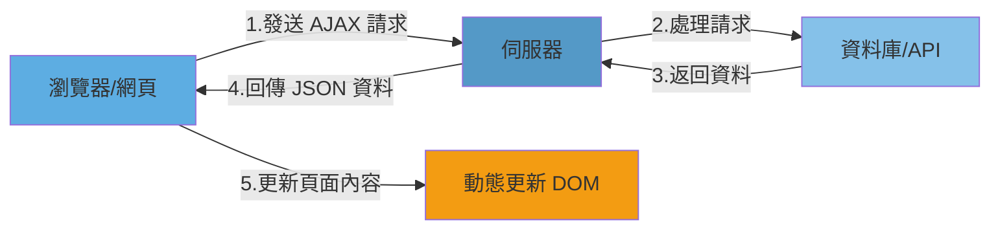

---
title:前端開發學習筆記-AJAX
vlook-doc-lib:
- [筆記網站跳轉](index.html?target=_self "快速挑轉到想要的網頁")
- [前端開發學習筆記★HTML](web_HTML.html?target=_self "網頁開發學習筆記★HTML")
- [前端開發學習筆記★CSS](web_CSS.html?target=_self "網頁開發學習筆記★CSS")
- [前端開發學習筆記★JS](web_JS.html?target=_self "網頁開發學習筆記★JS")
- [前端開發學習筆記★WebAPI](web_WebAPI.html?target=_self "網頁開發學習筆記★JS")
- [前端開發學習筆記★AJAX](web_AJAX.html?target=_self "網頁開發學習筆記★JS")
- [前端開發學習筆記★React](web_React.html?target=_self "網頁開發學習筆記★React")
---

######  ~VLOOK™~ *[<kbd> VLOOK </kbd>](https://github.com/MadMaxChow/VLOOK)*<br>前端開發學習筆記-AJAX──<br><u>簡介</u><br>*本篇筆記是使用[<kbd> Typora</kbd>](https://typora.io/)及[<kbd> Markdown</kbd>](https://markdown.tw/)<br>結合GitHub開源模版撰寫而成並導出成HTML*<br>**JamesZhan**<br>*不允許複製下載`僅供閱覽`* *版本日期`2025年6月1日`*


[TOC]

# 什麼是AJAX

**AJAX**（Asynchronous JavaScript and XML）是一種在不重新載入整個網頁的情況下，與**伺服器交換資料並更新部分網頁內容的技術**



## 怎麼用AJAX

1. 先使用 axios 套件，與伺服器進行資料通訊

   * 基於 XMLHttpRequest 封裝、程式碼簡單、月下載量在 14 億次
   * Vue、React 項目中都會用到 axios 

   > [!tip]
   >
   > 1. 引入 axios.js：https://cdn.jsdelivr.net/npm/axios/dist/axios.min.js 
   >
   >   ```bash
   >   # npm 安裝
   >   npm install axios
   >   ```
   >
   >   ```html
   >   # CDN 引入
   >   <script src="https://cdn.jsdelivr.net/npm/axios/dist/axios.min.js"></script>
   >   ```
   >
   > 2. 使用 axios 函數
   >
   >   * 傳入配置對象
   >   * 再用 .then 回呼函數接收結果，並做後續處理
   >
   >   ```javascript
   >   // 基本請求
   >   axios({
   >     // url: "請求地址URL"
   >     url: "http://hmajax.itheima.net/api/province"
   >   }).then(result => {
   >     // 對伺服器返回的資料作處理
   >     console.log(result);
   >     content.innerHTML = result.data.list.join('<br>')
   >   })
   >   ```
   >
   > 

2. 再了解 XMLHttpRequest 對象的使用，熟悉 AJAX 底層原理

## 什麼是URL

==**統一資源定位符**，簡單來說就是網路上資源的**地址**==

|     類型     |                 URL 範例                 |    說明     |
| :----------: | :--------------------------------------: | :---------: |
|   **網頁**   |         `https://www.google.com`         |  基本網站   |
|   **API**    |  `https://api.github.com/users/octocat`  | RESTful API |
| **文件下載** | `https://example.com/files/document.pdf` |  靜態文件   |
|  **帶參數**  | `https://search.com?q=javascript&page=2` |  搜索頁面   |


---

> 

> 

---

> 

> 

> [!note]
>
> **URL查詢參數**
>
> 瀏覽器提供給伺服器的額外資訊，讓伺服器返回瀏覽器想要的資料
>
> 語法：http://xxxx.com/xxx/xxx?參數名1=值1&參數名2=值2
>
> 這個參數名稱要看後端怎麼定義，前端才能作使用
>
> ```javascript
> // 基本請求
> axios({
>   // url: "請求地址URL"
>   url: "http://hmajax.itheima.net/api/city",
>   params:{
>   	pname:'河北省'
> 	}
> }).then(result => {
>   // 對伺服器返回的資料作處理
>   console.log(result);
>   content.innerHTML = result.data.list.join('<br>')
> })
> ```

## API文件

API 文件是描述應用程式介面 (Application Programming Interface) 如何使用的技術文檔，它詳細說明了開發者如何與 API 進行互動，例如：**URL**，**請求方法**，以及**參數**

*[<kbd> AJAX請求文件  </kbd>](https://s.apifox.cn/1b0dd84f-faa8-435d-b355-5a8a329e34a8)*


> [!important]
>
> 這個API文件由後端提供給前端做串接，上面詳細寫了如何請求及使用什麼參數等等

## 常用請求方法

這些是 RESTful API 設計中最常用的 HTTP 方法，每種方法都有其特定的用途和語義：

| 請求方法 |       操作       |
| :------: | :--------------: |
| ==GET==  |   ==獲取數據==   |
| ==POST== |   ==數據提交==   |
|   PUT    | 修改數據（全部） |
|  DELETE  |     刪除數據     |
|  PATCH   | 修改數據（部分） |

- **GET**：用於從服務器獲取資源，不會修改服務器上的數據
- **POST**：用於向服務器提交新數據，通常用於創建新資源
- **PUT**：用於完整更新現有資源，會替換整個資源
- **DELETE**：用於刪除服務器上的指定資源
- **PATCH**：用於部分更新現有資源，只修改指定的字段

## axios請求配置

* url：請求的 URL 網址
* **method**：請求的方法，**GET可以省略**（不區分大小寫）
* **data**：提交資料

```javascript
// 基本 Axios 請求語法
axios({
  url: '目標資源地址',
  method: '請求方法',
  data: {
      參數名: 值
  }
}).then((result) => {
  // 對服務器返回的數據做後續處理
  console.log(result.data);
})
```

> **註冊帳號**
>
> * 需求：通過 axios 提交使用者名稱和密碼，完成註冊功能
> * 註冊使用者 URL 地址：http://hmajax.itheima.net/api/register 
> * 請求方法：POST
> * 參數名：
>   * username 使用者名稱（中英文和數字組成，最少 8 位）
>   * password 密碼（最少 6 位）
>
> ```html
> <!DOCTYPE html>
> <html lang="en">
> 
> <head>
>   <meta charset="UTF-8">
>   <meta name="viewport" content="width=device-width, initial-scale=1.0">
>   <title>Document</title>
> </head>
> 
> <body>
>   <button class="btn">註冊</button>
>   <script src="https://cdn.jsdelivr.net/npm/axios/dist/axios.min.js"></script>
>   <script>
>     document.querySelector('.btn').addEventListener('click', () => {
>       axios({
>         // url: "請求地址URL"
>         url: "http://hmajax.itheima.net/api/register",
>         method: 'post',
>         data: {
>           username: 'Jfasdfasdf',
>           password: 'dfafdasdf'
>         }
>       }).then(result => {
>         // 對伺服器返回的資料作處理
>         console.log(result);
>       })
>     })
>   </script>
> </body>
> 
> </html>
> ```
>
> > [!tip]
> >
> > 真實註冊場景會有form表單可以填寫，再透過 form-serialize 套件可以一次行的獲取所有的表單內容，更快速更有效率
> >
> > ```javascript
> > document.getElementById('submitBtn').addEventListener('click', function(e) {
> >   e.preventDefault();
> >   
> >   const form = document.getElementById('myForm');
> >   const formData = serialize(form, { hash: true });
> >   
> >   // 使用 Axios 發送請求
> >   axios.post('/api/users', formData)
> >     .then(response => {
> >       console.log('提交成功:', response.data);
> >     })
> >     .catch(error => {
> >       console.error('提交失敗:', error);
> >     });
> > });
> > ```
> >
> > 

##  axios錯誤處理

當 HTTP 請求失敗時，在 then 方法的後面，通過呼叫 catch 方法，傳入回調函數並定義形參，捕獲和處理這些錯誤

``` javascript
// 基本錯誤處理
axios({
  url: 'https://api.example.com/users',
  method: 'GET'
}).then((response) => {
  console.log('請求成功:', response.data);
}).catch((error) => {
  console.error('請求失敗:', error);
});
```

>**重複註冊(彈窗錯誤提示)**
>
>
>
>```html
><!DOCTYPE html>
><html lang="en">
>
><head>
>  <meta charset="UTF-8">
>  <meta name="viewport" content="width=device-width, initial-scale=1.0">
>  <title>Document</title>
></head>
>
><body>
>  <button class="btn">註冊</button>
>  <script src="https://cdn.jsdelivr.net/npm/axios/dist/axios.min.js"></script>
>  <script>
>    document.querySelector('.btn').addEventListener('click', () => {
>      axios({
>        // url: "請求地址URL"
>        url: "http://hmajax.itheima.net/api/register",
>        method: 'post',
>        data: {
>          username: 'Jfasdfasdf',
>          password: 'dfafdasdf'
>        }
>      }).then(result => {
>        // 對伺服器返回的資料作處理
>        console.log(result);
>      }).catch(error => {
>        console.log(error);
>        console.log(error.response.data.message);
>        alert(error.response.data.message)
>      })
>    })
>  </script>
></body>
>
></html>
>```

# HTTP協議

==規定了瀏覽器傳送及伺服器返回內容的格式==

## request內容

瀏覽器按照 HTTP 協議要求的格式，傳送給伺服器的內容

* **請求行**：請求方法，URL，協議
* **請求標頭**：以鍵值對的格式攜帶的附加資訊，比如：Content-Type
* **請求體**：傳送的資源


> [!tip]
>
> 可以透過Chrome瀏覽器中的開發人員選項 F12 開啟查看
>
> 

## response內容

伺服器按照 HTTP 協議要求的格式，返回給瀏覽器的內容

* **響應行（狀態行）**：協議、HTTP 響應狀態碼、狀態資訊
* **響應頭**：以鍵值對的格式攜帶的附加資訊，比如：Content-Type
* **響應體**：返回的資源

---

> | 狀態碼  | 說明           |
> | ------- | -------------- |
> | 1xx     | 信息           |
> | ==2xx== | ==成功==       |
> | 3xx     | 重定向消息     |
> | ==4xx== | ==客戶端錯誤== |
> | 5xx     | 服務端錯誤     |

> 

> [!tip]
>
> 


# The End<br>*Written by JamesZhan*<br><sub>若是內容有錯誤歡迎糾正 *[<kbd> Email</kbd>](mailto:henry16801@gmail.com?subject="內容錯誤糾正(非錯誤糾正可自行更改標題)")*</sub>