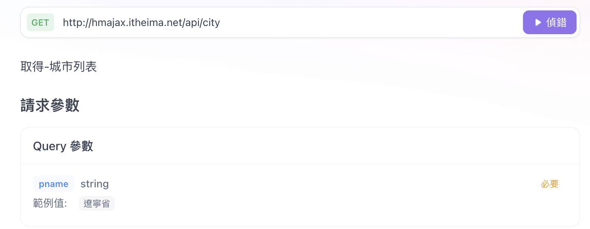
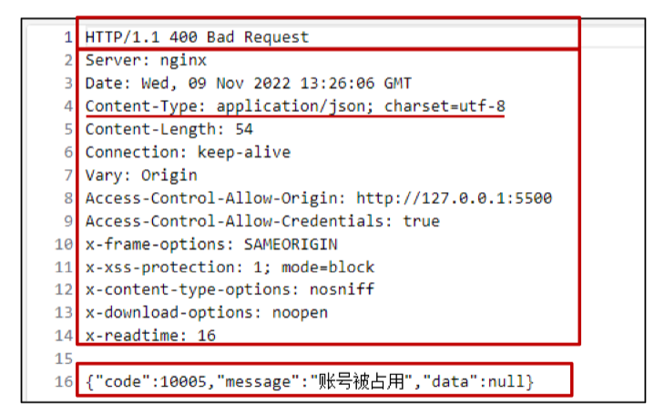
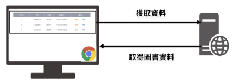

---
title:前端開發學習筆記-AJAX
vlook-doc-lib:
- [筆記網站跳轉](index.html?target=_self "快速挑轉到想要的網頁")
- [前端開發學習筆記★HTML](web_HTML.html?target=_self "網頁開發學習筆記★HTML")
- [前端開發學習筆記★CSS](web_CSS.html?target=_self "網頁開發學習筆記★CSS")
- [前端開發學習筆記★JS](web_JS.html?target=_self "網頁開發學習筆記★JS")
- [前端開發學習筆記★WebAPI](web_WebAPI.html?target=_self "網頁開發學習筆記★JS")
- [前端開發學習筆記★AJAX](web_AJAX.html?target=_self "網頁開發學習筆記★JS")
- [前端開發學習筆記★React](web_React.html?target=_self "網頁開發學習筆記★React")
---

######  ~VLOOK™~ *[<kbd> VLOOK </kbd>](https://github.com/MadMaxChow/VLOOK)*<br>前端開發學習筆記-AJAX──<br><u>簡介</u><br>*本篇筆記是使用[<kbd> Typora</kbd>](https://typora.io/)及[<kbd> Markdown</kbd>](https://markdown.tw/)<br>結合GitHub開源模版撰寫而成並導出成HTML*<br>**JamesZhan**<br>*不允許複製下載`僅供閱覽`* *版本日期`2025年6月1日`*


[TOC]

# 什麼是AJAX

**AJAX**（Asynchronous JavaScript and XML）是一種在不重新載入整個網頁的情況下，與**伺服器交換資料並更新部分網頁內容的技術**


## 怎麼用AJAX

1. 先使用 axios 套件，與伺服器進行資料通訊

   * 基於 XMLHttpRequest 封裝、程式碼簡單、月下載量在 14 億次
   * Vue、React 項目中都會用到 axios 

   > [!tip]
   >
   > 1. 引入 axios.js：https://cdn.jsdelivr.net/npm/axios/dist/axios.min.js 
   >
   >   ```bash
   >   # npm 安裝
   >   npm install axios
   >   ```
   >
   >   ```html
   >   # CDN 引入
   >   <script src="https://cdn.jsdelivr.net/npm/axios/dist/axios.min.js"></script>
   >   ```
   >
   > 2. 使用 axios 函數
   >
   >   * 傳入配置對象
   >   * 再用 .then 回呼函數接收結果，並做後續處理
   >
   >   ```javascript
   >   // 基本請求
   >   axios({
   >     // url: "請求地址URL"
   >     url: "http://hmajax.itheima.net/api/province"
   >   }).then(result => {
   >     // 對伺服器返回的資料作處理
   >     console.log(result);
   >     content.innerHTML = result.data.list.join('<br>')
   >   })
   >   ```
   >
   > 

2. 再了解 XMLHttpRequest 對象的使用，熟悉 AJAX 底層原理

## 什麼是URL

==**統一資源定位符**，簡單來說就是網路上資源的**地址**==

|     類型     |                 URL 範例                 |    說明     |
| :----------: | :--------------------------------------: | :---------: |
|   **網頁**   |         `https://www.google.com`         |  基本網站   |
|   **API**    |  `https://api.github.com/users/octocat`  | RESTful API |
| **文件下載** | `https://example.com/files/document.pdf` |  靜態文件   |
|  **帶參數**  | `https://search.com?q=javascript&page=2` |  搜索頁面   |


---

> 

> 

---

> 

> 

> [!note]
>
> **URL查詢參數**
>
> 瀏覽器提供給伺服器的額外資訊，讓伺服器返回瀏覽器想要的資料
>
> 語法：http://xxxx.com/xxx/xxx?參數名1=值1&參數名2=值2
>
> 這個參數名稱要看後端怎麼定義，前端才能作使用
>
> ```javascript
> // 基本請求
> axios({
>   // url: "請求地址URL"
>   url: "http://hmajax.itheima.net/api/city",
>   params:{
>   	pname:'河北省'
> 	}
> }).then(result => {
>   // 對伺服器返回的資料作處理
>   console.log(result);
>   content.innerHTML = result.data.list.join('<br>')
> })
> ```

## API文件

API 文件是描述應用程式介面 (Application Programming Interface) 如何使用的技術文檔，它詳細說明了開發者如何與 API 進行互動，例如：**URL**，**請求方法**，以及**參數**

*[<kbd> AJAX請求文件  </kbd>](https://s.apifox.cn/1b0dd84f-faa8-435d-b355-5a8a329e34a8)*



> [!important]
>
> 這個API文件由後端提供給前端做串接，上面詳細寫了如何請求及使用什麼參數等等

## 常用請求方法

這些是 RESTful API 設計中最常用的 HTTP 方法，每種方法都有其特定的用途和語義：

| 請求方法 |       操作       |
| :------: | :--------------: |
| ==GET==  |   ==獲取數據==   |
| ==POST== |   ==數據提交==   |
|   PUT    | 修改數據（全部） |
|  DELETE  |     刪除數據     |
|  PATCH   | 修改數據（部分） |

- **GET**：用於從服務器獲取資源，不會修改服務器上的數據
- **POST**：用於向服務器提交新數據，通常用於創建新資源
- **PUT**：用於完整更新現有資源，會替換整個資源
- **DELETE**：用於刪除服務器上的指定資源
- **PATCH**：用於部分更新現有資源，只修改指定的字段

## axios請求配置

* url：請求的 URL 網址
* **method**：請求的方法，**GET可以省略**（不區分大小寫）
* **data**：提交資料

```javascript
// 基本 Axios 請求語法
axios({
  url: '目標資源地址',
  method: '請求方法',
  data: {
      參數名: 值
  }
}).then((result) => {
  // 對服務器返回的數據做後續處理
  console.log(result.data);
})
```

> **註冊帳號**
>
> * 需求：通過 axios 提交使用者名稱和密碼，完成註冊功能
> * 註冊使用者 URL 地址：http://hmajax.itheima.net/api/register 
> * 請求方法：POST
> * 參數名：
>   * username 使用者名稱（中英文和數字組成，最少 8 位）
>   * password 密碼（最少 6 位）
>
> ```html
> <!DOCTYPE html>
> <html lang="en">
> 
> <head>
>   <meta charset="UTF-8">
>   <meta name="viewport" content="width=device-width, initial-scale=1.0">
>   <title>Document</title>
> </head>
> 
> <body>
>   <button class="btn">註冊</button>
>   <script src="https://cdn.jsdelivr.net/npm/axios/dist/axios.min.js"></script>
>   <script>
>     document.querySelector('.btn').addEventListener('click', () => {
>       axios({
>         // url: "請求地址URL"
>         url: "http://hmajax.itheima.net/api/register",
>         method: 'post',
>         data: {
>           username: 'Jfasdfasdf',
>           password: 'dfafdasdf'
>         }
>       }).then(result => {
>         // 對伺服器返回的資料作處理
>         console.log(result);
>       })
>     })
>   </script>
> </body>
> 
> </html>
> ```
>
> > [!tip]
> >
> > 真實註冊場景會有form表單可以填寫，再透過 form-serialize 套件可以一次行的獲取所有的表單內容，更快速更有效率
> >
> > ```javascript
> > document.getElementById('submitBtn').addEventListener('click', function(e) {
> >   e.preventDefault();
> >   
> >   const form = document.getElementById('myForm');
> >   const formData = serialize(form, { hash: true });
> >   
> >   // 使用 Axios 發送請求
> >   axios.post('/api/users', formData)
> >     .then(response => {
> >       console.log('提交成功:', response.data);
> >     })
> >     .catch(error => {
> >       console.error('提交失敗:', error);
> >     });
> > });
> > ```
> >
> > 

##  axios錯誤處理

當 HTTP 請求失敗時，在 then 方法的後面，通過呼叫 catch 方法，傳入回調函數並定義形參，捕獲和處理這些錯誤

``` javascript
// 基本錯誤處理
axios({
  url: 'https://api.example.com/users',
  method: 'GET'
}).then((response) => {
  console.log('請求成功:', response.data);
}).catch((error) => {
  console.error('請求失敗:', error);
});
```

>**重複註冊(彈窗錯誤提示)**
>
>
>
>```html
><!DOCTYPE html>
><html lang="en">
>
><head>
>  <meta charset="UTF-8">
>  <meta name="viewport" content="width=device-width, initial-scale=1.0">
>  <title>Document</title>
></head>
>
><body>
>  <button class="btn">註冊</button>
>  <script src="https://cdn.jsdelivr.net/npm/axios/dist/axios.min.js"></script>
>  <script>
>    document.querySelector('.btn').addEventListener('click', () => {
>      axios({
>        // url: "請求地址URL"
>        url: "http://hmajax.itheima.net/api/register",
>        method: 'post',
>        data: {
>          username: 'Jfasdfasdf',
>          password: 'dfafdasdf'
>        }
>      }).then(result => {
>        // 對伺服器返回的資料作處理
>        console.log(result);
>      }).catch(error => {
>        console.log(error);
>        console.log(error.response.data.message);
>        alert(error.response.data.message)
>      })
>    })
>  </script>
></body>
>
></html>
>```

*[<kbd> 圖書管理案例  </kbd>](#圖書管理)*

# HTTP協議

==規定了瀏覽器傳送及伺服器返回內容的格式==

## request內容

瀏覽器按照 HTTP 協議要求的格式，傳送給伺服器的內容

* **請求行**：請求方法，URL，協議
* **請求標頭**：以鍵值對的格式攜帶的附加資訊，比如：Content-Type
* **請求體**：傳送的資源


> [!tip]
>
> 可以透過Chrome瀏覽器中的開發人員選項 F12 開啟查看
>
> 

## response內容

伺服器按照 HTTP 協議要求的格式，返回給瀏覽器的內容

* **響應行（狀態行）**：協議、HTTP 響應狀態碼、狀態資訊
* **響應頭**：以鍵值對的格式攜帶的附加資訊，比如：Content-Type
* **響應體**：返回的資源

---

> | 狀態碼  | 說明           |
> | ------- | -------------- |
> | 1xx     | 信息           |
> | ==2xx== | ==成功==       |
> | 3xx     | 重定向消息     |
> | ==4xx== | ==客戶端錯誤== |
> | 5xx     | 服務端錯誤     |

> 

> [!tip]
>
> 

# 圖片上傳

上傳圖片我們先獲取圖片物件，再來可以透過FormData攜帶圖片資料，提交表搬內容到伺服器

> [!note]
>
> **FormData** 是瀏覽器提供的一個 Web API，它可以模擬 HTML 表單的資料格式。當我們需要上傳檔案（如圖片）時，FormData 是最常用的方式

1. 獲取圖片檔案

   獲得事件對象`e.target.files[0]`

2. 建立 FormData，攜帶圖片

   ```javascript
   const fd = new FormData()
   fd.append('img', e.target.files[0])
   ```

3. 發送請求

   ```javascript
   axios({
     url: 'http://hmajax.itheima.net/api/uploadimg',
     method: 'post',
     data: fd
   }).then(res => {
     console.log(res);
     // 取的圖片在伺服器上的路徑
     const imgUrl = result.data.data.url
     document.querySelector('.uploadImg').src = imgUrl
   })
   ```

```html
<!DOCTYPE html>
<html lang="en">

<head>
  <meta charset="UTF-8">
  <meta name="viewport" content="width=device-width, initial-scale=1.0">
  <title>image upload</title>
  <script src="https://cdn.jsdelivr.net/npm/axios/dist/axios.min.js"></script>
</head>

<body>
  <input type="file" class="upload">
  
  <script>
    document.querySelector('.upload').addEventListener('change', e => {
      // 1.獲取圖片檔案
      console.dir(e.target.files[0]);

      // 2.建立 FormData
      const fd = new FormData()
      fd.append('img', e.target.files[0])

      axios({
        url: 'http://hmajax.itheima.net/api/uploadimg',
        method: 'post',
        data: fd
      }).then(res => {
        console.log(res);
        const imgUrl = result.data.data.url
        document.querySelector('.uploadImg').src = imgUrl
      })
    })
  </script>
</body>

</html>
```

# AJAX原理

**XMLHttpRequest** (XHR) 是瀏覽器提供的一個 API，是實現 AJAX 的核心物件。它允許 JavaScript 在背景與伺服器進行 HTTP 通訊

前面提到的Axios就**是基於 XHR**與伺服器做交互


## 使用 XMLHttpRequest

1. 建立 XMLHttpRequest 對象
2. 組態請求方法和請求 url 地址
3. 監聽 loadend 事件，接收響應結果
4. 發起請求

```javascript
// 1. 建立xhr物件
const xhr = new XMLHttpRequest()

// 2. 配置請求方法
xhr.open('GET', 'http://hmajax.itheima.net/api/province')

// 3. 監聽loadend事件
xhr.addEventListener('loadend', () => {
  console.log(xhr.response);
  
  // 轉換JS物件
  const data = JSON.parse(xhr.response).list.join('<br>')
  console.log(data);
})

// 4. 發送請求
xhr.send()
```

>[!note]
>
>xhr.response 回傳的結果是一個JSON的字符串，如果需要將**JSON 格式的字串轉換為 JavaScript 物件**就要使用**JSON.parse()**

## XMLHttpRequest查詢參數

查詢參數（Query Parameters）是附加在 URL 後面的鍵值對，用於向伺服器傳遞資料，在XHR

中有多種方式連接

1. 直接拼接在 URL 中

   ```javascript
   // 1. 建立xhr物件
   const xhr = new XMLHttpRequest()
   
   // 2. 配置請求方法
   xhr.open('GET', 'http://hmajax.itheima.net/api/city?pname=辽宁省')
   
   // 3. 監聽loadend事件
   xhr.addEventListener('loadend', () => {
     console.log(xhr.response);
     const data = JSON.parse(xhr.response)
     console.log(data);
   })
   // 4. 發送請求
   xhr.send()
   ```

2. **使用 URLSearchParams**

   ```javascript
   // 建立查詢參數物件並轉成字串
   const paramsObj = new URLSearchParams({
     pname: '辽宁省',
     cname: '大连市'
   }).toString()
   
   const xhr = new XMLHttpRequest()
   xhr.open('GET', `http://hmajax.itheima.net/api/area?${paramsObj}`)
   xhr.addEventListener('loadend', () => {
     console.log(xhr.response);
     const data = JSON.parse(xhr.response).list
     console.log(data);
   })
   xhr.send()
   ```

   > [!note]
   >
   > 需要將URLSearchParams對象轉換成字串在放入查詢的連結當中a
   > **對比axios**
   >
   > 

## XMLHttpRequest資料提交

使用 XMLHttpRequest 提交 JSON 時，必須自己處理三件事情：

1. 手動設定 `Content-Type` 為 `application/json`，告訴伺服器傳送的是 JSON 格式
2. 你必須用 `JSON.stringify()` 把 JavaScript 物件轉成 JSON 字串
3. 收到回應時，要用 `JSON.parse()` 把 JSON 字串轉回物件

```javascript
const xhr = new XMLHttpRequest()
xhr.open('POST', 'http://hmajax.itheima.net/api/register')
xhr.addEventListener('loadend', () => {
  console.log(xhr.response);
})

// 告訴伺服器傳送的是 JSON 格式
xhr.setRequestHeader('Content-Type', 'application/json')
const userObj = {
  username: 'james12353412',
  password: '12l3kopdsf'
}

// JavaScript 物件轉成 JSON 字串
const userStr = JSON.stringify(userObj)

xhr.send(userStr)
```

## Promise

Promise 是 JavaScript 中處理**異步操作**的一種機制，它代表一個「未來才會完成的操作」的結果，一個Promise物件，必然處於以下幾種狀態之一：

* **待定（pending）**：初始狀態，既沒有被兌現，也沒有被拒絕
* **已兌現（fulfilled）**：操作成功完成
* **已拒絕（rejected）**：操作失敗


> [!caution]
>
> Promise物件一旦被兌現/拒絕就是確定了，狀態無法再被改變

```javascript
// 1. 建立Promise物件
const promise = new Promise((resolve, reject) => {
  // 2. 執行異步操作
	// 成功調用resolve觸發then()執行
  // 失敗調用reject觸發catch()執行
});

// 3. 接收結果
p.then(result => {
  // 成功
}).catch(error => {
  // 失敗
})
```

> [!TIP]
>
> 在 JavaScript 中，有很多操作需要花時間才能完成，例如：
>
> - **發送 HTTP 請求**：等待伺服器回應（可能需要 1-2 秒）
> - **讀取檔案**：從硬碟讀取資料
> - **定時器**：等待一段時間後執行
> - **資料庫查詢**：等待資料庫回傳結果
>
> 如果這些操作會「阻塞」程式執行，整個網頁就會卡住，使用者無法做任何事情

> **模擬耗時操作**
>
> ```javascript
> // promise物件創建時這裡所有的code都會先執行
> const promise = new Promise((resolve, reject) => {
>   console.log('Promise物件成功建立');
>   setTimeout(() => {
>     // 成功失敗後會改變promise狀態
>     // resolve('模擬AJAX請求成功')
>     reject(new Error('模擬AJAX請求失敗'))
>   }, 2000)
> })
> console.log(promise); // 原先為pending狀態
> 
> // 獲取結果
> promise.then(result => {
>   console.log(result);
> }).catch(error => {
>   console.log(error);
> })
> ```
>
> 

*[<kbd> Promise + XHR 獲取省份列表  </kbd>](#Promise + XHR 獲取省份列表)*

# 案例練習

## 圖書管理

*[<kbd> 圖書管理API  </kbd>](https://s.apifox.cn/1b0dd84f-faa8-435d-b355-5a8a329e34a8/api-87683394)*

### 渲染列表(查)

給自己取個名字，並告訴伺服器，默認會有三本書，基於這三本書做資料的增刪改查



```javascript
const creator = "James614630241"
function getBooksList() {
  // 獲取資料
  axios({
    url: 'http://hmajax.itheima.net/api/books',
    params: {
      creator
    }
  }).then(res => {
    // 渲染資料
    const booksList = res.data.data
    const htmlstr = booksList.map((item, index) => {
      return `<tr>
          <td>${index + 1}</td>
          <td>${item.bookname}</td>
          <td>${item.author}</td>
          <td>${item.publisher}</td>
          <td>
            <span class="del">刪除</span>
            <span class="edit">編輯</span>
          </td>
        </tr>`
    }).join('')
    document.querySelector('.list').innerHTML = htmlstr
  })
}
getBooksList()
```


### 新增圖書(增)


1. 讓彈出視窗可以用JavaScript控制
2. 收集資料並提交資料
3. 重新整理圖書列表  

```javascript
// 使用 Bootstrap 的 Modal 構造函數創建一個新的模態框實例
const addModalDom = document.querySelector('.add-modal')
const addModal = new bootstrap.Modal(addModalDom)

// 點選保存按鈕
document.querySelector('.add-btn').addEventListener('click', () => {
  const addForm = document.querySelector('.add-form')
  const bookObj = serialize(addForm, { hash: true, empty: true })
  axios({
    url: 'http://hmajax.itheima.net/api/books',
    method: 'post',
    data: {
      ...bookObj,
      creator
    }
  }).then(res => {
    console.log(res);
    getBooksList()
    addModal.hide()
  })
})
```


### 刪除圖書(刪)

1. 綁定點擊事件(獲得圖書ID)

   > [!tip]
   >
   > * 因為資料是動態選染出來的，要使用事件委託來綁定父級
   > * 需要在每一本圖書上加上ID屬性
   >
   > 
   >
   > 

2. 調用刪除API

3. 刷新圖書資料

```javascript
// 事件委託
document.querySelector('.list').addEventListener('click', (e) => {
  if (e.target.classList.contains('del')) {
    const bookId = e.target.parentNode.dataset.id
    axios({
      url: `http://hmajax.itheima.net/api/books/${bookId}`,
      method: 'delete'
    }).then(res => {
      getBooksList()
    })
  }
})
```


### 編輯圖書(改)

1. 編輯圖書-彈框（顯示&隱藏)
2. 表單資料顯示在表格中
3. 保存修改&刷新列表

```javascript
const editModalDom = document.querySelector('.edit-modal')
const editModal = new bootstrap.Modal(editModalDom)

// 事件委託
document.querySelector('.list').addEventListener('click', (e) => {
  if (e.target.classList.contains('edit')) {

    // 獲得圖書詳情
    const bookId = e.target.parentNode.dataset.id
    axios({
      url: `http://hmajax.itheima.net/api/books/${bookId}`,
    }).then(res => {
      // 渲染前端表格資料
      const bookObj = res.data.data
      
      // 取得物件的所有鍵
      const keys = Object.keys(bookObj)
      
      // 遍歷每個鍵值並填入表單
      keys.forEach(key => {
        document.querySelector(`.edit-form .${key}`).value = bookObj[key]
      })
    })
    editModal.show()
  }
})

// 點擊修改按鈕蒐集表單資料
document.querySelector('.edit-btn').addEventListener('click', () => {
  const editForm = document.querySelector('.edit-form')
  const { id, bookname, author, publisher } = serialize(editForm, { hash: true, empty: true })
  axios({
    url: `http://hmajax.itheima.net/api/books/${id}`,
    method: 'put',
    data: {
      bookname, author, publisher, creator
    }
  }).then(() => {
    getBooksList()
    editModal.hide()
  })
})
```

## Promise + XHR 獲取省份列表

使用 Promise 管理 XHR 獲取省份列表，並展示到頁面上

步驟：

1. 建立 Promise 對象
2. 執行 XHR 非同步程式碼，獲取省份列表 http://hmajax.itheima.net/api/province
3. 關聯成功或失敗函數，做後續處理

```html
<!DOCTYPE html>
<html lang="en">

<head>
  <meta charset="UTF-8">
  <meta name="viewport" content="width=device-width, initial-scale=1.0">
  <title>promise+xhr</title>
</head>

<body>
  <p class="list"></p>
  <script>
    // 1. 建立Promise物件
    const promise = new Promise((resolve, reject) => {

      // 2. 執行XHR
      const xhr = new XMLHttpRequest()
      xhr.open('GET', 'http://hmajax.itheima.net/api/province')
      xhr.addEventListener('loadend', () => {
        if (xhr.status >= 200 && xhr.status < 300) {
          resolve(JSON.parse(xhr.response))
        } else {
          reject(new Error(xhr.response))
        }
      })
      xhr.send()
    })

    // 3. 後續處理
    promise.then(result => {
      console.log(result);
      document.querySelector('.list').innerHTML = result.list.join('<br>')

    }).catch(error => {
      console.log(error);
      document.querySelector('.list').innerHTML = error.message
    })
  </script>
</body>

</html>
```


# The End<br>*Written by JamesZhan*<br><sub>若是內容有錯誤歡迎糾正 *[<kbd> Email</kbd>](mailto:henry16801@gmail.com?subject="內容錯誤糾正(非錯誤糾正可自行更改標題)")*</sub>