---
title:前端開發學習筆記-HTML
vlook-doc-lib:
- [筆記網站跳轉](index.html?target=_self "快速挑轉到想要的網頁")
- [前端開發學習筆記★HTML](web_HTML.html?target=_self "網頁開發學習筆記★HTML")
- [前端開發學習筆記★CSS](web_CSS.html?target=_self "網頁開發學習筆記★CSS")
- [前端開發學習筆記★JS](web_JS.html?target=_self "網頁開發學習筆記★JS")
- [前端開發學習筆記★React](web_React.html?target=_self "網頁開發學習筆記★React")

---

######  ~VLOOK™~ *[<kbd> VLOOK </kbd>](https://github.com/MadMaxChow/VLOOK)*<br>前端開發學習筆記-HTML<br>──<br><u>簡介</u><br>*本篇筆記是使用[<kbd> Typora</kbd>](https://typora.io/)及[<kbd> Markdown</kbd>](https://markdown.tw/)<br>結合GitHub開源模版撰寫而成並導出成HTML*<br>**JamesZhan**<br>*不允許複製下載`僅供閱覽`* *版本日期`2025年6月11日`*

[TOC]

# 什麼是web前端

==主要的職責就是將資料以好看的樣式呈現出來==

* 網頁由哪些部分組成 ?
    * 文字、圖片、音訊、超連結、表格等等
* 我們看到的網頁，背後的本質是什麼 ?
    * 前端程式設計師寫的前端程式碼 
* 前端的程式碼是如何轉換成使用者眼中的網頁的 ?
    * 通過瀏覽器解析和渲染成使用者看到的網頁
    * 瀏覽器中對程式碼進行解析和渲染的部分，稱為**瀏覽器核心**

市面上的瀏覽器非常多，比如：IE、Firefox、safari、GoogleChrome等等。 而且我們電腦上安裝的瀏覽器可能都不止一個

但是**不同的瀏覽器核心不同，對於相同的前端程式碼解析的效果也會存在差異**。 因此會造成一個問題，同一段前端程式，不同瀏覽器展示出來的效果是不一樣的，這個使用者體驗就很差了。而我們想達到的效果則是，即使使用者使用的是不同的瀏覽器，解析同一段前端程式碼，最終展示出來的效果都是相同的。
要想達成這樣一個目標，我們就需要定義一個統一的**web標準**

## web標準

**Web標準**也稱為**網頁標準**，由一系列的標準組成，大部分由W3C（ World Wide Web Consortium，全球資訊網協會）負責制定。由三個組成部分：

*[<kbd> W3C  </kbd>](https://www.w3.org/)*

* **HTML**：負責網頁的==結構==（頁面元素和內容）
* **CSS**：負責網頁的==表現==（頁面元素的外觀、位置等頁面樣式，如：顏色、大小等）
* **JavaScript**：負責網頁的==行為==（互動效果）

## 環境準備

> *[<kbd> VScode  </kbd>](https://code.visualstudio.com/download)* *[<kbd> Chrome  </kbd>](https://www.google.com/intl/zh-TW/chrome/)*

* VScode：編輯器，編寫程式碼

    * Chinese中文包套件
    * Live Server：即時重新載入程式碼，可以讓瀏覽器即時更新

    > [!note]
    >
    > * 介面放大：`ctrl` + `+` 、`command` + `+`
    > * 介面縮小：`ctrl` + `-`、`command` + `-`

* Chrome：瀏覽器，閱讀編寫的程式碼

# 什麼是HTML

HTML: **H**yper**T**ext **M**arkup **L**anguage，超文字標記語言

*[<kbd> mdn  web docs  </kbd>](https://developer.mozilla.org/zh-TW/docs/Web/HTML)*

* 超文字：超越了文字的限制，比普通文字更強大，除了文字資訊，還可以定義圖片、音訊、視訊等內容
* 標記語言：由標籤` <標籤名> `構成的語言
    - HTML標籤都是預定義好的 。例如：使用 `<h1>` 標籤展示標題，使用`<a>`展示超連結，使用``展示圖片，`<video>`展示視訊
    - HTML程式碼直接在瀏覽器中運行，HTML標籤由瀏覽器解析 

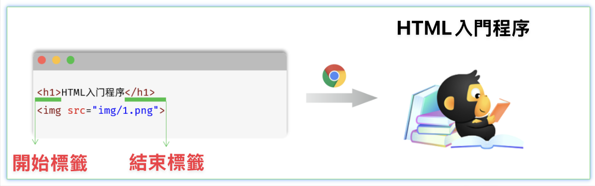

## 如何建立HTML

*^tab^*

> **建立文件**
>
> 滑鼠右鍵 -> 新增文字文件 -> 更改檔案類型為.html
>
> > [!caution]
> >
> > 如果建立完HTML文件後依然是文字文件格式，需要將系統中隱藏已知文件類型取消勾選
> >
> > 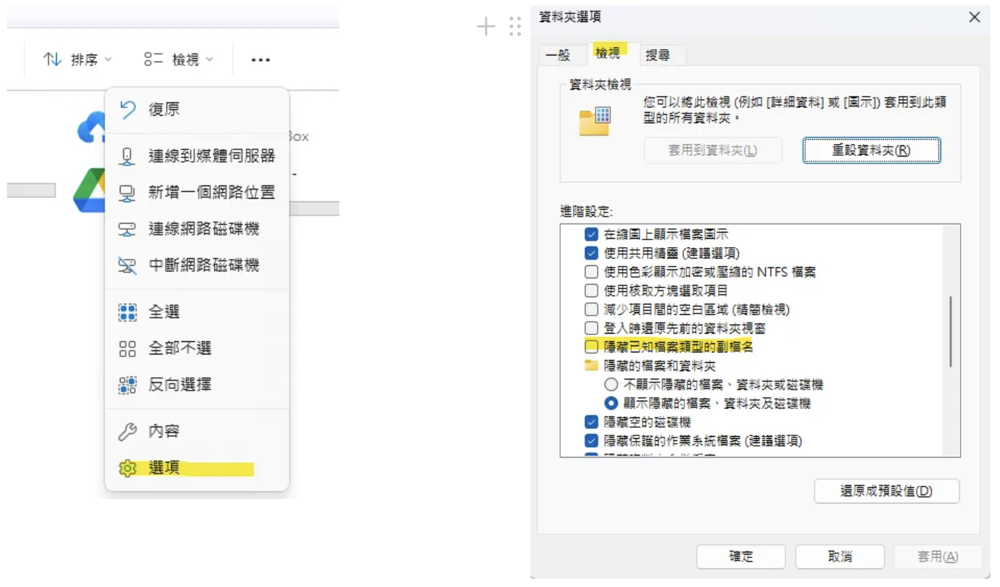

> **編寫HTML架構**
>
> *==HTML結構==*
>
> ```html
> <html>
>   <head>
>        <title>HTML 快速入門</title>
>   </head>
>   <body>
> 
>   </body>
> </html>
> ```
>
> 其中`<html>`是根標籤，`<head>`和`<body>`是子標籤
>
> * `<head>` : 定義網頁的頭部，用來存放給**瀏覽器**看的資訊，如：CSS樣式、網頁的標題
> * `<body>` : 定義網頁的主體部分，存放給**使用者**看的資訊，也是網頁的主體內容，如：文字、圖片、視訊、音訊、表格等
>
> > [!note]
> >
> > 在VSCode可以使用快捷方式生成HTML基本架構
> >
> > 在.html的檔案中，輸入!配合Tab/Enter按鍵
> >
> > 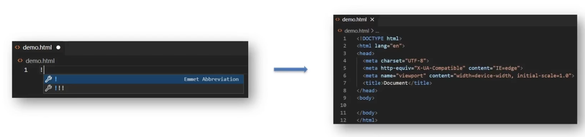

> **在`<body>`中編寫HTML的核心內容**
>
> *==body核心內容==*
>
> ```html
> <html>
>      <head>
>         <title>HTML 快速入門</title>
>      </head>
>      <body>
>         <h1>Hello HTML</h1>
>         
>      </body>
> </html>
> ```

> **程式碼下載**
>
> *[<kbd> 01.  HTML快速入門 </kbd>](web_HTML.assets/code/第二章.zip)*

## HTML標籤

標籤是HTML最基本的單位，也是重要的組成部分，通常用 `<` 和 `>` 括起來，標籤有兩種形式:

*^tab^*

*==成對標籤==*

```html
<p>內容</p>
```

*==不成對標籤==*

```html
<hr />
```

> [!NOTE]
>
> HTML標籤大小寫問題
>
> 標籤大小寫無關，`<body />`和`<BODY />`視為同樣
> ，**HTML標籤推薦使小寫**

___

> **父子關係（巢狀關係）**
>
> 子級標籤換行且縮排（Tab鍵）
>
> 

> **兄弟關係（並列關係）**
>
> 兄弟標籤換行要對齊
>
> 

>[!note]
>
>向後縮進快捷鍵：Tab
>
>向前縮進快捷鍵：Shift+Tab

* HTML標籤屬性

    - HTML屬性一般都出現在HTML標籤中，是HTML標籤的一部分

    - 標籤可以有屬性，包含了額外訊息，屬性一定要在雙引號中，標籤可以有多個屬性

    - 常見屬性名和屬性值成對出現 `<標籤名 屬性名1="屬性值" 屬性名2="屬性值"></標籤名>`

* HTML注釋

    - 格式 : `<!--我是HTML的注釋-->`
    - 方便其他工程師了解此代碼，且以後對程式的更動修改較為輕鬆，**注釋的內容不會被執行**

    > [!note]
    >
    > 在 VS Code 中，**新增 / 刪除**註釋的快速鍵：**Ctrl + /**

* HTML的代碼格式

    - 空白鍵和換行在執行時都**不會起作用**，所以在編寫HTML文件時，可以使用且必須遵守代碼排版和縮進，以便於閱覽修改

    - 任何的空白鍵、換行、TAB都只會被視為一個空格

* HTML中的特殊符號

    * 這些特殊符號無法直接輸入顯示在瀏覽器上，會被誤認為是代碼當中的一部分，需在HTML文本中以`&`開頭，以`;`結尾

    *==HTML中的特殊符號==*

    ```html
    &nbsp; 空格
    &gt; >
    &lt; <
    ```

# 一般標籤

## 聲明標籤

*==聲明標籤==*

```html
<!DOCTYPE html> <!--聲明標籤-->
<html>
<!--頭部標籤-->
    <head>
    </head>
<!--主體標籤-->
    <body>
    </body>
</html>
```


* 最上面聲明`<!DOCTYPE html>`

    * 聲明是文件中的第一部分，位於文件最上面

    - 該標籤是告訴瀏覽器所使用的HTML規範

* 以`<html>`開始，以`</html>`結束，中間包含頭部標籤`<head></head>`及主體標籤`<body></body>`

> [!note]
>
> VS Code 可以快速生成骨架：在 HTML 檔案（.html）中，輸入`!`（英文）配合 Enter / Tab 鍵

## 標題標籤

==用在新聞標題、文章標題、網頁區域名稱、產品名稱等等==


```html
<h1>一級標題</h1>
<h2>二級標題</h2>
<h3>三級標題</h3>
<h4>四級標題</h4>
<h5>五級標題</h5>
<h6>六級標題</h6>
```

顯示特點：

* 文字加粗
* 字號逐漸減小
* 獨佔一行（換行）

> [!note]
>
> 1. h1 標籤在一個網頁中只能用一次，用來放新聞標題或網頁的 logo
> 2. h2 ~ h6 沒有使用次數的限制

## 段落標籤

==用在新聞段落、文章段落、產品描述資訊等等==

```html
<p>段落</p>
```

顯示特點：

* 獨佔一行

* 段落之間存在間隙

    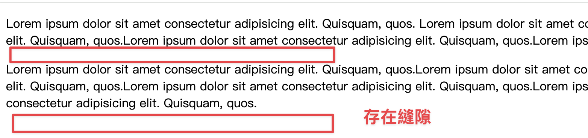

## 換行及水平線

* 換行：`<br>`
* 水平線：`<hr>`

> [!note]
>
> 如何區別單標籤還是雙標籤？
>
> 如果今天的內容是**需要保裹住的，那麼就是雙標籤**，換行或是水平線都沒有內容要包住，所以使用單標籤

## 字體格式化標籤

---

> **強調效果**
>
> | 標籤名 |     效果      |
> | :----: | :-----------: |
> | strong |   **加粗**    |
> |   em   |    *傾斜*     |
> |  ins   | <u>下劃線</u> |
> |  del   |  ~~刪除線~~   |

> **一般效果**
>
> | 標籤名 |     效果      |
> | :----: | :-----------: |
> |   b    |   **加粗**    |
> |   i    |    *傾斜*     |
> |   u    | <u>下劃線</u> |
> |   s    |  ~~刪除線~~   |


> [!note]
>
> `strong`、`em`、`ins`、`del` 標籤**語意上**自帶強調含義，在使用或開發的時候通常優先選擇這強調效果

## 圖片標籤

在網頁中插入圖片，src用於指定圖像的位置和名稱，是 `` 的必要屬性

```html

```

> [!note]
>
> * 屬性名="屬性值"
> * 屬性寫在尖括號裡面，標籤名後面，標籤名和屬性之間用空格隔開，不區分先後順序

其他屬性：

|  屬性  |    作用    | 說明                               |
| :----: | :--------: | ---------------------------------- |
|  alt   |  替換文字  | 圖片無法顯示的時候顯示的文字       |
| title  |  提示文字  | 鼠標懸停在圖片上面的時候顯示的文字 |
| width  | 圖片的寬度 | 值為數字，沒有單位                 |
| height | 圖片的高度 | 值為數字，沒有單位                 |

### 相對路徑

==從當前檔案位置出發尋找目標檔案==

* / ： 表示進入某個資料夾裡面          → 資料夾名/
* . ：表示當前檔案所在資料夾           → ./
* ..：表示當前檔案的上一級資料夾   → ../  

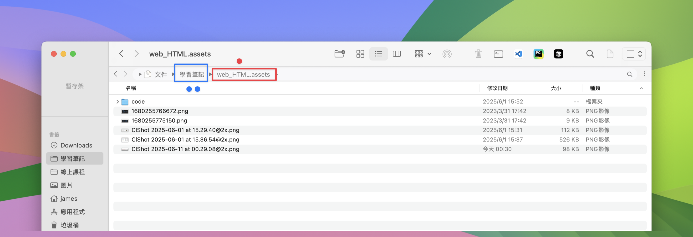

### 絕對路徑

==從根路徑出發尋找目標檔案==

* Windows 電腦從磁碟機代號(C:、D:)出發
* Mac 電腦從根目錄（/）出發

```html

```

> [!note]
>
> Windows 默認是 \ ，其他系統是 /，建議統一寫為 / 

## 超連結標籤

==點選跳轉到其他頁面==

```html
<a href="https://www.google.com">跳轉到google</a>
```

> [!caution]
>
> href 屬性值是跳轉地址，是超連結的必要屬性

超連結默認是在當前窗口跳轉頁面，新增 **target="_blank"** 屬性實現**新窗口**打開頁面

> [!note]
>
> 開發初期，不確定跳轉地址，則 href 屬性值寫為 **#**，表示**空連結**，頁面不會跳轉，在當前頁面刷新一次

```html
<a href="https://www.google.com">跳轉到google</a>

<!-- 跳轉到本地檔案：相對路徑尋找 --> 
<!-- target="_blank" 新窗口跳轉頁面 --> 
<a href="./01-標籤的寫法.html" target="_blank">跳轉到01-標籤的寫法</a>

<!-- #，表示空連結，不會跳轉 -->
<a href="#">空連結</a>
```

## 多媒體標籤

**音檔**

```html
<audio src="音檔的 URL"></audio>
```

|      屬性      |       作用       | 特殊說明                                           |
| :------------: | :--------------: | -------------------------------------------------- |
| src (必須屬性) |     音頻 URL     | 支持格式：MP3、Ogg、Wav                            |
|    controls    | 顯示音頻控制面板 |                                                    |
|      loop      |     循環播放     |                                                    |
|    autoplay    |     自動播放     | 為了提升用戶體驗，**瀏覽器一般會禁用自動播放功能** |

> [!note]
>
> 書寫 HTML5 屬性時，如果**屬性名和屬性值相同**，可以簡寫為一個單詞
>
> ```html
> <audio src="./media/music.mp3" controls loop autoplay></audio>
> ```
>
> 

**影片**

```html
<video src="影片的 URL"></video>
```

|      屬性      |       作用       | 特殊說明                                       |
| :------------: | :--------------: | ---------------------------------------------- |
| src (必須屬性) |     視頻 URL     | 支持格式：MP4、WebM、Ogg                       |
|    controls    | 顯示視頻控制面板 |                                                |
|      loop      |     循環播放     |                                                |
|     muted      |     靜音播放     |                                                |
|    autoplay    |     自動播放     | 為了提升用戶體驗，瀏覽器支持在靜音狀態自動播放 |

> [!note]
>
> 在瀏覽器中，想要自動播放，必須有 muted 屬性
>
> ```html
> <video src="./media/vue.mp4" controls loop muted autoplay></video>
> ```

# 練習-自我介紹

> **想法**
>
> **從上到下，先整體再局部**，逐步分析製作
> 分析內容 → 寫程式碼 → 保存 → 刷新瀏覽器，看效果

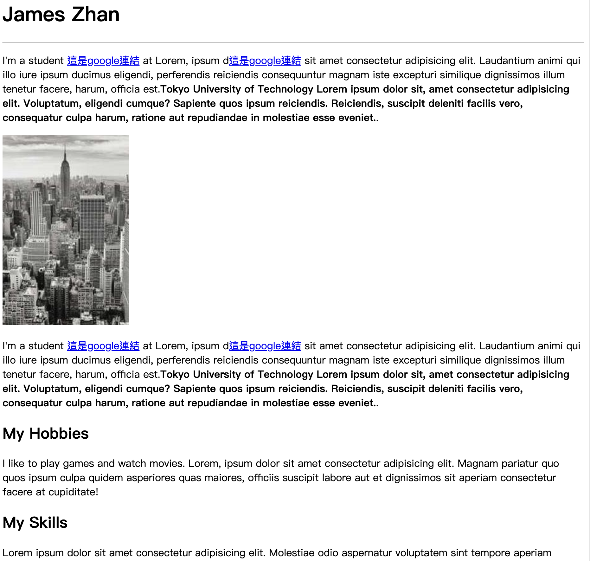

> [!note]
>
> 在vscode裡面，可以使用 `lorem` 填充字數

*[<kbd> self-introduction.html </kbd>](web_HTML.assets/code/self-introduction.html)*

# 列表、表格、表單

## 無序列表

無序列表使用 `<ul>` 標籤創建，其中的每個項目用 `<li>` 標籤包圍。這種列表適用於項目之間**沒有特定順序或優先級的情況**，瀏覽器會自動為每個項目添加項目符號（如圓點、方塊等），用於展示並列的信息或選項

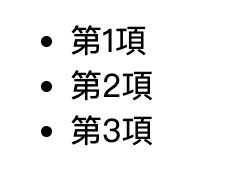

```html
<ul>
  <li>第1項</li>
  <li>第2項</li>
  <li>第3項</li>
</ul>
```

> [!caution]
>
> * `ul` 標籤裡面只能包裹 `li` 標籤
> * `li` 標籤裡面可以包裹任何內容

## 有序列表

有序列表使用 `<ol>` 標籤創建，同樣每個項目用 `<li>` 標籤包圍。這種列表適用於**需要按照特定順序或步驟排列的內容**，瀏覽器會自動為每個項目添加數字編號（預設從1開始），常用於操作步驟、排名或任何需要體現先後順序的信息

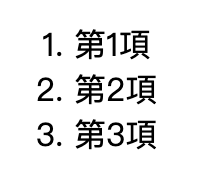

```html
<ol>
  <li>第1項</li>
  <li>第2項</li>
  <li>第3項</li>
</ol>
```

> [!caution]
>
> * `ol` 標籤裡面只能包裹 `li` 標籤
> * `li` 標籤裡面可以包裹任何內容

## 定義列表

定義列表使用 `<dl>` 標籤創建，由術語 `<dt>`（definition term）和描述 `<dd>`（definition description）組成。這種列表專門用於**展示術語及其對應的解釋或定義**，非常適合用於名詞解釋、FAQ問答或任何需要配對顯示的內容


```html
<dl>
    <dt>第1項</dt>
    <dd>第1項的內容</dd>
    <dd>第1項的內容</dd>
    <dt>第2項</dt>
    <dd>第2項的內容</dd>
    <dd>第2項的內容</dd>
    <dt>第3項</dt>
    <dd>第3項的內容</dd>
    <dd>第3項的內容</dd>
</dl>
```

> [!caution]
>
> * `dl` 裡面只能包含`dt` 和 `dd`
> * `dt` 和 `dd` 裡面可以包含任何內容

## 表格

|  標籤名   |    說明    | 詳細描述                                                     |
| :-------: | :--------: | ------------------------------------------------------------ |
| `<table>` |    表格    | 表格的根容器，定義整個表格結構的開始和結束                   |
|  `<tr>`   |     行     | Table Row，定義表格中的一行，包含多個單元格                  |
|  `<th>`   | 表頭單元格 | Table Header，用於定義表格的標題行，通常會以粗體顯示並居中對齊 |
|  `<td>`   | 內容單元格 | Table Data，用於定義表格中的數據內容，包含實際的表格數據     |

> [!caution]
>
> 在網頁中，**表格默認沒有邊框線**，使用 **border 屬性**可以為表格新增邊框線

---

> **沒有使用border**
>
> 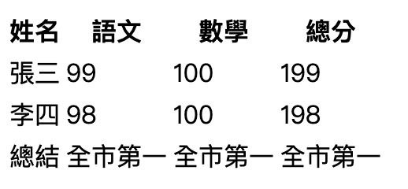

> **使用border**
>
> 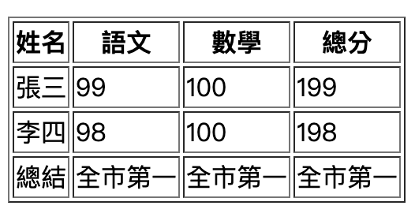

```html
<table border="1">
    <tr>
        <th>姓名</th>
        <th>語文</th>
        <th>數學</th>
        <th>總分</th>
    </tr>
    <tr>
        <td>張三</td>
        <td>99</td>
        <td>100</td>
        <td>199</td>
    </tr>
    <tr>
        <td>李四</td>
        <td>98</td>
        <td>100</td>
        <td>198</td>
    </tr>
    <tr>
        <td>總結</td>
        <td>全市第一</td>
        <td>全市第一</td>
        <td>全市第一</td>
    </tr>
</table>
```

### 表格結構標籤

用表格結構標籤把內容劃分區域，讓表格結構更清晰，語義更清晰

> [!note]
>
> 表格結構標籤可寫可不寫，因為在瀏覽器上不會呈現任何效果

|  標籤名   |   含義   |   特殊說明   | 用途與特點                                                   |
| :-------: | :------: | :----------: | ------------------------------------------------------------ |
| `<thead>` | 表格頭部 | 表格頭部內容 | 包含表格的標題行，通常包含 `<th>` 標籤，有助於語義化和無障礙訪問 |
| `<tbody>` | 表格主體 | 主要內容區域 | 包含表格的主要數據內容，是表格的核心部分                     |
| `<tfoot>` | 表格底部 | 匯總信息區域 | 包含表格的總結信息，如合計、平均值等統計數據                 |

```html
<table border="1">
    <thead>
        <tr>
            <th>姓名</th>
            <th>語文</th>
            <th>數學</th>
            <th>總分</th>
        </tr>
    </thead>
    <tbody>
        <tr>
            <td>張三</td>
            <td>99</td>
            <td>100</td>
            <td>199</td>
        </tr>
        <tr>
            <td>李四</td>
            <td>98</td>
            <td>100</td>
            <td>198</td>
        </tr>
    </tbody>
    <tfoot>
        <tr>
            <td>總結</td>
            <td>全市第一</td>
            <td>全市第一</td>
            <td>全市第一</td>
        </tr>
    </tfoot>
</table>
```

### 表格合併

---

> **跨列合併**
>
> 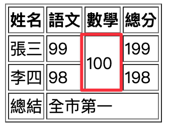

> **跨行合併**
>
> 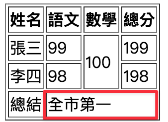

合併表格的步驟：

1. 明確合併的目標
2. 保留**最左、最上**的儲存格，新增屬性（取值是**數字**，表示需要**合併的儲存格數量**）
    * **跨列合併**，保留最上儲存格，新增屬性 **rowspan**
    * **跨行合併**，保留最左儲存格，新增屬性 **colspan**
3. 刪除多餘的表格

```html
<table border="1">
    <thead>
        <tr>
            <th>姓名</th>
            <th>語文</th>
            <th>數學</th>
            <th>總分</th>
        </tr>
    </thead>
    <tbody>
        <tr>
            <td>張三</td>
            <td>99</td>
            <td rowspan="2">100</td>
            <td>199</td>
        </tr>
        <tr>
            <td>李四</td>
            <td>98</td>
            <!-- <td>100</td> -->
            <td>198</td>
        </tr>
    </tbody>
    <tfoot>
        <tr>
            <td>總結</td>
            <td colspan="3">全市第一</td>
        </tr>
    </tfoot>
</table>
```


> [!caution]
>
> 不能跨表格結構標籤合併儲存格（`thead`、`tbody`、`tfoot`）

## 表單

==用來**收集用戶輸入資料**並將其提交到伺服器進行處理的網頁元素容器==


### input標籤

input 標籤 type 屬性值不同，則功能不同，通常**會搭配label標籤增大表單控制項的點選範圍**_~Rd~_

```html
<input type="..." >
```

| type 屬性值 | 說明                                         |
| :---------: | -------------------------------------------- |
|    text     | 文本框，用於輸入單行文本                     |
|  password   | 密碼框                                       |
|    radio    | 單選框                                       |
|  checkbox   | 多選框                                       |
|    file     | 上傳文件，要上傳多個要再加上 `multiple` 屬性 |

> [!note]
>
> 可以透過 `placeholder` 提示使用者要輸入的資料
>
> ```html
> <input type="..." placeholder="提示資訊">
> ```

*^tab^*

> **文本框(text)**
>
> 用戶輸入什麼，就顯示什麼
>
> 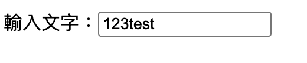
>
> ```html
> 輸入文字：<input type="text">
> ```

> **密碼框(password)**
>
> 看不到用戶輸入的文字，隱藏字元（通常顯示為 • 或 *），保護敏感資訊
>
> 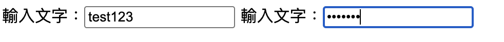
>
> ```html
> 輸入文字：<input type="password">
> ```

> **單選框(radio)**
>
> 
>
> | 屬性名  |   作用   | 特殊說明                           |
> | :-----: | :------: | ---------------------------------- |
> |  name   | 控件名稱 | 實現同組只能選中一個（單選功能）   |
> | checked | 默認選中 | 屬性名和屬性值相同，簡寫為一個單詞 |
>
> ```html
> <input type="radio" name="gender" checked> 男
> <input type="radio" name="gender"> 女
> ```
>
> > [!note]
> >
> > 屬性值 `name` 可以自定義

> **多選框(checkbox)**
>
> 
>
> ```html
> <input type="checkbox" checked> 前端
> <input type="checkbox"> 後端
> <input type="checkbox" checked> 全端
> ```

>**上傳檔案(file)**
>
>默認情況下，檔案上傳表單控制項只能上傳一個檔案
>
>
>
>```html
><input type="file" multiple>
>```
>
>> [!note]
>>
>> 新增 `multiple` 屬性可以實現檔案多選功能

### 下拉選單

`select` 嵌套 `option`，`select` 是下拉菜單整體，`option` 是下拉菜單的每一項

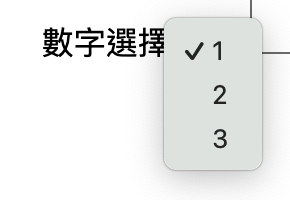

```html
數字選擇
<select>
    <option value="1">1</option>
    <option value="2">2</option>
    <option value="3" selected>3</option>
</select>
```

> [!note]
>
> 默認是選中第一個，除非以 `selected` 屬性指定默認選項

### 多行文本輸入框

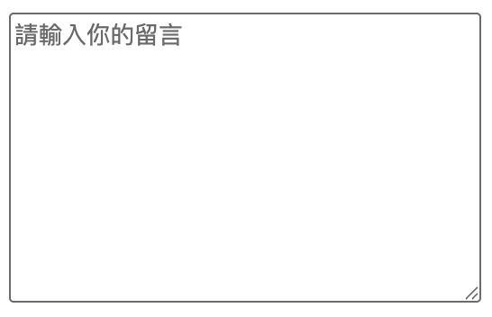

```html
<textarea placeholder="請輸入你的留言"></textarea>
```

> [!caution]
>
> * 實際開發中，使用 CSS 設定多行文本輸入框的尺寸
> * 實際開發中，一般停用右下角的拖曳功能

### label標籤

`<label>` 是 HTML 中用於**為表單控件提供標籤說明**的元素，也常用來增大表單控制項的點選範圍

*^tab^*

> **隱式關連**
>
> 使用 `label` 標籤包裹文字和表單控制項，不需要屬性 
>
> ```html
> <label>
>   姓名：
>   <input type="text" name="name">
> </label>
> ```

> **顯式關聯**
>
> * `label` 標籤只包裹內容，不包裹表單控制項
> * 設定 `label` 標籤的 `for` 屬性值 和表單控制項的 `id` 屬性值相同
>
> ```html
> <label for="username">用戶名：</label>
> <input type="text" id="username" name="username">
> ```

> [!note]
>
> 支援 label 標籤增大點選範圍的表單控制項：文字框、密碼框、上傳檔案、單選框、多選框、下拉菜單、文字域等等

### 按鈕

==**按鈕**是用於觸發動作或提交表單的互動元素==

> [!caution]
>
> 按鈕需配合 form 標籤（表單區域）才能實現對應的功能

| type 屬性值 | 說明                                             |
| :---------: | ------------------------------------------------ |
|   submit    | 提交按鈕，點擊後可以提交數據到後台（默認功能）   |
|    reset    | 重置按鈕，點擊後將表單控件恢復默認值             |
|   button    | 普通按鈕，默認沒有功能，一般配合 JavaScript 使用 |


```html
<!-- form 表單區域 -->
<form action="">
    使用者名稱：<input type="text">
    <br><br>
    密碼：<input type="password">
    <br><br>

    <button type="submit">提交</button>
    <button type="reset">重設</button>
    <button type="button">普通按鈕</button>
</form>
```


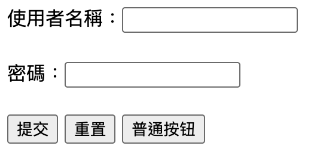

# 布局標籤

用來組織和結構化網頁內容的標籤，有分成兩種：通用容器標籤、語意化布局標籤

## 通用容器標籤

* `div`：獨佔一行
* `span`：不換行

```html
<div>這是div標籤，獨佔一行</div>
<span>這是span標籤，不獨佔一行</span>
<span>這是span標籤，不獨佔一行</span>
```


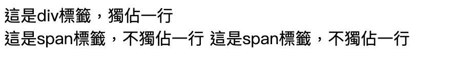

## 語意化布局標籤

| 標籤名  |    語義    |
| :-----: | :--------: |
| header  |  網頁頭部  |
|   nav   |  網頁導航  |
| footer  |  網頁底部  |
|  aside  | 網頁側邊欄 |
| section |  網頁區塊  |
| article |  網頁文章  |

# 練習

## 體育新聞列表


```html
<ul>
    <li>
        
        <h2>title1</h2>
    </li>
    <li>
        
        <h2>title2</h2>
    </li>
    <li>
        
        <h2>title3</h2>
    </li>
</ul>
```

*[<kbd> news-list  </kbd>](web_HTML.assets/code/news-list.html)*

## 練習-註冊


```html
<h1>註冊資料</h1>
    <form action="">
        <h2>使用者資料</h2>
        <label>姓名：<input type="text"></label><br><br>
        <label>密碼：<input type="password"></label><br><br>
        <label>確認密碼：<input type="password"></label><br><br>
        <label>性別：
            <input type="radio" name="gender" value="male" checked> 男
            <input type="radio" name="gender" value="female"> 女
        </label><br><br>
        <label>
            城市：
            <select>
                <option value="1">台北</option>
                <option value="2">台中</option>
                <option value="3">台南</option>
                <option value="4">高雄</option>
            </select>
        </label><br><br>
        <h2>專業技能</h2>
        <label>興趣：
            <label><input type="checkbox" name="interest" value="1"> 前端</label>
            <label><input type="checkbox" name="interest" value="2"> 後端</label>
            <label><input type="checkbox" name="interest" value="3"> 全端</label>
        </label><br><br>
        <label>
            <textarea ></textarea>
        </label>
        <br><br>
        <button type="submit">註冊</button>
        <button type="reset">重置</button>
    </form>
```


*[<kbd> register </kbd>](web_HTML.assets/code/register.html)*

# The End<br>*Written by JamesZhan*<br><sub>若是內容有錯誤歡迎糾正 *[<kbd> Email</kbd>](mailto:henry16801@gmail.com?subject="內容錯誤糾正(非錯誤糾正可自行更改標題)")*</sub>