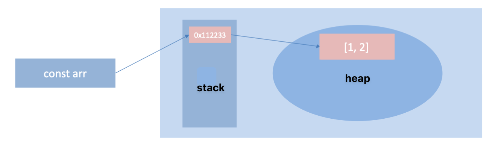
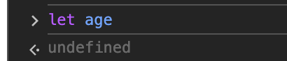
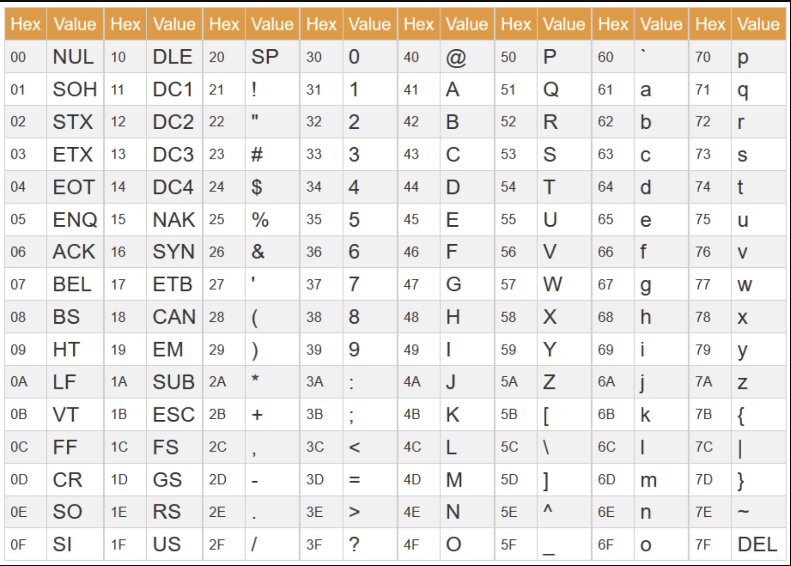
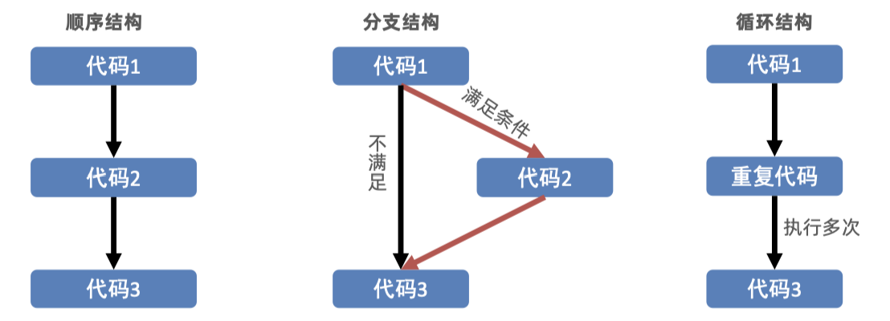
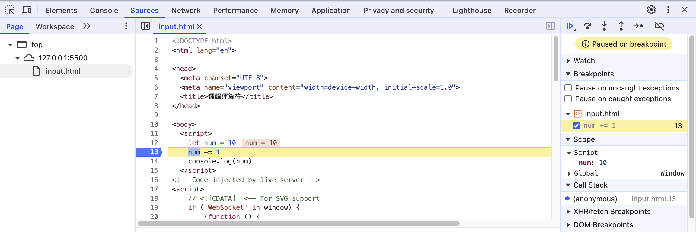
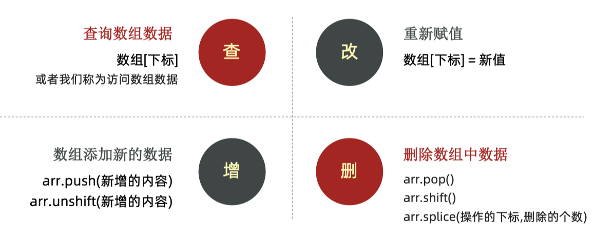
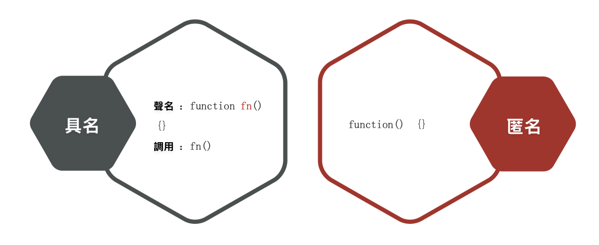
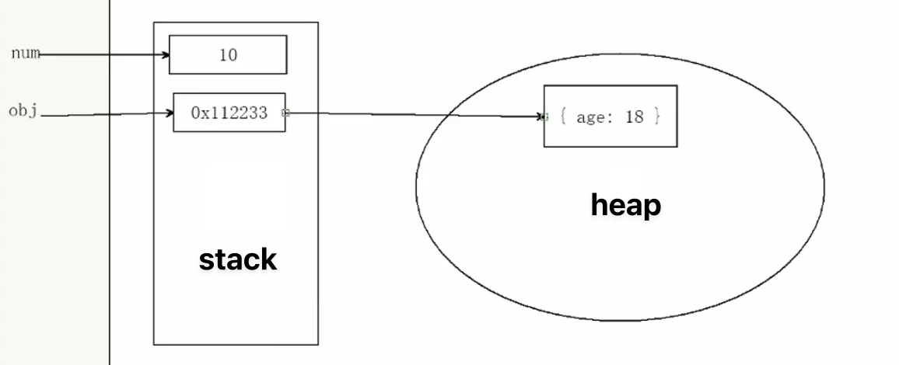
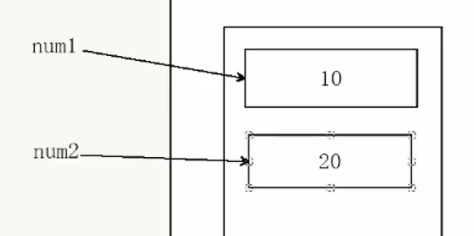
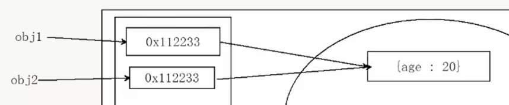

---
title:前端開發學習筆記-JavaScript
vlook-doc-lib:
- [筆記網站跳轉](index.html?target=_self "快速挑轉到想要的網頁")
- [前端開發學習筆記★HTML](web_HTML.html?target=_self "網頁開發學習筆記★HTML")
- [前端開發學習筆記★CSS](web_CSS.html?target=_self "網頁開發學習筆記★CSS")
- [前端開發學習筆記★JS](web_JS.html?target=_self "網頁開發學習筆記★JS")
- [前端開發學習筆記★WebAPI](web_WebAPI.html?target=_self "網頁開發學習筆記★JS")
- [前端開發學習筆記★AJAX](web_AJAX.html?target=_self "網頁開發學習筆記★JS")
- [前端開發學習筆記★React](web_React.html?target=_self "網頁開發學習筆記★React")
---

######  ~VLOOK™~ *[<kbd> VLOOK </kbd>](https://github.com/MadMaxChow/VLOOK)*<br>前端開發學習筆記-JavaScript<br>──<br><u>簡介</u><br>*本篇筆記是使用[<kbd> Typora</kbd>](https://typora.io/)及[<kbd> Markdown</kbd>](https://markdown.tw/)<br>結合GitHub開源模版撰寫而成並導出成HTML*<br>**JamesZhan**<br>*不允許複製下載`僅供閱覽`* *版本日期`2025年6月1日`*

[TOC]

# 什麼是JavaScript

JavaScript（簡稱 JS）是一種**高級程式語言**，最初是為了在網頁瀏覽器中添加互動功能而設計的。現在已經發展成為一種多用途的程式語言

> [!caution]
>
> JavaScipt跟Java並沒有關係

作用：

* 網頁特效 (監聽使用者的一些行為讓網頁作出對應的反饋)
* 表單驗證 (針對表單資料的合法性進行判斷)
* 資料互動 (獲取後台的資料, 渲染到前端)
* 伺服器端程式設計 (node.js)

JavaScript的組成：


* ECMAScript：規定了 JavaScript 基礎語法核心知識，像是變量、分支語句、循環語句……
* Web APIs：提供與瀏覽器和網頁互動的接口
    * DOM：操作文檔內容，例如：對頁面元素進行移動、調整元素大小
    * BOM：操作瀏覽器，例如：頁面彈窗控制、儲存資料到瀏覽器

>*[<kbd> mdn web docs  </kbd>](https://developer.mozilla.org/en-US/docs/Web/JavaScript)*

##  JavaScript引入方式

JavaScript 程序不能獨立運行，它需要被嵌入 HTML 中，然後瀏覽器才能執行 JavaScript 程式碼，JavaScript引入方式有三種跟CSS很像：

* 內部 JavaScript 
* 行內 JavaScript
* 外部 JavaScript

*^tab^*

> **內部JavaScrip**
>
> 通過 `script` 標籤包住JavaScript 程式碼，script標籤寫在 `</body>` 上面
>
> ```html
> <!DOCTYPE html>
> <html lang="en">
> 
> <head>
> 	<meta charset="UTF-8">
> 	<meta name="viewport" content="width=device-width, initial-scale=1.0">
> 	<title>內部方式引入js</title>
> </head>
> 
> <body>
> 	<script>
> 		alert("Hello World");
> 	</script>
> </body>
> 
> </html>
> ```
>
> > [!caution]
> >
> > 我們將 ` <script> ` 放在HTML檔案的底部附近的原因是瀏覽器會按照程式碼在檔案中的順序載入 HTML
> >
> > 如果先載入的 JavaScript 期望修改其下方的 HTML，那麼它可能由於 HTML 尚未被載入而失效。因此，將 JavaScript 程式碼放在 HTML頁面的底部附近通常是最好的策略

>**行內JavaScript**
>
>JavaScript程式碼寫在HTML標籤裡面
>
>```html
><!DOCTYPE html>
><html lang="en">
>
><head>
>	<meta charset="UTF-8">
>	<meta name="viewport" content="width=device-width, initial-scale=1.0">
>	<title>行內引入js</title>
></head>
>
><body>
>	<button onclick="alert('Hello World')">Click me</button>
></body>
>
></html>
>```

> **外部JavaScript**
>
> 程式碼寫在以.js結尾的檔案裡，通過script標籤，引入到HTML頁面中
>
> *==alert.js==*
>
> ```javascript
> alert("Hello World");
> ```
>
> *==alert.html==*
>
> ```html
> <!DOCTYPE html>
> <html lang="en">
> 
> <head>
> 	<meta charset="UTF-8">
> 	<meta name="viewport" content="width=device-width, initial-scale=1.0">
> 	<title>外部引入js</title>
> </head>
> 
> <body>
> 	<script src="alert.js"></script>
> </body>
> 
> </html>
> ```
>
> > [!note]
> >
> > * script標籤中間無需寫程式碼，否則會被忽略
> > * 外部JavaScript會使程式碼排版更好看更有條理(**推薦作法**_~Rd~_)

## JavaScript註解

---

> **單行註解**
>
> * 符號：//
> * 作用：//右邊這一行的程式碼會被忽略
> * 快捷鍵：ctrl + /
>
> 

> **多行註解**
>
> * 符號：/*  */
> * 作用：在/*  和  */ 之間的所有內容都會被忽略
> * 快捷鍵：shift + alt + A
>
> 

## JavaScript結束符

使用英文的 `;` 代表語句結束，實際開發中，可寫可不寫, 瀏覽器(JavaScript 引擎) 可以自動推斷語句的結束位置，現在越來越多人**主張省略結束符**

> [!caution]
>
> 為了風格統一，結束符要麼每句都寫，要麼每句都不寫


## 輸入輸出語法

輸出和輸入也可理解為人和電腦的互動，使用者通過鍵盤、滑鼠等向電腦輸入資訊，電腦處理後再展示結果給用戶

* 輸出語法：

    * `document.write("Hello World")` 向body內輸出內容

    > [!note]
    >
    > 如果輸出的內容寫的是標籤，也會被解析成網頁元素，例如：
    >
    > `document.write("<h1>Hello World</h1>")`
    >
    > 也可以使用模版字符串 `${變量}` 來輸出變量的內容

    * `alert("Hello World")` 彈出警告
    * `console.log("Hello World")` 控制台輸出語法，程式設計師偵錯使用

* 輸入語法：

    * `prompt("請輸入你的名字")`：顯示一個對話方塊，對話方塊中包含一條文字資訊，用來提示使用者輸入文字

    

> [!note]
>
> 正常來說，會按HTML程式流順序執行JavaScript程式碼，但是 `alert()` 和 `prompt()` 它們會跳過頁面渲染先被執行

## 字面量(Literal)

是指在程式碼中直接表示固定值的記號或符號。簡單來說，就是**直接寫出來的值**，不同的字面量寫法會產生不同的數據類型，直接影響程式的執行結果

* 數字字面量

    ```javascript
    let age = 25;           // 整數字面量
    let price = 99.99;      // 小數字面量
    let scientific = 1e5;   // 科學記號字面量 (100000)
    ```

* 字串字面量

    ```javascript
    let name = "張三";        // 雙引號字串
    let city = '台北';        // 單引號字串
    let message = `你好`;     // 模板字串（反引號）
    ```

* 布林字面量

    ```javascript
    let isActive = true;     // 真值
    let isComplete = false;  // 假值
    ```

* ……

# 變量與常量

==**變量**是用來**儲存數據的容器**，可以存放數字、文字、物件等各種類型的值==


> [!caution]
>
> 變量不是資料本身，它們只是一個用於儲存數值的容器。可以理解為是一個個用來裝東西的紙箱子

## 使用變量

可以把電腦的記憶體想像成一個大倉庫，所有的變量都需要在這個倉庫裡找個位置存放

1. 要想使用變量，首先需要建立變量

    ```javascript
    // let 變量名稱
    let age
    ```

2. 初始化變量，賦值給變量

    ```javascript
    age = 18
    ```

> [!note]
>
> 通常在開發的時候會直接初始化變量
>
> ```javascript
> let age = 18
> ```
>
> 現在都使用 `let` ，而不使用 `var` 定義變量

> [!caution]
>
> 變數命名規則與規範
>
> * 規則：必須遵守，不遵守報錯
>     * 不能用關鍵字
>     * 只能用_、$、字母、數字，且數字不能開頭
>     * 字母嚴格區分大小寫，如 Age 和 age 是不同的變數
> * 規範：建議遵守，不遵守不會報錯，但不符合常規要求
>     * 取名要有意義
>     * 遵守小駝峰命名法，例如：userName、userAge
>
> |   變量名    | 是否報錯 | 是否符合規範 | 說明                 |
> | :---------: | :------: | :----------: | -------------------- |
> |   `21age`   |   報錯   |      ❌       | 不能以數字開頭       |
> |   `_age`    |  不報錯  |      ✅       | 可以以底線開頭       |
> | `user-name` |   報錯   |      ❌       | 不能包含連字號       |
> | `username`  |  不報錯  |      ❌       | 語法正確但不易讀     |
> | `userName`  |  不報錯  |      ✅       | 駝峰命名法           |
> |    `let`    |   報錯   |      ❌       | 保留字不能作為變量名 |
> |   `na@me`   |   報錯   |      ❌       | 不能包含特殊符號     |
> |   `$age`    |  不報錯  |      ✅       | 可以以 $ 開頭        |

## let和var區別

在較舊的JavaScript，使用關鍵字 `var` 來聲明變數 ，而不是 `let`

`var` 現在開發中一般不再使用它，只是我們可能再老版程序中看到它。`let` 為了解決 `var` 的一些問題：

*  可以先使用，再聲明 var ( **不合理!**_~Rd~_，但是不會報錯)

    

* var 聲明過的變數可以重複聲明(**不合理!**_~Rd~_，但是不會報錯)，作用在let上就會報錯

    

    

## 陣列的基本使用

原先一個變量名稱只能接收一個元素，但是如果今天我想要同時記錄五個人的名字，就要有五個變量。這樣會很麻煩，而且當人數更多時，就需要創建更多變量，管理起來非常困難，因此使用**陣列**

*==陣列定義==*

```javascript
// 創建陣列
let 變量名稱 = ['元素1'. '元素2', '元素3'] 

// 陣列取值
變量名稱[索引值]
```

> [!note]
>
> * 陣列是按順序保存，所以每個資料都有自己的索引
> * 電腦中的編號從0開始
> * 陣列可以儲存任意類型的資料


## 常量

當某個變數永遠不會改變的時候，就可以使用 `const` 來聲明，而不是 `let`

* 表示語意更明確，實際開發過程中也是使用 `const` 居多
* 只要有變量先給 `const` ，如果之後會被修改在換成 `let`

```javascript
const PI = 3.14
```

> [!caution]
>
> 常量不允許重新賦值，聲明的時候必須賦值（初始化）
>
> 
>
> 

>[!important]
>
>基本資料類型需要修改值就要使用 `let` ，但是引用資料類型可以**維持使用** `const`，因為引用資料類型存放的是資料的地址，只要不涉及地址更改就可以使用 `const`
>
>

# 資料類型

**為什麼要給資料分類？**

雖然電腦程序可以處理大量資料，但**分類是為了讓處理更有效率和更安全**，就像圖書館雖然可以存放很多書，但仍需要分類編號一樣

JavaScript資料類型分為兩大類：


## 數字類型

數字類型包括整數、小數、正數、負數，這些數字類型可以有很多的操作，比如，乘法 * 、除法 / 、加法 + 、減法 - 等等，所以經常和算術運算子一起做數學運算

**在主控台中數字類型的文字顏色為藍色**


> [!note]
>
> **Java V.S. JavaScript**
>
> * JavaScript 是弱資料類型：變量到底屬於那種類型，只有賦值之後，我們才能確認
> * Java是強資料類型：例如  int  a = 3 必須是整數

> **計算圓面積**
>
> 對話方塊中輸入圓的半徑，算出圓的面積並顯示到頁面
>
> *  圓面積計算公式：π*r² 
> * 常量：PI = 3.14
>
> ```javascript
> <script>
>   let r = prompt("請輸入半徑")
>   const PI = 3.14
>   let area = PI * r * r
>   document.write(`<h1>圓面積: ${area}</h1>`)
> </script>
> ```

> [!note]
>
> NaN 代表一個計算錯誤。它是一個不正確的或者一個未定義的數學操作所得到的結果
>
> ---
>
> > 
>
> > 

## 字串類型

**通過單引號（''） 、雙引號（""）或反引號(`) 包著的資料都叫字串**，單引號和雙引號沒有本質上的區別，**推薦使用單引號**

**在主控台中字串類型的文字顏色為黑色**


> [!note]
>
> * 無論單引號或是雙引號必須成對使用
> * 單引號/雙引號可以互相嵌套，但是不以自已嵌套自已
>     （口訣：外雙內單，或者外單內雙）
> * 必要時可以使用轉義符 \，輸出單引號或雙引號

> **字串拼接**
>
> * 使用`+` 號實現字串的拼接
>
>     ```javascript
>     let name = 'John' // 使用單引號
>     let gender = "male" // 使用雙引號
>     let score = `90` // 使用反引號
>     document.write('我是' + 'John' + '<br>')
>     document.write('名字' + name + '性別' + gender)
>     ```
>
>     
>
> * 內容連接變量時，用 `${ } `包住變量
>
>     > [!caution]
>     >
>     > 要使用反引號``
>
>     ```javascript
>     document.write(`名字${name}性別${gender}`)
>     ```

## 布林類型

只有兩個固定的值

* **true**：表示為真
* **false**：表示為假

> [!caution]
>
> 只能是小寫，如果寫成大寫就不是布林類型了

```javascript
let run = true
console.log(run)
```

## 未定義類型

未定義是比較特殊的類型，只有一個值 undefined，只聲明變量，不賦值的情況下，變量的預設值為 undefined，一般很少直接為某個變數賦值為 undefined



## 空類型

null 代表**沒有**或**值未知**的特殊值，可以先把看成null 作為尚未建立的物件

> [!note]
>
> null 和 undefined 區別：
>
> * undefined  表示**沒有賦值**
> * null 表示**賦值**了，但是內容為**空**

```javascript
let obj = null
console.log(obj)
```

## 資料類型檢測

可以透過 `typeof` 關鍵字檢測資料類型，`typeof` 可以返回被檢測的資料類型。它支援兩種語法形式：

* `typeof 變量` (常用)
* `typeof(變量)`

```javascript
let age = 18
console.log(typeof age)
let name = 'John'
console.log(typeof name)
let isStudent = true
console.log(typeof isStudent)
let hobbies = null
console.log(typeof hobbies)
```


## 類型轉換

使用表單、prompt 獲取資料**默認是字串類型**，此時就不能直接簡單的進行四則運算，就需要轉換變量的資料類型


> **隱式轉換**
>
> 執行時，系統內部自動將資料類型進行轉換，這種轉換稱為隱式轉換
>
> * 字串加上數字，數字就會自動轉換成字串
> * **除了+以外的，都會把資料轉成數字類型**
>
> > [!caution]
> >
> > 缺點：轉換類型不明確，靠經驗才能知道
>
> > [!note]
> >
> > 如果有一串字串裡面放著數字，前面有一個**+**號，可以**解析成數字類型**
>
> 

> **顯式轉換**
>
> 隱式轉換不嚴謹，因為隱式轉換規律並不清晰，大多是靠經驗總結的規律，所以顯式轉換可以自己寫程式告訴系統要轉換成什麼類型
>
> * 轉換為數字型
>
>   
>
>   
>
>   
>
>   * Number(資料)
>     * 轉成數字類型
>     * 如果字串內容裡有非數字，轉換失敗時結果為 NaN（Not a Number）即不是一個數字
>     * NaN也是number類型的資料，代表非數字
>   * parseInt(資料)
>     * 只保留整數
>   * parseFloat(資料)
>     * 可以保留小數
>
> * 轉換為字元型
>
>   * String(資料)
>   * 變數.toString(進制)

# 運算符

## 賦值運算符

==對變數進行賦值的運算子==

| 運算符 |   名稱   |  等價寫法   |           說明           |          範例          |
| :----: | :------: | :---------: | :----------------------: | :--------------------: |
|  `=`   | 基本賦值 |      -      | 將右邊的值賦給左邊的變數 |        `x = 5`         |
|  `+=`  | 加法賦值 | `x = x + y` | 將變數與右邊值相加後賦值 | `x += 3` → `x = x + 3` |
|  `-=`  | 減法賦值 | `x = x - y` |  將變數減去右邊值後賦值  | `x -= 2` → `x = x - 2` |
|  `*=`  | 乘法賦值 | `x = x * y` |  將變數乘以右邊值後賦值  | `x *= 4` → `x = x * 4` |
|  `/=`  | 除法賦值 | `x = x / y` |  將變數除以右邊值後賦值  | `x /= 2` → `x = x / 2` |
|  `%=`  | 取餘賦值 | `x = x % y` | 將變數對右邊值取餘後賦值 | `x %= 3` → `x = x % 3` |

> [!note]
>
> 使用這些運算符，可以在對變數賦值時進行快速操作 

---

> **以前的寫法**
>
> ```javascript
> let num = 1
> num = num + 1
> console.log(num)
> ```

> **更好的寫法**
>
> ```javascript
> let num = 1
>     num += 1
>     console.log(num)
> ```

## 一元運算符

 **一元運算符**是只需要**一個操作數**的運算符

| 運算符 | 名稱          | 說明                   | 範例           | 結果        |
| ------ | ------------- | ---------------------- | -------------- | ----------- |
| `+`    | 正號          | 表示正數（通常可省略） | `+5`           | `5`         |
| `-`    | 負號          | 表示負數或取相反數     | `-5`           | `-5`        |
| `++`   | 前置/後置遞增 | 變數值加1              | `++x` 或 `x++` | `x = x + 1` |
| `--`   | 前置/後置遞減 | 變數值減1              | `--x` 或 `x--` | `x = x - 1` |

---

> **事前加加**
>
> ```javascript
> let num = 1
> ++num
> ```
>
> * 每執行1次，當前變數數值加1 
> * 其作用相當於 num += 1
>
> ```javascript
> let num = 1
> console.log(++num + 2) 
> ```
>
> num是先自己加1，在賦值給num，之後再加上2，所以答案是4

> **事後加加**
>
> ```javascript
> let num = 1
> num++
> ```
>
> * 每執行1次，當前變數數值加1 
> * 其作用相當於 num += 1
>
> ```javascript
> let num = 1
> console.log(num++ + 2) 
> ```
>
> num=1先和2相加完之後，num才賦值成2，所以相加起來答案是3

> [!caution]
>
> 前置自增和後置自增獨立使用時二者並沒有差別，一般開發中都是獨立使用
>
> 後面 **i++ 後置自增**會使用相對較多,並且都是單獨使用

## 比較運算符

  **比較運算符**用來比較兩個值的大小關係或相等性，結果總是返回**布林值**（`true` 或 `false`）

| 運算符 |    名稱    |            說明            |    範例     |  結果   |
| :----: | :--------: | :------------------------: | :---------: | :-----: |
|  `==`  |    等於    | 值相等（可能進行型別轉換） | `5 == "5"`  | `true`  |
| `===`  |  嚴格等於  |       值和型別都相等       | `5 === "5"` | `false` |
|  `!=`  |   不等於   |          值不相等          |  `5 != 3`   | `true`  |
| `!==`  | 嚴格不等於 |       值或型別不相等       | `5 !== "5"` | `true`  |
|  `>`   |    大於    |        左邊大於右邊        |   `8 > 5`   | `true`  |
|  `<`   |    小於    |        左邊小於右邊        |   `3 < 7`   | `true`  |
|  `>=`  |  大於等於  |     左邊大於或等於右邊     |  `5 >= 5`   | `true`  |
|  `<=`  |  小於等於  |     左邊小於或等於右邊     |  `4 <= 6`   | `true`  |

> [!important]
>
> **== vs === 的差異**
>
> * 不同類型之間比較會發生隱式轉換
> * **開發中，請使用 ===**，因為更精確更好控制
>
> ```javascript
> // == (寬鬆比較) - 會進行型別轉換
> console.log(5 == "5");      // true
> console.log(true == 1);     // true
> console.log(null == undefined); // true
> 
> // === (嚴格比較) - 不進行型別轉換
> console.log(5 === "5");     // false
> console.log(true === 1);    // false
> console.log(null === undefined); // false
> ```

字串比較，是比較字元對應的ASCII碼



* 從左往右依次比較 
* 如果第一位一樣再比較第二位，以此類推

```javascript
// 逐字符比較 ASCII 值
console.log("A" < "B");     // true (65 < 66)
console.log("a" < "A");     // false (97 > 65)
console.log("a" < "b");     // true (97 < 98)

// 長度不同的字符串
console.log("cat" < "catch");   // true
console.log("cat" < "car");     // false ("t" > "r")
console.log("" < "a");          // true (空字符串最小)
```

## 邏輯運算符

==**邏輯運算符**用來組合或修改布林值==

| 運算符 |     名稱     |         說明         |      範例       |  結果   |
| :----: | :----------: | :------------------: | :-------------: | :-----: |
|  `&&`  | 邏輯與 (AND) |   兩個都為真才為真   | `true && false` | `false` |
|  `||`  | 邏輯或 (OR)  |  至少一個為真就為真  | `true || false` | `true`  |
|  `!`   | 邏輯非 (NOT) | 取反，真變假，假變真 |     `!true`     | `false` |

* 判斷一個數，介於0~100之間
  * **錯誤寫法**：0 < X < 100
  * **正確寫法**：X>0 **&&** X<100

>**判斷一個數是4的倍數，且不是100的倍數**
>
>```html
><!DOCTYPE html>
><html lang="en">
>
><head>
>  <meta charset="UTF-8">
>  <meta name="viewport" content="width=device-width, initial-scale=1.0">
>  <title>邏輯運算符</title>
></head>
>
><body>
>  <script>
>    let num = prompt("Enter a number:")
>    alert(num % 4 === 0 && num % 100 !== 0)
>  </script>
></body>
>
></html>
>```

## 運算符優先級

**運算符優先級**決定了在一個表達式中，哪些運算符會先被執行。就像數學中的「先乘除後加減」一樣

| 優先級 | 運算符類型 |          運算符           |              說明              |
| :----: | :--------: | :-----------------------: | :----------------------------: |
| **1**  |   小括號   |           `()`            |  最高優先級，用於改變運算順序  |
| **2**  | 一元運算符 |       `++` `--` `!`       |       遞增、遞減、邏輯非       |
| **3**  | 算數運算符 | 先 `*` `/` `%` 後 `+` `-` |        乘除模優先於加減        |
| **4**  | 關係運算符 |     `>` `>=` `<` `<=`     | 大於、大於等於、小於、小於等於 |
| **5**  | 相等運算符 |   `==` `!=` `===` `!==`   | 相等、不等、嚴格相等、嚴格不等 |
| **6**  | 邏輯運算符 |      先 `&&` 後 `||`      |       邏輯與優先於邏輯或       |
| **7**  | 賦值運算符 |            `=`            |            賦值操作            |
| **8**  | 逗號運算符 |            `,`            |   最低優先級，順序執行表達式   |

> [!important]
>
> * 一元運算子裡面的**邏輯非優先順序很高**
> * **邏輯與比邏輯或優先順序高**

# 分支語句

* 以前我們寫的程式碼，寫幾句就從上往下執行幾句，這種叫**順序結構**
* 有的時候要根據條件選擇執行程式碼，這種就叫**分支結構**
* 某段程式碼被重複執行，就叫**循環結構**



## if分支語句

**分支語句**是程式設計中的控制結構，用來根據不同的條件執行不同的程式碼路徑

* **if 語句 - 單向分支**

  ```javascript
  if (條件) {
    滿足條件時要執行的程式碼
  }
  ```

  ```javascript
  let age = 18;
  if (age >= 18) {
      console.log("您已成年，可以投票！");
  }
  ```

*  **if...else 語句 - 雙向分支**

  ```javascript
  if (條件) {
    滿足條件時要執行的程式碼
  } else {
    不滿足條件時要執行的程式碼
  } 
  ```

  ```javascript
  let score = 75;
  if (score >= 60) {
      console.log("及格！");
  } else {
      console.log("不及格，需要重考。");
  }
  ```

* **if...else if...else 語句 - 多向分支**

  ```javascript
  if (條件1) {
    滿足條件時要執行的程式碼
  } else if (條件2){
    滿足條件時要執行的程式碼
  } else if (條件3){
    滿足條件時要執行的程式碼
  } else {
    不滿足條件時要執行的程式碼
  } 
  ```

  ```javascript
  let grade = 85;
  if (grade >= 90) {
      console.log("優秀 A");
  } else if (grade >= 80) {
      console.log("良好 B");
  } else if (grade >= 70) {
      console.log("中等 C");
  } else if (grade >= 60) {
      console.log("及格 D");
  } else {
      console.log("不及格 F");
  }
  ```

## 三元運算符

**三元運算符**是 JavaScript 中唯一的三元運算符，也稱為**條件運算符**。它提供了一種簡潔的方式來寫簡單的 if-else 語句

```javascript
條件 ? 值1 : 值2
```

- **條件**：要評估的表達式
- **值1**：條件為 `true` 時返回的值
- **值2**：條件為 `false` 時返回的值

---

> **使用 if-else**
>
> ```javascript
> let age = 20;
> let status;
> 
> if (age >= 18) {
>     status = "成年人";
> } else {
>     status = "未成年";
> }
> 
> console.log(status); // "成年人"
> ```

> **使用三元運算符**
>
> ```javascript
> let age = 20;
> let status = age >= 18 ? "成年人" : "未成年";
> 
> console.log(status); // "成年人"
> ```

> [!note]
>
> 三元運算符只能用在比較簡單的條件判斷，如果邏輯太複雜就不適合

## switch語句

**Switch 語句**是一種多分支選擇結構，用於根據一個表達式的值來執行不同的程式碼塊。它是多個 if-else if 語句的優雅替代方案

```javascript
switch (表達式) {
    case 值1:
        // 程式碼塊1
        break;
    case 值2:
        // 程式碼塊2
        break;
    case 值3:
        // 程式碼塊3
        break;
    default:
        // 預設程式碼塊
        break;
}
```

* 找到跟小括號裡資料全等的case值，並執行裡面對應的程式碼
* 若沒有全等 ===  的則執行default裡的程式碼
* 例：資料若跟值2全等，則執行程式碼2

> [!caution]
>
> * switch case語句一般用於**等值判斷**，不適合於區間判斷
> * switch case一般需要配合break關鍵字使用，沒有break會造成**case穿透**
>
> ```javascript
> let fruit = "apple";
> 
> switch (fruit) {
>     case "apple":
>         console.log("這是蘋果");
>         // 沒有 break，會繼續執行下面的 case
>     case "banana":
>         console.log("這是水果");
>         // 沒有 break，會繼續執行下面的 case
>     case "carrot":
>         console.log("這是食物");
>         break;
>     default:
>         console.log("未知項目");
> }
> 
> // 輸出：
> // 這是蘋果
> // 這是水果
> // 這是食物
> ```

```javascript
let dayNumber = 3;

switch (dayNumber) {
    case 1:
        console.log("星期一");
        break;
    case 2:
        console.log("星期二");
        break;
    case 3:
        console.log("星期三");
        break;
    case 4:
        console.log("星期四");
        break;
    case 5:
        console.log("星期五");
        break;
    case 6:
        console.log("星期六");
        break;
    case 7:
        console.log("星期日");
        break;
    default:
        console.log("無效的日期");
        break;
}
// 輸出：星期三
```

# 循環語句

**循環語句**是程式設計中用來重複執行一段程式碼的控制結構，直到滿足特定條件為止。它讓我們能夠有效地處理重複性任務

循環三要素：

1. 以某個變量為起始值
2. 變量不斷產生變化
3. 慢慢靠近終止條件

## 斷點除錯

**斷點調適**是程式開發中最重要的偵錯技術，讓開發者能夠暫停程式執行，檢查變數值，逐步執行程式碼來找出問題

**設置步驟：**

1. 按 `F12` 開啟開發者工具
2. 切換到 **Sources** 標籤
3. 找到你的 JavaScript 檔案
4. 點擊行號設置斷點



```
📱 調適控制台
├── ▶️ Continue (F8) - 繼續執行
├── ⏭️ Step Over (F10) - 逐行執行
├── ⬇️ Step Into (F11) - 進入函數
├── ⬆️ Step Out (Shift+F11) - 跳出函數
└── 🔄 Restart - 重新開始

📊 變數監視區
├── 🔍 Watch - 監視特定變數
├── 📋 Scope - 當前作用域變數
├── 📞 Call Stack - 函數呼叫堆疊
└── 🔗 Breakpoints - 斷點列表
```

## while循環

**While 循環**是一種條件控制的循環結構，只要指定的條件為 `true`，就會持續執行循環體內的程式碼。它特別適合用於**不知道確切循環次數**的情況

```javascript
while (條件) {
    // 循環體 - 當條件為 true 時執行
    // 通常需要更新條件相關的變數
}
```

```javascript
let count = 1;

while (count <= 5) {
    console.log(`計數：${count}`);
    count++; // 重要：更新條件變數
}

console.log("循環結束");

// 輸出：
// 計數：1
// 計數：2
// 計數：3
// 計數：4
// 計數：5
// 循環結束
```

> [!caution]
>
> * **不要忘記更新條件變數**，不然會陷入死循環
>
>   ```javascript
>   // ❌ 危險：忘記更新條件變數
>   let count = 1;
>   while (count <= 5) {
>       console.log(count);
>       // 忘記 count++ 導致無限循環！
>   }
>   
>   // ✅ 正確：記得更新條件
>   let count = 1;
>   while (count <= 5) {
>       console.log(count);
>       count++; // 重要！
>   }
>   ```
>
> * 條件永遠不成立
>
>   ```javascript
>   // ❌ 循環永遠不會執行
>   let number = 10;
>   while (number < 5) {
>       console.log(number); // 這行永遠不會執行
>       number--;
>   }
>               
>   // ✅ 檢查初始條件
>   let number = 3;
>   while (number < 5) {
>       console.log(number); // 會執行
>       number++;
>   }
>   ```

## 循環退出

主要有兩種方式：

1. `break`（完全退出循環）
2. `continue`（跳過當前迭代）

|     方式     |         作用         |      適用場景      |        範例        |
| :----------: | :------------------: | :----------------: | :----------------: |
|  **break**   | **完全退出當前循環** | 找到目標、錯誤處理 |   搜尋、驗證失敗   |
| **continue** |   **跳過當前迭代**   |    過濾無效資料    | 資料清理、條件篩選 |

*==break範例==*

```javascript
let i = 1
while (i <= 5) {
  if (i === 3) {
    break
  }
  console.log(`這是變數${i}`)
  i++
}

// 輸出
// 這是變數1
// 這是變數2
```

*==continue範例==*

```javascript
let i = 1
while (i <= 5) {
  if (i === 3) {
    i++
    continue
  }
  console.log(`這是變數${i}`)
  i++
}

// 輸出
// 這是變數1
// 這是變數2
// 這是變數4
// 這是變數5
```

## for循環

**For 循環**是最常用的循環結構，特別適合**已知循環次數**或需要**按順序處理資料**的情況

```javascript
for (初始化; 條件; 更新) {
    // 循環體
}
```

1. 執行初始化（只執行一次）  
2. 檢查條件   
3. 條件為 true？ 
   1. 是 → 執行循環體 → 執行更新 → 回到步驟 2 
   2. 否 → 跳出循環

```javascript
// 1輸出到100
for (let i = 1; i <= 100; i++) {
  document.write(i + "<br>")
}
```

for循環的最大價值：循環陣列

```javascript
let arr = ["James", "Wendy", "Alex"]
for (let i = 0; i < arr.length; i++) {
  document.write(arr[i] + "<br>")
}
```

> [!note]
>
> index必須從0開始，因為陣列的起始值是0

**巢狀for**

一個 for 循環內部再包含另一個或多個 for 循環。這種結構特別適合處理**多維資料**、**矩陣運算**、**組合問題**等需要多層迭代的場景

```javascript
for (外層初始化; 外層條件; 外層更新) {
  // 外層循環體

  for (內層初始化; 內層條件; 內層更新) {
      // 內層循環體
      // 可以訪問外層和內層的變數
  }

  // 外層循環體繼續
}
```

```javascript
console.log("基本巢狀循環：");

for (let i = 1; i <= 3; i++) {
  console.log(`外層循環：第 ${i} 次`);

  for (let j = 1; j <= 4; j++) {
      console.log(`  內層循環：第 ${j} 次`);
  }

  console.log(`外層循環 ${i} 結束\n`);
}

// 輸出：
// 外層循環：第 1 次
//   內層循環：第 1 次
//   內層循環：第 2 次
//   內層循環：第 3 次
//   內層循環：第 4 次
// 外層循環 1 結束
//
// 外層循環：第 2 次
//   內層循環：第 1 次
//   內層循環：第 2 次
//   內層循環：第 3 次
//   內層循環：第 4 次
// 外層循環 2 結束
// ...
```

# 陣列

**陣列**是一種用來**儲存多個值**的資料結構，可以把它想像成一個**有編號的盒子集合**，每個盒子都可以放入一個資料，而且可以透過編號（索引）來快速取得或修改資料

```javascript
// 想像陣列就像一排有編號的盒子
// 索引:  0    1   2   3    4
// 內容: [🍎, 🍌, 🍊, 🍇, 🍓]

let fruits = ["蘋果", "香蕉", "橘子", "葡萄", "草莓"];

console.log("陣列內容：", fruits);
console.log("第一個水果：", fruits[0]); // 蘋果
console.log("第三個水果：", fruits[2]); // 橘子
console.log("陣列長度：", fruits.length); // 5

```

## 陣列基本使用

* 聲明語法

  ```javascript
  let fruits = ["蘋果", "香蕉", "橘子", "葡萄", "草莓"];
  
  // let fruits = new Array("蘋果", "香蕉", "橘子", "葡萄", "草莓") 
  ```

* 取值

  ```javascript
  // 變數名[下標]
  fruits[0]
  
  // 陣列長度
  fruits.length
  ```

* 循環陣列

  ```javascript
  let arr = ["James", "Wendy", "Alex"]
  for (let i = 0; i < arr.length; i++) {
    document.write(arr[i] + "<br>")
  }
  ```

## 陣列增刪改查



##  增

* **push()**：在末尾新增一個或多個元素，並**返回該陣列的新長度** 

  ```javascript
  let fruits = new Array("蘋果", "香蕉")
  console.log(fruits.push("芭樂", "葡萄"))
  console.log(fruits)
  
  // 輸出
  // 4
  // ['蘋果', '香蕉', '芭樂', '葡萄']
  ```

* **unshift()**：在開頭添加一個或多個元素，並**返回該陣列的新長度** 

  ```javascript
  let fruits = new Array("蘋果", "香蕉")
  console.log(fruits.unshift("芭樂", "葡萄"))
  console.log(fruits)
  
  // 輸出
  // 4
  // ['芭樂', '葡萄', '蘋果', '香蕉']
  ```

## 刪

* **pop()**：從末尾刪除，並返回該元素的值

  ```javascript
  let numbers = [1, 2, 3, 4, 5]
  let removed = numbers.pop()
  console.log("pop() 返回：", removed) // 5
  console.log("刪除後陣列：", numbers) // [1, 2, 3, 4]
  ```

* **shift()**：從開頭刪除，並返回該元素的值

  ```javascript
  let colors = ["紅色", "綠色", "藍色", "黃色"]
  let removed = colors.shift()
  console.log("shift() 返回：", removed) // "紅色"
  console.log("刪除後陣列：", colors) // ["綠色", "藍色", "黃色"]
  ```

* **splice(起始位置, 刪除個數)** ：從指定位置刪除，並返回該元素的值

  ```javascript
  let fruits = ["蘋果", "香蕉", "橘子", "葡萄", "草莓"]
  let removed = fruits.splice(1, 2)
  console.log("splice(1, 2) 刪除：", removed) // ["香蕉", "橘子"]
  console.log("刪除後陣列：", fruits) // ["蘋果", "葡萄", "草莓"]
  ```

## 改

直接索引修改：array[index] = newValue

```javascript
let fruits = ["蘋果", "香蕉", "橘子", "葡萄"];
console.log("原始陣列：", fruits);

fruits[1] = "草莓";
console.log("修改索引 1：", fruits); // ["蘋果", "草莓", "橘子", "葡萄"]
```

>[!note]
>
>當修改不存在的索引，會擴展陣列
>
>```javascript
>fruits[5] = "櫻桃";
>console.log("擴展陣列：", fruits); // ["鳳梨", "草莓", "橘子", "芒果", empty, "櫻桃"]
>console.log("新長度：", fruits.length); // 6
>```
>
>

## 查

陣列[下標]

```javascript
let fruits = ["蘋果", "香蕉", "橘子", "葡萄"];
console.log("原始陣列：", fruits);
console.log(fruits[1]);
```

# 函數

函數就像是**工具箱裡的工具**，讓我們寫程式更有效率。想像一下，如果每次要釘釘子都要重新發明錘子，那會多麼浪費時間

---

> **沒有函數的情況**
>
> ```javascript
> // 計算圓面積 - 寫了3次相同的公式
> let area1 = 3.14159 * 5 * 5;      // 半徑5的圓
> let area2 = 3.14159 * 10 * 10;    // 半徑10的圓  
> let area3 = 3.14159 * 7 * 7;      // 半徑7的圓
> ```

>**有函數的情況**
>
>```javascript
>// 寫一次函數，重複使用
>function calculateArea(radius) {
>    return Math.PI * radius * radius;
>}
>
>let area1 = calculateArea(5);
>let area2 = calculateArea(10);
>let area3 = calculateArea(7);
>```

函數可以把具有相同或相似邏輯的程式碼包裹起來，通過函數呼叫執行這些被包裹的程式碼邏輯，這麼做的優勢是有利於精簡程式碼方便重複使用

比如我們前面使用的 alert() 、 prompt() 和 console.log()   都是一些 js 函數，只不過已經封裝好了，我們直接使用的

## 函數使用

- **定義函數** = 製作工具（只做一次）
- **呼叫函數** = 使用工具（可以用很多次）  

> [!note]
>
> **函數取名規範**
>
> * 和變數命名基本一致
> * 儘量小駝峰式命名法
> * 前綴應該為動詞
> * 命名建議：常用動詞約定
>
> | 動詞     | 含義                   | 範例函數                                        |
> | -------- | ---------------------- | ----------------------------------------------- |
> | **can**  | 判斷是否可執行某個動作 | `canEdit()`, `canDelete()`, `canAccess()`       |
> | **has**  | 判斷是否包含某個值     | `hasPermission()`, `hasChildren()`, `hasData()` |
> | **is**   | 判斷是否為某個值       | `isValid()`, `isActive()`, `isEmpty()`          |
> | **get**  | 獲取某個值             | `getUser()`, `getTotal()`, `getId()`            |
> | **set**  | 設置某個值             | `setTheme()`, `setLanguage()`, `setConfig()`    |
> | **load** | 加載某些數據           | `loadConfig()`, `loadUserData()`, `loadPage()`  |

```javascript
// 最簡單的函數定義
function sayHello() {
  
  //函數體
  console.log("Hello, World!");
}

// 呼叫函數
sayHello();  // 輸出: Hello, World!
```

> [!note]
>
> * 函數一開始需要 `function` 關鍵字聲名
> * 函數沒有被調用是**不會**執行的
>
> **循環程式碼 VS 函數**
>
> * 循環的程式碼寫完直接執行
> * 函數需要被調用才會執行，可以再不同地方重複執行多次

## 傳遞參數

**帶參數的函數**是指在定義函數時，可以接收外部傳入數據的函數。這些數據稱為「參數」，讓函數更加靈活和可重用

- **形式參數**: 函數定義時的參數名稱
- **實際參數**: 函數調用時傳入的具體值


```javascript
// 不帶參數的函數
function sayHello() {
    console.log("Hello!");
}

// 帶參數的函數
function sayHelloTo(name) {  // name 是參數
    console.log("Hello, " + name + "!");
}
```

> [!important]
>
> * 若函數完成功能需要呼叫者傳入資料，那麼就需要用有參數的函數
> * 多個傳入參數需要使用 `,` 隔開
> * **形式參數的數量 = 實際參數的數量**，數量可以不一致，但是不推薦

> **函數：兩數相加**
>
> ```javascript
> // 兩個數求和
> function getSum(x, y) {
>   document.write(x + y)
> }
> 
> getSum(2, 5)
> getSum() // NaN
> ```
>
> > [!caution]
> >
> > **形式參數默認值**
> >
> > 如果沒有傳入參數，**x, y就會變成undefined**，這不是我們想要的，所以可以設定參數的默認值，防止這種狀況發生
> >
> > ```javascript
> > // 兩個數求和
> > function getSum(x=0, y=0) { // 設置默認值
> >   document.write(x + y)
> > }
> > 
> > getSum(2, 5)
> > getSum() // 0
> > ```
> >
> > **當函數有傳入參數，x=0, y=0 這個默認值是不會被執行的**

## 函數返回值

**返回值 (Return Value)** 是函數執行完畢後，**傳回給調用者**的結果。它是函數處理完輸入參數後產生的輸出

使用 `return` 處理想要返回的結果 ：

```javascript
function add(a, b) {
    return a + b;    // 返回計算結果
}

let result = add(5, 3);    // result 接收返回值 8
console.log(result);       // 輸出: 8
```

> [!note]
>
> * 在函數體中使用 return 關鍵字能將內部的執行結果交給函數外部使用
> * return  後面程式碼**不會再被執行**，會立即結束當前函數，所以 **return 後面的資料不要換行寫**
> * return函數可以沒有 return，這種情況函數默認返回值為 undefined

## 函數作用域

**函數作用域 (Function Scope)** 是指變數在函數內部的可見性和存取範圍。在函數內部宣告的變數只能在該函數內部使用，外部無法存取

參數有兩種作用域：

* **全域作用域** ：指在程式的最外層宣告的變數，可以在程式的任何地方被存取

  ```javascript
  // 全域變數
  let globalName = "Alice";
  var globalAge = 25;
  const GLOBAL_CONFIG = "production";
  
  function showUserInfo() {
    console.log(globalName);    // 可以存取全域變數
    console.log(globalAge);     // 可以存取全域變數
    console.log(GLOBAL_CONFIG); // 可以存取全域變數
  }
  
  function updateUser() {
    globalName = "Bob";         // 可以修改全域變數
    globalAge = 30;
  }
  
  showUserInfo();    // Alice, 25, production
  updateUser();
  showUserInfo();    // Bob, 30, production
  
  // 在程式任何地方都可以存取
  console.log("全域存取:", globalName);  // Bob
  
  ```

* **函數作用域**：指在函數內部宣告的變數，只能在該函數內部被存取 

  ```javascript
  function myFunction() {
    let localVar = "我在函數內部";    // 區域變數
    console.log(localVar);           // 可以存取
  }
  
  myFunction(); // 輸出: "我在函數內部"
  console.log(localVar); // 錯誤！localVar 未定義
  ```

> [!note]
>
> **變數有一個坑， 特殊情況：**
> 如果函數內部，變數沒有使用 `let` 聲明，直接賦值，也當全域變數看，但是**強烈不推薦**

## 匿名函數

**匿名函數 (Anonymous Function)** 是指沒有名稱的函數。它們通常用於一次性使用或作為參數傳遞給其他函數



```javascript
// 一般的具名函數
function namedFunction() {
  console.log("我是具名函數");
}

// 匿名函數（賦值給變數）
const anonymousFunction = function() {
  console.log("我是匿名函數");
};

// 匿名箭頭函數
const arrowFunction = () => {
  console.log("我是匿名箭頭函數");
};
```

**立即執行函數**

全域作用域中創建了太多變數或函數，導致：

- 命名衝突
- 意外覆蓋

此時立即執行函數可以解決這個問題

```javascript
// 立即執行的匿名函數
(function() {
  console.log("我立即執行！");
})();

// 帶參數的
(function(name) {
  console.log(`Hello, ${name}!`);
})("World");

// 箭頭函數版本的
(() => {
  console.log("箭頭函數也可以立即執行！");
})();

```

>[!note]
>
>在打立即執行函數的時候可以先打()()，在第一個括號裡面放匿名函數，這樣會比較好打

##  邏輯中斷

**邏輯中斷 (Short-Circuit Evaluation)** 是指在邏輯運算中，當前面的條件已經能決定整個表達式的結果時，**後面的條件就不會被執行**

*  **&& (邏輯 AND) - 遇假即停**

  ```javascript
  // && 的短路邏輯
  true && true    // ✅ 繼續執行，返回最後一個真值
  true && false   // ❌ 遇到 false，立即停止，返回 false
  false && true   // ❌ 第一個就是 false，不執行後面的
  false && false  // ❌ 第一個就是 false，不執行後面的
  ```

*  **|| (邏輯 OR) - 遇真即停**

  ```javascript
  // || 的短路邏輯
  false || false  // ❌ 繼續執行，返回最後一個值
  false || true   // ✅ 遇到 true，立即停止，返回 true
  true || false   // ✅ 第一個就是 true，不執行後面的
  true || true    // ✅ 第一個就是 true，不執行後面的
  ```

```javascript
// 兩種寫法效果一樣
function getSum(x = 0, y = 0) {
    console.log(x + y)
}

function getSum(x, y) {
    x = x || 0
    y = y || 0
    console.log(x + y)
}
```

# 物件

JavaScript 中的 Object（物件/對象）是一種資料類型，用來儲存**鍵值對**（key-value pairs）的**無序集合**

```javascript
// 建立物件的方式
let person = {
  name: "小明",
  age: 25,
};
```

## 物件使用

聲名物件有兩種方法：

1. ```javascript
   let 物件名 = {}
   ```

2. ```javascript
   let 物件名 = new Object()
   ```

>  [!note]
>
> 實際開發中，我們多用中括號。 {} 是物件字面量

物件是 JavaScript 的基本資料結構，可以包含：

  - 屬性（properties）：儲存資料的鍵值對(名詞)
  - 方法（methods）：儲存函式的屬行為(動詞)

> **建立產品物件**
>
> ```javascript
> let goods = {
>     name: "iphone17",
>     num: "A20341",
>     weight: "0.2kg"
> }
> ```

### 增

```javascript
// 點記法 物件.屬性 = 新值
student.school = "台大";

// 方括號記法
student["grade"] = "大二";
```

### 刪(少用)

```javascript
// delete 操作符
delete student.grade;
delete student["phone"];

// 確認刪除結果
console.log(student.grade);  // undefined
```

### 改

```javascript
// 直接賦值 物件.屬性 = 新值  
student.age = 21;
student["name"] = "小華改名了";
```

### 查

```javascript
// 點記法 物件.屬性
console.log(student.name);        // "小華"

// 方括號記法
console.log(student["age"]);      // 20
```

> [!important]
>
> 如果變量名稱屬於多詞屬性，像是"item-name"，"box-count"，這樣的就**沒有辦法使用物件.屬性**

>[!note]
>
>有就改，沒有就加，delete才會刪

## 物件的方法

方法就是物件裡面的函式。可以把它想像成物件的「技能」或「行為」

```javascript
// 想像一個人的物件
const person = {
  name: "小明",        // 屬性：資料
  age: 25,            // 屬性：資料
  sayHello: function() {  // 方法：行為/動作
    console.log("你好！");
  }
};
```


> [!note]
>
> 在調用方法的時候，使用 **物件名稱.方法名稱()** 來呼叫方法

## 遍歷物件

> [!TIP]
>
> for 遍歷對象的問題：
>
> * 對象沒有像陣列一樣的length屬性，所以無法確定長度
> * 對象裡面是無序的鍵值對，沒有規律

**遍歷陣列(不建議使用)**

```javascript
let arr = [1, 2, 3, 4, 5]
for (let k in arr) {
  console.log(k); // 0 1 2 3 4 k是陣列的index
  console.log(arr[k]) // 1 2 3 4 5 arr[k]是陣列的值
}
```


> [!note]
>
> 可以看到 `let k in arr` 中 k的值是一個**字符串格式的資料(字是黑色的)**

**遍歷物件**

```javascript
let goods = {
  name: "iphone17",
  num: "A20341",
  weight: "0.2kg"
}
for (let k in goods) {
  console.log(k);
  console.log(goods[k]);
  // console.log(goods.k); 錯誤方法
}
```

> [!note]
>
> * 由於 k 是變數，獲得**對象的屬性名**，所以必須使用 [ ] 語法解析 
> * 對象名[k] 才能獲得屬性值

## 內置函數

內置函數（Built-in Functions） 是 JavaScript 本身就提供給我們使用的函數，不需要自己寫，直接呼叫就可以用。

想像成：JavaScript 預先準備好的工具箱，例如 `Math` 物件就提供很多內置的方法，專門處理數學運算

```javascript
// 取絕對值
Math.abs(-5);        // 5
Math.abs(3);         // 3

// 四捨五入
Math.round(4.7);     // 5
Math.round(4.3);     // 4

// 無條件進位
Math.ceil(4.1);      // 5
Math.ceil(4.9);      // 5

// 無條件捨去
Math.floor(4.9);     // 4
Math.floor(4.1);     // 4

// 找最大值
Math.max(1, 3, 2);   // 3
Math.max(10, 5, 8);  // 10

// 找最小值
Math.min(1, 3, 2);   // 1
Math.min(10, 5, 8);  // 5

// 陣列找最大最小值
const numbers = [1, 5, 3, 9, 2];
Math.max(...numbers);  // 9
Math.min(...numbers);  // 1
```

## 資料存放差異

* **簡單資料類型**：又叫做基本資料類型或者值類型，**儲存在Stack中**，變數中儲存的是**值本身**，例如：string ，number，boolean，undefined，null
* **引用資料類型**：複雜資料類型，**儲存在Heap中**，變數中儲存的僅僅是**地址**（引用），因此叫做引用資料類型，通過 new 關鍵字建立的對象（系統對象、自訂對象），如 Object、Array、Date



---

>**簡單資料類型**
>
>```javascript
>let num = 10 
>
>// num2 複製 num 的值，也是 10（獨立存儲）
>let num2 = num 
>num = 20         
>console.log(num2) // 結果：10
>
>```
>
>

> **引用資料類型**
>
> ```javascript
> let obj1 = { age: 18 }  // obj1 在棧中存放堆地址，堆中存放 {age: 18}
> let obj2 = obj1         // obj2 複製 obj1 的地址（指向同一個堆對象）
> obj1.age = 20           // 修改堆中的對象，obj1 和 obj2 都指向它
> console.log(obj2)       // 結果：{age: 20}
> 
> ```
>
> 

#  The End<br>*Written by JamesZhan*<br><sub>若是內容有錯誤歡迎糾正 *[<kbd> Email</kbd>](mailto:henry16801@gmail.com?subject="內容錯誤糾正(非錯誤糾正可自行更改標題)")*</sub>