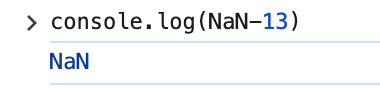

---
title:前端開發學習筆記-Javascript
vlook-doc-lib:
- [筆記網站跳轉](index.html?target=_self "快速挑轉到想要的網頁")
- [前端開發學習筆記★HTML](web_HTML.html?target=_self "網頁開發學習筆記★HTML")
- [前端開發學習筆記★CSS](web_CSS.html?target=_self "網頁開發學習筆記★HTML")
- [前端開發學習筆記★JS](web_JS.html?target=_self "網頁開發學習筆記★HTML")

---

######  ~VLOOK™~ *[<kbd> VLOOK </kbd>](https://github.com/MadMaxChow/VLOOK)*<br>前端開發學習筆記-Javascript<br>──<br><u>簡介</u><br>*本篇筆記是使用[<kbd> Typora</kbd>](https://typora.io/)及[<kbd> Markdown</kbd>](https://markdown.tw/)<br>結合GitHub開源模版撰寫而成並導出成HTML*<br>**JamesZhan**<br>*不允許複製下載`僅供閱覽`* *版本日期`2025年6月1日`*

[TOC]

# 什麼是JavaScript

JavaScript（簡稱 JS）是一種**高級程式語言**，最初是為了在網頁瀏覽器中添加互動功能而設計的。現在已經發展成為一種多用途的程式語言

> [!caution]
>
> JavaScipt跟Java並沒有關係

作用：

* 網頁特效 (監聽使用者的一些行為讓網頁作出對應的反饋)
* 表單驗證 (針對表單資料的合法性進行判斷)
* 資料互動 (獲取後台的資料, 渲染到前端)
* 伺服器端程式設計 (node.js)

JavaScript的組成：


* ECMAScript：規定了 JavaScript 基礎語法核心知識，像是變量、分支語句、循環語句……
* Web APIs：提供與瀏覽器和網頁互動的接口
    * DOM：操作文檔內容，例如：對頁面元素進行移動、調整元素大小
    * BOM：操作瀏覽器，例如：頁面彈窗控制、儲存資料到瀏覽器

>*[<kbd> mdn web docs  </kbd>](https://developer.mozilla.org/en-US/docs/Web/JavaScript)*

##  JavaScript引入方式

JavaScript 程序不能獨立運行，它需要被嵌入 HTML 中，然後瀏覽器才能執行 JavaScript 程式碼，JavaScript引入方式有三種跟CSS很像：

* 內部 JavaScript 
* 行內 JavaScript
* 外部 JavaScript

*^tab^*

> **內部JavaScrip**
>
> 通過 `script` 標籤包住JavaScript 程式碼，script標籤寫在 `</body>` 上面
>
> ```html
> <!DOCTYPE html>
> <html lang="en">
> 
> <head>
> 	<meta charset="UTF-8">
> 	<meta name="viewport" content="width=device-width, initial-scale=1.0">
> 	<title>內部方式引入js</title>
> </head>
> 
> <body>
> 	<script>
> 		alert("Hello World");
> 	</script>
> </body>
> 
> </html>
> ```
>
> > [!caution]
> >
> > 我們將 ` <script> ` 放在HTML檔案的底部附近的原因是瀏覽器會按照程式碼在檔案中的順序載入 HTML
> >
> > 如果先載入的 JavaScript 期望修改其下方的 HTML，那麼它可能由於 HTML 尚未被載入而失效。因此，將 JavaScript 程式碼放在 HTML頁面的底部附近通常是最好的策略

>**行內JavaScript**
>
>JavaScript程式碼寫在HTML標籤裡面
>
>```html
><!DOCTYPE html>
><html lang="en">
>
><head>
>	<meta charset="UTF-8">
>	<meta name="viewport" content="width=device-width, initial-scale=1.0">
>	<title>行內引入js</title>
></head>
>
><body>
>	<button onclick="alert('Hello World')">Click me</button>
></body>
>
></html>
>```

> **外部JavaScript**
>
> 程式碼寫在以.js結尾的檔案裡，通過script標籤，引入到HTML頁面中
>
> *==alert.js==*
>
> ```javascript
> alert("Hello World");
> ```
>
> *==alert.html==*
>
> ```html
> <!DOCTYPE html>
> <html lang="en">
> 
> <head>
> 	<meta charset="UTF-8">
> 	<meta name="viewport" content="width=device-width, initial-scale=1.0">
> 	<title>外部引入js</title>
> </head>
> 
> <body>
> 	<script src="alert.js"></script>
> </body>
> 
> </html>
> ```
>
> > [!note]
> >
> > * script標籤中間無需寫程式碼，否則會被忽略
> > * 外部JavaScript會使程式碼排版更好看更有條理(**推薦作法**_~Rd~_)

## JavaScript註解

---

> **單行註解**
>
> * 符號：//
> * 作用：//右邊這一行的程式碼會被忽略
> * 快捷鍵：ctrl + /
>
> 

> **多行註解**
>
> * 符號：/*  */
> * 作用：在/*  和  */ 之間的所有內容都會被忽略
> * 快捷鍵：shift + alt + A
>
> 

## JavaScript結束符

使用英文的 `;` 代表語句結束，實際開發中，可寫可不寫, 瀏覽器(JavaScript 引擎) 可以自動推斷語句的結束位置，現在越來越多人**主張省略結束符**

> [!caution]
>
> 為了風格統一，結束符要麼每句都寫，要麼每句都不寫


## 輸入輸出語法

輸出和輸入也可理解為人和電腦的互動，使用者通過鍵盤、滑鼠等向電腦輸入資訊，電腦處理後再展示結果給用戶

* 輸出語法：

    * `document.write("Hello World")` 向body內輸出內容

    > [!note]
    >
    > 如果輸出的內容寫的是標籤，也會被解析成網頁元素，例如：
    >
    > `document.write("<h1>Hello World</h1>")`
    >
    > 也可以使用模版字符串 `${變量}` 來輸出變量的內容

    * `alert("Hello World")` 彈出警告
    * `console.log("Hello World")` 控制台輸出語法，程式設計師偵錯使用

* 輸入語法：

    * `prompt("請輸入你的名字")`：顯示一個對話方塊，對話方塊中包含一條文字資訊，用來提示使用者輸入文字

    

> [!note]
>
> 正常來說，會按HTML程式流順序執行JavaScript程式碼，但是 `alert()` 和 `prompt()` 它們會跳過頁面渲染先被執行

## 字面量(Literal)

是指在程式碼中直接表示固定值的記號或符號。簡單來說，就是**直接寫出來的值**，不同的字面量寫法會產生不同的數據類型，直接影響程式的執行結果

* 數字字面量

    ```javascript
    let age = 25;           // 整數字面量
    let price = 99.99;      // 小數字面量
    let scientific = 1e5;   // 科學記號字面量 (100000)
    ```

* 字串字面量

    ```javascript
    let name = "張三";        // 雙引號字串
    let city = '台北';        // 單引號字串
    let message = `你好`;     // 模板字串（反引號）
    ```

* 布林字面量

    ```javascript
    let isActive = true;     // 真值
    let isComplete = false;  // 假值
    ```

* ……

# 變量與常量

==**變量**是用來**儲存數據的容器**，可以存放數字、文字、物件等各種類型的值==


> [!caution]
>
> 變量不是資料本身，它們只是一個用於儲存數值的容器。可以理解為是一個個用來裝東西的紙箱子

## 使用變量

可以把電腦的記憶體想像成一個大倉庫，所有的變量都需要在這個倉庫裡找個位置存放

1. 要想使用變量，首先需要建立變量

    ```javascript
    // let 變量名稱
    let age
    ```

2. 初始化變量，賦值給變量

    ```javascript
    age = 18
    ```

> [!note]
>
> 通常在開發的時候會直接初始化變量
>
> ```javascript
> let age = 18
> ```
>
> 現在都使用 `let` ，而不使用 `var` 定義變量

> [!caution]
>
> 變數命名規則與規範
>
> * 規則：必須遵守，不遵守報錯
>     * 不能用關鍵字
>     * 只能用_、$、字母、數字，且數字不能開頭
>     * 字母嚴格區分大小寫，如 Age 和 age 是不同的變數
> * 規範：建議遵守，不遵守不會報錯，但不符合常規要求
>     * 取名要有意義
>     * 遵守小駝峰命名法，例如：userName、userAge
>
> |   變量名    | 是否報錯 | 是否符合規範 | 說明                 |
> | :---------: | :------: | :----------: | -------------------- |
> |   `21age`   |   報錯   |      ❌       | 不能以數字開頭       |
> |   `_age`    |  不報錯  |      ✅       | 可以以底線開頭       |
> | `user-name` |   報錯   |      ❌       | 不能包含連字號       |
> | `username`  |  不報錯  |      ❌       | 語法正確但不易讀     |
> | `userName`  |  不報錯  |      ✅       | 駝峰命名法           |
> |    `let`    |   報錯   |      ❌       | 保留字不能作為變量名 |
> |   `na@me`   |   報錯   |      ❌       | 不能包含特殊符號     |
> |   `$age`    |  不報錯  |      ✅       | 可以以 $ 開頭        |

## let和var區別

在較舊的JavaScript，使用關鍵字 `var` 來聲明變數 ，而不是 `let`

`var` 現在開發中一般不再使用它，只是我們可能再老版程序中看到它。`let` 為了解決 `var` 的一些問題：

*  可以先使用，再聲明 var ( **不合理!**_~Rd~_，但是不會報錯)

    

* var 聲明過的變數可以重複聲明(**不合理!**_~Rd~_，但是不會報錯)，作用在let上就會報錯

    

    

## 陣列的基本使用

原先一個變量名稱只能接收一個元素，但是如果今天我想要同時記錄五個人的名字，就要有五個變量。這樣會很麻煩，而且當人數更多時，就需要創建更多變量，管理起來非常困難，因此使用**陣列**

*==陣列定義==*

```javascript
// 創建陣列
let 變量名稱 = ['元素1'. '元素2', '元素3'] 

// 陣列取值
變量名稱[索引值]
```

> [!note]
>
> * 陣列是按順序保存，所以每個資料都有自己的索引
> * 電腦中的編號從0開始
> * 陣列可以儲存任意類型的資料


## 常量

當某個變數永遠不會改變的時候，就可以使用 `const` 來聲明，而不是 `let`

```javascript
const PI = 3.14
```

> [!caution]
>
> 常量不允許重新賦值，聲明的時候必須賦值（初始化）
>
> 
>
> 

# 資料類型

**為什麼要給資料分類？**

雖然電腦程序可以處理大量資料，但**分類是為了讓處理更有效率和更安全**，就像圖書館雖然可以存放很多書，但仍需要分類編號一樣

JavaScript資料類型分為兩大類：


## 數字類型

數字類型包括整數、小數、正數、負數，這些數字類型可以有很多的操作，比如，乘法 * 、除法 / 、加法 + 、減法 - 等等，所以經常和算術運算子一起做數學運算

**在主控台中數字類型的文字顏色為藍色**


> [!note]
>
> **Java V.S. JavaScript**
>
> * JavaScript 是弱資料類型：變量到底屬於那種類型，只有賦值之後，我們才能確認
> * Java是強資料類型：例如  int  a = 3 必須是整數

> **計算圓面積**
>
> 對話方塊中輸入圓的半徑，算出圓的面積並顯示到頁面
>
> *  圓面積計算公式：π*r² 
> * 常量：PI = 3.14
>
> ```javascript
> <script>
>   let r = prompt("請輸入半徑")
>   const PI = 3.14
>   let area = PI * r * r
>   document.write(`<h1>圓面積: ${area}</h1>`)
> </script>
> ```

> [!note]
>
> NaN 代表一個計算錯誤。它是一個不正確的或者一個未定義的數學操作所得到的結果
>
> ---
>
> > 
>
> > 

## 字串類型

**通過單引號（''） 、雙引號（""）或反引號(`) 包著的資料都叫字串**，單引號和雙引號沒有本質上的區別，**推薦使用單引號**

**在主控台中字串類型的文字顏色為黑色**


> [!note]
>
> * 無論單引號或是雙引號必須成對使用
> * 單引號/雙引號可以互相嵌套，但是不以自已嵌套自已
>     （口訣：外雙內單，或者外單內雙）
> * 必要時可以使用轉義符 \，輸出單引號或雙引號

> **字串拼接**
>
> * 使用`+` 號實現字串的拼接
>
>     ```javascript
>     let name = 'John' // 使用單引號
>     let gender = "male" // 使用雙引號
>     let score = `90` // 使用反引號
>     document.write('我是' + 'John' + '<br>')
>     document.write('名字' + name + '性別' + gender)
>     ```
>
>     
>
> * 內容連接變量時，用 `${ } `包住變量
>
>     > [!caution]
>     >
>     > 要使用反引號``
>
>     ```javascript
>     document.write(`名字${name}性別${gender}`)
>     ```

## 布林類型

只有兩個固定的值

* **true**：表示為真
* **false**：表示為假

> [!caution]
>
> 只能是小寫，如果寫成大寫就不是布林類型了

```javascript
let run = true
console.log(run)
```

## 未定義類型

未定義是比較特殊的類型，只有一個值 undefined，只聲明變量，不賦值的情況下，變量的預設值為 undefined，一般很少直接為某個變數賦值為 undefined


## 空類型

null 代表**沒有**或**值未知**的特殊值，可以先把看成null 作為尚未建立的物件

> [!note]
>
> null 和 undefined 區別：
>
> * undefined  表示**沒有賦值**
> * null 表示**賦值**了，但是內容為**空**

```javascript
let obj = null
console.log(obj)
```

## 資料類型檢測

可以透過 `typeof` 關鍵字檢測資料類型，`typeof` 可以返回被檢測的資料類型。它支援兩種語法形式：

* `typeof 變量` (常用)
* `typeof(變量)`

```javascript
let age = 18
console.log(typeof age)
let name = 'John'
console.log(typeof name)
let isStudent = true
console.log(typeof isStudent)
let hobbies = null
console.log(typeof hobbies)
```


## 類型轉換

使用表單、prompt 獲取資料**默認是字串類型**，此時就不能直接簡單的進行四則運算，就需要轉換變量的資料類型


> **隱式轉換**
>
> 執行時，系統內部自動將資料類型進行轉換，這種轉換稱為隱式轉換
>
> * 字串加上數字，數字就會自動轉換成字串
> * **除了+以外的，都會把資料轉成數字類型**
>
> > [!caution]
> >
> > 缺點：轉換類型不明確，靠經驗才能知道
>
> > [!note]
> >
> > 如果有一串字串裡面放著數字，前面有一個**+**號，可以**解析成數字類型**
>
> 

> **顯式轉換**
>
> 隱式轉換不嚴謹，因為隱式轉換規律並不清晰，大多是靠經驗總結的規律，所以顯式轉換可以自己寫程式告訴系統要轉換成什麼類型
>
> * 轉換為數字型
>
>   
>
>   
>
>   
>
>   * Number(資料)
>     * 轉成數字類型
>     * 如果字串內容裡有非數字，轉換失敗時結果為 NaN（Not a Number）即不是一個數字
>     * NaN也是number類型的資料，代表非數字
>   * parseInt(資料)
>     * 只保留整數
>   * parseFloat(資料)
>     * 可以保留小數
>
> * 轉換為字元型
>
>   * String(資料)
>   * 變數.toString(進制)

 

# The End<br>*Written by JamesZhan*<br><sub>若是內容有錯誤歡迎糾正 *[<kbd> Email</kbd>](mailto:henry16801@gmail.com?subject="內容錯誤糾正(非錯誤糾正可自行更改標題)")*</sub>