---
title:前端開發學習筆記-React
vlook-doc-lib:
- [筆記網站跳轉](index.html?target=_self "快速挑轉到想要的網頁")
- [前端開發學習筆記★HTML](web_HTML.html?target=_self "網頁開發學習筆記★HTML")
- [前端開發學習筆記★CSS](web_CSS.html?target=_self "網頁開發學習筆記★CSS")
- [前端開發學習筆記★JS](web_JS.html?target=_self "網頁開發學習筆記★JS")
- [前端開發學習筆記★React](web_React.html?target=_self "網頁開發學習筆記★React")
---

######  ~VLOOK™~ *[<kbd> VLOOK </kbd>](https://github.com/MadMaxChow/VLOOK)*<br>前端開發學習筆記-React──<br><u>簡介</u><br>*本篇筆記是使用[<kbd> Typora</kbd>](https://typora.io/)及[<kbd> Markdown</kbd>](https://markdown.tw/)<br>結合GitHub開源模版撰寫而成並導出成HTML*<br>**JamesZhan**<br>*不允許複製下載`僅供閱覽`* *版本日期`2025年6月1日`*

[TOC]

# 什麼是React

React 是一個由 **Facebook (現在的 Meta)** 開發的 **JavaScript 框架**，專門用來建構使用者介面 (UI)

**傳統網頁開發的痛點**

- **DOM 操作複雜** - 手動管理網頁元素變化很繁瑣
- **狀態管理混亂** - 資料變化時，很難追蹤哪些地方需要更新
- **程式碼重複** - 相似的功能需要重複寫很多次
- **維護困難** - 專案變大後，程式碼變得難以理解和修改

**React 的解決方案**

React 引入了「**元件化**」的開發方式，把複雜的介面拆解成一個個獨立的「元件」，還有**豐富的第三方套件** - 幾乎任何功能都有現成的解決方案

> [!note]
>
> **元件化開發**
>
> - 每個元件負責自己的功能，可以重複使用
> - 容易測試和維護

## 快速搭建開發環境

*^tab^*

> **Node.js安裝**
>
> *[<kbd> Node.js  </kbd>](https://nodejs.org/zh-tw/download)*
>
> **Windows：**
>
> 1. 按 `Win + R`
> 2. 輸入 `cmd`，按 Enter
> 3. 在黑色視窗中輸入：`node --version`
> 4. 應該會顯示版本號（例如：v18.17.0）
>
> **Mac：**
>
> 1. 按 `Cmd + 空白鍵`
> 2. 輸入 `terminal`，按 Enter
> 3. 輸入：`node --version`
> 4. 應該會顯示版本號
>
> 能顯示版本號，代表Node.js已經安裝成功

> **建立React專案**
>
> 1. 選擇專案位置
>
>    建議在桌面或是資料夾建立一個叫 `my-react-projects` 的專案
>
> 2. 開啟終端機
>
>    cd 進入`my-react-projects` 專案資料夾
>
> 3. 建立React專案
>
>    ```bash
>    npx create-react-app my-first-app
>    ```
>
>    > [!note]
>    >
>    > * **npx**：Node.js工具命令，尋找並執行後續的包命令
>    > * **create-react-app**：核心包（固定寫法），用於建立React項目
>    > * **my-first-app**：React項目的名稱（可以自訂）
>
>    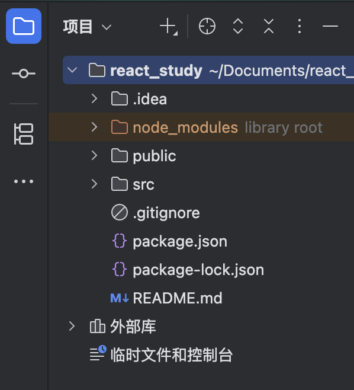
>
> 4. 啟動專案
>    ```bash
>    npm start
>    ```

> **調整專案檔案結構**
>
> 因為目前學習可以先把不需要的檔案暫時移除，src資料夾中只保留
>
> * App.js
>
>   ```jsx
>   function App() {
>     return (
>       <div className="App">
>         this is app
>       </div>
>     );
>   }
>   
>   export default App;
>   ```
>
> * index.js
>
>   ```jsx
>   import React from 'react';
>   import ReactDOM from 'react-dom/client';
>   import App from './App';
>                         
>   const root = ReactDOM.createRoot(document.getElementById('root'));
>   root.render(<App />);
>   ```

## index.js程式的入口

告訴瀏覽器「React 要在哪裡顯示」

* 引入 React核心套件

  ```jsx
  import React from 'react';
  import ReactDOM from 'react-dom/client';
  ```

  - 就像「引入工具箱」

  - 讓你可以使用 React 的功能

* 引入專案根套件

  ```jsx
  import App from './App';
  ```

  - 引入 App.js 這個檔案

  - App 就是你的主要元件

* 選染網頁

  ```jsx
  const root = ReactDOM.createRoot(document.getElementById('root'));
  root.render(<App />);
  ```

  - `document.getElementById('root')` = 找到 public/index.html 中 id 為 'root' 的元素
  - `render(<App />)` = 把 App 元件顯示在那個位置

## App.js專案的根套件

定義你的網頁長什麼樣子

* 被引入到index.js中，選染到public/index.html(root)中

  ```jsx
  function App() {
    return (
      <div className="App">
        this is app
      </div>
    );
  }
  
  export default App;
  ```

# JSX概念

==**JSX = JavaScript + XML**==

JavaScript 中寫 HTML，他是React中編寫UI模版的方式，JSX並不是標準的JS語法，它是**JS的語法擴展**，瀏覽器本身不能識別，需要通過**解析工具做解析**之後才能在瀏覽器中運行

JSX優勢：

- 看起來像 HTML
- 可以嵌入 JavaScript
- 讓程式碼更易讀
- 支援所有 HTML 標籤

*[<kbd> Babel解析工具  </kbd>](https://babeljs.io/repl)*

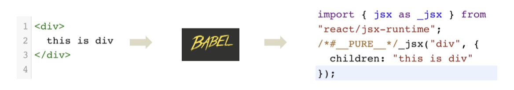

---

> **傳統寫法**
>
> ```javascript
> // 用 JavaScript 建立 HTML 元素
> const element = document.createElement('div');
> element.className = 'container';
> element.innerHTML = '<h1>Hello World</h1>';
> document.body.appendChild(element);
> ```

>**JSX方式**
>
>```jsx
>// 直接寫 HTML！
>const element = <div className="container"><h1>Hello World</h1></div>;
>```

## 使用JS表示式

在JSX中可以通過 **大括號語法{}** 識別 JavaScript中的表示式，比如常見的變數、函數呼叫、方法呼叫等等

1. 使用引號傳遞字串
2. 使用JavaScript變數
3. 函數呼叫和方法呼叫
4. 使用JavaScript對象

> [!caution]
>
> if語句、switch語句、變數聲明屬於語句，不是表示式，不能出現在{}中

```jsx
const count = 100

function getName() {
  return "James"
}

function App() {
  return (
    <div className="App">
      {/*傳遞字符串*/}
      {"this is app"}

      {/*使用JavaScript變量*/}
      {count}

      {/*調用JavaScript函數*/}
      {getName()}

      {/*使用JavaScript對象*/}
      <div style={{ color: "red"}}>This is red text</div>
    </div>
  );
}

export default App;
```

## 列表渲染

==在 JSX 中渲染列表，主要用 **`.map()`** 方法==

```jsx
const list = [
  { id: 1, name: "John" },
  { id: 2, name: "Jane" },
  { id: 3, name: "Doe" }
]

function App() {
  return (
    <div className="App">
      <ul>
        {/*兩種寫法都可以*/}
        {list.map(function(item) {
          return <li key={item.id}>{item.name}</li>;
        })}

        {list.map(item => <li key={item.id}>{item.name}</li>)}
      </ul>
    </div>
  );
}

export default App;
```

> [!note]
>
> **為什麼需要 key？**
>
> - React 需要知道哪個項目是哪個
> - 幫助 React 高效更新列表
> - 沒有 key 會有警告訊息，並且key需要**獨一無二**
>
> ```jsx
> // ✅ 正確：每個項目都有唯一的 key
> {items.map(item => <li key={item.id}>{item.name}</li>)}
> 
> // ❌ 錯誤：沒有 key
> {items.map(item => <li>{item.name}</li>)}
> 
> // ⚠️  不推薦：用索引當 key（除非沒有其他選擇）
> {items.map((item, index) => <li key={index}>{item.name}</li>)}
> ```

> [!note]
>
> **箭頭函數的語法規則**
>
> 它是 JavaScript ES6 新增的**寫函數的簡短方式**
>
> ```javascript
> 函數名 = (參數) => { 函數內容 }
> 
> // 傳統寫法
> function sayHello(name) {
>   return "Hello, " + name;
> }
> 
> // 箭頭函數寫法
> const sayHello = name => "Hello, " + name;
> ```

## 條件渲染

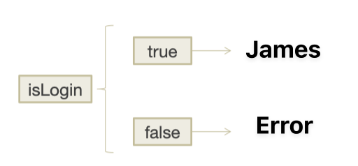

在React中，可以通過**邏輯與運算子&&**、**三元表示式（?:）**實現基礎的條件渲染

* **邏輯與運算子&&**

  ```jsx
  let login = true
  
  function App() {
    return (
      <div className="App">
        {login && <span>James</span>}
      </div>
    );
  }
  
  export default App;
  ```

  > [!note]
  >
  > 當login為true時才顯示James，如果為false

* **三元表示式（?:）**

  ```jsx
  let login = true
  
  function App() {
    return (
      <div className="App">
        {login ? <span>James</span> : <span>Error</span>}
      </div>
    );
  }
  
  export default App;
  ```
  

# React事件綁定

**事件綁定** = 讓你的網頁元素可以「回應」用戶的操作

比如：

- 按鈕被點擊 → 執行某個動作
- 輸入框內容改變 → 更新資料
- 滑鼠移入 → 顯示提示

```jsx
<元素 on事件名={處理函數}>內容</元素>
```

>[!note]
>
>處理函數整體上遵循駝峰命名法，例如： clickHandler、moveHandler

進行事件綁定前，需要先建立一個事件函數，在綁定到事件上：

```jsx
function App() {
  const clickHandler = () => {
    console.log("按鍵被點擊");
  }

  return (
    <div className="App">
      <button onClick={clickHandler}>click me</button>
    </div>
  );
}

export default App;
```

> [!important]
>
> 這裡 `<button onClick={clickHandler}>click me</button>` 裡面的 `clickHandler` 他是一個**回調函數**等待被執行，並**不是函數執行完的結果**，當點擊事件觸發了才會執行回調函數

## 獲取事件對象參數


**事件參數 `e`**（通常叫做 `event`）是瀏覽器自動傳給事件處理函數的**事件對象**

它包含了關於這個事件的**所有資訊**

```jsx
function App() {
  const clickHandler = (e) =>{
    console.log("按鍵被點擊", e);
  }

  return (
    <div className="App">
      <button onClick={clickHandler}>click me</button>
    </div>
  );
}

export default App;
```

> [!note]
>
> 為什麼 `<button onClick={clickHandler}>click me</button>` 沒有傳入參數，卻可以獲得事件參數e？
>
> 因為當你寫 `onClick={handleClick}` 時，**React 會自動把事件對象當作第一個參數傳給你的函數**！
>
> ```jsx
> // React 內部大概是這樣處理的
> const button = document.createElement('button');
> button.addEventListener('click', (event) => {
>   handleClick(event); // React 自動傳入 event！
> });
> ```
>

## 傳遞自定義參數

當你需要在事件觸發時傳遞自定義參數時，需要在事件綁定的位置**使用箭頭函數來包裝你的處理函數**，這樣就可以在調用時傳入實際參數

1. 事件函數中放入形式參數
2. 改造成箭頭函數，並傳入實際參數

```jsx 
function App() {
  const clickHandler = (name) =>{
    console.log("按鍵被點擊", name);
  }

  return (
    <div className="App">
      <button onClick={() => clickHandler("James")}>click me</button>
      
      {/*<button onClick={function () {clickHandler("James")}}>*/}
      {/*  click me*/}
      {/*</button>*/}
    </div>
  );
}

export default App;
```

> **為什麼要使用箭頭函數？**
>
> React 的事件處理基於**回調函數**模式：
>
> - React 期望你提供一個**函數**，不是函數的執行結果
> - 當事件發生時，React 會**調用**你提供的函數
> - 這就是經典的「稍後調用」回調機制
>
> ---
>
> > **錯誤寫法**
> >
> > ```jsx
> > function WrongExample() {
> >     const handleClick = (param) => {
> >        console.log('處理參數：', param);
> >        return '執行結果';
> >     };
> > 
> >     return (
> >        // ❌ 這會在渲染時立即執行函數
> >        <button onClick={handleClick('我的參數')}>
> >          錯誤按鈕
> >        </button>
> >     );
> > }
> > ```
> > 
> > * handleClick('我的參數') 在渲染時立即執行
> >* onClick 得到的是返回值 '執行結果'，不是函數
> > * React 無法調用一個字符串作為回調函數
> > * 點擊時會報錯或無反應
> > 
> > _~Rd~_
>
> > **正確寫法**
> >
> > ```jsx
> > function CorrectExample() {
> >   const handleClick = (param) => {
> >     console.log('處理參數：', param);
> >   };
> > 
> >   return (
> >     // ✅ 提供一個回調函數給 React
> >     <button onClick={() => handleClick('我的參數')}>
> >       正確按鈕
> >     </button>
> >   );
> > }
> > ```
> >
> > * 渲染時：創建箭頭函數 (e) => handleClick('我的參數', e)
> > * onClick 得到這個箭頭函數
> > * 點擊時：React 調用箭頭函數，傳入事件對象
> > * 箭頭函數內部調用 handleClick，傳入自定義參數和事件對象
> >
> > _~Gn~_

## 同時傳遞事件對象和自定義參數

```jsx
function App() {
  const clickHandler = (name, e) =>{
    console.log("按鍵被點擊", name, e);
  }

  return (
    <div className="App">
      <button onClick={(e) => clickHandler("James", e)}>click me</button>
    </div>
  );
}

export default App;
```

> [!note]
>
> `(e) => clickHandler("James", e)` 作為回調函數傳遞給 onClick，當點擊發生時，這個回調函數接收事件對象 e，然後將 "James" 和 e 傳遞給 clickHandler 函數

> [!caution]
>
> 實際參數的位置要和形式參數對應上

# React組件

一個組件就是使用者介面的一部分，它可以有自己的邏輯和外觀，組件之間可以互相嵌套，也可以重複使用多次

在React中，一個組件就是**首字母大寫的函數**，內部存放了組件的邏輯和UI，渲染組件只需要把組件**當成標籤書寫**即可

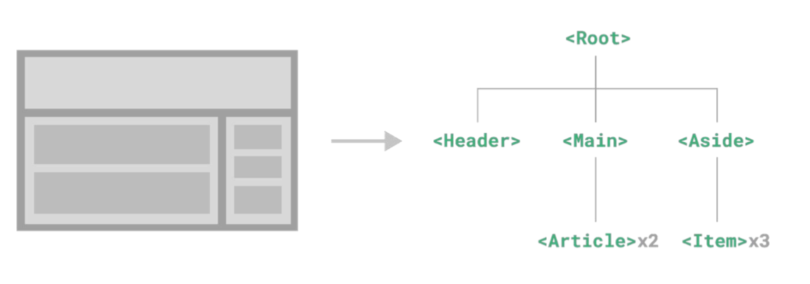

1. 定義組件

   ```jsx
   function Button() {
     return (
       <button>Click me</button>
     );
   }
   
   // 箭頭函數
   // const Button = () => {
   //   return (
   //     <button>Click me</button>
   //   );
   // }
   ```

2. 使用組件

   ```jsx
   function Button() {
     return (
       <button>Click me</button>
     );
   }
   
   // 箭頭函數
   // const Button = () => {
   //   return (
   //     <button>Click me</button>
   //   );
   // }
   
   function App() {
   
     return (
       <div className="App">
         {/*單標籤*/}
         <Button/>
         {/*雙標籤*/}
         <Button></Button>
       </div>
     );
   }
   
   export default App;
   ```

## 基礎樣式控制

React組件基礎的樣式控制有兩種方式：

1. **行內樣式（不推薦）**

   ```jsx
   function App() {
   
     return (
       <div className="App">
         <span style={{color: "red", fontSize: "32px"}}>這是span文字</span>
       </div>
     );
   }
   
   export default App;
   ```

2. **class類名控制**

   建議獨立建立一個控制樣式的css檔案，再引入app.js中做使用

   ```css
   .test {
       color: blue;
       font-size: 24px;
   }
   ```

   ```jsx
   import './index.css'
   
   function App() {
   
     return (
       <div className="App">
         <span style={{color: "red", fontSize: "32px"}}>這是span文字</span>
         <span className="test">這是span文字</span>
       </div>
     );
   }
   
   export default App;
   ```

   >[!note]
   >
   >導入CSS樣式必須使用 `className=` ，這是React JSX的規定，因為 `class` 是 JavaScript 的**保留字**（用於定義類）

## 組間之間資料傳遞

組件需要互相溝通才能協作。以下是主要的傳遞方式：

* A-B 父子資料傳遞
* B-C 兄弟資料傳遞
* A-E 跨層資料傳遞

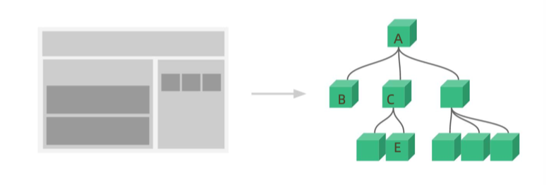

*^tab^*

> **父傳子**
>
> 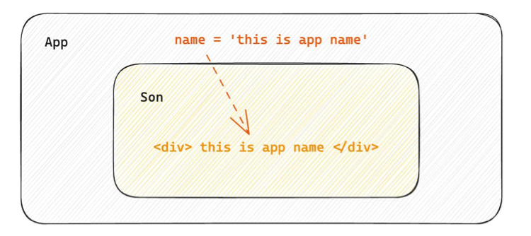
>
> 實現方法：
>
> 1. 父組件傳遞資料 - 在子組件標籤上**綁定屬性**
>
>    ```jsx
>    function App() {
>      const name= 'this is app name'
>    
>      return (
>        <div className="App">
>          <Son name={name}></Son>
>        </div>
>      );
>    }
>    ```
>
> 2. 子組件接收資料 - 子組件**通過props參數**接收資料
>
>    ```jsx
>    function Son(props){
>      return <div>this is son, {props.name}</div>;
>    }
>    ```
>
>    > [!note]
>    >
>    > props包含了父組件傳遞過來的所有資料(可傳遞任意的資料)，子元件**只能讀取props中的資料**，**不能直接進行修改**
>    >
>    > **父元件的資料只能由父元件修改**
>
> > [!TIP]
> >
> > **特殊的prop children** (需要成對標籤)
> >
> > 當我們把內容嵌套在子組件標籤中時，父組件會自動在名為children的prop屬性中接收該內容
> >
> > 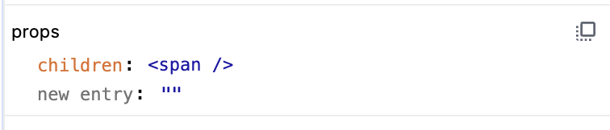
> >
> > ```jsx
> > function Son(props){
> >   console.log(props);
> >   return <div>this is son, {props.children}</div>;
> > }
> > 
> > function App() {
> > 
> >   return (
> >     <div className="App">
> >       <Son>
> >         <span>this is span</span>
> >       </Son>
> >     </div>
> >   );
> > }
> > 
> > export default App;
> > ```
> >
> > 

> **子傳父**
>
> 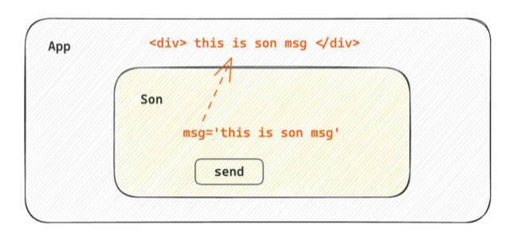
>
> 在子元件中呼叫父元件中的函數並傳遞參數
>
> ```jsx
> import {useState} from "react";
> 
> function Son({onGetSonMsg}) {
>     // Son組件資料
>     const sonMsg = "this is son msg"
>     return (
>       <div>
>         this is son
>         {/*2.子組件調用父組件的函數*/}
>         <button onClick={() => onGetSonMsg(sonMsg)}>Get Son</button>
>       </div>
>     )
> }
> 
> function App() {
>     const [msg, setMsg] = useState("");
>     const getMsg = (msg) => {
>       console.log(msg)
>       setMsg(msg)
>     }
>     return (
>       <div className="App">
>         this is app, {msg}
>         {/*1.建立回調給子組件*/}
>         <Son onGetSonMsg={getMsg}></Son>
>       </div>
>     );
> }
> 
> export default App;
> ```
>

> **兄弟互傳**
>
> 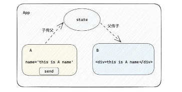
>
> 通過父組件進行兄弟組件之間的資料傳遞
>
> 1. A組件先通過子傳父的方式把資料傳給父組件App
> 2. App拿到資料後通過父傳子的方式再傳遞給B組件
>
> ```jsx
> import {useState} from "react";
> 
> function A ({onGetAMsg}) {
>   const msg = 'this is a message!'
> 
>   return (
>     <div>
>       this is a component
>       <button onClick={() => onGetAMsg(msg)}>send</button>
>     </div>
>   )
> }
> 
> function B ({msg}) {
>   return (
>     <div>
>       this is b component, {msg}
>     </div>
>   )
> }
> 
> function App() {
>   const [msg, setMsg] = useState('')
>   const getAMsg = (msg) => {
>     console.log(msg)
>     setMsg(msg)
>   }
> 
>   return (
>     <div className="App">
>       <A onGetAMsg={getAMsg}></A>
>       <B msg={msg}></B>
>     </div>
>   );
> }
> 
> export default App;
> ```

> **跨層傳遞**
>
> 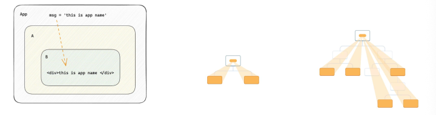
>
> > [!note]
> >
> > 只要有頂層和底層的關係就可以直接使用這套機制
>
> 1. 使用createContext方法建立一個上下文物件Ctx
> 2. 在頂層組件（App）中通過 Ctx.Provider 組件提供資料
> 3. 在底層組件（B）中通過 useContext 鉤子函數獲取資料
>
> ```jsx
> // app -> A -> B
> 
> // 1. 使用createContext方法創建上下文物鍵
> import {createContext, useContext} from 'react';
> const MsgContext = createContext()
> 
> function A () {
>   return (
>     <div>
>       this is a component
>       <B/>
>     </div>
>   )
> }
> 
> function B () {
>   // 3. 通過 useContext 鉤子函數獲取消費資料
>   const msg = useContext(MsgContext)
>   return (
>     <div>
>       this is b component, {msg}
>     </div>
>   )
> }
> 
> function App() {
>  const msg = 'this is app msg'
>   return (
>     <div className="App">
>       {/*2. 通過 Ctx.Provider 組件提供資料*/}
>       <MsgContext.Provider value={msg}>
>         this is app
>         <A/>
>       </MsgContext.Provider>
>     </div>
>   );
> }
> 
> export default App;
> 
> ```
>
> 


# useState管理狀態

**useState** 是 React 的一個 **Hook**，讓你在**函數組件**中添加和管理**狀態（state）**，和普通JS變數不同的是，狀態變數一旦發生變化，組件的UI也會跟著變化（**資料驅動視圖**）

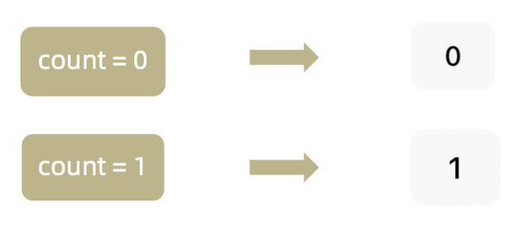

```jsx
const [狀態變數, 設定函數] = useState(初始值);
//     ^^^^^^   ^^^^^^        ^^^^
//     當前值   更新狀態的函數   初始狀態值
```

1. 調用useState添加一個狀態變量(**需要導入**)

   ```jsx
   import {useState} from 'react'
   ```
2. 建立點擊事件回調，並更新狀態值

   ```jsx
   function App() {
     // 1. 使用useState添加一個狀態
     const [count, setCount] = useState(0)
   
     // 2. 點擊按鈕回調，更新狀態
     const clickHandler = () => {
       setCount(count + 1)
     }
   
     return (
       <div className="App">
         <button onClick={clickHandler}>{count}</button>
       </div>
     );
   }
   
   export default App;
   ```

## 修改對象狀態

對於對象類型的狀態變數，應該始終**傳給set方法**來進行修改

> [!important]
>
> 在React中，狀態被認為是**唯讀**的，我們應該**始終替換它而不是修改它**，直接修改狀態不能引發視圖更新
>
> 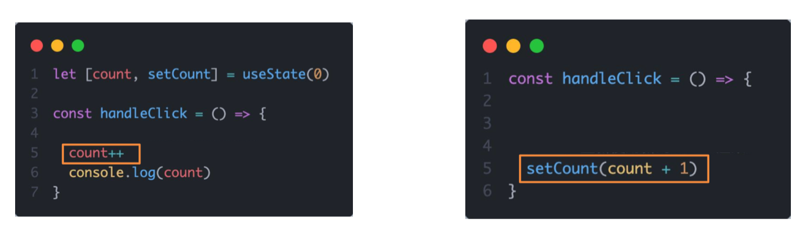

---

> **直接修改對象值**
>
> ```jsx
> import {useState} from 'react';
> 
> function App() {
>   const [form, setForm] = useState({name: "James"});
> 
>   const changeForm = () => {
>     form.name = "Jack"
>   }
> 
>   return (
>     <div className="App">
>       <button onClick={changeForm}>{form.name}</button>
>     </div>
>   );
> }
> 
> export default App;
> ```
>
> _~Rd~_

> **呼叫set傳入新對象修改**
>
> ```jsx
> import {useState} from 'react';
> 
> function App() {
>   const [form, setForm] = useState({name: "James"});
> 
>   const changeForm = () => {
>     setForm({
>       ...form,
>       name: "Jack"
>     })
>   }
> 
>   return (
>     <div className="App">
>       <button onClick={changeForm}>{form.name}</button>
>     </div>
>   );
> }
> 
> export default App;
> ```
>
> _~Gn~_

*[<kbd> bilibili練習  </kbd>](#bilibili評論案例)*

## 控制表單狀態

使用 React 組件的狀態（useState）來控制表單的狀態

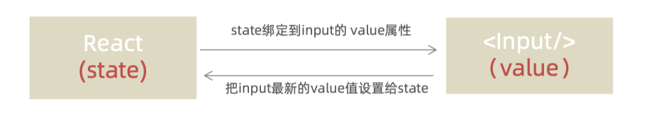

1. 準備一個React狀態值，讓input標籤value屬性保持更新

2. 通過value屬性綁定狀態，通過onChange更新變量

```jsx   
import {useState} from "react";

function App() {

  const [value, setValue] = useState('');

  return (
    <div className="App">
    <input
      type="text"
      value={value}
      onChange={(e) => setValue(e.target.value)}/>
    </div>
  );
}

export default App;
```

# useRef取得 DOM 元素

`useRef` 是 React 中用來直接存取 DOM 元素的 Hook，分為兩步驟：

1. 使用useRef建立 ref 對象，並與 JSX 綁定
2. 在DOM可用時，通過 inputRef.current 拿到 DOM 對象

```jsx
import {useRef} from 'react'

function App() {

  // 1. 生成useRef並綁定
  const inputRef = useRef(null)

  const showDom = () => {
    // 2. 通過 inputRef.current 拿到 DOM 對象
    console.log(inputRef.current)
  }

  return (
    <div className="App">
      <input type="text" ref={inputRef} />
      <button onClick={showDom}>Click</button>
    </div>
  );
}

export default App;
```

> [!note]
>
> **為什麼使用useRef而不是使用傳統的DOM獲取？**
>
>  React 會不斷重新渲染頁面，每次重新渲染時，你都要重新去「找」這個輸入框在哪裡
>
> **用 useRef 的話：** 就像你在輸入框上貼了一張「我的名片」，之後不管頁面怎麼變化，你都可以直接透過這張名片找到它，不用再重新搜尋

*[<kbd> bilibili發表評論  </kbd>](#bilibili發表評論)*


# useEffect副作用

`useEffect` 是 React Hook，用於處理組件的**副作用**（side effects）。它會在組件渲染完成後執行，讓我們可以安全地執行各種任務，有兩個核心使用場景：

1. **渲染完成後執行任務**

   **渲染完成**的時候再執行一些任務時使用 `useEffect`

   - DOM 操作（設置焦點、測量尺寸）
   - 更新頁面標題
   - 初始化第三方庫
   - 設置事件監聽器

2. **特定條件下執行邏輯**

   想要在**特定的條件**下去執行 useEffect 裡面的邏輯時使用

   - **API 調用** 
   - 數據獲取
   - 搜索功能
   - 即時數據更新

> [!important]
>
> |   觸發方式   |               例子                |  何時執行  |
> | :----------: | :-------------------------------: | :--------: |
> | **事件引起** | `onClick`, `onChange`, `onSubmit` | 用戶操作時 |
> | **渲染引起** |            `useEffect`            | 組件渲染後 |

```jsx
useEffect(
  () => {
    // 副作用函數
    // 在這裡寫副作用邏輯
    
    return () => {
      // 清理函數（可選）
      // 在組件卸載或下次副作用執行前調用
    };
  },
  [依賴項1, 依賴項2] // 依賴陣列（可選）空陣列 = 只執行一次
);
```

## useEffect 依賴項參數

useEffect副作用函數的執行時機存在多種情況，根據**傳入依賴項的不同**，會有不同的執行表現

|   依賴項類型   | 初始渲染 | State 改變 | Props 改變 | 使用建議                 |
| :------------: | :------: | :--------: | :--------: | ------------------------ |
| **沒有依賴項** |    ✅     |     ✅      |     ✅      | 謹慎使用，易造成性能問題 |
| **空陣列 []**  |    ✅     |     ❌      |     ❌      | 初始化、設定監聽器       |
|  **[特定值]**  |    ✅     |  依值而定  |  依值而定  | 響應特定變化，最常用     |

*^tab^*

> **沒有依賴項**
>
> ```jsx
> import {useState, useEffect} from 'react'
> 
> function App () {
>   // 1. 沒有依賴項
>   const [count, setCount] = useState(0);
>   useEffect(() => {
>     console.log('useEffect 被執行了')
>   })
> 
>   return (
>     <div className="App">
>       this is app
>       <button onClick={() => setCount(count + 1)}>{count}</button>
>     </div>
>   )
> }
> export default App;
> ```
>
> 執行時機：
>
> * 組件初始渲染時執行 
> * count 改變時執行
> * 任何 state 改變都會執行

> **空陣列 []**
>
> ```jsx
> import {useState, useEffect} from 'react'
> 
> function App () {
>   const [count, setCount] = useState(0);
>   // 2. 傳入空陣列
>   useEffect(() => {
>     console.log('useEffect 被執行了')
>   },[])
> 
>   return (
>     <div className="App">
>       this is app
>       <button onClick={() => setCount(count + 1)}>{count}</button>
>     </div>
>   )
> }
> export default App;
> ```
>
> 執行時機：
>
> * 組件初始渲染時執行

> **添加特定依賴**
>
> ```jsx
> import {useState, useEffect} from 'react'
> 
> function App () {
>   const [count, setCount] = useState(0);
>   // 3. 傳入特定依賴
>   useEffect(() => {
>     console.log('useEffect 被執行了')
>   },[count])
> 
>   return (
>     <div className="App">
>       this is app
>       <button onClick={() => setCount(count + 1)}>{count}</button>
>     </div>
>   )
> }
> export default App;
> ```
>
>  執行時機：
>
> * 組件初始渲染時執行
> * 只針對count 改變時執行

> [!important]
>
> **沒有依賴項** VS **依賴 [count]**
>
> 可以看到兩個的執行結果一樣，但是兩個其實有很大的差異，如果再增加多一點的狀態就可以觀察到，例如增加name這個狀態：
>
> |         操作          | 沒有依賴項 | 依賴 [count] |
> | :-------------------: | :--------: | :----------: |
> |     **初始渲染**      |   ✅ 執行   |    ✅ 執行    |
> | **點擊 "增加 Count"** |   ✅ 執行   |    ✅ 執行    |
> | **點擊 "改變 Name"**  |   ✅ 執行   | ❌ **不執行** |
> |  **點擊 "切換主題"**  |   ✅ 執行   | ❌ **不執行** |

## 清除副作用

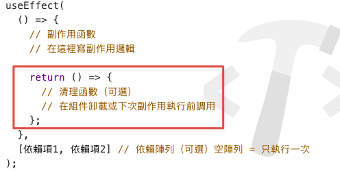

組件卸載或依賴項改變時，我們需要清理之前設置的副作用，避免記憶體洩漏和意外行為

副作用清除就是在適當的時機**撤銷**或**清理**之前設置的副作用，比如：

- 移除事件監聽器
- 清除定時器
- 取消網路請求
- 清理訂閱

*^tab^*

> **沒有清除副作用**
>
> ```jsx
> import {useState, useEffect} from 'react'
> 
> function Son() {
>   useEffect(() => {
>     const timer = setInterval(() => {
>       console.log('timer執行中...')
>     }, 1000)
>   })
>   return (
>     <div>this is son</div>
>   )
> }
> 
> function App () {
>   const [show, setShow] = useState(true)
>   return (
>     <div className="App">
>       {show && <Son/>}
>       <button onClick={() => setShow(false)}>清理組件</button>
>     </div>
>   )
> }
> export default App;
> ```
>
> 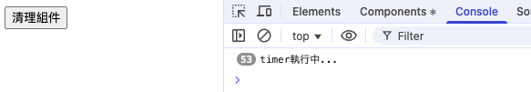
>
> 可以看到及使組件已經被清理，但是計時器依然再執行，繼續輸出 "timer執行中..."，需要添加一個清除函數來解決這個問題

> **清除副作用**
>
> ```jsx
> import {useState, useEffect} from 'react'
> 
> function Son() {
>   useEffect(() => {
>     const timer = setInterval(() => {
>       console.log('timer執行中...')
>     }, 1000)
> 
>     // 清除副作用
>     return () => {
>       clearInterval(timer)
>     }
>   })
>   return (
>     <div>this is son</div>
>   )
> }
> 
> function App () {
>   const [show, setShow] = useState(true)
>   return (
>     <div className="App">
>       {show && <Son/>}
>       <button onClick={() => setShow(false)}>清理組件</button>
>     </div>
>   )
> }
> export default App;
> ```
>
> ```markdown
> 用戶操作 → 控制台輸出
> -------------------
> 1. 頁面加載    → 🟢 Son 組件掛載
>                → ⏰ timer執行中...
> 2. 等待1秒     → ⏰ timer執行中...
> 3. 點擊清理組件 → 🔴 Son 組件卸載，清除定時器
> 4. 等待1秒     → (無輸出 ✅ 定時器已停止)
> ```

# 自定義Hook

它的名稱以 `use` 開頭，並且可以調用其他的 Hook。它讓我們可以將**組件邏輯提取到可重複使用的函數中**

操作步驟：

1. 聲明一個以use開頭的函數
2. 在函數內封裝可以重複使用的邏輯
3. 把需要用到的狀態或者回調，使用return傳出來
4. 在哪個組件中用到該邏輯，就執行剛剛聲明的函數並解析出來狀態和回調來使用

> [!caution]
>
> 1. 只能在組件中或者其他自訂Hook函數中呼叫
> 2. 只能在組件的頂層呼叫，不能嵌套在 if、for、其他函數中

*^tab^*

> **原先邏輯**
>
> ```jsx
> import {useState} from 'react'
> 
> function App () {
>   // 設置按鍵點擊狀態
>   const [value, setValue] = useState(true);
>   const show = () => {
>     setValue(!value);
>   }
> 
> 
>   return (
>     <div className="App">
>       {/*顯示或是隱藏內容*/}
>       {value && <div>this is div</div>}
>       <button onClick={show}>顯示/隱藏</button>
>     </div>
>   )
> }
> export default App;
> ```

> **封裝後重複使用**
>
> ```jsx
> import {useState} from 'react'
> 
> // 1. 定義use開頭的函數
> function useShow () {
>   // 2. 封裝重用邏輯
>   const [value, setValue] = useState(true);
>   const show = () => {
>     setValue(!value);
>   }
> 
>   // 3. 將需要用到的狀態傳出來
>   return {
>     value, show
>   }
> }
> 
> function App () {
>   // 4. 調用並解析
>   const {value, show} = useShow();
> 
>   return (
>     <div className="App">
>       {/*顯示或是隱藏內容*/}
>       {value && <div>this is div</div>}
>       <button onClick={show}>顯示/隱藏</button>
>     </div>
>   )
> }
> export default App;
> ```
>
> 


# 練習

## bilibili評論案例

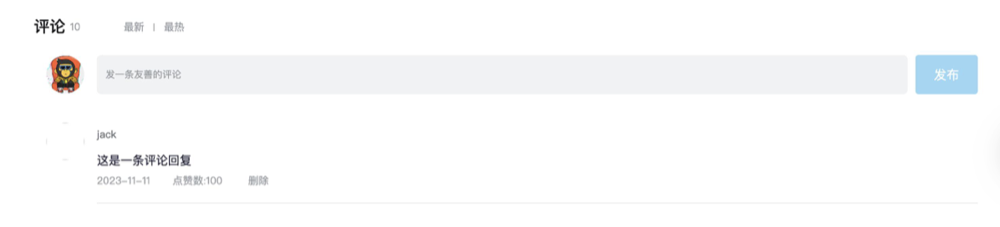

1. 渲染評論列表

   * 使用useState來渲染評論列表
   * 使用map方法對列表資料進行遍歷渲染（別忘了加key）

   ```jsx
   const [commentList, setCommentList] = useState(defaultList)
   
   {/* 評論列表 */}
   <div className="reply-list">
     {/* 評論項 */}
     {commentList.map(item => (
       <div key={item.rpid} className="reply-item">
         {/* 頭像 */}
         <div className="root-reply-avatar">
           <div className="bili-avatar">
             
           </div>
         </div>
   
         <div className="content-wrap">
           {/* 用戶名 */}
           <div className="user-info">
             <div className="user-name">{item.user.uname}</div>
           </div>
           {/* 評論內容 */}
           <div className="root-reply">
             <span className="reply-content">{item.content}</span>
             <div className="reply-info">
               {/* 評論時間 */}
               <span className="reply-time">{item.ctime}</span>
               {/* 評論數量 */}
               <span className="reply-time">點讚數:{item.like}</span>
               <span className="delete-btn">
               刪除
             </span>
   
             </div>
           </div>
         </div>
       </div>
     ))}
   </div>
   ```

2. 刪除評論實現

   * 只有自己的評論才顯示刪除按鈕(條件過濾)

     ```jsx
     {/* 評論數量 */}
     <span className="reply-time">點讚數:{item.like}</span>
     {user.uid === item.user.uid &&
       <span className="delete-btn" onClick={() => handleDel(item.rpid)}>
         刪除
       </span>
     }
     ```

   * 點選刪除按鈕，刪除當前評論，列表中不再顯示

     ```jsx
     const handleDel = (rid) => {
       console.log(rid)
       setCommentList(commentList.filter((item) => item.rpid !== rid))
     }
     ```

3. 渲染導航Tab和高亮實現

   點誰就把誰的type（獨一無二的標識）記錄下來，然後和遍歷時的每一項的type做匹配，誰匹配到就設定負責高亮的類名

   ```jsx
   <li className="nav-sort">
     {/* 高亮類名： active */}
     {tabs.map(item => (
       <span key={item.type} className={`nav-item ${type === item.type && 'active'}`} onClick={() => handleTabChange(item.type)}>{item.text}</span>
     ))}
   </li>
   ```

   ```jsx
   const [type, setType] = useState("hot")
   
   const handleTabChange = (type) => {
     console.log(type)
     setType(type)
   }
   ```

   > [!note]
   >
   > className={nav-item ${type === item.type && 'active'}} 這樣的寫法不夠整潔，不好讀，可以用第三方套件**通過條件動態控制class類名的顯示**
   >
   > 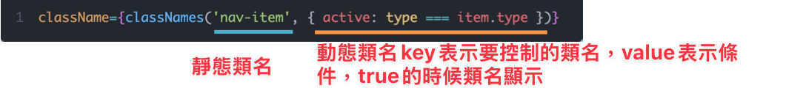
   >
   > ```bash
   > npm install classnames
   > ```
   >
   > ```jsx
   > <li className="nav-sort">
   >   {/* 高亮類名： active */}
   >   {tabs.map(item => (
   >     <span key={item.type} className={classNames("nav-item", {"active": type===item.type})} onClick={() => handleTabChange(item.type)}>{item.text}</span>
   >   ))}
   > </li>
   > ```
   >
   > 

4. 評論列表排序功能實現

   導入lodash第三方套件，完成排序功能(需要先 `npm install lodash`)

   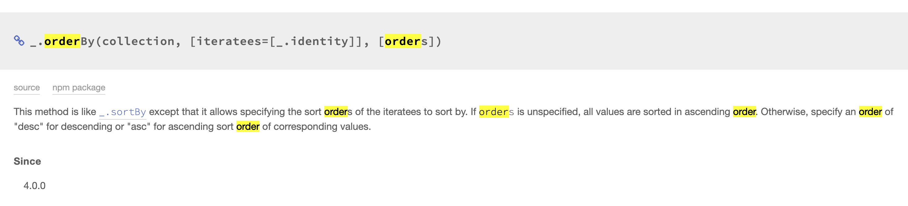

   ```jsx
   import _ from 'lodash'
   ```

   ```jsx
   const [type, setType] = useState("hot")
   const handleTabChange = (type) => {
     console.log(type)
     setType(type)
     if (type === "hot") {
       // 根據點讚數量排序
       setCommentList(_.orderBy(commentList, 'like', 'desc'))
     } else {
       // 根據發布時間排序
       setCommentList(_.orderBy(commentList, 'ctime', 'desc'))
     }
   }
   ```

## bilibili發表評論

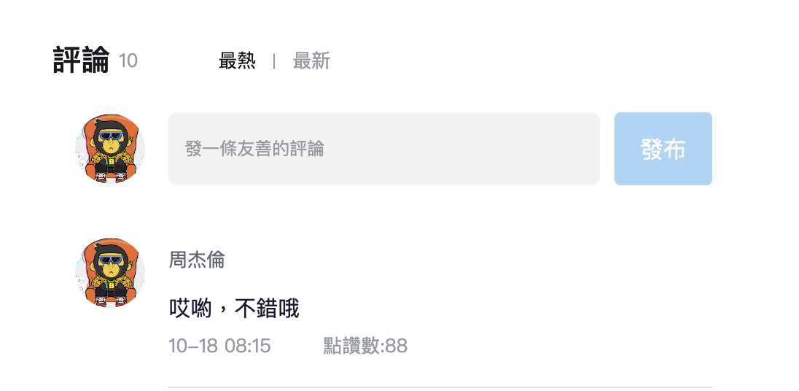

1. 獲取表單中的評論文字

   ```jsx
   const [content, setContent] = useState('')
   
   {/* 評論框 */}
   <textarea
     className="reply-box-textarea"
     placeholder="發一條友善的評論"
     value={content}
     onChange={(e)=> setContent(e.target.value)}
   />
   ```

2. 點擊發布按鈕發布評論

   ```jsx
   const handlePublish = () => {
     setCommentList([
       ...commentList,
       {
         rpid: 231,
         user: {
           uid: '36080105',
           avatar,
           uname: '許嵩',
         },
         content: content,
         ctime: '11-13 11:29',
         like: 88,
       }
     ])
   }
   
   {/* 發布按鈕 */}
   <div className="reply-box-send">
     <div className="send-text" onClick={handlePublish}>發布</div>
   </div>
   ```

3. id處理和時間處理

   ```bash
   # 處理唯一的隨機數id
   # https://www.npmjs.com/package/uuid
   npm install uuid
   
   # 處理時間 生成固定格式
   # https://www.npmjs.com/package/dayjs
   npm install dayjs
   ```

   ```jsx
   import { v4 as uuidV4 } from 'uuid';
   import dayjs from 'dayjs';
   
   const handlePublish = () => {
     setCommentList([
       ...commentList,
       {
         rpid: uuidV4(),
         user: {
           uid: '36080105',
           avatar,
           uname: '許嵩',
         },
         content: content,
         ctime: dayjs(new Date()).format('MM-DD hh:mm'),
         like: 88,
       }
     ])
   }
   ```

4. 清空內容並重新聚焦

   ```jsx
   const [content, setContent] = useState('')
   const inputRef = useRef(null)
   
   const handlePublish = () => {
     setCommentList([
       ...commentList,
       {
         rpid: uuidV4(),
         user: {
           uid: '36080105',
           avatar,
           uname: '許嵩',
         },
         content: content,
         ctime: dayjs(new Date()).format('MM-DD hh:mm'),
         like: 88,
       }
     ])
     // 清空輸入內容
     setContent("")
   
     // 使用useRef重新聚焦
     inputRef.current.focus()
   }
   
   <textarea
     className="reply-box-textarea"
     placeholder="發一條友善的評論"
     value={content}
     ref={inputRef}
     onChange={(e)=> setContent(e.target.value)}
   />
   ```

   


# The End<br>*Written by JamesZhan*<br><sub>若是內容有錯誤歡迎糾正 *[<kbd> Email</kbd>](mailto:henry16801@gmail.com?subject="內容錯誤糾正(非錯誤糾正可自行更改標題)")*</sub>
