---
title:前端開發學習筆記-React
vlook-doc-lib:
- [筆記網站跳轉](index.html?target=_self "快速挑轉到想要的網頁")
- [前端開發學習筆記★HTML](web_HTML.html?target=_self "網頁開發學習筆記★HTML")
- [前端開發學習筆記★CSS](web_CSS.html?target=_self "網頁開發學習筆記★CSS")
- [前端開發學習筆記★JS](web_JS.html?target=_self "網頁開發學習筆記★JS")
- [前端開發學習筆記★WebAPI](web_WebAPI.html?target=_self "網頁開發學習筆記★JS")
- [前端開發學習筆記★AJAX](web_AJAX.html?target=_self "網頁開發學習筆記★JS")
- [前端開發學習筆記★React](web_React.html?target=_self "網頁開發學習筆記★React")
- [前端開發學習筆記★TypeScript](web_TypeScript.html?target=_self "網頁開發學習筆記★TypeScript")
---

######  ~VLOOK™~ *[<kbd> VLOOK </kbd>](https://github.com/MadMaxChow/VLOOK)*<br>前端開發學習筆記-React──<br><u>簡介</u><br>*本篇筆記是使用[<kbd> Typora</kbd>](https://typora.io/)及[<kbd> Markdown</kbd>](https://markdown.tw/)<br>結合GitHub開源模版撰寫而成並導出成HTML*<br>**JamesZhan**<br>*不允許複製下載`僅供閱覽`* *版本日期`2025年6月1日`*

[TOC]

# 什麼是React(React 18 19)

React 是一個由 **Facebook (現在的 Meta)** 開發的 **JavaScript 框架**，專門用來建構使用者介面 (UI)

*[<kbd> React  </kbd>](https://zh-hans.react.dev/)*

**傳統網頁開發的痛點**

- **DOM 操作複雜** - 手動管理網頁元素變化很繁瑣
- **狀態管理混亂** - 資料變化時，很難追蹤哪些地方需要更新
- **程式碼重複** - 相似的功能需要重複寫很多次
- **維護困難** - 專案變大後，程式碼變得難以理解和修改

**React 的解決方案**

React 引入了「**元件化**」的開發方式，把複雜的介面拆解成一個個獨立的「元件」，還有**豐富的第三方套件** - 幾乎任何功能都有現成的解決方案，以及使用**虛擬DOM和優秀的Diffing演算法**來達到減少與真實DOM交互

> [!note]
>
> **元件化開發**
>
> - 每個元件負責自己的功能，可以重複使用
> - 容易測試和維護
>
> **虛擬DOM**
>
> 它只是一個存在於記憶體中的 JavaScript 資料物件，非常輕量。當操作虛擬 DOM 時，程式會先在虛擬 DOM 這張「藍圖」上做好所有修改，算出新舊藍圖之間的差異，最後再一次性地只更新需要變動的部分
>
> 

## 基本結構

1. 導入react核⼼包
2. 提供一個掛載點 通過js 將react組件渲染到這個掛載點
3. 渲染組件

```html
<!DOCTYPE html>
<html lang="en">

<head>
  <meta charset="UTF-8">
  <meta name="viewport" content="width=device-width, initial-scale=1.0">
  <title>Document</title>
  <!--react核⼼包-->
  <script src="https://unpkg.com/react@18/umd/react.development.js"></script>
  <!--react dom相關的包-->
  <script src="https://unpkg.com/react-dom@18/umd/react-dom.development.js"></script>
  <!-- 提供es6和jsx的⽀持-->
  <script src="https://unpkg.com/@babel/standalone/babel.min.js"></script>
</head>

<body>
  <!-- 提供一個掛載點 通過js 將react組件渲染到這個掛載點 -->
  <div id="root"></div>

  <script type="text/babel">
    // 1.找到掛載點
    const root = document.querySelector('#root');
    // 2.創建react root
    const reactRoot = ReactDOM.createRoot(root);
    // 3.渲染組件
    reactRoot.render(<h1>hello world</h1>)
  </script>
</body>

</html>
```

> [!caution]
>
> * 導入JS套件的時候順序不能替換
> * 如果在標準的 `<script>` 標籤（預設為 `text/javascript`）裡面直接寫 `<h1>hello world</h1>` 這種像 HTML 的語法，瀏覽器會直接拋出 `SyntaxError`，因為這不符合 JavaScript 的語法規則。這段程式碼之所以能運作，完全依賴那個特殊的屬性 `type="text/babel"` 以及背後引入的 Babel 轉換器


## JSX概念

==**JSX = JavaScript + XML**==

JavaScript 中寫 HTML，他是React中編寫UI模版的方式，JSX並不是標準的JS語法，它是**JS的語法擴展**，瀏覽器本身不能識別，需要通過**解析工具做解析**之後才能在瀏覽器中運行

```javascript
//JSX 和 HTML 很相似，實際上它會被編譯成 JavaScript 對象和函數調⽤
const element = <h1>Hello, world!</h1>;

//這段 JSX 會被編譯成下⾯的 JavaScript：
const element = React.createElement('h1', null, 'Hello, world!');
```

JSX優勢：

- 看起來像 HTML
- 可以嵌入 JavaScript
- 讓程式碼更易讀
- 支援所有 HTML 標籤

*[<kbd> Babel解析工具  </kbd>](https://babeljs.io/repl)*

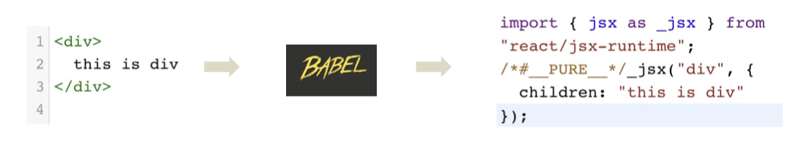

---

> **傳統寫法**
>
> ```javascript
> // 用 JavaScript 建立 HTML 元素
> const element = document.createElement('div');
> element.className = 'container';
> element.innerHTML = '<h1>Hello World</h1>';
> document.body.appendChild(element);
> ```

>**JSX方式**
>
>```jsx
>// 直接寫 HTML！
>const element = <div className="container"><h1>Hello World</h1></div>;
>```

> [!caution]
>
> * { }相當於提供了js的執⾏環境
> * ⼤括號⾥可以任意的js表達式（由運算子連接的），不能寫語句（聲明語句，if 、for)
> * 樣式中是數字的，單位可以省略
> * jsx中陣列會自動展開
>
> > ###### 1.最外層只能有⼀個根元素
> >
> > ```jsx
> > let ele=<div>
> > 					<p class="box">aaaa</p> <h1>你好</h1>
> > 				</div>
> > ```
>
> > ###### 2.jsx中，class要改為className
> >
> > ```jsx
> > let ele=<div className="box"> 
> >   				<p>123</p> 
> > 					<p>456</p> 
> > 				</div>
> > ```
>
> > ###### 3.jsx中style必須寫成對象的形式
> >
> > ```jsx
> > let txt="react" let a="title"
> > let ele=<div className={a} style={{color:"red"}}> 
> >   				<h1>{txt}</h1>
> > 				</div>
> > ```
> >
> > ```jsx
> > let cssStyle={ 
> >   		width:"50px", 
> >   		height:"50px", 
> >   		color:"yellow"
> > }
> > let ele=<div className={a} style={cssStyle}> 
> >   				<h1>{txt}</h1>
> > 				</div>
> > ```
>
> > ###### 4.樣式中有多個單詞組成的樣式不能⽤橫線連接，改為駝峰式
> >
> > ```jsx
> > let ele=<div className={a} style={{color:color,width:"200px",marginLeft:"50px"}}> 
> >       		<h1>{txt}</h1>
> > 					<a href={url}></a>
> > 				</div>
> > ```
> >
> > 

## 快速搭建開發環境

*^tab^*

> **Node.js安裝**
>
> *[<kbd> Node.js  </kbd>](https://nodejs.org/zh-tw/download)*
>
> **Windows：**
>
> 1. 按 `Win + R`
> 2. 輸入 `cmd`，按 Enter
> 3. 在黑色視窗中輸入：`node --version`
> 4. 應該會顯示版本號（例如：v18.17.0）
>
> **Mac：**
>
> 1. 按 `Cmd + 空白鍵`
> 2. 輸入 `terminal`，按 Enter
> 3. 輸入：`node --version`
> 4. 應該會顯示版本號
>
> 能顯示版本號，代表Node.js已經安裝成功

> **建立React專案**
>
> 1. 選擇專案位置
>
>    建議在桌面或是資料夾建立一個叫 `my-react-projects` 的專案
>
> 2. 開啟終端機
>
>    cd 進入`my-react-projects` 專案資料夾
>
> 3. 建立React專案
>
>    ```bash
>    npx create-react-app my-first-app
>    ```
>
>    > [!note]
>    >
>    > * **npx**：Node.js工具命令，尋找並執行後續的包命令
>    > * **create-react-app**：核心包（固定寫法），用於建立React項目
>    > * **my-first-app**：React項目的名稱（可以自訂）
>
>    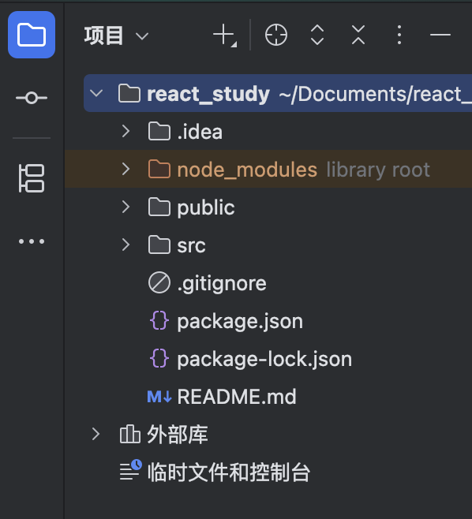
>
> 4. 啟動專案
>    ```bash
>    npm start
>    ```

> **調整專案檔案結構**
>
> 因為目前學習可以先把不需要的檔案暫時移除，src資料夾中只保留
>
> * App.js
>
>   ```jsx
>   function App() {
>     return (
>       <div className="App">
>         this is app
>       </div>
>     );
>   }
>   
>   export default App;
>   ```
>
> * index.js
>
>   ```jsx
>   import React from 'react';
>   import ReactDOM from 'react-dom/client';
>   import App from './App';
>                                       
>   const root = ReactDOM.createRoot(document.getElementById('root'));
>   root.render(<App />);
>   ```

## index.js程式的入口

告訴瀏覽器「React 要在哪裡顯示」

* 引入 React核心套件

  ```jsx
  import React from 'react';
  import ReactDOM from 'react-dom/client';
  ```

  - 就像「引入工具箱」

  - 讓你可以使用 React 的功能

* 引入專案根套件

  ```jsx
  import App from './App';
  ```

  - 引入 App.js 這個檔案

  - App 就是你的主要元件

* 選染網頁

  ```jsx
  const root = ReactDOM.createRoot(document.getElementById('root'));
  root.render(<App />);
  ```

  - `document.getElementById('root')` = 找到 public/index.html 中 id 為 'root' 的元素
  - `render(<App />)` = 把 App 元件顯示在那個位置

## App.js專案的根套件

定義你的網頁長什麼樣子

* 被引入到index.js中，選染到public/index.html(root)中

  ```jsx
  function App() {
    return (
      <div className="App">
        this is app
      </div>
    );
  }
  
  export default App;
  ```

# 組件

==React 組件（Component）就是自己創造的**「自訂 HTML 標籤」**==

如果要蓋一座城堡（整個網頁），不會用泥土從零開始捏，而是會把很多已經做好的小積木（組件）組裝起來。這些積木可能是「按鈕」、「導覽列」、「卡片」或是「表單」

react中的組件分為兩⼤類：

* **函數式組件（推薦）**
* 類組件（過時）

## 類組件(過時)

**類組件 (Class Component)** 是 React 中定義組件的另一種方式，也是在 React 16.8 (Hooks 推出) 之前，唯一能讓組件擁有「狀態 (State)」和「生命週期」的方法

```jsx
<!DOCTYPE html>
<html lang="en">

<head>
  <meta charset="UTF-8">
  <meta name="viewport" content="width=device-width, initial-scale=1.0">
  <title>Document</title>
  <script src="https://unpkg.com/react@18/umd/react.development.js"></script>
  <script src="https://unpkg.com/react-dom@18/umd/react-dom.development.js"></script>
  <script src="https://unpkg.com/@babel/standalone/babel.min.js"></script>
</head>

<body>
  <div id="root"></div>
  <script type="text/babel">
    // 1.找到掛載點
    const root = document.querySelector('#root');
    // 2.創建react root
    const reactRoot = ReactDOM.createRoot(root);
    // 3.創建類組件(必須繼承React.Component)
    class Welcome extends React.Component {
      render() {
        return <h1>我是Welcome類組件</h1>
      }
    }
    // 4.渲染組件
    reactRoot.render(<Welcome />)
  </script>
</body>

</html>
```

> [!caution]
>
> * 類組件(必須繼承React.Component)，類名首字母必須大寫
>
> * 如果組件要一開始要換行寫，必須加入括號
>
>   ```jsx
>   return <h1>我是⼀个类组件</h1>//正確
>     
>   return
>   <h1>我是⼀個類元件</h1> //錯誤寫法，此時必須加括號
>     
>   return (
>   <h1>我是⼀個類元件</h1>
>   ) //正確
>   ```


## Fragment標籤

`Fragment`（通常我們叫它「幽靈標籤」或「隱形容器」）是用來解決 React 一個非常經典的限制，同時讓你的 HTML 結構保持乾淨

> **為什麼需要它？**
>
> React 有一個硬性規定：**一個組件的 `return` 只能回傳「一個」根節點**
>
> ```jsx
> // 這樣寫會報錯！
> return (
>   <h1>文章標題</h1>
>   <p>這是內文...</p>
> );
> 
> // 雖然不會報錯，但有缺點，多出一堆無意義的 div
> return (
>   <div>
>     <h1>文章標題</h1>
>     <p>這是內文...</p>
>   </div>
> );
> ```

寫法有兩種：

* 縮寫語法（最常用）

  ```jsx
  return (
    <>
      <h1>文章標題</h1>
      <p>這是內文...</p>
    </>
  );
  ```

* 完整語法

  ```jsx
  import React from 'react';
  
  return (
    <React.Fragment>
      <h1>文章標題</h1>
      <p>這是內文...</p>
    </React.Fragment>
  );
  ```

## props傳參

==Props 就是父組件傳遞給子組件的「資料」或「設定檔」==

想像你是一個老闆（父組件），你有兩個員工（子組件）。你需要叫這兩個員工去做事，但你給他們的指令不同：

- 你跟 A 員工說：「你的名字叫小明，你去掃地」
- 你跟 B 員工說：「你的名字叫小美，你去倒茶」

在這個情境中，「名字」和「工作內容」就是透過 **Props** 傳遞給員工的。員工自己不能決定名字，是老闆給他們的。

> [!note]
>
> * **props是類組件⾃帶的屬性**，代表所有屬性的集合
> * **屬性不能更改**，因為屬性是從外部傳⼊的並不是元件⾃⼰的資料，所有沒權利更改。如果想更改只能去修改資料來源，讓他重新傳⼀個新屬性

```jsx
<!DOCTYPE html>
<html lang="en">

<head>
  <meta charset="UTF-8">
  <meta name="viewport" content="width=device-width, initial-scale=1.0">
  <title>Document</title>
  <script src="https://unpkg.com/react@18/umd/react.development.js"></script>
  <script src="https://unpkg.com/react-dom@18/umd/react-dom.development.js"></script>
  <script src="https://unpkg.com/@babel/standalone/babel.min.js"></script>
</head>

<body>
  <div id="root"></div>
  <script type="text/babel">
    const root = document.querySelector('#root');
    const reactRoot = ReactDOM.createRoot(root);

    class Welcome extends React.Component {
      render() {
        // console.log(this.props);
        // const { name } = this.props; // ES6語法
        return <h1>Welcome, {this.props.name}</h1>
      }
    }

    reactRoot.render(
      <>
        <Welcome name="james" />
        <Welcome name="lucy" />
        <Welcome name="lily" />
      </>
    )
  </script>
</body>

</html>
```

> ###### 練習：導航條高亮案例
>
> ```jsx
> <!DOCTYPE html>
> <html lang="en">
> 
> <head>
>   <meta charset="UTF-8">
>   <meta name="viewport" content="width=device-width, initial-scale=1.0">
>   <title>Document</title>
>   <script src="https://unpkg.com/react@18/umd/react.development.js"></script>
>   <script src="https://unpkg.com/react-dom@18/umd/react-dom.development.js"></script>
>   <script src="https://unpkg.com/@babel/standalone/babel.min.js"></script>
> </head>
> 
> <body>
>   <div id="root"></div>
>   <script type="text/babel">
>     const root = document.querySelector('#root');
>     const reactRoot = ReactDOM.createRoot(root);
> 
>     class Navi extends React.Component {
>       render() {
>         const { number } = this.props;
>         return (
>           <ul>
>             <li style={{ backgroundColor: this.props.number == 1 ? 'red' : '' }}>Home</li>
>             <li style={{ backgroundColor: number == 2 ? 'red' : '' }}>Product</li>
>             <li style={{ backgroundColor: number == 3 ? 'red' : '' }}>Company</li>
>             <li style={{ backgroundColor: number == 4 ? 'red' : '' }}>Contact</li>
>           </ul>
>         )
>       }
>     }
> 
>     reactRoot.render(
>       <>
>         <Navi number={1} />
>         <Navi number={2} />
>         <Navi number={3} />
>         <Navi number={4} />
>       </>
>     )
>   </script>
> </body>
> 
> </html>
> ```
>
> 

**props.children**

如果在組件標籤內寫內容，需要通過 `props.children` 才能讀取html標籤

* 如果傳⼊單個內容，返回的就是⼀個對象
* 如果傳⼊多個內容的話，返回的就是陣列 **(jsx中會自動展開)**

```jsx
<!DOCTYPE html>
<html lang="en">

<head>
  <meta charset="UTF-8">
  <meta name="viewport" content="width=device-width, initial-scale=1.0">
  <title>Document</title>
  <script src="https://unpkg.com/react@18/umd/react.development.js"></script>
  <script src="https://unpkg.com/react-dom@18/umd/react-dom.development.js"></script>
  <script src="https://unpkg.com/@babel/standalone/babel.min.js"></script>
</head>

<body>
  <div id="root"></div>

  <script type="text/babel">
    const root = document.querySelector('#root');
    const reactRoot = ReactDOM.createRoot(root);
    class Welcome extends React.Component {
      render() {
        // console.log(this.props)
        return (
          <>
            <h1>hello world</h1>
            {this.props.children}
          </>
        )
      }
    }
    reactRoot.render(
      <>
        <Welcome>
          <h1>這是welcome的子組件</h1>
          <h2>這是welcome的子組件</h2>
          <div>
            <div>這是div的子組件</div>
          </div>
        </Welcome>
      </>
    )
  </script>
</body>

</html>
```

> [!note]
>
> 可以透過陣列index渲染到不同位置上
>
> ```jsx
> <!DOCTYPE html>
> <html lang="en">
> 
> <head>
>   <meta charset="UTF-8">
>   <meta name="viewport" content="width=device-width, initial-scale=1.0">
>   <title>Document</title>
>   <script src="https://unpkg.com/react@18/umd/react.development.js"></script>
>   <script src="https://unpkg.com/react-dom@18/umd/react-dom.development.js"></script>
>   <script src="https://unpkg.com/@babel/standalone/babel.min.js"></script>
> </head>
> 
> <body>
>   <div id="root"></div>
> 
>   <script type="text/babel">
>     const root = document.querySelector('#root');
>     const reactRoot = ReactDOM.createRoot(root);
>     class Welcome extends React.Component {
>       render() {
>         console.log(this.props);
>         return (
>           <div>
>             {this.props.children[0]}
>             <p>123</p>
>             {this.props.children[1]}
>             <h1>456</h1>
>             {this.props.children[2]}
>           </div>
>         )
>       }
>     }
>     reactRoot.render(
>       <>
>         <Welcome >
>           <h1>我是在元件標籤內加的內容</h1>
>           <p>額外新增的</p>
>           <a>google</a>
>         </Welcome>
>       </>
>     );
>   </script>
> </body>
> 
> </html>
> ```

## state狀態

==是組件用來「記憶」資料的地方==

**Props** 是由父組件傳進來的「外部指令」，那麼 **State** 就是組件自己擁有的「內部記憶」。它是 React 能夠實現**互動性**的關鍵：當 State 改變時，React 會自動重新渲染（Re-render）畫面，讓使用者看到最新的資料

使⽤state必須先定義初始值：

* 在建構子裡面定義

  ```jsx
  constructor() {
    super()
    this.state = {
      msg: '我是一個state'
    }
  }
  ```

  > [!caution]
  >
  > 必須先呼叫 `super()`，拿到父類別的**構造函數**，以及使用 `this`

* 在class中直接定義

  ```jsx
  state = {
    msg: '我是一個state'
  }
  ```

```jsx
<!DOCTYPE html>
<html lang="en">

<head>
  <meta charset="UTF-8">
  <meta name="viewport" content="width=device-width, initial-scale=1.0">
  <title>Document</title>
  <script src="https://unpkg.com/react@18/umd/react.development.js"></script>
  <script src="https://unpkg.com/react-dom@18/umd/react-dom.development.js"></script>
  <script src="https://unpkg.com/@babel/standalone/babel.min.js"></script>
</head>

<body>
  <div id="root"></div>
  <script type="text/babel">
    const root = document.querySelector('#root');
    const reactRoot = ReactDOM.createRoot(root);
    class Welcome extends React.Component {
      // constructor() {
      //   super()
      //   this.state = {
      //     msg: '我是一個state'
      //   }
      // }

      // 省略寫法
      state = {
        msg: '我是一個state'
      }

      render() {
        return <div>
          <h1>456, {this.state.msg}</h1>
        </div>
      }
    }
    reactRoot.render(
      <>
        <Welcome />
      </>
    );
  </script>
</body>

</html>
```

**修改state狀態**

在類組件裡，你必須使用 `this.setState()`。這個方法會把你傳進去的新物件與舊的 State 進行「合併」

> [!caution]
>
> 不能直接修改state，必須採取setState⽅法去更改，不然不會重新觸發 `render()`

```jsx
const root = document.querySelector('#root');
const reactRoot = ReactDOM.createRoot(root);
class welcome extends React.Component {
  state = {
    count: 0
  }
  count = () => {
    this.setState({
      count: this.state.count + 1
    })
  }
  render() {
    return (
      <>
        <h1>{this.state.count}</h1>
        <button onClick={this.count}>按鈕</button>
      </>
    )
  }
}
reactRoot.render(
  <welcome />
)
```

>###### 陣列和對象的更改
>
>對於陣列和對象，必須整體替換
>
>```jsx
>const root = document.querySelector('#root');
>const reactRoot = ReactDOM.createRoot(root);
>class welcome extends React.Component {
>    state = {
>        num: 1,
>        count: [0, 1, 2, 3, 4, 5],
>        people: {
>           name: "james"
>        }
>    }
>    count = () => {
>        this.setState({
>           count: [...this.state.count, this.state.num],
>           people: {
>             ...this.state.people,
>             age: 30
>           }
>        })
>    }
>    render() {
>        const { num, count, people } = this.state;
>        return (
>           <>
>             <h1>{num}</h1>
>             <h1>{count}</h1>
>             <h1>{JSON.stringify(people)}</h1>
>             <button onClick={this.count}>按鈕</button>
>           </>
>        )
>    }
>}
>reactRoot.render(
>    <welcome />
>)
>```
>

**state更新可能是異步執行的(出於性能考慮)**

```jsx
const root = document.querySelector('#root');
const reactRoot = ReactDOM.createRoot(root);

class welcome extends React.Component{
  state = {
    number: 1
  }

  add = () => {
    this.setState({
      number: this.state.number + 1
    })
    console.log(this.state.number); // setState是非同步的，number還沒有更新，所以輸出1
  }

  render(){
    return (
      <>
        <h1>{this.state.number}</h1>
        <button onClick={this.add}>add</button>
      </>
    )
  }
}

reactRoot.render(
  <welcome />
)
```

> [!tip]
>
> 如果想同步獲得數據，可以在 `setState` 第二個參數中放入回調函數
>
> ```jsx
> add = () => {
>   this.setState({
>     number: this.state.number + 1
>   },() => {
>     console.log(this.state.number); // setState的第二個參數是回調函數，當state更新完成後會執行，所以輸出2
>   })
> }
> ```
>
> 

**state的更新可能會合併執行(連續多次修改state，只會執行最後一次)**

```jsx
const root = document.querySelector('#root');
const reactRoot = ReactDOM.createRoot(root);

class welcome extends React.Component{
  state = {
    number: 1
  }

  addmore = () => {
    for(let i = 0; i < 5; i++){
      this.setState({
        number: this.state.number + 1
      })
      console.log(this.state.number); // setState會合併多次更新，所以number只會增加1，輸出2
    }
  }

  render(){
    return (
      <>
        <h1>{this.state.number}</h1>
        <button onClick={this.addmore}>add</button>
      </>
    )
  }
}

reactRoot.render(
  <welcome />
)
```

> [!tip]
>
> 如果不想合併多次更改state的操作，可以通過給 `setState` 傳入函數的形式，返回新的狀態
> ```jsx
> addmore = () => {
>   for(let i = 0; i < 5; i++){
>     this.setState((prev) => { // 代表上一次的state
>       console.log(prev.number); // 這裡輸出1，因為setState是異步的，所以state還沒有更新
>       return {
>         number: prev.number + 1
>       }
>     })
>   }
> }
> ```

*[<kbd> state練習  </kbd>](#類組件 state小案例)*

## 函數組件

一個組件就是使用者介面的一部分，它可以有自己的邏輯和外觀，組件之間可以互相嵌套，也可以重複使用多次，**是一個純函數**

在React中，一個組件就是**首字母大寫的函數且必須返回jsx**，渲染組件只需要把組件**當成標籤書寫**即可

> [!tip]
>
> 函式組件（早期）— 沒有 state，只能接收 props 然後顯示
>
> ```jsx
> function Navi(props) {
>   // ❌ 不能用 state
>   // ❌ 不能寫 setState
>   // 只能接收 props，回傳 JSX
>   return <div>{props.defaultAct}</div>
> }
> ```
>
> 這種元件只負責「顯示」，不能管理資料，所以也叫**無狀態元件（Stateless Component）**。React 16.8 之後有了 Hooks
>
> 現在函式元件可以用 `useState` 來擁有 state 
>
> 

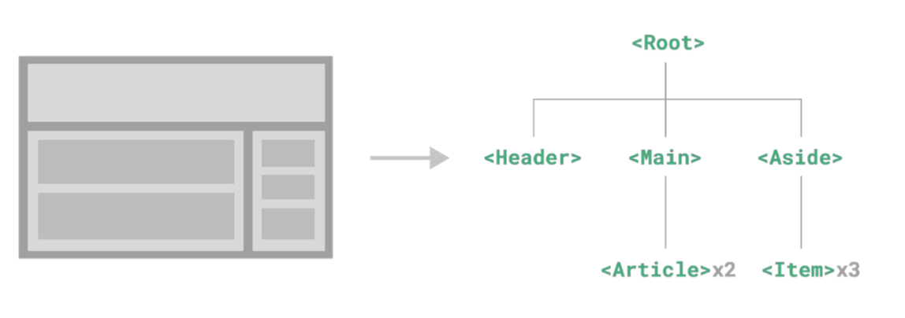

1. 定義組件

   ```jsx
   function Welcome(props) {
     return <h1>Hello, {props.name}</h1>;
   }    
   
   // 箭頭函數
   // const Button = () => {
   //   return (
   //     <button>Click me</button>
   //   );
   // }
   ```

2. 使用組件

   ```jsx
   const root = document.querySelector('#root');
   const reactRoot = ReactDOM.createRoot(root);
   
   function Welcome(props) {
     return <h1>Hello, {props.name}</h1>;
   }    
   
   reactRoot.render(
     <Welcome name="James" />
   );
   ```

### 什麼是純函數

純函數（Pure Function）就是：**相同的輸入，永遠得到相同的輸出，而且不會被外部的任何東西影響。 沒有副作用**（不修改外部變數、不發 API、不操作 DOM）

---

- 純函數

  ```jsx
  function Welcome(props) {
    return <h1>Hello, {props.name}</h1>;
  }
  ```

  - 傳入 `name="James"` → 永遠回傳 `<h1>Hello, James</h1>`
  - 不會修改 props
  - 不會改變外部變數

- 不純的函數

  ```jsx
  let count = 0;
  
  function Welcome(props) {
    count++;  // ❌ 改了外部變數
    return <h1>Hello, {props.name} ({count})</h1>;
  }
  ```

  每次呼叫結果都不同，因為外部 `count` 一直在變。

## 組間之間資料傳遞

組件需要互相溝通才能協作。以下是主要的傳遞方式：

* A-B 父子資料傳遞
* B-C 兄弟資料傳遞
* A-E 跨層資料傳遞

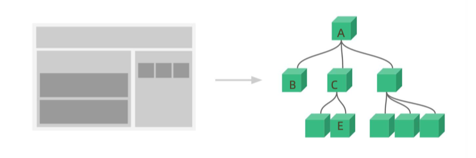

*^tab^*

> **父傳子**
>
> 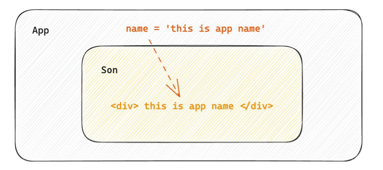
>
> 實現方法：
>
> 1. 父組件傳遞資料 - 在子組件標籤上**綁定屬性**
>
>    ```jsx
>    function App() {
>      const name= 'this is app name'
>    
>      return (
>        <div className="App">
>          <Son name={name}></Son>
>        </div>
>      );
>    }
>    ```
>
> 2. 子組件接收資料 - 子組件**通過props參數**接收資料
>
>    ```jsx
>    function Son(props){
>      return <div>this is son, {props.name}</div>;
>    }
>    ```
>
>    > [!note] 
>    >
>    > props包含了父組件傳遞過來的所有資料(可傳遞任意的資料)，子元件**只能讀取props中的資料**，**不能直接進行修改**
>    >
>    > **父元件的資料只能由父元件修改**
>
> > [!TIP] 
> >
> > **特殊的prop children** (需要成對標籤)
> >
> > 當我們把內容嵌套在子組件標籤中時，父組件會自動在名為children的prop屬性中接收該內容
> >
> > 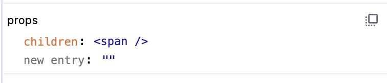
> >
> > ```jsx
> > function Son(props){
> > console.log(props);
> > return <div>this is son, {props.children}</div>;
> > }
> > 
> > function App() {
> > 
> > return (
> >  <div className="App">
> >    <Son>
> >      <span>this is span</span>
> >    </Son>
> >  </div>
> > );
> > }
> > 
> > export default App;
> > ```
> >
> > 

> **子傳父**
>
> 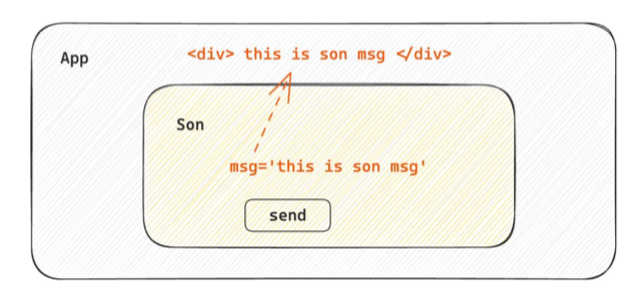
>
> 在子元件中呼叫父元件中的函數並傳遞參數
>
> ```jsx
> import {useState} from "react";
> 
> function Son({onGetSonMsg}) {
>  // Son組件資料
>  const sonMsg = "this is son msg"
>  return (
>    <div>
>      this is son
>      {/*2.子組件調用父組件的函數*/}
>      <button onClick={() => onGetSonMsg(sonMsg)}>Get Son</button>
>    </div>
>  )
> }
> 
> function App() {
>  const [msg, setMsg] = useState("");
>  const getMsg = (msg) => {
>    console.log(msg)
>    setMsg(msg)
>  }
>  return (
>    <div className="App">
>      this is app, {msg}
>      {/*1.建立回調傳入參數給子組件*/}
>      <Son onGetSonMsg={getMsg}></Son>
>    </div>
>  );
> }
> 
> export default App;
> ```

> **兄弟互傳**
>
> 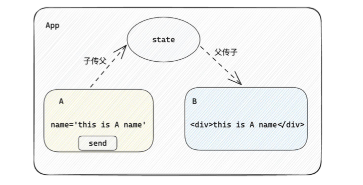
>
> 通過父組件進行兄弟組件之間的資料傳遞
>
> 1. A組件先通過子傳父的方式把資料傳給父組件App
> 2. App拿到資料後通過父傳子的方式再傳遞給B組件
>
> ```jsx
> import {useState} from "react";
> 
> function A ({onGetAMsg}) {
>   const msg = 'this is a message!'
> 
>   return (
>     <div>
>       this is a component
>       <button onClick={() => onGetAMsg(msg)}>send</button>
>     </div>
>   )
> }
> 
> function B ({msg}) {
>   return (
>     <div>
>       this is b component, {msg}
>     </div>
>   )
> }
> 
> function App() {
>   const [msg, setMsg] = useState('')
>   const getAMsg = (msg) => {
>     console.log(msg)
>     setMsg(msg)
>   }
> 
>   return (
>     <div className="App">
>       <A onGetAMsg={getAMsg}></A>
>       <B msg={msg}></B>
>     </div>
>   );
> }
> 
> export default App;
> ```

> **跨層傳遞**
>
> 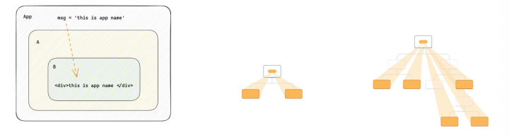
>
> > [!note] 
> >
> > 只要有頂層和底層的關係就可以直接使用這套機制
>
> 1. 使用createContext方法建立一個上下文物件Ctx
> 2. 在頂層組件（App）中通過 Ctx.Provider 組件提供資料
> 3. 在底層組件（B）中通過 useContext 鉤子函數獲取資料
>
> ```jsx
> // app -> A -> B
> 
> // 1. 使用createContext方法創建上下文物鍵
> import {createContext, useContext} from 'react';
> const MsgContext = createContext()
> 
> function A () {
>   return (
>     <div>
>       this is a component
>       <B/>
>     </div>
>   )
> }
> 
> function B () {
>   // 3. 通過 useContext 鉤子函數獲取消費資料
>   const msg = useContext(MsgContext)
>   return (
>     <div>
>       this is b component, {msg}
>     </div>
>   )
> }
> 
> function App() {
>  const msg = 'this is app msg'
>   return (
>     <div className="App">
>       {/*2. 通過 Ctx.Provider 組件提供資料*/}
>       <MsgContext.Provider value={msg}>
>         this is app
>         <A/>
>       </MsgContext.Provider>
>     </div>
>   );
> }
> 
> export default App;
> 
> ```


# JSX渲染

## 列表渲染

==在 JSX 中渲染列表，主要用 **`.map()`** 方法==

```jsx
const list = [
  { id: 1, name: "John" },
  { id: 2, name: "Jane" },
  { id: 3, name: "Doe" }
]

function App() {
  return (
    <div className="App">
      <ul>
        {/*兩種寫法都可以*/}
        {list.map(function(item) {
          return <li key={item.id}>{item.name}</li>;
        })}

        {list.map(item => <li key={item.id}>{item.name}</li>)}
      </ul>
    </div>
  );
}

export default App;
```

> [!note]
>
> **為什麼需要 key？**
>
> - React 需要知道哪個項目是哪個
> - 幫助 React 高效更新列表
> - 沒有 key 會有警告訊息，並且key需要**獨一無二**
>
> ```jsx
> // ✅ 正確：每個項目都有唯一的 key
> {items.map(item => <li key={item.id}>{item.name}</li>)}
> 
> // ❌ 錯誤：沒有 key
> {items.map(item => <li>{item.name}</li>)}
> 
> // ⚠️ 不推薦：用索引當 key（除非沒有其他選擇）
> {items.map((item, index) => <li key={index}>{item.name}</li>)}
> ```

> [!note]
>
> **箭頭函數的語法規則**
>
> 它是 JavaScript ES6 新增的**寫函數的簡短方式**
>
> ```javascript
> 函數名 = (參數) => { 函數內容 }
> 
> // 傳統寫法
> function sayHello(name) {
>   return "Hello, " + name;
> }
> 
> // 箭頭函數寫法
> const sayHello = name => "Hello, " + name;
> ```

## 條件渲染

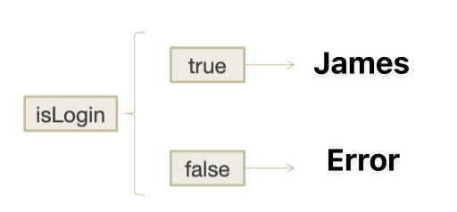

在React中，可以通過**邏輯與運算子&&**、**三元表示式（?:）**實現基礎的條件渲染

* **邏輯與運算子&&**

  ```jsx
  let login = true
  
  function App() {
    return (
      <div className="App">
        {login && <span>James</span>}
      </div>
    );
  }
  
  export default App;
  ```

  > [!note]
  >
  > 當login為true時才顯示James，如果為false

* **三元表示式（?:）**

  ```jsx
  let login = true
  
  function App() {
    return (
      <div className="App">
        {login ? <span>James</span> : <span>Error</span>}
      </div>
    );
  }
  
  export default App;
  ```
  

# React事件綁定

==讓你的網頁元素可以「回應」用戶的操作==

比如：

- 按鈕被點擊 → 執行某個動作
- 輸入框內容改變 → 更新資料
- 滑鼠移入 → 顯示提示

```jsx
<元素 on事件名={處理函數}>內容</元素>
```

>[!note]
>
>處理函數整體上遵循駝峰命名法，例如： clickHandler、moveHandler

進行事件綁定前，需要先建立一個事件函數，在綁定到事件上：

```jsx
function App() {
  const clickHandler = () => {
    console.log("按鍵被點擊");
  }

  return (
    <div className="App">
      <button onClick={clickHandler}>click me</button>
    </div>
  );
}

export default App;
```

> [!important]
>
> 這裡 `<button onClick={clickHandler}>click me</button>` 裡面的 `clickHandler` 他是一個**回調函數**等待被執行，並**不是函數執行完的結果**，當點擊事件觸發了才會執行回調函數

## this指向問題

react中的onClick是⼀個⾃定義的事件，中間經歷過⼀次賦值，並非原生事件，就是把等號後⾯的函數名賦給了前⾯的onClick，所以導致this丟失

簡單來說，在 JavaScript 中，`this` 指向誰，並不是看函式「定義在哪裡」，而是看函式最後是「**被誰呼叫的**」

```javascript
"use strict"
let obj={ 
  display:function(){ 
    console.log(this)
  }
}

// obj.display  // this指向obj

function fn(cb){ 
  cb()
} 

fn(obj.display)
```

1. **原本的樣子**：`obj.display()`。如果你直接這樣呼叫，`this` 會指向 `obj`，因為 `.` 前面就是呼叫者
2. **傳遞過程**：當你執行 `fn(obj.display)` 時，你並不是在呼叫函式，而是把 `display` 這個函式的「內容物」像傳球一樣傳給了 `fn`
3. **執行瞬間**：在 `fn` 內部，它用參數 `cb` 來接收這個函式，然後執行 `cb()`。注意看，這裡呼叫時，**`cb()` 前面沒有任何對象**
4. **結果**：因為是直接呼叫 `cb()`，函式失去了與 `obj` 的聯繫。在「嚴格模式 (`use strict`)」下，這種沒有對象的呼叫，`this` 會直接變成 `undefined`；在非嚴格模式下則會指向 `window` (全域物件)

**解決方案**

> ###### 1. 在建構子中綁定this
>
> ```jsx
> class welcome extends React.Component {
>   constructor() {
>     super()
>     this.fn = this.fn.bind(this) // 綁定
>   }
>   state = {
>     msg: "我是⼀個狀態"
>   }
>   fn() {
>     console.log(this)
>     console.log(this.state.msg)
>   }
>   render() {
>     return <button onClick={this.fn}>按鈕</button>
>   }
> }
> reactRoot.render(
>   <welcome />
> )
> ```

> ###### 2. 調用時綁定
>
> ```jsx
> return <button onClick={this.fn.bind(this)}>按鈕</button>
> ```

> ###### 3. 使⽤箭頭函數(最推薦)
>
> 1. **語法最簡潔，減少冗餘程式碼**：如果使用「在建構子（Constructor）中綁定」的方法，你每增加一個事件處理函式，就必須在 `constructor` 裡面多寫一行重複的代碼
> 2. **徹底解決 JavaScript 的 Scope 問題**：箭頭函數本身**沒有自己的 `this`**。它會捕獲其「定義時」所在內容的 `this` 值作為自己的 `this` 值
>
> ```jsx
> const root = document.querySelector('#root');
> const reactRoot = ReactDOM.createRoot(root);
> class welcome extends React.Component {
>   state = {
>     msg: "我是⼀個狀態"
>   }
>   fn = () => {
>     console.log(this)
>     console.log(this.state.msg)
>   }
>   render() {
>     return <button onClick={this.fn}>按鈕</button>
>   }
> }
> reactRoot.render(
>   <welcome />
> )
> ```


## 獲取事件對象參數


**事件參數 `e`**（通常叫做 `event`）是瀏覽器自動傳給事件處理函數的**事件對象**

它包含了關於這個事件的**所有資訊**

```jsx
function App() {
  const clickHandler = (e) =>{
    console.log("按鍵被點擊", e);
  }

  return (
    <div className="App">
      <button onClick={clickHandler}>click me</button>
    </div>
  );
}

export default App;
```

> [!note]
>
> 為什麼 `<button onClick={clickHandler}>click me</button>` 沒有傳入參數，卻可以獲得事件參數e？
>
> 因為當你寫 `onClick={handleClick}` 時，**React 會自動把事件對象當作第一個參數傳給你的函數**！
>
> ```jsx
> // React 內部大概是這樣處理的
> const button = document.createElement('button');
> button.addEventListener('click', (event) => {
>   handleClick(event); // React 自動傳入 event！
> });
> ```
>

## 傳遞自定義參數

當你需要在事件觸發時傳遞自定義參數時，需要在事件綁定的位置**使用箭頭函數來包裝你的處理函數**，這樣就可以在調用時傳入實際參數

1. 事件函數中放入形式參數
2. 改造成箭頭函數，並傳入實際參數

```jsx 
function App() {
  const clickHandler = (name) =>{
    console.log("按鍵被點擊", name);
  }

  return (
    <div className="App">
      <button onClick={() => clickHandler("James")}>click me</button>
      
      {/*<button onClick={function () {clickHandler("James")}}>*/}
      {/*  click me*/}
      {/*</button>*/}
    </div>
  );
}

export default App;
```

> **為什麼要使用箭頭函數？**
>
> React 的事件處理基於**回調函數**模式：
>
> - React 期望你提供一個**函數**，不是函數的執行結果
> - 當事件發生時，React 會**調用**你提供的函數
> - 這就是經典的「稍後調用」回調機制
>
> ---
>
> > **錯誤寫法**
> >
> > ```jsx
> > function WrongExample() {
> >     const handleClick = (param) => {
> >        console.log('處理參數：', param);
> >        return '執行結果';
> >     };
> > 
> >     return (
> >        // ❌ 這會在渲染時立即執行函數
> >        <button onClick={handleClick('我的參數')}>
> >          錯誤按鈕
> >        </button>
> >     );
> > }
> > ```
> > 
> > * handleClick('我的參數') 在渲染時立即執行
> >* onClick 得到的是返回值 '執行結果'，不是函數
> > * React 無法調用一個字符串作為回調函數
> > * 點擊時會報錯或無反應
> > 
> > _~Rd~_
>
> > **正確寫法**
> >
> > ```jsx
> > function CorrectExample() {
> >   const handleClick = (param) => {
> >     console.log('處理參數：', param);
> >   };
> > 
> >   return (
> >     // ✅ 提供一個回調函數給 React
> >     <button onClick={() => handleClick('我的參數')}>
> >       正確按鈕
> >     </button>
> >   );
> > }
> > ```
> >
> > * 渲染時：創建箭頭函數 (e) => handleClick('我的參數', e)
> > * onClick 得到這個箭頭函數
> > * 點擊時：React 調用箭頭函數，傳入事件對象
> > * 箭頭函數內部調用 handleClick，傳入自定義參數和事件對象
> >
> > _~Gn~_

## 同時傳遞事件對象和自定義參數

```jsx
function App() {
  const clickHandler = (name, e) =>{
    console.log("按鍵被點擊", name, e);
  }

  return (
    <div className="App">
      <button onClick={(e) => clickHandler("James", e)}>click me</button>
    </div>
  );
}

export default App;
```

> [!note]
>
> `(e) => clickHandler("James", e)` 作為回調函數傳遞給 onClick，當點擊發生時，這個回調函數接收事件對象 e，然後將 "James" 和 e 傳遞給 clickHandler 函數

> [!caution]
>
> 實際參數的位置要和形式參數對應上


# useState管理狀態

**useState** 是 React 的一個 **Hook**，讓你在**函數組件**中添加和管理**狀態（state）**，和普通JS變數不同的是，狀態變數一旦發生變化，組件的UI也會跟著變化（**資料驅動視圖**）

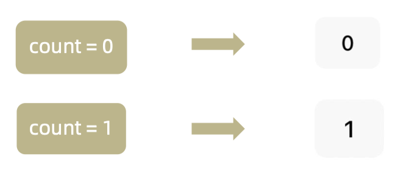

```jsx
const [狀態變數, 設定函數] = useState(初始值);
//     ^^^^^^   ^^^^^^        ^^^^
//     當前值   更新狀態的函數   初始狀態值
```

1. 調用useState添加一個狀態變量(**需要導入**)

   ```jsx
   import {useState} from 'react'
   ```
2. 建立點擊事件回調，並更新狀態值

   ```jsx
   function App() {
     // 1. 使用useState添加一個狀態
     const [count, setCount] = useState(0)
   
     // 2. 點擊按鈕回調，更新狀態
     const clickHandler = () => {
       setCount(count + 1)
     }
   
     return (
       <div className="App">
         <button onClick={clickHandler}>{count}</button>
       </div>
     );
   }
   
   export default App;
   ```

## 修改對象狀態

對於對象類型的狀態變數，應該始終**傳給set方法**來進行修改

> [!important]
>
> 在React中，狀態被認為是**唯讀**的，我們應該**始終替換它而不是修改它**，直接修改狀態不能引發視圖更新
>
> 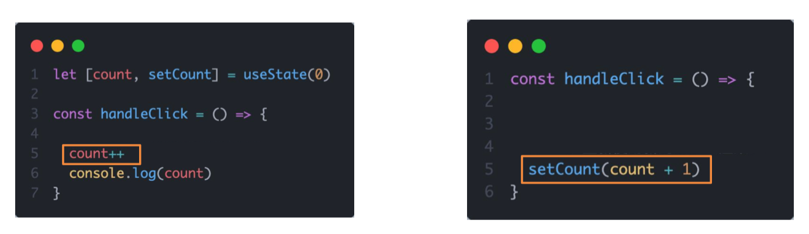

---

> **直接修改對象值**
>
> ```jsx
> import {useState} from 'react';
> 
> function App() {
>   const [form, setForm] = useState({name: "James"});
> 
>   const changeForm = () => {
>     form.name = "Jack"
>   }
> 
>   return (
>     <div className="App">
>       <button onClick={changeForm}>{form.name}</button>
>     </div>
>   );
> }
> 
> export default App;
> ```
>
> _~Rd~_

> **呼叫set傳入新對象修改**
>
> ```jsx
> import {useState} from 'react';
> 
> function App() {
>   const [form, setForm] = useState({name: "James"});
> 
>   const changeForm = () => {
>     setForm({
>       ...form,
>       name: "Jack"
>     })
>   }
> 
>   return (
>     <div className="App">
>       <button onClick={changeForm}>{form.name}</button>
>     </div>
>   );
> }
> 
> export default App;
> ```
>
> _~Gn~_

*[<kbd> bilibili練習  </kbd>](#bilibili評論案例)*

## 控制表單狀態

使用 React 組件的狀態（useState）來控制表單的狀態

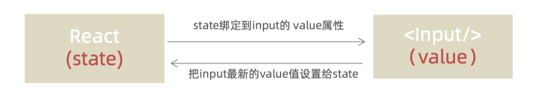

1. 準備一個React狀態值，讓input標籤value屬性保持更新

2. 通過value屬性綁定狀態，通過onChange更新變量

```jsx   
import {useState} from "react";

function App() {

  const [value, setValue] = useState('');

  return (
    <div className="App">
    <input
      type="text"
      value={value}
      onChange={(e) => setValue(e.target.value)}/>
    </div>
  );
}

export default App;
```

# useRef取得 DOM 元素

`useRef` 是 React 中用來直接存取 DOM 元素的 Hook，分為兩步驟：

1. 使用useRef建立 ref 對象，並與 JSX 綁定
2. 在DOM可用時，通過 inputRef.current 拿到 DOM 對象

```jsx
import {useRef} from 'react'

function App() {

  // 1. 生成useRef並綁定
  const inputRef = useRef(null)

  const showDom = () => {
    // 2. 通過 inputRef.current 拿到 DOM 對象
    console.log(inputRef.current)
  }

  return (
    <div className="App">
      <input type="text" ref={inputRef} />
      <button onClick={showDom}>Click</button>
    </div>
  );
}

export default App;
```

> [!note]
>
> **為什麼使用useRef而不是使用傳統的DOM獲取？**
>
>  React 會不斷重新渲染頁面，每次重新渲染時，你都要重新去「找」這個輸入框在哪裡
>
> **用 useRef 的話：** 就像你在輸入框上貼了一張「我的名片」，之後不管頁面怎麼變化，你都可以直接透過這張名片找到它，不用再重新搜尋

*[<kbd> bilibili發表評論  </kbd>](#bilibili發表評論)*


# useEffect副作用

`useEffect` 是 React Hook，用於處理組件的**副作用**（side effects）。它會在組件渲染完成後執行，讓我們可以安全地執行各種任務，有兩個核心使用場景：

1. **渲染完成後執行任務**

   **渲染完成**的時候再執行一些任務時使用 `useEffect`

   - DOM 操作（設置焦點、測量尺寸）
   - 更新頁面標題
   - 初始化第三方庫
   - 設置事件監聽器

2. **特定條件下執行邏輯**

   想要在**特定的條件**下去執行 useEffect 裡面的邏輯時使用

   - **API 調用** 
   - 數據獲取
   - 搜索功能
   - 即時數據更新

> [!important]
>
> |   觸發方式   |               例子                |  何時執行  |
> | :----------: | :-------------------------------: | :--------: |
> | **事件引起** | `onClick`, `onChange`, `onSubmit` | 用戶操作時 |
> | **渲染引起** |            `useEffect`            | 組件渲染後 |

```jsx
useEffect(
  () => {
    // 副作用函數
    // 在這裡寫副作用邏輯
    
    return () => {
      // 清理函數（可選）
      // 在組件卸載或下次副作用執行前調用
    };
  },
  [依賴項1, 依賴項2] // 依賴陣列（可選）空陣列 = 只執行一次
);
```

## useEffect 依賴項參數

useEffect副作用函數的執行時機存在多種情況，根據**傳入依賴項的不同**，會有不同的執行表現

|   依賴項類型   | 初始渲染 | State 改變 | Props 改變 | 使用建議                 |
| :------------: | :------: | :--------: | :--------: | ------------------------ |
| **沒有依賴項** |    ✅     |     ✅      |     ✅      | 謹慎使用，易造成性能問題 |
| **空陣列 []**  |    ✅     |     ❌      |     ❌      | 初始化、設定監聽器       |
|  **[特定值]**  |    ✅     |  依值而定  |  依值而定  | 響應特定變化，最常用     |

*^tab^*

> **沒有依賴項**
>
> ```jsx
> import {useState, useEffect} from 'react'
> 
> function App () {
>   // 1. 沒有依賴項
>   const [count, setCount] = useState(0);
>   useEffect(() => {
>     console.log('useEffect 被執行了')
>   })
> 
>   return (
>     <div className="App">
>       this is app
>       <button onClick={() => setCount(count + 1)}>{count}</button>
>     </div>
>   )
> }
> export default App;
> ```
>
> 執行時機：
>
> * 組件初始渲染時執行 
> * count 改變時執行
> * 任何 state 改變都會執行

> **空陣列 []**
>
> ```jsx
> import {useState, useEffect} from 'react'
> 
> function App () {
>   const [count, setCount] = useState(0);
>   // 2. 傳入空陣列
>   useEffect(() => {
>     console.log('useEffect 被執行了')
>   },[])
> 
>   return (
>     <div className="App">
>       this is app
>       <button onClick={() => setCount(count + 1)}>{count}</button>
>     </div>
>   )
> }
> export default App;
> ```
>
> 執行時機：
>
> * 組件初始渲染時執行

> **添加特定依賴**
>
> ```jsx
> import {useState, useEffect} from 'react'
> 
> function App () {
>   const [count, setCount] = useState(0);
>   // 3. 傳入特定依賴
>   useEffect(() => {
>     console.log('useEffect 被執行了')
>   },[count])
> 
>   return (
>     <div className="App">
>       this is app
>       <button onClick={() => setCount(count + 1)}>{count}</button>
>     </div>
>   )
> }
> export default App;
> ```
>
>  執行時機：
>
> * 組件初始渲染時執行
> * 只針對count 改變時執行

> [!important]
>
> **沒有依賴項** VS **依賴 [count]**
>
> 可以看到兩個的執行結果一樣，但是兩個其實有很大的差異，如果再增加多一點的狀態就可以觀察到，例如增加name這個狀態：
>
> |         操作          | 沒有依賴項 | 依賴 [count] |
> | :-------------------: | :--------: | :----------: |
> |     **初始渲染**      |   ✅ 執行   |    ✅ 執行    |
> | **點擊 "增加 Count"** |   ✅ 執行   |    ✅ 執行    |
> | **點擊 "改變 Name"**  |   ✅ 執行   | ❌ **不執行** |
> |  **點擊 "切換主題"**  |   ✅ 執行   | ❌ **不執行** |

## 清除副作用

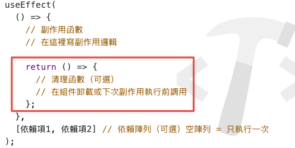

組件卸載或依賴項改變時，我們需要清理之前設置的副作用，避免記憶體洩漏和意外行為

副作用清除就是在適當的時機**撤銷**或**清理**之前設置的副作用，比如：

- 移除事件監聽器
- 清除定時器
- 取消網路請求
- 清理訂閱

*^tab^*

> **沒有清除副作用**
>
> ```jsx
> import {useState, useEffect} from 'react'
> 
> function Son() {
>   useEffect(() => {
>     const timer = setInterval(() => {
>       console.log('timer執行中...')
>     }, 1000)
>   })
>   return (
>     <div>this is son</div>
>   )
> }
> 
> function App () {
>   const [show, setShow] = useState(true)
>   return (
>     <div className="App">
>       {show && <Son/>}
>       <button onClick={() => setShow(false)}>清理組件</button>
>     </div>
>   )
> }
> export default App;
> ```
>
> 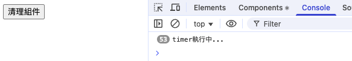
>
> 可以看到及使組件已經被清理，但是計時器依然再執行，繼續輸出 "timer執行中..."，需要添加一個清除函數來解決這個問題

> **清除副作用**
>
> ```jsx
> import { useState, useEffect } from 'react'
> 
> function Son() {
>     useEffect(() => {
>        const timer = setInterval(() => {
>          console.log('timer執行中...')
>        }, 1000)
> 
>        // 清除副作用
>        return () => {
>          clearInterval(timer)
>        }
>     })
>     return (
>        <div>this is son</div>
>     )
> }
> 
> function App() {
>     const [show, setShow] = useState(true)
>     return (
>        <div className="App">
>          {show && <Son />}
>          <button onClick={() => setShow(false)}>清理組件</button>
>        </div>
>     )
> }
> export default App;
> ```
>
> ```markdown
> 用戶操作 → 控制台輸出
> -------------------
> 1. 頁面加載    → 🟢 Son 組件掛載
>                → ⏰ timer執行中...
> 2. 等待1秒     → ⏰ timer執行中...
> 3. 點擊清理組件 → 🔴 Son 組件卸載，清除定時器
> 4. 等待1秒     → (無輸出 ✅ 定時器已停止)
> ```

# 自定義Hook

它的名稱以 `use` 開頭，並且可以調用其他的 Hook。它讓我們可以將**組件邏輯提取到可重複使用的函數中**

操作步驟：

1. 聲明一個以use開頭的函數
2. 在函數內封裝可以重複使用的邏輯
3. 把需要用到的狀態或者回調，使用return傳出來
4. 在哪個組件中用到該邏輯，就執行剛剛聲明的函數並解析出來狀態和回調來使用

> [!caution]
>
> 1. 只能在組件中或者其他自訂Hook函數中呼叫
> 2. 只能在組件的頂層呼叫，不能嵌套在 if、for、其他函數中

*^tab^*

> **原先邏輯**
>
> ```jsx
> import {useState} from 'react'
> 
> function App () {
>   // 設置按鍵點擊狀態
>   const [value, setValue] = useState(true);
>   const show = () => {
>     setValue(!value);
>   }
> 
> 
>   return (
>     <div className="App">
>       {/*顯示或是隱藏內容*/}
>       {value && <div>this is div</div>}
>       <button onClick={show}>顯示/隱藏</button>
>     </div>
>   )
> }
> export default App;
> ```

> **封裝後重複使用**
>
> ```jsx
> import {useState} from 'react'
> 
> // 1. 定義use開頭的函數
> function useShow () {
>     // 2. 封裝重用邏輯	
>     const [value, setValue] = useState(true);
>     const show = () => {
>       setValue(!value);
>     }
> 
>     // 3. 將需要用到的狀態傳出來
>     return {
>       value, show
>     }
> }
> 
> function App () {
>     // 4. 調用並解析
>     const {value, show} = useShow();
> 
>     return (
>       <div className="App">
>         {/*顯示或是隱藏內容*/}
>         {value && <div>this is div</div>}
>         <button onClick={show}>顯示/隱藏</button>
>       </div>
>     )
> }
> export default App;
> ```
>


*[<kbd> bilibili需求優化  </kbd>](#bilibili需求優化)*

# Redux狀態管理工具

**Redux** 是一個用於 JavaScript 應用程式的**狀態管理庫**，最常與 React 搭配使用，但也可以用於其他框架或純 JavaScript

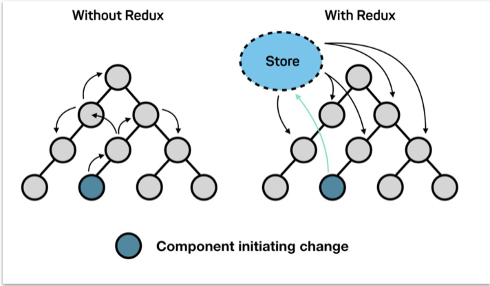

使用步驟：

1. 定義一個 reducer 函數 （根據當前想要做的修改返回一個新的狀態）
2. 使用createStore方法傳入 reducer函數 生成一個store實例對象
3. 使用store實例的 **subscribe方法** 訂閱資料的變化（資料一旦變化，可以得到通知）
4. 使用store實例的 **dispatch方法** 提交action對象 觸發資料變化（告訴reducer你想怎麼改資料）
5. 使用store實例的 **getState方法** 獲取最新的狀態資料更新到視圖中

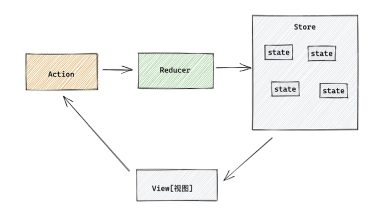

> [!note]
>
> 為了職責清晰，資料流向明確，Redux把整個資料修改的流程分成了**三個核心概念**，分別是：**state、action和reducer**
> 1. state - 一個對象 存放著我們管理的資料狀態
> 2. action - 一個對象 用來描述你想怎麼改資料
> 3. reducer - 一個函數 根據action的描述生成一個新的state

> **使用Redux完成記數器**
>
> ```html
> <!DOCTYPE html>
> <html lang="en">
> 
> <head>
>   <meta charset="UTF-8">
>   <meta name="viewport" content="width=device-width, initial-scale=1.0">
>   <title>Redux</title>
> </head>
> 
> <body>
>   <button class="decrement">-</button>
>   <span class="count">0</span>
>   <button class="increment">+</button>
> 
>   <script src="https://unpkg.com/redux@4.2.1/dist/redux.js"></script>
> 
>   <script>
>     // 1. 定義reducer函數
>     // 根據不同的action對象 返回不同的state
>     function reducer(state = { count: 0 }, action) {
>       // 資料是不可變的，只能基於原始狀態生成新的狀態
>       if (action.type === 'INCREMENT') {
>         return { count: state.count + 1 }
>       }
>       if (action.type === 'DECREMENT') {
>         return { count: state.count - 1 }
>       }
>       return state
>     }
> 
>     // 2. 使用reducer函數生成store實例
>     const store = Redux.createStore(reducer)
> 
>     // 3. 通過store實例訂閱資料變化
>     // 回調函數可以在每次state發生變化的時候自動執行
>     store.subscribe(() => {
>       console.log('state變化了', store.getState());
> 
>       // 5. 使用store實例的getState()獲取最新的狀態資料更新到視圖中
>       document.querySelector('.count').innerText = store.getState().count
>     })
> 
>     // 4. 通過store實例的dispatch函數提交action更改狀態
>     const inBtn = document.querySelector('.increment')
>     inBtn.addEventListener('click', () => {
>       store.dispatch({
>         type: 'INCREMENT'
>       })
>     })
> 
>     const deBtn = document.querySelector('.decrement')
>     deBtn.addEventListener('click', () => {
>       store.dispatch({
>         type: 'DECREMENT'
>       })
>     })
>   </script>
> </body>
> 
> </html>
> ```

## Redux與React環境準備

在React中使用redux，官方要求安裝兩個套件：

* **Redux Toolkit** ：官方推薦編寫Redux的邏輯，來**簡化書寫方式**
* **react-redux**：用來**連結 Redux 和 React元件**的橋樑

1. 使用 CRA 快速建立 React 項目 `npx create-react-app react-redux`

   > [!TIP]
   >
   > 要使用命令 `cd react-redux` 進入工作目錄

2. 安装配套工具 `npm i @reduxjs/toolkit  react-redux`

   > [!TIP]
   >
   > 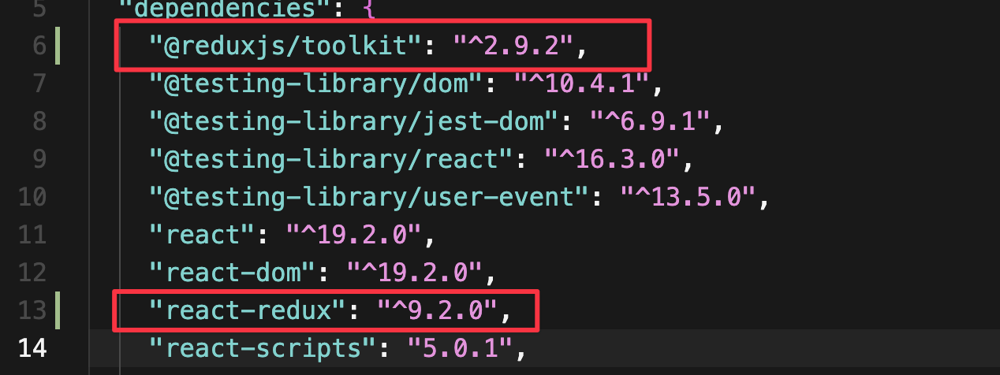

3. 啟動項目 `npm run start`

**store目錄結構設計**

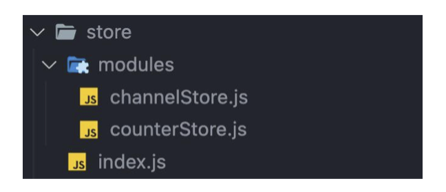

* 通常集中狀態管理的部分都會單獨建立一個單獨的 store 目錄
* 應用通常會有很多個store子模組，所以建立一個 modules 目錄，在內部編寫業務分類的子store
* store中的入口檔案 index.js 的作用是組合modules中所有的子模組，並匯出store

## 實現Redux架構

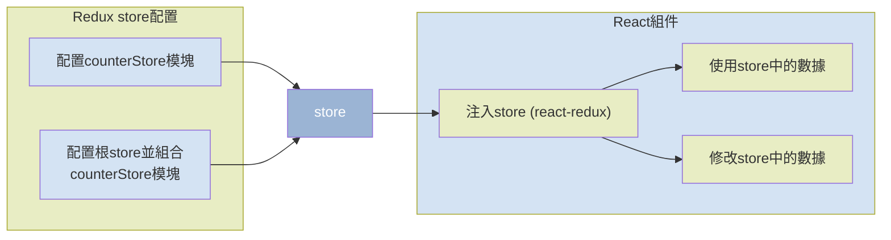
```mermaid
graph LR
  subgraph A["Redux store配置"]
    A1["配置counterStore模塊"]
    A2["配置根store並組合<br/>counterStore模塊"]
  end
  
  B["store"]
  
  subgraph C["React組件"]
    C1["注入store (react-redux)"]
    C2["使用store中的數據"]
    C3["修改store中的數據"]
  end
  
  A1 --> B
  A2 --> B
  B --> C1
  C1 --> C2
  C1 --> C3
  
  style A fill:#e8edc4
  style C fill:#d4e3f3
  style B fill:#9bb4d4,color:#fff
  style A1 fill:#d4e3f3
  style A2 fill:#d4e3f3
  style C1 fill:#e8edc4
  style C2 fill:#e8edc4
  style C3 fill:#e8edc4
```

---

> **建立counterStore模塊**
>
> *==counterStore.js==*
>
> ```javascript
> import { createSlice } from "@reduxjs/toolkit";
> 
> const conterStore = createSlice({
>   name: 'counter',
>   // 初始狀態
>   initialState: {
>     count: 0
>   },
>   // 修改函數
>   reducers: {
>     increment(state) {
>       state.count++
>     },
>     decrement(state) {
>       state.count--
>     }
>   }
> })
> 
> // 解構出創建action對象的函數 actionCreator
> const { increment, decrement } = conterStore.actions
> // 獲取reducer函數
> const conterReducer = conterStore.reducer
> // 導出創建action對象的函數和reducer對象的函數
> export { increment, decrement }
> export default conterReducer
> ```

> **組合子模塊**
>
> *==store/index.js==*
>
> ```javascript
> import { configureStore } from "@reduxjs/toolkit"
> 
> // 導入子模塊reducer
> import conterReducer from "./modules/counterStore"
> 
> // 建立根store 組合子模塊
> const store = configureStore({
>   reducer: {
>     counter: conterReducer
>   }
> })
> 
> export default store
> ```

> **為React注入store**
>
> react-redux負責把Redux和React 連結起來，內建 **Provider元件** 通過**store 參數把建立好的store實例注入到應用中**，連結正式建立
>
> 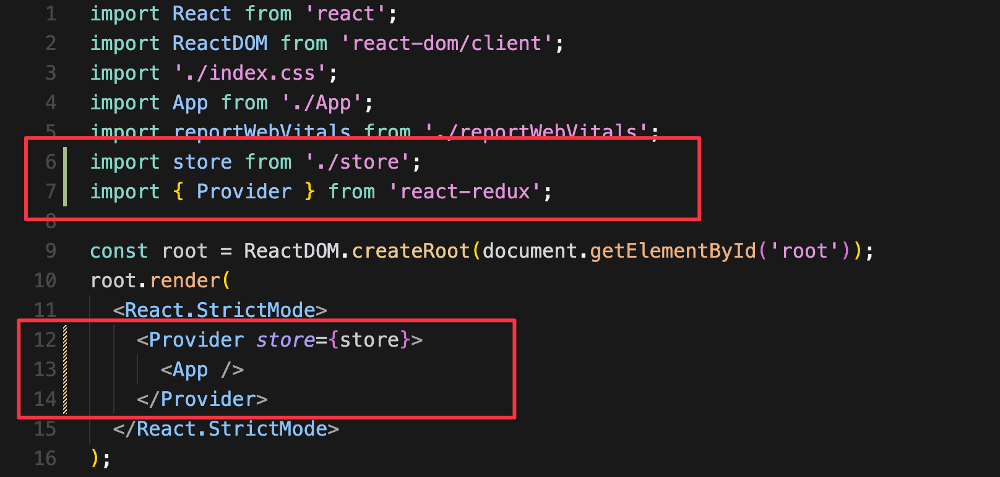

>**React元件使用store中的資料**
>
>在React元件中使用store中的資料，需要用到一個**hook函數 - useSelector**，它的作用是把store中的資料對應到元件中
>
>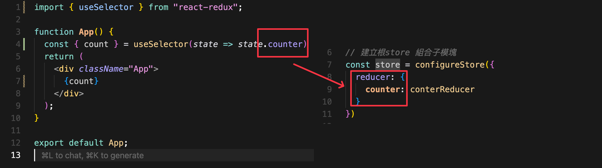
>
>React元件中修改store中的資料需要借助另外一個**hook函數 - useDispatch**，它的作用是生成提交action對象的dispatch函數
>
>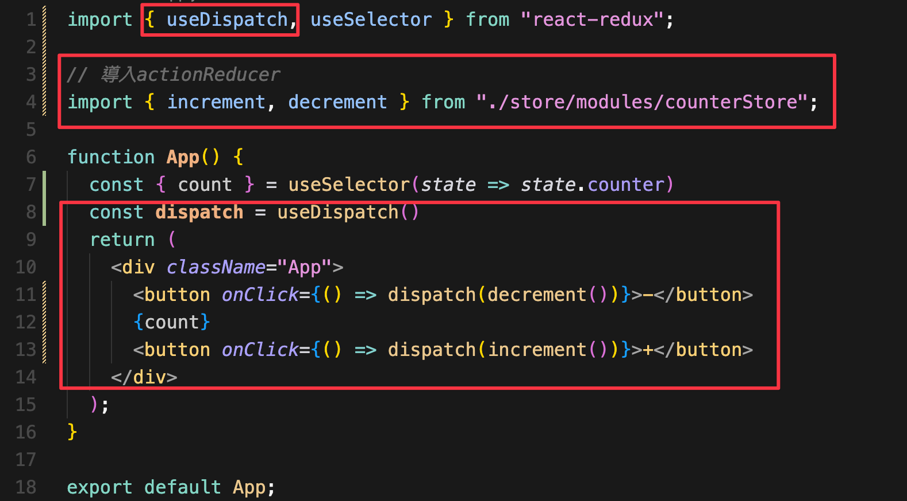

> [!tip]
>
> |      需求       |      Hook       |           用途           |
> | :-------------: | :-------------: | :----------------------: |
> |  **讀取**數據   |  `useSelector`  |  從 store **選擇**數據   |
> |  **修改**數據   |  `useDispatch`  |  獲取 **dispatch** 函數  |
> | **創建** action | `actionCreator` | 執行函數得到 action 對象 |
>
> **完整流程**：`useSelector` 讀 → `actionCreator` 創建 action → `useDispatch` 發送 → Reducer 處理 → Store 更新 → 組件重新渲染

## 提交action傳入參數

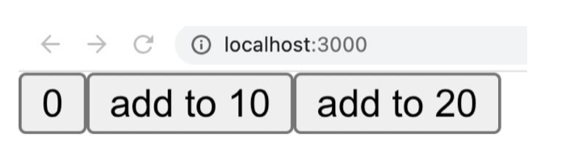

元件中有倆個按鈕 **add to 10** 和 **add to 20** 可以直接把count值修改到對應的數字，目標count值是在元件中傳遞過去的，需要在提交action的時候傳遞參數

> [!important]
>
> 在reducers的修改方法中**新增action對象參數**，在**呼叫actionCreater的時候傳遞參數**，參數會被**傳遞到action對象payload屬性**上

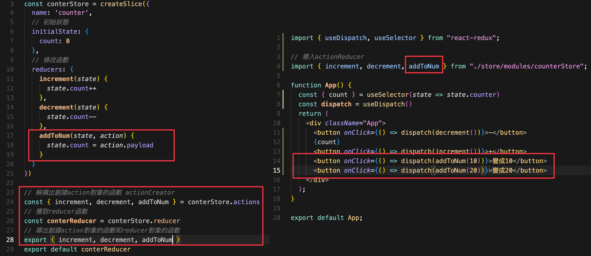

## Redux 異步請求操作

1. 建立store的寫法保持不變，並配置同步修改狀態的方法
2. 單獨封裝一個函數，在函數內部return一個新函數，在新函數中
   1. 封裝非同步請求獲取資料
   2. 呼叫同步actionCreater傳入異步資料生成一個action對象，並使用dispatch提交
3. 元件中dispatch的寫法保持不變

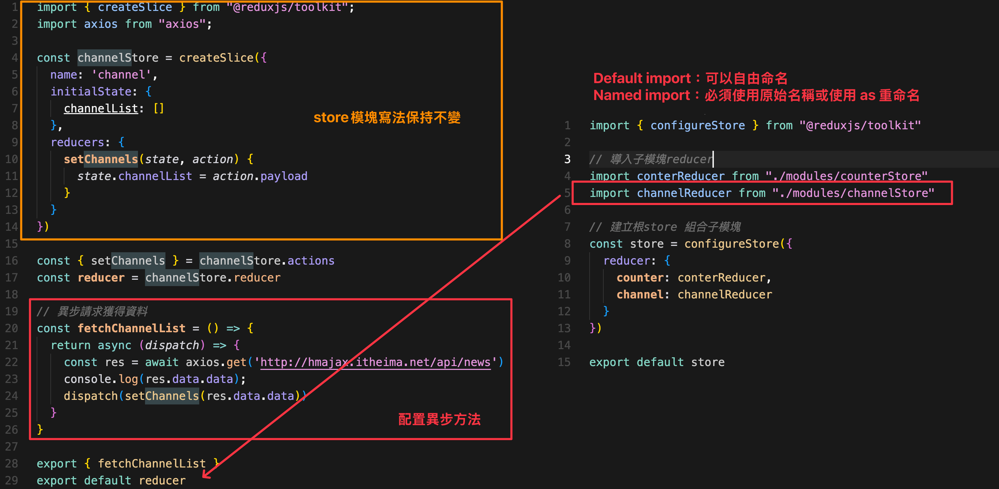

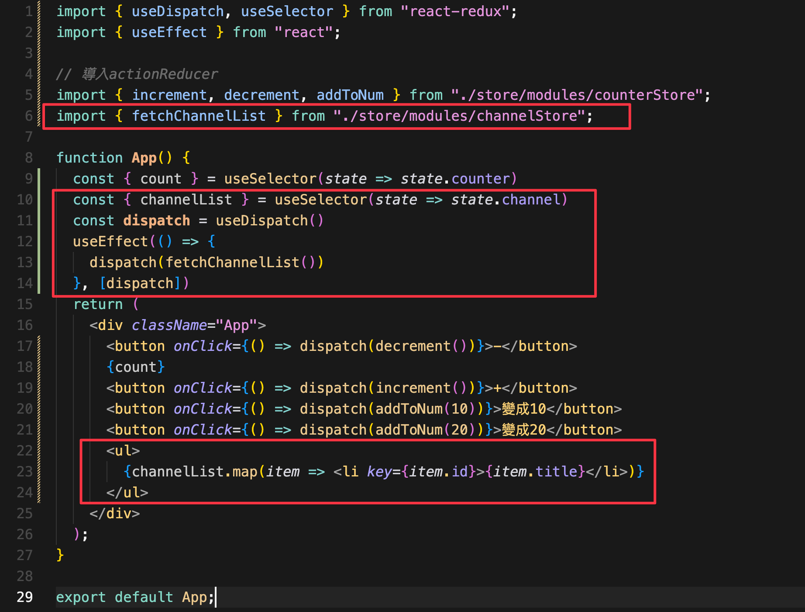

## chrome調試工具

Redux官方提供了針對於Redux的調試工具，支援即時state資訊展示，action提交資訊查看等

*[<kbd> Redux DevTools  </kbd>](https://chromewebstore.google.com/detail/redux-devtools/lmhkpmbekcpmknklioeibfkpmmfibljd?hl=zh-TW)*

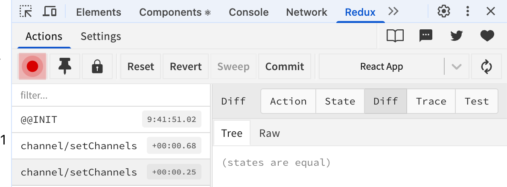


# 練習

## 類組件 state小案例

* Props（屬性）— 從**外部傳入**，元件自己**不能改**
* State（狀態）— 元件**內部管理**，元件自己**可以改**

> ###### 點擊按鈕會隨機切換背景顏色
>
> 先判斷他是屬性還是狀態
>
> 1. **資料會變** — `bgColor` 從 `"black"` 變成隨機顏色
> 2. **由元件自己觸發** — 是 `Welcome` 裡的按鈕在改，不是別人傳進來的
> 3. **改變後要重新渲染** — `setState` 會自動觸發 `render()`，畫面才會更新
>
> ```html
> <!DOCTYPE html>
> <html lang="en">
> 
> <head>
>   <meta charset="UTF-8">
>   <meta name="viewport" content="width=device-width, initial-scale=1.0">
>   <title>Document</title>
>   <script src="https://unpkg.com/react@18/umd/react.development.js"></script>
>   <script src="https://unpkg.com/react-dom@18/umd/react-dom.development.js"></script>
>   <script src="https://unpkg.com/@babel/standalone/babel.min.js"></script>
> </head>
> 
> <body>
>   <div id="root"></div>
>   <script type="text/babel">
>     const root = document.querySelector('#root');
>     const reactRoot = ReactDOM.createRoot(root);
> 
>     class Welcome extends React.Component {
> 
>       state = {
>         bgColor: "black"
>       }
> 
>       getRandomColor = () => { // 獲取隨機顏色的rgb值
>         const r = Math.floor(Math.random() * 256);
>         const g = Math.floor(Math.random() * 256);
>         const b = Math.floor(Math.random() * 256);
>         return `rgb(${r}, ${g}, ${b})`;
>       }  
> 
>       fn = () => {
>         this.setState({
>           bgColor: this.getRandomColor()
>         })
>       }
> 
>       render() {
>         const {bgColor} = this.state;
> 
>         const mystyle = {
>           width:"500px",
>           height:"500px",
>           backgroundColor: bgColor,
>         };
> 
>         return (
>           <>
>             <div style={mystyle}></div>
>             <button onClick={this.fn}>change</button>
>           </>
>         );
>       }
>     }
> 
>     reactRoot.render(
>       <Welcome />
>     )
>   </script>
> </body>
> 
> </html>
> ```

>###### 導航條高亮
>
>混和運用 `props` 和 `state` ，每個頁面會有各自的高亮的導航條，這個屬於外部傳入的，在頁面中點擊每一個導航條項目時，也要切換高亮
>
>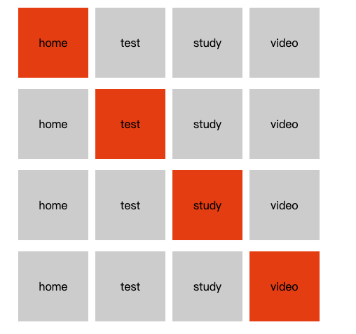
>
>`State`  接收 `Props` 當初始值，之後自己管理，之後的互動完全由 `State` 接手
>
>```html
><!DOCTYPE html>
><html lang="en">
>
><head>
>  <meta charset="UTF-8">
>  <meta name="viewport" content="width=device-width, initial-scale=1.0">
>  <title>Document</title>
>  <script src="https://unpkg.com/react@18/umd/react.development.js"></script>
>  <script src="https://unpkg.com/react-dom@18/umd/react-dom.development.js"></script>
>  <script src="https://unpkg.com/@babel/standalone/babel.min.js"></script>
>  <style>
>    ul {
>      overflow: hidden;
>    }
>    li {
>      list-style: none;
>      float: left;
>      width: 100px;
>      height: 100px;
>      line-height: 100px;
>      text-align: center;
>      background-color: #ccc;
>      margin-right: 10px;
>    }
>    .act {
>      background-color: red;
>    }
>  </style>
></head>
>
><body>
>  <div id="root"></div>
>  <script type="text/babel">
>    const root = document.querySelector('#root');
>    const reactRoot = ReactDOM.createRoot(root);
>
>    class Navi extends React.Component {
>      // props state 混和運用
>      state = {
>        defaultAct: this.props.defaultAct
>      }
>
>      fn = (index) => { // 接收使用者點擊的index
>        this.setState({
>          defaultAct: index
>        })
>      }
>
>
>      render() {
>        const { defaultAct } = this.state;
>
>        return (
>          <ul>
>            <li onClick={() => { this.fn(1)}} className={defaultAct==1?"act":"none"}>home</li>
>            <li onClick={() => { this.fn(2)}} className={defaultAct==2?"act":"none"}>test</li>
>            <li onClick={() => { this.fn(3)}} className={defaultAct==3?"act":"none"}>study</li>
>            <li onClick={() => { this.fn(4)}} className={defaultAct==4?"act":"none"}>video</li>
>          </ul>
>        )
>      }
>    }
>
>    reactRoot.render(
>      <>
>        <Navi defaultAct={1}/>
>        <Navi defaultAct={2}/>
>        <Navi defaultAct={3}/>
>        <Navi defaultAct={4}/>
>      </>
>    );
>  </script>
></body>
>
></html>
>```


## 修改個人訊息

`Game`（父元件）— 管理所有資料

- **state** 管理兩個東西：`nickname`（暱稱）和 `modalShow`（彈窗顯示/隱藏）
- 畫面上顯示暱稱 + 一個 Edit 按鈕
- 點 Edit → 開啟彈窗（`modalShow` 改成 `'block'`）

`Modal`（子元件）— 只負責顯示，不管理資料

- 透過 **props** 接收所有東西：暱稱、顯示狀態、關閉方法、改名方法
- 點 Close → 呼叫父層的 `modalClose`（隱藏彈窗）
- 點 Change → 呼叫父層的 `changeName("James")`（把暱稱改成 James）

```html
<!DOCTYPE html>
<html lang="en">

<head>
  <meta charset="UTF-8">
  <meta name="viewport" content="width=device-width, initial-scale=1.0">
  <title>Document</title>
  <script src="https://unpkg.com/react@18/umd/react.development.js"></script>
  <script src="https://unpkg.com/react-dom@18/umd/react-dom.development.js"></script>
  <script src="https://unpkg.com/@babel/standalone/babel.min.js"></script>
  <style>
    .box {
      border: 1px solid black;
      width: 400px;
    }

    .modalBox {
      border: 1px solid red;
      width: 300px;
      margin-left: 500px;
    }
  </style>
</head>

<body>
  <div id="root"></div>
  <script type="text/babel">
    const root = document.querySelector('#root');
    const reactRoot = ReactDOM.createRoot(root);

    class Game extends React.Component {
      state = {
        nickname: 'Player1',
        modalShow: 'none'
      }

      openModal = () => {
        this.setState({ modalShow: 'block' });
      }

      modalClose = () => {
        this.setState({ modalShow: 'none' });
      }

      changeName = (nickname) => {
        this.setState({ nickname });
      }

      render() {
        const { nickname, modalShow } = this.state;

        return (
          <>
            <div className="box">
              <h1>{nickname}</h1>
              <button onClick={this.openModal}>Edit</button>
            </div>
            <Modal nickname={nickname} modalShow={modalShow} modalClose={this.modalClose} changeName={this.changeName} />
          </>
        )
      }
    }

    class Modal extends React.Component {
      // closeModal = () => {
      //   his.modalShow = 'none'; // 錯誤寫法 不能直接修改 props 的值
      // }

      render() {
        const { nickname, modalShow, modalClose, changeName } = this.props;

        return (
          <div className="modalBox" style={{ display: modalShow }}>
            <h1>{nickname}</h1>
            <button onClick={modalClose}>Close</button>
            <button onClick={() => changeName("James")}>Change</button>
          </div>
        )
      }
    }

    reactRoot.render(
      <Game />
    );
  </script>
</body>

</html>
```


## bilibili評論案例

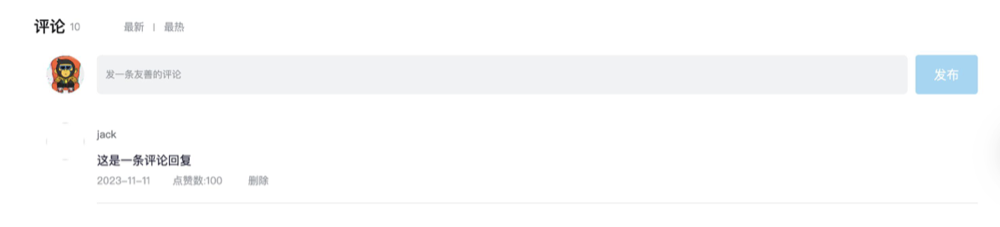

1. 渲染評論列表

   * 使用useState來渲染評論列表
   * 使用map方法對列表資料進行遍歷渲染（別忘了加key）

   ```jsx
   const [commentList, setCommentList] = useState(defaultList)
   
   {/* 評論列表 */}
   <div className="reply-list">
     {/* 評論項 */}
     {commentList.map(item => (
       <div key={item.rpid} className="reply-item">
         {/* 頭像 */}
         <div className="root-reply-avatar">
           <div className="bili-avatar">
             
           </div>
         </div>
   
         <div className="content-wrap">
           {/* 用戶名 */}
           <div className="user-info">
             <div className="user-name">{item.user.uname}</div>
           </div>
           {/* 評論內容 */}
           <div className="root-reply">
             <span className="reply-content">{item.content}</span>
             <div className="reply-info">
               {/* 評論時間 */}
               <span className="reply-time">{item.ctime}</span>
               {/* 評論數量 */}
               <span className="reply-time">點讚數:{item.like}</span>
               <span className="delete-btn">
               刪除
             </span>
   
             </div>
           </div>
         </div>
       </div>
     ))}
   </div>
   ```

2. 刪除評論實現

   * 只有自己的評論才顯示刪除按鈕(條件過濾)

     ```jsx
     {/* 評論數量 */}
     <span className="reply-time">點讚數:{item.like}</span>
     {user.uid === item.user.uid &&
       <span className="delete-btn" onClick={() => handleDel(item.rpid)}>
         刪除
       </span>
     }
     ```

   * 點選刪除按鈕，刪除當前評論，列表中不再顯示

     ```jsx
     const handleDel = (rid) => {
       console.log(rid)
       setCommentList(commentList.filter((item) => item.rpid !== rid))
     }
     ```

3. 渲染導航Tab和高亮實現

   點誰就把誰的type（獨一無二的標識）記錄下來，然後和遍歷時的每一項的type做匹配，誰匹配到就設定負責高亮的類名

   ```jsx
   <li className="nav-sort">
     {/* 高亮類名： active */}
     {tabs.map(item => (
       <span key={item.type} className={`nav-item ${type === item.type && 'active'}`} onClick={() => handleTabChange(item.type)}>{item.text}</span>
     ))}
   </li>
   ```

   ```jsx
   const [type, setType] = useState("hot")
   
   const handleTabChange = (type) => {
     console.log(type)
     setType(type)
   }
   ```

   > [!note]
   >
   > className={nav-item ${type === item.type && 'active'}} 這樣的寫法不夠整潔，不好讀，可以用第三方套件**通過條件動態控制class類名的顯示**
   >
   > 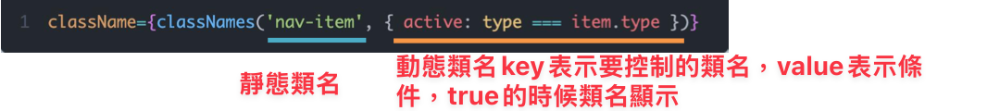
   >
   > ```bash
   > npm install classnames
   > ```
   >
   > ```jsx
   > <li className="nav-sort">
   >   {/* 高亮類名： active */}
   >   {tabs.map(item => (
   >     <span key={item.type} className={classNames("nav-item", {"active": type===item.type})} onClick={() => handleTabChange(item.type)}>{item.text}</span>
   >   ))}
   > </li>
   > ```
   >
   > 

4. 評論列表排序功能實現

   導入lodash第三方套件，完成排序功能(需要先 `npm install lodash`)

   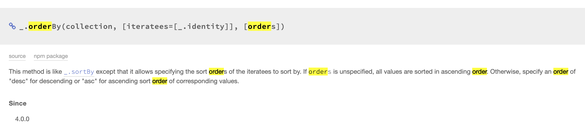

   ```jsx
   import _ from 'lodash'
   ```

   ```jsx
   const [type, setType] = useState("hot")
   const handleTabChange = (type) => {
     console.log(type)
     setType(type)
     if (type === "hot") {
       // 根據點讚數量排序
       setCommentList(_.orderBy(commentList, 'like', 'desc'))
     } else {
       // 根據發布時間排序
       setCommentList(_.orderBy(commentList, 'ctime', 'desc'))
     }
   }
   ```

## bilibili發表評論

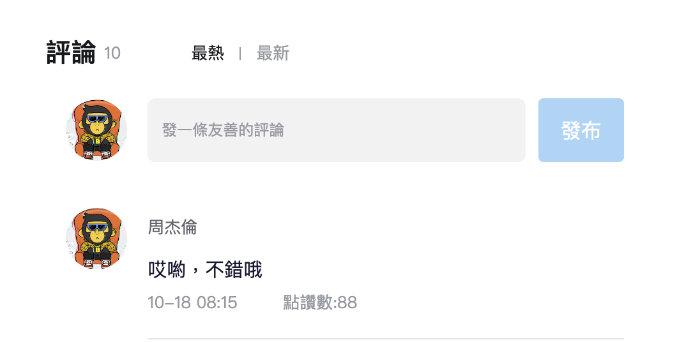

1. 獲取表單中的評論文字

   ```jsx
   const [content, setContent] = useState('')
   
   {/* 評論框 */}
   <textarea
     className="reply-box-textarea"
     placeholder="發一條友善的評論"
     value={content}
     onChange={(e)=> setContent(e.target.value)}
   />
   ```

2. 點擊發布按鈕發布評論

   ```jsx
   const handlePublish = () => {
     setCommentList([
       ...commentList,
       {
         rpid: 231,
         user: {
           uid: '36080105',
           avatar,
           uname: '許嵩',
         },
         content: content,
         ctime: '11-13 11:29',
         like: 88,
       }
     ])
   }
   
   {/* 發布按鈕 */}
   <div className="reply-box-send">
     <div className="send-text" onClick={handlePublish}>發布</div>
   </div>
   ```

3. id處理和時間處理

   ```bash
   # 處理唯一的隨機數id
   # https://www.npmjs.com/package/uuid
   npm install uuid
   
   # 處理時間 生成固定格式
   # https://www.npmjs.com/package/dayjs
   npm install dayjs
   ```

   ```jsx
   import { v4 as uuidV4 } from 'uuid';
   import dayjs from 'dayjs';
   
   const handlePublish = () => {
     setCommentList([
       ...commentList,
       {
         rpid: uuidV4(),
         user: {
           uid: '36080105',
           avatar,
           uname: '許嵩',
         },
         content: content,
         ctime: dayjs(new Date()).format('MM-DD hh:mm'),
         like: 88,
       }
     ])
   }
   ```

4. 清空內容並重新聚焦

   ```jsx
   const [content, setContent] = useState('')
   const inputRef = useRef(null)
   
   const handlePublish = () => {
     setCommentList([
       ...commentList,
       {
         rpid: uuidV4(),
         user: {
           uid: '36080105',
           avatar,
           uname: '許嵩',
         },
         content: content,
         ctime: dayjs(new Date()).format('MM-DD hh:mm'),
         like: 88,
       }
     ])
     // 清空輸入內容
     setContent("")
   
     // 使用useRef重新聚焦
     inputRef.current.focus()
   }
   
   <textarea
     className="reply-box-textarea"
     placeholder="發一條友善的評論"
     value={content}
     ref={inputRef}
     onChange={(e)=> setContent(e.target.value)}
   />
   ```


## bilibili需求優化

* 使用 *[<kbd> json-server 工具  </kbd>](https://github.com/typicode/json-server)*模擬api服務並以*[<kbd> axios  </kbd>](https://axios-http.com/docs/intro)*請求api的方式獲取評論列表並渲染

  1. ```bash
     npm install json-server -D
     npm install axios
     ```

  2. 建立db.json檔案

  3. 在package.json中添加啟動命令

     ```json
     "scripts": {
       "start": "react-scripts start",
       "build": "react-scripts build",
       "serve": "json-server db.json --port 3004"
     }
     ```

  4. ```bash
     npm run serve #啟動服務(不可關閉)
     ```

  5. 使用useEffect調用API

     ```jsx
     const [commentList, setCommentList] = useState([])
     
     useEffect(() => {
       // 請求資料
       async function getList() {
         const res = await axios.get('http://localhost:3004/list')
         setCommentList(res.data)
       }
       getList()
     },[])
     ```

*  使用自訂Hook函數封裝資料請求的邏輯

   1. 定義Hook

      ```jsx
      function useGetList() {
        const [commentList, setCommentList] = useState([])
      
        useEffect(() => {
          // 請求資料
          async function getList() {
            const res = await axios.get('http://localhost:3004/list')
            setCommentList(res.data)
          }
          getList()
        },[])
      
        return {
          commentList,
          setCommentList,
        }
      }
      ```

   2. 使用Hook

      ```jsx
      const {commentList, setCommentList} = useGetList()
      ```
*  把評論中的每一項抽象成一個獨立的元件實現渲染

   > [!tip]
   >
   > App作為**容器元件**負責資料的獲取，Item作為**展示元件**負責資料的渲染

   ```jsx
   function Item({item, onDel}) {
     return (
       <div className="reply-item">
         {/* 頭像 */}
         <div className="root-reply-avatar">
           <div className="bili-avatar">
             
           </div>
         </div>
   
         <div className="content-wrap">
           {/* 用戶名 */}
           <div className="user-info">
             <div className="user-name">{item.user.uname}</div>
           </div>
           {/* 評論內容 */}
           <div className="root-reply">
             <span className="reply-content">{item.content}</span>
             <div className="reply-info">
               {/* 評論時間 */}
               <span className="reply-time">{item.ctime}</span>
               {/* 評論數量 */}
               <span className="reply-time">點讚數:{item.like}</span>
               {user.uid === item.user.uid &&
                 <span className="delete-btn" onClick={() => onDel(item.rpid)}>
                           刪除
                         </span>
               }
             </div>
           </div>
         </div>
       </div>
     )
   }
   ```

   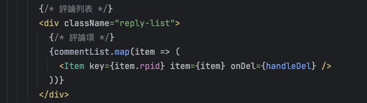

# The End<br>*Written by JamesZhan*<br><sub>若是內容有錯誤歡迎糾正 *[<kbd> Email</kbd>](mailto:henry16801@gmail.com?subject="內容錯誤糾正(非錯誤糾正可自行更改標題)")*</sub>
