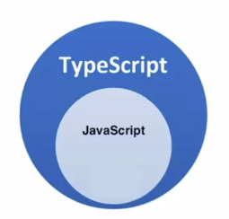

---
title:前端開發學習筆記-TypeScript
vlook-doc-lib:
- [筆記網站跳轉](index.html?target=_self "快速挑轉到想要的網頁")
- [前端開發學習筆記★HTML](web_HTML.html?target=_self "網頁開發學習筆記★HTML")
- [前端開發學習筆記★CSS](web_CSS.html?target=_self "網頁開發學習筆記★CSS")
- [前端開發學習筆記★JS](web_JS.html?target=_self "網頁開發學習筆記★JS")
- [前端開發學習筆記★WebAPI](web_WebAPI.html?target=_self "網頁開發學習筆記★JS")
- [前端開發學習筆記★AJAX](web_AJAX.html?target=_self "網頁開發學習筆記★JS")
- [前端開發學習筆記★React](web_React.html?target=_self "網頁開發學習筆記★React")
- [前端開發學習筆記★TypeScript](web_TypeScript.html?target=_self "網頁開發學習筆記★TypeScript")
---

######  ~VLOOK™~ *[<kbd> VLOOK </kbd>](https://github.com/MadMaxChow/VLOOK)*<br>前端開發學習筆記-TypeScript──<br><u>簡介</u><br>*本篇筆記是使用[<kbd> Typora</kbd>](https://typora.io/)及[<kbd> Markdown</kbd>](https://markdown.tw/)<br>結合GitHub開源模版撰寫而成並導出成HTML*<br>**JamesZhan**<br>*不允許複製下載`僅供閱覽`* *版本日期`2025年6月1日`*

[TOC]

# 什麼是TypeScript

==TypeScript 是由 **Microsoft** 開發的程式語言，是 **JavaScript 的超集合（Superset）**==

> [!tip]
>
> **TypeScript = JavaScript + 型別系統（Type System）**
>
> 
>
> ```typescript
> // ❌ JavaScript：沒有型別檢查
> let age = 25;
> 
> // ✅ TypeScript：有型別檢查
> let age: number = 25;
> ```

**TypeScript 為什麼要為 JS 新增類型支援？**

JS 的類型系統存在先天缺陷，JS 程式碼中絕大部分錯誤都是類型錯誤（Uncaught TypeError），增加了找 Bug、改 Bug 的時間，嚴重影響開發效率

---

> **動態型別(JavaScript)**
>
> 執行時才確定型別，可以隨時改變，需要等到程式碼真正去執行的時候才能發現錯誤（**晚**）

> **靜態型別(TypeScript)**
>
> 編譯時就確定型別，不能隨意改變，在程式碼編譯的時候（程式碼執行前）就可以發現錯誤（**早**）

**TypeScript 相比 JS 的優勢**

* 更早（寫程式碼的同時）發現錯誤，**減少找 Bug、改 Bug 時間**，提升開發效率
* 程序中任何位置的程式碼都有**程式碼提示**，隨時隨地的安全感，增強了開發體驗
* 強大的**類型系統**提升了程式碼的可維護性，使得**重構程式碼更加容易**
* 支援**最新的 ECMAScript 語法**，優先體驗最新的語法，讓你走在前端技術的最前沿
* TypeScript **類型推斷機制**，**不需要在程式碼中的每個地方都顯示標註類型**，讓你在享受優勢的同時，儘量降低了成本。

# The End<br>*Written by JamesZhan*<br><sub>若是內容有錯誤歡迎糾正 *[<kbd> Email</kbd>](mailto:henry16801@gmail.com?subject="內容錯誤糾正(非錯誤糾正可自行更改標題)")*</sub>