---
title:前端開發學習筆記-TypeScript
vlook-doc-lib:
- [筆記網站跳轉](index.html?target=_self "快速挑轉到想要的網頁")
- [前端開發學習筆記★HTML](web_HTML.html?target=_self "網頁開發學習筆記★HTML")
- [前端開發學習筆記★CSS](web_CSS.html?target=_self "網頁開發學習筆記★CSS")
- [前端開發學習筆記★JS](web_JS.html?target=_self "網頁開發學習筆記★JS")
- [前端開發學習筆記★WebAPI](web_WebAPI.html?target=_self "網頁開發學習筆記★JS")
- [前端開發學習筆記★AJAX](web_AJAX.html?target=_self "網頁開發學習筆記★JS")
- [前端開發學習筆記★React](web_React.html?target=_self "網頁開發學習筆記★React")
- [前端開發學習筆記★TypeScript](web_TypeScript.html?target=_self "網頁開發學習筆記★TypeScript")
---

######  ~VLOOK™~ *[<kbd> VLOOK </kbd>](https://github.com/MadMaxChow/VLOOK)*<br>前端開發學習筆記-TypeScript──<br><u>簡介</u><br>*本篇筆記是使用[<kbd> Typora</kbd>](https://typora.io/)及[<kbd> Markdown</kbd>](https://markdown.tw/)<br>結合GitHub開源模版撰寫而成並導出成HTML*<br>**JamesZhan**<br>*不允許複製下載`僅供閱覽`* *版本日期`2025年6月1日`*

[TOC]

# 什麼是TypeScript

==TypeScript 是由 **Microsoft** 開發的程式語言，是 **JavaScript 的超集合（Superset）**==

> [!tip]
>
> **TypeScript = JavaScript + 型別系統（Type System）**
>
> 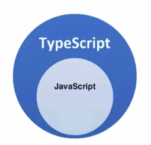
>
> ```typescript
> // ❌ JavaScript：沒有型別檢查
> let age = 25;
> 
> // ✅ TypeScript：有型別檢查
> let age: number = 25;
> ```

**TypeScript 為什麼要為 JS 新增類型支援？**

JS 的類型系統存在先天缺陷，JS 程式碼中絕大部分錯誤都是類型錯誤（Uncaught TypeError），增加了找 Bug、改 Bug 的時間，嚴重影響開發效率

---

> **動態型別(JavaScript)**
>
> 執行時才確定型別，可以隨時改變，需要等到程式碼真正去執行的時候才能發現錯誤（**晚**）

> **靜態型別(TypeScript)**
>
> 編譯時就確定型別，不能隨意改變，在程式碼編譯的時候（程式碼執行前）就可以發現錯誤（**早**）

**TypeScript 相比 JS 的優勢**

* 更早（寫程式碼的同時）發現錯誤，**減少找 Bug、改 Bug 時間**，提升開發效率
* 程序中任何位置的程式碼都有**程式碼提示**，隨時隨地的安全感，增強了開發體驗
* 強大的**類型系統**提升了程式碼的可維護性，使得**重構程式碼更加容易**
* 支援**最新的 ECMAScript 語法**，優先體驗最新的語法，讓你走在前端技術的最前沿
* TypeScript **類型推斷機制**，**不需要在程式碼中的每個地方都顯示標註類型**，讓你在享受優勢的同時，儘量降低了成本

## 安裝TypeScript

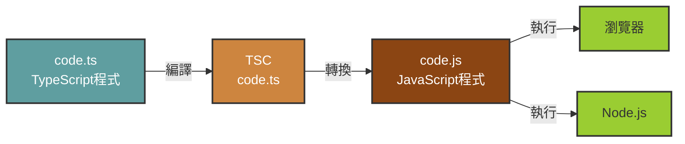
```mermaid
flowchart LR
    A[code.ts<br/>TypeScript程式]
    B[TSC<br/>code.ts]
    C[code.js<br/>JavaScript程式]
    D[瀏覽器]
    E[Node.js]
    
    A -->|編譯| B
    B -->|轉換| C
    C -->|執行| D
    C -->|執行| E
    
    style A fill:#5F9EA0,stroke:#333,stroke-width:2px,color:#fff
    style B fill:#CD853F,stroke:#333,stroke-width:2px,color:#fff
    style C fill:#8B4513,stroke:#333,stroke-width:2px,color:#fff
    style D fill:#9ACD32,stroke:#333,stroke-width:2px,color:#333
    style E fill:#9ACD32,stroke:#333,stroke-width:2px,color:#333

```

Node.js和瀏覽器，**只認識 JS 程式碼**，不認識 TS 程式碼，因此需要先將 TS 程式碼轉化為 JS 程式碼才能執行

```bash
# 編譯 TS 程式碼的包，提供了 tsc 命令，實現了 TS -> JS 的轉化
npm i -g typescript

# 檢查是否安裝成功 (查看 typescript 的版本)
tsc –v
```

>[!tip]
>
>如果沒有權限安裝需要先進入管理員模式 `sudo su`，輸入密碼再打安裝指令

## 編譯執行TypeScript

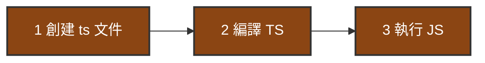
```mermaid
graph LR
    A[1 創建 ts 文件] --> B[2 編譯 TS]
    B --> C[3 執行 JS]
    
    style A fill:#8B4513,stroke:#333,stroke-width:2px,color:#fff
    style B fill:#8B4513,stroke:#333,stroke-width:2px,color:#fff
    style C fill:#8B4513,stroke:#333,stroke-width:2px,color:#fff

```

1. 建立一個.ts的檔案

   *==hello.ts==*

   ```typescript
   console.log('this is typescript')
   let age: number = 19
   console.log(age)
   ```

2. 將 TypeScript 編譯為 JavaScript，此時在同級目錄中會出現一個同名的JavaScript檔案

   ```bash
   # 終端機輸入
   tsc hello.ts
   ```

3. 執行JavaScript

   ```bash
   # 終端機輸入
   node hello.js
   ```

> [!caution]
>
> 所有合法的 JS 程式碼都是 TS 程式碼，有 JS 基礎只需要學習 TS 的類型
>
> 由 TS 編譯生成的 **JS 檔案**，**程式碼中沒有類型資訊**

> [!note]
>
> 每次修改程式碼後，都要重複執行兩個命令，才能運行 TS 程式碼，可以使用**ts-node** 套件，直接在 Node.js 中執行 TS 程式碼
>
> ```bash
> # 終端機輸入
> npm i -g ts-node
> 
> # 直接使用ts-node執行
> ts-node hello.ts
> ```

# TypeScript常用類型

---

> **類型註解**
>
> 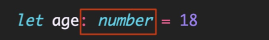
>
> 程式碼中的 : number 就是類型註解，為變數新增類型約束。比如約定變數 age 的類型為 number（數值類型）

> **類型錯誤示範**
>
> 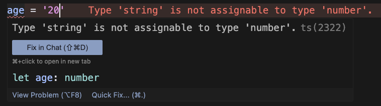
>
> 約定了什麼類型，就只能給變數賦值該類型的值，否則會報錯

## JavaScript原始類型

* number：包含整數和浮點數，例如：`42`、`3.14`、`NaN`、`Infinity`
* string：文本數據，例如：`"hello"`、`'world'`、``template``
* boolean：只有兩個值：`true` 或 `false`
* null：表示"無值"或"空對象"，是有意的空值
* undefined：變量已聲明但未賦值時的默認值
* symbol（ES6新增）：創建唯一的標識符，例如：`Symbol('id')`

> [!important]
>
> 這些類型，完全按照 JS 中類型的名稱來書寫
>
> 

* Object物件類型：陣列、對象、函數等對象

  ```typescript
  let students: string[] = ["james", "alex"]
  // let students: Array<string> = ["james", "alex"]
  
  let booleans: boolean[] = [true, false]
  // let booleans: Array<boolean> = [true, false]
  
  let mix: (string | number)[] = [1, 2, 3, 'a', 'b']
  
  // ...
  ```

  > [!tip]
  >
  > 推薦使用上面的寫法 `string[]`

## 類型別名

如果有一個複雜的類型（例如 `string | number`）需要在多個地方使用

* **不用**類型別名：要在每個變數、每個函數參數都重複寫一次
* **使用**類型別名：只需要定義一次，之後直接用別名就好，**也方便統一修改**

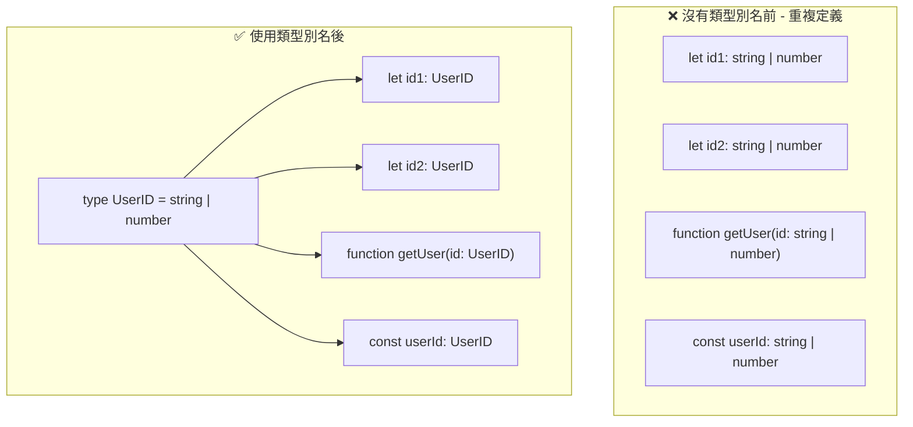
```mermaid
graph TB
    subgraph before["❌ 沒有類型別名前 - 重複定義"]
        F1["let id1: string | number"]
        F2["let id2: string | number"]
        F3["function getUser(id: string | number)"]
        F4["const userId: string | number"]
    end
    
    subgraph after["✅ 使用類型別名後"]
        A["type UserID = string | number"]
        A --> B["let id1: UserID"]
        A --> C["let id2: UserID"]
        A --> D["function getUser(id: UserID)"]
        A --> E["const userId: UserID"]
    end

```

```typescript
type CustomArray = (number | string)[]

// let arr: (number | string)[] = [1, 2, 3, 'a', 'b']
// let arr1: (number | string)[] = [1, 2, 3, 'a', 'b']

let arr: CustomArray=[1, 2, 3, 'a', 'b']
```

## 函數類型

在 TypeScript 中，函數的類型實際上就是指定：

- **參數的類型**（接收什麼）
- **返回值的類型**（返回什麼）

**兩種指定方式**

*^tab^*

> **方式 1：單獨指定參數、返回值的類型**
>
> ```typescript
> // 標註參數和返回值類型
> function add(a: number, b: number): number {
>   return a + b;
> }
> 
> // 箭頭函數
> const subtract = (a: number, b: number): number => {
>   return a - b;
> };
> ```
>
> - 參數和返回值分開標註
> - 直觀易讀
> - 最常用的方式

> **方式 2：同時指定參數、返回值的類型**
>
> ```typescript
> const add: (num1: number, num2: number) => number = (num1, num2) => {
>   return num1 + num2
> }
> ```
>
> - 先定義類型，後實現函數
> - 這種形式只適用於函數表示式(用 `const`（或 `let`、`var`）建立的函數就是函數表達式)

> [!tip]
>
> 如果函數沒有返回值，函數返回值類型為：**void**
>
> ```typescript
> function greet(name: string): void {
>   console.log('My name is', name)
> }
> 
> greet("James")
> ```


使用函數實現某個功能時，參數可以傳也可以不傳。這種情況下，在給函數參數指定類型時，就用到**可選參數**

```typescript
function mySlice(start?: number, end?: number): void {
  console.log('start: ', start, 'end: ', end);
}

mySlice()
mySlice(1)
mySlice(1, 4)
```

> [!caution]
>
> **可選參數只能出現在參數列表的最後**，也就是說可選參數後面不能再出現必選參數

## 物件類型

在 TypeScript 中，**物件類型**是用來描述物件的結構，指定物件有哪些屬性（properties）以及每個屬性的類型

```typescript
// 屬性之間用分號隔開
const person: { name: string; age: number; sayHi(): void } = {
  name: 'James',
  age: 19,
  sayHi() { }
}

// 屬性之間用換行隔開(省略分號)
const person: { 
  name: string
  age: number
  sayHi(): void 
} = {
  name: 'James',
  age: 19,
  sayHi() { }
}
```

> [!note]
>
> 如果方法有參數，就在方法名後面的小括號中指定參數類型（比如：**greet(name: string): void**）
>
> 方法的類型也可以使用箭頭函數形式（比如：**{ sayHi: () => void }**）

物件的屬性或方法，也可以是可選的，此時就用到**可選屬性**

```typescript
function myAxios(config: { url: string; method?: string }) {
  console.log(config);
}

myAxios({
  url: 'test'
})
```

## interface

`interface` 是 TypeScript 中用來**定義物件結構**的一種方式，描述物件應該有哪些屬性和方法

* interface（介面）和 type（類型別名）的對比：
  * 相同點：都可以給對象指定類型
  * 不同點：
    * 介面：只能為對象指定類型
    * 類型別名：不僅可以為對象指定類型，實際上可以為任意類型指定別名

```typescript
// const person: { name: string; age: number; sayHi(): void } = {
//   name: 'James',
//   age: 19,
//   sayHi() { }
// }

interface Person {
  name: string;
  age: number;
  sayHi(): void;
}

const person: Person = {
  name: 'James',
  age: 19,
  sayHi() { }
}
```

|              |    interface     |       type       |
| :----------: | :--------------: | :--------------: |
| **核心用途** | 定義**物件**結構 |   定義各種類型   |
|   **特色**   |  可擴展、可合併  | 更靈活、功能更多 |

**interface繼承**

如果兩個interface之間有相同的屬性或方法，可以將公共的屬性或方法抽離出來，通過繼承來實現覆用。比如，這兩個介面都有 x、y 兩個屬性

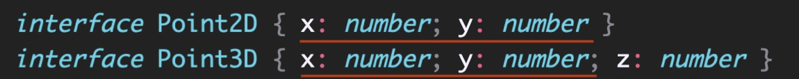

更好的方式：

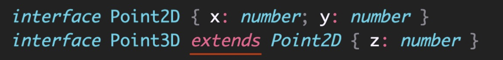

> [!tip]
>
> 使用 **extends（繼承）**關鍵字實現了介面 Point3D 繼承 Point2D，繼承後，Point3D 就有了 Point2D 的所有屬性和方法（此時，Point3D 同時有 x、y、z 三個屬性）

## 元組類型

元組類型是另一種類型的陣列，它確切的知道包含多少個元素，以及特定索引對應的類型，元組和陣列雖然在 JavaScript 運行時都是陣列，但在 TypeScript 的**類型系統**中有重要的區別：

```typescript
// 陣列：長度可變
const colors: string[] = ['red', 'blue', 'green'];
colors.push('yellow'); // ✅ 可以

// 元組：固定長度
const point: [number, number] = [10, 20];
point.push(30); // ⚠️ 編譯時會警告（雖然運行時可以）
```

>[!important]
>
>元組類型可以確切標記出有多少個元素，以及每個位置元素的類型，例如可以用在座標

## 類型推斷

**類型推斷**是指 TypeScript 編譯器能夠**自動推導出變數、函數返回值等的類型**，而不需要明確地寫出類型註解：

* **聲明變數並初始化時**：

  ```typescript
  // 明確標註類型
  let name: string = 'Alice';
  
  // 類型推斷：TypeScript 自動知道 name 是 string
  let name = 'Alice';  // 推斷為 string
  let age = 25;        // 推斷為 number
  let isActive = true; // 推斷為 boolean
  ```

* **函數返回值**：

  ```typescript
  // TypeScript 會推斷返回值類型為 number
  function add(a: number, b: number) {
    return a + b;  // 推斷返回 number
  }
  ```

> [!tip]
>
> 能省略類型註解的地方就省略，充分利用TS類型推論的能力，提升開發效率，如果不知道類型，可以通過滑鼠放在變數名稱上，利用 VSCode 的提示來查看類型

## 類型斷言

當 TypeScript 無法準確推斷類型，但你作為開發者知道確切類型時，就可以使用類型斷言來「強制指定」類型

```typescript
// 方法 1: as 語法 (推薦)
let value: any = "這是一個字串"
let length: number = (value as string).length

// 方法 2: 尖括號語法 (在 JSX 中不能用)
let length2: number = (<string>value).length
```

>[!tip]
>
>方法2會跟React語法有衝突，一律建議使用方法1

*^tab^*

>**DOM操作**
>
>```typescript
>// TypeScript 只知道這可能是 HTMLElement 或 null
>const myInput = document.querySelector('#username')
>
>// ❌ 會報錯,因為 HTMLElement 沒有 value 屬性
>// myInput.value = "test"
>
>// ✅ 使用類型斷言告訴 TS 這是 input 元素
>const myInput2 = document.querySelector('#username') as HTMLInputElement
>myInput2.value = "test"  // 現在可以用了!
>```

> **API 回應資料**
>
> ```typescript
> // TS 只知道這是 any 類型
> const response: any = await fetch('/api/user')
> 
> // 使用斷言指定具體類型
> interface User {
>     name: string
>     age: number
> }
> 
> const userData = response as User
> console.log(userData.name)  // TS 知道有 name 屬性
> ```

> [!tip]
>
> **如何知道標籤的類型？**
>
> 可以在瀏覽器的控制台中使用 `console.dir` 查看他的類型

## 字面量類型

> **問題：為什麼兩個變量的類型不同？**
>
> ```typescript
> let str1 = 'Hello TS'    // 類型: string
> const str2 = 'Hello TS'  // 類型: 'Hello TS'
> ```
>
> * **let 宣告 → 寬鬆類型 (string)**
>   * `str1` 是可變的 (let)，它可以被重新賦值為任何字串
>   * 所以 TypeScript 推斷為 `string` 類型
> * **const 宣告 → 精確類型 (字面量類型)**
>   * `str2` 是不可變的 (const)，它永遠只能是 `'Hello TS'`
>   * 所以 TypeScript 推斷為更精確的字面量類型 `'Hello TS'`

**使用場景**

使用 `|` 符號將多個**具體的值**組合成一個類型，限制變數只能是這些特定值中的一個，例如遊戲中的移動方向只能是上、下、左、右中的任意一個：

```typescript
function changeDirection(direction: 'up' | 'down' | 'left' | 'right') {
    console.log(direction)
}

// ✅ 正確用法
changeDirection('up')
changeDirection('down')
changeDirection('left')
changeDirection('right')

// ❌ 錯誤用法 - TypeScript 會報錯
changeDirection('top')     // 報錯:不在允許的值中
changeDirection('bottom')  // 報錯:不在允許的值中
```

## 列舉類型

列舉是一組**有名字的常數集合**,用來表示一組相關的固定值

```typescript
// 數字列舉 (預設從 0 開始)
enum Direction {
    Up,      // 0
    Down,    // 1
    Left,    // 2
    Right    // 3
}

// 使用
function changeDirection(direction: Direction) {
    console.log(direction)
}

// 使用點語法調用
changeDirection(Direction.Up)
```

> [!tip]
>
> 列舉成員是有值的，默認為從 0 開始自增的數值
>
> 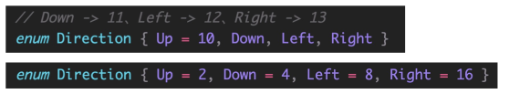
>
> 列舉成員值也可以是字符串類型，字串列舉沒有自增長行為，因此字串列舉的每個成員必須有初始值
>
> 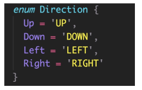

列舉是 TS 為數不多的非 JavaScript 類型級擴展（不僅僅是類型）的特性之一

TypeScript 的功能分兩種：

1. **純類型 (Type-only)** - 只在編譯時存在，編譯後消失
2. **類型+值 (Type + Value)** - 編譯後還會留下 JavaScript 程式碼

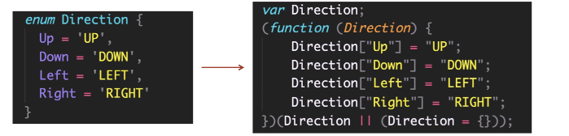

> [!tip]
>
> 列舉與前面講到的字面量類型+聯合類型組合的功能類似，都用來表示一組明確的可選值列表。
> 一般情況下，**推薦使用字面量類型+聯合類型組合的方式**，因為相比列舉這種方式更加直觀、簡潔、高效

## any類型

==不推薦使用 any，使用 `any` 等於**關閉 TypeScript 的類型檢查**==

因為當值的類型為 any 時，可以對該值進行任意操作，並且不會有程式碼提示

```typescript
let value: any = 'hello'
value = 123        // ✅ 可以
value = true       // ✅ 可以
value = []         // ✅ 可以
value.anything()   // ✅ 不會報錯 (但執行時可能出錯!)
```

## typeof

TypeScript 的 `typeof` 比 JavaScript 多了一種用法

* **用法 1：JavaScript 的 typeof (檢查值的類型)**

  ```typescript
  let str = 'hello'
  let num = 123
  
  console.log(typeof str)  // 'string'
  console.log(typeof num)  // 'number'
  
  // 常用於類型檢查
  if (typeof value === 'string') {
      console.log(value.toUpperCase())
  }
  ```

* **用法 2：TypeScript 的 typeof (取得變數的類型定義)**

  ```typescript
  // 先定義一個變數
  let person = {
      name: 'John',
      age: 30,
      email: 'john@example.com'
  }
  
  // 使用 typeof 取得這個變數的類型
  type Person = typeof person
  
  // Person 的類型等同於:
  // type Person = {
  //     name: string
  //     age: number
  //     email: string
  // }
  
  // 現在可以用這個類型
  let anotherPerson: Person = {
      name: 'Mary',
      age: 25,
      email: 'mary@example.com'
  }
  ```

# TypeScripte高級類型

## class類

Class 是物件導向程式設計的核心概念，用來**建立物件的模板**

```typescript
class Person {
  // 屬性 (properties)
  age: number
  gender: string

  // 建構子 (constructor) - 建立物件時執行
  constructor(age: number, gender: string) {
    this.age = age
    this.gender = gender
  }
  
  // 方法 (methods)
  greet() {
    console.log(`哈囉,我今年 ${this.age} 歲,我是 ${this.gender}`)
  }
}

const p = new Person(19, 'male')
console.log(p.age, p.gender)
p.greet()
```

> [!caution]
>
> * 成員初始化（比如，age: number）後，才可以通過 this.age 來訪問實例成員
> * 需要為建構函式指定類型註解，否則會被隱式推斷為 any
> * 建構函式不需要返回值類型


**繼承**

子類別可以繼承父類別的屬性和方法，使用**extends關鍵字**，**JS中也可以使用extends關鍵字**

```typescript
// 父類別 (基類)
class Animal {
  constructor(public name: string) { }

  move(distance: number) {
    console.log(`${this.name} 移動了 ${distance} 公尺`)
  }
}

// 子類別 (衍生類)
class Dog extends Animal {
  constructor(name: string, public breed: string) {
    super(name)  // 呼叫父類別的建構子
  }

  // 新增子類別專屬的方法
  bark() {
    console.log('汪汪!')
  }

}

const dog = new Dog('旺財', '柴犬')
dog.bark()      // 汪汪!
dog.move(10)    // 旺財 移動了 10 公尺
```

**實現介面**

Class 可以實作介面，確保符合特定的結構，使用**implements關鍵字**，**JS中沒有implements關鍵字**

```typescript
// 定義介面
interface Flyable {
    fly(): void
    maxAltitude: number
}

interface Swimmable {
    swim(): void
}

// Class 實作介面
class Duck implements Flyable, Swimmable {
    maxAltitude = 1000

    fly() {
        console.log('鴨子飛起來了!')
    }

    swim() {
        console.log('鴨子在游泳!')
    }
}

// 如果沒有實作介面的所有成員,會報錯
class Penguin implements Flyable {  // ❌ 錯誤
    // 缺少 maxAltitude 和 fly 方法
}
```


# The End<br>*Written by JamesZhan*<br><sub>若是內容有錯誤歡迎糾正 *[<kbd> Email</kbd>](mailto:henry16801@gmail.com?subject="內容錯誤糾正(非錯誤糾正可自行更改標題)")*</sub>