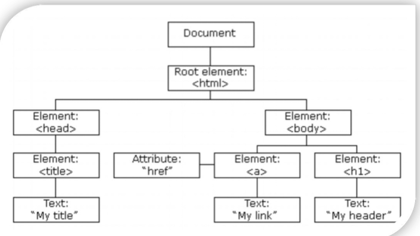

[TOC]

# 什麼是Web API

**Web API**（Web Application Programming Interface）是瀏覽器提供給 JavaScript 的一系列介面和功能，讓我們可以操作瀏覽器環境、DOM、網路請求等等

* **DOM**：**操作瀏覽器本身的功能**
* **BOM**：**操作網頁文件內容**

# 什麼是DOM

**DOM**（Document Object Model，文件物件模型）是瀏覽器將 HTML 文件轉換成 JavaScript 可以操作的**物件樹狀結構**

想像 HTML 是一棟房子的**藍圖**，DOM 就是根據藍圖蓋出來的**實體房子**，而 JavaScript 就是可以進入房子裡**重新裝潢**的工人

---

> **原始 HTML 文件**
>
> ```html
> <!DOCTYPE html>
> <html>
> <head>
>   <title>我的網頁</title>
> </head>
> <body>
>   <h1 id="title">歡迎來到我的網站</h1>
>   <p class="intro">這是一個段落</p>
>   <button onclick="sayHello()">點我</button>
> </body>
> </html>
> ```

> **轉換成 DOM 樹狀結構**
>
> ```html
> Document
> └── html
>     ├── head
>     │   └── title
>     │       └── "我的網頁"
>     └── body
>         ├── h1 (id="title")
>         │   └── "歡迎來到我的網站"
>         ├── p (class="intro")
>         │   └── "這是一個段落"
>         └── button (onclick="sayHello()")
>             └── "點我"
> ```

> [!important]
>
> 文件樹直觀的體現了標籤與標籤之間的關係

## DOM 物件的定義

==**DOM 物件**就是瀏覽器將每個 HTML 元素轉換成的 **JavaScript 物件**==

讓我們可以用程式碼操作網頁元素，可以把每一個的HTML標籤自動都看成是一個JavaScript的物件，網頁所有內容都在document裡面



> [!TIP]
>
> body、head 標籤在HTML中是唯一的， 可以直接使用 `document.body`、`document.head` 直接得到JavaScript物件

## 獲取DOM元素

想要操作某個標籤肯定首先選中這個標籤，跟 CSS選擇器類似，選中標籤才能操作，操作DOM有兩種方式：

* **現代方式（較新的 API）**

  * 選取第一個符合的元素：`querySelector(CSS選擇器)`

    ```html
    <body>
      <div class="test">這是div標籤</div>
      <script>
        const d1 = document.querySelector('div')
        //const d1 = document.querySelector('.test')
        console.log(d1);
      </script>
    </body>
    ```

    > [!note]
    >
    > querySelector**只匹配第一個元素**，**可以直接進行修改操作**
    >
    > 回傳一個 HTMLElement對象，如果沒有匹配到，則返回null

  * 選取所有符合的元素：`querySelectorAll()`

    ```html
    <body>
      <ul>
        <li>test1</li>
        <li>test2</li>
        <li>test3</li>
      </ul>
      <script>
        const d1 = document.querySelectorAll('ul li')
        console.log(d1);
      </script>
    </body>
    ```

    >[!note]
    >
    >querySelectorAll**匹配所有相符元素**，不可以直接修改，需要for循環遍歷
    >
    >回傳一個NodeList物件偽陣列(沒有 pop()、push() 等陣列方法)，如果沒有匹配到，則返回NodeList[]空陣列

* 傳統方式（較舊的 API）

  * getElementById() - 透過 ID 選取
  * getElementsByClassName() - 透過 Class 選取
  * getElementsByTagName() - 透過標籤名稱選取
  * getElementsByName() - 透過 name 屬性選取

## 操作元素內容

DOM對象都是根據標籤生成的，所以操作標籤本質上就是操作DOM對象，使用的點語法：

* 物件.innerText 屬性

  ```html
  <body>
    <div class="test">測試</div>
    <script>
      const d1 = document.querySelector('div')
      console.log(d1.innerText);
      d1.innerText = '修改值'
      // d1.innerHTML = '<strong>修改值</strong>'  純文字顯示不會解析標籤
    </script>
  </body>
  ```

* 物件.innerHTML 屬性

  ```html
  <body>
    <div class="test">測試</div>
    <script>
      const d1 = document.querySelector('div')
      console.log(d1.innerHTML);
      d1.innerHTML = '<strong>修改值</strong>'
    </script>
  </body>
  ```

> [!TIP]
>
> `元素.innerHTML` 屬性能識別文字，也能夠解析標籤，如果不知道要用哪一個，可以直接選擇innerHTML

## 操作元素屬性

可以透過：

```javascript
物件.屬性 = 值
```

修改常見的屬性href、title、src 等

```html
<body>
  
  <script>
    const p1 = document.querySelector('img')
    // 更換圖片
    p1.src = './image/02.jpg'
    p1.title = 'test'
  </script>
</body>
```

## 修改元素樣式

可以透過：

* 通過 style 屬性操作CSS

  ```javascript
  物件.style.樣式屬性 = 值
  ```

  ```html
  <!DOCTYPE html>
  <html lang="en">
  
  <head>
    <meta charset="UTF-8">
    <meta name="viewport" content="width=device-width, initial-scale=1.0">
    <title>dom</title>
    <style>
      div {
        width: 300px;
        height: 300px;
        background-color: pink;
      }
    </style>
  </head>
  
  <body>
    <div></div>
    <script>
      div = document.querySelector('div')
      div.style.width = '500px'
      // div.style.background-color = "black"
      div.style.backgroundColor = "black"
    </script>
  </body>
  
  </html>
  ```

  > [!caution]
  >
  > * 如果屬性有**-連接符**，需要轉換為**小駝峰命名法**
  > * 賦值的時候，要加css單位

* 操作類名(className) 操作CSS

* 通過 classList 操作類控制CSS


