---
title:前端開發學習筆記-WebAPI
vlook-doc-lib:
- [筆記網站跳轉](index.html?target=_self "快速挑轉到想要的網頁")
- [前端開發學習筆記★HTML](web_HTML.html?target=_self "網頁開發學習筆記★HTML")
- [前端開發學習筆記★CSS](web_CSS.html?target=_self "網頁開發學習筆記★CSS")
- [前端開發學習筆記★JS](web_JS.html?target=_self "網頁開發學習筆記★JS")
- [前端開發學習筆記★WebAPI](web_WebAPI.html?target=_self "網頁開發學習筆記★JS")
- [前端開發學習筆記★AJAX](web_AJAX.html?target=_self "網頁開發學習筆記★JS")
- [前端開發學習筆記★React](web_React.html?target=_self "網頁開發學習筆記★React")
---


[TOC]

# 什麼是Web API

**Web API**（Web Application Programming Interface）是瀏覽器提供給 JavaScript 的一系列介面和功能，讓我們可以操作瀏覽器環境、DOM、網路請求等等

* **DOM**：**操作瀏覽器本身的功能**
* **BOM**：**操作網頁文件內容**

# 什麼是DOM

**DOM**（Document Object Model，文件物件模型）是瀏覽器將 HTML 文件轉換成 JavaScript 可以操作的**物件樹狀結構**

想像 HTML 是一棟房子的**藍圖**，DOM 就是根據藍圖蓋出來的**實體房子**，而 JavaScript 就是可以進入房子裡**重新裝潢**的工人

---

> **原始 HTML 文件**
>
> ```html
> <!DOCTYPE html>
> <html>
> <head>
>   <title>我的網頁</title>
> </head>
> <body>
>   <h1 id="title">歡迎來到我的網站</h1>
>   <p class="intro">這是一個段落</p>
>   <button onclick="sayHello()">點我</button>
> </body>
> </html>
> ```

> **轉換成 DOM 樹狀結構**
>
> ```html
> Document
> └── html
>     ├── head
>     │   └── title
>     │       └── "我的網頁"
>     └── body
>         ├── h1 (id="title")
>         │   └── "歡迎來到我的網站"
>         ├── p (class="intro")
>         │   └── "這是一個段落"
>         └── button (onclick="sayHello()")
>             └── "點我"
> ```

> [!important]
>
> 文件樹直觀的體現了標籤與標籤之間的關係

## DOM 物件的定義

==**DOM 物件**就是瀏覽器將每個 HTML 元素轉換成的 **JavaScript 物件**==

讓我們可以用程式碼操作網頁元素，可以把每一個的HTML標籤自動都看成是一個JavaScript的物件，網頁所有內容都在document裡面


> [!TIP]
>
> body、head 標籤在HTML中是唯一的， 可以直接使用 `document.body`、`document.head` 直接得到JavaScript物件

## 獲取DOM元素

想要操作某個標籤肯定首先選中這個標籤，跟 CSS選擇器類似，選中標籤才能操作，操作DOM有兩種方式：

* **現代方式（較新的 API）**

  * 選取第一個符合的元素：`querySelector(CSS選擇器)`

    ```html
    <body>
      <div class="test">這是div標籤</div>
      <script>
        const d1 = document.querySelector('div')
        //const d1 = document.querySelector('.test')
        console.log(d1);
      </script>
    </body>
    ```

    > [!note]
    >
    > querySelector**只匹配第一個元素**，**可以直接進行修改操作**
    >
    > 回傳一個 HTMLElement對象，如果沒有匹配到，則返回null

  * 選取所有符合的元素：`querySelectorAll()`

    ```html
    <body>
      <ul>
        <li>test1</li>
        <li>test2</li>
        <li>test3</li>
      </ul>
      <script>
        const d1 = document.querySelectorAll('ul li')
        console.log(d1);
      </script>
    </body>
    ```

    >[!note]
    >
    >querySelectorAll**匹配所有相符元素**，不可以直接修改，需要for循環遍歷
    >
    >回傳一個NodeList物件偽陣列(沒有 pop()、push() 等陣列方法)，如果沒有匹配到，則返回NodeList[]空陣列

* 傳統方式（較舊的 API）

  * getElementById() - 透過 ID 選取
  * getElementsByClassName() - 透過 Class 選取
  * getElementsByTagName() - 透過標籤名稱選取
  * getElementsByName() - 透過 name 屬性選取

## 操作元素內容

DOM對象都是根據標籤生成的，所以操作標籤本質上就是操作DOM對象，使用的點語法：

* 物件.innerText 屬性

  ```html
  <body>
    <div class="test">測試</div>
    <script>
      const d1 = document.querySelector('div')
      console.log(d1.innerText);
      d1.innerText = '修改值'
      // d1.innerHTML = '<strong>修改值</strong>'  純文字顯示不會解析標籤
    </script>
  </body>
  ```

* 物件.innerHTML 屬性

  ```html
  <body>
    <div class="test">測試</div>
    <script>
      const d1 = document.querySelector('div')
      console.log(d1.innerHTML);
      d1.innerHTML = '<strong>修改值</strong>'
    </script>
  </body>
  ```

> [!TIP]
>
> `元素.innerHTML` 屬性能識別文字，也能夠解析標籤，如果不知道要用哪一個，可以直接選擇innerHTML

## 操作元素屬性

可以透過：

```javascript
物件.屬性 = 值
```

修改常見的屬性href、title、src 等

```html
<body>
  
  <script>
    const p1 = document.querySelector('img')
    // 更換圖片
    p1.src = './image/02.jpg'
    p1.title = 'test'
  </script>
</body>
```

## 修改元素樣式

可以透過：

* **通過 style 屬性操作CSS**

  ```javascript
  物件.style.樣式屬性 = 值
  ```

  ```html
  <!DOCTYPE html>
  <html lang="en">
  
  <head>
    <meta charset="UTF-8">
    <meta name="viewport" content="width=device-width, initial-scale=1.0">
    <title>dom</title>
    <style>
      div {
        width: 300px;
        height: 300px;
        background-color: pink;
      }
    </style>
  </head>
  
  <body>
    <div></div>
    <script>
      div = document.querySelector('div')
      div.style.width = '500px'
      // div.style.background-color = "black"
      div.style.backgroundColor = "black"
    </script>
  </body>
  
  </html>
  ```

  > [!caution]
  >
  > * 如果CSS屬性有**-連接符**，需要轉換為**小駝峰命名法**
  > * 賦值的時候，要加CSS單位

* **操作類名(className) 操作CSS**

  如果修改的樣式比較多，直接通過style屬性修改比較繁瑣，我們可以通過CSS類名的形式

  ```javascript
  物件.classname = 'CSS類名' 
  ```

  ```html
  <!DOCTYPE html>
  <html lang="en">
  
  <head>
    <meta charset="UTF-8">
    <meta name="viewport" content="width=device-width, initial-scale=1.0">
    <title>dom</title>
    <style>
      .test {
        width: 300px;
        height: 300px;
        background-color: pink;
      }
  
      .red {
        color: red;
      }
    </style>
  </head>
  
  <body>
    <div>123</div>
    <script>
      div = document.querySelector('div')
      div.className = 'test red'
    </script>
  </body>
  
  </html>
  ```

  > [!caution]
  >
  > * 由於class是關鍵字，所以使用className去代替
  > * className是使用**新值換舊值**，如果需要新增一個類，需要保留之前的類名

* **通過 classList 操作類控制CSS(推薦)**_~Rd~_

  為了解決className 容易覆蓋以前的類名，我們可以通過classList方式追加和刪除類名

  * add() - 添加類別

    ```javascript
    element.classList.add('new-class');
    element.classList.add('class1', 'class2', 'class3'); // 一次添加多個
    ```

  * remove() - 移除類別

    ```javascript
    element.classList.remove('old-class');
    element.classList.remove('class1', 'class2'); // 一次移除多個
    ```

  * toggle() - 切換類別

    ```javascript
    element.classList.toggle('active'); // 如果有就移除，沒有就添加
    ```

## 修改表單屬性

表單很多情況也需要修改屬性，比如點選眼睛可以看到密碼，本質是把密碼類型轉換為文字

```javascript
表單.value = '表單值'
表單.type = '表單類型'
```

```html
<!DOCTYPE html>
<html lang="en">

<head>
  <meta charset="UTF-8">
  <meta name="viewport" content="width=device-width, initial-scale=1.0">
  <title>dom</title>
  <style>

  </style>
</head>

<body>
  <input type="password" value="123" />
</body>
<script>
  text = document.querySelector('input')
  text.type = 'text'
  text.value = '321'
</script>

</html>
```

表單屬性中新增效果、移除效果，一律使用布林值表示，比如： disabled、checked、selected

* true ：代表新增了該屬性
* false： 代表移除了該屬性

```html
<!DOCTYPE html>
<html lang="en">

<head>
  <meta charset="UTF-8">
  <meta name="viewport" content="width=device-width, initial-scale=1.0">
  <title>dom</title>
  <style>

  </style>
</head>

<body>
  <input type="checkbox" value="123" />
</body>
<script>
  text = document.querySelector('input')
  // console.log(text.checked)
  text.checked = true
</script>

</html>
```

> [!caution]
>
> true是布林值，不是字串，**不要加雙引號**

## 自定義屬性

因為HTML 標準屬性有限，當我們需要儲存更多資訊時又想要有統一的格式就會使用自定義屬性

* **標準屬性**：標籤天生自帶的屬性，比如class、id、title等，可以直接使用點語法操作比如： disabled、checked、selected
* **自定義屬性**：在html5中推出專門的 `data-` 自訂屬性，在標籤上一律以data-開頭，DOM物件上一律以 `dataset` 對象方式獲取

```html
<!DOCTYPE html>
<html lang="en">

<head>
  <meta charset="UTF-8">
  <meta name="viewport" content="width=device-width, initial-scale=1.0">
  <title>dom</title>
</head>

<body>
  <div data-id="1">1</div>
  <div data-id="2">2</div>
  <div data-id="3">3</div>
  <div data-id="4">4</div>
  <div data-id="5">5</div>
</body>
<script>
  data = document.querySelector('div')
  console.log(data.dataset.id); // 1
</script>

</html>
```

# 事件監聽

事件是程式設計中的一個基本概念，代表**在程式執行過程中發生的特定動作或狀況**，程式可以透過**事件監聽機制來偵測這些事件的發生**，並**執行相對應的處理函數來回應**用戶的操作或系統的變化，從而實現**互動式和響應式**的程式行為

語法：

```javascript
物件.addEventListener('事件類型', 要執行的函數)
```

事件監聽三要素：

* **事件源**：  那個dom元素被事件觸發了，要獲取dom元素   

* **事件類型**： 用什麼方式觸發，比如滑鼠點選 click、滑鼠經過 mouseover 等

  | 事件分類       | 事件名稱     | 觸發時機     | 常用場景             | 程式碼範例                                        |
  | -------------- | ------------ | ------------ | -------------------- | ------------------------------------------------- |
  | **🖱️ 鼠標事件** | `click`      | 鼠標點擊     | 按鈕點擊、連結導航   | `element.addEventListener('click', handler)`      |
  | :              | `mouseenter` | 鼠標經過     | 懸停效果、提示顯示   | `element.addEventListener('mouseenter', handler)` |
  | :              | `mouseleave` | 鼠標離開     | 隱藏提示、恢復狀態   | `element.addEventListener('mouseleave', handler)` |
  | **🎯 焦點事件** | `focus`      | 獲得焦點     | 輸入框激活、高亮顯示 | `input.addEventListener('focus', handler)`        |
  | :              | `blur`       | 失去焦點     | 驗證輸入、保存數據   | `input.addEventListener('blur', handler)`         |
  | **⌨️ 鍵盤事件** | `keydown`    | 鍵盤按下觸發 | 快捷鍵、即時響應     | `element.addEventListener('keydown', handler)`    |
  | :              | `keyup`      | 鍵盤抬起觸發 | 輸入完成檢測         | `element.addEventListener('keyup', handler)`      |
  | **📝 文本事件** | `input`      | 用戶輸入事件 | 即時搜索、表單驗證   | `input.addEventListener('input', handler)`        |

* **事件呼叫的函數**： 要做什麼事

```html
<!DOCTYPE html>
<html lang="en">

<head>
  <meta charset="UTF-8">
  <meta name="viewport" content="width=device-width, initial-scale=1.0">
  <title>事件監聽</title>
</head>

<body>
  <button>click me</button>
</body>
<script>
  const btn = document.querySelector('button')
  btn.addEventListener('click', () => {
    alert('clicked')
  })
</script>

</html>
```

*[<kbd> 隨機點名  </kbd>](#隨機點名)*

## 事件監聽版本

* **DOM L0**：事件源.on事件 = function() { }

  ```javascript
  button.onclick = function() {
    console.log('第一個處理函數');
  };
  
  button.onclick = function() {
    console.log('第二個處理函數');
  };
  
  // 點擊按鈕只會輸出：第二個處理函數
  // 第一個被覆蓋了！
  ```

* **DOM L2**：事件源.addEventListener(事件， 事件處理函數)

  ```javascript
  button.addEventListener('click', function() {
    console.log('第一個處理函數');
  });
  
  button.addEventListener('click', function() {
    console.log('第二個處理函數');
  });
  
  // 點擊按鈕會輸出：
  // 第一個處理函數
  // 第二個處理函數
  // 兩個都會執行！✅
  ```

>[!tip]
>
>on方式會被覆蓋，addEventListener方式可以多次綁定，擁有事件更多特性，推薦使用

|     特性     | DOM L0 (on方式) | DOM L2 (addEventListener) |
| :----------: | :-------------: | :-----------------------: |
| **重複綁定** |   ❌ 會被覆蓋    |      ✅ 可以綁定多次       |
| **事件特性** |   ❌ 功能有限    |        ✅ 功能完整         |
|  **相容性**  |  ✅ 所有瀏覽器   |       ✅ 現代瀏覽器        |
|  **靈活性**  |     ❌ 較低      |          ✅ 較高           |
|  **推薦度**  |    ❌ 不推薦     |      ✅ **強烈推薦**       |

|      等級       | 年份  |     特色      |      事件處理      |
| :-------------: | :---: | :-----------: | :----------------: |
| **DOM Level 0** | 1990s | 最早期的 DOM  |   `on事件` 屬性    |
| **DOM Level 1** | 1998  | 基本 DOM 結構 |    沒有事件規範    |
| **DOM Level 2** | 2000  | 加入事件模型  | `addEventListener` |
| **DOM Level 3** | 2004  | 擴展事件類型  |    更多事件類型    |
| **DOM Level 4** | 2015+ | 現代 DOM API  |     持續演進中     |

## 事件物件

**事件物件**是當事件被觸發時，瀏覽器自動創建並傳遞給事件處理函數的一個**包含事件詳細資訊的物件**

- 🎯 **事件類型** (什麼事件)
- 📍 **事件目標** (發生在哪個元素)
- ⏰ **事件時間** (什麼時候發生)
- 📊 **事件詳情** (滑鼠位置、按鍵等)

```javascript
element.addEventListener('click', function(e) {
    // 這個 e 就是事件對象！
    console.log(event); // 包含了事件的所有資訊
});
```

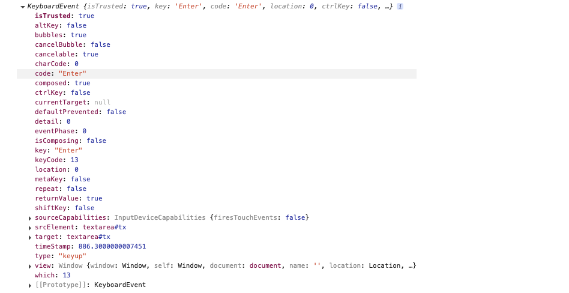

常用屬性：

|    屬性分類    |     屬性名稱      |                   描述                   | 適用事件類型 |        實際應用場景        |
| :------------: | :---------------: | :--------------------------------------: | :----------: | :------------------------: |
| **📋 基本屬性** |      `type`       |            獲取當前的事件類型            |   所有事件   |   判斷事件類型、條件處理   |
| **🖱️ 滑鼠座標** | `clientX/clientY` | 獲取光標相對於瀏覽器可見窗口左上角的位置 |   滑鼠事件   |   跟隨滑鼠效果、拖拽功能   |
| **🎯 元素座標** | `offsetX/offsetY` |  獲取光標相對於當前DOM元素左上角的位置   |   滑鼠事件   |  元素內精確定位、繪圖應用  |
| **⌨️ 鍵盤輸入** |       `key`       |           用戶按下的鍵盤鍵的值           |   鍵盤事件   | 快捷鍵、表單驗證、遊戲控制 |

*[<kbd> 評論字數統計  </kbd>](#評論字數統計)*

## 環境物件this

**`this`** 是 JavaScript 中的一個**特殊關鍵字**，它指向**當前執行環境的對象**。`this` 的值會根據**函數被調用的方式**而動態改變

```javascript
// this 就像是一個「代名詞」
// 它指向「誰在執行這個函數」

function test() {
  console.log(this);
}
test()
// window.tesst()

// 當函數獨立調用時，this 會採用「默認綁定」規則，指向window
```

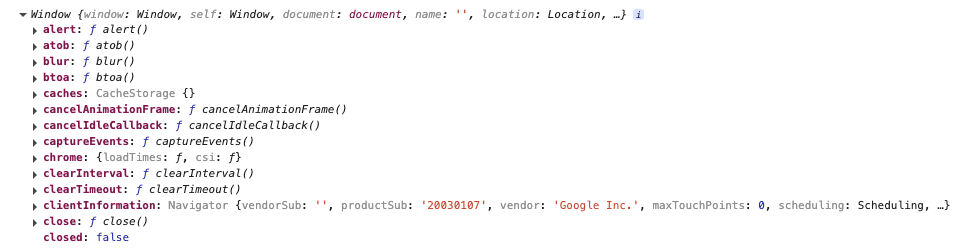

```javascript
const btn = document.querySelector('button')
btn.addEventListener('click', function () {
  console.log(this);
})
```

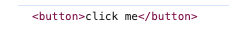

>[!important]
>
>* **誰呼叫， this 就是誰**
>* 直接呼叫函數，其實相當於是 window.函數，所以 this 指 window
>* **箭頭函數沒有this**

## 回調函數

**回調函數**是一個**作為參數傳遞給另一個函數**的函數，並在**特定時機被調用**

* 設定定時器，當時間一到就會觸發某個函數
* 觸發事件時，執行某函數

```javascript
// 回調函數就是「稍後調用」的函數
function greet(name, callback) {
  console.log('Hello ' + name);
  callback(); // 在這裡調用回調函數
}

function sayGoodbye() {
  console.log('Goodbye!');
}

// sayGoodbye 就是回調函數
greet('Alice', sayGoodbye);
// 輸出：
// Hello Alice
// Goodbye!
```

>[!tip]
>
>* 回呼函數本質還是函數，只不過把它當成參數使用
>* 使用匿名函數做為回呼函數比較常見

# 事件流

==事件流（Event Flow）是指當事件發生時，事件在 DOM 樹中傳播的機制和順序==

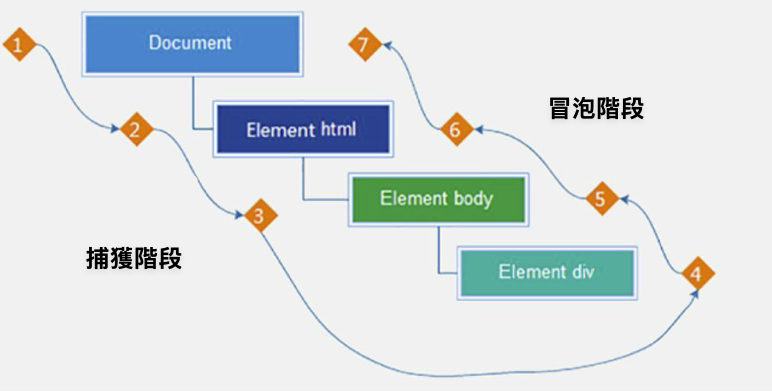

在網頁上點擊一個元素時，這個點擊事件不是只在那個元素上發生，而是會在整個 DOM 樹中「旅行」。這個旅行的路徑和順序就叫做**事件流**

## 事件捕獲

- **方向**：從父到子（從DOM的根元素開始去執行對應的事件）
- **特點**：事件從最外層的 Document 開始，一層層向下傳遞到同名事件的目標元素
- **使用頻率**：較少使用捕獲機制

```javascript
DOM.addEventListener(事件類型, 事件處理函數, 是否使用捕獲機制)

// addEventListener第三個參數傳入 true 代表是捕獲階段觸發（很少使用）
// 若是用 L0 事件監聽，則只有冒泡階段，沒有捕獲
```

```html
<!DOCTYPE html>
<html lang="en">

<head>
  <meta charset="UTF-8">
  <meta name="viewport" content="width=device-width, initial-scale=1.0">
  <title>事件流</title>
  <style>
    .father {
      width: 500px;
      height: 500px;
      background-color: pink;
    }

    .son {
      width: 200px;
      height: 200px;
      background-color: purple;
    }
  </style>
</head>

<body>
  <div class="father">
    <div class="son"></div>
  </div>

  <script>
    document.addEventListener('click', function () {
      alert('我是爺爺')
    }, true)

    document.querySelector('.father').addEventListener('click', function () {
      alert('我是爸爸')
    }, true)
    document.querySelector('.son').addEventListener('click', function () {
      alert('我是兒子')
    }, true)
  </script>
</body>

</html>
```

> [!tip]
>
> ```javascript
> document.addEventListener('click', function () {
>       alert('我是爺爺')
>     }, true)
> ```
>
> 不寫默認是false，冒泡事件

## 事件冒泡

- **方向**：從子到父（一個元素觸發事件後，會依次向上呼叫所有父級元素的**同名事件**）
- **特點**：事件從目標元素開始，一層層向上冒泡到最外層
- **使用頻率**：**這是主要使用的階段**

```html
<!DOCTYPE html>
<html lang="en">

<head>
  <meta charset="UTF-8">
  <meta name="viewport" content="width=device-width, initial-scale=1.0">
  <title>事件流</title>
  <style>
    .father {
      width: 500px;
      height: 500px;
      background-color: pink;
    }

    .son {
      width: 200px;
      height: 200px;
      background-color: purple;
    }
  </style>
</head>

<body>
  <div class="father">
    <div class="son"></div>
  </div>

  <script>
    document.addEventListener('click', function () {
      alert('我是爺爺')
    })

    document.querySelector('.father').addEventListener('click', function () {
      alert('我是爸爸')
    })
    document.querySelector('.son').addEventListener('click', function () {
      alert('我是兒子')
    })
  </script>
</body>

</html>
```

## 阻止冒泡

**阻止冒泡**就是阻止事件繼續向上層父元素傳播的機制。當你在某個元素上阻止冒泡後，事件就會「停在這裡」，不會再往上傳遞給父元素

```javascript
button.addEventListener('click', function(e) {
  console.log('處理按鈕點擊');
  event.stopPropagation(); // 事件到此為止
});
```

> [!important]
>
> 阻止冒泡一定要拿到事件物件 e，此方法可以阻斷事件流動傳播，不光在冒泡階段有效，捕獲階段也有效

```html
<!DOCTYPE html>
<html lang="en">

<head>
  <meta charset="UTF-8">
  <meta name="viewport" content="width=device-width, initial-scale=1.0">
  <title>事件流</title>
  <style>
    .father {
      width: 500px;
      height: 500px;
      background-color: pink;
    }

    .son {
      width: 200px;
      height: 200px;
      background-color: purple;
    }
  </style>
</head>

<body>
  <div class="father">
    <div class="son"></div>
  </div>

  <script>
    document.addEventListener('click', function (e) {
      alert('我是爺爺')
      e.stopPropagation()
    }, true)

    document.querySelector('.father').addEventListener('click', function () {
      alert('我是爸爸')
    }, true)
    document.querySelector('.son').addEventListener('click', function () {
      alert('我是兒子')
    }, true)
  </script>
</body>

</html>
```

## 阻止默認行為

每個HTML元素在特定事件發生時都有自己的「預設動作」，而 `preventDefault()` 就是用來取消這些預設動作

```html
<!-- 連結的預設行為：跳轉頁面 -->
<a href="https://google.com">點我會跳轉到 Google</a>

<!-- 表單的預設行為：提交並刷新頁面 -->
<form action="/submit">
  <input type="text" name="username">
  <button type="submit">提交會刷新頁面</button>
</form>
```

> [!important]
>
> 以上這些標籤，都會有預設的事件，例如可以在資料驗證和處理之前先阻止默認行為
>
> |        方法         |        作用        |  影響範圍  |
> | :-----------------: | :----------------: | :--------: |
> | `preventDefault()`  | 阻止元素的預設行為 |  當前元素  |
> | `stopPropagation()` |  阻止事件冒泡傳播  | 父子元素間 |

```javascript
// 阻止連結跳轉
document.querySelector('a').addEventListener('click', function(event) {
  event.preventDefault(); // 不會跳轉了！
  console.log('連結被點擊，但不跳轉');
});

// 阻止表單提交
document.querySelector('form').addEventListener('submit', function(event) {
  event.preventDefault(); // 不會提交和刷新頁面！
  console.log('表單被提交，但頁面不刷新');
});
```


## 解綁事件

移除之前添加的事件監聽器，讓元素不再響應特定的事件，解綁事件的方法取決於事件使用哪一種方式來綁定(L0, L2)

* **傳統on註冊（L0）**：
  * 同一個物件，後面註冊的事件會覆蓋前面註冊(同一個事件)
  * 直接使用null覆蓋就可以實現事件的解綁
* **事件監聽註冊（L2）**：
  * 後面註冊的事件不會覆蓋前面註冊的事件(同一個事件)
  * 必須使用removeEventListener(事件類型, 事件處理函數, 獲取捕獲或者冒泡階段)
  * 匿名函數無法被解綁

*^tab^*

> **傳統on註冊（L0）**
>
> ```html
> <!DOCTYPE html>
> <html lang="en">
> 
> <head>
>   <meta charset="UTF-8">
>   <meta name="viewport" content="width=device-width, initial-scale=1.0">
>   <title>事件流</title>
> </head>
> 
> <body>
>   <button>click</button>
>   <script>
>     const btn = document.querySelector('button')
>     btn.onclick = function () {
>       alert("button clicked")
>       btn.onclick = null  // L0：直接使用 null 覆蓋
>     }
>   </script>
> </body>
> 
> </html>
> ```

> **事件監聽註冊（L2）**
>
> ```html
> <!DOCTYPE html>
> <html lang="en">
> 
> <head>
>   <meta charset="UTF-8">
>   <meta name="viewport" content="width=device-width, initial-scale=1.0">
>   <title>事件流</title>
> </head>
> 
> <body>
>   <button>click</button>
>   <script>
>     const btn = document.querySelector('button')
>     function fn() {
>       alert('btn clicked')
>     }
>     btn.addEventListener('click', fn)
>     btn.removeEventListener('click', fn) // 必須使用removeEventListener
>   </script>
> </body>
> 
> </html>
> ```

## 事件委託

**事件委託**（Event Delegation）是一種利用**事件冒泡機制**的編程技巧。不直接在子元素上綁定事件，而是在父元素上監聽事件，然後根據事件的目標元素來決定如何處理

---

> **傳統作法**
>
> ```markdown
> ❌ 每張桌子都配一個服務員
> 桌子1：服務員A 👨‍💼
> 桌子2：服務員B 👩‍💼
> 桌子3：服務員C 👨‍💼
> ...
> 
> 問題：
> - 需要很多服務員（成本高）
> - 有些桌子沒客人，服務員閒置
> - 新桌子要重新分配服務員
> ```

> **事件委託**
>
> ```markdown
> ✅ 一個總服務員巡視全場
> - 客人舉手 🙋‍ → 服務員看到 → 過去服務
> - 不管是老桌子還是新加的桌子
> - 一個人就能處理整個餐廳
> 
> 優勢：
> - 人力成本低
> - 反應靈活
> - 新桌子自動有服務

```html
<!DOCTYPE html>
<html lang="en">

<head>
  <meta charset="UTF-8">
  <meta name="viewport" content="width=device-width, initial-scale=1.0">
  <title>事件委託</title>
</head>

<body>
  <ul>
    <li>我是第1個li</li>
    <li>我是第2個li</li>
    <li>我是第3個li</li>
    <li>我是第4個li</li>
    <li>我是第5個li</li>
    <p>我是p標籤不變色</p>
  </ul>
  <script>
    const ul = document.querySelector('ul')
    ul.addEventListener('click', function (e) { // 透過事件物件得到當前點擊的對象
      if (e.target.tagName === 'LI') { // 只有li標籤能變色
        e.target.style.color = 'red'
      }
    })
  </script>
</body>

</html>
```

## 頁面加載事件

頁面加載事件（Page Load Events）是指在網頁載入過程中觸發的各種事件，這些事件讓開發者能夠在特定的載入階段執行相應的 JavaScript 代碼

> [!note]
>
> * 有些時候需要等頁面資源全部處理完了做一些事情
> * 程式碼喜歡把 script 寫在 head 中，這時候直接找 dom 元素找不到

可以使用：

* load：

  ```javascript
  window.addEventListener('load', function() {
    console.log('頁面完全載入完成');
    // 所有資源都已載入完成
  });
  ```

* DOMContentLoaded

  ```javascript
  document.addEventListener('DOMContentLoaded', function() {
    console.log('DOM 已完全載入和解析');
    // 可以安全地操作 DOM 元素
  });
  ```

|   比較項目   |                **load**                 |                 **DOMContentLoaded**                 |
| :----------: | :-------------------------------------: | :--------------------------------------------------: |
| **觸發時機** |           頁面完全載入完成時            |                DOM 已完全載入和解析時                |
| **等待資源** | 等待所有資源（圖片、CSS、JS、iframe等） |               僅等待 HTML 文檔解析完成               |
| **觸發速度** |                  較慢                   |                         較快                         |
| **適用場景** |    需要確保所有資源都載入完成的操作     |           可以安全地操作 DOM 元素的初始化            |
| **事件對象** |                `window`                 |                      `document`                      |
| **語法示例** | `window.addEventListener('load', ...)`  | `document.addEventListener('DOMContentLoaded', ...)` |

## 頁面滾動事件

頁面滾動事件（Scroll Events）是指當用戶滾動網頁或特定元素時觸發的事件，讓開發者能夠根據滾動行為執行相應的 JavaScript 代碼

> [!note]
>
> 很多網頁需要檢測使用者把頁面滾動到某個區域後做一些處理， 比如固定導覽列，比如返回頂部，想要頁面滾動一段距離，比如100px，就讓某些元素顯示隱藏

```javascript
// 監聽整個頁面滾動
window.addEventListener('scroll', function() {
  console.log('頁面正在滾動');
  console.log('滾動位置:', window.scrollY);
});

// 監聽特定元素滾動
const container = document.querySelector('.scrollable-container');
container.addEventListener('scroll', function() {
  console.log('容器正在滾動');
});
```

---

> 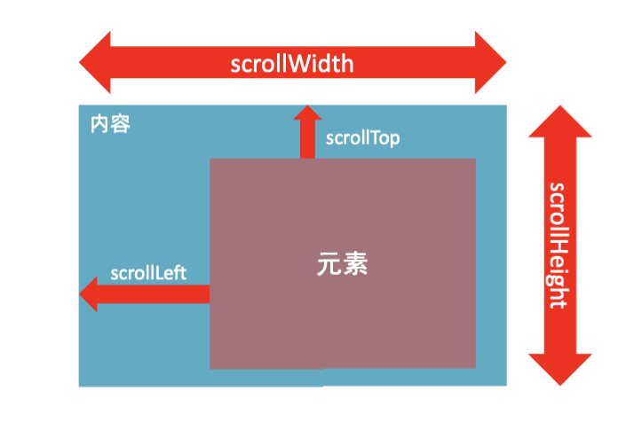

>**屬性說明**
>
>元素.scrollLeft和元素.scrollTop （屬性）
>
>* 獲取被捲去的大小
>* 獲取元素內容往左、往上滾出去看不到的距離
>* 這兩個值是可讀寫的

**scrollTo() 方法可把內容滾動到指定的坐標**

* 元素.scrollTo(x, y)

```javascript
window.scrollTo(0, 0)

// 綁定按鈕事件
document.querySelector('#back-to-top').addEventListener('click', scrollTo(0, 0));
```

## 頁面尺寸事件

頁面尺寸事件是當瀏覽器視窗大小發生變化時觸發的 JavaScript 事件，讓開發者能夠監聽和響應視窗尺寸的改變

- 用戶手動調整瀏覽器視窗大小
- 設備方向改變（手機橫豎屏切換）
- 瀏覽器進入/退出全螢幕模式

```javascript
// 基本的尺寸變化事件監聽
window.addEventListener('resize', function() {
    console.log('視窗尺寸已改變');
});
```

**clientWidth、clientHeight獲取元素寬高**

* 獲取元素的可見部分寬高（**不包含邊框，margin，滾動條**等）
* clientWidth和clientHeight

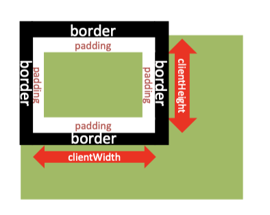

```html
<!DOCTYPE html>
<html lang="en">

<head>
  <meta charset="UTF-8">
  <meta name="viewport" content="width=device-width, initial-scale=1.0">
  <title>頁面尺寸事件</title>
  <style>
    div {
      width: 200px;
      height: 200px;
      background-color: pink;
      margin: 30px;
    }
  </style>
</head>

<body>
  <div>這個是div標籤</div>
  <script>
    const div = document.querySelector('div')
    console.log(div.clientWidth)
  </script>
</body>

</html>
```

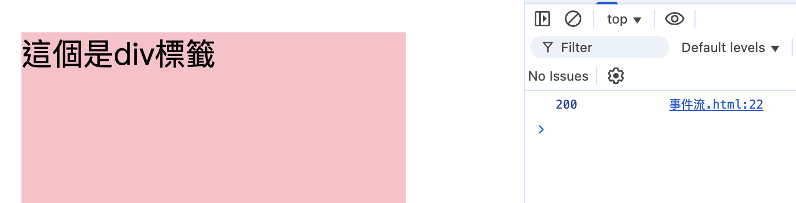

> [!note]
>
> 若是想知道元素的大小並且**包含邊框的話就要使用offsetWidth**
>
> |      屬性       |        包含內容         |                 計算公式                 |         用途         |  返回值   |
> | :-------------: | :---------------------: | :--------------------------------------: | :------------------: | :-------: |
> | **clientWidth** |     內容 + padding      |   `width + paddingLeft + paddingRight`   | 獲取元素內部可用空間 | 整數 (px) |
> | **offsetWidth** | 內容 + padding + border | `clientWidth + borderLeft + borderRight` |   獲取元素完整寬度   | 整數 (px) |

**offsetLeft、coffsetTop獲取元素位置**

* 獲取元素距離自己定位**父級元素**的左、上距離
* offsetLeft和offsetTop  注意是**唯讀屬性**
* 這個屬性可以讓我們知道距離父元素的距離，實現滾動到某一個位置時，做出先對應的事件

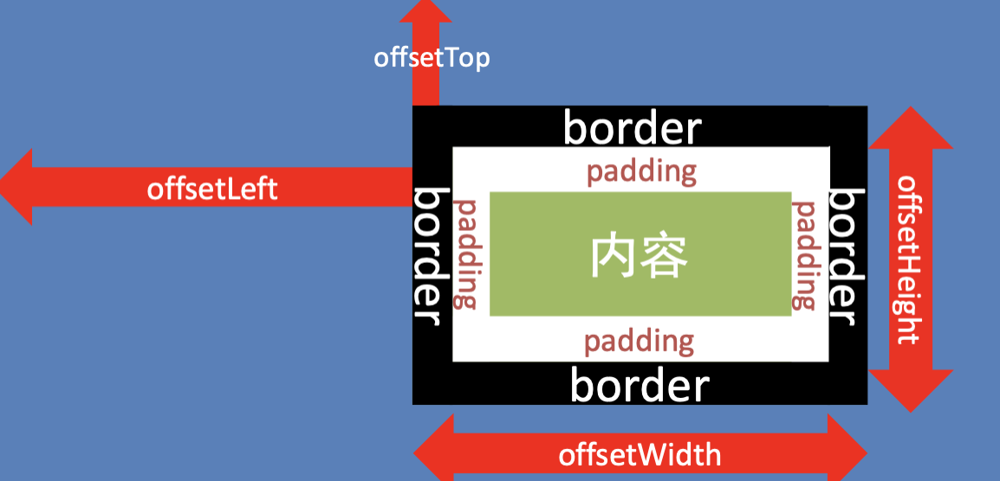

*[<kbd> 固定導航欄  </kbd>](#固定導航欄)*

# 練習

## 隨機點名

* 點選開始按鈕隨機抽取陣列的一個資料，放到頁面中
* 點選結束按鈕刪除陣列當前抽取的一個資料
* 當抽取到最後一個資料的時候，兩個按鈕同時停用（寫點開始裡面，只剩最後一個資料不用抽了）

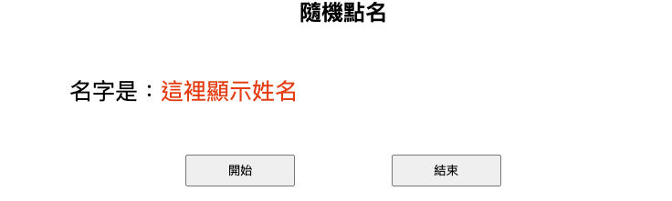

```html
<!DOCTYPE html>
<html lang="en">

<head>
  <meta charset="UTF-8">
  <meta name="viewport" content="width=device-width, initial-scale=1.0">
  <title>Document</title>
  <style>
      * {
          margin: 0;
          padding: 0;
      }

      h2 {
          text-align: center;
      }

      .box {
          width: 600px;
          margin: 50px auto;
          display: flex;
          font-size: 25px;
          line-height: 40px;
      }

      .qs {

          width: 450px;
          height: 40px;
          color: red;

      }

      .btns {
          text-align: center;
      }

      .btns button {
          width: 120px;
          height: 35px;
          margin: 0 50px;
      }
  </style>
</head>

<body>
  <h2>隨機點名</h2>
  <div class="box">
      <span>名字是：</span>
      <div class="qs">這裡顯示姓名</div>
  </div>
  <div class="btns">
      <button class="start">開始</button>
      <button class="end">結束</button>
  </div>

  <script>
      // 資料陣列
      const arr = ['馬超', '黃忠', '趙雲', '關羽', '張飛']
      const content = document.querySelector('.qs')
      let timer = 0
      let random = 0

      // 開始按鍵
      const start = document.querySelector('.start')
      start.addEventListener('click', () => {
          timer = setInterval(() => {
              random = parseInt(Math.random() * arr.length)
              content.innerHTML = arr[random]
          }, 50)

          if (arr.length === 1) {
              start.disabled = true
              end.disabled = true
          }
      })

      // 結束按鍵
      const end = document.querySelector('.end')
      end.addEventListener('click', () => {
          clearInterval(timer)

          // 抽選到的要刪除
          arr.splice(random, 1)
          console.log(arr);

      })
  </script>
</body>

</html>
```

## 評論字數統計

* 點擊textarea時，顯示字數總計：離開textarea時，隱藏字數總計
* 檢測輸入事件，並統計字數
* 按下Enter發布評論，並清空textarea

```html
<!DOCTYPE html>
<html lang="en">

<head>
  <meta charset="UTF-8">
  <meta http-equiv="X-UA-Compatible" content="IE=edge">
  <meta name="viewport" content="width=device-width, initial-scale=1.0">
  <title>評論回車發佈</title>
  <style>
    .wrapper {
      min-width: 400px;
      max-width: 800px;
      display: flex;
      justify-content: flex-end;
    }

    .wrapper textarea {
      outline: none;
      border-color: transparent;
      resize: none;
      background: #f5f5f5;
      border-radius: 4px;
      flex: 1;
      padding: 10px;
      transition: all 0.5s;
      height: 30px;
    }

    .wrapper textarea:focus {
      border-color: #e4e4e4;
      background: #fff;
      height: 50px;
    }

    .wrapper button {
      background: #00aeec;
      color: #fff;
      border: none;
      border-radius: 4px;
      margin-left: 10px;
      width: 70px;
      cursor: pointer;
    }

    .wrapper .total {
      margin-right: 80px;
      color: #999;
      margin-top: 5px;
      opacity: 0;
      transition: all 0.5s;
    }

    .list {
      min-width: 400px;
      max-width: 800px;
      display: flex;
    }

    .list .item {
      width: 100%;
      display: flex;
    }

    .list .item .info {
      flex: 1;
      border-bottom: 1px dashed #e4e4e4;
      padding-bottom: 10px;
    }

    .list .item p {
      margin: 0;
    }

    .list .item .name {
      color: #FB7299;
      font-size: 14px;
      font-weight: bold;
    }

    .list .item .text {
      color: #333;
      padding: 10px 0;
    }

    .list .item .time {
      color: #999;
      font-size: 12px;
    }
  </style>
</head>

<body>
  <div class="wrapper">
    <textarea id="tx" placeholder="發一條友善的評論" rows="2" maxlength="200"></textarea>
    <button>發佈</button>
  </div>
  <div class="wrapper">
    <span class="total">0/200字</span>
  </div>
  <div class="list">
    <div class="item" style="display: none;">
      <div class="info">
        <p class="name">清風徐來</p>
        <p class="text">大家都辛苦啦，感謝各位大大的努力，能圓滿完成真是太好了[笑哭][支援]</p>
        <p class="time">2022-10-10 20:29:21</p>
      </div>
    </div>
  </div>
  <script>
    const text = document.querySelector('#tx')
    const total = document.querySelector('.total')
    const item = document.querySelector('.item')
    const infoText = document.querySelector('.text')


    // 點擊textarea時，顯示/隱藏字數總計
    text.addEventListener('focus', () => {
      total.style.opacity = 1
    })
    text.addEventListener('blur', () => {
      total.style.opacity = 0
    })

    // 檢測輸入事件
    tx.addEventListener('input', () => {
      total.innerHTML = `${tx.value.length}/200字`
    })

    // 按下Enter發布評論  
    tx.addEventListener('keyup', (e) => {
      if (e.key === 'Enter') {
        // 輸入不為空才顯示和輸出
        if (tx.value.trim()) {
          item.style.display = 'block'
          infoText.innerHTML = tx.value
        }
        // 清空textarea 復原統計
        tx.value = ''
        total.innerHTML = '0/200字'
      }
    })
  </script>
</body>


</html>
```

## Tab欄切換

* 滑鼠經過不同的選項卡，底部可以顯示不同的內容
* 移除非當前類active，並添加active到當前鼠標上指到的物件

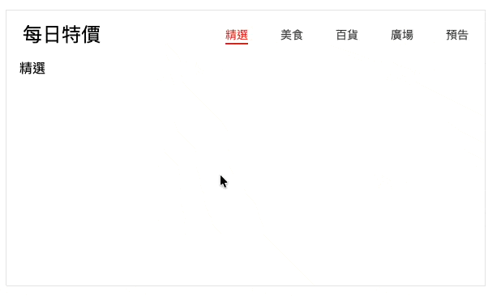

```html
<!DOCTYPE html>
<html lang="en">

<head>
  <meta charset="UTF-8" />
  <meta http-equiv="X-UA-Compatible" content="IE=edge" />
  <meta name="viewport" content="width=device-width, initial-scale=1.0" />
  <title>tab欄切換</title>
  <style>
    * {
      margin: 0;
      padding: 0;
    }

    .tab {
      width: 590px;
      height: 340px;
      margin: 20px;
      border: 1px solid #e4e4e4;
    }

    .tab-nav {
      width: 100%;
      height: 60px;
      line-height: 60px;
      display: flex;
      justify-content: space-between;
    }

    .tab-nav h3 {
      font-size: 24px;
      font-weight: normal;
      margin-left: 20px;
    }

    .tab-nav ul {
      list-style: none;
      display: flex;
      justify-content: flex-end;
    }

    .tab-nav ul li {
      margin: 0 20px;
      font-size: 14px;
    }

    .tab-nav ul li a {
      text-decoration: none;
      border-bottom: 2px solid transparent;
      color: #333;
    }

    .tab-nav ul li a.active {
      border-color: #e1251b;
      color: #e1251b;
    }

    .tab-content {
      padding: 0 16px;
    }

    .tab-content .item {
      display: none;
    }

    .tab-content .item.active {
      display: block;
    }
  </style>
</head>

<body>
  <div class="tab">
    <div class="tab-nav">
      <h3>每日特價</h3>
      <ul>
        <li><a class="active" href="javascript:;">精選</a></li>
        <li><a href="javascript:;">美食</a></li>
        <li><a href="javascript:;">百貨</a></li>
        <li><a href="javascript:;">廣場</a></li>
        <li><a href="javascript:;">預告</a></li>
      </ul>
    </div>
    <div class="tab-content">
      <div class="item active">精選</div>
      <div class="item">美食</div>
      <div class="item">百貨</div>
      <div class="item">廣場</div>
      <div class="item">預告</div>
    </div>
  </div>
  <script>
    const as = document.querySelectorAll('.tab-nav a')

    // 導航欄
    for (let i = 0; i < as.length; i++) {
      as[i].addEventListener('mouseenter', function () {
        // 移除active
        document.querySelector('.tab-nav .active').classList.remove('active')
        document.querySelector('.tab-content .active').classList.remove('active')
        // 使用this 添加active到該物件
        this.classList.add('active')
        document.querySelector(`.tab-content .item:nth-child(${i + 1})`).classList.add('active')
      })
    }
  </script>
</body>

</html>
```

## 固定導航欄

需求：當頁面滾動到秒殺模組，導覽列自動滑入，否則滑出

* 用到頁面滾動事件
* 檢測頁面滾動大於等於 秒殺模組的位置 則滑入，否則滑出
* 主要移動的是秒殺模組的頂部位置

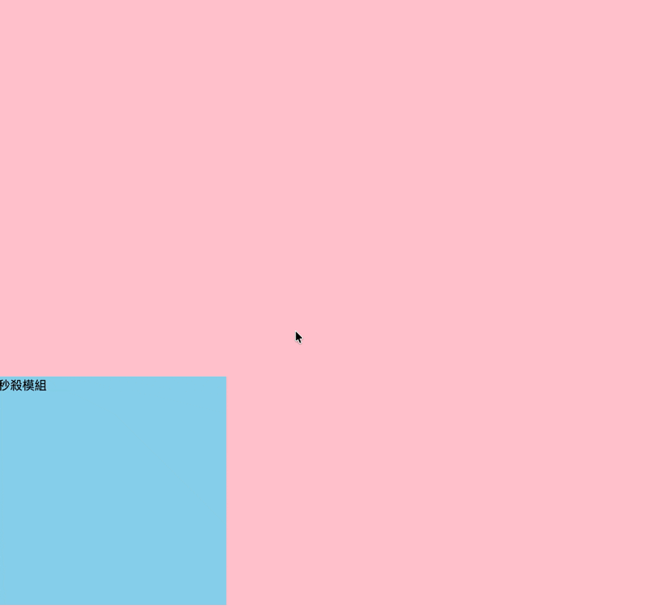

```html
<!DOCTYPE html>
<html lang="en">

<head>
  <meta charset="UTF-8">
  <meta http-equiv="X-UA-Compatible" content="IE=edge">
  <meta name="viewport" content="width=device-width, initial-scale=1.0">
  <title>Document</title>
  <style>
    * {
      margin: 0;
      padding: 0;
      box-sizing: border-box;
    }

    .content {
      overflow: hidden;
      width: 1000px;
      height: 3000px;
      background-color: pink;
      margin: 0 auto;
    }

    .backtop {
      display: none;
      width: 50px;
      left: 50%;
      margin: 0 0 0 505px;
      position: fixed;
      bottom: 60px;
      z-index: 100;
    }

    .backtop a {
      height: 50px;
      width: 50px;
      background: url(./images/bg2.png) 0 -600px no-repeat;
      opacity: 0.35;
      overflow: hidden;
      display: block;
      text-indent: -999em;
      cursor: pointer;
    }

    .header {
      position: fixed;
      top: -80px;
      left: 0;
      width: 100%;
      height: 80px;
      background-color: purple;
      text-align: center;
      color: #fff;
      line-height: 80px;
      font-size: 30px;
      transition: all .3s;
    }

    .sk {
      width: 300px;
      height: 300px;
      background-color: skyblue;
      margin-top: 500px;
    }
  </style>
</head>

<body>
  <div class="header">我是頂部導覽列</div>
  <div class="content">
    <div class="sk">秒殺模組</div>
  </div>
  <div class="backtop">
    <a href="javascript:;"></a>
  </div>
  <script>
    const sk = document.querySelector('.sk')
    const header = document.querySelector('.header')
    // 頁面滾動事件
    window.addEventListener('scroll', function () {
      // 頁面被捲去的頭部 >= 秒殺模組的位置offsetTop
      const scroll = document.documentElement.scrollTop
      header.style.top = scroll >= sk.offsetTop ? 0 : '-80px'
    })
  </script>
</body>

</html>
```


