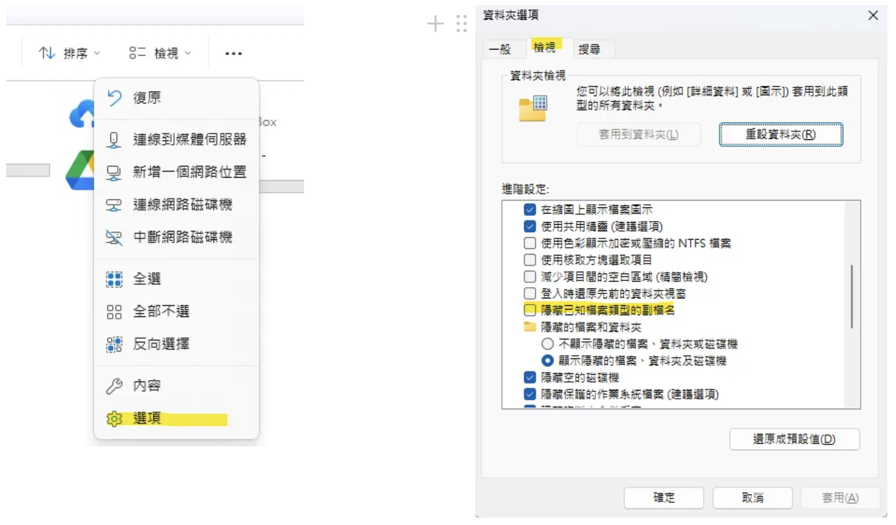

---
title:網頁開發學習筆記
vlook-doc-lib:
- [快速的筆記網站跳轉](index.html?target=_self "快速挑轉到想要的網頁")
- [網頁開發學習筆記](web_dev.html?target=_self "test")

---

######  ~VLOOK™~ *[<kbd> VLOOK </kbd>](https://github.com/MadMaxChow/VLOOK)*<br>網頁開發學習筆記<br>──<br><u>簡介</u><br>*本篇筆記是使用[<kbd> Typora</kbd>](https://typora.io/)及[<kbd> Markdown</kbd>](https://markdown.tw/)<br>結合GitHub開源模版撰寫而成並導出成HTML*<br>**JamesZhan**<br>*不允許複製下載`僅供閱覽`* *版本日期`2025年5月31日`*

[TOC]

# 什麼是web前端

前端開發，主要的職責就是將資料以好看的樣式呈現出來。說白了，就是開發網頁

* 網頁由哪些部分組成 ?
    * 文字、圖片、音訊、視訊、超連結、表格等等
* 我們看到的網頁，背後的本質是什麼 ?
    * 前端程式設計師寫的前端程式碼 
* 前端的程式碼是如何轉換成使用者眼中的網頁的 ?
    * 通過瀏覽器解析和渲染成使用者看到的網頁
    * 瀏覽器中對程式碼進行解析和渲染的部分，稱為**瀏覽器核心**

市面上的瀏覽器非常多，比如：IE、Firefox、safari、GoogleChrome等等。 而且我們電腦上安裝的瀏覽器可能都不止一個

但是**不同的瀏覽器核心不同，對於相同的前端程式碼解析的效果也會存在差異**。 因此會造成一個問題，同一段前端程式，不同瀏覽器展示出來的效果是不一樣的，這個使用者體驗就很差了。而我們想達到的效果則是，即使使用者使用的是不同的瀏覽器，解析同一段前端程式碼，最終展示出來的效果都是相同的。
要想達成這樣一個目標，我們就需要定義一個統一的**web標準**

## web標準

**Web標準**也稱為**網頁標準**，由一系列的標準組成，大部分由W3C（ World Wide Web Consortium，全球資訊網協會）負責制定。由三個組成部分：

*[<kbd> W3C  </kbd>](https://www.w3.org/)*

* **HTML**：負責網頁的==結構==（頁面元素和內容）
* **CSS**：負責網頁的==表現==（頁面元素的外觀、位置等頁面樣式，如：顏色、大小等）
* **JavaScript**：負責網頁的==行為==（互動效果）

# 什麼是HTML

HTML: **H**yper**T**ext **M**arkup **L**anguage，超文字標記語言

*[<kbd> mdn  web docs  </kbd>](https://developer.mozilla.org/zh-TW/docs/Web/HTML)*

* 超文字：超越了文字的限制，比普通文字更強大，除了文字資訊，還可以定義圖片、音訊、視訊等內容
* 標記語言：由標籤` <標籤名> `構成的語言
    - HTML標籤都是預定義好的 。例如：使用 `<h1>` 標籤展示標題，使用`<a>`展示超連結，使用``展示圖片，`<video>`展示視訊
    - HTML程式碼直接在瀏覽器中運行，HTML標籤由瀏覽器解析 


## 如何建立HTML

*^tab^*

> **建立文件**
>
> 滑鼠右鍵 -> 新增文字文件 -> 更改檔案類型為.html
>
> > [!caution]
> >
> > 如果建立完HTML文件後依然是文字文件格式，需要將系統中隱藏已知文件類型取消勾選
> >
> > 

> **編寫HTML架構**
>
> *==HTML結構==*
>
> ```html
> <html>
>      <head>
>           <title>HTML 快速入門</title>
>      </head>
>      <body>
>                 
>      </body>
> </html>
> ```
>
> 其中`<html>`是根標籤，`<head>`和`<body>`是子標籤
>
> * `<head>` : 定義網頁的頭部，用來存放給瀏覽器看的資訊，如：CSS樣式、網頁的標題
> * `<body>` : 定義網頁的主體部分，存放給使用者看的資訊，也是網頁的主體內容，如：文字、圖片、視訊、音訊、表格等

> **在`<body>`中編寫HTML的核心內容**
>
> *==body核心內容==*
>
> ```html
> <html>
>      <head>
>         <title>HTML 快速入門</title>
>      </head>
>      <body>
>         <h1>Hello HTML</h1>
>         
>      </body>
> </html>
> ```

> **程式碼下載**
>
> *[<kbd> 01.  HTML快速入門 </kbd>](web_dev.assets/code/第二章.zip)*

# The End<br>*Written by JamesZhan*<br><sub>若是內容有錯誤歡迎糾正 *[<kbd> Email</kbd>](mailto:henry16801@gmail.com?subject="內容錯誤糾正(非錯誤糾正可自行更改標題)")*</sub>