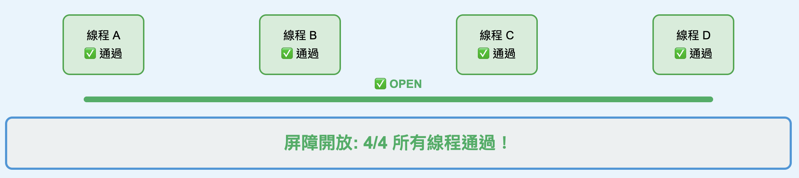

###### ~VLOOK™~ *[<kbd> VLOOK </kbd>](https://github.com/MadMaxChow/VLOOK)*<br>Python學習筆記-多執行緒<br>──<br><u>簡介</u><br>*本篇筆記是使用[<kbd> Typora</kbd>](https://typora.io/)及[<kbd> Markdown</kbd>](https://markdown.tw/)<br>結合GitHub開源模版撰寫而成並導出成HTML*<br>**JamesZhan**<br>*不允許複製下載`僅供閱覽`* *版本日期`2025年6月27日`*

[TOC]

# 專有名詞解釋

雙擊點開一個應用程式圖示時，作業系統會把這個程式從硬碟載入到記憶體中，然後開始執行它，這時候就產生了一個程序

比如說：

- 你的電腦裡有一個「記事本.exe」檔案 → 這是**程式**，他是**靜態**_~Rd~_的
- 當你開啟記事本，它開始運作時 → 這就是**程序**，他是**動態**_~Rd~_的


## 處理程序(process)

==一個程式可以產生多個程序（進程），每個獨⽴執⾏的程序都可稱為⼀個處理程序，也是**資源擁有的基本單位**==

打開記事本，就會啟動了⼀個處理程序，作業系統就會為該處理程序分配記憶體空
間，當我們又打開了一個程式，作業系統一樣會為他啟動一個處理程序，並分配記憶體空間

程序就像是一個「獨立的工作空間」，它有自己專屬的記憶體區域，不會和其他程序搞混。每個程序都有自己的生命週期，會經歷「誕生、工作、結束」的過程

而且一個程式可以同時開啟多次，產生多個程序。就像你可以同時開啟好幾個記事本視窗，每個視窗都是一個獨立的程序


## 執行緒(thread)

==執行緒(線程)是由處理程序建立，是處理程序的⼀個實體，一個處理程序可以有多個執行緒，也是**調度和分派的基本單位**==

* 單執行緒 : 同⼀個時刻，只允許執⾏⼀個執行緒 
* 多執行緒 : 同⼀個時刻，可以執⾏多個執行緒

> [!note]
>
> 當你開啟一個**瀏覽器程序**時：
>
> - **線程1**：處理使用者點擊（響應你的操作）
> - **線程2**：下載網頁內容（背景下載）
> - **線程3**：渲染網頁畫面（顯示內容）
> - **線程4**：播放影片（如果有的話）
>
> 這些工作同時進行，讓瀏覽器可以一邊下載內容，一邊響應你的操作，不會卡住

* 並發：**一個人同時處理多件事，但在任何時刻只做一件事**，看起來在同時做很多事，但實際上在任何一個瞬間，只做一件事
* 並行：**多個人真的在同一時間做不同的事**

> [!note]
>
> 並發+並行是同時存在的
>
> - 4核心 CPU（並行）
> - 每個核心同時處理多個線程（並發）

一個進程在執行過程中，可以產生多個線程，形成多條執行線索。每條線索，也就是每個線程，都有它自身完整的生命歷程，包括產生、存在和消亡的過程。這就像一個大型工廠（進程）裡面有多條生產線（線程），每條生產線都有自己的啟動、運作和停止的週期

進程可以共享操作系統的資源一樣，線程間也可以共享進程中的某些記憶體單元，但是線程與進程有一個重要的不同之處：==線程的中斷與恢復可以更加節省系統的開銷==。這是因為==線程之間共享了大部分的記憶體空間==，所以當系統需要在不同線程間切換時，不需要像進程切換那樣進行大量的記憶體映射和資源重新分配

> [!IMPORTANT]
>
> 執行緒的開銷是遠遠低於處理程序的開銷，但是==線程不是越多越好==，對於⼀個CPU⽽⾔，同⼀時刻只能執⾏⼀個任務。同⼀時間段內，如果執行緒過多，每個執行緒被分到的時間就變少了。


# 單執行緒

在設計程式的時候，通常會為⼀個程式設計多個執行緒，不會讓⼀個執行緒佔據系統所有資源，因為：

* **耗時操作**： 如果只有單線程處理耗時任務，整個程式會被阻塞
* **並行處理不同任務**：多個任務可以同時進行，而不需要排隊等待
* **充分利用硬體資源**：可以同時使用多個核心，提高整體效能

單執行緒有以下幾個特色：


* ⼀個處理程序中只有⼀條執⾏路徑
* 可以分析出該程序是如何執⾏的，因為他會依照先後順序執行

```python
class test_thread:
    def __init__(self, name):
        self.name = name

    # 定義線程運行函數
    def run(self):
        for i in range(3):
            print(f"{self.name} is running {i}")


if __name__ == "__main__":
    print("main thread start")
    
    thread = test_thread("Test-1")
    thread.run()
    
    thread2 = test_thread("Test-2")
    thread2.run()
    
    for i in range(3):
        print(f"main thread is running {i}")
    
    print("main thread end")
    
"""
main thread start
Test-1 is running 0
Test-1 is running 1
Test-1 is running 2
Test-2 is running 0
Test-2 is running 1
Test-2 is running 2
main thread is running 0
main thread is running 1
main thread is running 2
main thread end
"""
```

> [!caution]
>
> 如果今天的 `run` 方法是一個耗時的操作，那之後的程式碼可能都有等待第一個完成之後才能被執行，體驗感會很差

# 多執行緒

==在python中使用多線程要先導入threading套件==


處理程序運作時會現建立主線程，可以使用threading套件建立子線程，主線程是處理程序的入口也是出口

* `active_count（）` ： 返回當前處於活動狀態的執行緒個數
* `current_thread（）` ： 返回當前的Thread對象
* `main_thread（）` ： 返回主執行緒對象。 主執行緒是Python直譯器啟動的執行緒

```python
import threading

t1 = threading.current_thread()
print(t1, id(t1))

t2 = threading.main_thread()
print(t2, id(t2))

count = threading.active_count()
print(f'{count=}')

"""
<_MainThread(MainThread, started 8537087744)> 4338908000
<_MainThread(MainThread, started 8537087744)> 4338908000
count=1
"""
```

> [!note]
>
> - `t1` 和 `t2` 的 **id 相同** (4338908000)
> - `current_thread()` 和 `main_thread()` 返回的是**同一個物件及ID**及ID，說明這段程式碼是在**主線程**中執行的，如果沒有子線程的話，所有程式都是在主線程執行

多執行緒特性 : **亂序執⾏**，多執行緒的任務中是沒有辦法分析執⾏流程的(執⾏流程是由作業系統的cpu調⽤決定的)

```python
import threading
import time

def thread_run():
    # 死循環來測試線程
    t_name = threading.current_thread().name
    while True:
        print(f'{t_name} thread is running')
        time.sleep(1)

        
        
if __name__ == '__main__':
    # 子線程1
    t1 = threading.Thread(target=thread_run)
    t1.start()
    
    # 子線程2
    t2 = threading.Thread(target=thread_run)
    t2.start()
    
    # 主線程
    while True:
        print(f'{threading.current_thread().name} 主線程 is running')
        time.sleep(1)
        
"""
亂序輸出
Thread-1 (thread_run) thread is running
Thread-2 (thread_run) thread is running
MainThread 主線程 is running
MainThread 主線程 is running
Thread-1 (thread_run) thread is running
Thread-2 (thread_run) thread is running
MainThread 主線程 is running
Thread-1 (thread_run) thread is running
Thread-2 (thread_run) thread is running
Thread-1 (thread_run) thread is running
MainThread 主線程 is running
Thread-2 (thread_run) thread is running
Thread-1 (thread_run) thread is running
MainThread 主線程 is running
Thread-2 (thread_run) thread is running
MainThread 主線程 is running
Thread-1 (thread_run) thread is running
Thread-2 (thread_run) thread is running
MainThread 主線程 is running
"""
```


## 傳遞參數

設計多執行緒最重要的概念是，各執行緒間不要使⽤相同的變數，每個執行緒最好使⽤本身的局部變數，這可以避免變數值相互⼲擾

*==Thread()原碼==*

```python
def __init__(self, group=None, target=None, name=None, args=(), kwargs=None, *, daemon=None):
```

> [!caution]
>
> 若是要傳遞局部變量給線程`args=()`，必須使用元組(turple)的資料型態，**若是元組只有單個元素，一定要使用逗號**
>
> ```python
> t1 = ('白雪公主') 
> print(t1, type(t1))
> 
> t2 = ('白雪公主', ) 
> print(t2, type(t2))
> 
> """
> 白雪公主 <class 'str'>
> ('白雪公主',) <class 'tuple'>
> """
> ```
>
> 

```python
import threading
import time

def thread_run(movie_name):
    t = threading.current_thread()
    
    # 死循環來測試線程
    while True:
        print(f'{t.name} thread is downloading {movie_name}')
        time.sleep(1)
        
if __name__ == '__main__':
            
    # 傳遞參數一定要用tuple
    t1 = threading.Thread(target=thread_run, args=('movie1',))
    t1.start()

    t2 = threading.Thread(target=thread_run, args=('movie2',))
    t2.start()

    t3 = threading.Thread(target=thread_run, args=('movie3',))
    t3.start()
    
    while True:
        print(f"{threading.current_thread().name} 與使用者互動的主線程")
        time.sleep(1)
        
"""
Thread-1 (thread_run) thread is downloading movie1
Thread-2 (thread_run) thread is downloading movie2
Thread-3 (thread_run) thread is downloading movie3
MainThread 與使用者互動的主線程
Thread-3 (thread_run) thread is downloading movie3
Thread-2 (thread_run) thread is downloading movie2
Thread-1 (thread_run) thread is downloading movie1
MainThread 與使用者互動的主線程
Thread-1 (thread_run) thread is downloading movie1
Thread-3 (thread_run) thread is downloading movie3
Thread-2 (thread_run) thread is downloading movie2
MainThread 與使用者互動的主線程
"""
```

## daemon執行緒

在**預設情況下，所有的執行緒皆不是 Daemon 執行緒** (可以翻譯為守護執行緒)

如果⼀個程序建⽴了主執行緒和其它⼦執行緒，在所有執行緒⼯作結束後，程序才會結束。因為主執行緒若是先結束，將退回所有佔據的資源給作業系統，此時⼦執行緒仍在執⾏將會因為沒有資源造成程式當掉

設置daemon執行緒有兩種方式：

1. `t1.daemon = True`：建立完執行緒再宣告
2. `t1 = threading.Thread(target=thread_run, daemon=True`：建立時直接宣告

比較有無daemon執行緒：

---

> **無daemon執行緒**
>
> 主程序結束，線程還會繼續執行，前面的程式都是無daemon執行緒的
>
> ```python
> import threading
> import time
> 
> def thread_run(movie_name):
>     t = threading.current_thread()
>     
>     # 死循環來測試線程
>     while True:
>         print(f'{t.name} thread is downloading {movie_name}')
>         time.sleep(1)
>         
> if __name__ == '__main__':
>             
>     # 傳遞參數一定要用tuple
>     t1 = threading.Thread(target=thread_run, args=('movie1',))
>     t1.start()
> 
>     t2 = threading.Thread(target=thread_run, args=('movie2',))
>     t2.start()
> 
>     t3 = threading.Thread(target=thread_run, args=('movie3',))
>     t3.start()
>     
>     while True:
>         print(f"{threading.current_thread().name} 與使用者互動的主線程")
>         time.sleep(1)
> 
> ```
>
> 

> **有daemon執行緒**
>
> 主程序結束，其他子線程會直接停止
>
> ```python
> import threading
> import time
> 
> def thread_run(movie_name):
>     t = threading.current_thread()
>     
>     # 死循環來測試線程
>     while True:
>         print(f'{t.name} thread is downloading {movie_name}')
>         time.sleep(1)
>         
> if __name__ == '__main__':
>             
>     # 傳遞參數一定要用tuple
>     t1 = threading.Thread(target=thread_run, args=('movie1',), daemon=True)
>     # t1.daemon = True # 設定為守護線程，主線程結束後，守護線程也會結束
>     t1.start()
> 
>     t2 = threading.Thread(target=thread_run, args=('movie2',), daemon=True)
>     t2.start()
> 
>     t3 = threading.Thread(target=thread_run, args=('movie3',), daemon=True)
>     t3.start()
>     
>     # while True:
>     #     print(f"{threading.current_thread().name} 與使用者互動的主線程")
>     #     time.sleep(1)
> 
> ```

## join阻塞主線程

主執行緒在⼯作時，如果想要安插⼀個⼦執行緒進來，可以使⽤ `join()`，這時安插進來的⼦執行緒可以先⼯作，直到所邀請的⼦執行緒結束主執行緒才開始⼯作

主要作用：

- 讓主線程等待子線程完成工作
- 確保線程執行的順序性
- 防止程式過早結束

*==join方法(無for循環)==*

```python
import threading
import time

def thread_run(movie_name):
    t = threading.current_thread()
    
    # 模擬耗時操作
    for i in range(5):
        print(f'{t.name} thread is downloading {movie_name}')
        time.sleep(1)
        
if __name__ == '__main__':
            
    # 傳遞參數一定要用tuple
    t1 = threading.Thread(target=thread_run, args=('movie1',), name='下載電影1')
    t1.start()

    t2 = threading.Thread(target=thread_run, args=('movie2',), name='下載電影2')
    t2.start()

    t3 = threading.Thread(target=thread_run, args=('movie3',), name='下載電影3')
    t3.start()
    
    # 需求：主執行緒要等待⼦執行緒執⾏完畢後, 才能繼續向後執⾏
    # 讓⼦執行緒插隊 join()
    # 使用join()會對當前線程進行阻塞，直到⼦執行緒執⾏完畢後，才能繼續向後執⾏
    t1.join()
    t2.join()
    t3.join()
    
    print(f"{threading.current_thread().name} 與使用者互動的主線程")
    
"""
下載電影1 thread is downloading movie1
下載電影2 thread is downloading movie2
下載電影3 thread is downloading movie3
下載電影3 thread is downloading movie3
下載電影2 thread is downloading movie2
下載電影1 thread is downloading movie1
下載電影1 thread is downloading movie1
下載電影3 thread is downloading movie3
下載電影2 thread is downloading movie2
下載電影1 thread is downloading movie1
下載電影3 thread is downloading movie3
下載電影2 thread is downloading movie2
下載電影3 thread is downloading movie3
下載電影1 thread is downloading movie1
下載電影2 thread is downloading movie2
MainThread 與使用者互動的主線程
"""

```

> [!note]
>
> 若是下載同時需要多達幾十個執行緒，每次都需要重複寫建立執行緒及使用 `join()` 方法太麻煩，可以使用for循環替代

*==join方法(for循環)==*

```python
import threading
import time
from typing import List

def thread_run(movie_name):
    t = threading.current_thread()
    
    # 模擬耗時操作
    for i in range(5):
        print(f'{t.name} thread is downloading {movie_name}')
        time.sleep(1)
        
if __name__ == '__main__':
    
    # 建立一個線程的list，並指定線程的型態為threading.Thread
    threads: List[threading.Thread] = []
    # 建立一個電影名稱的元組
    movie_names = ('movie1', 'movie2', 'movie3') 
   
    for movie_name in movie_names:
        # 建立線程
        t = threading.Thread(target=thread_run, args=(movie_name,), name=f'下載電影{movie_name}')
        # 將線程加入list
        threads.append(t)
        # 啟動線程
        t.start()

    # 主執行緒要等待⼦執行緒執⾏完畢後, 才能繼續向後執⾏
    # 使用join()會對當前線程進行阻塞，直到⼦執行緒執⾏完畢後，才能繼續向後執⾏
    for thread in threads:
        thread.join()
    
    # 主執行緒繼續執行
    
    print(f"{threading.current_thread().name} 與使用者互動的主線程")
    
"""
下載電影movie1 thread is downloading movie1
下載電影movie2 thread is downloading movie2
下載電影movie3 thread is downloading movie3
下載電影movie2 thread is downloading movie2
下載電影movie1 thread is downloading movie1
下載電影movie3 thread is downloading movie3
下載電影movie2 thread is downloading movie2
下載電影movie3 thread is downloading movie3
下載電影movie1 thread is downloading movie1
下載電影movie3 thread is downloading movie3
下載電影movie1 thread is downloading movie1
下載電影movie2 thread is downloading movie2
下載電影movie3 thread is downloading movie3
下載電影movie2 thread is downloading movie2
下載電影movie1 thread is downloading movie1
MainThread 與使用者互動的主線程
"""

```

## 線程停止

指在多線程程式中，主動終止正在執行的線程的過程

**Python 沒有強制停止線程的方法**！`threading` 模組沒有提供直接「殺死」線程的方法，這是為了避免資源洩漏和數據不一致的問題，因使可以使用其他方法解決

*  使用標誌位（Flag）控制

    ```python
    import threading
    import time
    
    # 建立全局變量的哨兵值
    isrunning = True
    
    def thread_run():
        t = threading.current_thread()
        
        while isrunning:
            print('工作線程執行中')
            time.sleep(1)
        
        print("⼯作執行緒執⾏完畢了!!!")
            
    def thread_stop():
        global isrunning
        
        while isrunning:
            command = input("請輸入指令:")
            if command == 'stop':
                isrunning = False
            else:
                print(f"{command=}")
            
    if __name__ == '__main__':
                
        working_thread = threading.Thread(target=thread_run, name='工作線程')
        working_thread.start()
        
        stop_thread = threading.Thread(target=thread_stop, name='停止線程')
        stop_thread.start()
        
        print("主線程執行完畢")
    
    """
    工作線程執行中
    請輸入指令:主線程執行完畢
    工作線程執行中
    工作線程執行中
    工作線程執行中
    st工作線程執行中
    op工作線程執行中
    
    ⼯作執行緒執⾏完畢了!!!
    """
    ```

    > [!note]
    >
    > 可以看到stop指令被截斷，但是不影響輸出結果，因為一開始建立了兩個子線程，所以就算在輸入指令的時候其他線程同時在工作也是互不影響
    
## 自定義線程

`threading.Thread` 是 `threading` 模組內的⼀個類，我們也可以⾃⾏設計⼀個類，讓這個類繼承 `threading.Thread` 類， 這個概念就稱⾃⾏定義執行

實際建立過程：

1. 建立一個自定義類，並且繼承`threading.Thread` 

2. 如圖中的規定，必須先初始化 `super().__init__()`

    

3. 複寫 `run()` 方法，線程被啟動時 `start()` 會直接調用這個方法

    >  [!caution]
    >
    > 這個 `start()` 方法只能被調用一次，不可以重複呼叫

    

```python
import threading
import time

# 自定義線程類，繼承threading.Thread類，並實作run()方法
class DownloadThread(threading.Thread):
    def __init__(self, movie_name, thread_name):
        # 必須呼叫父類的__init__方法
        super().__init__(name=thread_name)
        self.movie_name = movie_name

    def run(self):
        for i in range(5):
            print(f'{self.daemon=}, {self.name} thread is downloading {self.movie_name}')
            time.sleep(1)
            
if __name__ == '__main__':
    movie_names = ('movie1', 'movie2', 'movie3')
    threads_list: list[threading.Thread] = []
    
    for movie_name in movie_names:
        thread = DownloadThread(movie_name, f'{movie_name} thread')
        threads_list.append(thread)
        thread.start()
        
    for thread in threads_list:
        thread.join()

    print("主線程結束")
    
"""
self.daemon=False, movie1 thread thread is downloading movie1
self.daemon=False, movie2 thread thread is downloading movie2
self.daemon=False, movie3 thread thread is downloading movie3
self.daemon=False, movie1 thread thread is downloading movie1
self.daemon=False, movie2 thread thread is downloading movie2
self.daemon=False, movie3 thread thread is downloading movie3
self.daemon=False, movie3 thread thread is downloading movie3
self.daemon=False, movie1 thread thread is downloading movie1
self.daemon=False, movie2 thread thread is downloading movie2
self.daemon=False, movie3 thread thread is downloading movie3
self.daemon=False, movie1 thread thread is downloading movie1
self.daemon=False, movie2 thread thread is downloading movie2
self.daemon=False, movie1 thread thread is downloading movie1
self.daemon=False, movie3 thread thread is downloading movie3
self.daemon=False, movie2 thread thread is downloading movie2
主線程結束
"""
```

## 多線程問題

有了多執行緒技術之後，任務可以由多個執行緒並行處理，會提⾼程序的執⾏效率，但是並行執行緒執⾏時可能出現「與時間有關的錯誤」，這種錯誤是由於並行執行緒**使⽤共享資源引起**的

以銀行取錢來舉例：

* 建立一個銀行的類負責取錢的動作
* 建立一個取錢的線程類，處理多線程
    * 銀行取錢
    * ATM取錢

```python
import threading
import time

"""
銀行取錢的問題，使用多線程來解決
但是會出現cpu搶占的問題，並不能夠保證在扣款前不會執行其他線程
導致取款結果不準確
"""
class Bank:
	def __init__(self, balance):
		self.balance = balance

	def withdraw(self, amount):
		# 使用current_thread().name來獲取當前線程的名稱
		print(f"{threading.current_thread().name}正在取款")
		# 先進行判斷取錢操作是否合法
		if amount <= 0:
			return -1
		if amount > self.balance:
			return -2
		if self.balance <=0:
			return -3
		else:
			# 正常取錢
			# 使用time.sleep(1)來模擬取款時間
			# 扣款前因為作業系統cpu算法，並不會保證在扣款前不會執行其他線程
			# 所以會出現取款結果不準確的問題
			time.sleep(1)
			self.balance -= amount
			print(f"取款成功，剩餘金額為{self.balance}")
   
		return amount # 返回取款金額

class WithdrawThread(threading.Thread):
	def __init__(self, bank, thread_name):
		super().__init__(name=thread_name)
		self.bank = bank

	def run(self):
		amount = self.bank.withdraw(800)
		print(f"取款成功，{amount}")
  
if __name__ == '__main__':
	bank = Bank(1000)

	thread1 = WithdrawThread(bank, "ATM")
	thread2 = WithdrawThread(bank, "銀行櫃台")

	thread1.start()
	thread2.start()
  
"""
ATM正在取款
銀行櫃台正在取款
取款成功，剩餘金額為200
取款成功，800
取款成功，剩餘金額為-600
取款成功，800
"""  
```


> [!warning]
>
> 當ATM線程在取錢的同時，銀行線程也在取錢，導致餘額不夠時但是兩個卻都能取款成功，為了解決這個錯誤可以使用**線程同步機制上鎖**

## 資源鎖定與解鎖

使⽤ `threading.RLock` 類來建立⼀個執行緒鎖對象： 

* `acquire()`： 獲取執行緒鎖，如果已經有另外的執行緒先調⽤了 `acquire()` ⽅法獲取了執行緒鎖⽽還沒有調⽤ `release()` 釋放鎖，就會造成阻塞
* `release()`：釋放鎖，放鎖後 `lock.acquire()` 就獲取鎖並解除阻塞

這樣就保證最多只有⼀個執行緒在修改公共資源，別的執行緒如果也要修改就必須等待，直到執行緒調⽤ `release()` 釋放鎖後別的執行緒才能獲取鎖的控制權進⾏資源的修改

```python
import threading
import time

"""
使用RLock來解決多個線程同時取款時的競爭問題
"""
class Bank:
    def __init__(self, balance):
        self.balance = balance
        
        # 初始化RLock
        self.lock = threading.RLock()

    def withdraw(self, amount):
        print(f"{threading.current_thread().name}正在取款")
        
        # 獲取鎖
        self.lock.acquire()
        
        if amount <= 0:
            return -1
        if amount > self.balance:
            return -2
        if self.balance <= 0:
            return -3
        else:
            self.balance -= amount
            print(f"取款成功，剩餘金額為{self.balance}")
            # 釋放鎖
            self.lock.release()
            return amount
        
class WithdrawThread(threading.Thread):
    def __init__(self, bank, thread_name):
        super().__init__(name=thread_name)
        self.bank = bank
        
    def run(self):
        amount = self.bank.withdraw(800)
        print(f"取款成功，{amount}")
        
if __name__ == '__main__':
    bank = Bank(1000)
    
    thread1 = WithdrawThread(bank, "ATM")
    thread2 = WithdrawThread(bank, "銀行櫃台")
    
    thread1.start()
    thread2.start()
    
"""
ATM正在取款
銀行櫃台正在取款
取款成功，剩餘金額為200
取款成功，800
取款成功，-2
"""
```


> [!caution]
>
> 當t1成功執行取款操作後，若t2接續執行，以目前的程式碼t2獲得鎖之後就直接返回結果了並沒有釋放鎖，這樣會照成線程阻塞，後續如果有其他線程就無法執行 

解決方法：使用 `try…finally` 釋放鎖，當然也可以在每一個 `return` 之前都釋放鎖但是這樣的程式碼太沒有效率

> [!note]
>
> * try 區塊
>
>     * 放置可能出錯的程式碼
>
>     * 必須存在
>
> * except 區塊
>     * 捕獲和處理異常
>     * 可以有多個，處理不同類型的異常
>
> * else 區塊
>     * 只有在沒有異常時才執行
>
> * finally 區塊
>     * 無論是否有異常都會執行
>     * 通常用於清理資源（關閉檔案、釋放鎖等）

```python
import threading
import time

"""
使用RLock來解決多個線程同時取款時的競爭問題
使用try finally來釋放鎖
"""
class Bank:
    def __init__(self, balance):
        self.balance = balance
        
        # 初始化RLock
        self.lock = threading.RLock()

    def withdraw(self, amount):
        print(f"{threading.current_thread().name}正在取款")
        
        try:
            # 獲取鎖
            self.lock.acquire()
            
            if amount <= 0:
                return -1
            if amount > self.balance:
                return -2
            if self.balance <= 0:
                return -3
            else:
                self.balance -= amount
                print(f"取款成功，剩餘金額為{self.balance}")
                return amount
        finally:
            # 在return之前都會先執行finally區塊
            # 釋放鎖
            self.lock.release()
            
class WithdrawThread(threading.Thread):
    def __init__(self, bank, thread_name):
        super().__init__(name=thread_name)
        self.bank = bank
        
    def run(self):
        amount = self.bank.withdraw(800)
        print(f"取款成功，{amount}")
        
if __name__ == '__main__':
    bank = Bank(1000)
    
    thread1 = WithdrawThread(bank, "ATM")
    thread2 = WithdrawThread(bank, "銀行櫃台")
    
    thread1.start()
    thread2.start()
    
    thread3 = WithdrawThread(bank, "ATM2")
    thread3.start()

"""
ATM正在取款
銀行櫃台正在取款
取款成功，剩餘金額為200
ATM2正在取款
取款成功，800
取款成功，-2
取款成功，-2
"""
```

## 條件鎖定

 `threading.Condition` 允許線程在特定條件滿足時進行協調和通信

1. 先初始化鎖，獲得鎖的實例
2. 使用 `acquire()` 獲得鎖定狀態
3. 如果需要達成特定條件才繼續運作可以使用 `wait()` ，進入等待
4. 其他線程完成任務後使用 `notify()` 通知在等待的線程繼續執行並使用 `release()` 釋放鎖

在設計條件鎖定的時候，可以以生產者與消費者做舉例：

* 生產者：需要⽣產5個資料(在data列表)才讓⾃⼰進⼊等待狀態，並通知其他執行緒，再解鎖
* 消費者：一次獲得一個數據，當data列表沒有資料時，才讓⾃⼰進⼊等待狀態，並通知其他執行緒，再解鎖

```python
import threading
import random

# 定義生產任務
def producer():
    while True:
        condition.acquire()
        if len(data) >= 5:
            print(f"{threading.current_thread().name} is waiting....")
            condition.wait()
        else:
            data.append(random.randint(1, 100))
            print(f"{data}")
        
        condition.notify()
        condition.release()

# 定義消費任務
def consumer():
    while True:
        condition.acquire()
        if not data:
            print(f"{threading.current_thread().name} is waiting....")
            condition.wait()
        else:
            print(f"{data.pop()}")
            print(f"{data}")

        condition.notify()
        condition.release()

if __name__ == "__main__":
    data = []
    
    condition = threading.Condition()
    
    p = threading.Thread(target=producer, name="Producer")
    c = threading.Thread(target=consumer, name="Consumer")
    
    p.start()
    c.start()
```

## queue對列

**隊列**是一種遵循 **FIFO（First In, First Out）** 原則的數據結構，底層程式碼已經幫我們處理好了資料安全，就像現實生活中的排隊一樣：


- **先進先出** - 最先進入的元素最先被取出
- **單向流動** - 從一端加入，從另一端取出
- **有序處理** - 保持元素的處理順序

---

> **對列**
>
> 

> **堆疊**
>
> 

queue使用方法：

* put() ：插⼊元素，系統自行處理鎖定邏輯，如果queue空間已滿，會在內部調⽤ wait() 進⾏等待
* get() ：取得元素，系統內部也會進⾏鎖定，如果 queu空間是空的，會在內部調⽤ wait() 進⾏等待

```python
import threading
import random
import queue

# 定義生產任務
def producer():
    while True:
        if not q.full():
            data = random.randint(1,100)
            q.put(data)
            print(f"生產存入{data}，queue長度為{q.qsize()}")
        

# 定義消費任務
def consumer():
    while True:
        if not q.empty():
            data = q.get()
            print(f"消費取出{data}，queue長度為{q.qsize()}")
        

if __name__ == "__main__":
    q = queue.Queue(maxsize=5)
    
    p = threading.Thread(target=producer, name="Producer")
    c = threading.Thread(target=consumer, name="Consumer")
    
    p.start()
    c.start()
```

## semaphore信號量

Semaphore（信號量）是一種重要的機制，用於控制同時訪問某個資源的線程數量。它就像一個「許可證管理員」，管理著有限的資源訪問權限

* acquire()：獲取許可證（計數器 -1）
* release()：釋放許可證（計數器 +1）

當計數器為 0 時，新的線程必須等待，當有線程釋放許可證時，等待的線程會被喚醒

> [!note]
>
> 在應⽤Semaphore過程，有時候可能會因為 bug 造成調⽤多次release()，因此有BoundedSemaphore，可以保證計數器次數不超過特定值

*==沒有使用semaphore==*

```python
import threading
import time

def task():
    print(f"{threading.current_thread().name} is running")
    time.sleep(1)
    print(f"{threading.current_thread().name} is done")

if __name__ == "__main__":
    for i in range(10):
        t = threading.Thread(target=task)
        t.start()
        
"""
Thread-1 (task) is running
Thread-2 (task) is running
Thread-3 (task) is running
Thread-4 (task) is running
Thread-5 (task) is running
Thread-6 (task) is running
Thread-7 (task) is running
Thread-8 (task) is running
Thread-9 (task) is running
Thread-10 (task) is running
Thread-9 (task) is done
Thread-2 (task) is done
Thread-3 (task) is done
Thread-4 (task) is done
Thread-1 (task) is done
Thread-7 (task) is done
Thread-8 (task) is done
Thread-6 (task) is done
Thread-10 (task) is done
Thread-5 (task) is done
"""
```

> [!note]
>
> 如果沒有使用semaphore機制，建立多少線程就會同時初始化多少線程，這樣資源就會被佔用

*==使用semaphore==*

```python
import threading
import time

semaphore = threading.BoundedSemaphore(3)

def task():
    if semaphore.acquire():
        print(f"{threading.current_thread().name} is running")
        time.sleep(1)
        print(f"{threading.current_thread().name} is done")
        semaphore.release()

if __name__ == "__main__":
    for i in range(10):
        t = threading.Thread(target=task)
        t.start()

"""
Thread-1 (task) is running
Thread-2 (task) is running
Thread-3 (task) is running
Thread-1 (task) is done
Thread-4 (task) is running
Thread-2 (task) is done
Thread-3 (task) is done
Thread-6 (task) is running
Thread-5 (task) is running
Thread-4 (task) is done
Thread-7 (task) is running
Thread-6 (task) is done
Thread-5 (task) is done
Thread-8 (task) is running
Thread-9 (task) is running
Thread-7 (task) is done
Thread-9 (task) is done
Thread-8 (task) is done
Thread-10 (task) is running
Thread-10 (task) is done
"""
```

## barrier屏障

Barrier（屏障）是一種同步機制，用於讓多個線程在某個點上等待，直到所有線程都到達這個點後才一起繼續執行。就像是一道「柵欄」，所有人都到齊了才能一起通過




```python
import threading
import time

def task():
    print(f"{threading.current_thread().name} is running")
    time.sleep(1)
    b.wait()
    print(f"{threading.current_thread().name} is done")

if __name__ == "__main__":
    threads = []
    b = threading.Barrier(4)
    
    for i in range(4):
        t = threading.Thread(target=task)
        threads.append(t)
        t.start()
    
    for t in threads:
        t.join()
    
    print("比賽結束")
    
"""
Thread-1 (task) is running
Thread-2 (task) is running
Thread-3 (task) is running
Thread-4 (task) is running
Thread-2 (task) is done
Thread-3 (task) is done
Thread-4 (task) is done
Thread-1 (task) is done
比賽結束
"""
```

## Event事件

**Event** 用於線程間的通信和協調，管理一個內部標誌（flag），這個標誌可以通過 `set()` 方法設置為 True，通過 `clear()` 方法設置為 False

* **`event.set()`**：打開綠燈，讓等待的線程通過
* **`event.clear()`**：關閉綠燈，下次又要重新等待
* **`event.wait()`**：紅燈停，等綠燈亮

* 等待任務：等到某件事發生才繼續
* 設定任務：通知大家可以繼續開始

```python
import threading
import time

# 等待任務
def wait_event(event):
    for i in range(1,4):
        # 需求 : 等待執行緒如果想要繼續向下執⾏, 需要設定執行緒修改標記
        print(f'{i} 等待flag被設定')
        event.wait() # 卡在這裡，等待另一個線程設定 flag
        print(f'{i} 等待flag被設定完成\n')

# 設定任務
def set_event(event):
    for i in range(1,4):
        time.sleep(1)
        print(f'{i} 設定flag完成')
        event.set() # 通知等待線程可以繼續
        event.clear() # 清除 flag

if __name__ == "__main__":
    
    event = threading.Event()
    
    w = threading.Thread(target=wait_event, args=(event,))
    s = threading.Thread(target=set_event, args=(event,))

    w.start()
    s.start()

    w.join()
    s.join()
    
    print("工作結束")
```

# 協程

==協程是一種**可以暫停和恢復執行的函數**，它允許在**單一線程中實現並發執行**==

---

> **單線程**
>
> 單線程因為會遇到I/O操作的阻塞，CPU需要等待獲取結果才向下執行
>
> 但是異步I/O解決了這個問題，不會傻等結果，而是立即返回繼續執行其他任務，當I/O完成後再通過回調、事件或協程的方式處理結果，從而讓單線程也能高效處理大量並發I/O操作
>
> 

> **多線程**
>
> 多執行緒和多處理程序更多應⽤於CPU密集型的場景，⽐如科學計算的時間都耗費在CPU上，利⽤多核CPU來分擔計算任務
>
> 

- **傳統函數**：演員演完角色A的整場戲，才能演角色B
- **協程**：演員演角色A演到一半，暫停去演角色B，再回來繼續演角色A

協程適合用在耗時的I/O密集操作上，比如說讀寫磁碟、讀寫網路的操作，這種讀寫速度⽐讀寫記憶體、CPU快取慢得多，前者的耗時是後者的成千上萬倍甚⾄更多，異步I/O就是把CPU從漫長的等待中解放出來的⽅法

對於計算密集型程序協程的優勢並不⼤，因為沒有給它切換的時間，cpu ⼤部分時間都在⼯作

|     特性     |    協程     |             線程              |    進程     |
| :----------: | :---------: | :---------------------------: | :---------: |
| **執行模式** | 協作式並發  |          搶佔式並發           |  真正並行   |
| **CPU使用**  |   單核心    | 單核心（輪轉） 多核心（並行） |   多核心    |
| **切換控制** |  主動讓出   |         系統強制切換          |  獨立執行   |
| **資源消耗** |  ==極低==   |             中等              |     高      |
| **適用場景** | ==I/O密集== |          CPU+I/O混合          | ==CPU密集== |

---

> **協程：一個超級服務生**
>
> 一家小餐廳，只有**一個非常聰明的服務生**：
>
> - 服務生接到桌1的點餐 → 去廚房下單
> - 等廚房準備時(**耗時**)，不會傻站著，立刻去服務桌2
> - 桌2要結帳 → 去收銀台處理

> **線程：多個服務生團隊**
>
> 一家餐廳，同時雇了**3個服務生**：
>
> - 服務生A負責桌1-3，服務生B負責桌4-6，服務生C負責桌7-9
> - 三人**同時工作**，各自處理自己的區域
> - 但共用同一個廚房、收銀台、倉庫

## yield實現協程

```python
# 定義耗時IO任務
def task1():
    for i in range(1,4):
        print(f'---task1---{i=}')
        # yield 關鍵字會造成當前函數成為⼀個 `⽣成器對象` 
        # yield 關鍵字會將當前 `任務函數` 暫停
        yield
        
# 定義耗時IO任務   
def task2():
    for i in range(1,4):
        print(f'---task2---{i=}')
        yield
        
if __name__ == "__main__":
    t1 = task1()
    t2 = task2()
    
    print(t1) # <generator object task1 at 0x100a09a80>
    print(t2) # <generator object task2 at 0x100a09e40>

    # yield 關鍵字要配合 next() 內建函數實現調⽤
    # 僅會將任務程式碼調⽤⼀次
    next(t1)
    next(t2)
    
    next(t1)
    next(t2)
    
    next(t1)
    next(t2)
    
    next(t1)
    next(t2)
```

> [!note]   
>
> `next()` 底層會⾃動啟動⽣成器對象，之後使用 `send()` 方法可以向生成器發送數據並恢復執行
>
> 如果直接使用 `send()` 會報錯
>
>  **TypeError: can't send non-None value to a just-started generator**_~Rd~_

*==yield vs return 對比==*

|      特性      |     return     |     yield      |
| :------------: | :------------: | :------------: |
|  **返回方式**  | 一次性返回所有 |  一個一個返回  |
| **記憶體使用** | 全部載入記憶體 |  只存當前一個  |
|  **函數狀態**  |  執行完就結束  | 可以暫停和繼續 |
|  **適用場景**  |    小量資料    | 大量資料、串流 |
|    **性能**    | 可能記憶體爆炸 |   記憶體友善   |

> [!caution]
>
> 如果調⽤的次數超過任務程式碼執⾏的次數，就會報錯 **StopIteration**_~Rd~_

### send()傳值

* **啟動機制**：`next()` 或 `send(None)` 啟動生成器

* **通信機制**：`send(value)` 發送數據並恢復執行

```python
# 定義耗時IO任務
def send_task():
    print("生成器開始")
    for i in range(1,4):
        x = yield i
        print(f"生成器接收到的值: {x=}")
    
if __name__ == "__main__":
    # 獲取生成器對象
    g1 = send_task()
    # 使用 next() 內建函數調用生成器
    print(next(g1))
    print(g1.send(45)) # 使用 send() 方法傳遞參數
    print(g1.send(3))
    
    g2 = send_task()
    # 第⼀次啟動⽣成器, 使⽤ send() ⽅法, 傳遞的參數必須為 None
    print(g2.send(None))
    print(g2.send(11))
    print(g2.send(22))
    
"""
生成器開始
1
生成器接收到的值: x=45
2
生成器接收到的值: x=3
3
生成器開始
1
生成器接收到的值: x=11
2
生成器接收到的值: x=22
3
"""
```


# The End<br>*Written by JamesZhan*<br><sub>若是內容有錯誤歡迎糾正 *[<kbd> Email</kbd>](mailto:henry16801@gmail.com?subject="內容錯誤糾正(非錯誤糾正可自行更改標題)")*</sub>
